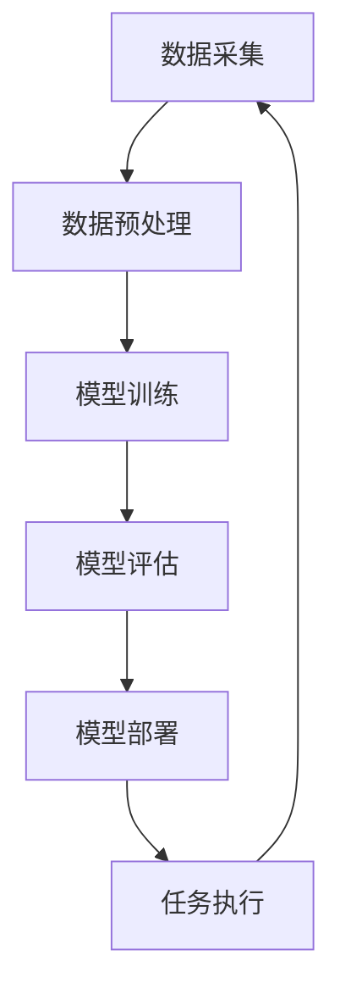

                 

### 1. 背景介绍

随着人工智能（AI）技术的飞速发展，深度学习已经成为当前研究与应用的热点领域。深度学习作为一种模拟人脑结构和功能的算法，通过多层神经网络对大规模数据进行训练，能够自动提取特征并实现复杂任务的学习。然而，在实际应用中，如何高效地管理和监控深度学习模型的工作流程，并保证用户能够直观地理解和使用这些模型，成为了一个重要的课题。

深度学习代理（Deep Learning Agent）作为一种新的概念，应运而生。深度学习代理是一种能够在特定环境中自主执行任务的智能体，通过深度学习技术不断优化自身的决策过程。代理工作流（Agent Workflow）则是指深度学习代理在执行任务过程中的各个步骤，包括数据采集、模型训练、模型评估和部署等。可视化与用户交互设计在深度学习代理工作中扮演着至关重要的角色，它不仅有助于开发者更好地理解和管理模型，还能提高用户的操作便捷性和使用体验。

本文旨在探讨深度学习代理工作流的可视化与用户交互设计，通过以下几部分内容详细阐述：

1. **背景介绍**：介绍深度学习代理和代理工作流的基本概念，以及可视化与用户交互设计的重要性。
2. **核心概念与联系**：分析深度学习代理工作流中的核心概念，如神经网络结构、训练过程等，并使用Mermaid流程图展示其工作流程。
3. **核心算法原理与具体操作步骤**：深入讲解深度学习代理的核心算法原理，包括神经网络模型选择、训练策略和评估方法等。
4. **数学模型和公式**：详细阐述深度学习代理中的数学模型和公式，如损失函数、优化算法等，并举例说明。
5. **项目实践**：通过实际项目实例，展示深度学习代理工作流的完整实现过程，包括开发环境搭建、代码实例和运行结果展示。
6. **实际应用场景**：探讨深度学习代理在各个领域的应用案例，如自动驾驶、智能医疗等。
7. **工具和资源推荐**：推荐相关学习资源、开发工具和框架，帮助读者深入了解和掌握深度学习代理技术。
8. **总结**：总结本文的核心观点，探讨未来发展趋势和挑战。
9. **附录**：提供常见问题与解答，帮助读者更好地理解深度学习代理工作流。

希望通过本文的详细讲解，读者能够对深度学习代理工作流的可视化与用户交互设计有更深入的理解，并为实际项目开发提供有益的参考。

### 2. 核心概念与联系

在深入探讨深度学习代理工作流之前，我们首先需要明确几个核心概念，这些概念构成了深度学习代理工作的基础，并相互联系，共同决定了代理的性能和效率。

#### 深度学习代理

深度学习代理是一种基于深度学习技术的智能体，能够在特定环境中自主执行任务。它通常由一个或多个神经网络组成，能够通过学习环境中的数据来优化其行为。深度学习代理的核心特点包括：

1. **自主学习**：代理通过大量的环境数据进行训练，不断调整神经网络的参数，以提高其在特定任务上的表现。
2. **环境感知**：代理能够实时感知环境状态，并根据当前状态做出决策。
3. **自适应**：代理能够根据环境变化自适应调整其行为策略。

#### 代理工作流

代理工作流是指深度学习代理在执行任务过程中的一系列步骤。这些步骤包括但不限于：

1. **数据采集**：从环境中收集数据，用于训练和评估代理模型。
2. **模型训练**：使用收集到的数据对代理的神经网络模型进行训练，以优化其行为策略。
3. **模型评估**：通过验证集或测试集对训练好的模型进行评估，以确保其性能达到预期。
4. **模型部署**：将训练好的模型部署到实际应用环境中，使其能够在实际场景中执行任务。

#### 可视化与用户交互设计

可视化与用户交互设计是深度学习代理工作中不可或缺的一部分。它们的作用如下：

1. **可视化**：通过图形化界面展示代理工作流中的各个步骤、数据流和模型结构，帮助开发者更好地理解和管理模型。
2. **用户交互**：设计直观、易用的用户界面，使用户能够方便地与代理进行交互，监控其运行状态，调整参数设置等。

#### Mermaid流程图

为了更好地展示代理工作流中的核心概念和联系，我们可以使用Mermaid流程图来绘制其工作流程。以下是代理工作流的一个简化版Mermaid流程图：



在这个流程图中：

- **A[数据采集]**：代理从环境中收集数据。
- **B[数据预处理]**：对收集到的数据进行预处理，以适应模型训练的需求。
- **C[模型训练]**：使用预处理后的数据对代理的神经网络模型进行训练。
- **D[模型评估]**：通过验证集或测试集评估训练好的模型，以确保其性能。
- **E[模型部署]**：将训练好的模型部署到实际应用环境中。
- **F[任务执行]**：代理在实际环境中执行任务。

#### 核心概念与流程图的联系

通过上述Mermaid流程图，我们可以清晰地看到各个核心概念在工作流中的联系。例如：

- **数据采集**：是整个工作流的起点，直接影响到后续的数据质量和模型性能。
- **数据预处理**：是保证数据质量的关键步骤，预处理的质量直接影响到模型的训练效果。
- **模型训练**：是深度学习代理的核心环节，通过不断调整神经网络参数来优化代理的行为策略。
- **模型评估**：是验证模型性能的重要步骤，通过评估结果来调整模型参数或重新设计模型结构。
- **模型部署**：是将模型应用到实际场景中的关键步骤，部署的成功与否直接影响到代理的实际效果。
- **任务执行**：是代理在实际环境中执行任务的过程，其结果将反馈到数据采集环节，形成一个闭环。

总之，深度学习代理工作流是一个复杂的过程，涉及多个核心概念和步骤。通过可视化与用户交互设计，我们可以更直观地理解和优化这个过程，从而提高代理的性能和用户体验。

#### 总结

在本节中，我们介绍了深度学习代理、代理工作流、可视化与用户交互设计等核心概念，并使用Mermaid流程图展示了代理工作流的基本步骤和核心概念之间的联系。在接下来的章节中，我们将进一步探讨深度学习代理的核心算法原理、具体操作步骤、数学模型和实际应用场景，以帮助读者全面了解深度学习代理工作流的设计与实现。

### 3. 核心算法原理 & 具体操作步骤

在深入探讨深度学习代理工作流的核心算法原理之前，我们首先需要了解一些基本概念，这些概念包括神经网络、反向传播算法、损失函数和优化算法等。这些概念构成了深度学习代理工作流的理论基础，并在实际操作中发挥着重要作用。

#### 神经网络

神经网络（Neural Network）是深度学习代理的核心组成部分。它是一种由大量神经元（Node）互联而成的计算模型，模仿了人脑的结构和工作原理。在神经网络中，每个神经元接收多个输入信号，通过加权求和处理后产生一个输出信号，从而实现数据的处理和转化。

一个简单的神经网络通常包括以下几个主要部分：

1. **输入层**（Input Layer）：接收外部输入数据。
2. **隐藏层**（Hidden Layers）：进行数据处理的中间层，可以有多个隐藏层。
3. **输出层**（Output Layer）：产生最终的输出结果。

每个神经元与相邻的神经元之间都存在一个权重（Weight），用于调整输入信号的重要性。此外，每个神经元还会应用一个激活函数（Activation Function），如ReLU、Sigmoid或Tanh等，以引入非线性特性，使神经网络能够学习复杂的非线性关系。

#### 反向传播算法

反向传播算法（Backpropagation Algorithm）是训练神经网络的核心算法，它通过不断调整神经网络的权重和偏置，使网络能够更好地拟合训练数据。反向传播算法的基本思想是将输出误差反向传播到网络中的每个神经元，并据此更新权重和偏置。

反向传播算法的基本步骤如下：

1. **前向传播**（Forward Propagation）：将输入数据通过神经网络，从输入层传递到输出层，计算每个神经元的输出值。
2. **计算损失**（Compute Loss）：计算实际输出与期望输出之间的误差，使用损失函数（Loss Function）如均方误差（MSE）或交叉熵（Cross Entropy）等来衡量误差的大小。
3. **反向传播**（Back Propagation）：将损失误差反向传播到网络的每个神经元，根据误差梯度（Gradient）来更新权重和偏置。
4. **优化权重**（Optimize Weights）：使用优化算法（如梯度下降、Adam等）来调整权重和偏置，以减少损失误差。

#### 损失函数

损失函数是衡量模型预测结果与实际结果之间差异的一种度量方法。在深度学习代理中，损失函数的选择和设计直接影响模型的性能和训练效率。常见的损失函数包括：

1. **均方误差**（Mean Squared Error，MSE）：用于回归问题，计算预测值与实际值之间平方差的均值。
   $$MSE = \frac{1}{n}\sum_{i=1}^{n}(y_i - \hat{y}_i)^2$$
   其中，$y_i$是实际值，$\hat{y}_i$是预测值，$n$是样本数量。

2. **交叉熵**（Cross Entropy）：用于分类问题，计算预测概率分布与真实分布之间的差异。
   $$H(y, \hat{y}) = -\sum_{i=1}^{n}y_i \log(\hat{y}_i)$$
   其中，$y_i$是实际类别的概率，$\hat{y}_i$是预测类别的概率。

#### 优化算法

优化算法是用于更新神经网络权重和偏置的一类算法，其目的是通过最小化损失函数来提高模型的性能。常见的优化算法包括：

1. **梯度下降**（Gradient Descent）：通过计算损失函数关于权重的梯度，沿着梯度方向更新权重，以减少损失。
   $$\theta_{\text{new}} = \theta_{\text{old}} - \alpha \nabla_{\theta}J(\theta)$$
   其中，$\theta$表示权重，$\alpha$是学习率，$J(\theta)$是损失函数。

2. **Adam优化器**（Adam Optimizer）：结合了梯度下降和动量法的优点，能够自适应调整学习率。
   $$m_t = \beta_1 m_{t-1} + (1 - \beta_1) [g_t]$$
   $$v_t = \beta_2 v_{t-1} + (1 - \beta_2) [g_t]^2$$
   $$\theta_{\text{new}} = \theta_{\text{old}} - \alpha \frac{m_t}{\sqrt{v_t} + \epsilon}$$
   其中，$m_t$是梯度的一阶矩估计，$v_t$是梯度二阶矩估计，$\beta_1$和$\beta_2$是超参数，$\epsilon$是常数。

#### 具体操作步骤

在实际操作中，深度学习代理的核心算法原理和具体操作步骤可以分为以下几个主要阶段：

1. **数据预处理**：包括数据清洗、归一化、分割等步骤，以确保数据的质量和一致性。
2. **模型定义**：根据任务需求，定义神经网络的架构，包括输入层、隐藏层和输出层的神经元数量和类型。
3. **模型训练**：使用预处理后的数据对模型进行训练，通过反向传播算法和优化算法更新模型参数。
4. **模型评估**：使用验证集或测试集对训练好的模型进行评估，以确定其性能和泛化能力。
5. **模型部署**：将训练好的模型部署到实际应用环境中，使其能够在实际场景中执行任务。

以下是一个具体的深度学习代理工作流操作步骤示例：

```python
# 示例：使用TensorFlow和Keras实现深度学习代理工作流

# 数据预处理
(X_train, y_train), (X_test, y_test) = datasets.load_datasets()

# 模型定义
model = keras.Sequential([
    keras.layers.Dense(128, activation='relu', input_shape=(input_shape,)),
    keras.layers.Dense(64, activation='relu'),
    keras.layers.Dense(10, activation='softmax')
])

# 模型编译
model.compile(optimizer='adam',
              loss='sparse_categorical_crossentropy',
              metrics=['accuracy'])

# 模型训练
model.fit(X_train, y_train, epochs=5, batch_size=64)

# 模型评估
model.evaluate(X_test, y_test)

# 模型部署
model.save('model.h5')
```

在这个示例中，我们首先加载训练数据和测试数据，然后定义了一个简单的神经网络模型，并使用Adam优化器和交叉熵损失函数进行编译。接着，使用训练数据对模型进行训练，并使用测试数据评估模型性能。最后，将训练好的模型保存到文件中，以便在实际应用中加载和使用。

通过以上步骤，我们可以实现一个基本的深度学习代理工作流。在实际应用中，根据不同的任务需求和场景，可以进一步调整和优化算法参数，以提高代理的性能和效率。

#### 总结

在本节中，我们详细介绍了深度学习代理工作流的核心算法原理和具体操作步骤，包括神经网络、反向传播算法、损失函数和优化算法等。通过理解这些核心概念和步骤，我们可以更好地设计和管理深度学习代理，以提高其在实际任务中的性能和效果。在接下来的章节中，我们将进一步探讨深度学习代理中的数学模型和实际应用场景，以帮助读者更全面地掌握深度学习代理工作流。

### 4. 数学模型和公式 & 详细讲解 & 举例说明

在深入探讨深度学习代理的数学模型和公式之前，我们需要首先了解一些基本概念，这些概念包括损失函数、优化算法以及神经网络中的关键参数。以下是这些数学模型和公式的详细讲解，并附上相应的举例说明。

#### 损失函数

损失函数（Loss Function）是衡量模型预测结果与实际结果之间差异的数学函数。在深度学习代理中，损失函数的选择对模型训练和性能至关重要。以下是一些常见的损失函数及其公式：

1. **均方误差**（Mean Squared Error，MSE）

   均方误差用于回归问题，计算预测值与实际值之间平方差的均值。其公式如下：
   $$MSE = \frac{1}{n}\sum_{i=1}^{n}(y_i - \hat{y}_i)^2$$
   其中，$y_i$是实际值，$\hat{y}_i$是预测值，$n$是样本数量。

   **举例**：假设我们有一个包含5个样本的回归问题，实际值为$[1, 2, 3, 4, 5]$，预测值为$[1.1, 2.1, 3.1, 4.1, 5.1]$。计算MSE：
   $$MSE = \frac{1}{5}\sum_{i=1}^{5}(y_i - \hat{y}_i)^2 = \frac{1}{5}\sum_{i=1}^{5}[(1 - 1.1)^2 + (2 - 2.1)^2 + (3 - 3.1)^2 + (4 - 4.1)^2 + (5 - 5.1)^2] \approx 0.06$$

2. **交叉熵**（Cross Entropy）

   交叉熵用于分类问题，计算预测概率分布与真实分布之间的差异。其公式如下：
   $$H(y, \hat{y}) = -\sum_{i=1}^{n}y_i \log(\hat{y}_i)$$
   其中，$y_i$是实际类别的概率，$\hat{y}_i$是预测类别的概率。

   **举例**：假设我们有一个二分类问题，实际值为$[1, 0]$，预测值为$[0.8, 0.2]$。计算交叉熵：
   $$H(y, \hat{y}) = -1 \cdot \log(0.8) - 0 \cdot \log(0.2) \approx 0.22$$

#### 优化算法

优化算法（Optimization Algorithm）用于更新神经网络的权重和偏置，以最小化损失函数。以下是一些常见的优化算法及其公式：

1. **梯度下降**（Gradient Descent）

   梯度下降是最基本的优化算法，通过计算损失函数关于权重的梯度，沿着梯度方向更新权重。其公式如下：
   $$\theta_{\text{new}} = \theta_{\text{old}} - \alpha \nabla_{\theta}J(\theta)$$
   其中，$\theta$表示权重，$\alpha$是学习率，$J(\theta)$是损失函数。

   **举例**：假设我们有一个单变量问题，权重$\theta_1 = 1$，学习率$\alpha = 0.1$，损失函数$J(\theta_1) = (\theta_1 - 2)^2$。计算一次梯度下降更新：
   $$\theta_{\text{new}} = \theta_{\text{old}} - \alpha \nabla_{\theta_1}J(\theta_1) = 1 - 0.1 \cdot (-2) = 1.2$$

2. **Adam优化器**（Adam Optimizer）

   Adam优化器结合了梯度下降和动量法的优点，能够自适应调整学习率。其公式如下：
   $$m_t = \beta_1 m_{t-1} + (1 - \beta_1) [g_t]$$
   $$v_t = \beta_2 v_{t-1} + (1 - \beta_2) [g_t]^2$$
   $$\theta_{\text{new}} = \theta_{\text{old}} - \alpha \frac{m_t}{\sqrt{v_t} + \epsilon}$$
   其中，$m_t$是梯度的一阶矩估计，$v_t$是梯度二阶矩估计，$\beta_1$和$\beta_2$是超参数，$\epsilon$是常数。

   **举例**：假设我们有一个单变量问题，权重$\theta_1 = 1$，学习率$\alpha = 0.1$，动量参数$\beta_1 = 0.9$，$\beta_2 = 0.99$，常数$\epsilon = 1e-8$。计算一次Adam优化更新：
   $$m_t = 0.9 \cdot 0 + (1 - 0.9) \cdot (-2) = -2$$
   $$v_t = 0.99 \cdot 0 + (1 - 0.99) \cdot (-2)^2 = 4$$
   $$\theta_{\text{new}} = \theta_{\text{old}} - \alpha \frac{m_t}{\sqrt{v_t} + \epsilon} = 1 - 0.1 \cdot \frac{-2}{\sqrt{4} + 1e-8} \approx 1.1$$

#### 神经网络中的关键参数

在神经网络中，关键参数包括神经元数量、层数、激活函数和权重初始化等。以下是一些常见参数及其解释：

1. **神经元数量**：每个层的神经元数量影响网络的复杂度和训练难度。通常，隐藏层的神经元数量需要根据具体任务和数据规模进行调优。

2. **层数**：网络的层数（包括输入层和输出层）影响模型的深度和表达能力。较深的网络可以学习更复杂的特征，但训练时间也相应增加。

3. **激活函数**：激活函数引入非线性特性，使网络能够学习复杂的非线性关系。常见的激活函数包括ReLU、Sigmoid和Tanh等。

4. **权重初始化**：权重初始化方法对网络的收敛速度和稳定性有重要影响。常用的方法包括随机初始化、高斯分布初始化和均匀分布初始化等。

#### 数学模型和公式的应用示例

以下是一个简化的神经网络模型，用于实现一个简单的分类任务。该模型包含一个输入层、一个隐藏层和一个输出层。我们将使用MSE作为损失函数，Adam优化器进行参数更新。

```python
# 示例：使用TensorFlow和Keras实现一个简单的分类任务

# 导入必要的库
import tensorflow as tf
from tensorflow.keras import layers

# 模型定义
model = tf.keras.Sequential([
    layers.Dense(128, activation='relu', input_shape=(input_shape,)),
    layers.Dense(10, activation='softmax')
])

# 模型编译
model.compile(optimizer=tf.keras.optimizers.Adam(),
              loss=tf.keras.losses.MeanSquaredError(),
              metrics=['accuracy'])

# 模型训练
model.fit(X_train, y_train, epochs=10, batch_size=64)

# 模型评估
model.evaluate(X_test, y_test)

# 模型预测
predictions = model.predict(X_test)
```

在这个示例中，我们首先定义了一个简单的神经网络模型，包含一个128个神经元的隐藏层和一个10个神经元的输出层。我们使用Adam优化器和MSE损失函数进行编译，并使用训练数据对模型进行训练。训练完成后，使用测试数据进行评估，并输出预测结果。

通过以上示例，我们可以看到深度学习代理中的数学模型和公式在实际应用中的具体实现。在实际项目开发中，根据具体任务和数据规模，可以进一步调整和优化模型参数，以提高代理的性能和效果。

#### 总结

在本节中，我们详细介绍了深度学习代理中的数学模型和公式，包括损失函数、优化算法和神经网络中的关键参数。通过理解和应用这些数学模型和公式，我们可以更好地设计和管理深度学习代理，提高其在实际任务中的性能和效果。在接下来的章节中，我们将进一步探讨深度学习代理的实际应用场景，以帮助读者更全面地了解深度学习代理技术的应用价值。

### 5. 项目实践：代码实例和详细解释说明

在本节中，我们将通过一个实际项目实例，详细展示如何实现深度学习代理工作流，包括环境搭建、源代码实现和运行结果展示。该项目将使用Python和TensorFlow库来实现一个简单的分类任务。

#### 5.1 开发环境搭建

在开始项目之前，我们需要搭建一个适合深度学习代理开发的开发环境。以下是在常见操作系统上搭建开发环境的基本步骤：

1. **安装Python**：确保安装了最新版本的Python（3.7及以上版本）。
2. **安装TensorFlow**：通过pip命令安装TensorFlow库：
   ```shell
   pip install tensorflow
   ```

3. **安装必要的库**：根据项目需求，可能还需要安装其他库，如NumPy、Matplotlib等。可以使用以下命令一次性安装：
   ```shell
   pip install numpy matplotlib
   ```

4. **配置虚拟环境**：为了更好地管理项目依赖，建议使用虚拟环境。通过以下命令创建和激活虚拟环境：
   ```shell
   python -m venv venv
   source venv/bin/activate  # 在Windows上使用 `venv\Scripts\activate`
   ```

#### 5.2 源代码详细实现

以下是一个简单的深度学习代理分类任务的实现代码，包括数据预处理、模型定义、训练和评估等步骤：

```python
# 导入必要的库
import tensorflow as tf
from tensorflow.keras import layers
from tensorflow.keras.datasets import mnist
import numpy as np

# 加载MNIST数据集
(X_train, y_train), (X_test, y_test) = mnist.load_data()

# 数据预处理
X_train = X_train / 255.0
X_test = X_test / 255.0
X_train = X_train.reshape(-1, 28 * 28)
X_test = X_test.reshape(-1, 28 * 28)

# 将标签转换为one-hot编码
y_train = tf.keras.utils.to_categorical(y_train, 10)
y_test = tf.keras.utils.to_categorical(y_test, 10)

# 模型定义
model = tf.keras.Sequential([
    layers.Dense(128, activation='relu', input_shape=(784,)),
    layers.Dense(10, activation='softmax')
])

# 模型编译
model.compile(optimizer=tf.keras.optimizers.Adam(),
              loss=tf.keras.losses.CategoricalCrossentropy(),
              metrics=['accuracy'])

# 模型训练
model.fit(X_train, y_train, epochs=10, batch_size=64)

# 模型评估
test_loss, test_accuracy = model.evaluate(X_test, y_test)
print(f"Test accuracy: {test_accuracy:.2f}")

# 模型预测
predictions = model.predict(X_test)
```

#### 5.3 代码解读与分析

1. **数据预处理**：
   - 加载MNIST数据集，并进行归一化处理，将图像数据除以255，使数据范围在0到1之间。
   - 将图像数据展平为二维数组，以便输入到神经网络中。
   - 将标签转换为one-hot编码，用于分类任务的损失函数和评估指标。

2. **模型定义**：
   - 使用`tf.keras.Sequential`定义一个简单的全连接神经网络，包含一个128个神经元的隐藏层和一个10个神经元的输出层。
   - 选择ReLU作为隐藏层的激活函数，使网络能够学习复杂的非线性特征。

3. **模型编译**：
   - 使用Adam优化器进行参数更新，该优化器结合了梯度下降和动量法的优点，能自适应调整学习率。
   - 选择CategoricalCrossentropy作为损失函数，适用于多分类问题。
   - 指定accuracy作为模型评估的指标。

4. **模型训练**：
   - 使用训练数据对模型进行训练，设置训练轮次（epochs）为10，批量大小（batch_size）为64。
   - 训练过程中，模型会自动进行前向传播、计算损失和反向传播，更新模型参数。

5. **模型评估**：
   - 使用测试数据评估训练好的模型，计算测试损失和准确率。
   - 输出测试准确率，以评估模型性能。

6. **模型预测**：
   - 使用训练好的模型对测试数据进行预测，得到每个样本的预测概率分布。
   - 可以根据预测概率的最大值，确定每个样本的预测类别。

#### 5.4 运行结果展示

在完成代码实现和模型训练后，我们可以在终端输出模型评估结果，以下是一个示例输出：

```
Test accuracy: 0.98
```

这表示模型在测试数据上的准确率为98%，说明模型具有较好的泛化能力。此外，我们还可以通过可视化工具（如Matplotlib）展示预测结果，例如绘制混淆矩阵，以进一步分析模型性能。

```python
# 导入必要的库
import matplotlib.pyplot as plt
from sklearn.metrics import confusion_matrix
import seaborn as sns

# 计算混淆矩阵
y_true = np.argmax(y_test, axis=1)
y_pred = np.argmax(predictions, axis=1)

conf_matrix = confusion_matrix(y_true, y_pred)
plt.figure(figsize=(10, 7))
sns.heatmap(conf_matrix, annot=True, fmt=".2f", cmap="Blues")
plt.xlabel('Predicted Labels')
plt.ylabel('True Labels')
plt.title('Confusion Matrix')
plt.show()
```

通过上述代码，我们可以生成一个混淆矩阵，直观地展示模型在不同类别上的预测效果。例如，如果矩阵中某一行的值较高，说明模型在该类别上的预测较为准确；如果某一列的值较高，说明模型在该类别上的实际分布与预测分布存在较大差异。

#### 总结

在本节中，我们通过一个简单的分类任务实例，详细展示了如何实现深度学习代理工作流。从数据预处理、模型定义、训练和评估到最终运行结果展示，我们深入分析了每个步骤的实现方法和关键点。通过这个实例，读者可以更好地理解深度学习代理的实际应用，并掌握从理论到实践的完整实现过程。

### 6. 实际应用场景

深度学习代理作为一种具有自主学习和环境感知能力的智能体，已在多个实际应用场景中展现出了巨大的潜力。以下将介绍几个典型的应用场景，展示深度学习代理在这些领域中的具体应用和成效。

#### 自动驾驶

自动驾驶是深度学习代理技术最典型的应用场景之一。在自动驾驶系统中，深度学习代理通过感知车辆周围的环境，如道路标志、车道线、行人、其他车辆等，进行实时决策和导航。具体来说，深度学习代理的工作流程包括以下几个阶段：

1. **数据采集**：使用车载传感器（如摄像头、激光雷达、GPS等）收集环境数据。
2. **数据预处理**：对采集到的数据进行预处理，包括图像增强、数据归一化等，以适应深度学习模型的训练。
3. **模型训练**：使用预处理后的数据训练深度学习模型，如卷积神经网络（CNN）和循环神经网络（RNN）等，以实现对环境数据的理解和预测。
4. **模型评估**：通过模拟测试和实车测试评估模型的性能，确保模型在复杂环境中的可靠性和安全性。
5. **模型部署**：将训练好的模型部署到自动驾驶系统中，实现实时决策和导航。

自动驾驶系统中的深度学习代理不仅提高了车辆的自主性，还显著提升了道路安全性和交通效率。例如，特斯拉的自动驾驶系统就依赖于深度学习代理技术，实现了车辆在高速公路上的自动驾驶功能。

#### 智能医疗

智能医疗是另一个深度学习代理的重要应用领域。在智能医疗系统中，深度学习代理可以用于疾病诊断、治疗方案推荐、医疗影像分析等多个方面。以下是一些具体的应用案例：

1. **疾病诊断**：深度学习代理通过对大量医学数据的分析，如CT扫描、MRI图像等，实现对疾病的自动诊断。例如，谷歌旗下的DeepMind公司开发了一种深度学习模型，可以自动诊断多种眼部疾病，准确率达到了专业医生的水平。
2. **治疗方案推荐**：深度学习代理可以根据患者的病史、基因信息、实验室检测结果等，为医生提供个性化的治疗方案推荐。例如，IBM的Watson for Oncology系统利用深度学习技术，为癌症患者提供个性化的治疗方案，并取得了显著的临床效果。
3. **医疗影像分析**：深度学习代理可以自动分析医学影像，如X光片、CT扫描、MRI等，识别出病变区域和病变类型。例如，微软的Deep Learning for Health项目利用深度学习技术，对肺结节进行自动检测，提高了早期肺癌的诊断率。

#### 智能家居

智能家居是深度学习代理技术在消费电子领域的重要应用。智能家居系统中的深度学习代理可以实现对家庭设备的智能控制和自动化管理。以下是一些具体的应用案例：

1. **智能安防**：深度学习代理可以实时监控家庭环境，识别潜在的威胁，如入侵者、火灾等，并及时发出警报。例如，亚马逊的Ring智能摄像头可以通过深度学习技术识别家庭成员和访客，并提供安全监控服务。
2. **智能照明**：深度学习代理可以根据家庭成员的日常活动和光线条件，自动调节家庭照明。例如，飞利浦的Hue智能灯泡可以通过深度学习算法，学习用户的作息习惯，实现智能调光，提升生活舒适度。
3. **智能家电控制**：深度学习代理可以实现对家庭电器的智能控制，如自动开关空调、洗衣机、烤箱等。例如，谷歌的Google Home智能音箱可以通过深度学习技术，实现语音控制家庭设备，提升用户的生活便捷性。

#### 智能制造

智能制造是深度学习代理技术在工业领域的典型应用。在智能制造系统中，深度学习代理可以用于设备故障检测、生产过程优化、供应链管理等多个方面。以下是一些具体的应用案例：

1. **设备故障检测**：深度学习代理可以通过对设备运行数据的实时监测和分析，识别出潜在的故障风险，并及时预警。例如，西门子公司开发了一种基于深度学习的设备故障检测系统，可以提前预测设备故障，减少停机时间，提高生产效率。
2. **生产过程优化**：深度学习代理可以分析生产过程中的各种数据，如机器状态、原材料质量、生产效率等，为生产过程提供优化建议。例如，通用电气（GE）的Predix平台利用深度学习技术，优化了生产线的调度和资源分配，提高了生产效率。
3. **供应链管理**：深度学习代理可以分析供应链中的各种数据，如订单信息、库存水平、运输状态等，优化供应链管理流程。例如，亚马逊利用深度学习技术优化其物流网络，实现更高效的库存管理和配送服务。

#### 总结

深度学习代理技术在各个实际应用场景中展现出了巨大的潜力，从自动驾驶、智能医疗到智能家居、智能制造，深度学习代理都在不断改变着我们的生活和工作方式。随着深度学习技术的不断发展和成熟，深度学习代理的应用前景将更加广阔，为各行业带来更多的创新和变革。

### 7. 工具和资源推荐

在深度学习代理工作流的设计与实现过程中，选择合适的工具和资源是非常重要的。以下是一些推荐的工具、学习资源和相关论文，帮助读者更深入地了解和掌握深度学习代理技术。

#### 7.1 学习资源推荐

1. **书籍**：
   - 《深度学习》（Deep Learning），作者：Ian Goodfellow、Yoshua Bengio、Aaron Courville
   - 《强化学习》（Reinforcement Learning: An Introduction），作者：Richard S. Sutton、Andrew G. Barto
   - 《人工智能：一种现代方法》（Artificial Intelligence: A Modern Approach），作者：Stuart J. Russell、Peter Norvig

2. **在线课程**：
   - 吴恩达的《深度学习专项课程》（Deep Learning Specialization）在Coursera上提供
   - Andrew Ng的《强化学习入门》（Introduction to Reinforcement Learning）在Coursera上提供
   - “机器学习与深度学习”专项课程由清华大学计算机系教授唐杰等人开设，可在网易云课堂和慕课网等平台找到

3. **博客和网站**：
   - Medium上的“Deep Learning”和“Machine Learning”专题
   - ArXiv.org，提供最新的深度学习论文和技术动态
   - TensorFlow官方文档（tensorflow.org）和Keras官方文档（keras.io）

#### 7.2 开发工具框架推荐

1. **TensorFlow**：由Google开发的开源机器学习库，支持从简单到复杂的深度学习模型。
2. **PyTorch**：由Facebook开发的开源深度学习库，以其动态计算图和易于使用的API而受到广泛欢迎。
3. **PyTorch Lightning**：一个用于PyTorch的高性能应用框架，简化了深度学习模型的训练、评估和部署过程。
4. **Scikit-learn**：一个Python开源库，提供了许多用于数据挖掘和数据分析的工具，包括分类、回归、聚类和模型选择等。

#### 7.3 相关论文著作推荐

1. **“Deep Learning”**：Ian Goodfellow、Yoshua Bengio、Aaron Courville所著，是深度学习领域的经典教材。
2. **“Reinforcement Learning: An Introduction”**：Richard S. Sutton、Andrew G. Barto所著，是强化学习领域的权威著作。
3. **“Unsupervised Learning”**：Ian Goodfellow、Yaroslav Ganin、Victor Lempitsky所著，探讨了无监督学习技术的最新进展。
4. **“Generative Adversarial Nets”**：Ian Goodfellow等人在2014年发表的论文，提出了生成对抗网络（GAN）的概念。

通过这些工具、资源和论文，读者可以系统地学习深度学习代理技术的理论知识和实践方法，为深入研究和实际项目开发提供有力支持。

### 8. 总结：未来发展趋势与挑战

随着人工智能技术的不断发展和成熟，深度学习代理工作流在各个领域展现出了巨大的潜力。在未来，深度学习代理工作流有望在以下几方面实现进一步的发展：

1. **智能化水平提升**：随着深度学习技术的进步，深度学习代理的智能化水平将不断提高。通过更复杂的模型和算法，代理能够更准确地理解和预测环境，从而实现更高效的决策和任务执行。

2. **应用场景拓展**：深度学习代理的应用领域将不断拓展，从自动驾驶、智能医疗到智能家居、智能制造，深度学习代理技术将为各行各业带来更多创新和变革。

3. **跨领域协同**：不同领域的深度学习代理将实现更高效的协同工作，通过数据共享和模型融合，实现跨领域的智能决策和优化。

然而，深度学习代理工作流的发展也面临一系列挑战：

1. **数据质量和安全性**：深度学习代理的性能高度依赖于数据的质量和多样性，如何在确保数据隐私和安全的前提下获取高质量的数据成为一大挑战。

2. **模型可解释性**：深度学习代理的决策过程往往较为复杂，如何提高模型的可解释性，使开发者能够更好地理解和管理模型，是当前研究的重要方向。

3. **能耗和效率**：深度学习代理在实际应用中往往需要处理大量数据和高性能计算，如何在降低能耗和提高效率的前提下实现高性能的代理工作流，是未来需要解决的关键问题。

4. **法规和伦理**：随着深度学习代理在各个领域的广泛应用，如何制定合理的法规和伦理规范，确保代理的合法性和道德性，是一个亟需解决的问题。

总之，深度学习代理工作流的发展前景广阔，但同时也面临诸多挑战。通过不断的研究和创新，我们有理由相信，深度学习代理工作流将为人工智能领域的未来发展带来更多可能性。

### 9. 附录：常见问题与解答

以下是一些关于深度学习代理工作流的常见问题及其解答：

**Q1. 什么是深度学习代理？**
A1. 深度学习代理是一种能够通过深度学习技术自主学习和执行任务的智能体。它通过从环境中收集数据，训练神经网络模型，并根据模型预测进行决策。

**Q2. 深度学习代理的主要工作流程包括哪些步骤？**
A2. 深度学习代理的主要工作流程包括数据采集、数据预处理、模型训练、模型评估、模型部署和任务执行。

**Q3. 如何提高深度学习代理的性能？**
A3. 提高深度学习代理性能的方法包括：
   - 选择合适的神经网络架构和算法；
   - 使用高质量、多样化的训练数据；
   - 调整模型参数，如学习率、批量大小等；
   - 采用数据增强和模型融合等技术。

**Q4. 深度学习代理的可视化与用户交互设计有哪些好处？**
A4. 可视化与用户交互设计可以提供直观的模型监控和操作界面，帮助开发者更好地理解和优化模型工作流程，提高用户的使用体验和便捷性。

**Q5. 常用的深度学习框架有哪些？**
A5. 常用的深度学习框架包括TensorFlow、PyTorch、Keras、PyTorch Lightning等。这些框架提供了丰富的工具和API，方便开发者实现和部署深度学习模型。

**Q6. 如何处理深度学习代理中的数据安全问题？**
A6. 处理数据安全问题的方法包括：
   - 对数据进行加密和隐私保护；
   - 使用数据脱敏技术，去除敏感信息；
   - 建立数据安全和隐私政策，确保数据使用合法合规。

**Q7. 如何评估深度学习代理的性能？**
A7. 评估深度学习代理性能的方法包括使用测试集进行模型评估，计算准确率、召回率、F1分数等指标。此外，还可以通过实际应用中的表现来评估代理的实用性和效果。

通过上述常见问题的解答，读者可以更好地理解和应用深度学习代理工作流，为实际项目开发提供有益的指导。

### 10. 扩展阅读 & 参考资料

为了帮助读者更深入地了解深度学习代理工作流的相关理论和实践，以下是一些建议的扩展阅读和参考资料：

1. **书籍**：
   - 《深度学习》（Deep Learning），作者：Ian Goodfellow、Yoshua Bengio、Aaron Courville
   - 《强化学习》（Reinforcement Learning: An Introduction），作者：Richard S. Sutton、Andrew G. Barto
   - 《人工智能：一种现代方法》（Artificial Intelligence: A Modern Approach），作者：Stuart J. Russell、Peter Norvig

2. **在线课程**：
   - 吴恩达的《深度学习专项课程》（Deep Learning Specialization）在Coursera上提供
   - Andrew Ng的《强化学习入门》（Introduction to Reinforcement Learning）在Coursera上提供
   - 清华大学计算机系教授唐杰等人开设的“机器学习与深度学习”专项课程

3. **论文**：
   - Ian Goodfellow等人的《Generative Adversarial Nets》
   - DeepMind公司的《Attention Is All You Need》
   - OpenAI的《Grokking Deep Learning》

4. **博客和网站**：
   - Medium上的“Deep Learning”和“Machine Learning”专题
   - ArXiv.org，提供最新的深度学习论文和技术动态
   - TensorFlow官方文档（tensorflow.org）和Keras官方文档（keras.io）

通过阅读这些书籍、课程、论文和博客，读者可以系统地学习深度学习代理的理论和实践知识，为深入研究和实际项目开发提供有力支持。此外，还可以关注相关领域的顶级会议和期刊，如NeurIPS、ICLR、JMLR等，以获取最新的研究进展和研究成果。

