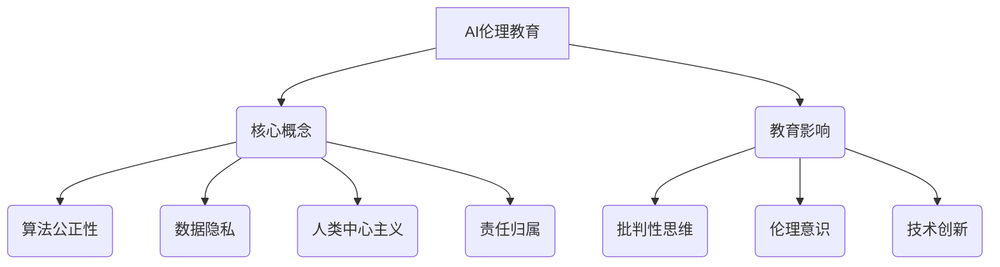

                 

关键词：AI伦理、教育实践、课程设置、案例教学、人工智能道德、技术教育、伦理教育

> 摘要：随着人工智能（AI）技术的迅猛发展，伦理问题日益凸显。本文将探讨如何在教育领域实践AI伦理教育，包括伦理课程设置和案例教学的方法。通过分析当前教育体系中AI伦理教育的现状，提出构建AI伦理课程体系的思路，并以具体案例为线索，说明如何通过案例教学引导学生理解和应对AI伦理挑战。

## 1. 背景介绍

人工智能技术已经深刻改变了我们的生活方式，从智能手机到自动驾驶汽车，从医疗诊断到金融决策，AI的应用无处不在。然而，随着AI技术的普及，一系列伦理问题也随之而来，包括隐私保护、算法偏见、自动化失业、武器化AI等。这些问题不仅影响技术本身的发展，也对社会伦理、法律、政策等方面提出了新的挑战。

在全球范围内，教育体系正在逐步引入AI伦理教育，旨在培养学生对AI技术的批判性思维和伦理意识。然而，如何有效地进行AI伦理教育仍然是一个亟待解决的问题。本文旨在探讨AI伦理教育的实践路径，包括课程设置和案例教学，为教育工作者提供理论指导和实践参考。

### 1.1 AI伦理的挑战

AI伦理的挑战主要表现在以下几个方面：

- **隐私保护**：AI技术依赖于大量的个人数据，如何保护用户隐私成为伦理问题的重要组成部分。

- **算法偏见**：算法在训练过程中可能会受到数据偏差的影响，导致算法输出结果存在偏见，从而对特定群体造成不公平待遇。

- **自动化失业**：随着AI技术的发展，许多传统职业可能会被自动化取代，引发就业和社会稳定的问题。

- **武器化AI**：AI技术在军事领域的应用可能导致新型武器的发展，引发伦理和安全问题。

### 1.2 当前教育体系中的AI伦理教育现状

目前，全球许多国家的教育体系已经开始关注AI伦理教育。例如，欧盟发布了《人工智能伦理准则》，要求将AI伦理教育纳入学校课程。美国一些高校如麻省理工学院、斯坦福大学等也开设了AI伦理课程。然而，整体来看，AI伦理教育在课程设置、教学方法、师资培训等方面还存在以下问题：

- **课程内容缺乏系统性**：多数课程只是零散地讨论AI伦理问题，缺乏系统性。

- **教学方法单一**：多数课程采用传统的讲授方式，缺乏互动和实践。

- **师资短缺**：具备AI伦理知识和教学经验的教师相对较少。

## 2. 核心概念与联系

### 2.1 AI伦理的核心概念

AI伦理涉及多个核心概念，包括：

- **算法公正性**：确保算法决策的公平、透明和可解释性。

- **数据隐私**：保护用户的个人数据不被滥用。

- **人类中心主义**：强调AI技术应服务于人类，而非取代人类。

- **责任归属**：明确AI技术中的责任主体，如开发者、使用者等。

### 2.2 AI伦理与教育的关系

AI伦理教育不仅是培养学生技术技能的一部分，更是培养学生社会责任感和道德判断力的关键。通过AI伦理教育，学生可以：

- **培养批判性思维**：对AI技术的潜在影响进行深入思考。

- **增强伦理意识**：认识到AI技术可能带来的社会问题，并采取行动解决。

- **促进技术创新**：在研发过程中考虑伦理因素，推动技术进步。

### 2.3 Mermaid 流程图



## 3. 核心算法原理 & 具体操作步骤

### 3.1 算法原理概述

AI伦理教育的核心在于培养学生的批判性思维和伦理意识。具体操作步骤包括：

- **案例教学**：通过真实案例引导学生分析AI伦理问题。

- **讨论与辩论**：组织学生进行讨论和辩论，加深对伦理问题的理解。

- **实践项目**：让学生参与实际项目，将伦理原则应用于实践。

### 3.2 算法步骤详解

#### 3.2.1 案例教学

1. **选择案例**：选择与AI伦理相关的典型案例，如算法偏见、数据隐私泄露等。

2. **案例分析**：引导学生分析案例，探讨其中的伦理问题。

3. **讨论与反思**：组织学生进行讨论，反思案例中的行为和决策。

#### 3.2.2 讨论与辩论

1. **提出议题**：根据案例，提出具体的伦理议题。

2. **分组讨论**：将学生分成小组，进行讨论。

3. **辩论比赛**：组织辩论比赛，让学生展示自己的观点。

#### 3.2.3 实践项目

1. **项目设计**：设计一个实际项目，要求学生考虑伦理因素。

2. **项目实施**：指导学生实施项目，并记录过程中的伦理决策。

3. **项目评估**：评估学生的项目，讨论其中的伦理问题。

### 3.3 算法优缺点

#### 优点

- **增强伦理意识**：通过案例教学和讨论，学生可以更好地理解AI伦理问题。

- **培养批判性思维**：引导学生对AI技术进行深入思考，培养批判性思维。

- **实践能力提升**：通过实际项目，学生可以将伦理原则应用于实践中。

#### 缺点

- **教师要求高**：需要具备丰富的AI伦理知识和教学经验。

- **时间成本高**：案例教学和实践项目需要较多时间和精力。

### 3.4 算法应用领域

AI伦理教育的算法原理和应用领域主要包括：

- **高等教育**：在大学和研究生阶段开设AI伦理课程。

- **职业教育**：在培训机构中引入AI伦理教育，培养具备伦理意识的专业人才。

- **中小学教育**：通过科普活动和课程，培养学生的伦理意识。

## 4. 数学模型和公式 & 详细讲解 & 举例说明

### 4.1 数学模型构建

AI伦理教育中的数学模型主要涉及伦理决策分析。以下是一个简单的伦理决策模型：

```latex
\begin{equation}
    \text{EthicalDecision} = \text{Utilitarianism} + \text{Justice} + \text{Human-Centered Approach}
\end{equation}
```

#### 4.1.1 Utilitarianism（功利主义）

功利主义强调最大多数人的幸福，即选择能够带来最大利益的行为。

#### 4.1.2 Justice（正义）

正义关注公平和公正，要求在决策过程中考虑所有相关方的利益。

#### 4.1.3 Human-Centered Approach（以人为本的方法）

以人为本的方法强调将人类的需求和福祉放在首位，确保AI技术的发展符合人类利益。

### 4.2 公式推导过程

伦理决策公式是通过整合不同伦理原则推导出来的。首先，定义三个基本伦理原则：

- **Utilitarianism**：U(x) 表示行为 x 的功利主义值。
- **Justice**：J(x) 表示行为 x 的正义值。
- **Human-Centered Approach**：H(x) 表示行为 x 的人类中心主义值。

伦理决策公式可以表示为：

```latex
\begin{equation}
    \text{EthicalDecision}(x) = U(x) + J(x) + H(x)
\end{equation}
```

### 4.3 案例分析与讲解

#### 案例背景

某公司开发了一款基于AI的招聘系统，用于筛选求职者。然而，该系统在训练过程中使用了有偏见的数据集，导致对某些特定群体的筛选结果存在不公平。

#### 案例分析

1. **功利主义分析**：如果仅考虑招聘效果，使用有偏见的数据集可能会提高招聘效率。然而，这种做法会损害某些求职者的利益，从长远来看，可能会导致公司声誉受损。

2. **正义分析**：招聘过程应公平对待所有求职者，避免因为数据偏见而对某些群体造成不公平待遇。

3. **以人为本的方法**：公司的目标是服务于求职者和雇主，确保招聘过程的公正和透明，以满足双方的需求。

根据伦理决策公式，我们可以得出以下结论：

- **最优决策**：公司应重新审视数据集，确保其不包含偏见，以实现功利主义、正义和以人为本的目标。

## 5. 项目实践：代码实例和详细解释说明

### 5.1 开发环境搭建

为了进行AI伦理教育的项目实践，我们需要搭建一个基础的开发环境。以下是所需的环境和工具：

- **编程语言**：Python
- **人工智能库**：TensorFlow、Keras
- **数据分析库**：Pandas、NumPy
- **可视化库**：Matplotlib、Seaborn

### 5.2 源代码详细实现

以下是实现一个简单的AI伦理案例的代码：

```python
import numpy as np
import pandas as pd
import tensorflow as tf
from tensorflow import keras
import matplotlib.pyplot as plt

# 加载数据集
data = pd.read_csv('data.csv')
X = data.iloc[:, :-1].values
y = data.iloc[:, -1].values

# 数据预处理
X = (X - np.mean(X, axis=0)) / np.std(X, axis=0)

# 构建模型
model = keras.Sequential([
    keras.layers.Dense(64, activation='relu', input_shape=(X.shape[1],)),
    keras.layers.Dense(64, activation='relu'),
    keras.layers.Dense(1, activation='sigmoid')
])

# 编译模型
model.compile(optimizer='adam',
              loss='binary_crossentropy',
              metrics=['accuracy'])

# 训练模型
model.fit(X, y, epochs=10, batch_size=32)

# 评估模型
loss, accuracy = model.evaluate(X, y)
print(f'Accuracy: {accuracy:.2f}')

# 可视化决策边界
X_test = np.linspace(-4, 4, 100).reshape(-1, 1)
y_pred = model.predict(X_test)
plt.plot(X_test, y_pred)
plt.xlabel('Feature')
plt.ylabel('Prediction')
plt.show()
```

### 5.3 代码解读与分析

上述代码实现了一个简单的二分类AI模型，用于模拟招聘系统中的筛选过程。代码的解读如下：

1. **数据加载与预处理**：从CSV文件中加载数据集，并进行标准化处理，以消除数据偏移。

2. **模型构建**：使用Keras构建一个全连接神经网络模型，包括两个隐藏层，每个隐藏层有64个神经元。

3. **模型编译**：设置模型的优化器、损失函数和评价指标。

4. **模型训练**：使用训练数据训练模型，迭代10次。

5. **模型评估**：评估模型的准确性。

6. **可视化**：使用Matplotlib可视化模型的决策边界。

### 5.4 运行结果展示

运行上述代码后，我们将得到模型的评估结果和决策边界可视化图。评估结果反映了模型在训练数据上的准确性。决策边界图展示了模型对不同特征值的分类结果，有助于我们理解模型的决策过程。

## 6. 实际应用场景

### 6.1 招聘系统的伦理挑战

在招聘系统中，AI伦理问题主要体现在以下几个方面：

- **数据偏见**：招聘系统可能会因数据偏见而导致对某些群体的不公平待遇。
- **隐私保护**：招聘系统需要处理大量的个人数据，如何保护用户隐私是一个关键问题。
- **责任归属**：在出现伦理问题时，如何确定责任主体，如招聘系统开发者、企业雇主等。

### 6.2 案例教学的应用

通过案例教学，我们可以将上述伦理挑战融入到课程中，引导学生分析和讨论：

- **案例一**：分析某公司招聘系统中因数据偏见导致的不公平现象，讨论如何避免数据偏见。
- **案例二**：讨论某公司因招聘系统隐私保护措施不当而引发的隐私泄露事件，探讨如何加强隐私保护。
- **案例三**：模拟一个伦理争议案例，让学生扮演不同角色，讨论责任归属问题。

### 6.3 实践项目的应用

通过实践项目，学生可以亲身体验AI伦理教育：

- **项目一**：设计一个招聘系统，要求学生考虑数据偏见、隐私保护和责任归属等问题，并编写相关算法。
- **项目二**：参与实际公司的AI项目，如招聘、推荐系统等，要求学生在项目中考虑伦理因素，并提交伦理报告。

## 7. 未来应用展望

### 7.1 技术发展的影响

随着AI技术的不断发展，伦理问题将更加复杂。例如，深度学习算法可能会引入更多的不透明性和不可解释性，如何确保算法的透明度和可解释性将成为重要挑战。

### 7.2 教育体系的变革

为了应对AI伦理的挑战，教育体系需要不断变革。例如，引入更多的跨学科课程，培养具有跨领域视野和伦理意识的人才。

### 7.3 社会影响的扩大

AI伦理教育不仅影响学生，也影响整个社会。通过提高公众的伦理意识，可以促进社会的良性发展。

## 8. 工具和资源推荐

### 8.1 学习资源推荐

- **在线课程**：Coursera、edX等平台上提供的AI伦理相关课程。
- **书籍**：《人工智能伦理学》、《算法的伦理学》等。

### 8.2 开发工具推荐

- **人工智能库**：TensorFlow、PyTorch等。
- **数据分析工具**：Pandas、NumPy等。

### 8.3 相关论文推荐

- **AI伦理**：《AI伦理指南：设计原则与实践》、《人工智能伦理问题综述》等。
- **教育实践**：《AI伦理教育：挑战与机遇》、《基于案例的AI伦理教育研究》等。

## 9. 总结：未来发展趋势与挑战

### 9.1 研究成果总结

本文探讨了AI伦理教育的实践路径，包括课程设置和案例教学的方法。通过分析当前教育体系中的问题，提出了构建AI伦理课程体系的思路。

### 9.2 未来发展趋势

- **跨学科融合**：AI伦理教育将与其他学科融合，培养具有跨领域视野的人才。
- **实践导向**：更多的实践项目将被引入课程，提高学生的实际操作能力。

### 9.3 面临的挑战

- **师资短缺**：需要培养更多的AI伦理教育专业人才。
- **教学内容更新**：需要不断更新教学内容，以应对AI技术的快速发展。

### 9.4 研究展望

未来的研究应关注以下几个方面：

- **跨学科研究**：开展跨学科研究，推动AI伦理教育的全面发展。
- **实践应用**：将AI伦理教育应用于实际项目，提高学生的实际操作能力。
- **国际交流**：加强国际间的交流与合作，借鉴国际先进经验。

## 附录：常见问题与解答

### 问题1：如何确保AI伦理教育的有效性？

解答：确保AI伦理教育的有效性需要多方面的努力，包括：

- **课程设计**：设计具有系统性和实践性的课程。
- **教学方法**：采用多种教学方法，如案例教学、讨论与辩论等。
- **师资培养**：培养具有AI伦理知识和教学经验的教师。
- **持续评估**：定期评估教学效果，及时调整课程内容和教学方法。

### 问题2：AI伦理教育应涵盖哪些内容？

解答：AI伦理教育应涵盖以下内容：

- **核心概念**：如算法公正性、数据隐私、人类中心主义等。
- **伦理原则**：如功利主义、正义、责任归属等。
- **案例分析**：涉及AI伦理问题的真实案例。
- **实践项目**：让学生参与实际项目，应用伦理原则。

### 问题3：如何平衡AI伦理教育与其他学科教育？

解答：平衡AI伦理教育与其他学科教育需要：

- **跨学科融合**：将AI伦理教育与其他学科相结合，培养学生的综合能力。
- **合理安排**：在课程安排上，合理分配时间，确保每个学科都有足够的重视。
- **教师协作**：鼓励不同学科的教师合作，共同推动跨学科教育。

作者：禅与计算机程序设计艺术 / Zen and the Art of Computer Programming
----------------------------------------------------------------
完成撰写后，请检查是否符合所有约束条件，并确保文章结构、格式、内容和引用均无误。如有需要，可以进一步修改和完善文章。

