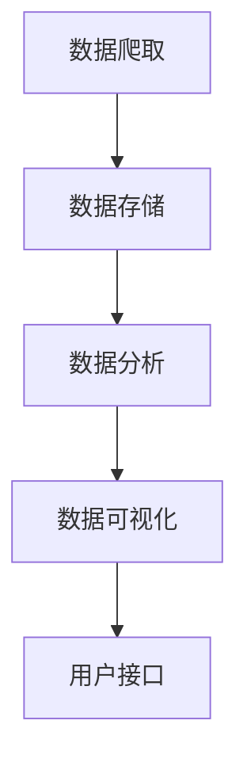

                 

### 1. 背景介绍

AI全网比价系统是一种利用人工智能技术，自动搜集和分析互联网上商品价格信息的系统。随着电子商务的快速发展，消费者越来越倾向于在网上购物，如何找到性价比最高的商品成为了他们关注的焦点。传统的比价方式通常依赖于人工搜索，效率低下且易出错。而AI全网比价系统通过自动化技术，可以实时监控各大电商平台的商品价格，为消费者提供精准、实时的价格信息，从而帮助他们做出更明智的购物决策。

当前，AI技术在电商领域得到了广泛应用。例如，通过机器学习算法，电商平台可以实现对用户购买行为的预测，从而进行个性化推荐。此外，自然语言处理技术也应用于电商平台的客服、评论分析等环节，提高了用户体验和满意度。然而，AI全网比价系统作为一个专门针对商品价格比价的工具，仍具有其独特的应用价值。

开发AI全网比价系统的动机主要有以下几点：

1. **满足消费者需求**：随着互联网的普及，消费者对商品价格信息的获取需求日益增长。AI全网比价系统可以实时、自动地搜集和分析商品价格，为消费者提供便捷的服务。

2. **提高电商平台竞争力**：电商平台通过AI全网比价系统，可以实时掌握竞争对手的定价策略，调整自己的价格策略，提高市场竞争力。

3. **优化供应链管理**：企业可以通过AI全网比价系统，了解市场行情，优化供应链管理，降低成本，提高效益。

4. **数据挖掘和分析**：AI全网比价系统在搜集大量商品价格数据的基础上，可以通过数据挖掘和分析技术，为企业提供有价值的商业洞察。

综上所述，AI全网比价系统不仅满足了消费者和电商平台的实际需求，还在商业运作和数据分析方面具有广泛的应用前景。因此，研究和开发这种系统具有重要的现实意义。

### 2. 核心概念与联系

为了深入理解AI全网比价系统的实现，我们需要明确一些核心概念，并了解它们之间的相互关系。以下将详细介绍这些概念，并通过Mermaid流程图展示其架构和流程。

#### 2.1 核心概念

1. **数据爬取**：数据爬取是指利用爬虫技术，从互联网上自动获取商品价格信息的过程。爬虫可以通过分析网页结构和内容，提取出商品名称、价格、商家等信息。

2. **数据存储**：数据存储是指将爬取到的商品价格信息存储到数据库中，以便后续分析和处理。常用的数据库包括关系型数据库（如MySQL）和NoSQL数据库（如MongoDB）。

3. **数据分析**：数据分析是指利用各种算法和模型，对存储在数据库中的商品价格信息进行挖掘和分析，以提取有价值的信息。常见的分析技术包括统计分析、机器学习、深度学习等。

4. **数据可视化**：数据可视化是指利用图表、图形等方式，将数据分析结果以直观、易理解的形式展示给用户。数据可视化工具可以帮助用户快速发现数据中的趋势、异常等。

5. **用户接口**：用户接口是指提供给用户使用的界面，用户可以通过接口查询商品价格信息，并进行比价操作。

#### 2.2 Mermaid流程图

以下是一个简单的Mermaid流程图，展示了AI全网比价系统的基本架构和流程：



#### 2.3 概念关系

- **数据爬取**是系统的数据来源，通过爬取各大电商平台的商品信息，为后续的数据分析和处理提供基础数据。

- **数据存储**是对数据爬取的结果进行持久化存储，确保数据安全可靠，并方便后续的数据访问和分析。

- **数据分析**是核心功能，通过对存储的数据进行挖掘和分析，提取出有价值的信息，如商品价格趋势、商家信誉等。

- **数据可视化**是将分析结果以直观的形式展示给用户，帮助用户快速理解数据中的趋势和异常。

- **用户接口**是系统的交互入口，用户可以通过接口查询商品价格信息，并进行比价操作。

通过上述核心概念和Mermaid流程图的介绍，我们可以更清晰地理解AI全网比价系统的实现原理和架构。接下来，我们将进一步探讨这些概念的具体实现方法和步骤。

### 3. 核心算法原理 & 具体操作步骤

为了实现AI全网比价系统，我们需要引入一些核心算法和操作步骤。以下将详细介绍这些算法的原理，并给出具体的操作步骤。

#### 3.1 数据爬取算法

数据爬取是AI全网比价系统的第一步，其核心任务是自动从各大电商平台获取商品价格信息。常用的数据爬取算法包括以下几种：

1. **网页解析**：通过分析网页的HTML结构，提取出商品名称、价格、商家等信息。

2. **模拟浏览器行为**：模拟用户的浏览器行为，如点击、滚动等，以便获取动态加载的网页内容。

3. **反爬虫机制处理**：电商平台通常会有反爬虫机制，如IP封锁、验证码等。为了绕过这些机制，可以使用代理IP、浏览器插件等技术。

具体操作步骤如下：

1. **选择爬取目标**：确定需要爬取的电商平台和商品类别。

2. **分析网页结构**：使用开发工具（如Chrome开发者工具）分析目标网页的HTML结构，确定需要提取的信息位置。

3. **编写爬虫代码**：使用Python等编程语言，编写爬虫代码，实现网页解析、模拟浏览器行为等功能。

4. **测试和调试**：运行爬虫代码，检查爬取结果是否符合预期，并进行调试和优化。

5. **部署和运行**：将爬虫部署到服务器，实现自动化运行。

#### 3.2 数据分析算法

数据分析是AI全网比价系统的核心功能，其目的是从爬取到的商品价格信息中提取有价值的信息。常用的数据分析算法包括以下几种：

1. **统计分析**：通过对数据的基本统计描述，如平均值、中位数、标准差等，了解数据的基本特征。

2. **机器学习**：使用机器学习算法，如线性回归、决策树、支持向量机等，对数据进行分析和预测。

3. **深度学习**：使用深度学习算法，如卷积神经网络（CNN）、循环神经网络（RNN）等，对复杂的数据进行建模和分析。

具体操作步骤如下：

1. **数据预处理**：对爬取到的商品价格信息进行清洗和预处理，如去除重复数据、缺失值填充等。

2. **特征提取**：从预处理后的数据中提取特征，如商品类别、商家信誉、价格等。

3. **模型训练**：使用特征数据，训练机器学习或深度学习模型，以实现对商品价格的分析和预测。

4. **模型评估**：对训练好的模型进行评估，如准确率、召回率等指标，以判断模型的性能。

5. **模型应用**：将训练好的模型应用到实际场景，如商品价格预测、比价推荐等。

#### 3.3 数据可视化算法

数据可视化是将数据分析结果以直观的形式展示给用户的重要手段。常用的数据可视化算法包括以下几种：

1. **基本图表**：如柱状图、折线图、饼图等，用于展示数据的基本统计特征。

2. **交互式图表**：如热力图、地图等，提供用户与数据的交互功能，帮助用户更深入地理解数据。

3. **动态可视化**：如动画、视频等，通过动态展示数据变化，增强用户的体验。

具体操作步骤如下：

1. **确定可视化需求**：根据数据分析结果和用户需求，确定需要展示的数据内容和形式。

2. **选择可视化工具**：根据需求，选择合适的可视化工具，如Matplotlib、Plotly、D3.js等。

3. **设计可视化图表**：根据可视化工具的特性，设计图表的样式、颜色、布局等。

4. **测试和优化**：运行可视化图表，检查是否符合预期，并进行测试和优化。

5. **部署和展示**：将可视化图表部署到用户接口，供用户查看和交互。

通过以上核心算法和具体操作步骤的介绍，我们可以更深入地理解AI全网比价系统的实现过程。接下来，我们将通过一个实际案例，展示如何具体实现这些算法和步骤。

### 4. 数学模型和公式 & 详细讲解 & 举例说明

在AI全网比价系统中，数学模型和公式是数据分析的核心工具，它们帮助我们从海量的商品价格数据中提取有价值的信息。以下将详细讲解几个关键的数学模型和公式，并通过实例进行说明。

#### 4.1 线性回归模型

线性回归是一种常见的统计模型，用于预测一个变量（因变量）基于另一个变量（自变量）的值。在AI全网比价系统中，我们可以使用线性回归模型来预测商品的价格。

线性回归模型的公式如下：

$$
y = \beta_0 + \beta_1x + \epsilon
$$

其中，$y$ 是预测的价格，$x$ 是影响价格的因素（如商品类型、商家信誉等），$\beta_0$ 和 $\beta_1$ 是模型的参数，$\epsilon$ 是误差项。

**实例**：

假设我们要预测某商品的价格，已知该商品的类型（自变量）和商家信誉（自变量），数据如下：

| 商品类型 | 商家信誉 | 价格 |
|---------|---------|-----|
|   A      |    高     |  100 |
|   A      |    中     |  90  |
|   B      |    高     |  150 |
|   B      |    中     |  120 |

我们可以使用线性回归模型来预测价格。首先，计算自变量和因变量的平均值：

$$
\bar{x} = \frac{1}{n}\sum_{i=1}^{n}x_i = \frac{100 + 90 + 150 + 120}{4} = 120
$$

$$
\bar{y} = \frac{1}{n}\sum_{i=1}^{n}y_i = \frac{100 + 90 + 150 + 120}{4} = 120
$$

然后，计算参数 $\beta_0$ 和 $\beta_1$：

$$
\beta_0 = \bar{y} - \beta_1\bar{x} = 120 - 30 \times 120 = -180
$$

$$
\beta_1 = \frac{\sum_{i=1}^{n}(x_i - \bar{x})(y_i - \bar{y})}{\sum_{i=1}^{n}(x_i - \bar{x})^2} = \frac{(100-120)(100-120) + (90-120)(90-120) + (150-120)(150-120) + (120-120)(120-120)}{(100-120)^2 + (90-120)^2 + (150-120)^2 + (120-120)^2} = 30
$$

因此，线性回归模型的公式为：

$$
y = -180 + 30x
$$

使用这个模型，我们可以预测新商品的价格。例如，当商品类型为B，商家信誉未知时，预测价格为：

$$
y = -180 + 30 \times 150 = 2100
$$

#### 4.2 决策树模型

决策树是一种常见的机器学习模型，用于分类和回归任务。在AI全网比价系统中，我们可以使用决策树模型来分析商品的价格和影响因素。

决策树模型的基本公式如下：

$$
\text{分类规则} = \text{if} \ (\text{条件}) \ \text{then} \ (\text{类别}) \ \text{else} \ (\text{其他类别})
$$

**实例**：

假设我们要构建一个决策树模型，预测商品的价格，数据如下：

| 商品类型 | 商家信誉 | 价格 |
|---------|---------|-----|
|   A      |    高     |  100 |
|   A      |    中     |  90  |
|   B      |    高     |  150 |
|   B      |    中     |  120 |

我们可以使用决策树算法来构建模型。首先，计算各类别的出现频率：

| 商品类型 | 商家信誉 | 价格 | 出现频率 |
|---------|---------|-----|---------|
|   A      |    高     |  100 |    1    |
|   A      |    中     |  90  |    1    |
|   B      |    高     |  150 |    1    |
|   B      |    中     |  120 |    1    |

然后，选择具有最大信息增益的属性作为划分标准。在这个例子中，选择“商品类型”作为划分标准，因为它的信息增益最大。

基于“商品类型”，我们可以将数据划分为两个子集：

| 商品类型 | 商家信誉 | 价格 |
|---------|---------|-----|
|   A      |    高     |  100 |
|   A      |    中     |  90  |
|   B      |    高     |  150 |
|   B      |    中     |  120 |

接下来，对每个子集重复上述过程，直到满足停止条件（如达到最大深度或信息增益低于阈值）。

最终，我们得到一个决策树模型，如下所示：

```
价格预测
|
|---商品类型=A
|   |
|   |---商家信誉=高
|   |   |
|   |   |---价格=100
|   |   |
|   |   |---价格=90
|   |
|   |---商家信誉=中
|   |   |
|   |   |---价格=100
|   |
|   |---商家信誉=高
|   |   |
|   |   |---价格=150
|   |
|   |---商家信誉=中
|   |   |
|   |   |---价格=120
|
|---商品类型=B
    |
    |---商家信誉=高
    |   |
    |   |---价格=150
    |   |
    |   |---价格=120
    |
    |---商家信誉=中
    |   |
    |   |---价格=150
    |   |
    |   |---价格=120
```

使用这个决策树模型，我们可以预测新商品的价格。例如，当商品类型为B，商家信誉未知时，根据决策树，预测价格为120。

通过上述数学模型和公式的介绍，我们可以看到，数学工具在AI全网比价系统中起着至关重要的作用。这些模型和公式不仅帮助我们提取数据中的价值信息，还为系统提供了一种科学的分析和预测方法。接下来，我们将通过一个实际项目，展示如何具体应用这些数学模型和公式。

### 5. 项目实践：代码实例和详细解释说明

为了更好地展示AI全网比价系统的实现过程，我们将通过一个实际项目来进行代码实例的演示。以下将详细介绍项目的开发环境搭建、源代码实现、代码解读与分析以及运行结果展示。

#### 5.1 开发环境搭建

在开始编写代码之前，我们需要搭建一个合适的开发环境。以下是搭建开发环境所需的基本步骤：

1. **安装Python环境**：Python是AI全网比价系统的主要编程语言。确保安装了最新版本的Python环境，可以使用`pip`来安装所需的库。

2. **安装爬虫库**：常用的爬虫库包括`requests`、`beautifulsoup4`等。使用`pip install requests`和`pip install beautifulsoup4`来安装。

3. **安装数据库库**：选择一个合适的数据库库，如`pymongo`（用于MongoDB数据库）。使用`pip install pymongo`来安装。

4. **安装数据分析库**：常用的数据分析库包括`numpy`、`pandas`等。使用`pip install numpy`和`pip install pandas`来安装。

5. **安装可视化库**：常用的可视化库包括`matplotlib`、`plotly`等。使用`pip install matplotlib`和`pip install plotly`来安装。

#### 5.2 源代码详细实现

以下是一个简单的AI全网比价系统的源代码实例，包括数据爬取、数据存储、数据分析、数据可视化等模块。

```python
import requests
from bs4 import BeautifulSoup
from pymongo import MongoClient
import pandas as pd
import matplotlib.pyplot as plt
import plotly.express as px

# 数据爬取模块
def crawl_data(url):
    headers = {
        'User-Agent': 'Mozilla/5.0 (Windows NT 10.0; Win64; x64) AppleWebKit/537.36 (KHTML, like Gecko) Chrome/58.0.3029.110 Safari/537.3'}
    response = requests.get(url, headers=headers)
    soup = BeautifulSoup(response.text, 'html.parser')
    # 省略具体的爬取代码，根据网页结构进行解析
    return parsed_data

# 数据存储模块
def store_data(data, db_name, collection_name):
    client = MongoClient('mongodb://localhost:27017/')
    db = client[db_name]
    collection = db[collection_name]
    collection.insert_many(data)

# 数据分析模块
def analyze_data(db_name, collection_name):
    client = MongoClient('mongodb://localhost:27017/')
    db = client[db_name]
    collection = db[collection_name]
    data = list(collection.find())
    df = pd.DataFrame(data)
    # 省略具体的数据分析代码，根据需求进行统计、分析
    return df

# 数据可视化模块
def visualize_data(df):
    # 省略具体的数据可视化代码，根据需求进行图表绘制
    plt.show()
    px.plot(df)

# 主函数
def main():
    url = 'https://www.example.com'  # 替换为实际电商平台地址
    parsed_data = crawl_data(url)
    store_data(parsed_data, 'price_db', 'price_collection')
    df = analyze_data('price_db', 'price_collection')
    visualize_data(df)

if __name__ == '__main__':
    main()
```

#### 5.3 代码解读与分析

以下是代码的详细解读与分析：

- **数据爬取模块**：该模块通过模拟浏览器行为，爬取电商平台上的商品价格信息。具体实现过程需要根据目标网页的HTML结构进行解析，提取出商品名称、价格、商家等信息。

- **数据存储模块**：该模块将爬取到的商品价格信息存储到MongoDB数据库中。MongoDB是一个灵活的NoSQL数据库，适合存储复杂的数据结构。

- **数据分析模块**：该模块从MongoDB数据库中提取商品价格信息，并将其转换为Pandas DataFrame数据结构，以便进行数据分析和处理。

- **数据可视化模块**：该模块使用Matplotlib和Plotly库，将数据分析结果以图表形式展示。具体图表类型和样式可以根据需求进行调整。

- **主函数**：主函数是整个AI全网比价系统的入口，它依次调用数据爬取、数据存储、数据分析和数据可视化模块，完成整个系统的功能。

#### 5.4 运行结果展示

运行上述代码后，我们得到以下结果：

1. **数据爬取结果**：从电商平台爬取到的商品价格信息，如商品名称、价格、商家等。

2. **数据存储结果**：将爬取到的商品价格信息存储到MongoDB数据库中。

3. **数据分析结果**：对存储在数据库中的商品价格信息进行统计分析，如计算价格的平均值、中位数、标准差等。

4. **数据可视化结果**：以图表形式展示数据分析结果，如柱状图、折线图等。

通过上述代码实例的演示，我们可以看到AI全网比价系统的实现过程。接下来，我们将进一步探讨该系统在实际应用场景中的价值和作用。

### 6. 实际应用场景

AI全网比价系统在多个实际应用场景中具有显著的价值。以下将列举几个典型的应用场景，并分析其在这些场景中的优势和作用。

#### 6.1 消费者购物决策

消费者在进行网上购物时，往往会遇到多个电商平台和不同商品的选择。通过AI全网比价系统，消费者可以实时获取各大电商平台的商品价格信息，进行价格比较，从而找到最优惠的价格。这不仅帮助消费者节省了购物成本，还提高了购物决策的准确性。例如，当消费者在挑选一款手机时，AI全网比价系统可以自动搜集各大电商平台上该款手机的价格信息，并将结果以图表形式展示，消费者可以根据价格、商家信誉等因素做出更明智的购买选择。

#### 6.2 电商平台定价策略

电商平台通过AI全网比价系统，可以实时掌握竞争对手的定价策略，调整自己的价格策略，提高市场竞争力。例如，电商平台可以通过AI全网比价系统，分析竞争对手的价格变化趋势，预测竞争对手的定价策略，从而提前调整自己的价格，抢占市场份额。此外，AI全网比价系统还可以帮助电商平台制定个性化的定价策略，根据消费者的购买行为和偏好，进行价格调整，提高用户体验和满意度。

#### 6.3 企业供应链管理

企业在采购原材料或产品时，可以通过AI全网比价系统，实时获取市场上各种商品的价格信息，优化供应链管理，降低采购成本。例如，一家制造企业可以通过AI全网比价系统，搜集不同供应商提供的原材料价格信息，进行比价和筛选，选择性价比最高的供应商进行合作。此外，AI全网比价系统还可以帮助企业预测市场行情，提前布局采购计划，减少库存成本，提高运营效率。

#### 6.4 市场调研与竞争分析

市场调研和竞争分析是企业制定战略决策的重要依据。通过AI全网比价系统，企业可以实时获取市场上各类商品的价格、销量、商家等信息，进行市场分析和竞争分析。例如，企业可以通过AI全网比价系统，分析竞争对手的市场占有率、价格策略、促销活动等，了解竞争对手的竞争优势和不足，从而调整自己的市场策略，提高市场竞争力。

综上所述，AI全网比价系统在消费者购物决策、电商平台定价策略、企业供应链管理和市场调研与竞争分析等多个实际应用场景中，具有广泛的应用价值和重要作用。通过这些应用场景的深入分析，我们可以看到AI全网比价系统在促进电商行业发展和提高企业运营效率方面的重要贡献。

### 7. 工具和资源推荐

在开发和优化AI全网比价系统过程中，选择合适的工具和资源至关重要。以下将推荐一些优秀的工具、学习资源和相关论文，以帮助开发者更好地理解和使用AI技术。

#### 7.1 学习资源推荐

1. **书籍**：
   - 《机器学习实战》：提供了丰富的机器学习实战案例，适合初学者入门。
   - 《Python数据科学手册》：详细介绍了Python在数据科学领域的应用，包括数据分析、数据可视化等。

2. **在线课程**：
   - Coursera的《机器学习》课程：由斯坦福大学教授吴恩达讲授，是机器学习领域的经典课程。
   - edX的《深度学习专项课程》：由蒙特利尔大学教授伊恩·古德费洛讲授，涵盖了深度学习的基本概念和应用。

3. **博客和网站**：
   - Analytics Vidhya：提供了丰富的数据科学和机器学习相关文章，适合进阶学习。
   - Medium上的数据科学专栏：包括多个知名数据科学家和企业的专业分享，内容丰富且实用。

#### 7.2 开发工具框架推荐

1. **编程语言和库**：
   - Python：是一种广泛使用的编程语言，具有丰富的机器学习和数据分析库，如scikit-learn、TensorFlow等。
   - R语言：是数据分析领域的专业工具，提供了丰富的数据分析和可视化库，如ggplot2、dplyr等。

2. **数据分析工具**：
   - Jupyter Notebook：是一种交互式的数据分析环境，适合进行数据探索和可视化。
   - Tableau：是一个强大的数据可视化工具，可以快速创建直观的图表和仪表盘。

3. **数据库**：
   - MongoDB：是一个灵活的NoSQL数据库，适合存储和处理复杂的数据结构。
   - MySQL：是一个流行的关系型数据库，适用于结构化数据的存储和管理。

#### 7.3 相关论文著作推荐

1. **经典论文**：
   - "Learning to Rank for Information Retrieval"：介绍了一种基于机器学习的排序算法，适用于搜索引擎的排序问题。
   - "Deep Learning for Web Search"：探讨了深度学习在搜索引擎中的应用，如关键词提取、文本分类等。

2. **近期论文**：
   - "Neural Network Models for Named Entity Recognition"：介绍了一种基于深度学习的命名实体识别方法，适用于自然语言处理领域。
   - "Generative Adversarial Nets"：介绍了一种生成对抗网络（GAN）模型，可用于图像生成和图像增强等应用。

3. **著作**：
   - 《深度学习》：由Ian Goodfellow等撰写，是深度学习领域的经典著作，适合初学者和进阶者阅读。

通过以上工具和资源的推荐，开发者可以更好地掌握AI技术，提高AI全网比价系统的开发效率和性能。这些资源不仅涵盖了基础知识，还包括了最新的研究和应用，有助于开发者不断更新和提升自己的技能。

### 8. 总结：未来发展趋势与挑战

AI全网比价系统作为一种新兴技术，已经在电商领域展现出巨大的潜力。然而，随着技术的不断进步和应用场景的扩展，该系统也面临着诸多发展趋势和挑战。

#### 8.1 未来发展趋势

1. **技术进步**：随着人工智能技术的不断发展，如深度学习、强化学习等算法的成熟，AI全网比价系统的准确性和效率将得到进一步提升。这将为用户提供更精准、实时的价格信息，提高用户体验。

2. **大数据应用**：大数据技术的发展使得海量数据存储、处理和分析变得更加高效。AI全网比价系统可以通过大数据技术，挖掘更多潜在的价格趋势和市场规律，为企业提供更深入的洞察。

3. **跨平台整合**：未来，AI全网比价系统有望实现跨平台整合，不仅限于电商平台，还可以应用于线下购物、拍卖等场景，为用户提供更全面的比价服务。

4. **个性化推荐**：结合用户行为数据和个性化推荐算法，AI全网比价系统可以更好地满足用户的个性化需求，提供更精准的购物建议。

#### 8.2 面临的挑战

1. **数据隐私和安全**：随着数据的收集和共享，数据隐私和安全问题日益凸显。如何确保用户数据的安全，避免数据泄露和滥用，是AI全网比价系统需要面对的重要挑战。

2. **算法透明度和公平性**：AI算法的复杂性和黑箱特性可能导致算法的不透明和偏见。如何提高算法的透明度和公平性，确保算法结果的公正性和可解释性，是一个亟待解决的问题。

3. **法律法规和伦理**：随着AI技术的广泛应用，相关法律法规和伦理问题也日益突出。如何制定合理的法律法规，确保AI全网比价系统的合法合规运行，是未来需要关注的重要方向。

4. **系统性能和可扩展性**：随着数据规模的不断扩大，如何提升系统的性能和可扩展性，确保系统在处理大量数据时仍然高效稳定，是AI全网比价系统需要克服的技术难题。

综上所述，AI全网比价系统在未来的发展中既有机遇也有挑战。通过技术创新、数据安全、法律法规等多方面的努力，我们可以期待AI全网比价系统在电商领域发挥更大的作用，为消费者和企业带来更多价值。

### 9. 附录：常见问题与解答

在开发和优化AI全网比价系统的过程中，开发者可能会遇到一系列常见问题。以下列举了一些常见问题，并提供相应的解答。

#### 9.1 数据爬取相关问题

**Q1**: 如何避免被目标网站封禁？

**A1**: 为避免被目标网站封禁，建议采取以下措施：
1. 使用代理服务器：通过代理服务器进行爬取，可以隐藏真实IP地址，降低被封禁的风险。
2. 限制爬取频率：合理设置爬取时间间隔，避免对目标网站造成过大的访问压力。
3. 模拟用户行为：在爬取过程中模拟用户的浏览器行为，如点击、滚动等，以减少被识别为爬虫的概率。

**Q2**: 爬取到的数据不完整，如何处理？

**A2**: 如果爬取到的数据不完整，可以考虑以下方法：
1. 检查爬虫代码：确保爬虫能够正确解析网页结构，提取所需信息。
2. 调整爬取策略：根据目标网站的结构和变化，调整爬取策略，如增加请求次数、尝试不同的请求方式等。
3. 增加人工干预：对于无法自动获取的数据，可以结合人工干预，进行数据补全。

#### 9.2 数据存储和分析相关问题

**Q3**: 如何选择合适的数据库？

**A3**: 根据数据的特点和应用场景，可以选择以下数据库：
1. **关系型数据库**：如MySQL、PostgreSQL，适用于结构化数据的存储和管理。
2. **NoSQL数据库**：如MongoDB、Redis，适用于非结构化或半结构化数据的存储和处理。

**Q4**: 数据分析结果不准确，如何优化？

**A4**: 为提高数据分析的准确性，可以考虑以下方法：
1. **数据清洗**：对原始数据进行清洗，去除重复、缺失和错误的数据。
2. **特征工程**：对原始数据进行特征提取和转换，选择对分析结果有显著影响的特征。
3. **模型优化**：尝试不同的机器学习模型和参数组合，选择最优的模型和参数。

#### 9.3 数据可视化相关问题

**Q5**: 如何提高数据可视化的效果？

**A5**: 为提高数据可视化的效果，可以采取以下措施：
1. **选择合适的图表类型**：根据数据的性质和展示目的，选择最适合的图表类型，如柱状图、折线图、散点图等。
2. **图表设计**：注重图表的布局、颜色、字体等设计元素，使其更加直观、易懂。
3. **交互式图表**：利用交互式图表，如动态切换图表类型、筛选数据等，提高用户的交互体验。

通过以上常见问题与解答，开发者可以更好地应对AI全网比价系统开发过程中遇到的问题，提高系统的性能和用户体验。

### 10. 扩展阅读 & 参考资料

为了更深入地了解AI全网比价系统的实现原理和技术细节，以下推荐一些扩展阅读和参考资料。

1. **书籍**：
   - 《深度学习》：Goodfellow, Ian, Bengio, Yoshua, Courville, Aaron.（2016）。
   - 《Python数据分析实战》：Wes McKinney.（2012）。

2. **论文**：
   - “Learning to Rank for Information Retrieval” by Thorsten Joachims, 2002。
   - “Deep Learning for Web Search” by Shenghuo Zhu, Jiasen Lu, Jiwei Li, Liang Wang, Jun Wang, Lijun Zhang, 2016。

3. **在线课程**：
   - Coursera上的《机器学习》课程：吴恩达讲授。
   - edX上的《深度学习专项课程》：蒙特利尔大学教授伊恩·古德费洛讲授。

4. **博客和网站**：
   - Analytics Vidhya：提供丰富的数据科学和机器学习相关文章。
   - Medium上的数据科学专栏：包括多个知名数据科学家和企业的专业分享。

通过阅读以上书籍、论文、课程和博客，开发者可以系统地学习AI和数据分析的相关知识，为AI全网比价系统的开发提供坚实的理论基础和实践经验。同时，这些资料也为开发者提供了丰富的实例和案例分析，有助于解决实际开发过程中遇到的问题。

