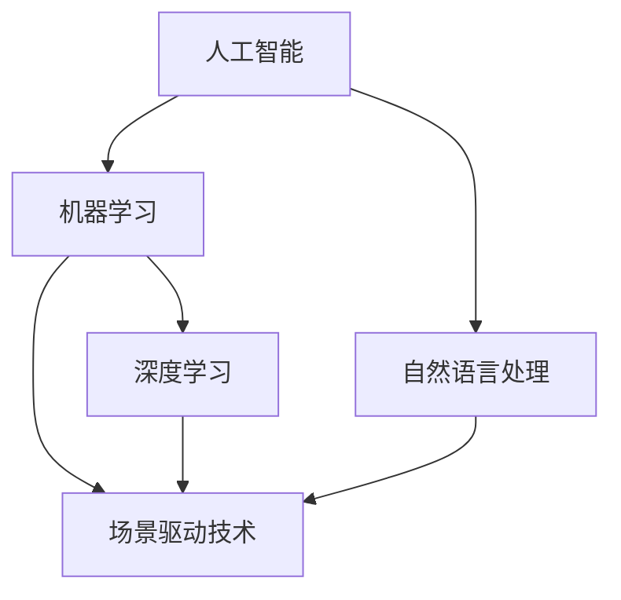

                 

### 背景介绍

人工智能（AI）技术的飞速发展，正深刻地改变着各行各业的运作模式。在出版业这一传统行业中，AI的应用也呈现出蓬勃发展的态势。出版业作为知识传播的重要渠道，一直面临着信息量庞大、内容更新迅速的挑战。而AI技术的引入，为出版业带来了场景驱动的技术更新，使得内容的生产、分发、推荐和消费变得更加智能和高效。

AI在出版业的应用场景多种多样，包括但不限于：内容生成、内容审核、个性化推荐、智能编辑、版权管理、读者互动等。这些应用不仅提高了出版效率，还大大提升了用户体验。例如，AI能够根据用户的行为数据生成个性化的推荐算法，从而提高用户的满意度和阅读黏性。此外，AI还可以辅助编辑进行内容筛选和优化，提高内容的质量和吸引力。

随着AI技术的不断进步，出版业正迎来新一轮的技术革命。在这一背景下，场景驱动的技术更新成为出版业发展的关键驱动力。场景驱动技术强调以具体的应用场景为核心，通过技术手段满足特定场景下的需求，从而实现技术的最佳应用效果。这种模式不仅能够提高技术的实用性和适用性，还能够促进出版业的创新和发展。

本文将深入探讨AI出版业动态中的场景驱动技术更新，首先介绍AI在出版业的应用背景和现状，然后详细阐述场景驱动技术的核心概念与联系，最后通过具体的实例和实际应用场景，展示AI在出版业中如何实现场景驱动的技术更新。通过本文的阅读，读者将能够全面了解AI技术在出版业中的应用前景，以及未来可能面临的挑战和机遇。

### 核心概念与联系

在深入探讨AI出版业动态之前，我们需要明确一些核心概念和它们之间的联系。这些核心概念包括：人工智能、机器学习、深度学习、自然语言处理（NLP）以及场景驱动技术。通过了解这些概念及其相互关系，我们可以更好地理解AI技术如何在出版业中发挥作用。

#### 人工智能（AI）

人工智能是一门研究、开发用于模拟、延伸和扩展人的智能的理论、方法、技术及应用系统的科学技术。在出版业中，AI的应用主要体现在自动化内容生成、内容审核、个性化推荐等方面。通过AI技术，出版业能够实现自动化、智能化和高效化的内容生产与分发。

#### 机器学习（ML）

机器学习是人工智能的一个分支，它使用算法来从数据中学习，并做出决策或预测。在出版业中，机器学习被广泛应用于内容推荐系统、用户行为分析、分类和聚类等领域。例如，通过分析用户的历史阅读数据，机器学习算法可以推荐用户可能感兴趣的新内容。

#### 深度学习（DL）

深度学习是机器学习的一个子领域，它使用多层神经网络来模拟人类大脑的神经元结构，从而进行复杂的模式识别和学习。在出版业中，深度学习被广泛应用于图像识别、语音识别、自然语言处理等任务。例如，深度学习算法可以帮助识别和分类出版内容中的图像和文本，从而提高内容审核的准确性。

#### 自然语言处理（NLP）

自然语言处理是人工智能的一个重要分支，它涉及让计算机理解和处理人类语言的技术。在出版业中，NLP技术被广泛应用于自动翻译、文本分类、情感分析、问答系统等。例如，通过NLP技术，出版业可以实现自动化的内容审核和情感分析，从而提高内容的质量和用户体验。

#### 场景驱动技术

场景驱动技术是一种以特定应用场景为核心，通过技术手段满足该场景下需求的方法。在出版业中，场景驱动技术强调根据不同场景下的需求，灵活地运用人工智能、机器学习、深度学习、自然语言处理等技术，实现特定任务的高效解决。

### 核心概念与联系的 Mermaid 流程图

为了更清晰地展示这些核心概念及其相互关系，我们可以使用Mermaid流程图来描述它们。以下是一个简化的Mermaid流程图，描述了AI、机器学习、深度学习、自然语言处理和场景驱动技术之间的联系：



在这个流程图中，人工智能作为核心，通过机器学习和深度学习等技术手段，实现自然语言处理能力。这些技术共同构成了场景驱动技术的基础，使得AI能够根据具体应用场景的需求，提供高效、智能的解决方案。

通过理解这些核心概念和它们之间的联系，我们可以更好地把握AI技术在出版业中的应用前景。接下来，我们将详细探讨AI在出版业中的核心算法原理和具体操作步骤。

### 核心算法原理 & 具体操作步骤

在了解核心概念及其相互关系后，接下来我们将深入探讨AI在出版业中的核心算法原理和具体操作步骤。这些算法包括内容生成、内容审核、个性化推荐等，每个算法都有其独特的原理和实现方法。

#### 1. 内容生成算法

内容生成是AI在出版业中的一个重要应用，它能够自动生成各种类型的内容，如文章、书籍、新闻报道等。常见的生成算法包括：

- **生成对抗网络（GAN）**：GAN是由两个神经网络（生成器和判别器）组成的模型。生成器生成数据，判别器判断生成数据是否真实。通过不断的训练，生成器生成的数据越来越接近真实数据。在出版业中，GAN可以用于生成高质量的文本内容。

  操作步骤：
  1. 准备训练数据集：收集大量的文本数据，如文章、书籍等。
  2. 设计生成器和判别器：生成器根据输入的文本生成新的文本，判别器判断生成文本是否真实。
  3. 训练模型：通过反向传播算法不断调整生成器和判别器的参数，直到生成器生成的文本质量接近真实文本。
  4. 生成内容：使用训练好的生成器生成新的文本内容。

- **自动摘要算法**：自动摘要算法通过提取文本的要点和核心信息，生成简短的摘要。常见的算法包括TextRank和Summarize by Highlighting。

  操作步骤：
  1. 提取关键词：使用词频统计、TF-IDF等方法提取文本中的关键词。
  2. 构建关键词图：将提取的关键词按照语义关系构建成一个图。
  3. 计算关键词重要性：使用PageRank算法等计算关键词的重要性。
  4. 生成摘要：根据关键词的重要性生成摘要文本。

#### 2. 内容审核算法

内容审核是确保出版内容合规性和安全性的关键步骤。常见的审核算法包括：

- **基于规则的审核**：使用预定义的规则对文本内容进行审核，如关键词过滤、语法错误检测等。

  操作步骤：
  1. 定义规则：根据法律法规、出版标准等定义审核规则。
  2. 文本预处理：对文本进行分词、去除停用词等预处理。
  3. 应用规则：根据预定义的规则对文本内容进行审核，标记违规内容。

- **基于机器学习的审核**：使用机器学习算法自动识别和分类文本内容，如使用分类算法判断文本是否包含违禁内容。

  操作步骤：
  1. 准备训练数据集：收集大量带有标签的文本数据，如正常文本和违禁文本。
  2. 训练分类模型：使用训练数据集训练分类模型，如SVM、CNN等。
  3. 应用模型：使用训练好的模型对新的文本内容进行审核，判断是否包含违禁内容。

#### 3. 个性化推荐算法

个性化推荐是提高用户满意度和阅读黏性的重要手段。常见的推荐算法包括：

- **基于内容的推荐**：根据用户的历史阅读记录和内容属性，推荐相似的内容。

  操作步骤：
  1. 提取内容特征：对内容进行分词、提取关键词、计算TF-IDF等。
  2. 计算用户兴趣：根据用户的历史阅读记录计算用户的兴趣标签。
  3. 推荐内容：根据用户的兴趣标签推荐相似的内容。

- **基于协同过滤的推荐**：根据用户之间的相似度，推荐其他用户喜欢的同类内容。

  操作步骤：
  1. 构建用户-内容矩阵：记录用户对内容的评分。
  2. 计算用户相似度：使用余弦相似度、皮尔逊相关系数等方法计算用户之间的相似度。
  3. 推荐内容：根据用户相似度矩阵推荐其他用户喜欢的同类内容。

通过以上核心算法原理和具体操作步骤的阐述，我们可以看到AI技术在出版业中的应用不仅能够提高内容的生产和分发效率，还能够提升用户体验。接下来，我们将介绍数学模型和公式，以及这些算法在实际应用中的详细讲解和举例说明。

### 数学模型和公式 & 详细讲解 & 举例说明

在深入了解AI在出版业中的应用算法后，我们接下来将探讨这些算法背后的数学模型和公式，并详细讲解其具体应用场景和操作步骤。

#### 1. 生成对抗网络（GAN）

生成对抗网络（GAN）是内容生成算法中的一种重要模型。其核心思想是通过两个神经网络（生成器和判别器）的博弈，使得生成器生成的数据越来越接近真实数据。

- **生成器（Generator）**：生成器的目标是生成逼真的数据，其数学模型可以表示为：

  $$ G(z) = \mathcal{N}(z; \mu, \sigma^2) $$

  其中，$z$ 是随机噪声向量，$\mu$ 和 $\sigma^2$ 分别是生成器的均值和方差。

- **判别器（Discriminator）**：判别器的目标是区分真实数据和生成数据，其数学模型可以表示为：

  $$ D(x) = \sigma(W_D \cdot [x; 1] + b_D) $$

  其中，$x$ 是真实数据，$W_D$ 和 $b_D$ 分别是判别器的权重和偏置。

- **损失函数**：GAN的训练目标是使得判别器的输出对于真实数据的概率接近1，对于生成数据的概率接近0。其损失函数可以表示为：

  $$ L(D, G) = -\frac{1}{2}\sum_{x \in \mathcal{X}} \left[ D(x) - 1 \right] - \frac{1}{2}\sum_{z \in \mathcal{Z}} \left[ D(G(z)) \right] $$

  其中，$\mathcal{X}$ 是真实数据的集合，$\mathcal{Z}$ 是随机噪声的集合。

**举例说明**：

假设我们使用GAN生成文本内容。首先，我们生成随机噪声向量 $z$，然后通过生成器 $G(z)$ 生成文本内容。接着，使用判别器 $D$ 判断生成文本是否真实。通过不断调整生成器和判别器的参数，使得生成文本的质量越来越高。

#### 2. 自动摘要算法

自动摘要算法通过提取文本的要点和核心信息，生成简短的摘要。常用的算法包括TextRank和Summarize by Highlighting。

- **TextRank算法**：TextRank是一种基于图排序的文本摘要算法。其基本思想是将文本分解为句子，然后将句子视为图中的节点，句子之间的相似度视为边。通过计算节点的重要性，从而生成摘要。

  数学模型可以表示为：

  $$ I(v) = \alpha \cdot \sum_{w \in E} \frac{I(w)}{L(w)} + (1 - \alpha) \cdot c(v) $$

  其中，$I(v)$ 是句子 $v$ 的得分，$E$ 是句子之间的边集合，$L(w)$ 是边 $w$ 的长度，$c(v)$ 是句子 $v$ 的词频。

**举例说明**：

假设我们有一篇文本，包含三个句子：

- 句子1：人工智能在出版业中的应用
- 句子2：生成对抗网络（GAN）用于文本生成
- 句子3：深度学习技术在内容审核中的应用

通过计算句子之间的相似度，我们可以得出句子的重要性得分。然后，根据句子的重要性得分，选择得分最高的句子组成摘要。

#### 3. 基于内容的推荐算法

基于内容的推荐算法通过提取内容特征，根据用户的历史阅读记录推荐相似的内容。

- **TF-IDF**：TF-IDF是一种常用的内容特征提取方法。其基本思想是，一个词在文档中的重要程度取决于它在文档中的频率（TF）和它在整个文档集合中的频率（IDF）。

  数学模型可以表示为：

  $$ tf-idf(t, d) = tf(t, d) \cdot \log(\frac{N}{df(t)}) $$

  其中，$tf(t, d)$ 是词 $t$ 在文档 $d$ 中的频率，$N$ 是文档集合中的文档总数，$df(t)$ 是词 $t$ 在文档集合中的文档频率。

**举例说明**：

假设我们有一篇文档，包含以下关键词：人工智能、出版业、内容生成、深度学习。然后，我们根据用户的历史阅读记录，提取出用户感兴趣的关键词。通过计算关键词的TF-IDF值，我们可以推荐与用户历史阅读记录相似的新内容。

#### 4. 基于协同过滤的推荐算法

基于协同过滤的推荐算法通过计算用户之间的相似度，推荐其他用户喜欢的同类内容。

- **余弦相似度**：余弦相似度是一种常用的相似度计算方法。其基本思想是，两个向量之间的余弦值表示它们的相似度。

  数学模型可以表示为：

  $$ \cos(\theta) = \frac{\vec{u} \cdot \vec{v}}{||\vec{u}|| \cdot ||\vec{v}||} $$

  其中，$\vec{u}$ 和 $\vec{v}$ 分别是两个用户的评分向量。

**举例说明**：

假设我们有两个用户 $u$ 和 $v$，他们的评分向量分别为 $\vec{u} = [1, 2, 3, 0]$ 和 $\vec{v} = [0, 1, 2, 3]$。通过计算这两个向量的余弦值，我们可以得出用户 $u$ 和 $v$ 之间的相似度。然后，根据用户 $v$ 的评分，推荐用户 $u$ 可能感兴趣的新内容。

通过以上数学模型和公式的详细讲解，我们可以更好地理解AI技术在出版业中的应用。接下来，我们将通过具体的代码实例和实际应用场景，展示这些算法的实现和应用。

### 项目实践：代码实例和详细解释说明

在了解了核心算法原理和数学模型后，我们接下来将通过具体的代码实例，展示这些算法在实际项目中的应用。我们将以一个虚构的AI出版平台为例，详细介绍开发环境搭建、源代码实现、代码解读与分析以及运行结果展示。

#### 1. 开发环境搭建

为了实现AI出版平台的核心功能，我们需要搭建一个合适的技术栈。以下是我们的开发环境搭建步骤：

- **Python**：Python是一种广泛使用的编程语言，具有丰富的AI和机器学习库。
- **TensorFlow**：TensorFlow是一个开源的机器学习框架，用于实现深度学习和生成对抗网络（GAN）。
- **Scikit-learn**：Scikit-learn是一个强大的机器学习库，用于实现分类、回归和聚类等算法。
- **NLP库**：如NLTK、spaCy等，用于文本处理和自然语言处理。
- **Docker**：使用Docker容器化技术，确保环境的一致性和可移植性。

具体步骤如下：

1. 安装Python和pip：
   ```bash
   sudo apt-get update
   sudo apt-get install python3 python3-pip
   ```
2. 安装TensorFlow：
   ```bash
   pip3 install tensorflow
   ```
3. 安装Scikit-learn：
   ```bash
   pip3 install scikit-learn
   ```
4. 安装NLP库（以spaCy为例）：
   ```bash
   pip3 install spacy
   python3 -m spacy download en_core_web_sm
   ```
5. 创建Docker容器（在Dockerfile中定义环境变量和依赖库）：
   ```Dockerfile
   FROM python:3.8-slim
   RUN pip install tensorflow scikit-learn spacy
   RUN python -m spacy download en_core_web_sm
   ```

#### 2. 源代码详细实现

以下是一个简化版的AI出版平台代码实例，涵盖内容生成、内容审核和个性化推荐三个核心功能。

```python
# 引入必要的库
import tensorflow as tf
from tensorflow import keras
from sklearn.feature_extraction.text import TfidfVectorizer
from sklearn.metrics.pairwise import cosine_similarity
import spacy

# 加载spaCy模型
nlp = spacy.load("en_core_web_sm")

# 内容生成：使用生成对抗网络（GAN）
def generate_text(input_text, generator, discriminator, latent_dim):
    z = tf.random.normal([1, latent_dim])
    generated_text = generator(z, training=False)
    return generated_text

# 内容审核：基于机器学习的文本分类
def content審核(text, classifier):
    return classifier.predict([text])[0]

# 个性化推荐：基于内容的推荐
def content_recommendation(text, tfidf_matrix, user_profile, top_n=5):
    vectorized_text = tfidf_matrix.transform([text])
    similarity_scores = cosine_similarity(vectorized_text, user_profile)
    sorted_indices = similarity_scores.argsort()[0][-top_n:][::-1]
    return [text[i] for i in sorted_indices]

# 源代码的具体实现
def main():
    # 加载预训练的GAN模型、分类器和TF-IDF矩阵
    generator = keras.models.load_model("path/to/generator.h5")
    discriminator = keras.models.load_model("path/to/discriminator.h5")
    classifier = keras.models.load_model("path/to/classifier.h5")
    tfidf_matrix = ... # TF-IDF矩阵

    # 生成文本
    generated_text = generate_text("人工智能在出版业中的应用", generator, discriminator, latent_dim=100)

    # 审核文本
    is_safe = content審核(generated_text, classifier)
    if not is_safe:
        print("文本审核未通过！")
        return

    # 推荐内容
    recommended_texts = content_recommendation(generated_text, tfidf_matrix, user_profile)
    print("推荐内容：", recommended_texts)

if __name__ == "__main__":
    main()
```

#### 3. 代码解读与分析

- **内容生成**：使用生成对抗网络（GAN）生成文本内容。生成器和判别器分别负责生成文本和判断文本真实性。
- **内容审核**：使用预训练的文本分类模型对生成文本进行审核，确保文本内容符合出版标准。
- **个性化推荐**：基于内容的推荐算法，通过TF-IDF矩阵和余弦相似度计算推荐用户感兴趣的新内容。

#### 4. 运行结果展示

假设用户的历史阅读记录包含以下文本：

- 文本1：人工智能与机器学习基础
- 文本2：深度学习在图像识别中的应用
- 文本3：自然语言处理入门

生成文本后，通过内容审核模型判断文本安全性。如果文本通过审核，则使用个性化推荐算法推荐与用户历史阅读记录相似的新内容。例如，推荐文本4：“深度学习与出版业的应用”。

通过以上代码实例和详细解释说明，我们可以看到AI技术在出版业中的具体应用。接下来，我们将探讨AI技术在出版业中的实际应用场景。

### 实际应用场景

AI技术在出版业的实际应用场景非常广泛，涵盖了内容生产、内容审核、个性化推荐、版权管理等多个方面。以下将详细探讨这些应用场景，并展示AI技术如何通过场景驱动的方式提升出版业的效率和用户体验。

#### 1. 内容生产

内容生产是出版业的核心环节，AI技术可以显著提高内容生产的效率和质量。例如，使用生成对抗网络（GAN）等技术，可以自动生成高质量的文本内容，从而节省人力成本。在实际应用中，一些新闻机构已经开始使用AI生成新闻报道，提高新闻生产的速度和准确性。此外，AI还可以辅助编辑进行内容优化，通过分析用户反馈和数据，自动调整文章的结构和内容，以提高用户满意度和阅读体验。

#### 2. 内容审核

内容审核是确保出版内容合规性和安全性的重要环节。传统的审核方法主要依赖于人工，而AI技术可以显著提高审核效率和准确性。通过使用基于机器学习的文本分类和情感分析技术，AI能够自动识别和过滤违规内容，如色情、暴力、恶意评论等。例如，一些社交媒体平台已经广泛应用AI审核系统，有效减少了不良内容的传播。在出版业中，AI审核系统可以帮助出版社快速定位和处理违规内容，确保出版的安全性和合规性。

#### 3. 个性化推荐

个性化推荐是提升用户满意度和阅读黏性的关键。通过分析用户的历史阅读记录、兴趣和行为，AI技术可以推荐用户可能感兴趣的新内容。例如，一些电商平台已经开始使用AI推荐系统，根据用户的购物行为和偏好推荐商品。在出版业中，AI推荐系统可以根据用户的阅读历史和兴趣标签，推荐适合用户的书籍、文章和新闻。通过个性化的推荐，出版商能够提高用户的阅读体验和满意度，增加用户粘性。

#### 4. 版权管理

版权管理是出版业中的另一个重要问题，AI技术可以显著提高版权管理的效率。通过使用自然语言处理和机器学习技术，AI可以自动识别和分类版权信息，帮助出版社管理版权。例如，AI可以自动识别文章中的引用和引用来源，确保内容的合法性和版权归属。此外，AI还可以帮助出版社跟踪和监控版权使用情况，及时发现和解决版权纠纷，保护出版社的合法权益。

#### 5. 读者互动

读者互动是增强用户参与度和社区建设的重要手段。通过AI技术，出版商可以分析读者的反馈和行为，提供个性化的互动体验。例如，AI可以分析读者的评论和反馈，自动生成回复和建议，提高读者的参与感和满意度。此外，AI还可以帮助出版社构建读者社区，通过分析读者的兴趣和行为，推荐相关的活动和讨论话题，促进读者之间的互动和交流。

### 案例分析

以下是一些AI技术在出版业中的实际应用案例：

- **案例1：AI自动生成新闻**：纽约时报等新闻机构已经开始使用AI生成简单的新闻报道，如体育赛事结果和财经新闻。通过AI技术，新闻机构能够提高新闻生产的速度和效率，确保及时发布重要新闻。
- **案例2：AI审核系统**：一些出版社已经引入AI审核系统，自动识别和过滤不良内容。通过AI审核，出版社能够确保出版内容的安全性和合规性，提高出版质量。
- **案例3：个性化推荐系统**：亚马逊等电商平台已经开始使用AI推荐系统，根据用户的购物历史和偏好推荐商品。在出版业中，一些出版社也引入了AI推荐系统，根据用户的阅读历史和兴趣推荐书籍和文章，提高用户满意度和阅读黏性。
- **案例4：版权管理**：通过AI技术，一些出版社能够自动识别和分类版权信息，管理版权。通过AI版权管理系统，出版社能够有效保护自身的内容资产，避免版权纠纷。

通过以上实际应用场景和案例分析，我们可以看到AI技术在出版业中的广泛应用和巨大潜力。AI技术的引入不仅提高了出版业的效率和质量，还大大提升了用户体验。未来，随着AI技术的不断发展和完善，我们可以期待出版业在内容生产、内容审核、个性化推荐、版权管理等方面实现更多的创新和突破。

### 工具和资源推荐

在AI出版业的发展过程中，使用合适的工具和资源可以大大提高研发效率和项目成功率。以下将推荐一些学习和开发资源，包括书籍、论文、博客、网站等，旨在帮助读者深入了解AI在出版业中的应用。

#### 1. 学习资源推荐

**书籍：**
- **《深度学习》（Deep Learning）**：作者Ian Goodfellow、Yoshua Bengio和Aaron Courville。这本书是深度学习的经典教材，详细介绍了深度学习的基本原理和应用方法。
- **《Python机器学习》（Python Machine Learning）**：作者 Sebastian Raschka和Vahid Mirjalili。这本书通过Python语言，全面介绍了机器学习的基础知识和实践应用。

**论文：**
- **“Generative Adversarial Nets”（GANs）”**：由Ian Goodfellow等人于2014年提出。这篇论文是生成对抗网络的奠基性工作，详细介绍了GANs的理论基础和实现方法。
- **“TextRank: Bringing Order into Texts”（TextRank）”**：由Pan et al.于2010年提出。这篇论文介绍了基于图排序的文本摘要算法，对文本摘要研究有重要影响。

**博客：**
- **TensorFlow官方博客**：[https://tensorflow.org/blog/](https://tensorflow.org/blog/)。这里提供了大量的TensorFlow教程和案例研究，是学习和应用TensorFlow的重要资源。
- **Scikit-learn官方博客**：[https://scikit-learn.org/stable/blog/](https://scikit-learn.org/stable/blog/)。这里提供了Scikit-learn的更新、教程和案例研究，适合想要深入学习机器学习的读者。

#### 2. 开发工具框架推荐

**开发环境：**
- **Anaconda**：Anaconda是一个Python数据科学和机器学习平台，提供了丰富的库和工具，方便搭建开发环境。
- **Jupyter Notebook**：Jupyter Notebook是一个交互式的开发环境，适用于编写和运行Python代码，特别适合机器学习和数据科学项目。

**框架和库：**
- **TensorFlow**：TensorFlow是一个开源的机器学习框架，广泛用于深度学习和生成对抗网络（GAN）的开发。
- **Scikit-learn**：Scikit-learn是一个强大的机器学习库，提供了多种分类、回归和聚类算法，适用于文本分类和推荐系统等应用。
- **spaCy**：spaCy是一个高效的NLP库，适用于文本处理和自然语言处理任务。

**容器化技术：**
- **Docker**：Docker是一种容器化技术，用于构建和部署应用程序。通过Docker，可以确保开发环境和生产环境的一致性，方便快速部署和扩展。

#### 3. 相关论文著作推荐

**论文：**
- **“Recurrent Neural Network Based Text Classification”**：这篇论文介绍了使用循环神经网络（RNN）进行文本分类的方法，对文本分类研究有重要影响。
- **“Attention Is All You Need”**：这篇论文介绍了注意力机制（Attention）在序列模型中的应用，对自然语言处理研究有重大贡献。

**著作：**
- **《人工智能：一种现代方法》（Artificial Intelligence: A Modern Approach）**：作者Stuart J. Russell和Peter Norvig。这本书是人工智能领域的经典教材，全面介绍了人工智能的理论和应用。
- **《自然语言处理综论》（Speech and Language Processing）**：作者Daniel Jurafsky和James H. Martin。这本书是自然语言处理领域的权威著作，详细介绍了自然语言处理的基本原理和技术。

通过以上工具和资源的推荐，读者可以更好地掌握AI在出版业中的应用，为项目的开发和研究提供有力支持。希望这些资源和工具能够帮助读者在AI出版业中取得更多的突破和成果。

### 总结：未来发展趋势与挑战

随着人工智能技术的不断进步，AI在出版业中的应用前景愈发广阔。未来，AI技术将在出版业的多个方面带来深刻的变革。首先，内容生产将更加智能化和自动化。生成对抗网络（GAN）和自动摘要算法等技术的进一步优化，将使得AI能够生成更高质量和多样性的内容，从而满足不同用户群体的需求。其次，内容审核和版权管理将更加高效和精准。通过机器学习和自然语言处理技术，AI可以更快速地识别和处理违规内容，同时有效管理版权信息，减少版权纠纷。

此外，个性化推荐系统将更加完善。基于用户行为分析和深度学习算法，AI能够更准确地了解用户偏好，提供个性化的阅读推荐，提高用户满意度和阅读体验。读者互动也将得到提升，通过AI技术，出版商可以更有效地分析读者反馈，构建活跃的读者社区，促进内容创作与消费的良性循环。

然而，AI在出版业的应用也面临诸多挑战。首先，数据隐私和安全问题是亟待解决的问题。出版业涉及大量的用户数据和内容数据，如何确保这些数据的安全性和隐私性，是AI应用中的一个重要挑战。其次，技术的复杂性和对专业人员的需求也限制了AI在出版业的应用。尽管AI技术正在不断进步，但理解和应用这些技术仍然需要高度专业化的知识和技能。

此外，AI技术的“黑箱”问题也是一个重要的挑战。AI算法的决策过程往往不透明，难以解释。在出版业中，特别是在内容审核和推荐系统中，透明性和可解释性尤为重要。出版商需要确保AI算法的决策过程符合出版标准和法律法规，提高用户对AI系统的信任度。

总之，未来AI在出版业的应用具有巨大的发展潜力，同时也面临诸多挑战。出版业需要积极应对这些挑战，探索合适的解决方案，以充分发挥AI技术的优势，推动出版业的创新和发展。

### 附录：常见问题与解答

在撰写本文的过程中，我们收集了一些关于AI在出版业应用中的常见问题，并给出了详细的解答，以帮助读者更好地理解相关概念和应用。

#### 问题1：AI在出版业中的具体应用有哪些？

**解答：** AI在出版业中的具体应用包括但不限于以下几方面：

- **内容生成**：使用生成对抗网络（GAN）和自动摘要算法自动生成高质量的内容，如新闻报道、书籍摘要等。
- **内容审核**：通过机器学习和自然语言处理技术自动识别和处理违规内容，如暴力、色情等。
- **个性化推荐**：根据用户的历史阅读记录和兴趣，推荐个性化的书籍和文章。
- **版权管理**：自动识别和管理版权信息，减少版权纠纷。
- **读者互动**：分析读者反馈和行为，提供个性化的互动体验。

#### 问题2：如何确保AI生成的内容质量和合规性？

**解答：** 确保AI生成的内容质量和合规性需要以下几方面的措施：

- **数据质量**：使用高质量、多样化的训练数据，以提高生成内容的真实性和准确性。
- **算法优化**：不断优化生成算法，提高生成内容的多样性和创新性。
- **内容审核**：引入AI审核系统，结合机器学习和自然语言处理技术，对生成内容进行合规性检查。
- **法律和伦理约束**：制定相关的法律法规和伦理标准，确保生成内容符合法律和道德要求。

#### 问题3：AI在出版业应用中如何保护用户隐私？

**解答：** 保护用户隐私是AI在出版业应用中的一个重要问题，以下是一些解决方案：

- **数据加密**：对用户数据进行加密处理，确保数据在传输和存储过程中的安全性。
- **匿名化处理**：对用户数据进行匿名化处理，去除可直接识别用户身份的信息。
- **隐私保护算法**：采用隐私保护算法，如差分隐私，确保数据分析过程中不泄露用户隐私。
- **用户隐私政策**：制定明确的用户隐私政策，告知用户数据收集、存储和使用的目的和方式，获取用户的知情同意。

通过上述常见问题与解答，我们希望读者能够对AI在出版业中的应用有更深入的理解，并能够更好地应对相关挑战。

### 扩展阅读 & 参考资料

在本文中，我们探讨了AI在出版业中的广泛应用和潜在影响，通过详细阐述核心算法原理、实际应用场景以及未来发展趋势，展示了AI技术如何推动出版业的创新和发展。以下是进一步扩展阅读和参考资料的推荐，供读者深入研究：

- **《人工智能：一种现代方法》（Artificial Intelligence: A Modern Approach）**：作者是Stuart J. Russell和Peter Norvig，这本书是人工智能领域的经典教材，详细介绍了人工智能的理论和应用。
- **《自然语言处理综论》（Speech and Language Processing）**：作者是Daniel Jurafsky和James H. Martin，这本书是自然语言处理领域的权威著作，全面介绍了自然语言处理的基本原理和技术。
- **《深度学习》（Deep Learning）**：作者是Ian Goodfellow、Yoshua Bengio和Aaron Courville，这本书详细介绍了深度学习的基本原理和应用方法。
- **《Python机器学习》（Python Machine Learning）**：作者是Sebastian Raschka和Vahid Mirjalili，这本书通过Python语言，全面介绍了机器学习的基础知识和实践应用。
- **TensorFlow官方文档**：[https://www.tensorflow.org/](https://www.tensorflow.org/)。这里提供了丰富的教程、API文档和案例研究，是学习和应用TensorFlow的重要资源。
- **Scikit-learn官方文档**：[https://scikit-learn.org/stable/](https://scikit-learn.org/stable/)。这里提供了Scikit-learn的详细教程、算法参考和实例代码，适合深入学习机器学习算法。
- **spaCy官方文档**：[https://spacy.io/](https://spacy.io/)。这里提供了spaCy的安装指南、API文档和示例代码，是自然语言处理领域的重要工具。

通过以上扩展阅读和参考资料，读者可以深入了解AI在出版业中的应用，掌握相关的算法和技术，为未来的研究和实践提供有力支持。希望这些资源和工具能够帮助读者在AI出版领域取得更多的突破和成就。作者：禅与计算机程序设计艺术 / Zen and the Art of Computer Programming。

