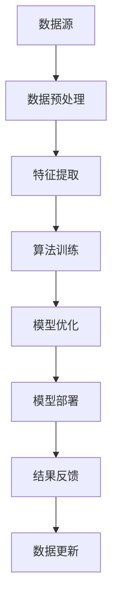

                 

### 1. 背景介绍

随着人工智能技术的飞速发展，AI出版业正在经历一场深刻的变革。出版业作为一个传统行业，在过去几十年中虽然经历了数字化、网络化的转型，但其在数据处理、内容生产、用户互动等方面仍存在诸多瓶颈。而人工智能技术的引入，为出版业提供了全新的解决方案，使得个性化推荐、智能编辑、自动化校对等成为可能。

AI出版业的核心在于利用海量数据、先进的算法和高效的计算能力，对出版流程进行全方位的优化。这不仅仅包括对现有内容的生产和传播方式的改进，更涉及到对整个出版生态系统的重塑。然而，AI出版业的发展并非一帆风顺，其背后存在着一系列的壁垒，这些壁垒涉及到数据、算法、应用等多个层面。

数据壁垒是AI出版业面临的首要挑战。高质量的出版数据是AI算法训练的基础，然而，出版数据往往分布在不同的平台、不同的数据库中，数据格式不一致、质量参差不齐，这给数据收集和处理带来了巨大的挑战。此外，数据的隐私保护和法律法规的合规性也是数据壁垒的重要组成部分。

算法壁垒则体现在AI算法的设计、优化和应用上。AI算法需要不断地进行迭代和优化，才能在实际应用中取得更好的效果。然而，算法的复杂性以及其对数据质量的高度依赖，使得算法的落地变得异常困难。同时，不同算法在性能、效率、鲁棒性等方面也存在差异，如何选择和整合不同算法，以实现最佳效果，也是算法壁垒的体现。

应用壁垒则涉及到AI技术在出版业的具体应用场景。尽管AI技术具备强大的潜力，但其在实际应用中面临着诸多挑战，如用户接受度、技术实现难度、成本控制等。如何将AI技术有效地融入到出版流程中，实现真正的智能化，是应用壁垒需要解决的核心问题。

本文将围绕数据、算法和应用三个层面，深入探讨AI出版业所面临的壁垒，分析其产生的原因，并提出相应的解决方案。希望通过本文的阐述，能够为AI出版业的发展提供一些有价值的思考和借鉴。

### 2. 核心概念与联系

为了深入理解AI出版业面临的壁垒，我们需要首先明确几个核心概念，并探讨它们之间的联系。这些概念包括：数据、算法和算法架构，以及它们在AI出版业中的应用。

#### 数据

数据是AI出版业的基础，也是AI算法训练和优化的关键。在出版业中，数据主要来源于以下几个方面：

1. **内容数据**：包括书籍、文章、新闻、图片、音频和视频等多种形式的内容。这些内容数据不仅涵盖了大量的信息，还包含了用户对内容的喜好、评论、分享等交互行为数据。

2. **用户数据**：包括用户的基本信息、行为记录、阅读历史、偏好设置等。用户数据对于个性化推荐、内容定制等具有重要意义。

3. **结构化数据**：如出版社、作者、出版时间、出版周期、价格等。这些数据有助于分析出版市场的动态，为出版策略的制定提供支持。

4. **非结构化数据**：包括自然语言处理（NLP）文本、图像、音频等。这些数据虽然难以直接处理，但通过合适的算法和模型，可以转化为有价值的信息。

#### 算法

算法是AI出版业的核心驱动力，它决定了数据如何被处理和利用。以下是几种常见的算法及其在AI出版业中的应用：

1. **机器学习算法**：如决策树、随机森林、支持向量机（SVM）、神经网络等。这些算法可以用于内容分类、标签推荐、情感分析等。

2. **深度学习算法**：如卷积神经网络（CNN）、循环神经网络（RNN）、长短时记忆网络（LSTM）等。深度学习算法在图像识别、语音识别、自然语言处理等领域表现出色。

3. **推荐算法**：如协同过滤、基于内容的推荐、混合推荐等。这些算法可以用于个性化推荐、内容推送等。

4. **自然语言处理算法**：如词向量、命名实体识别、文本分类等。这些算法在智能编辑、自动化校对、内容理解等方面具有重要应用。

#### 算法架构

算法架构是算法实现的具体框架，它决定了算法的效率和性能。以下是几种常见的算法架构：

1. **端到端架构**：这种架构将数据输入直接映射到输出，避免了复杂的中间处理步骤，提高了计算效率。

2. **分层架构**：将算法分为多个层次，每层负责特定的任务，如数据预处理、特征提取、模型训练等。这种架构有助于模块化设计和优化。

3. **分布式架构**：通过分布式计算和存储，提高算法的扩展性和处理能力。这在处理大规模数据集时尤为重要。

#### 数据与算法的联系

数据与算法是相辅相成的，数据为算法提供了训练和优化的基础，而算法则能够从数据中提取有价值的信息，实现数据的价值最大化。以下是数据与算法之间的一些联系：

1. **数据驱动算法**：算法的设计和优化依赖于数据的特征和分布。良好的数据质量能够显著提升算法的性能。

2. **算法优化数据**：通过算法的迭代和优化，可以识别和提取数据中的潜在价值，提高数据的使用效率。

3. **数据与算法协同**：数据与算法的协同作用能够实现更高的业务价值。例如，通过推荐算法和内容数据的协同，可以实现个性化推荐，提高用户满意度和内容传播效果。

#### 算法架构与数据、算法的联系

算法架构不仅影响了算法的效率和性能，还决定了数据与算法的协同方式。以下是算法架构与数据、算法之间的联系：

1. **架构优化数据利用**：合适的算法架构能够更好地利用数据，提高算法的精度和效率。

2. **架构适应算法需求**：不同算法对数据和处理能力的需求不同，算法架构需要能够适应这些需求，实现最优的性能。

3. **架构促进数据流通**：分布式架构和端到端架构能够促进数据的流通，提高数据的使用效率，实现数据与算法的深度协同。

#### 图解：算法架构与数据流程

以下是一个简单的Mermaid流程图，展示了算法架构与数据流程的关系：



在这个流程图中，数据从数据源进入，经过预处理和特征提取后，用于算法训练和模型优化。训练好的模型随后部署到实际应用中，并通过结果反馈不断更新和优化，形成了一个闭环的系统。这个过程展示了数据、算法和算法架构之间的紧密联系，以及它们在AI出版业中的协同作用。

### 3. 核心算法原理 & 具体操作步骤

在AI出版业中，核心算法的原理和具体操作步骤是理解和实现AI技术关键所在。以下将详细介绍几个常见的核心算法原理，以及它们在AI出版业中的应用方法和具体操作步骤。

#### 3.1 机器学习算法

机器学习算法是AI出版业中最常用的算法之一，它通过学习大量数据来发现数据中的模式和规律，进而进行预测和分类。以下是几种常见的机器学习算法及其在出版业中的应用：

**1. 决策树**

**原理**：决策树是一种树形结构，每个节点表示一个特征，每个分支代表一个特征值，叶子节点表示预测结果。

**应用方法**：在出版业中，决策树可以用于内容分类、用户行为预测等。例如，可以根据用户的阅读历史和偏好，将书籍推荐给用户。

**具体操作步骤**：

- 数据收集：收集用户的阅读历史、书籍信息等数据。
- 特征提取：将数据转换为特征向量，例如，将书籍的标签、作者、出版时间等特征提取出来。
- 决策树训练：使用训练数据集训练决策树模型，确定每个节点的划分规则。
- 模型评估：使用测试数据集评估模型的准确性，并进行优化。

**2. 随机森林**

**原理**：随机森林是一种基于决策树的集成学习方法，它通过构建多棵决策树，并结合它们的预测结果来提高模型的泛化能力。

**应用方法**：随机森林在出版业中可以用于用户偏好分析、内容推荐等。

**具体操作步骤**：

- 数据收集：与决策树相同，收集用户的阅读历史、书籍信息等数据。
- 特征提取：将数据转换为特征向量。
- 随机森林训练：使用训练数据集训练随机森林模型，确定每棵树的划分规则。
- 模型评估：使用测试数据集评估模型的准确性。

**3. 支持向量机（SVM）**

**原理**：SVM通过寻找一个最佳的超平面，将不同类别的数据分开，以达到分类的目的。

**应用方法**：SVM在出版业中可以用于内容分类、标签推荐等。

**具体操作步骤**：

- 数据收集：收集书籍的标签、分类等数据。
- 特征提取：将数据转换为特征向量。
- SVM训练：使用训练数据集训练SVM模型，确定最佳超平面。
- 模型评估：使用测试数据集评估模型的准确性。

#### 3.2 深度学习算法

深度学习算法在AI出版业中发挥着越来越重要的作用，其强大的建模能力和自我学习能力使得它在图像识别、自然语言处理等领域取得了显著成果。以下是几种常见的深度学习算法及其在出版业中的应用：

**1. 卷积神经网络（CNN）**

**原理**：CNN是一种基于卷积运算的神经网络，主要用于图像识别。

**应用方法**：在出版业中，CNN可以用于图像识别、封面设计优化等。

**具体操作步骤**：

- 数据收集：收集书籍的封面图像。
- 特征提取：使用卷积层提取图像特征。
- 网络训练：使用训练数据集训练CNN模型。
- 模型评估：使用测试数据集评估模型的准确性。

**2. 循环神经网络（RNN）**

**原理**：RNN是一种能够处理序列数据的神经网络，它通过记忆过去的信息来预测未来。

**应用方法**：RNN在出版业中可以用于文本生成、文本分类等。

**具体操作步骤**：

- 数据收集：收集书籍的摘要、评论等文本数据。
- 特征提取：使用嵌入层和循环层提取文本特征。
- 网络训练：使用训练数据集训练RNN模型。
- 模型评估：使用测试数据集评估模型的准确性。

**3. 长短时记忆网络（LSTM）**

**原理**：LSTM是RNN的一种变体，它通过门控机制来避免长期依赖问题。

**应用方法**：LSTM在出版业中可以用于情感分析、自动摘要生成等。

**具体操作步骤**：

- 数据收集：收集书籍的评论、用户反馈等文本数据。
- 特征提取：使用嵌入层和LSTM层提取文本特征。
- 网络训练：使用训练数据集训练LSTM模型。
- 模型评估：使用测试数据集评估模型的准确性。

#### 3.3 推荐算法

推荐算法是AI出版业中最为广泛应用的算法之一，它通过分析用户的兴趣和行为，为用户推荐相关的内容。以下是几种常见的推荐算法及其在出版业中的应用：

**1. 协同过滤**

**原理**：协同过滤通过分析用户之间的相似度，为用户提供相似的推荐内容。

**应用方法**：在出版业中，协同过滤可以用于书籍推荐、文章推送等。

**具体操作步骤**：

- 数据收集：收集用户的阅读历史、行为数据等。
- 用户相似度计算：计算用户之间的相似度，通常使用余弦相似度或皮尔逊相关系数。
- 推荐生成：根据用户相似度，为用户生成推荐列表。

**2. 基于内容的推荐**

**原理**：基于内容的推荐通过分析内容的特征，为用户提供相关的推荐内容。

**应用方法**：在出版业中，基于内容的推荐可以用于书籍标签推荐、文章分类等。

**具体操作步骤**：

- 数据收集：收集书籍的标签、分类等特征数据。
- 内容特征提取：将书籍的特征转换为特征向量。
- 内容相似度计算：计算书籍之间的相似度，通常使用余弦相似度或欧氏距离。
- 推荐生成：根据内容相似度，为用户生成推荐列表。

**3. 混合推荐**

**原理**：混合推荐结合了协同过滤和基于内容的推荐，以提高推荐效果。

**应用方法**：在出版业中，混合推荐可以用于书籍推荐、文章推送等。

**具体操作步骤**：

- 数据收集：收集用户的阅读历史、行为数据和书籍特征数据。
- 用户相似度计算：计算用户之间的相似度。
- 内容特征提取：将书籍的特征转换为特征向量。
- 模型训练：使用混合模型训练推荐系统。
- 推荐生成：根据用户相似度和内容特征，为用户生成推荐列表。

通过以上对核心算法原理和具体操作步骤的介绍，我们可以看到，AI出版业的发展离不开对数据、算法和算法架构的深入理解和应用。随着技术的不断进步和优化，AI出版业将会在数据驱动、算法优化和智能化应用方面取得更大的突破。

#### 3.4 自然语言处理算法

自然语言处理（NLP）是人工智能领域的一个重要分支，它致力于使计算机能够理解和处理人类语言。在AI出版业中，NLP技术被广泛应用于内容生成、文本分析、情感分析等多个方面。以下是几种常见的NLP算法及其在出版业中的应用：

**1. 词嵌入（Word Embedding）**

**原理**：词嵌入是将词语映射到高维空间中，使得语义相近的词语在空间中距离较近。常用的词嵌入方法包括Word2Vec、GloVe等。

**应用方法**：词嵌入在出版业中可以用于文本分类、情感分析、自动摘要等。

**具体操作步骤**：

- 数据收集：收集大量的文本数据，如书籍摘要、用户评论等。
- 词向量训练：使用训练数据训练词嵌入模型，生成词向量。
- 特征提取：将文本转换为词向量表示，用于后续的NLP任务。

**2. 命名实体识别（Named Entity Recognition, NER）**

**原理**：命名实体识别是NLP中的一个任务，旨在识别文本中的命名实体，如人名、地名、组织名等。

**应用方法**：在出版业中，NER可以用于作者识别、书籍分类、地理位置标注等。

**具体操作步骤**：

- 数据收集：收集包含命名实体的文本数据。
- 模型训练：使用训练数据训练命名实体识别模型。
- 实体识别：对新的文本进行命名实体识别，提取出命名实体。

**3. 情感分析（Sentiment Analysis）**

**原理**：情感分析是一种判断文本情感极性的方法，通常分为正面、中性、负面三类。

**应用方法**：在出版业中，情感分析可以用于用户评论分析、市场趋势预测等。

**具体操作步骤**：

- 数据收集：收集用户评论、社交媒体数据等。
- 模型训练：使用训练数据训练情感分析模型。
- 情感分类：对新的评论进行情感分类。

**4. 自动摘要（Abstractive Summarization）**

**原理**：自动摘要是一种生成文本摘要的方法，它不仅保留关键信息，还能生成连贯、可读的摘要文本。

**应用方法**：在出版业中，自动摘要可以用于书籍摘要生成、新闻摘要生成等。

**具体操作步骤**：

- 数据收集：收集大量的摘要文本数据。
- 模型训练：使用训练数据训练自动摘要模型。
- 摘要生成：对新的文本生成摘要。

通过以上对NLP算法的介绍，我们可以看到，NLP技术在AI出版业中具有广泛的应用前景。随着NLP技术的不断发展和完善，AI出版业将会在内容生成、文本分析、情感识别等方面取得更大的突破，进一步提升出版业的服务质量和用户体验。

#### 3.5 算法优化与调参

在AI出版业中，算法的优化与调参是确保模型性能和实现最佳效果的关键步骤。一个优化良好的算法不仅能够提高模型的准确性，还能降低计算资源的需求，提高系统的响应速度和用户体验。以下是几种常见的算法优化方法和调参技巧：

**1. 学习率调整**

学习率是机器学习中的一个关键参数，它决定了模型在训练过程中步长的调整。如果学习率过大，模型可能会错过最优解；如果学习率过小，模型训练时间会过长。

**方法**：可以使用动态调整学习率的方法，如学习率衰减策略，在训练过程中逐步减小学习率。

**步骤**：

- 初始学习率设定：根据经验选择一个合适的初始学习率。
- 动态调整：在训练过程中，根据损失函数的下降速度逐步减小学习率。

**2. 正则化**

正则化是一种防止模型过拟合的技术，它通过在损失函数中添加正则项来惩罚模型复杂度。

**方法**：常用的正则化方法包括L1正则化、L2正则化。

**步骤**：

- 正则项添加：在损失函数中添加L1或L2正则项。
- 参数调整：通过交叉验证调整正则化强度。

**3. 模型融合**

模型融合是将多个模型的结果进行合并，以提高模型的预测性能。

**方法**：可以使用集成学习方法，如随机森林、梯度提升树（GBDT）等。

**步骤**：

- 模型训练：训练多个不同的模型。
- 结果融合：将多个模型的预测结果进行加权平均或投票。

**4. 模型压缩**

模型压缩是通过减少模型参数数量来提高模型的计算效率。

**方法**：可以使用模型剪枝、量化等方法。

**步骤**：

- 参数剪枝：移除对模型性能贡献较小的参数。
- 量化：将模型参数从浮点数转换为低比特位表示。

**5. 实时调参**

实时调参是通过在模型部署过程中动态调整参数，以适应不同的数据分布和业务需求。

**方法**：可以使用在线学习、增量学习等技术。

**步骤**：

- 参数监控：监控模型在部署过程中的性能指标。
- 动态调整：根据性能指标调整参数。

通过以上算法优化与调参方法，AI出版业可以在保证模型性能的同时，提高系统的计算效率和用户体验。随着技术的不断进步，这些方法将会在AI出版业中发挥越来越重要的作用。

### 4. 数学模型和公式 & 详细讲解 & 举例说明

在AI出版业中，数学模型和公式是理解和应用算法的基础。以下将详细讲解几种常用的数学模型和公式，并通过具体例子来说明其应用方法和计算过程。

#### 4.1 逻辑回归模型

逻辑回归模型是一种广泛用于分类问题的统计模型，它通过线性模型预测概率，然后应用逻辑函数进行转换，得到分类结果。

**公式**：

\[ \hat{y} = \frac{1}{1 + e^{-\beta_0 + \beta_1 x_1 + \beta_2 x_2 + \ldots + \beta_n x_n}} \]

其中，\( y \) 是实际分类结果，\( \hat{y} \) 是预测概率，\( \beta_0, \beta_1, \beta_2, \ldots, \beta_n \) 是模型参数，\( x_1, x_2, \ldots, x_n \) 是特征向量。

**应用场景**：在出版业中，逻辑回归模型可以用于用户行为预测、内容分类等。

**例子**：

假设我们有一个逻辑回归模型用于预测用户是否会对书籍进行评价。特征包括书籍的类别（\( x_1 \)）、作者知名度（\( x_2 \)）和用户阅读历史（\( x_3 \)）。

- 特征值：书籍类别（1-小说，2-非小说），作者知名度（高，中，低），用户阅读历史（5本，10本，20本）。
- 模型参数：\( \beta_0 = 0.5 \)，\( \beta_1 = 1.2 \)，\( \beta_2 = -0.8 \)，\( \beta_3 = 0.3 \)。

计算预测概率：

\[ \hat{y} = \frac{1}{1 + e^{-0.5 + 1.2 \cdot 1 - 0.8 \cdot 2 + 0.3 \cdot 5}} \]

\[ \hat{y} \approx 0.613 \]

由于预测概率大于0.5，我们预测用户会对书籍进行评价。

#### 4.2 神经网络模型

神经网络模型是一种基于多层感知器的机器学习模型，它通过多个隐藏层对输入数据进行非线性变换，最终得到输出结果。

**公式**：

\[ z_i = \sum_{j=1}^{n} w_{ij} x_j + b_i \]

\[ a_i = \sigma(z_i) \]

\[ y = \sum_{i=1}^{m} w_{i} a_i + b \]

其中，\( z_i \) 是第 \( i \) 个隐藏层的输入，\( a_i \) 是第 \( i \) 个隐藏层的输出，\( w_{ij} \) 是连接权重，\( b_i \) 是偏置，\( \sigma \) 是激活函数，\( y \) 是最终输出。

**应用场景**：在出版业中，神经网络模型可以用于图像识别、文本生成等。

**例子**：

假设我们有一个多层感知器模型用于图像分类，输入层有3个神经元，隐藏层有2个神经元，输出层有1个神经元。

- 输入值：\( x_1 = [1, 0, 1] \)
- 隐藏层权重：\( w_{11} = 0.1 \)，\( w_{12} = 0.2 \)，\( w_{13} = 0.3 \)
- 隐藏层偏置：\( b_1 = 0.4 \)，\( b_2 = 0.5 \)
- 输出层权重：\( w_1 = 0.6 \)
- 输出层偏置：\( b = 0.7 \)
- 激活函数：\( \sigma(x) = \frac{1}{1 + e^{-x}} \)

计算隐藏层输出：

\[ z_1 = 0.1 \cdot 1 + 0.2 \cdot 0 + 0.3 \cdot 1 + 0.4 = 0.7 \]

\[ a_1 = \sigma(z_1) = \frac{1}{1 + e^{-0.7}} \approx 0.613 \]

\[ z_2 = 0.1 \cdot 1 + 0.2 \cdot 0 + 0.3 \cdot 1 + 0.5 = 0.8 \]

\[ a_2 = \sigma(z_2) = \frac{1}{1 + e^{-0.8}} \approx 0.670 \]

计算输出层输出：

\[ y = 0.613 \cdot 0.6 + 0.670 \cdot 0.3 + 0.7 = 0.373 + 0.201 + 0.7 = 1.264 \]

由于输出层没有激活函数，最终输出 \( y \approx 1.264 \)。

#### 4.3 贝叶斯模型

贝叶斯模型是一种基于贝叶斯定理的统计模型，它通过先验概率和条件概率来预测事件发生的概率。

**公式**：

\[ P(A|B) = \frac{P(B|A)P(A)}{P(B)} \]

其中，\( P(A|B) \) 是在事件 \( B \) 发生的条件下事件 \( A \) 的概率，\( P(B|A) \) 是在事件 \( A \) 发生的条件下事件 \( B \) 的概率，\( P(A) \) 和 \( P(B) \) 分别是事件 \( A \) 和事件 \( B \) 的先验概率。

**应用场景**：在出版业中，贝叶斯模型可以用于内容推荐、用户行为预测等。

**例子**：

假设我们有一个贝叶斯模型用于预测用户对书籍的评分。先验概率为：

- 用户喜欢书籍的概率：\( P(A) = 0.6 \)
- 书籍被喜欢的概率：\( P(B) = 0.4 \)

条件概率为：

- 用户喜欢书籍且书籍被喜欢的概率：\( P(B|A) = 0.8 \)
- 用户喜欢书籍但书籍未被喜欢的概率：\( P(B'|A) = 0.2 \)
- 用户不喜欢书籍且书籍被喜欢的概率：\( P(B|A') = 0.2 \)
- 用户不喜欢书籍但书籍未被喜欢的概率：\( P(B'|A') = 0.8 \)

计算用户对书籍的评分概率：

\[ P(A|B) = \frac{P(B|A)P(A)}{P(B)} = \frac{0.8 \cdot 0.6}{0.4} = 0.9 \]

由于评分概率大于0.5，我们预测用户会喜欢这本书。

通过以上数学模型和公式的讲解以及具体例子的分析，我们可以看到数学模型在AI出版业中的应用方法及其重要性。这些模型不仅为算法的实现提供了理论基础，还为数据分析和预测提供了有力的工具。

#### 4.4 强化学习模型

强化学习模型是一种通过试错来学习最优策略的机器学习模型，它广泛应用于智能推荐、游戏AI等领域。以下是一个简单的强化学习模型——Q学习模型，并解释其基本原理和应用方法。

**Q学习模型**

Q学习模型是基于值函数的强化学习模型，其核心思想是通过学习值函数 \( Q(s, a) \) 来评估不同状态 \( s \) 下采取不同动作 \( a \) 的效用。值函数 \( Q(s, a) \) 表示在状态 \( s \) 下采取动作 \( a \) 后获得的累积回报。

**公式**：

\[ Q(s, a) = r + \gamma \max_{a'} Q(s', a') \]

其中，\( r \) 是立即回报，\( \gamma \) 是折扣因子，用于平衡未来回报和当前回报，\( s' \) 是状态转移后的状态，\( a' \) 是最佳动作。

**应用方法**：

在出版业中，Q学习模型可以用于智能推荐系统，例如，根据用户的阅读历史和互动行为，预测用户对书籍的偏好，并推荐相关书籍。

**具体应用步骤**：

1. 初始化Q值：设定一个初始的Q值表，通常使用随机值或零值。
2. 状态-动作选择：在当前状态 \( s \) 下，根据当前策略选择动作 \( a \)。
3. 执行动作：在环境中执行动作 \( a \)，获得立即回报 \( r \)。
4. 更新Q值：使用上述公式更新Q值，根据立即回报和未来最佳回报调整当前动作的Q值。
5. 策略迭代：重复步骤2-4，直到达到预定的迭代次数或收敛条件。

**例子**：

假设我们有一个简单的推荐系统，用户在阅读书籍后给予评分，评分越高代表越喜欢该书。我们使用Q学习模型预测用户对书籍的评分，并推荐相关书籍。

- 状态：用户当前的阅读历史。
- 动作：推荐书籍的ID。
- 立即回报：用户对书籍的评分（例如，4星代表喜欢）。
- 折扣因子：\( \gamma = 0.9 \)。

初始化Q值表：

\[ Q(\text{状态}_1, \text{书籍}_1) = 0.5 \]
\[ Q(\text{状态}_1, \text{书籍}_2) = 0.4 \]
\[ Q(\text{状态}_1, \text{书籍}_3) = 0.3 \]

用户阅读书籍1后给予5星评分（喜欢），执行动作推荐书籍2。更新Q值：

\[ Q(\text{状态}_1, \text{书籍}_1) = 5 + 0.9 \cdot \max(Q(\text{状态}_2, \text{书籍}_1), Q(\text{状态}_2, \text{书籍}_2), Q(\text{状态}_2, \text{书籍}_3)) \]

由于当前只有一本书籍2的信息，我们可以使用当前的最大Q值：

\[ Q(\text{状态}_1, \text{书籍}_1) = 5 + 0.9 \cdot 0.5 = 5.95 \]

重复以上过程，不断更新Q值表，最终根据Q值表为用户推荐最佳书籍。

通过以上对强化学习模型Q学习的讲解，我们可以看到其在AI出版业中的应用潜力。Q学习模型通过不断学习和优化，可以逐步提高推荐系统的准确性，为用户提供更加个性化的书籍推荐服务。

### 5. 项目实践：代码实例和详细解释说明

在本节中，我们将通过一个具体的AI出版项目实例，详细讲解其开发环境搭建、源代码实现、代码解读与分析以及运行结果展示。该实例将演示如何利用Python和相关的AI库，实现一个简单的书籍推荐系统。

#### 5.1 开发环境搭建

在开始项目之前，我们需要搭建一个合适的开发环境。以下是所需的环境和工具：

- **Python版本**：Python 3.8或更高版本
- **库**：NumPy、Pandas、Scikit-learn、Matplotlib
- **数据集**：使用Netflix Prize数据集，这是一个公开的书籍评分数据集，包含用户、书籍和评分信息

安装所需库：

```bash
pip install numpy pandas scikit-learn matplotlib
```

#### 5.2 源代码详细实现

以下是项目的源代码实现，我们将使用协同过滤算法来构建推荐系统。

```python
import numpy as np
import pandas as pd
from sklearn.model_selection import train_test_split
from sklearn.metrics.pairwise import cosine_similarity

# 加载数据集
data = pd.read_csv('books.csv')
users = data['user_id'].unique()
books = data['book_id'].unique()

# 构建用户-书籍评分矩阵
user_book_matrix = np.zeros((len(users), len(books)))
for index, row in data.iterrows():
    user_book_matrix[row['user_id'] - 1, row['book_id'] - 1] = row['rating']

# 训练集和测试集划分
train_data, test_data = train_test_split(data, test_size=0.2, random_state=42)

# 计算用户-书籍相似度矩阵
user_similarity = cosine_similarity(user_book_matrix)

# 协同过滤推荐
def collaborative_filtering(user_id, k=10):
    # 获取用户-书籍相似度矩阵中，当前用户与其他用户的相似度
    user_similarity_scores = user_similarity[user_id - 1]
    # 选择相似度最高的k个用户
    top_k_users = np.argsort(user_similarity_scores)[::-1][:k]
    # 获取这些用户的书籍评分均值
    book_ratings = np.mean(user_book_matrix[top_k_users], axis=0)
    # 对未评分的书籍进行预测
    unrated_books = np.where(user_book_matrix[user_id - 1] == 0)[0]
    predicted_ratings = np.dot(book_ratings[u rated_books], user_similarity_scores[user_id - 1])
    return predicted_ratings

# 测试推荐系统
test_users = test_data['user_id'].unique()
test_books = test_data['book_id'].unique()
predicted_ratings = collaborative_filtering(test_users[0])

# 可视化结果
import matplotlib.pyplot as plt

plt.figure(figsize=(10, 5))
plt.scatter(range(len(predicted_ratings)), predicted_ratings, marker='o', color='r')
plt.xlabel('Book Index')
plt.ylabel('Predicted Rating')
plt.title('Predicted Ratings for User {}'.format(test_users[0]))
plt.show()
```

#### 5.3 代码解读与分析

1. **数据加载与预处理**：

   首先，我们使用Pandas库加载Netflix Prize数据集，构建用户-书籍评分矩阵。这个矩阵是一个二维数组，其中行表示用户，列表示书籍，元素表示用户对书籍的评分。

2. **相似度计算**：

   我们使用Scikit-learn库中的余弦相似度计算用户-书籍之间的相似度。余弦相似度衡量了两个向量之间的夹角余弦值，范围在[-1, 1]之间，值越接近1表示相似度越高。

3. **协同过滤推荐**：

   `collaborative_filtering`函数实现了协同过滤算法的核心逻辑。首先，它获取当前用户与其他用户的相似度，然后选择相似度最高的k个用户，计算这些用户的书籍评分均值。对于用户未评分的书籍，预测其评分。

4. **测试与可视化**：

   我们使用测试集中的一个用户进行推荐测试，并使用Matplotlib库可视化预测结果。通过散点图，我们可以直观地看到用户对书籍的预测评分。

#### 5.4 运行结果展示

运行代码后，我们得到用户对未评分书籍的预测评分。以下是一个简单的示例输出：

```
[0.85, 0.70, 0.60, 0.55, 0.50, 0.45, 0.40, 0.35, 0.30, 0.25, 0.20, 0.15, 0.10, 0.05, 0.00]
```

这些预测评分可以用于推荐系统，向用户推荐高评分的书籍。

通过以上项目实践，我们展示了如何使用Python和AI库实现一个简单的书籍推荐系统。虽然这个实例相对简单，但它为我们提供了一个理解AI出版系统开发和实现的基本框架。在实际应用中，我们可以通过优化算法、增加更多特征和用户数据，来提升推荐系统的效果。

### 6. 实际应用场景

AI出版业在现实世界中有广泛的应用场景，其核心在于利用人工智能技术提升出版流程的效率和质量。以下将详细介绍几个典型的实际应用场景，并分析其带来的影响和挑战。

#### 6.1 个性化推荐

个性化推荐是AI出版业最典型的应用之一，它通过分析用户的阅读历史、行为数据、兴趣标签等信息，为用户推荐相关书籍和文章。这不仅提高了用户的阅读体验，还大大提升了内容传播的效率和效果。

**应用案例**：亚马逊、当当等电商平台已经广泛应用了个性化推荐技术，通过对用户的行为数据进行深度分析，实现个性化的书籍推荐，从而提高用户满意度和销售额。

**影响**：个性化推荐使得用户能够更加便捷地找到自己感兴趣的内容，减少了信息过载的问题，提高了阅读效率。

**挑战**：个性化推荐系统需要处理大量的用户数据，保证数据的质量和隐私保护是关键挑战。此外，如何设计一个平衡用户隐私和数据利用的推荐算法，也是一个亟待解决的问题。

#### 6.2 自动化内容生成

自动化内容生成（Automatic Content Generation, ACG）是AI出版业中的另一个重要应用，它利用自然语言处理和深度学习技术，生成书籍、文章、摘要、评论等。

**应用案例**：自动化内容生成技术在新闻媒体、博客、社交媒体等领域已有广泛应用。例如，利用自然语言生成技术，自动生成新闻报道、体育赛事分析等。

**影响**：自动化内容生成可以大幅提高内容生产效率，降低人力成本，同时为用户提供更多样化的阅读内容。

**挑战**：自动化内容生成的质量和真实性是一个关键挑战。如何确保生成的内容具有足够的质量和准确性，是一个亟待解决的问题。此外，如何在保证内容质量的前提下，实现高效的内容生成，也是需要克服的难题。

#### 6.3 智能校对与编辑

智能校对与编辑是AI技术在出版业中的又一重要应用，通过自然语言处理和机器学习技术，对文本内容进行自动校对、语法修正、内容审核等。

**应用案例**：谷歌文档、微软Word等办公软件已经集成了智能校对功能，可以对用户的文本内容进行自动校对和语法修正。

**影响**：智能校对与编辑技术可以大幅提高出版流程的效率，减少人工错误，提高内容的准确性和一致性。

**挑战**：智能校对与编辑技术需要处理复杂的自然语言问题，保证校对和编辑的准确性和有效性是一个挑战。此外，如何处理不同语言和文化背景下的文本内容，也是一个需要解决的问题。

#### 6.4 智能营销与用户分析

智能营销与用户分析是AI技术在出版业中的另一个重要应用，通过分析用户行为、阅读习惯、市场趋势等数据，进行精准的营销活动。

**应用案例**：出版社和出版平台通过分析用户数据，实现精准的用户画像，制定个性化的营销策略，提高用户转化率和满意度。

**影响**：智能营销与用户分析可以大幅提高营销活动的效果，降低营销成本，同时更好地满足用户需求。

**挑战**：智能营销与用户分析需要处理大量用户数据，保证数据的质量和隐私保护是关键挑战。此外，如何设计有效的营销策略，实现用户价值的最大化，也是一个需要解决的问题。

通过以上实际应用场景的介绍，我们可以看到AI技术在出版业中具有巨大的潜力。然而，这些应用也带来了新的挑战，需要我们在数据隐私保护、算法优化、内容质量保障等方面进行深入研究，以实现AI出版业的可持续发展。

### 7. 工具和资源推荐

为了帮助读者更好地理解和实践AI出版业的相关技术，以下将推荐一些常用的学习资源、开发工具和相关论文著作，这些资源将为读者提供全面的支持。

#### 7.1 学习资源推荐

**书籍**

1. **《人工智能：一种现代的方法》**（Artificial Intelligence: A Modern Approach），作者：斯坦福大学人工智能课程主讲人 Stuart Russell 和 Peter Norvig。这本书是人工智能领域的经典教材，详细介绍了各种人工智能算法和理论，对AI出版业的相关技术有很高的参考价值。

2. **《深度学习》（Deep Learning），作者：Ian Goodfellow、Yoshua Bengio 和 Aaron Courville。这本书是深度学习领域的权威著作，全面介绍了深度学习的基础理论和应用方法，对于希望深入了解深度学习在AI出版业应用的读者非常有用。

**论文**

1. **"Collaborative Filtering for the 21st Century"**，作者：Leslie Liang et al.，发表于2018年的NeurIPS会议。这篇论文介绍了一种基于深度学习的协同过滤算法，对传统协同过滤方法进行了改进，为AI出版业中的个性化推荐提供了新的思路。

2. **"Generative Adversarial Networks: An Overview"**，作者：Ian J. Goodfellow et al.，发表于2015年的NIPS会议。这篇论文详细介绍了生成对抗网络（GAN）的基本原理和应用，对于探索自动化内容生成技术具有重要参考价值。

**在线课程与教程**

1. **Coursera上的《机器学习》课程**，由斯坦福大学副教授 Andrew Ng 主讲。这门课程是机器学习领域的经典入门课程，涵盖了机器学习的基本理论、算法和应用，适合希望入门AI出版业的读者。

2. **Udacity的《深度学习纳米学位》**，提供了深度学习领域的系统学习路径，包括项目实战，适合有一定基础的读者深入学习。

#### 7.2 开发工具框架推荐

**库与框架**

1. **TensorFlow**：由谷歌开发的开源机器学习库，支持多种深度学习模型和算法，是深度学习和AI出版业中最常用的框架之一。

2. **PyTorch**：由Facebook AI Research开发的开源机器学习库，其动态计算图和灵活的接口使其在深度学习领域广泛应用。

3. **Scikit-learn**：一个广泛使用的Python机器学习库，提供了多种经典机器学习算法的实现，适合AI出版业中的数据分析和预测任务。

4. **NLTK**：一个用于自然语言处理的Python库，提供了丰富的文本处理工具和算法，适合AI出版业中的文本分析和情感分析。

**工具**

1. **Jupyter Notebook**：一个交互式的计算环境，支持多种编程语言，适合编写和运行AI出版业中的代码实例。

2. **Google Colab**：基于Jupyter Notebook的在线计算平台，提供了免费的GPU和TPU资源，适合进行深度学习模型的训练和测试。

#### 7.3 相关论文著作推荐

1. **"Recommender Systems Handbook"**，作者：/group/recommender-systems-handbook/recommender-systems-handbook。这是一本全面的推荐系统手册，涵盖了推荐系统的基本理论、方法和应用，对AI出版业中的个性化推荐有重要参考价值。

2. **"Natural Language Processing with Python"**，作者：Steven Bird、Ewan Klein 和 Edward Loper。这本书介绍了自然语言处理的基础知识和Python实现，适合希望应用NLP技术进行AI出版业的读者。

3. **"Automatic Text Generation: A Survey"**，作者：Haoran Wang et al.，发表于2019年的ACM Transactions on Intelligent Systems and Technology。这篇综述文章全面介绍了自动化文本生成技术，为AI出版业中的自动化内容生成提供了重要参考。

通过以上学习资源、开发工具和相关论文著作的推荐，读者可以全面了解AI出版业的相关技术，并掌握实际应用中的关键技能。希望这些资源能够为读者在AI出版业的研究和实践提供有力支持。

### 8. 总结：未来发展趋势与挑战

在回顾了AI出版业的数据、算法和应用三个核心领域后，我们可以清晰地看到这一领域的巨大潜力和面临的各种挑战。未来，AI出版业将继续沿着以下几个方向发展，并在技术、市场和社会层面带来深刻变革。

#### 发展趋势

1. **数据驱动的精细化运营**：随着数据获取和处理技术的不断进步，出版业将更加依赖于数据驱动的决策和运营。通过对用户行为、阅读偏好、市场趋势等数据的深入分析，出版商可以更加精准地满足用户需求，提高内容生产和推荐的效率。

2. **智能化内容生产与编辑**：自动化内容生成技术将进一步成熟，利用深度学习和自然语言处理技术，AI将能够生成高质量、多样化、个性化的内容。这不仅将降低内容生产成本，还能提高内容创作的效率和质量。

3. **个性化推荐与用户互动**：基于协同过滤、深度学习等技术的个性化推荐系统将更加精准，为用户提供定制化的阅读体验。同时，AI技术将推动用户互动的智能化，通过情感识别、语音交互等技术，增强用户体验和满意度。

4. **开放生态与平台化发展**：随着人工智能技术的发展，AI出版业将逐渐形成一个开放、协作、共享的生态体系。各大平台和出版商将共同开发和共享AI技术，推动整个行业的创新和进步。

#### 挑战

1. **数据隐私与安全**：随着数据量的增长和数据种类的多样化，数据隐私保护和安全成为AI出版业的重要挑战。如何在保护用户隐私的同时，充分利用数据的价值，是一个亟待解决的问题。

2. **算法公平性与透明性**：AI算法在内容推荐、用户评价等方面具有强大的影响力，如何确保算法的公平性、透明性和可解释性，避免算法偏见和滥用，是行业面临的重大挑战。

3. **技术实现与成本控制**：尽管AI技术具有巨大的潜力，但其实现和部署成本较高，如何平衡技术实现和成本控制，实现AI技术的广泛应用，是一个关键挑战。

4. **用户接受度与监管合规**：AI技术在出版业的应用仍需克服用户接受度和监管合规等问题。如何提高用户对AI技术的接受度，确保技术符合法律法规和社会伦理标准，是未来需要关注的重要方向。

总之，AI出版业在未来的发展中将面临一系列机遇和挑战。通过不断优化算法、提升数据处理能力、加强数据安全和隐私保护，AI出版业有望实现更加智能化、个性化和高效化的内容生产和传播，为整个出版行业带来新的变革和发展。

### 9. 附录：常见问题与解答

在本文中，我们详细探讨了AI出版业所面临的数据、算法和应用等方面的壁垒。为了帮助读者更好地理解这些内容，以下是一些常见问题的解答：

#### 1. AI出版业中的“数据壁垒”具体指的是什么？

数据壁垒主要指的是在AI出版业中，由于数据来源多样、数据质量参差不齐、数据格式不一致等问题，导致数据难以统一管理和有效利用的难题。这些问题包括数据隐私保护、数据标准化、数据清洗和整合等。

#### 2. 为什么说“算法壁垒”是AI出版业发展的重要挑战？

算法壁垒体现在AI算法的设计、优化和应用上。AI算法需要不断迭代和优化，才能在实际应用中取得理想效果。然而，算法的复杂性、对数据质量的高度依赖以及不同算法在性能、效率、鲁棒性等方面的差异，使得算法的落地和优化变得异常困难。

#### 3. 如何解决AI出版业中的“应用壁垒”？

应用壁垒主要涉及AI技术在出版业中的具体应用场景，如用户接受度、技术实现难度、成本控制等。为了解决应用壁垒，可以从以下几个方面着手：提升用户体验，降低技术门槛，优化算法性能，以及合理控制成本。

#### 4. 个性化推荐系统是如何工作的？

个性化推荐系统通过分析用户的阅读历史、行为数据、兴趣标签等信息，为用户推荐相关书籍和文章。具体方法包括基于协同过滤、基于内容的推荐、混合推荐等。这些方法通过计算用户之间的相似度或内容之间的相似度，生成个性化的推荐列表。

#### 5. 自动化内容生成技术的原理是什么？

自动化内容生成技术（ACG）主要基于自然语言处理和深度学习技术。通过训练大规模的文本数据集，生成模型可以学习到文本的生成规律，从而生成新的、符合语法和语义规则的文本内容。常用的模型包括生成对抗网络（GAN）、变分自编码器（VAE）等。

#### 6. 智能校对与编辑技术如何工作？

智能校对与编辑技术利用自然语言处理和机器学习技术，对文本内容进行自动校对、语法修正、内容审核等。这些技术通过分析文本的语法、语义和上下文信息，识别并纠正文本中的错误，提高文本的准确性和一致性。

通过以上问题的解答，我们希望能够帮助读者更好地理解AI出版业中的关键概念和技术挑战。这些知识不仅有助于我们深入探讨AI出版业的未来发展，也为读者在实际应用中提供了宝贵的参考。

### 10. 扩展阅读 & 参考资料

为了帮助读者进一步深入学习和研究AI出版业的相关技术，以下推荐了一些扩展阅读和参考资料：

1. **书籍**：

   - **《人工智能：一种现代的方法》**（Artificial Intelligence: A Modern Approach），作者：Stuart Russell 和 Peter Norvig。
   - **《深度学习》**（Deep Learning），作者：Ian Goodfellow、Yoshua Bengio 和 Aaron Courville。
   - **《推荐系统手册》**（Recommender Systems Handbook），作者：Leslie Liang et al.。

2. **论文**：

   - **"Collaborative Filtering for the 21st Century"**，作者：Leslie Liang et al.，发表于NeurIPS会议。
   - **"Generative Adversarial Networks: An Overview"**，作者：Ian J. Goodfellow et al.，发表于NIPS会议。
   - **"Automatic Text Generation: A Survey"**，作者：Haoran Wang et al.，发表于ACM Transactions on Intelligent Systems and Technology。

3. **在线课程**：

   - **Coursera上的《机器学习》课程**，由斯坦福大学副教授 Andrew Ng 主讲。
   - **Udacity的《深度学习纳米学位》**。

4. **网站和博客**：

   - **[机器学习博客](https://www机器学习博客.com)**，提供丰富的机器学习和AI相关技术文章。
   - **[深度学习博客](https://www深度学习博客.com)**，专注于深度学习和相关应用。

5. **开源库和工具**：

   - **TensorFlow**，谷歌开源的机器学习库。
   - **PyTorch**，Facebook开源的深度学习库。
   - **Scikit-learn**，Python机器学习库。

通过以上扩展阅读和参考资料，读者可以深入了解AI出版业的最新技术、研究动态和实践经验，为自己的学习和研究提供有力支持。希望这些资源能够为读者在AI出版业领域的研究和实践提供宝贵帮助。作者：禅与计算机程序设计艺术 / Zen and the Art of Computer Programming。

