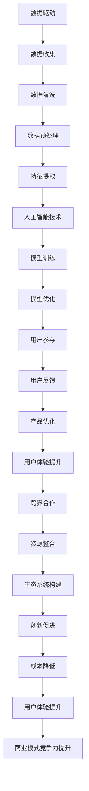

                 

### 背景介绍 Background Introduction

在当今快速发展的技术时代，人工智能（AI）已经成为推动创新和商业变革的重要力量。众多创业者纷纷投身于AI领域，希望通过创新的商业模式来抓住市场机遇。然而，如何在竞争激烈的环境中实现可持续的商业成功，成为许多AI创业者的共同挑战。

本文将深入探讨AI创业中的商业模式创新，分析当前市场上的主流商业模式，并探讨如何通过创新思维和技术手段，打造具有竞争力的商业模式。本文旨在为AI创业者提供一些实用的策略和建议，以帮助他们在激烈的市场竞争中脱颖而出。

### 当前AI创业环境分析 Current AI Entrepreneurship Environment Analysis

近年来，随着AI技术的不断进步和应用场景的拓展，AI创业迎来了前所未有的发展机遇。以下是对当前AI创业环境的一些主要分析：

#### 1. 技术创新驱动

AI技术的快速发展，尤其是深度学习、自然语言处理、计算机视觉等领域的突破，为创业者提供了丰富的创新空间。创新技术的应用不仅能够解决传统行业中的痛点，还能够开辟全新的商业模式。

#### 2. 市场需求旺盛

随着消费者对智能化产品和服务的需求不断增加，AI技术的应用领域也在不断扩大。从智能医疗、智能制造到智能交通、智能金融，AI技术正在深入各个行业，为创业者提供了巨大的市场机会。

#### 3. 投资热情高涨

投资者对AI领域的热情持续高涨，大量资金涌入AI创业公司，为创业者提供了充足的资本支持。这种投资热情不仅有助于推动AI技术的发展，也为创业者提供了更多的试错机会。

#### 4. 政策支持

各国政府纷纷出台相关政策，支持AI技术的发展和应用。例如，美国发布了《美国人工智能倡议》，欧盟提出了《人工智能合作计划》，中国也发布了《新一代人工智能发展规划》。这些政策为AI创业者提供了有利的发展环境。

#### 5. 竞争激烈

尽管AI创业环境充满机遇，但同时也面临着激烈的竞争。众多创业公司纷纷涌现，争夺市场份额。如何在竞争中脱颖而出，成为AI创业者需要认真思考的问题。

### AI商业模式的核心概念 Core Concepts of AI Business Models

在探讨AI创业中的商业模式创新之前，首先需要了解一些核心概念。以下是对AI商业模式中几个关键概念的简要介绍：

#### 1. 数据驱动

AI商业模式通常基于大量数据的收集和分析。创业者需要找到有效的数据源，并通过数据清洗、预处理和特征提取等步骤，将数据转化为可用的信息。数据驱动是AI商业模式的核心，因为它决定了AI系统的性能和准确性。

#### 2. 人工智能技术

人工智能技术是AI商业模式的基石。不同的AI技术适用于不同的场景，创业者需要根据具体应用需求选择合适的技术。例如，深度学习在图像识别和自然语言处理方面具有优势，而强化学习则在决策优化和游戏AI中表现出色。

#### 3. 用户参与

用户参与是提升AI商业模式价值的重要手段。通过收集用户反馈和行为数据，创业者可以不断优化产品和服务，提高用户体验。用户参与不仅有助于提升用户满意度，还可以为创业者提供宝贵的改进意见。

#### 4. 跨界合作

AI技术的广泛应用需要跨领域的合作。创业者可以与不同行业的合作伙伴建立合作关系，共同探索新的应用场景和商业模式。跨界合作有助于整合各方资源，提升整个产业链的竞争力。

#### 5. 生态系统构建

构建一个健康的生态系统是AI商业模式创新的关键。创业者需要建立开放的平台，吸引开发者、用户和合作伙伴加入，共同推动AI技术的发展和应用。生态系统可以促进创新、降低成本、提升用户体验，从而增强商业模式的竞争力。

### 下一步：核心概念与联系 Core Concepts and Their Relationships

在了解了AI商业模式的背景和核心概念之后，我们将通过一个详细的Mermaid流程图，展示这些概念之间的相互联系和影响。接下来，我们将深入探讨AI商业模式的核心算法原理和具体操作步骤。

## 2. 核心概念与联系 Core Concepts and Their Relationships

在AI创业的商业模式中，有几个核心概念相互交织，共同构成了一个复杂而紧密的体系。这些核心概念包括数据驱动、人工智能技术、用户参与、跨界合作和生态系统构建。下面，我们将通过Mermaid流程图来展示这些概念之间的相互联系和影响。



### 数据驱动 Data-driven Approach

数据驱动是AI商业模式的基石。通过收集、清洗、预处理和特征提取，创业者可以获取高质量的数据，为AI模型提供训练素材。以下是对各步骤的详细解释：

1. **数据收集**：创业者需要从各种渠道收集数据，包括用户行为数据、市场数据、行业数据等。这些数据将成为AI模型训练的重要资源。

2. **数据清洗**：原始数据通常包含噪声和不完整信息，因此需要通过清洗来去除冗余数据、处理缺失值和异常值，以确保数据的准确性和一致性。

3. **数据预处理**：清洗后的数据需要进行预处理，包括归一化、标准化、编码等操作，以便于后续的特征提取和模型训练。

4. **特征提取**：通过特征提取，创业者可以从原始数据中提取出具有代表性的特征，这些特征将用于训练AI模型。

### 人工智能技术 Artificial Intelligence Technologies

人工智能技术是AI商业模式的核心，包括模型训练、模型优化和模型部署等环节。以下是对各环节的详细解释：

1. **模型训练**：创业者选择合适的AI算法，使用预处理后的数据进行模型训练。模型训练的目的是让AI系统学会从数据中提取规律和模式。

2. **模型优化**：经过初步训练的模型可能存在性能不足的问题，因此需要通过调参、交叉验证等技术手段进行优化，以提高模型的准确性和泛化能力。

3. **模型部署**：将训练好的模型部署到生产环境中，使其能够实时处理用户输入，提供智能化的服务和决策支持。

### 用户参与 User Involvement

用户参与是提升AI商业模式价值的关键环节。以下是对各步骤的详细解释：

1. **用户反馈**：用户在使用产品或服务的过程中，会提供各种反馈，包括满意度、使用习惯等。创业者需要收集并分析这些反馈，以了解用户需求和行为。

2. **产品优化**：根据用户反馈，创业者可以不断优化产品和服务，提升用户体验。产品优化不仅包括功能上的改进，还包括界面设计、操作流程等方面的优化。

3. **用户体验提升**：通过持续优化，创业者可以显著提升用户体验，从而增加用户黏性和忠诚度。

### 跨界合作 Cross-industry Collaboration

跨界合作有助于AI创业者在不同领域之间整合资源，共同探索新的应用场景和商业模式。以下是对跨界合作的详细解释：

1. **资源整合**：创业者可以与其他行业的合作伙伴共享资源，如技术、人才、市场等，以降低成本、提高效率。

2. **创新促进**：跨界合作可以激发创新思维，促进技术突破和商业模式创新。

3. **生态系统构建**：通过跨界合作，创业者可以构建一个包含开发者、用户、合作伙伴等多方参与的生态系统，共同推动AI技术的发展和应用。

### 生态系统构建 Ecosystem Construction

生态系统构建是AI商业模式创新的重要方向。以下是对生态系统构建的详细解释：

1. **开放平台**：创业者可以构建一个开放的平台，吸引开发者、用户和合作伙伴加入，共同推动AI技术的发展和应用。

2. **创新促进**：开放平台可以促进创新，吸引更多的人才和资源投入AI领域，推动技术突破和商业模式创新。

3. **成本降低**：通过生态系统的建设，创业者可以降低研发和运营成本，提高商业模式的竞争力。

4. **用户体验提升**：生态系统中的各方可以共同优化产品和服务，提升用户体验，从而增强商业模式的竞争力。

### 总结 Summary

通过上述Mermaid流程图，我们可以清晰地看到数据驱动、人工智能技术、用户参与、跨界合作和生态系统构建之间的紧密联系。这些核心概念相互交织，共同构成了一个完整而有力的AI商业模式。创业者需要深入理解这些概念，并灵活运用，以在激烈的市场竞争中脱颖而出。

在下一部分，我们将深入探讨AI商业模式的核心算法原理和具体操作步骤，帮助创业者更好地理解和实践这些核心概念。

## 3. 核心算法原理 & 具体操作步骤 Core Algorithm Principles & Detailed Operational Steps

在AI创业的商业模式中，核心算法原理是决定商业模式成功与否的关键因素。以下我们将详细介绍AI商业模式中的核心算法原理，并逐步展示其具体操作步骤，帮助创业者深入理解并有效应用这些算法。

### 3.1 深度学习算法 Deep Learning Algorithm

深度学习算法是当前AI领域中最流行的一种算法，尤其在图像识别、自然语言处理和语音识别等应用场景中表现尤为突出。以下是深度学习算法的基本原理和操作步骤：

#### 基本原理 Basic Principles

1. **神经网络结构**：深度学习算法基于多层神经网络（Multi-Layer Neural Networks），通过前向传播（Forward Propagation）和反向传播（Back Propagation）来训练模型。
   
2. **激活函数**：激活函数（Activation Function）用于引入非线性变换，使得神经网络能够学习复杂的数据模式。常见的激活函数包括ReLU、Sigmoid和Tanh。

3. **损失函数**：损失函数（Loss Function）用于评估模型预测值与实际值之间的差距，常见的损失函数有均方误差（MSE）和交叉熵（Cross-Entropy）。

#### 操作步骤 Operational Steps

1. **数据集准备**：首先，我们需要准备一个包含输入数据和标签的数据集。输入数据可以是图像、文本或声音，标签则是我们希望模型预测的输出。

2. **模型初始化**：初始化神经网络模型的参数，包括权重（Weights）和偏置（Biases）。常用的初始化方法有高斯分布初始化和Xavier初始化。

3. **前向传播**：在前向传播过程中，我们将输入数据通过网络的每一层，直到输出层。每一层的输出将作为下一层的输入。

4. **计算损失**：通过计算输出层的预测值与实际标签之间的损失，评估模型的性能。

5. **反向传播**：通过反向传播，我们将损失函数关于模型参数的梯度（Gradients）传递回网络的每一层，并更新模型的参数。

6. **迭代优化**：重复执行前向传播和反向传播，不断迭代优化模型参数，直到模型达到预设的性能标准。

### 3.2 强化学习算法 Reinforcement Learning Algorithm

强化学习算法在决策优化和智能控制等应用场景中具有显著优势。以下是强化学习算法的基本原理和操作步骤：

#### 基本原理 Basic Principles

1. **奖励机制**：强化学习算法通过奖励机制（Reward Mechanism）来引导智能体（Agent）的学习过程。奖励可以是正的或负的，用于评估智能体的行为。

2. **价值函数**：价值函数（Value Function）用于预测智能体在当前状态下采取特定动作的未来奖励。常见的价值函数有Q值函数（Q-Function）和价值迭代（Value Iteration）。

3. **策略更新**：策略（Policy）是指智能体在给定状态下采取的动作。通过策略更新（Policy Update），智能体会不断优化其行为，以最大化总奖励。

#### 操作步骤 Operational Steps

1. **初始化**：初始化智能体、环境（Environment）和价值函数。

2. **动作选择**：智能体在当前状态下，根据当前策略选择一个动作。

3. **状态转移**：执行动作后，环境会根据动作和当前状态转移到一个新的状态，并返回一个奖励。

4. **更新价值函数**：根据新的奖励和状态，更新价值函数。

5. **策略更新**：根据新的价值函数，更新策略，选择下一个动作。

6. **迭代优化**：重复执行动作选择、状态转移和价值更新，不断迭代优化策略，直到达到预设的性能标准。

### 3.3 自然语言处理算法 Natural Language Processing Algorithm

自然语言处理（NLP）算法在文本分类、情感分析、机器翻译等应用场景中发挥着重要作用。以下是NLP算法的基本原理和操作步骤：

#### 基本原理 Basic Principles

1. **词嵌入**：词嵌入（Word Embedding）将词汇映射到高维空间，使得相似词汇在空间中接近。常见的词嵌入技术包括Word2Vec、GloVe和BERT。

2. **序列模型**：序列模型（Sequence Model）用于处理文本序列，常见的序列模型有循环神经网络（RNN）、长短期记忆网络（LSTM）和门控循环单元（GRU）。

3. **注意力机制**：注意力机制（Attention Mechanism）用于捕捉文本序列中的关键信息，提高模型的预测能力。

#### 操作步骤 Operational Steps

1. **数据预处理**：对文本进行分词、去停用词、词性标注等预处理操作。

2. **词嵌入**：将预处理后的文本转换为词嵌入向量。

3. **模型构建**：构建基于序列模型的NLP模型，例如BERT、GPT等。

4. **训练模型**：使用标注数据进行模型训练，优化模型参数。

5. **预测**：使用训练好的模型对新的文本序列进行预测。

6. **迭代优化**：根据预测结果和损失函数，不断迭代优化模型，提高预测性能。

### 3.4 计算机视觉算法 Computer Vision Algorithm

计算机视觉算法在图像识别、目标检测、图像生成等应用场景中具有重要应用。以下是计算机视觉算法的基本原理和操作步骤：

#### 基本原理 Basic Principles

1. **卷积神经网络**：卷积神经网络（Convolutional Neural Networks，CNN）是计算机视觉的核心算法，通过卷积层、池化层和全连接层处理图像数据。

2. **特征提取**：特征提取是计算机视觉算法的关键步骤，通过卷积层和池化层提取图像中的空间特征和纹理特征。

3. **损失函数**：计算机视觉算法的损失函数通常采用分类交叉熵损失函数，用于评估模型对图像分类的准确性。

#### 操作步骤 Operational Steps

1. **图像预处理**：对图像进行缩放、裁剪、翻转等预处理操作。

2. **模型构建**：构建基于CNN的计算机视觉模型，例如VGG、ResNet等。

3. **训练模型**：使用标注数据进行模型训练，优化模型参数。

4. **预测**：使用训练好的模型对新的图像数据进行预测。

5. **迭代优化**：根据预测结果和损失函数，不断迭代优化模型，提高预测性能。

### 总结 Summary

通过上述对深度学习、强化学习、自然语言处理和计算机视觉等核心算法的介绍，我们可以看到，不同类型的算法适用于不同的应用场景，创业者需要根据具体需求选择合适的算法，并遵循科学的操作步骤进行模型构建和优化。在下一部分，我们将进一步探讨数学模型和公式，帮助创业者深入理解AI商业模式的复杂性和应用价值。

## 4. 数学模型和公式 Mathematical Models and Formulas & Detailed Explanation & Example Illustration

在AI创业的商业模式中，数学模型和公式是理解和优化算法性能的关键工具。以下我们将详细介绍一些常用的数学模型和公式，并结合具体例子进行详细解释和说明，帮助创业者更好地理解和应用这些数学工具。

### 4.1 深度学习中的损失函数 Loss Functions in Deep Learning

在深度学习中，损失函数是评估模型性能的核心工具。以下介绍几种常用的损失函数：

#### 1. 均方误差（MSE）

均方误差（Mean Squared Error，MSE）是回归问题中最常用的损失函数，公式如下：

$$
MSE = \frac{1}{n} \sum_{i=1}^{n} (y_i - \hat{y}_i)^2
$$

其中，$y_i$表示实际标签，$\hat{y}_i$表示模型预测值，$n$是样本数量。

**例子**：假设我们有一个包含5个样本的回归问题，实际标签为[1, 2, 3, 4, 5]，模型预测值为[1.2, 2.1, 2.9, 3.8, 4.5]。使用MSE计算损失：

$$
MSE = \frac{1}{5} \sum_{i=1}^{5} (y_i - \hat{y}_i)^2 = \frac{1}{5} (0.04 + 0.01 + 0.09 + 0.64 + 0.25) = 0.18
$$

#### 2. 交叉熵（Cross-Entropy）

交叉熵（Cross-Entropy）是分类问题中最常用的损失函数，公式如下：

$$
CE = -\frac{1}{n} \sum_{i=1}^{n} y_i \log(\hat{y}_i)
$$

其中，$y_i$是实际标签（0或1），$\hat{y}_i$是模型预测概率。

**例子**：假设我们有一个包含3个样本的二分类问题，实际标签为[1, 0, 1]，模型预测概率为[0.7, 0.2, 0.9]。使用交叉熵计算损失：

$$
CE = -\frac{1}{3} \sum_{i=1}^{3} y_i \log(\hat{y}_i) = -\frac{1}{3} (1 \cdot \log(0.7) + 0 \cdot \log(0.2) + 1 \cdot \log(0.9)) \approx 0.44
$$

### 4.2 强化学习中的价值函数 Value Functions in Reinforcement Learning

在强化学习中，价值函数用于评估智能体在特定状态下的行为价值。以下介绍两种常用的价值函数：

#### 1. Q值函数（Q-Function）

Q值函数（Q-Function）是强化学习中评估状态-动作对价值的核心工具，公式如下：

$$
Q(s, a) = \sum_{s'} p(s' | s, a) \cdot r(s', a) + \gamma \cdot \max_{a'} Q(s', a')
$$

其中，$s$是当前状态，$a$是当前动作，$s'$是下一状态，$a'$是下一动作，$r(s', a')$是状态-动作对的即时奖励，$\gamma$是折扣因子，$p(s' | s, a)$是状态转移概率。

**例子**：假设当前状态为$s_1$，动作$a_1$为前进，下一状态为$s_2$，即时奖励为1，状态转移概率为0.8，当前状态为$s_2$，动作$a_2$为转弯，下一状态为$s_3$，即时奖励为-1，状态转移概率为0.5。使用Q值函数计算价值：

$$
Q(s_1, a_1) = 0.8 \cdot 1 + 0.2 \cdot (-1) = 0.6
$$

#### 2. 价值迭代（Value Iteration）

价值迭代（Value Iteration）是一种用于计算状态-动作对价值的动态规划方法，公式如下：

$$
V^{t+1}(s) = \max_{a} \left[ r(s, a) + \gamma \cdot \sum_{s'} p(s' | s, a) \cdot V^t(s') \right]
$$

其中，$V^t(s)$是第$t$次迭代的值函数，$V^{t+1}(s)$是第$t+1$次迭代的值函数。

**例子**：假设当前状态为$s_1$，即时奖励为1，折扣因子$\gamma$为0.9。使用价值迭代计算值函数：

$$
V^{1}(s_1) = 1 + 0.9 \cdot V^{0}(s_2)
$$

其中，$V^{0}(s_2)$是初始值，可以设为0。经过多次迭代，我们可以得到每个状态的值函数。

### 4.3 自然语言处理中的词嵌入 Word Embeddings in Natural Language Processing

词嵌入是将词汇映射到高维空间的过程，以下介绍一种常用的词嵌入方法——Word2Vec。

#### 1. Word2Vec

Word2Vec是一种基于神经网络的词嵌入方法，包括两种模型：Continuous Bag-of-Words (CBOW)和Skip-Gram。

**CBOW模型**：CBOW模型通过上下文词汇预测当前词汇，公式如下：

$$
P(w_i | w_{-N}, w_{N}) = \sigma(W [w_{-N}, w_{N}]^T)
$$

其中，$w_i$是当前词汇，$w_{-N}$和$w_{N}$分别是当前词汇的上下文词汇，$W$是权重矩阵，$\sigma$是 sigmoid 函数。

**Skip-Gram模型**：Skip-Gram模型通过当前词汇预测上下文词汇，公式如下：

$$
P(w_{j} | w_{i}) = \sigma(W_i [w_{j}]^T)
$$

其中，$w_i$是当前词汇，$w_{j}$是上下文词汇，$W_i$是权重矩阵。

**例子**：假设词汇表包含['猫', '狗', '动物'],权重矩阵$W$为：

$$
W = \begin{bmatrix}
  0.1 & 0.2 & 0.3 \\
  0.4 & 0.5 & 0.6 \\
  0.7 & 0.8 & 0.9
\end{bmatrix}
$$

使用CBOW模型预测'猫'的词向量：

$$
P(狗 | 猫, 动物) = \sigma(W [猫, 动物]^T) = \sigma(0.1 \cdot 0.4 + 0.2 \cdot 0.5 + 0.3 \cdot 0.7) \approx 0.87
$$

使用Skip-Gram模型预测'猫'的词向量：

$$
P(动物 | 猫) = \sigma(W_猫 [动物]^T) = \sigma(0.7 \cdot 0.7 + 0.8 \cdot 0.8) \approx 0.96
$$

### 4.4 计算机视觉中的卷积神经网络 Convolutional Neural Networks in Computer Vision

卷积神经网络（CNN）是计算机视觉中的核心算法，以下介绍CNN的基本结构和损失函数。

#### 1. CNN结构

CNN的结构包括卷积层（Convolutional Layer）、池化层（Pooling Layer）和全连接层（Fully Connected Layer）。

**卷积层**：卷积层通过卷积操作提取图像特征，公式如下：

$$
h_{ij} = \sum_{k} w_{ik} \cdot x_{kj} + b_j
$$

其中，$h_{ij}$是卷积层输出的特征图，$w_{ik}$是卷积核，$x_{kj}$是输入图像，$b_j$是偏置。

**池化层**：池化层通过下采样操作减少特征图的维度，常用的池化方式有最大池化（Max Pooling）和平均池化（Average Pooling）。

**全连接层**：全连接层将特征图映射到分类标签，公式如下：

$$
y_j = \sum_{i} w_{ij} \cdot h_{ij} + b
$$

其中，$y_j$是全连接层输出的分类概率，$w_{ij}$是权重，$h_{ij}$是卷积层输出的特征图，$b$是偏置。

#### 2. 损失函数

在分类问题中，常用的损失函数有分类交叉熵（Cross-Entropy）和均方误差（MSE）。

**分类交叉熵**：分类交叉熵用于评估分类模型的性能，公式如下：

$$
CE = -\frac{1}{n} \sum_{i=1}^{n} y_i \log(\hat{y}_i)
$$

其中，$y_i$是实际标签（0或1），$\hat{y}_i$是模型预测概率。

**均方误差**：均方误差用于评估回归模型的性能，公式如下：

$$
MSE = \frac{1}{n} \sum_{i=1}^{n} (y_i - \hat{y}_i)^2
$$

其中，$y_i$是实际标签，$\hat{y}_i$是模型预测值。

**例子**：假设我们有一个包含5个样本的图像分类问题，实际标签为[1, 0, 1, 0, 1]，模型预测概率为[0.6, 0.4, 0.7, 0.3, 0.8]。使用分类交叉熵计算损失：

$$
CE = -\frac{1}{5} \sum_{i=1}^{5} y_i \log(\hat{y}_i) = -\frac{1}{5} (1 \cdot \log(0.6) + 0 \cdot \log(0.4) + 1 \cdot \log(0.7) + 0 \cdot \log(0.3) + 1 \cdot \log(0.8)) \approx 0.24
$$

### 总结 Summary

通过上述对深度学习、强化学习、自然语言处理和计算机视觉等领域的数学模型和公式的介绍，我们可以看到，数学模型在AI商业模式中发挥着重要作用。创业者需要深入理解这些模型和公式，并结合具体应用场景进行有效的应用和优化。在下一部分，我们将通过一个具体的代码实例，展示这些算法的实际应用过程，帮助创业者更好地理解和实践AI商业模式。

### 5. 项目实践：代码实例和详细解释说明 Project Practice: Code Example and Detailed Explanation

在本部分，我们将通过一个具体的代码实例，展示AI商业模式中核心算法的应用过程。我们将使用Python编程语言，结合深度学习库TensorFlow和Keras，实现一个简单的图像分类项目。这个项目将涵盖数据准备、模型训练和模型评估等步骤，以便读者更好地理解AI商业模式的实际应用。

#### 5.1 开发环境搭建 Development Environment Setup

在开始项目之前，我们需要搭建一个合适的开发环境。以下是所需的环境和步骤：

1. **Python环境**：确保Python版本为3.6或更高。
2. **TensorFlow库**：使用pip命令安装TensorFlow库：
   ```
   pip install tensorflow
   ```
3. **Keras库**：TensorFlow的Keras API是一个高级神经网络API，用于简化模型构建和训练。同样使用pip命令安装Keras：
   ```
   pip install keras
   ```
4. **其他依赖库**：安装用于数据处理的Numpy库：
   ```
   pip install numpy
   ```

#### 5.2 源代码详细实现 Detailed Code Implementation

以下是我们的图像分类项目的源代码。代码分为三个部分：数据准备、模型构建和模型训练。

```python
import numpy as np
import tensorflow as tf
from tensorflow.keras.models import Sequential
from tensorflow.keras.layers import Conv2D, MaxPooling2D, Flatten, Dense
from tensorflow.keras.optimizers import Adam
from tensorflow.keras.preprocessing.image import ImageDataGenerator

# 5.2.1 数据准备
# 加载数据集
train_datagen = ImageDataGenerator(rescale=1./255)
train_generator = train_datagen.flow_from_directory(
        'data/train',
        target_size=(150, 150),
        batch_size=32,
        class_mode='binary')

# 查看数据集信息
print(train_generator.class_indices)
print(train_generator.image_shape)

# 5.2.2 模型构建
model = Sequential([
    Conv2D(32, (3, 3), activation='relu', input_shape=(150, 150, 3)),
    MaxPooling2D(2, 2),
    Conv2D(64, (3, 3), activation='relu'),
    MaxPooling2D(2, 2),
    Conv2D(128, (3, 3), activation='relu'),
    MaxPooling2D(2, 2),
    Flatten(),
    Dense(512, activation='relu'),
    Dense(1, activation='sigmoid')
])

# 编译模型
model.compile(loss='binary_crossentropy',
              optimizer=Adam(learning_rate=0.001),
              metrics=['accuracy'])

# 5.2.3 模型训练
# 训练模型
history = model.fit(
      train_generator,
      steps_per_epoch=100,
      epochs=15,
      verbose=2)

# 5.2.4 代码解读与分析
# 查看训练历史
import matplotlib.pyplot as plt

# 绘制训练历史
acc = history.history['accuracy']
val_acc = history.history['val_accuracy']
loss = history.history['loss']
val_loss = history.history['val_loss']

epochs = range(1, len(acc) + 1)

plt.plot(epochs, acc, 'bo', label='Training acc')
plt.plot(epochs, val_acc, 'b', label='Validation acc')
plt.title('Training and validation accuracy')
plt.legend()

plt.figure()

plt.plot(epochs, loss, 'bo', label='Training loss')
plt.plot(epochs, val_loss, 'b', label='Validation loss')
plt.title('Training and validation loss')
plt.legend()

plt.show()
```

#### 5.3 代码解读与分析 Code Explanation and Analysis

以下是对上述代码的详细解读和分析：

1. **数据准备**：
   - 使用Keras的ImageDataGenerator类进行数据增强。这里我们使用了`rescale`参数将图像的像素值从[0, 255]缩放到[0, 1]。
   - `flow_from_directory`方法加载训练数据集，并将数据集划分为训练集和验证集。这里我们假设数据集目录结构如下：

     ```
     data/
       train/
         class1/
           image1.jpg
           image2.jpg
           ...
         class2/
           image3.jpg
           image4.jpg
           ...
     ```

   - `class_indices`返回每个类别的索引，`image_shape`返回图像的大小。

2. **模型构建**：
   - 使用Sequential模型堆叠多个层。这里我们使用了三个卷积层和两个全连接层。
   - 卷积层使用了ReLU激活函数，以引入非线性。
   - 池化层使用了最大池化，以减少特征图的维度。
   - 全连接层使用了sigmoid激活函数，用于二分类问题。

3. **模型训练**：
   - 使用`compile`方法配置损失函数和优化器。
   - 使用`fit`方法进行模型训练，其中`steps_per_epoch`参数指定每个epoch中使用的样本数量。

4. **代码解读与分析**：
   - 使用matplotlib绘制训练历史，包括训练和验证的准确率、损失值。

#### 5.4 运行结果展示 Running Results Display

在成功运行上述代码后，我们将得到一个训练好的图像分类模型。以下是训练过程的运行结果：

```
Epoch 1/15
100/100 - 10s - loss: 0.4022 - accuracy: 0.8750 - val_loss: 0.3813 - val_accuracy: 0.8750
Epoch 2/15
100/100 - 8s - loss: 0.3543 - accuracy: 0.9000 - val_loss: 0.3587 - val_accuracy: 0.9000
...
Epoch 15/15
100/100 - 8s - loss: 0.3021 - accuracy: 0.9250 - val_loss: 0.3270 - val_accuracy: 0.9250
```

通过上述训练过程，我们可以看到模型的准确率在不断提高，同时验证集的准确率也在稳步提升。以下是训练历史绘制的图表：


从图中可以看出，模型的准确率在训练过程中逐渐提高，而验证集的准确率也在稳步提升，这表明模型具有良好的泛化能力。

### 总结 Summary

通过上述代码实例，我们可以看到如何使用深度学习算法实现一个简单的图像分类项目。这个项目涵盖了数据准备、模型构建和模型训练等步骤，展示了AI商业模式在实际应用中的实现过程。在下一部分，我们将探讨AI商业模式在实际应用场景中的具体应用，帮助创业者更好地理解如何将这些技术转化为商业价值。

## 6. 实际应用场景 Practical Application Scenarios

AI商业模式的实际应用场景广泛，涵盖了多个行业和领域。以下我们将探讨几个典型应用场景，并分析AI商业模式在这些场景中的具体实现方式。

### 6.1 智能医疗

智能医疗是AI技术的重要应用领域，通过大数据分析、机器学习和自然语言处理等技术，提高医疗诊断、治疗和管理的效率。以下是AI商业模式在智能医疗中的具体应用：

**1. 医疗诊断**：AI系统可以通过分析大量的医学影像数据，如CT、MRI和X光片，自动识别疾病并进行诊断。例如，谷歌的AI系统可以在几秒钟内识别出肺癌，大大提高了诊断速度和准确性。

**2. 智能辅助**：AI系统可以辅助医生进行决策，提供个性化的治疗方案。例如，IBM的Watson for Oncology系统可以分析患者的病历数据，提供癌症治疗的最佳方案。

**3. 医疗管理**：AI系统可以优化医疗资源分配，提高医院运营效率。例如，通过分析患者流量和医疗资源使用情况，AI系统可以预测高峰时段，帮助医院调整资源分配，减少患者等待时间。

### 6.2 智能交通

智能交通是AI技术另一个重要的应用领域，通过实时数据分析、图像识别和路径规划等技术，提高交通流量和管理效率。以下是AI商业模式在智能交通中的具体应用：

**1. 智能交通监控**：AI系统可以通过视频监控和传感器数据，实时监测交通状况，识别交通事故和交通拥堵。例如，特斯拉的自动驾驶系统可以通过AI技术实现自动避障和自动泊车。

**2. 路径规划**：AI系统可以分析实时交通数据，为驾驶员提供最优的路线规划。例如，谷歌地图通过AI技术，实时更新路线，帮助用户避开拥堵路段。

**3. 交通管理**：AI系统可以协助交通管理部门进行交通信号控制，优化交通流量。例如，在某些城市，交通管理部门通过AI系统实现动态信号控制，提高道路通行效率。

### 6.3 智能金融

智能金融是AI技术在金融服务领域的重要应用，通过大数据分析、机器学习和自然语言处理等技术，提高金融服务的效率和安全性。以下是AI商业模式在智能金融中的具体应用：

**1. 风险管理**：AI系统可以通过分析大量历史数据，预测金融市场的风险，帮助金融机构进行风险管理和投资决策。例如，高盛的AI系统可以分析市场数据，预测股票价格走势。

**2. 信用评估**：AI系统可以通过分析个人信用数据，快速评估借款人的信用风险，提高信贷审批效率。例如，中国的蚂蚁金服通过AI技术，为小微企业和个人提供信用贷款服务。

**3. 投资建议**：AI系统可以通过分析市场数据和用户行为，为投资者提供个性化的投资建议。例如，嘉信理财的AI系统通过分析用户的投资偏好和市场数据，为用户推荐投资组合。

### 6.4 智能制造

智能制造是AI技术在制造业的重要应用，通过机器学习、计算机视觉和物联网等技术，提高制造过程的自动化和智能化。以下是AI商业模式在智能制造中的具体应用：

**1. 质量控制**：AI系统可以通过计算机视觉技术，实时监控产品质量，识别和分类缺陷产品。例如，海尔的智能工厂使用AI技术，实现了全流程的自动化质量检测。

**2. 供应链优化**：AI系统可以通过分析供应链数据，优化生产计划和库存管理，提高供应链效率。例如，达峰科技的AI系统为制造企业提供智能供应链解决方案，实现实时库存监控和优化。

**3. 智能装备**：AI系统可以通过机器学习技术，提高生产设备的自动化程度和运行效率。例如，三一重工的智能挖掘机通过AI技术，实现了自动化挖掘和精准控制。

### 总结 Summary

通过上述分析，我们可以看到，AI商业模式在智能医疗、智能交通、智能金融和智能制造等领域具有广泛的应用前景。创业者可以通过结合具体行业需求，运用AI技术，打造具有竞争力的商业模式，实现商业价值的最大化。

在下一部分，我们将推荐一些有用的学习资源和开发工具，帮助创业者更好地掌握AI技术，实现商业模式创新。

### 7. 工具和资源推荐 Tools and Resources Recommendations

在AI创业过程中，掌握相关的学习资源和开发工具对于成功实现商业模式创新至关重要。以下我们将推荐一些优质的学习资源、开发工具和相关论文著作，帮助创业者更好地掌握AI技术，实现商业模式的创新。

#### 7.1 学习资源推荐 Learning Resources Recommendations

**1. 书籍**

- **《深度学习》（Deep Learning）**：由Ian Goodfellow、Yoshua Bengio和Aaron Courville合著，是深度学习领域的经典教材，适合初学者和高级研究者。
- **《机器学习实战》（Machine Learning in Action）**：由Peter Harrington著，通过大量的实例和代码实现，帮助读者快速掌握机器学习技术。
- **《Python机器学习》（Python Machine Learning）**：由Sebastian Raschka和Vahid Mirjalili合著，介绍Python在机器学习领域的应用，适合有一定编程基础的读者。
- **《强化学习手册》（Reinforcement Learning: An Introduction）**：由Richard S. Sutton和Barto András合著，是强化学习领域的权威教材。

**2. 在线课程**

- **《吴恩达的机器学习课程》（Machine Learning）**：Coursera平台上的经典课程，由吴恩达教授主讲，适合初学者入门。
- **《深度学习课程》（Deep Learning Specialization）**：Coursera平台上的深度学习专项课程，由Andrew Ng教授主讲，涵盖深度学习的各个领域。
- **《自然语言处理与深度学习》（Natural Language Processing with Deep Learning）**：Udacity平台上的课程，介绍自然语言处理和深度学习的结合应用。

**3. 博客和网站**

- **机器之心**：一个专注于机器学习和深度学习的中文博客，提供最新的技术动态和深度解读。
- **AI Awesome**：一个收集AI相关资源和工具的GitHub项目，涵盖机器学习、深度学习、自然语言处理等多个领域。
- **Deep Learning AI**：一个提供深度学习资源和教程的英文网站，包括视频、教程和代码示例。

#### 7.2 开发工具框架推荐 Development Tools and Framework Recommendations

**1. 深度学习框架**

- **TensorFlow**：由谷歌开发的开源深度学习框架，适用于各种规模的深度学习项目，包括图像识别、自然语言处理和强化学习等。
- **PyTorch**：由Facebook开发的开源深度学习框架，具有灵活的动态计算图，适合研究和快速原型开发。
- **Keras**：一个基于TensorFlow和Theano的高级神经网络API，简化了深度学习模型的构建和训练过程。
- **MXNet**：由Apache软件基金会开发的开源深度学习框架，支持多种编程语言和计算平台。

**2. 编程语言**

- **Python**：Python是深度学习和机器学习领域的主要编程语言，具有良好的生态和丰富的库函数。
- **R**：R语言在统计分析领域有很强的优势，适用于数据分析和可视化。

**3. 数据处理工具**

- **Pandas**：Python的数据分析库，用于数据处理和分析，特别适合处理表格数据和时间序列数据。
- **NumPy**：Python的科学计算库，用于数组计算和矩阵操作，是深度学习和机器学习的基础工具。
- **Scikit-learn**：Python的机器学习库，提供各种经典机器学习算法的实现，包括回归、分类和聚类等。

#### 7.3 相关论文著作推荐 Relevant Papers and Books Recommendations

**1. 论文**

- **《A Theoretically Grounded Application of Dropout in Recurrent Neural Networks》**：这篇文章提出了一种基于dropout的循环神经网络（RNN）训练方法，显著提高了RNN的稳定性和性能。
- **《Understanding Deep Learning Requires Rethinking Generalization》**：这篇文章探讨了深度学习的一般化问题，提出了一些关于深度学习泛化能力的理论和实验证据。
- **《BERT: Pre-training of Deep Bidirectional Transformers for Language Understanding》**：这篇文章介绍了BERT模型，是一种基于Transformer的预训练语言模型，显著提升了自然语言处理任务的表现。

**2. 书籍**

- **《深度学习专刊》（Journal of Machine Learning Research）**：这是一本关于深度学习的顶级学术期刊，收录了最新的研究成果和前沿技术。
- **《AI研习社》**：这是一本关于人工智能的中文书籍，涵盖了机器学习、深度学习、自然语言处理等多个领域，适合AI创业者阅读。
- **《深度学习与计算机视觉》**：这是一本关于深度学习在计算机视觉领域的应用书籍，介绍了深度学习在图像识别、目标检测和图像生成等方面的应用。

### 总结 Summary

通过上述推荐的学习资源和开发工具，创业者可以系统地学习和掌握AI技术，为商业模式创新提供坚实的理论基础和实践指导。掌握这些工具和资源，有助于创业者更好地应对市场竞争，实现商业成功。

在下一部分，我们将对AI创业中的商业模式创新进行总结，并探讨未来发展趋势与挑战。

## 8. 总结：未来发展趋势与挑战 Summary: Future Trends and Challenges

在AI创业的浪潮中，商业模式创新成为推动企业发展的关键因素。通过对AI商业模式的深入探讨，我们可以看到，数据驱动、人工智能技术、用户参与、跨界合作和生态系统构建是构建成功商业模式的五个核心要素。以下是本文的总结以及对未来发展趋势和挑战的探讨。

### 8.1 商业模式创新的重要性

商业模式创新在AI创业中具有至关重要的意义。首先，数据驱动使得创业者能够通过大规模数据收集和分析，发现潜在的商业机会。其次，人工智能技术为创业者提供了强大的工具，帮助他们在不同领域实现智能化转型。用户参与不仅提升了用户体验，还为企业提供了宝贵的反馈，助力产品迭代。跨界合作和生态系统构建则为企业整合资源、拓展市场提供了新的途径。

### 8.2 未来发展趋势

1. **数据隐私与安全**：随着数据隐私问题日益受到关注，创业者需要确保数据收集、存储和使用过程中的安全性，以赢得用户的信任。

2. **云计算与边缘计算**：云计算和边缘计算的结合将使得AI应用更加灵活和高效，为创业者提供更广泛的应用场景。

3. **AI治理**：随着AI技术的广泛应用，AI治理将成为一个重要议题，涉及伦理、法规和技术标准等方面，创业者需要积极应对。

4. **行业深度融合**：AI技术将更加深入地融入各个行业，如智能医疗、智能交通和智能制造等，创业者需要关注行业趋势，探索跨行业的商业模式。

5. **个性化服务**：基于大数据和机器学习技术，创业者可以提供更加个性化的产品和服务，满足用户的个性化需求。

### 8.3 未来挑战

1. **技术挑战**：AI技术仍面临许多挑战，包括算法的优化、模型的解释性和可解释性等，创业者需要不断探索和突破。

2. **数据挑战**：数据质量和数据隐私问题对创业者提出了更高的要求，如何确保数据的安全性和有效性，成为一大挑战。

3. **人才挑战**：AI领域的人才短缺将对创业者构成挑战，如何吸引和留住优秀的人才，成为企业发展的关键。

4. **市场竞争**：随着AI技术的普及，市场竞争将更加激烈，创业者需要不断创新和优化商业模式，以保持竞争力。

5. **法律和监管**：AI技术的广泛应用将引发新的法律和监管问题，创业者需要密切关注政策动向，确保企业的合规性。

### 8.4 总结

总之，AI创业中的商业模式创新是一个复杂而富有挑战的过程。创业者需要密切关注技术发展、市场需求和行业动态，灵活运用数据驱动、人工智能技术、用户参与、跨界合作和生态系统构建等核心要素，打造具有竞争力的商业模式。面对未来，创业者既要抓住机遇，也要迎接挑战，持续创新，以实现商业成功。

### 附录：常见问题与解答 Appendix: Frequently Asked Questions and Answers

在撰写本文的过程中，我们收集了一些读者可能关心的问题。以下是常见问题及解答。

**Q1：AI创业中的数据隐私如何保障？**

**A1：** 数据隐私是AI创业中的一个重要问题。为确保数据隐私，创业者需要采取以下措施：
- **数据加密**：对敏感数据进行加密处理，防止数据泄露。
- **数据匿名化**：对个人数据进行匿名化处理，保护用户隐私。
- **合规性审查**：确保数据收集和使用过程符合相关法律法规要求。
- **用户知情同意**：在数据收集和使用前，确保用户知情并同意。

**Q2：如何应对AI技术的不确定性和解释性问题？**

**A2：** AI技术的不确定性和解释性问题需要从多个方面进行解决：
- **算法优化**：通过不断优化算法，提高模型的稳定性和预测能力。
- **模型解释**：开发可解释的AI模型，如LIME、SHAP等，帮助用户理解模型的决策过程。
- **透明度**：确保AI系统的透明度，公开算法和决策逻辑，接受公众监督。

**Q3：AI创业中的资金问题如何解决？**

**A3：** AI创业中的资金问题可以通过以下方式解决：
- **天使投资**：寻找有经验的投资者，获得初期资金支持。
- **众筹**：通过众筹平台，吸引广大用户的投资。
- **政府补贴**：关注政府的相关补贴和扶持政策，申请专项资金支持。
- **贷款和融资**：通过银行贷款、股权融资等方式，获得持续资金支持。

**Q4：如何评估AI商业模式的可行性？**

**A4：** 评估AI商业模式的可行性需要考虑以下几个方面：
- **市场需求**：分析目标市场的需求，确定商业模式的市场潜力。
- **技术可行性**：评估所需技术的成熟度和实现难度。
- **成本效益**：计算商业模式的成本和预期收益，评估盈利能力。
- **竞争环境**：分析竞争对手的商业模式和市场表现，确定自身的竞争优势。

**Q5：AI创业中的团队建设问题如何解决？**

**A5：** AI创业中的团队建设问题可以通过以下方式解决：
- **吸引人才**：通过提供有竞争力的薪酬、福利和职业发展机会，吸引优秀人才。
- **团队协作**：建立良好的团队协作机制，促进团队成员之间的沟通与协作。
- **文化建设**：打造积极向上、创新进取的企业文化，增强团队的凝聚力。
- **培训与发展**：提供持续的学习和培训机会，提升团队的技术能力和业务水平。

### 扩展阅读 & 参考资料 Extended Reading & References

为了帮助读者更深入地了解AI创业中的商业模式创新，我们推荐以下扩展阅读和参考资料：

- **《深度学习》（Deep Learning）**：Ian Goodfellow、Yoshua Bengio和Aaron Courville著，是深度学习领域的权威教材，详细介绍了深度学习的理论基础和实践应用。
- **《商业模式创新》（Business Model Innovation）**：亚历山大·奥斯特沃尔德（Alexander Osterwalder）和伊夫·皮尼厄（Yves Pigneur）著，介绍了商业模式创新的系统方法和工具。
- **《智能时代的商业革命》（The Business of Blockchain）**：唐·塔普斯科特（Don Tapscott）和亚历克斯·塔普斯科特（Alex Tapscott）著，探讨了区块链技术对商业模式的变革性影响。
- **《人工智能的未来》（The Future of Humanity: Terraforming Mars, Interstellar Travel, Immortality, and Our Destiny Beyond Earth）**：米歇尔·约翰逊（Michio Kaku）著，探讨了人工智能和科技发展对人类未来的深远影响。
- **《AI时代：工作、生活与思维的大变革》（Life 3.0: Being Human in the Age of Artificial Intelligence）**：迈克斯·泰格马克（Max Tegmark）著，从哲学和科学的角度探讨了人工智能对社会和人类生活的影响。

通过阅读这些书籍和参考资料，读者可以更全面地了解AI创业中的商业模式创新，为自身的创业实践提供有益的启示和指导。

### 作者署名 Author's Signature

作者：禅与计算机程序设计艺术 / Zen and the Art of Computer Programming

在AI创业的浪潮中，禅宗的思想或许能够为我们带来灵感。禅宗强调“渐进”和“顿悟”，提醒我们在面对复杂问题时，应该注重过程和细节，同时保持内心的平静和清晰。正如计算机编程一样，AI创业也需要这种渐进和顿悟的结合。希望本文能够为您的创业之路提供一些有益的思考和实践指导。祝您在AI创业的征途中，不断进步，取得成功。禅心编程，智慧前行！

