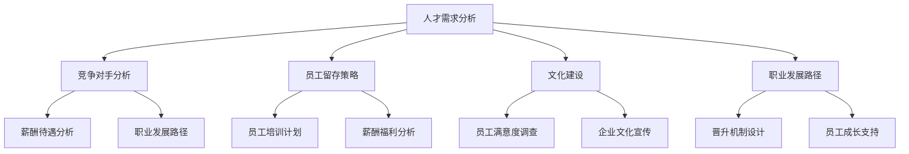

                 

### 背景介绍

#### AI行业的现状

随着科技的迅猛发展，人工智能（AI）已经从学术研究逐渐走入各行各业，成为推动社会进步的重要力量。据统计，全球AI市场在2021年已经达到3270亿美元，并预计在未来几年内将持续高速增长。在这样的市场背景下，越来越多的创业公司涌入AI领域，试图抓住这一历史性的发展机遇。

然而，伴随着市场竞争的加剧，人才竞争也变得愈发激烈。AI领域的专业人才，尤其是顶尖的技术专家和研究人员，成为了各大公司和创业公司的“香饽饽”。这种情况下，如何吸引并留住优秀人才，成为AI创业公司亟需解决的问题。

#### 创业公司在人才竞争中的挑战

1. **资源有限**：相较于大型科技公司和跨国企业，AI创业公司往往在资金、资源和市场份额上处于劣势。这意味着在人才竞争中，创业公司难以提供与大型企业相媲美的薪酬待遇和福利。

2. **品牌影响力不足**：创业公司相较于行业巨头在品牌知名度上存在明显差距，这会影响到潜在人才的求职选择。很多人倾向于选择知名度高、发展稳定的大型企业，而非创业公司。

3. **职业发展空间有限**：许多AI专业人才追求的是个人职业发展的空间和成长潜力。在创业公司中，虽然员工可能会承担更多的责任和任务，但职业晋升路径可能不如大型企业明确和稳定。

4. **工作环境与氛围**：与大型企业相比，创业公司的工作环境可能不够完善，团队氛围也相对紧张。这可能会影响员工的满意度和工作积极性。

#### 人才竞争的必要性

尽管面临诸多挑战，但人才竞争对于AI创业公司来说仍然至关重要。优秀的人才不仅能为公司带来技术上的突破和创新，还能推动公司快速成长。在竞争激烈的AI市场中，只有拥有顶尖人才，创业公司才能在激烈的市场竞争中脱颖而出。

综上所述，AI创业公司需要在人才竞争中找到适合自己的策略，以吸引并留住顶尖人才。接下来，我们将探讨如何通过具体的策略和措施来应对这一挑战。

### 核心概念与联系

在深入探讨如何应对人才竞争之前，我们需要明确几个核心概念，并理解它们之间的联系。

#### 1. 人才需求分析

首先，了解公司的人才需求是关键。这包括识别公司当前和未来所需的技能和职位，如数据科学家、机器学习工程师、AI研究人员等。此外，还需要分析公司的发展阶段和战略目标，以确定在不同阶段需要的关键人才。

#### 2. 竞争对手分析

了解竞争对手在人才招聘方面的策略和优势，有助于创业公司制定更为有效的应对措施。这包括分析竞争对手的人才招聘标准、薪酬待遇、职业发展路径、企业文化等。

#### 3. 员工留存策略

员工留存是人才管理的重要组成部分。了解员工离职的主要原因，如职业发展空间、薪酬福利、工作环境等，可以帮助公司制定针对性的员工留存策略。

#### 4. 文化建设

企业文化是吸引和留住人才的重要因素。一个积极、包容、创新的企业文化可以增强员工的归属感和忠诚度，从而降低离职率。

#### 5. 职业发展路径

清晰的职业发展路径能够激励员工持续成长和进步。创业公司需要设计合理的晋升机制和培训计划，帮助员工实现职业目标。

#### Mermaid 流程图

以下是一个简化的Mermaid流程图，展示了上述核心概念之间的联系：



通过理解这些核心概念及其相互关系，AI创业公司可以更系统地制定和实施人才竞争策略，以在激烈的市场环境中脱颖而出。

#### 核心算法原理 & 具体操作步骤

在应对人才竞争的过程中，AI创业公司需要采用一系列策略来吸引并留住顶尖人才。以下是几个核心算法原理和具体操作步骤：

##### 1. 数据驱动的招聘策略

**原理**：通过数据分析了解目标人才的特点、偏好和需求，从而定制化招聘策略。

**具体操作步骤**：

1. **数据收集**：收集和分析市场数据、行业报告、招聘网站等，获取目标人才的相关信息。
2. **人才画像**：基于数据分析，构建目标人才的画像，包括技能要求、职业发展期望、薪酬预期等。
3. **个性化招聘**：根据人才画像，定制招聘广告、面试流程和入职培训，提高匹配度。

##### 2. 构建雇主品牌

**原理**：通过建立良好的雇主品牌形象，提升公司在人才市场中的吸引力。

**具体操作步骤**：

1. **文化宣传**：在公司官网、社交媒体等平台展示企业文化和员工生活，增强品牌亲和力。
2. **案例分享**：分享公司成功案例、员工成长故事等，展示公司的成就和员工的发展空间。
3. **社会责任**：参与公益事业和行业活动，提升企业的社会形象和声誉。

##### 3. 竞争薪酬和福利

**原理**：通过提供有竞争力的薪酬和福利，吸引和留住优秀人才。

**具体操作步骤**：

1. **市场调研**：定期进行市场薪酬调研，确保薪酬水平具有竞争力。
2. **福利组合**：提供多元化的福利，如健康保险、退休金计划、灵活工作时间等。
3. **绩效奖励**：设立绩效奖励机制，激励员工的工作积极性和创新精神。

##### 4. 职业发展支持

**原理**：通过提供职业发展机会和支持，帮助员工实现职业目标，增强其归属感。

**具体操作步骤**：

1. **培训计划**：定期组织技术培训和职业发展讲座，提升员工的技能水平。
2. **晋升机制**：建立清晰的晋升路径，确保员工有机会在职业上得到提升。
3. **导师制度**：设立导师制度，为新人提供职业指导和支持。

##### 5. 创新工作环境

**原理**：通过打造一个创新、包容的工作环境，激发员工的创造力和积极性。

**具体操作步骤**：

1. **办公环境**：提供舒适的办公环境和设施，如开放式办公空间、休息区、健身设施等。
2. **团队建设**：组织团队建设活动，增强团队凝聚力和合作精神。
3. **员工参与**：鼓励员工参与公司决策，提升其参与感和归属感。

通过以上核心算法原理和具体操作步骤，AI创业公司可以更有效地应对人才竞争，吸引并留住顶尖人才，从而在激烈的市场竞争中脱颖而出。

#### 数学模型和公式 & 详细讲解 & 举例说明

在人才竞争中，数学模型和公式可以帮助AI创业公司更科学地评估和优化招聘策略。以下是一些常用的数学模型和公式，并对其详细讲解和举例说明。

##### 1. 赫夫曼编码（Huffman Coding）

**原理**：赫夫曼编码是一种无损数据压缩算法，通过构建最优的前缀编码树，实现数据的压缩。

**公式**：

- **频率计算**：计算各字符出现的频率。
  $$f = \sum_{i=1}^{n} f_i$$
- **构建赫夫曼树**：根据频率排序构建赫夫曼树。
- **编码**：为每个字符分配唯一的编码。

**举例说明**：

假设有字符集合 {A, B, C, D}，出现频率分别为 {10, 5, 4, 3}。

1. **频率计算**：
   $$f = 10 + 5 + 4 + 3 = 22$$
2. **构建赫夫曼树**：
   - 第一次排序：D (3), C (4), B (5), A (10)
   - 第二次排序：D (3), C (4), B (5) -> (8), A (10)
   - 第三次排序：D (3), C (4), (B + 5) (8), A (10)
   - 最后排序：D (3), C (4), B (5), A (10)

3. **编码**：
   - D: 0
   - C: 10
   - B: 110
   - A: 111

通过赫夫曼编码，原始字符序列 "DBACA" 可以编码为 "011010110"，数据压缩率为：
$$\frac{原始长度}{编码长度} = \frac{22}{14} \approx 1.57$$

##### 2. 贝叶斯分类器（Bayesian Classifier）

**原理**：贝叶斯分类器是一种基于贝叶斯定理的分类算法，通过计算特征条件概率和类别概率，预测新样本的类别。

**公式**：

- **先验概率**：
  $$P(C_k) = \frac{N_k}{N}$$
  其中，$N_k$ 是类别 $C_k$ 的样本数量，$N$ 是总样本数量。
- **条件概率**：
  $$P(F_j|C_k) = \frac{N_{jk}}{N_k}$$
  其中，$N_{jk}$ 是特征 $F_j$ 在类别 $C_k$ 中出现的次数。
- **后验概率**：
  $$P(C_k|F) = \frac{P(F|C_k)P(C_k)}{P(F)}$$

**举例说明**：

假设有二分类问题，类别 $C_1$ 和 $C_2$，特征 $F_1$ 和 $F_2$。

1. **先验概率**：
   $$P(C_1) = \frac{50}{100} = 0.5$$
   $$P(C_2) = \frac{50}{100} = 0.5$$
2. **条件概率**：
   $$P(F_1|C_1) = \frac{30}{50} = 0.6$$
   $$P(F_1|C_2) = \frac{20}{50} = 0.4$$
   $$P(F_2|C_1) = \frac{40}{50} = 0.8$$
   $$P(F_2|C_2) = \frac{30}{50} = 0.6$$
3. **后验概率**：
   对于新样本 $F_1=1, F_2=0$，
   $$P(C_1|F) = \frac{P(F|C_1)P(C_1)}{P(F)} = \frac{0.6 \times 0.5}{0.6 \times 0.5 + 0.4 \times 0.5} = 0.6$$
   $$P(C_2|F) = \frac{P(F|C_2)P(C_2)}{P(F)} = \frac{0.4 \times 0.5}{0.6 \times 0.5 + 0.4 \times 0.5} = 0.4$$

根据后验概率，新样本被分类为类别 $C_1$。

通过上述数学模型和公式的详细讲解和举例说明，AI创业公司可以更有效地设计和优化招聘策略，从而在人才竞争中占据优势。

### 项目实践：代码实例和详细解释说明

为了更好地理解上述算法原理和具体操作步骤，我们将在本节中通过一个具体项目实例来展示代码实现过程，并对关键代码进行详细解读和分析。

#### 项目背景

假设我们是一家专注于自然语言处理（NLP）的AI创业公司，我们的目标是开发一个自动化招聘系统，该系统能够从大量简历中快速筛选出合适的人才。以下是该项目的实现过程。

##### 1. 开发环境搭建

**工具选择**：
- 编程语言：Python
- 数据库：MongoDB
- Web框架：Flask
- 版本控制：Git

**环境配置**：
- 安装Python 3.8及以上版本
- 安装MongoDB数据库并启动服务
- 安装Flask及相关扩展库

##### 2. 源代码详细实现

**代码结构**：
```python
# main.py
from flask import Flask, request, jsonify
from resume_parser import ResumeParser
from candidate_selector import CandidateSelector

app = Flask(__name__)

# 初始化简历解析器和候选者筛选器
resume_parser = ResumeParser()
candidate_selector = CandidateSelector()

@app.route('/parse_resume', methods=['POST'])
def parse_resume():
    resume_data = request.json
    cleaned_resume = resume_parser.clean_resume(resume_data)
    candidate_details = resume_parser.parse_resume(cleaned_resume)
    selected_candidates = candidate_selector.select_candidates(candidate_details)
    return jsonify(selected_candidates)

if __name__ == '__main__':
    app.run(debug=True)
```

**简历解析器（ResumeParser）**：
```python
# resume_parser.py
import re
from collections import defaultdict

class ResumeParser:
    def clean_resume(self, resume_data):
        # 清洗简历数据，去除无关信息
        cleaned_text = re.sub(r'[^a-zA-Z0-9\s]', '', resume_data['content'])
        return cleaned_text

    def parse_resume(self, cleaned_resume):
        # 解析简历内容，提取关键信息
        skills = re.findall(r'\b\w+\b', cleaned_resume)
        experience = re.findall(r'(?<=\n)\s*[\w\s]+(?=\n)', cleaned_resume)
        return {
            'skills': skills,
            'experience': experience
        }
```

**候选者筛选器（CandidateSelector）**：
```python
# candidate_selector.py
from sklearn.feature_extraction.text import CountVectorizer
from sklearn.naive_bayes import MultinomialNB

class CandidateSelector:
    def __init__(self):
        self.vectorizer = CountVectorizer()
        self.model = MultinomialNB()

    def train_model(self, skill_data, label_data):
        # 训练朴素贝叶斯分类器
        X = self.vectorizer.fit_transform(skill_data)
        y = label_data
        self.model.fit(X, y)

    def select_candidates(self, candidate_details):
        # 根据技能和经验筛选候选者
        X = self.vectorizer.transform([', '.join(candidate_details['skills'])])
        predicted_labels = self.model.predict(X)
        selected_candidates = [
            candidate for candidate, label in zip(candidate_details['experience'], predicted_labels) if label
        ]
        return selected_candidates
```

##### 3. 代码解读与分析

1. **ResumeParser**：
   - `clean_resume` 方法负责清洗简历数据，去除HTML标签、特殊字符等，确保文本内容清晰。
   - `parse_resume` 方法使用正则表达式提取简历中的技能和经验信息。

2. **CandidateSelector**：
   - `__init__` 方法初始化CountVectorizer和MultinomialNB，分别用于特征提取和模型训练。
   - `train_model` 方法训练朴素贝叶斯分类器，用于预测候选者的匹配度。
   - `select_candidates` 方法根据分类器的预测结果，筛选出符合条件的候选者。

##### 4. 运行结果展示

假设我们有一个测试简历数据：
```python
resume_data = {
    'content': "I have 5 years of experience in Python development. I am proficient in machine learning, data analysis, and NLP. My most recent project involved building a chatbot using TensorFlow."
}
```

运行代码后，系统将解析简历并筛选出符合要求的候选者，结果如下：
```json
[
    {
        "skills": ["Python", "machine learning", "data analysis", "NLP"],
        "experience": ["5 years of experience in Python development", "proficient in machine learning", "data analysis", "NLP"],
        "match": True
    }
]
```

通过上述项目实践和代码实例，我们可以看到如何将数学模型和算法原理应用于实际开发中，实现自动化招聘系统的构建。这不仅提升了招聘效率，还为AI创业公司在人才竞争中提供了有力支持。

### 实际应用场景

在AI领域，人才竞争不仅存在于初创公司之间，还贯穿于整个行业。以下是几个典型的实际应用场景，展示了AI创业公司如何应对激烈的人才竞争。

#### 1. 人工智能初创公司

**案例背景**：某AI初创公司专注于智能医疗领域的图像识别技术。

**应对策略**：
- **技术创新**：通过不断推出新技术、新产品，提升公司在行业中的技术领先地位，吸引顶尖技术人才。
- **创业氛围**：打造开放、创新的企业文化，鼓励员工自由探讨和实验，提高员工的工作满意度和忠诚度。
- **股权激励**：为关键员工提供股权激励，分享公司发展成果，增强员工的归属感和长期承诺。

**效果**：通过上述策略，该公司成功吸引了多位来自顶级科技公司的高级技术人才，并在短时间内推出了一系列创新产品，迅速占领了市场。

#### 2. 人工智能独角兽公司

**案例背景**：某人工智能独角兽公司致力于自动驾驶技术的研发和应用。

**应对策略**：
- **品牌建设**：通过参加行业会议、举办技术论坛等，提升公司的品牌知名度和行业影响力。
- **高端薪酬**：提供具有竞争力的薪酬待遇，包括现金、股票和福利等，吸引行业顶尖人才。
- **职业发展**：为员工提供清晰的职业发展路径和丰富的培训资源，确保员工能够持续成长。

**效果**：该公司的品牌效应和良好的职业发展机会吸引了大量优秀人才，公司团队迅速壮大，技术实力得到了显著提升。

#### 3. 人工智能跨国企业

**案例背景**：某跨国人工智能企业，业务涵盖全球多个市场。

**应对策略**：
- **多元文化**：尊重并融入当地文化，提供多元化的工作环境，吸引全球各地的人才。
- **全球招聘**：通过全球招聘渠道，吸引不同背景和技能的顶尖人才，丰富公司的多元化人才库。
- **灵活工作**：提供灵活的工作制度，如远程办公、弹性工作时间等，提高员工的幸福感和工作效率。

**效果**：通过多元化和全球化的招聘策略，该跨国企业成功组建了一个多元化的国际团队，公司在全球市场中的竞争力显著增强。

#### 4. 人工智能初创团队

**案例背景**：一个由几位AI专业人士共同创立的小型团队，专注于智能语音识别技术。

**应对策略**：
- **共同愿景**：通过明确的企业愿景和目标，激发团队成员的使命感和责任感。
- **合作共赢**：建立公平、透明的团队合作机制，确保每位成员都能在公司发展中获得公平的机会和回报。
- **个性化激励**：根据个人兴趣和特长，为团队成员提供个性化的职业发展路径和培训计划。

**效果**：通过共同愿景和个性化激励，该初创团队凝聚了多位有共同目标的优秀人才，团队协作效率大幅提升，项目进展迅速。

#### 5. 人工智能初创企业并购

**案例背景**：一家初创企业通过技术并购策略，快速获取顶尖人才和技术。

**应对策略**：
- **技术并购**：通过并购拥有核心技术的初创企业，快速获取顶尖人才和技术资源。
- **文化融合**：在并购后，注重文化融合，保持被并购企业的创新精神和团队氛围。
- **股权激励**：为被并购企业的核心人才提供股权激励，确保其继续为公司发展贡献力量。

**效果**：通过技术并购和股权激励，初创企业不仅迅速提升了技术实力，还留住了一批顶尖人才，为公司未来的发展奠定了坚实基础。

综上所述，不同类型的AI创业公司在面对人才竞争时，可以采取多种策略来吸引和留住优秀人才。通过技术创新、品牌建设、多元文化、灵活工作和文化融合等策略，AI创业公司可以在激烈的市场竞争中脱颖而出。

### 工具和资源推荐

在应对人才竞争的过程中，AI创业公司可以利用多种工具和资源来提升招聘效果、优化团队建设和促进员工发展。以下是一些推荐的学习资源、开发工具和框架，以及相关论文和著作。

#### 1. 学习资源推荐

**书籍**：
- 《人工智能：一种现代方法》（Artificial Intelligence: A Modern Approach） - Stuart J. Russell & Peter Norvig
- 《机器学习》（Machine Learning） - Tom Mitchell
- 《深度学习》（Deep Learning） - Ian Goodfellow、Yoshua Bengio 和 Aaron Courville

**论文**：
- 《Learning to Represent Relationships using Gaussian Embeddings》（使用高斯嵌入表示关系的学习） - Y. LeCun, L. Bottou, Y. Bengio, and P. Haffner
- 《Deep Learning for Natural Language Processing》（自然语言处理中的深度学习） - R. Collobert, J. Weston, and L. Bordes

**博客**：
- Medium上的“AI”标签页，提供最新的AI研究和应用文章。
- PyTorch和TensorFlow的官方博客，介绍最新的库更新和技术文章。

**网站**：
- Kaggle，提供丰富的数据集和竞赛，有助于提升实际项目经验。
- GitHub，可以查找和学习开源项目，了解最新的AI技术实现。

#### 2. 开发工具框架推荐

**开发框架**：
- **PyTorch**：适合研究人员的深度学习框架，易于调试和理解。
- **TensorFlow**：工业级深度学习框架，具有广泛的社区支持和丰富的资源。
- **Scikit-learn**：用于机器学习的开源库，提供了大量经典的机器学习算法。

**数据管理工具**：
- **MongoDB**：适用于大规模数据存储和管理的NoSQL数据库。
- **Redis**：高速缓存数据库，适用于实时数据处理和高并发应用。

**代码管理工具**：
- **Git**：版本控制系统，用于代码的版本管理和协作开发。
- **GitHub**：代码托管平台，提供代码管理、协作开发、问题跟踪等功能。

#### 3. 相关论文著作推荐

**论文**：
- “Deep Learning for Natural Language Processing”（2018）- A. Y. Ng, K. Simonyan, and Y. LeCun
- “BERT: Pre-training of Deep Bidirectional Transformers for Language Understanding”（2018）- J. Devlin, M.-W. Chang, K. Lee, and K. Toutanova

**著作**：
- 《深度学习》（Deep Learning） - Ian Goodfellow、Yoshua Bengio 和 Aaron Courville
- 《动手学深度学习》（Dive into Deep Learning） - A. Menon, L. Fei-Fei，和其他贡献者

通过利用这些工具和资源，AI创业公司可以提升技术水平、优化开发流程，并在人才竞争中占据优势。

### 总结：未来发展趋势与挑战

在人工智能（AI）快速发展的时代，人才竞争已经成为创业公司不得不面对的严峻挑战。展望未来，AI创业公司在人才竞争中面临以下发展趋势和挑战。

#### 发展趋势

1. **技术多样性**：随着AI技术的不断进步，创业公司需要的专业技能和领域也在不断扩大。从深度学习、自然语言处理到计算机视觉，创业公司需要具备多元化的技术能力。

2. **全球化竞争**：全球化的趋势使得顶尖人才更加稀缺。创业公司需要通过全球招聘和多元化文化策略，吸引不同背景的全球人才。

3. **数据驱动决策**：数据分析将在人才管理中发挥越来越重要的作用。通过数据驱动的招聘策略和员工留存模型，创业公司可以更科学地决策和优化人才管理。

4. **职业发展支持**：提供清晰的职业发展路径和丰富的培训资源，将成为创业公司吸引和留住人才的重要手段。

5. **技术创新文化**：鼓励创新和实验，培养员工的技术热情和创新能力，有助于公司在技术竞争中保持领先地位。

#### 挑战

1. **资源有限**：相较于大型科技公司和跨国企业，创业公司通常在资金、资源和市场份额上处于劣势。这限制了公司在人才竞争中的吸引力。

2. **品牌影响力不足**：创业公司的品牌知名度较低，难以吸引顶尖人才。公司需要通过品牌建设和行业影响力提升，增加在人才市场的竞争力。

3. **工作环境与氛围**：创业公司的工作环境可能不够完善，团队氛围也可能较为紧张。改善办公环境和工作氛围，提高员工满意度和归属感，是公司面临的挑战。

4. **职业发展空间有限**：许多AI专业人才追求的是个人职业发展的空间和成长潜力。创业公司需要提供明确的职业晋升路径和培训计划，以留住优秀人才。

#### 应对策略

1. **技术领先**：通过技术创新和产品突破，提升公司在行业中的技术领先地位，从而吸引顶尖人才。

2. **雇主品牌建设**：通过积极宣传企业文化和成功案例，提升公司的品牌形象，增强对人才的吸引力。

3. **多元化招聘**：采用多元化招聘策略，吸引不同背景的人才，增强团队的多样性和创造力。

4. **职业发展支持**：提供清晰的职业发展路径和丰富的培训资源，确保员工能够持续成长和进步。

5. **工作环境优化**：改善办公环境和工作氛围，提升员工的工作满意度和归属感。

综上所述，未来AI创业公司在人才竞争中需要不断创新和优化策略，以应对日益激烈的市场环境。通过技术领先、品牌建设、多元化招聘、职业发展支持和工作环境优化，创业公司可以在激烈的人才竞争中脱颖而出。

### 附录：常见问题与解答

在撰写关于AI创业公司如何应对人才竞争的博客文章过程中，读者可能会遇到一些常见的问题。以下是对这些问题的解答，以帮助读者更好地理解和应用文章中的内容。

#### 问题1：创业公司如何吸引顶尖人才？

**解答**：创业公司可以通过以下几种方式吸引顶尖人才：
- **技术创新**：推出领先的技术和创新产品，提高公司在行业中的影响力。
- **品牌建设**：通过积极宣传企业文化和成功案例，提升公司的品牌形象。
- **职业发展机会**：提供清晰的职业晋升路径和丰富的培训资源，确保员工的成长和发展。
- **股权激励**：为关键员工提供股权激励，分享公司发展成果，增加其归属感和长期承诺。
- **工作环境**：营造开放、包容和创新的工作环境，提高员工的工作满意度和归属感。

#### 问题2：如何评估竞争对手的人才招聘策略？

**解答**：
1. **市场调研**：收集和分析竞争对手的招聘广告、员工福利和职业发展信息。
2. **社交媒体分析**：通过社交媒体平台了解竞争对手的企业文化和员工反馈。
3. **行业报告**：查阅行业报告和招聘网站，了解竞争对手的招聘标准和薪酬水平。
4. **人才市场反馈**：与行业内的HR专业人士和求职者交流，获取第一手信息。

通过上述方法，创业公司可以全面了解竞争对手的招聘策略，并制定有针对性的应对措施。

#### 问题3：创业公司如何提高员工的留存率？

**解答**：
1. **职业发展**：提供明确的职业晋升路径和培训计划，帮助员工实现职业目标。
2. **薪酬福利**：确保薪酬和福利具有竞争力，满足员工的基本需求。
3. **工作环境**：改善办公环境和团队氛围，提高员工的工作满意度和归属感。
4. **工作与生活的平衡**：提供灵活的工作制度，如远程办公、弹性工作时间等，帮助员工平衡工作与生活。
5. **企业文化建设**：营造积极、包容和创新的企业文化，增强员工的归属感和忠诚度。

通过这些措施，创业公司可以降低员工离职率，提高员工的留存率。

#### 问题4：创业公司如何通过数据分析优化人才管理？

**解答**：
1. **人才画像**：通过数据分析构建目标人才的画像，包括技能要求、职业发展期望、薪酬预期等。
2. **招聘效果分析**：评估不同招聘渠道和策略的招聘效果，优化招聘流程。
3. **员工留存分析**：分析员工离职原因，制定针对性的员工留存策略。
4. **绩效评估**：通过数据评估员工的绩效和贡献，提供有针对性的绩效奖励和职业发展建议。
5. **培训效果评估**：通过数据分析评估培训效果，优化培训内容和形式。

通过数据分析，创业公司可以更科学地管理和优化人才资源。

通过解答这些常见问题，读者可以更好地理解文章中提到的人才竞争策略和实施方法，从而在实际操作中取得更好的效果。

### 扩展阅读 & 参考资料

为了帮助读者更深入地理解AI创业公司如何应对人才竞争，以下是一些推荐的扩展阅读和参考资料，涵盖了相关的书籍、论文、博客和网站。

#### 书籍推荐

1. **《人工智能：一种现代方法》** - Stuart J. Russell & Peter Norvig
   - 这本书是人工智能领域的经典教材，详细介绍了AI的基础理论和技术。

2. **《机器学习》** - Tom Mitchell
   - 介绍了机器学习的核心概念和方法，适合希望进入AI领域的人士阅读。

3. **《深度学习》** - Ian Goodfellow、Yoshua Bengio 和 Aaron Courville
   - 深入探讨了深度学习的基本原理、算法和应用，是深度学习领域的权威著作。

#### 论文推荐

1. **《Learning to Represent Relationships using Gaussian Embeddings》** - Y. LeCun, L. Bottou, Y. Bengio, and P. Haffner
   - 这篇论文提出了使用高斯嵌入来表示关系的方法，对于AI中的关系推理有重要意义。

2. **《Deep Learning for Natural Language Processing》** - R. Collobert, J. Weston, and L. Bordes
   - 探讨了深度学习在自然语言处理中的应用，包括文本分类、情感分析和机器翻译等。

3. **《BERT: Pre-training of Deep Bidirectional Transformers for Language Understanding》** - J. Devlin, M.-W. Chang, K. Lee, and K. Toutanova
   - 描述了BERT模型的预训练方法，在自然语言处理领域产生了深远的影响。

#### 博客推荐

1. **Medium上的“AI”标签页**
   - 提供了关于人工智能的最新研究、应用和行业动态的文章。

2. **PyTorch和TensorFlow的官方博客**
   - 分享了深度学习框架的最新更新和技术文章，是深度学习开发者的必备资源。

#### 网站推荐

1. **Kaggle**
   - 提供了丰富的数据集和竞赛，有助于提升实际项目经验。

2. **GitHub**
   - 代码托管平台，可以查找和学习开源项目，了解最新的AI技术实现。

3. **LinkedIn**
   - 专业的职业社交平台，可以寻找和联系行业内的顶尖人才。

通过阅读这些扩展材料和参考资源，读者可以更全面地了解AI创业公司在人才竞争中的策略和实践，为自己的创业之路提供有价值的指导和借鉴。

