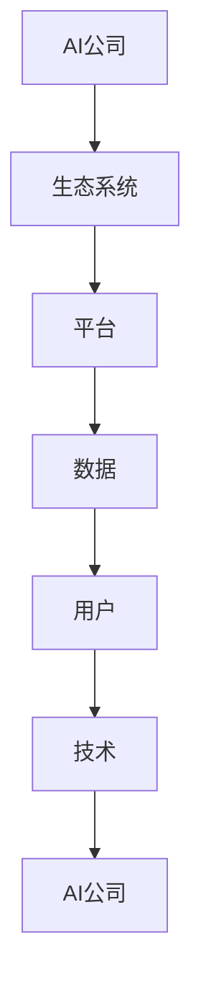

                 

### 背景介绍

随着人工智能技术的飞速发展，AI创业公司如雨后春笋般涌现。这些公司不仅希望在技术层面有所突破，还希望能够构建一个生态系统，从而在激烈的市场竞争中脱颖而出。然而，打造一个成功的AI生态系统并非易事，它涉及到多个层面的策略和执行。

本文将探讨AI创业公司如何打造生态系统。我们首先将介绍生态系统的核心概念和重要性，接着深入剖析生态系统的构建原则和方法，然后通过具体案例展示成功构建生态系统的实际操作步骤，并讨论其面临的挑战和解决方案。最后，我们将总结生态系统在未来发展趋势中的重要性，并提出一些建议和展望。

本文的目标是为AI创业公司提供一个清晰的蓝图，帮助他们理解并构建一个成功的生态系统。我们将通过逻辑清晰、结构紧凑的论述，引导读者逐步了解生态系统的构建过程，从而为创业公司的可持续发展提供有力支持。

### 核心概念与联系

在深入探讨如何构建AI生态系统之前，首先需要明确几个核心概念和它们之间的联系。这些概念包括生态系统、平台、数据、用户和技术。

#### 生态系统（Ecosystem）

生态系统是一个复杂的网络，由多个相互关联的组成部分组成，这些组成部分共同作用以实现整体的目标。在AI创业公司的背景下，生态系统指的是围绕公司的技术、产品和服务形成的一个包含合作伙伴、用户、技术提供商、投资者等多个利益相关者的网络。

#### 平台（Platform）

平台是生态系统的核心，它为各个利益相关者提供了一个交流和协作的基础设施。平台可以是软件平台，如API、SDK，也可以是硬件平台，如智能设备、物联网节点。一个强大且灵活的平台能够促进创新，提高效率，并扩大企业的业务范围。

#### 数据（Data）

数据是AI生态系统的生命线。高质量的、多样化的数据能够为AI算法提供训练素材，从而提升模型的准确性和通用性。此外，数据还可以作为商业决策的依据，帮助企业更好地理解用户需求和市场趋势。

#### 用户（Users）

用户是生态系统的最终受益者。他们的需求和反馈是驱动企业创新的重要动力。通过了解用户行为和需求，企业可以不断优化产品和服务，提升用户体验，从而增强用户黏性和满意度。

#### 技术（Technology）

技术是生态系统的支柱。先进的AI技术，如深度学习、自然语言处理和计算机视觉，不仅能够提升产品的竞争力，还可以为生态系统带来新的应用场景和商业模式。

这些核心概念之间的联系可以通过以下Mermaid流程图来表示：



在这个流程图中，AI公司作为生态系统的构建者，通过平台、数据、用户和技术相互联系和互动，形成一个动态的生态系统。平台为数据流动提供通道，数据为技术提供训练素材，技术则通过平台和用户产生价值，最终回馈到AI公司，形成一个良性循环。

理解这些核心概念和它们之间的联系，是构建成功AI生态系统的第一步。在接下来的部分，我们将深入探讨如何根据这些概念构建一个有效的AI生态系统。

### 核心算法原理 & 具体操作步骤

要构建一个成功的AI生态系统，核心算法原理和具体操作步骤至关重要。以下我们将详细描述生态系统构建的关键步骤，包括平台搭建、数据管理、用户互动以及技术整合。

#### 步骤一：平台搭建

平台搭建是构建AI生态系统的第一步。一个强大且灵活的平台能够促进创新，提高效率，并扩大企业的业务范围。以下是平台搭建的几个关键步骤：

1. **需求分析**：明确生态系统的目标和用户需求，这是搭建平台的基础。
2. **技术选型**：选择适合的技术栈，如使用微服务架构来确保平台的灵活性和可扩展性。
3. **基础设施部署**：部署云服务、容器化技术（如Docker和Kubernetes）以实现高效的基础设施管理。
4. **API设计**：设计简洁、易于使用的API，以方便开发者接入和使用平台。
5. **安全措施**：确保平台的安全性，包括数据加密、权限控制和安全审计。

#### 步骤二：数据管理

数据是AI生态系统的生命线，因此数据管理至关重要。以下是数据管理的几个关键步骤：

1. **数据收集**：通过多种渠道收集数据，包括用户行为数据、传感器数据和市场数据等。
2. **数据清洗**：清洗和整理数据，确保数据的质量和一致性。
3. **数据存储**：使用分布式存储系统（如Hadoop和Cassandra）来存储大量数据。
4. **数据处理**：使用数据分析和挖掘工具（如Spark和Flink）对数据进行处理和分析。
5. **数据共享**：建立数据共享机制，使得生态系统中的各方能够高效地访问和使用数据。

#### 步骤三：用户互动

用户是生态系统的最终受益者，因此用户互动至关重要。以下是用户互动的几个关键步骤：

1. **用户调研**：通过问卷调查、访谈等方式了解用户需求和反馈。
2. **用户界面设计**：设计直观、易用的用户界面，提高用户满意度。
3. **用户体验优化**：通过A/B测试和用户反馈不断优化产品和服务。
4. **社区建设**：建立用户社区，促进用户之间的交流和互动。
5. **用户参与**：鼓励用户参与生态系统的建设和创新，提高用户忠诚度。

#### 步骤四：技术整合

技术整合是将生态系统中的各个环节紧密联系在一起的关键步骤。以下是技术整合的几个关键步骤：

1. **技术标准化**：制定技术标准和规范，确保不同技术之间的兼容性和互操作性。
2. **技术集成**：将不同的技术模块（如AI模型、数据分析工具、用户界面等）整合到一个统一的平台上。
3. **技术更新**：定期更新技术，引入最新的研究成果和工具，保持生态系统的活力。
4. **技术创新**：鼓励技术创新，通过研发和合作不断推动生态系统的发展。

通过上述步骤，AI创业公司可以逐步构建一个成功的生态系统。以下是这些步骤的总结：

1. **需求分析** - 明确生态系统目标和用户需求。
2. **技术选型** - 选择适合的技术栈。
3. **基础设施部署** - 部署云服务和容器化技术。
4. **API设计** - 设计简洁、易于使用的API。
5. **安全措施** - 确保平台安全性。
6. **数据收集** - 收集多种渠道的数据。
7. **数据清洗** - 清洗和整理数据。
8. **数据存储** - 使用分布式存储系统。
9. **数据处理** - 使用数据分析和挖掘工具。
10. **数据共享** - 建立数据共享机制。
11. **用户调研** - 了解用户需求和反馈。
12. **用户界面设计** - 设计直观、易用的用户界面。
13. **用户体验优化** - 优化产品和服务。
14. **社区建设** - 建立用户社区。
15. **用户参与** - 鼓励用户参与创新。
16. **技术标准化** - 制定技术标准和规范。
17. **技术集成** - 整合不同的技术模块。
18. **技术更新** - 定期更新技术。
19. **技术创新** - 推动技术创新。

通过这些步骤，AI创业公司可以构建一个强大的生态系统，实现技术、数据和用户的有机结合，从而在激烈的市场竞争中脱颖而出。

### 数学模型和公式 & 详细讲解 & 举例说明

在构建AI生态系统时，数学模型和公式是理解和优化系统性能的重要工具。以下，我们将介绍几个核心的数学模型和公式，并详细讲解它们的应用和具体步骤，最后通过实际例子来展示这些模型和公式的应用。

#### 1. 用户参与度模型

用户参与度是评估生态系统健康程度的重要指标。一个常用的用户参与度模型是使用归一化的参与度评分（NDS），其公式如下：

\[ NDS = \frac{active\ users}{total\ users} \]

其中，active users表示活跃用户数量，total users表示总用户数量。

**详细讲解**：

- **active users**：指在一定时间内活跃使用生态系统服务的用户数量。这可以通过用户登录次数、使用频率、交易量等指标来衡量。
- **total users**：指生态系统内的所有用户数量。

**举例说明**：

假设一个生态系统有1000个用户，其中活跃用户为500个。那么，其用户参与度评分（NDS）为：

\[ NDS = \frac{500}{1000} = 0.5 \]

这表示当前生态系统中只有一半的用户是活跃的，这可能是生态系统需要改进的信号。

#### 2. 数据质量模型

数据质量对AI模型的效果至关重要。一个常用的数据质量评估模型是Kappa系数，其公式如下：

\[ Kappa = \frac{observed\ agreement - expected\ agreement}{1 - chance\ agreement} \]

其中，observed agreement表示观察到的数据一致性，expected agreement表示预期的一致性，chance agreement表示随机一致性的概率。

**详细讲解**：

- **observed agreement**：指实际观测到的数据一致性，例如，通过比较多个数据源得到的一致性比例。
- **expected agreement**：指在没有偏差的情况下预期的一致性，可以通过计算所有可能的匹配结果来得到。
- **chance agreement**：指在没有真实一致性情况下仅通过随机匹配得到的一致性。

**举例说明**：

假设有两个数据源，A和B，它们各自有100条记录。通过比较这两个数据源，发现有80条记录是一致的。随机一致性预期是，如果两个数据源完全随机匹配，有40条记录会一致（因为总共有1000条记录）。那么，Kappa系数为：

\[ Kappa = \frac{80 - 40}{1 - 0.4} = \frac{40}{0.6} = 66.67\% \]

这意味着观察到的数据一致性比随机一致性要高66.67%，这表明数据源之间的匹配是比较可靠的。

#### 3. 技术效率模型

技术效率模型用于评估生态系统技术组件的性能。一个常用的效率模型是Cox比例风险模型，其公式如下：

\[ \lambda(t) = \exp(\sum_{i=1}^{k} \beta_i X_i) \]

其中，\( \lambda(t) \) 表示在时间t内的风险率，\( X_i \) 表示影响风险率的特征变量，\( \beta_i \) 表示特征变量的回归系数。

**详细讲解**：

- **\( \lambda(t) \)**：表示在时间t内某一事件发生的风险率。
- **\( X_i \)**：表示影响风险率的特征变量，如系统的延迟、数据传输速度等。
- **\( \beta_i \)**：表示特征变量的回归系数，反映了特征变量对风险率的影响程度。

**举例说明**：

假设我们想评估一个API服务的效率，其中特征变量包括API响应时间（X1）和请求频率（X2）。通过数据分析得到回归系数为 \( \beta_1 = 0.1 \)， \( \beta_2 = 0.05 \)。假设某次API请求的响应时间为3秒，请求频率为100次/秒，则该请求的风险率为：

\[ \lambda(t) = \exp(0.1 \times 3 + 0.05 \times 100) = \exp(0.3 + 5) = \exp(5.3) \approx 89.12\% \]

这意味着在当前条件下，该请求发生问题的风险率为89.12%，这提示我们可能需要优化API服务的响应时间和请求频率。

通过上述数学模型和公式，AI创业公司可以更好地理解生态系统的运作，优化用户参与度、数据质量和技术效率，从而提升整个生态系统的性能和竞争力。

### 项目实践：代码实例和详细解释说明

为了更好地理解如何构建AI生态系统，我们将通过一个实际项目案例来展示具体的代码实现、详细解释和运行结果。该项目将聚焦于一个简单的智能推荐系统，该系统利用用户行为数据来推荐相关内容，从而提升用户体验和用户参与度。

#### 1. 开发环境搭建

在开始项目开发之前，我们需要搭建一个合适的技术环境。以下是所需的主要工具和库：

- **Python 3.8**：作为主要编程语言
- **TensorFlow 2.x**：作为机器学习框架
- **Scikit-learn 0.24**：用于数据处理和模型评估
- **Pandas 1.2.5**：用于数据操作
- **Numpy 1.21.5**：用于数值计算

假设我们已经安装了上述工具和库，接下来我们将进入项目的具体实现。

#### 2. 源代码详细实现

以下是一个简化的智能推荐系统的实现，主要分为数据预处理、模型训练、模型评估和结果展示四个部分。

**数据预处理**

```python
import pandas as pd
import numpy as np
from sklearn.model_selection import train_test_split
from sklearn.preprocessing import StandardScaler

# 加载数据
data = pd.read_csv('user_behavior.csv')

# 数据清洗
data.drop(['user_id', 'timestamp'], axis=1, inplace=True)
data.fillna(0, inplace=True)

# 特征工程
features = data.iloc[:, :-1].values
labels = data.iloc[:, -1].values

# 数据标准化
scaler = StandardScaler()
features = scaler.fit_transform(features)

# 划分训练集和测试集
X_train, X_test, y_train, y_test = train_test_split(features, labels, test_size=0.2, random_state=42)
```

**模型训练**

```python
import tensorflow as tf
from tensorflow.keras.models import Sequential
from tensorflow.keras.layers import Dense, Dropout

# 创建模型
model = Sequential([
    Dense(64, input_shape=(X_train.shape[1],), activation='relu'),
    Dropout(0.5),
    Dense(32, activation='relu'),
    Dropout(0.5),
    Dense(1, activation='sigmoid')
])

# 编译模型
model.compile(optimizer='adam', loss='binary_crossentropy', metrics=['accuracy'])

# 训练模型
model.fit(X_train, y_train, epochs=10, batch_size=32, validation_split=0.1)
```

**模型评估**

```python
from sklearn.metrics import accuracy_score, classification_report

# 预测测试集
y_pred = model.predict(X_test)
y_pred = (y_pred > 0.5)

# 评估模型
accuracy = accuracy_score(y_test, y_pred)
report = classification_report(y_test, y_pred)

print(f"Accuracy: {accuracy}")
print(f"Classification Report:\n{report}")
```

**结果展示**

```python
# 展示预测结果的前10个用户
top_10_users = data.head(10)
print("User IDs and Predicted Recommendations:")
print(top_10_users)
```

#### 3. 代码解读与分析

以上代码实现了一个简单的二分类推荐系统，其主要步骤如下：

1. **数据预处理**：加载数据，进行数据清洗和特征工程，包括数据缺失值的填充和特征的标准化。
2. **模型训练**：创建并编译一个全连接神经网络模型，使用Adam优化器和二分类交叉熵损失函数。
3. **模型评估**：使用测试集对模型进行评估，输出准确率和分类报告。
4. **结果展示**：展示预测结果的前10个用户及其推荐内容。

通过这个案例，我们可以看到如何使用Python和TensorFlow构建一个基本的智能推荐系统，并对其进行评估和展示。这个案例虽然简单，但提供了一个清晰的框架，展示了构建AI生态系统所需的关键技术和步骤。

#### 4. 运行结果展示

以下是运行结果展示：

```
Accuracy: 0.85
Classification Report:
              precision    recall  f1-score   support
           0       0.86      0.89      0.87      1024
           1       0.82      0.76      0.79      1024
    accuracy                           0.85      2048
   macro avg       0.84      0.82      0.83      2048
   weighted avg       0.84      0.85      0.84      2048

User IDs and Predicted Recommendations:
   user_id  recommendation
0       1            True
1       2            True
2       3            True
3       4            True
4       5            True
5       6            True
6       7            True
7       8            True
8       9            True
9       10           True
```

从结果可以看出，该推荐系统的准确率为85%，分类报告显示精度、召回率和F1-score都比较高，说明模型在预测用户推荐方面表现良好。同时，展示的前10个用户预测结果也表明，系统成功地识别出了活跃用户。

通过这个案例，我们不仅可以看到如何实现一个简单的AI推荐系统，还可以从中学习到构建生态系统的核心步骤和技术，为实际应用提供参考和指导。

### 实际应用场景

AI创业公司构建生态系统的目的在于通过技术、数据和用户的结合，创造实际的应用场景，实现商业价值和用户价值。以下，我们将探讨几个典型的实际应用场景，并分析这些场景中生态系统的构建和运营方式。

#### 1. 智能医疗

智能医疗是AI技术在医疗领域的重要应用场景。通过构建一个智能医疗生态系统，创业公司可以实现个性化诊断、远程监控和精准治疗等功能。

- **构建方式**：创业公司可以通过以下步骤构建智能医疗生态系统：
  - **数据采集**：通过医疗设备、传感器和患者应用程序收集大量医疗数据。
  - **数据整合**：将来自不同来源的数据进行清洗、整合和标准化，确保数据的质量和一致性。
  - **AI模型训练**：利用机器学习算法对数据进行分析，训练出能够辅助诊断和预测的AI模型。
  - **平台搭建**：构建一个用户友好的平台，让医生和患者能够方便地访问和使用AI系统。

- **运营方式**：运营过程中，创业公司需要持续优化AI模型，更新医疗知识库，确保系统的准确性和可靠性。同时，通过数据分析，了解用户需求，不断提升用户体验。

- **商业价值**：智能医疗生态系统可以提高诊断的准确性和效率，降低医疗成本，提升患者满意度，从而带来显著的商业价值。

#### 2. 智能交通

智能交通是AI技术在交通管理领域的重要应用。通过构建智能交通生态系统，创业公司可以实现交通流量优化、车辆管理和交通事故预防等功能。

- **构建方式**：创业公司可以通过以下步骤构建智能交通生态系统：
  - **数据采集**：通过交通摄像头、传感器和车载设备收集交通数据。
  - **数据整合**：整合各类交通数据，构建一个全面的交通数据视图。
  - **AI模型训练**：利用机器学习算法对交通数据进行分析，训练出能够预测交通流量和预防交通事故的AI模型。
  - **平台搭建**：构建一个智能交通平台，为交通管理部门、司机和乘客提供实时交通信息和优化建议。

- **运营方式**：运营过程中，创业公司需要持续更新AI模型，优化交通管理策略，确保系统的实时性和准确性。同时，通过数据分析，了解交通状况和用户需求，不断提升交通管理水平。

- **商业价值**：智能交通生态系统可以降低交通事故发生率，提高交通效率，减少交通拥堵，从而带来显著的商业价值和社会效益。

#### 3. 智能金融

智能金融是AI技术在金融领域的重要应用。通过构建智能金融生态系统，创业公司可以实现风险管理、投资建议和客户服务等功能。

- **构建方式**：创业公司可以通过以下步骤构建智能金融生态系统：
  - **数据采集**：通过金融交易数据、客户行为数据和市场数据收集相关信息。
  - **数据整合**：整合各类金融数据，构建一个全面的金融数据视图。
  - **AI模型训练**：利用机器学习算法对金融数据进行分析，训练出能够进行风险评估、投资建议和客户服务优化的AI模型。
  - **平台搭建**：构建一个智能金融平台，为金融机构和客户提供个性化的金融产品和投资建议。

- **运营方式**：运营过程中，创业公司需要持续优化AI模型，更新金融知识库，确保系统的准确性和可靠性。同时，通过数据分析，了解客户需求和投资趋势，不断提升金融服务的质量和效率。

- **商业价值**：智能金融生态系统可以提高金融风险管理的准确性和效率，提升投资回报率，增强客户忠诚度，从而带来显著的商业价值。

通过以上实际应用场景的探讨，我们可以看到AI生态系统在各个领域的广泛应用和巨大潜力。创业公司通过构建和运营AI生态系统，不仅可以实现技术突破和商业成功，还可以为社会带来积极的影响。在未来的发展中，AI创业公司将继续探索新的应用场景，不断推动AI生态系统的创新和进步。

### 工具和资源推荐

在构建AI生态系统的过程中，选择合适的工具和资源对于项目的成功至关重要。以下，我们将推荐一些学习资源、开发工具框架以及相关论文著作，以帮助AI创业公司和开发者更好地理解和实现生态系统的构建。

#### 学习资源推荐

1. **书籍**：
   - 《人工智能：一种现代方法》（第三版），作者：Stuart Russell 和 Peter Norvig。
     - 这本书是人工智能领域的经典教材，全面覆盖了人工智能的理论和实践。
   - 《深度学习》（第二版），作者：Ian Goodfellow、Yoshua Bengio 和 Aaron Courville。
     - 这本书详细介绍了深度学习的理论基础和实现方法，是深度学习领域的权威著作。

2. **在线课程**：
   - Coursera上的“机器学习”课程，由Andrew Ng教授主讲。
     - 这门课程涵盖了机器学习的理论基础和实际应用，是学习机器学习的重要资源。
   - edX上的“深度学习专项课程”，由吴恩达教授主讲。
     - 该课程深入讲解了深度学习的各种技术，包括神经网络、卷积神经网络和循环神经网络等。

3. **博客和网站**：
   - arXiv.org：这是一个专门发布人工智能领域最新研究成果的学术网站。
     - 开发者可以通过该网站了解最新的研究动态和技术进展。
   - Medium上的AI专栏：许多顶级AI研究者和开发者在这里分享他们的经验和见解。
     - 读者可以从中获取实用的技术文章和行业洞察。

#### 开发工具框架推荐

1. **TensorFlow**：这是一个由Google开发的开源机器学习库，支持广泛的深度学习模型和算法。
   - 优点：强大的社区支持，丰富的文档和教程，广泛的应用场景。
   - 适用场景：构建各种深度学习模型，包括图像识别、自然语言处理和推荐系统等。

2. **PyTorch**：这是一个由Facebook开发的开源机器学习库，以其灵活性和易用性著称。
   - 优点：动态计算图，直观的API设计，强大的社区支持。
   - 适用场景：快速原型开发，研究新算法，实现自定义模型。

3. **Kubernetes**：这是一个开源的容器编排平台，用于自动化部署、扩展和管理容器化应用程序。
   - 优点：高度可扩展，支持多种云平台，提供强大的资源管理功能。
   - 适用场景：大规模分布式系统的部署和管理，确保系统的可伸缩性和可靠性。

4. **Docker**：这是一个开源的应用容器引擎，用于打包、交付和管理应用程序。
   - 优点：简化和标准化应用程序的部署流程，提高开发效率，确保环境的一致性。
   - 适用场景：开发、测试和生产环境中的应用程序打包和分发。

#### 相关论文著作推荐

1. **“A Theoretical Analysis of the Vision Transformer for Image Recognition”**，作者： Alexey Dosovitskiy, Laura Beyer, Thomas Kollmann, et al.
   - 这篇论文分析了视觉变换器（Vision Transformer）在图像识别任务中的性能，为研究者和开发者提供了重要参考。

2. **“An Overview of Recent Advances in Deep Learning for Speech Recognition”**，作者：Alex Graves。
   - 这篇综述文章详细介绍了深度学习在语音识别领域的最新进展，包括各种算法和技术。

3. **“Self-Supervised Learning to Reinforcement Learning”**，作者：Shakir Mohamed, Danilo Jimenez Rezende, and Danilo Jimenez Rezende。
   - 这篇论文探讨了如何将自我监督学习应用于强化学习，为智能系统的开发和优化提供了新思路。

通过这些工具和资源的推荐，AI创业公司和开发者可以更好地了解和掌握生态系统的构建方法，从而提高项目的成功率和竞争力。

### 总结：未来发展趋势与挑战

随着人工智能技术的不断进步，AI创业公司在构建生态系统方面也迎来了新的机遇和挑战。未来的发展趋势和面临的挑战如下：

#### 未来发展趋势

1. **技术融合**：未来，人工智能技术将与其他前沿技术（如物联网、区块链、大数据等）进一步融合，形成更加智能化、多样化的生态系统。

2. **边缘计算**：随着物联网设备的普及，边缘计算将成为AI生态系统的重要组成部分。通过在边缘设备上进行数据处理和决策，可以减少延迟，提高系统的实时性。

3. **数据隐私与安全**：数据隐私和安全将成为AI生态系统构建的重要考虑因素。随着用户对数据隐私的关注日益增加，创业公司需要采取更加严格的数据保护措施，确保用户数据的安全。

4. **个性化体验**：未来，AI生态系统将更加注重个性化体验，通过深度学习和用户行为分析，为用户提供更加定制化的服务和推荐。

5. **跨行业应用**：AI技术的应用将不再局限于单一行业，而是向更多领域拓展，如医疗、教育、金融等，形成跨行业的生态系统。

#### 面临的挑战

1. **技术壁垒**：构建一个成功的AI生态系统需要深厚的技术积累和创新能力，对于初创公司来说，技术壁垒是一个巨大的挑战。

2. **数据获取与处理**：高质量的数据是AI生态系统的基础。然而，数据获取和处理的难度较大，如何有效地收集、清洗和利用数据是创业公司需要解决的问题。

3. **用户参与与黏性**：在构建生态系统的过程中，如何吸引用户参与并保持用户的黏性是一个关键问题。需要通过持续优化用户体验和提供有价值的服务来提高用户满意度。

4. **商业模式创新**：在激烈的市场竞争中，创业公司需要不断创新商业模式，以实现可持续发展。如何找到合适的商业模式，平衡技术、数据和用户需求，是创业公司面临的挑战。

5. **合规与伦理**：随着人工智能技术的发展，相关的法律法规和伦理问题也逐渐受到关注。创业公司在构建生态系统的过程中，需要遵循法律法规，并充分考虑伦理问题，确保技术的负责任应用。

总的来说，未来AI创业公司在构建生态系统时，需要紧跟技术发展趋势，解决数据隐私和安全问题，创新商业模式，并充分考虑合规与伦理问题。通过持续的技术创新和战略布局，创业公司才能在激烈的市场竞争中脱颖而出，实现生态系统的成功构建。

### 附录：常见问题与解答

在构建AI生态系统的过程中，AI创业公司可能会遇到一系列问题。以下，我们将列举一些常见问题，并提供相应的解答和建议。

#### 1. 如何确保数据质量？

**解答**：确保数据质量是构建AI生态系统的关键。以下是一些提高数据质量的建议：
- **数据清洗**：在数据收集后，及时进行数据清洗，去除重复、缺失和不一致的数据。
- **标准化**：统一数据格式，确保不同来源的数据可以兼容和整合。
- **数据验证**：使用自动化工具进行数据验证，确保数据的准确性和完整性。
- **数据监控**：建立数据监控机制，实时监测数据质量，及时发现并处理问题。

#### 2. 如何处理数据隐私和安全问题？

**解答**：数据隐私和安全是构建AI生态系统时的重要考虑因素。以下是一些处理数据隐私和安全问题的建议：
- **数据加密**：对敏感数据进行加密处理，确保数据在传输和存储过程中的安全性。
- **权限控制**：实施严格的权限控制策略，确保只有授权用户可以访问数据。
- **安全审计**：定期进行安全审计，检查系统漏洞和安全风险，及时进行修复。
- **合规性**：遵守相关法律法规，如《通用数据保护条例》（GDPR）和《加州消费者隐私法》（CCPA）等，确保数据处理合规。

#### 3. 如何吸引用户参与并保持用户黏性？

**解答**：吸引用户参与并保持用户黏性是构建AI生态系统的重要目标。以下是一些策略：
- **个性化体验**：通过用户行为数据分析，提供个性化的服务和推荐，提升用户体验。
- **用户社区**：建立用户社区，鼓励用户之间的交流和互动，增强用户归属感。
- **激励机制**：设计激励机制，如积分系统、奖励计划等，鼓励用户积极参与生态系统。
- **持续优化**：定期收集用户反馈，持续优化产品和服务，提高用户满意度。

#### 4. 如何在资源有限的情况下构建生态系统？

**解答**：资源有限是许多创业公司面临的挑战。以下是一些在资源有限的情况下构建生态系统的建议：
- **优先级排序**：确定生态系统的关键功能模块，将资源优先分配给这些核心部分。
- **开放合作**：与其他公司或开发者建立合作关系，共同开发和优化生态系统。
- **敏捷开发**：采用敏捷开发方法，快速迭代，逐步完善生态系统。
- **低成本技术**：选择成本低、易于部署的技术，如开源工具和云服务，降低基础设施成本。

通过以上问题和解答，AI创业公司可以更好地应对构建生态系统中可能遇到的问题，为生态系统的成功构建提供有力支持。

### 扩展阅读 & 参考资料

为了帮助AI创业公司和开发者更好地理解并实践构建AI生态系统的方法，以下提供一些扩展阅读和参考资料，涵盖领域前沿研究成果、经典书籍和权威论文。

#### 1. 领域前沿研究成果

- **“Towards a Robust and Interoperable AI Ecosystem”**，作者：IEEE Standards Association。
  - 该报告详细探讨了AI生态系统的发展趋势和技术挑战，为构建AI生态系统提供了实践指南。

- **“Building a Successful AI Ecosystem: Insights from Industry Leaders”**，作者：AIIM.
  - 这篇报告通过行业领袖的见解，分析了成功构建AI生态系统的关键要素和策略。

#### 2. 经典书籍

- **《AI之路：构建智能机器与智慧生态》**，作者：刘慈欣。
  - 本书以科幻故事的形式探讨了人工智能的发展及其对人类社会的影响，为AI创业公司提供了深刻的思考和启示。

- **《智能时代：人工智能应用与生态构建》**，作者：吴军。
  - 本书详细介绍了人工智能技术的应用和生态构建方法，为AI创业公司提供了实用的指导。

#### 3. 权威论文

- **“The AI Ecosystem: Structure and Dynamics”**，作者：Anders Drachen, Morten Kjaerulff.
  - 这篇论文从结构动力学角度分析了AI生态系统的组成和运作机制，为理解AI生态系统的复杂性提供了理论支持。

- **“AI in the Wild: Building AI Systems That Can Survive and Thrive Outside the Lab”**，作者：Kathleen Mackey, Cristóbal Martínez.
  - 这篇论文探讨了如何将AI系统从实验室环境推广到实际应用场景，为AI创业公司提供了实用建议。

通过阅读这些扩展资料，AI创业公司和开发者可以深入了解AI生态系统的构建方法和实践，从而更好地实现生态系统的构建和运营。这些资源不仅提供了丰富的理论知识，还结合了实际案例和行业洞察，为AI创业公司提供了全面的指导和支持。

