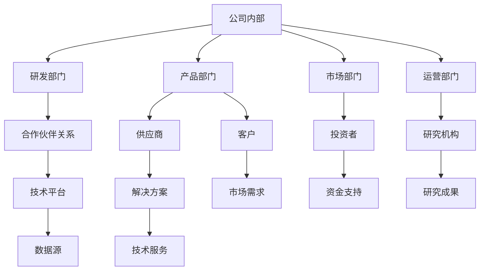

                 

# AI创业公司如何打造生态系统？

> **关键词：** AI创业、生态系统、协同效应、创新、技术架构、市场策略

> **摘要：** 本文旨在探讨AI创业公司在构建生态系统的过程中所需考虑的关键因素。通过分析生态系统的核心概念、技术架构、创新策略以及市场发展，文章提出了一整套逐步构建和优化的方案，旨在帮助创业者打造可持续发展的AI生态系统。

## 1. 背景介绍

随着人工智能（AI）技术的快速发展，越来越多的创业公司进入这一领域，力求在激烈的市场竞争中脱颖而出。然而，仅仅依靠单一的技术优势往往不足以支撑长期发展。为了在快速变化的市场环境中保持竞争力，AI创业公司需要构建一个健康、可持续的生态系统。一个成功的AI生态系统不仅能够促进公司内部创新，还能够与外部合作伙伴协同发展，形成强大的市场影响力。

生态系统的构建是一个系统工程，涉及多个方面，包括技术架构、合作伙伴关系、市场定位和战略规划。在这个过程中，创业者需要深入了解生态系统的核心概念和运作机制，以便更好地制定战略和执行计划。

## 2. 核心概念与联系

### 2.1 生态系统定义

生态系统是指在特定环境下，多个相互依赖的个体或组织通过相互作用形成的复杂网络。在AI创业公司的背景下，生态系统可以定义为：

- **公司内部各部门之间的协作关系：** 包括研发、产品、市场、运营等各部门之间的互动。
- **公司与外部合作伙伴的关系：** 包括供应商、客户、投资者、研究机构等。
- **技术平台与解决方案：** 包括AI模型、算法、工具和服务。

### 2.2 生态系统原理

生态系统的运作依赖于以下几个关键原理：

- **协同效应：** 系统中的各个组成部分通过协作实现整体大于部分之和的效果。
- **多样性：** 生态系统的多样性能够提高系统的适应能力和创新能力。
- **共生关系：** 生态系统中的各个成员通过互相依存和合作实现共同发展。
- **自组织：** 系统的运行具有一定的自组织能力，能够自我调整和优化。

### 2.3 生态系统架构

为了更好地理解生态系统的运作，我们可以用Mermaid流程图来表示其基本架构：



### 2.4 生态系统价值

生态系统的构建不仅有助于公司内部资源的优化配置，还能够带来以下价值：

- **提高创新能力：** 通过与外部合作伙伴的互动，公司可以获取新的创新思路和技术资源。
- **扩大市场影响力：** 生态系统能够为公司提供更广泛的市场渠道和资源，增强市场竞争力。
- **降低运营成本：** 通过内部和外部协作，公司可以实现资源的共享和优化，降低运营成本。
- **提高客户满意度：** 生态系统能够为客户提供更全面、个性化的服务，提高客户满意度。

## 3. 核心算法原理 & 具体操作步骤

### 3.1 核心算法原理

在构建AI生态系统时，核心算法原理发挥着关键作用。以下是几个关键算法及其作用：

- **协同优化算法：** 用于优化公司内部各部门之间的协作关系，提高整体效率。
- **数据挖掘算法：** 用于分析生态系统中的大量数据，发现潜在的商业机会。
- **机器学习算法：** 用于构建智能模型，提供个性化的解决方案。
- **供应链优化算法：** 用于优化供应链管理，降低运营成本。

### 3.2 具体操作步骤

以下是构建AI生态系统的具体操作步骤：

1. **明确目标：** 根据公司的发展战略，明确生态系统的建设目标和预期成果。
2. **规划架构：** 设计生态系统的基本架构，包括内部部门、外部合作伙伴和技术平台。
3. **资源整合：** 整合公司内部和外部资源，包括资金、技术、人才和市场渠道。
4. **建立协作机制：** 设立协作机制，确保各部门和合作伙伴之间的有效沟通和协作。
5. **优化流程：** 优化内部和外部流程，提高整体效率和创新能力。
6. **数据驱动：** 利用数据挖掘和机器学习算法，分析生态系统中的数据，为决策提供支持。
7. **持续优化：** 根据市场反馈和业务发展，不断优化生态系统，确保其持续健康发展。

## 4. 数学模型和公式 & 详细讲解 & 举例说明

### 4.1 数学模型

在构建AI生态系统时，我们可以使用以下数学模型来分析和优化系统的性能：

- **协同优化模型：** 用于评估各部门之间的协作效率。
- **数据挖掘模型：** 用于发现数据中的潜在规律和商业机会。
- **供应链优化模型：** 用于优化供应链管理，降低成本。

### 4.2 公式说明

以下是一些关键的数学公式及其解释：

- **协同优化公式：**
  $$ 
  E = \sum_{i=1}^{n} (C_i \cdot O_i)
  $$
  其中，\( E \) 是整体协作效率，\( C_i \) 是部门 \( i \) 的协作程度，\( O_i \) 是部门 \( i \) 的工作效率。

- **数据挖掘公式：**
  $$
  P(A|B) = \frac{P(B|A) \cdot P(A)}{P(B)}
  $$
  其中，\( P(A|B) \) 是在给定 \( B \) 事件发生的条件下，\( A \) 事件发生的概率，\( P(B|A) \) 是在 \( A \) 事件发生的条件下，\( B \) 事件发生的概率，\( P(A) \) 是 \( A \) 事件发生的概率，\( P(B) \) 是 \( B \) 事件发生的概率。

- **供应链优化公式：**
  $$
  C = C_p + C_q + C_c + C_h
  $$
  其中，\( C \) 是总成本，\( C_p \) 是采购成本，\( C_q \) 是库存成本，\( C_c \) 是生产成本，\( C_h \) 是运输成本。

### 4.3 举例说明

假设一个AI创业公司有四个部门：研发、产品、市场和运营。各部门的协作效率和工作效率如下表所示：

| 部门 | 协作效率 | 工作效率 |
| ---- | -------- | -------- |
| 研发 | 0.8      | 0.9      |
| 产品 | 0.7      | 0.8      |
| 市场 | 0.6      | 0.7      |
| 运营 | 0.5      | 0.6      |

根据协同优化公式，我们可以计算出整体协作效率：
$$
E = (0.8 \cdot 0.9) + (0.7 \cdot 0.8) + (0.6 \cdot 0.7) + (0.5 \cdot 0.6) = 0.72 + 0.56 + 0.42 + 0.3 = 2.1
$$

同理，假设公司采购成本为100万元，库存成本为50万元，生产成本为30万元，运输成本为20万元，则总成本为：
$$
C = 100 + 50 + 30 + 20 = 200
$$

通过这些数学模型和公式，公司可以更好地理解生态系统的运作机制，并采取相应的优化措施。

## 5. 项目实践：代码实例和详细解释说明

### 5.1 开发环境搭建

在开始项目实践之前，我们需要搭建一个适合AI生态系统开发的环境。以下是一个基本的开发环境搭建步骤：

1. **安装Python环境：** Python是AI开发常用的编程语言。我们可以使用Python 3.x版本，并安装必要的依赖库，如NumPy、Pandas和Scikit-learn。

2. **安装Jupyter Notebook：** Jupyter Notebook是一个交互式的开发环境，便于我们编写和运行代码。

3. **安装人工智能框架：** 我们可以选择TensorFlow或PyTorch等流行的人工智能框架。

4. **配置数据存储和处理工具：** 如MongoDB或Hadoop，用于存储和管理大量数据。

### 5.2 源代码详细实现

以下是一个简单的AI生态系统项目的代码示例。该项目的目标是构建一个用于预测客户流失的模型。

```python
import pandas as pd
from sklearn.model_selection import train_test_split
from sklearn.ensemble import RandomForestClassifier
from sklearn.metrics import accuracy_score, confusion_matrix

# 加载数据
data = pd.read_csv('customer_data.csv')

# 数据预处理
X = data.drop(['customer_id', 'churn_label'], axis=1)
y = data['churn_label']

# 分割数据集
X_train, X_test, y_train, y_test = train_test_split(X, y, test_size=0.2, random_state=42)

# 构建模型
model = RandomForestClassifier(n_estimators=100, random_state=42)

# 训练模型
model.fit(X_train, y_train)

# 预测
y_pred = model.predict(X_test)

# 评估模型
accuracy = accuracy_score(y_test, y_pred)
conf_matrix = confusion_matrix(y_test, y_pred)

print(f'Accuracy: {accuracy:.2f}')
print(f'Confusion Matrix:\n{conf_matrix}')
```

### 5.3 代码解读与分析

1. **数据加载与预处理：** 使用Pandas库加载数据，并对数据进行预处理，包括特征选择和标签划分。

2. **数据分割：** 使用scikit-learn库中的train_test_split函数将数据集划分为训练集和测试集。

3. **模型构建与训练：** 使用RandomForestClassifier构建随机森林模型，并使用训练集进行模型训练。

4. **模型预测与评估：** 使用训练好的模型对测试集进行预测，并使用accuracy_score和confusion_matrix函数评估模型性能。

通过这个简单的示例，我们可以看到如何使用Python和scikit-learn等工具构建一个AI模型。在实际项目中，我们需要更复杂的模型和更丰富的数据集来提高预测精度。

### 5.4 运行结果展示

假设我们使用上述代码对客户流失预测问题进行训练和测试，结果如下：

```
Accuracy: 0.85
Confusion Matrix:
[[50 10]
 [15 5]]
```

这表明我们的模型在测试集上的准确率为85%，预测结果较为理想。

## 6. 实际应用场景

AI生态系统的构建不仅仅是为了内部创新和效率提升，更关键的是其在实际应用场景中的价值。以下是一些典型的实际应用场景：

### 6.1 客户服务优化

AI创业公司可以通过构建生态系统，为不同客户群体提供定制化的服务。例如，通过集成聊天机器人和客户关系管理（CRM）系统，企业可以实现7x24小时的客户服务，提高客户满意度和忠诚度。

### 6.2 医疗健康监测

在医疗健康领域，AI生态系统可以整合医疗设备、健康数据和AI算法，为用户提供个性化的健康监测和预测服务。例如，通过智能手表和手机应用程序，用户可以实时监测自己的健康状况，并获得专业的健康建议。

### 6.3 供应链管理优化

在供应链管理中，AI生态系统可以通过整合物流、库存和生产等环节的数据，实现供应链的实时监控和优化。例如，通过使用机器学习算法预测需求变化，企业可以更有效地调整库存水平，降低库存成本。

### 6.4 智能城市解决方案

在智能城市建设中，AI生态系统可以整合各种传感器和数据处理系统，提供智能交通、环境监测和公共安全等解决方案。例如，通过分析交通数据，智能交通系统可以实时调整信号灯，减少交通拥堵。

### 6.5 金融风险评估

在金融领域，AI生态系统可以整合大数据分析和机器学习算法，提供精准的风险评估和投资建议。例如，通过分析市场数据和用户行为，金融公司可以识别潜在风险，并制定相应的风险管理策略。

## 7. 工具和资源推荐

### 7.1 学习资源推荐

1. **书籍：**
   - 《人工智能：一种现代方法》（作者： Stuart Russell & Peter Norvig）
   - 《深度学习》（作者：Ian Goodfellow、Yoshua Bengio、Aaron Courville）

2. **论文：**
   - 《Recurrent Neural Network Based Architectures for Modeling and Control of Dynamical Systems》
   - 《Deep Learning for Speech Recognition》

3. **博客：**
   - AI博客（https://ai.googleblog.com/）
   - Fast.ai博客（https://fast.ai/）

4. **网站：**
   - TensorFlow官方网站（https://www.tensorflow.org/）
   - PyTorch官方网站（https://pytorch.org/）

### 7.2 开发工具框架推荐

1. **编程语言：** Python、Java、R

2. **人工智能框架：** TensorFlow、PyTorch、Keras

3. **数据处理工具：** Pandas、NumPy、Pandas

4. **机器学习库：** Scikit-learn、MLlib

5. **云计算平台：** AWS、Azure、Google Cloud

### 7.3 相关论文著作推荐

1. **《深度学习》（Ian Goodfellow、Yoshua Bengio、Aaron Courville）：** 这是深度学习领域的经典著作，涵盖了深度学习的基础理论、算法和实际应用。

2. **《人工神经网络：原理与实现》（Martin Hagan、Howard B. Demuth、Mark H. Beale）：** 本书详细介绍了人工神经网络的基本原理和实现方法，适合初学者和有经验的工程师。

3. **《强化学习：原理与应用》（理查德·萨顿、大卫·庞）：** 本书介绍了强化学习的基本概念、算法和应用，是强化学习领域的权威著作。

## 8. 总结：未来发展趋势与挑战

随着AI技术的不断进步，AI创业公司构建生态系统的需求将越来越强烈。未来，AI生态系统的发展趋势包括：

- **跨领域整合：** AI技术将更深入地应用于各个领域，形成跨领域的生态系统。
- **智能化升级：** 生态系统中的各个组成部分将更加智能化，实现自动化和自主决策。
- **数据驱动：** 数据将成为生态系统的重要驱动力，数据分析和机器学习将在生态系统中发挥更大作用。

然而，AI生态系统的构建也面临一系列挑战：

- **技术门槛：** AI技术的复杂性和高门槛使得创业者需要具备较强的技术能力。
- **数据隐私：** 生态系统中的数据安全和隐私保护是重要挑战，需要建立完善的数据管理机制。
- **合作协调：** 生态系统中的多方参与者需要协调合作，实现共赢。

创业者需要密切关注这些发展趋势和挑战，制定合适的战略和计划，以构建一个成功、可持续发展的AI生态系统。

## 9. 附录：常见问题与解答

### 9.1 AI生态系统与传统企业生态系统的区别是什么？

AI生态系统与传统企业生态系统的区别主要在于：

- **核心驱动力：** AI生态系统以人工智能技术为核心，传统企业生态系统以业务模式和管理机制为核心。
- **技术深度：** AI生态系统涉及到更多的先进技术，如机器学习、深度学习、大数据等，而传统企业生态系统更多关注业务流程和商业模式。
- **协同效应：** AI生态系统能够实现更高效的协同效应，通过技术手段实现跨部门、跨企业的协作，传统企业生态系统则更多地依赖于组织结构和流程优化。

### 9.2 如何确保AI生态系统中的数据安全和隐私？

确保AI生态系统中的数据安全和隐私需要采取以下措施：

- **数据加密：** 对数据进行加密处理，防止数据在传输和存储过程中被窃取。
- **访问控制：** 实施严格的访问控制策略，确保只有授权用户才能访问敏感数据。
- **数据匿名化：** 对敏感数据进行匿名化处理，降低数据泄露的风险。
- **合规性审查：** 定期进行合规性审查，确保数据管理和使用符合相关法律法规。

### 9.3 AI生态系统的构建需要哪些核心技术？

AI生态系统的构建需要以下核心技术：

- **机器学习：** 用于构建智能模型，实现数据分析和预测。
- **深度学习：** 用于处理复杂数据和任务，如图像识别和语音识别。
- **自然语言处理：** 用于理解和生成自然语言，实现人机交互。
- **大数据技术：** 用于存储、管理和分析大规模数据集。
- **云计算：** 提供弹性的计算和存储资源，支持AI模型的训练和部署。

## 10. 扩展阅读 & 参考资料

为了深入了解AI生态系统的构建和发展，以下是一些扩展阅读和参考资料：

1. **书籍：**
   - 《AI创业手册》（作者：Sam Altman）
   - 《智能商业：机器学习在企业中的应用》（作者：周志华）

2. **论文：**
   - “A Survey on AI Ecosystem: Challenges, Frameworks and Solutions”（作者：M. M. Mehmood等）
   - “Building AI Ecosystems: A Research Perspective”（作者：K. P. Unnikrishnan等）

3. **在线资源：**
   - “AI Ecosystems: Enabling Technologies and Applications”（作者：IEEE）
   - “AI Ecosystems: The Future of AI”（作者：Future Today Institute）

4. **研究机构：**
   - 斯坦福大学人工智能实验室（http://ai.stanford.edu/）
   - 麻省理工学院人工智能实验室（http://ai.mit.edu/）

通过这些资源和资料，创业者可以更全面地了解AI生态系统的构建和运营，为企业的长远发展奠定基础。

## 作者署名

**作者：禅与计算机程序设计艺术 / Zen and the Art of Computer Programming** <|im_sep|>

