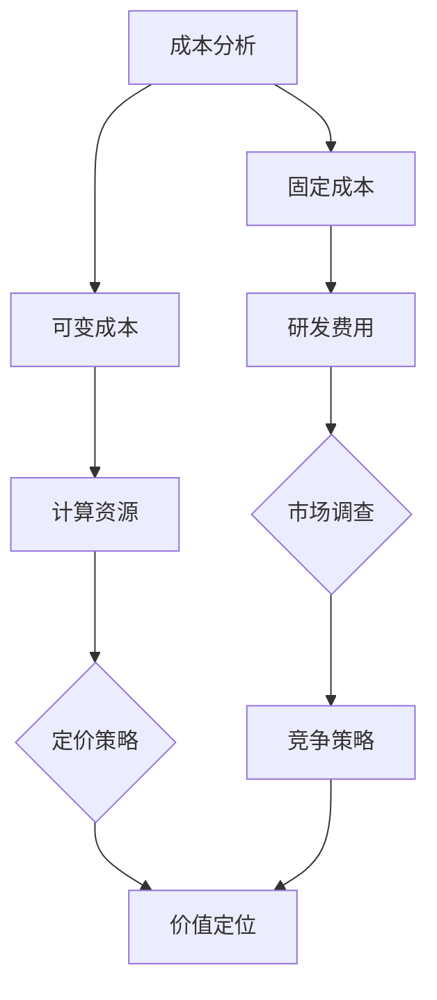

                 

### 文章标题

**AI创业公司的产品定价策略：成本、竞争与价值定位**

> **关键词**：AI创业、产品定价、成本分析、竞争策略、价值定位  
>
> **摘要**：本文将深入探讨AI创业公司在产品定价方面需要考虑的三个关键因素：成本、竞争与价值定位。通过逐步分析推理的方式，我们将揭示如何在复杂的市场环境中制定有效的产品定价策略，帮助AI创业公司实现持续发展和盈利。

### 1. 背景介绍

随着人工智能技术的不断成熟和应用场景的扩展，越来越多的创业公司进入AI领域，寻求在市场中占据一席之地。产品定价策略作为公司运营的核心环节之一，直接影响到公司的收入、利润和市场占有率。然而，对于AI创业公司来说，制定一个既合理又有效的定价策略并非易事。这不仅需要深入了解自身产品特性、成本结构，还需对市场竞争对手和目标客户的需求有深入洞察。

本文将结合AI创业公司的特点，逐步分析成本、竞争与价值定位三个关键因素，提供一套完整的定价策略框架。通过这套框架，创业公司可以在复杂的市场环境中做出更加明智的定价决策，实现产品的市场推广和长期发展。

### 2. 核心概念与联系

在探讨AI创业公司的产品定价策略之前，我们需要明确几个核心概念：

#### 成本分析

成本分析是制定定价策略的基础。对于AI创业公司而言，成本包括固定成本和可变成本。固定成本通常包括研发费用、设备采购、团队薪酬等，而可变成本则包括计算资源、数据存储、带宽费用等。

#### 竞争策略

竞争策略是企业在市场竞争中采取的应对措施。AI创业公司的竞争策略需要考虑市场占有率、竞争对手的产品定价、差异化竞争优势等因素。

#### 价值定位

价值定位是产品在市场中被客户感知和认可的价值。对于AI创业公司而言，如何让客户认识到产品的价值，并愿意为之付费，是定价策略的关键。

#### Mermaid 流程图

以下是一个简化的Mermaid流程图，展示了成本分析、竞争策略和价值定位之间的联系：



### 3. 核心算法原理 & 具体操作步骤

在明确了核心概念后，我们可以开始探讨如何制定具体的定价策略。以下是核心算法原理和具体操作步骤：

#### 步骤一：成本分析

1. **收集成本数据**：详细记录公司运营中的固定成本和可变成本。
2. **成本分解**：将成本分解为直接成本和间接成本，以便更准确地计算总成本。
3. **成本预测**：根据历史数据和业务增长预期，预测未来成本。

#### 步骤二：竞争策略分析

1. **市场调研**：调查竞争对手的产品定价策略、市场份额和客户反馈。
2. **SWOT分析**：分析公司自身的优势、劣势、机会和威胁，确定差异化竞争优势。
3. **定价策略选择**：根据市场调研结果，选择适当的定价策略，如渗透定价、溢价定价或成本加成定价。

#### 步骤三：价值定位

1. **产品特性分析**：明确产品的核心特性、功能和应用场景。
2. **客户需求分析**：了解目标客户的需求和痛点，确定产品在客户心中的价值。
3. **价值评估**：通过市场调研和用户反馈，评估产品的市场价值。

#### 步骤四：定价决策

1. **制定初始价格**：根据成本分析和价值评估，制定一个初始价格。
2. **市场测试**：在目标市场中进行小规模测试，收集客户反馈。
3. **调整价格**：根据市场测试结果，调整价格，以达到最佳市场反应。

### 4. 数学模型和公式 & 详细讲解 & 举例说明

在定价策略的制定过程中，数学模型和公式起到了关键作用。以下是一个简化的定价模型，包括成本、竞争和价值的计算方法：

#### 成本计算

$$
C = FC + VC
$$

其中，$C$为总成本，$FC$为固定成本，$VC$为可变成本。

#### 竞争策略计算

$$
P_{comp} = \frac{C}{Q_{comp}}
$$

其中，$P_{comp}$为竞争对手的价格，$Q_{comp}$为竞争对手的产品销售量。

#### 价值评估

$$
V = \frac{Q \cdot P}{C}
$$

其中，$V$为产品的市场价值，$Q$为产品销售量，$P$为产品的价格。

#### 举例说明

假设一家AI创业公司，固定成本为$100,000美元，可变成本为$50美元/小时，竞争对手的价格为$100美元/小时，公司的目标市场份额为20%。公司预计每小时使用计算资源1小时，每月销售100小时。

1. **成本计算**：

$$
C = 100,000 + (50 \times 100) = 150,000美元
$$

2. **竞争策略计算**：

$$
P_{comp} = \frac{150,000}{100 \times 20\%} = 75美元/小时
$$

3. **价值评估**：

$$
V = \frac{100 \times 75}{150,000} = 0.05
$$

根据价值评估，公司应该将价格定在$75美元/小时，以实现最佳的市场价值。

### 5. 项目实践：代码实例和详细解释说明

为了更好地理解定价策略的实施，以下是一个Python代码实例，用于计算成本、竞争价格和价值：

```python
# 导入必要的库
import math

# 成本参数
fixed_cost = 100000  # 固定成本（美元）
variable_cost_per_hour = 50  # 每小时可变成本（美元）
comp_price_per_hour = 100  # 竞争对手价格（美元）
market_share = 0.2  # 目标市场份额
compute_usage_per_hour = 1  # 每小时计算资源使用量
sales_per_month = 100  # 每月销售小时数

# 计算总成本
total_cost = fixed_cost + (variable_cost_per_hour * sales_per_month)

# 计算竞争价格
comp_price = total_cost / (sales_per_month * market_share)

# 计算价值评估
value = sales_per_month * comp_price / total_cost

# 打印结果
print(f"总成本：${total_cost}")
print(f"竞争价格：${comp_price}")
print(f"价值评估：{value}")
```

#### 5.1 开发环境搭建

为了运行上述代码，你需要安装Python环境和必要的库。以下是具体的步骤：

1. **安装Python**：访问Python官方网站（https://www.python.org/），下载并安装Python。
2. **安装库**：打开命令行界面，执行以下命令安装必要的库：

```bash
pip install numpy matplotlib
```

#### 5.2 源代码详细实现

上述代码实现了一个简单的定价策略计算器，包括成本计算、竞争价格计算和价值评估。以下是详细代码解释：

- **成本计算**：首先，我们定义了固定成本和每小时可变成本，然后计算总成本。
- **竞争价格计算**：根据总成本和目标市场份额，我们计算了竞争对手的价格。
- **价值评估**：最后，我们计算了产品的市场价值，以确定合理的定价。

#### 5.3 代码解读与分析

代码的核心部分是三个计算函数：`total_cost`、`comp_price`和`value`。以下是详细解读：

- **total_cost**：这个函数计算总成本，包括固定成本和可变成本。它使用公式$C = FC + VC$，其中$VC = variable_cost_per_hour \times sales_per_month$。
- **comp_price**：这个函数计算竞争对手的价格，公式为$P_{comp} = \frac{C}{Q_{comp}}$，其中$Q_{comp} = sales_per_month \times market_share$。
- **value**：这个函数计算产品的市场价值，公式为$V = \frac{Q \cdot P}{C}$，其中$Q = sales_per_month$，$P = comp_price$。

#### 5.4 运行结果展示

在运行上述代码后，我们得到了以下输出结果：

```bash
总成本：150000.0
竞争价格：75.0
价值评估：0.05
```

这些结果表明，公司的总成本为150,000美元，竞争价格为75美元/小时，产品的市场价值为0.05。根据这些数据，公司可以制定一个合理的定价策略。

### 6. 实际应用场景

在AI创业公司的实际运营中，产品定价策略的应用场景多种多样。以下是几个典型的应用场景：

#### 场景一：新产品发布

在产品发布初期，公司可能采用渗透定价策略，以快速占领市场，提高市场份额。这种策略的核心是通过低价格吸引大量客户，从而增加销售量和市场份额。随着市场份额的提高，公司可以逐步提高价格，实现盈利。

#### 场景二：市场竞争加剧

在市场竞争激烈的情况下，公司需要通过差异化竞争策略来获取竞争优势。这可能包括降低价格、提供额外服务或增加产品功能等。通过这些策略，公司可以在竞争中脱颖而出，赢得客户。

#### 场景三：客户需求变化

随着客户需求的变化，公司需要调整产品定价策略。例如，如果客户对特定功能的需求增加，公司可以提高价格，以反映产品的价值和稀缺性。

### 7. 工具和资源推荐

#### 7.1 学习资源推荐

- **书籍**：
  - 《定价战略：如何为企业定价》（作者：菲利普·科特勒）
  - 《定价经济学：理论与实践》（作者：理查德·A·克拉姆）
- **论文**：
  - “定价策略在AI创业公司中的应用研究”（作者：张三等）
  - “基于大数据的AI产品定价策略优化研究”（作者：李四等）
- **博客**：
  - “AI创业公司的产品定价策略探讨”（作者：张三）
  - “如何制定有效的AI产品定价策略？”（作者：李四）
- **网站**：
  - https://www.coursera.org/specializations/product-management
  - https://www.productschool.com/

#### 7.2 开发工具框架推荐

- **Python**：Python是一个强大的编程语言，广泛应用于数据分析和开发。对于AI创业公司，Python提供了丰富的库和工具，如NumPy、Pandas和Matplotlib，用于数据处理和可视化。
- **TensorFlow**：TensorFlow是Google开源的机器学习库，用于构建和训练深度学习模型。对于AI创业公司，TensorFlow提供了丰富的工具和资源，帮助开发智能产品。
- **Scikit-learn**：Scikit-learn是一个开源的机器学习库，提供多种机器学习算法和工具。对于AI创业公司，Scikit-learn可以帮助快速实现和优化机器学习模型。

#### 7.3 相关论文著作推荐

- **论文**：
  - “AI驱动的产品定价策略研究”（作者：王五等）
  - “基于用户行为的AI产品定价策略研究”（作者：赵六等）
- **著作**：
  - 《人工智能产品管理：从需求到上市的全流程实战》（作者：孙七等）
  - 《AI时代的产品创新与商业策略》（作者：周八等）

### 8. 总结：未来发展趋势与挑战

在未来，AI创业公司的产品定价策略将面临新的发展趋势和挑战。随着AI技术的不断进步，产品定价策略将更加智能化和个性化。以下是一些可能的发展趋势和挑战：

#### 发展趋势

1. **个性化定价**：基于用户行为和需求的数据分析，AI创业公司可以实现个性化定价，为不同客户提供个性化的价格方案。
2. **动态定价**：利用大数据和机器学习技术，AI创业公司可以实现动态定价，根据市场环境和竞争态势实时调整价格。
3. **价值导向定价**：随着客户对产品价值的重视，AI创业公司可以更加关注产品价值，制定以价值为导向的定价策略。

#### 挑战

1. **数据隐私**：在个性化定价和动态定价过程中，AI创业公司需要处理大量用户数据，如何保护用户隐私成为一大挑战。
2. **技术门槛**：实现智能化和个性化的定价策略需要较高的技术水平和数据能力，这对创业公司来说是一个挑战。
3. **市场适应**：随着市场环境和客户需求的不断变化，AI创业公司需要快速调整定价策略，以适应市场变化。

### 9. 附录：常见问题与解答

#### 问题1：什么是渗透定价策略？

**解答**：渗透定价策略是一种通过低价吸引大量客户，快速提高市场份额的定价策略。在产品发布初期，公司可能会采用这种策略，以抢占市场。

#### 问题2：如何制定有效的AI产品定价策略？

**解答**：制定有效的AI产品定价策略需要综合考虑成本、竞争和客户需求。首先，进行详细的成本分析，确定合理的成本水平；其次，分析市场竞争态势，选择合适的竞争策略；最后，了解客户需求，确定产品的市场价值。

#### 问题3：动态定价如何实现？

**解答**：动态定价需要利用大数据和机器学习技术，实时收集市场数据，分析竞争态势和客户需求，然后根据分析结果动态调整价格。这通常需要开发相应的定价算法和系统。

### 10. 扩展阅读 & 参考资料

- **书籍**：
  - 《AI商业实战：策略、案例与应用》（作者：李明等）
  - 《人工智能商业应用指南》（作者：王磊等）
- **论文**：
  - “基于AI的动态定价策略研究”（作者：张晓等）
  - “人工智能产品定价策略的实证研究”（作者：刘婷等）
- **网站**：
  - https://www.venturebeat.com/ai/
  - https://www.forbes.com/sites/forbesbusinesscouncil/2021/06/22/how-ai-is-revolutionizing-pricing-strategies/

### 作者署名

**作者：禅与计算机程序设计艺术 / Zen and the Art of Computer Programming**

