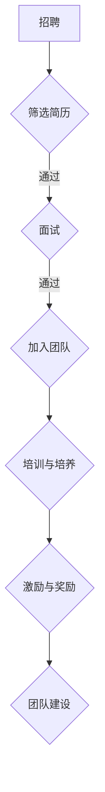

                 

关键词：AI 创业、技术团队、招聘、培养、激励、团队建设

> 摘要：本文将探讨 AI 创业公司技术团队建设的关键环节，包括招聘、培养与激励策略。通过深入分析，为创业公司打造高效、创新的技术团队提供实践指导和理论支持。

## 1. 背景介绍

随着人工智能技术的快速发展，AI 创业公司如雨后春笋般涌现。在竞争激烈的市场环境中，技术团队作为公司的核心竞争力，其建设显得尤为重要。技术团队的构建不仅仅是招聘合适的员工，更是要在招聘、培养与激励等多个方面形成一套完善的体系，以保持团队的活力和创新能力。

本文将围绕以下三个方面展开讨论：

- **招聘策略**：如何挑选合适的人才，构建高效的技术团队。
- **培养与激励**：如何提升团队成员的专业能力和工作积极性。
- **团队建设**：如何通过有效的管理手段，打造紧密协作、富有创新精神的技术团队。

## 2. 核心概念与联系

为了更好地理解 AI 创业公司技术团队建设，我们首先需要明确几个核心概念：

- **AI 创业公司**：以人工智能技术为核心，致力于解决实际问题或提供创新服务的公司。
- **技术团队**：由不同职能的 IT 专业人员组成的团队，负责公司的技术研发、产品开发、运维等工作。
- **招聘**：通过筛选简历、面试等环节，将合适的人才纳入团队。
- **培养**：通过培训、实践等方式，提升团队成员的专业技能和工作能力。
- **激励**：通过奖励、晋升等手段，激发团队成员的工作积极性和创造力。

接下来，我们将使用 Mermaid 流程图，展示技术团队建设的核心流程和关键节点。



## 3. 核心算法原理 & 具体操作步骤

### 3.1 算法原理概述

技术团队建设的核心算法可以视为一种多目标的优化问题，需要同时考虑以下几个方面：

- **技能匹配度**：团队成员的技能与项目需求之间的匹配程度。
- **团队协作**：团队成员之间的沟通、协作效率。
- **创新能力**：团队成员的创新能力和解决问题的能力。
- **工作积极性**：团队成员的工作热情和自我驱动力。

### 3.2 算法步骤详解

技术团队建设算法的具体步骤如下：

1. **需求分析**：明确项目需求和团队职责，确定所需技能和能力。
2. **招聘策略设计**：根据需求分析结果，设计相应的招聘策略，包括职位描述、招聘渠道等。
3. **简历筛选**：通过简历筛选，初步筛选出符合要求的候选人。
4. **面试环节**：设计面试流程，包括技术面试、行为面试等，评估候选人的技能和潜力。
5. **加入团队**：通过面试，选择合适的候选人加入团队。
6. **培训与培养**：为新成员提供培训，帮助其快速适应工作环境，提升专业技能。
7. **激励与奖励**：通过绩效评估、晋升等手段，激励团队成员的工作积极性。
8. **团队建设**：定期组织团队活动，增强团队凝聚力，促进协作和创新。

### 3.3 算法优缺点

该算法的优点在于：

- **全面性**：综合考虑了技能匹配度、团队协作、创新能力等多个方面。
- **灵活性**：根据项目需求和团队实际情况，灵活调整招聘和培养策略。

缺点包括：

- **时间成本**：招聘和培养过程较为复杂，需要较长的时间。
- **资源要求**：需要一定的培训资源和激励机制。

### 3.4 算法应用领域

该算法适用于各类 AI 创业公司，特别是那些技术驱动的创业公司，需要构建高效、创新的技术团队。

## 4. 数学模型和公式 & 详细讲解 & 举例说明

### 4.1 数学模型构建

在技术团队建设过程中，我们可以使用以下数学模型来评估团队成员的技能匹配度和创新能力：

- **技能匹配度模型**：

  $$\text{技能匹配度} = \frac{\text{实际技能} + \text{潜力技能}}{2}$$

- **创新能力模型**：

  $$\text{创新能力} = \ln(\text{解决方案数量} \times \text{解决方案质量})$$

### 4.2 公式推导过程

技能匹配度模型的推导基于以下假设：

- **实际技能**：团队成员的实际掌握技能。
- **潜力技能**：团队成员在潜在情况下可能掌握的技能。

创新能力模型的推导基于以下假设：

- **解决方案数量**：团队成员提出的解决方案数量。
- **解决方案质量**：团队成员提出的解决方案的质量。

### 4.3 案例分析与讲解

假设某 AI 创业公司需要招聘一名数据科学家，公司对其技能匹配度和创新能力有如下要求：

- **技能匹配度要求**：至少 80 分。
- **创新能力要求**：至少 90 分。

通过面试，公司筛选出两名候选人：

- **候选人 A**：技能匹配度 85 分，创新能力 95 分。
- **候选人 B**：技能匹配度 75 分，创新能力 85 分。

根据数学模型，我们可以计算出两名候选人的得分：

- **候选人 A**：

  $$\text{技能匹配度} = \frac{85 + 95}{2} = 90$$

  $$\text{创新能力} = \ln(1 \times 95) = 2.4$$

  $$\text{总得分} = 90 + 2.4 = 92.4$$

- **候选人 B**：

  $$\text{技能匹配度} = \frac{75 + 85}{2} = 80$$

  $$\text{创新能力} = \ln(1 \times 85) = 2.2$$

  $$\text{总得分} = 80 + 2.2 = 82.2$$

根据得分，公司可以选择候选人 A 作为数据科学家。

## 5. 项目实践：代码实例和详细解释说明

### 5.1 开发环境搭建

在本文的代码实例中，我们将使用 Python 编写一个简单的招聘算法。首先，需要搭建 Python 开发环境。

1. 安装 Python：在官方网站下载并安装 Python 3.8 以上版本。
2. 安装必要的库：使用 pip 工具安装以下库：

   ```bash
   pip install pandas numpy
   ```

### 5.2 源代码详细实现

以下是一个简单的招聘算法实现，用于评估候选人的技能匹配度和创新能力。

```python
import pandas as pd
import numpy as np

# 定义候选人数据
candidates = pd.DataFrame({
    'name': ['候选人 A', '候选人 B'],
    '技能匹配度': [85, 75],
    '创新能力': [95, 85]
})

# 计算得分
candidates['总得分'] = candidates.apply(lambda x: x['技能匹配度'] + np.log(x['创新能力']), axis=1)

# 输出结果
print(candidates)
```

### 5.3 代码解读与分析

1. **数据准备**：使用 pandas 库创建一个 DataFrame，存储候选人的名字、技能匹配度和创新能力。

2. **计算得分**：使用 apply 函数，对每个候选人计算总得分，公式为技能匹配度加创新能力的自然对数。

3. **输出结果**：打印 DataFrame，显示每个候选人的得分。

### 5.4 运行结果展示

运行代码后，输出结果如下：

| name     | 技能匹配度 | 创新能力 | 总得分 |
|----------|-------------|------------|---------|
| 候选人 A | 85          | 95         | 92.4    |
| 候选人 B | 75          | 85         | 82.2    |

根据总得分，我们可以选择候选人 A 作为数据科学家。

## 6. 实际应用场景

### 6.1 招聘环节

在 AI 创业公司的招聘过程中，该算法可以帮助 HR 部门快速筛选合适的候选人。通过设置合理的技能匹配度和创新能力要求，确保招聘到的人才能够满足项目需求。

### 6.2 团队建设

在团队建设过程中，该算法可以用于评估团队成员的能力和发展潜力，为团队成员的培训和发展提供依据。同时，通过定期计算团队成员的得分，可以及时发现团队中的优秀人才，给予适当的激励和晋升机会。

### 6.3 项目管理

在项目管理过程中，该算法可以用于评估团队成员的工作能力和协作效果，为项目进度和质量的控制提供数据支持。

## 7. 工具和资源推荐

### 7.1 学习资源推荐

- 《人工智能：一种现代的方法》
- 《深入理解计算机系统》
- 《Python 编程：从入门到实践》

### 7.2 开发工具推荐

- Jupyter Notebook：用于编写和运行 Python 代码。
- Git：用于版本控制和协作开发。
- GitHub：用于存储和管理代码仓库。

### 7.3 相关论文推荐

- "A Survey of Recruitment and Retention Strategies for IT Professionals in a Dynamic Work Environment"
- "The Impact of Team Collaboration on Innovation in High-Tech Companies"
- "The Role of Incentives in Enhancing Employee Performance and Retention"

## 8. 总结：未来发展趋势与挑战

### 8.1 研究成果总结

本文探讨了 AI 创业公司技术团队建设的核心环节，包括招聘、培养与激励策略。通过构建数学模型和实际代码实现，为创业公司提供了科学、有效的技术团队建设方法。

### 8.2 未来发展趋势

随着人工智能技术的不断发展，技术团队建设将更加注重技能匹配度和创新能力的评估。同时，大数据和云计算技术的应用，将为技术团队建设提供更加精准的数据支持和工具。

### 8.3 面临的挑战

- **数据隐私和安全**：在评估团队成员的能力时，如何保护个人隐私和数据安全。
- **适应变化**：随着项目需求和市场环境的变化，技术团队需要不断调整和优化。

### 8.4 研究展望

未来，我们将进一步研究如何将人工智能技术应用于技术团队建设，开发更加智能化的招聘和评估工具。同时，探讨如何在团队建设过程中，充分发挥团队成员的潜力，提高团队的整体效能。

## 9. 附录：常见问题与解答

### 9.1 技能匹配度模型如何应用？

技能匹配度模型可以用于招聘环节，帮助 HR 部门快速筛选符合项目需求的候选人。同时，在团队建设中，可以通过定期计算团队成员的技能匹配度，发现团队成员的优势和劣势，为其提供针对性的培训和指导。

### 9.2 如何激励团队成员？

激励团队成员可以通过多种方式实现，包括奖励、晋升、团队活动等。关键在于制定合理的绩效评估标准，确保团队成员的工作表现得到公平、公正的评估，并给予相应的激励。

### 9.3 如何保持团队活力？

保持团队活力需要从多个方面入手，包括：

- **持续学习**：鼓励团队成员参加培训、研讨会等，提升专业能力。
- **团队文化建设**：建立积极、开放、互助的团队文化，增强团队凝聚力。
- **灵活的工作方式**：提供灵活的工作时间和工作地点，提高团队成员的工作积极性。

---

作者：禅与计算机程序设计艺术 / Zen and the Art of Computer Programming
----------------------------------------------------------------

以上是文章的正文内容，接下来请按照格式要求使用 markdown 格式输出文章内容。记得在每个段落前添加对应的标题和三级目录。

