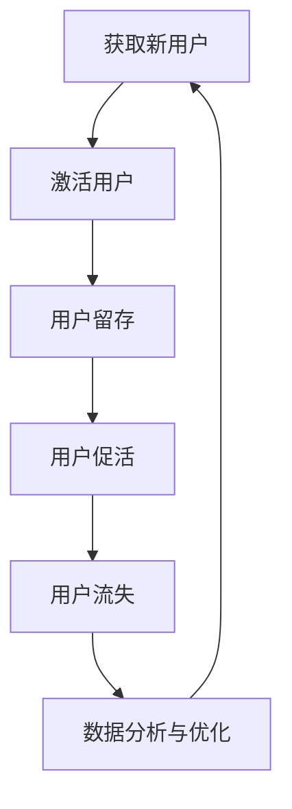

                 

### 文章标题：AI创业公司的用户增长策略：拉新、留存与促活

#### 关键词：
- 用户增长
- AI创业公司
- 拉新
- 留存
- 促活

#### 摘要：
本文旨在探讨AI创业公司在竞争激烈的市场中如何制定有效的用户增长策略，实现用户拉新、留存与促活。通过对相关核心概念的深入理解，并结合实际案例，文章将提供一系列具体操作步骤和数学模型，帮助创业者构建成功的用户增长策略。

---

### 1. 背景介绍

在当前数字化时代，AI技术在各个领域的应用正日益广泛，AI创业公司如雨后春笋般涌现。然而，市场环境竞争激烈，如何获取新用户、留住现有用户并激发用户活跃度，成为AI创业公司能否成功的关键因素。用户增长策略不仅关乎公司的短期生存，更是长远发展的基石。

用户增长通常分为三个关键阶段：拉新、留存与促活。拉新，即吸引新用户，是用户增长的起点；留存，指保持用户持续使用产品，是增长的中期目标；促活，则是刺激用户积极参与，提升用户粘性，是增长的最终目的。

本文将围绕这三个阶段，深入分析AI创业公司如何制定和实施有效的用户增长策略。首先，我们将明确核心概念和理论框架，然后逐步探讨每种策略的具体操作步骤和数学模型，并通过实际案例展示其应用效果。

### 2. 核心概念与联系

为了更好地理解用户增长策略，我们需要先明确一些核心概念及其相互关系。

#### 2.1 用户生命周期

用户生命周期是指用户从接触产品到最终停止使用的整个过程。它通常包括以下几个阶段：

1. **获取（Acquisition）**：吸引新用户，例如通过广告、社交媒体等渠道。
2. **激活（Activation）**：促使新用户开始使用产品，例如完成注册、第一次购买等。
3. **留存（Retention）**：保持用户持续使用产品，例如定期使用、复购等。
4. **促活（Engagement）**：激发用户积极参与，例如社区互动、分享等。
5. **流失（Churn）**：用户停止使用产品，可能是由于不满意、竞争对手等原因。

#### 2.2 用户增长模型

用户增长模型是描述用户增长过程和趋势的数学模型。常见的用户增长模型包括线性模型、指数模型和对数模型等。每种模型都有其适用场景和优缺点。

#### 2.3 数据分析工具

数据分析工具是用户增长策略实施的重要手段。常见的工具包括Google Analytics、Tableau、Mixpanel等。这些工具可以帮助创业者收集、分析和可视化用户数据，从而制定更加科学的增长策略。

#### 2.4 Mermaid 流程图

为了更清晰地展示用户增长策略的执行过程，我们使用Mermaid流程图来描述用户从获取到促活的整个生命周期。以下是一个简化的流程图示例：



在上述流程中，每个阶段都有具体的策略和方法。例如，在获取新用户阶段，可以通过广告投放、社交媒体营销等方式；在激活用户阶段，可以通过引导用户完成关键任务、提供试用体验等方式。

### 3. 核心算法原理 & 具体操作步骤

在明确了核心概念和理论框架后，接下来我们将详细介绍用户增长策略的核心算法原理和具体操作步骤。

#### 3.1 拉新策略

拉新策略的核心是吸引新用户。以下是一些常用的拉新方法：

1. **广告投放**：通过在搜索引擎、社交媒体、新闻网站等渠道投放广告，吸引潜在用户。
2. **社交媒体营销**：利用社交媒体平台（如微信、微博、抖音等）进行内容营销，提高品牌曝光度。
3. **合作伙伴关系**：与其他公司或平台建立合作关系，互相推广，扩大用户群体。
4. **推荐机制**：通过用户推荐、邀请码等方式，鼓励现有用户带来新用户。

#### 3.2 留存策略

留存策略的核心是保持用户持续使用产品。以下是一些常用的留存方法：

1. **个性化推荐**：根据用户行为数据，为用户推荐感兴趣的内容或产品，提高用户粘性。
2. **用户反馈**：鼓励用户提供反馈，了解用户需求，持续优化产品。
3. **会员制度**：为用户提供会员服务，如专属优惠、积分兑换等，增加用户留存率。
4. **内容更新**：定期更新产品内容，保持用户的新鲜感和兴趣。

#### 3.3 促活策略

促活策略的核心是激发用户积极参与。以下是一些常用的促活方法：

1. **活动营销**：举办线上线下活动，鼓励用户参与互动。
2. **社区建设**：建立用户社区，鼓励用户分享经验和建议。
3. **积分奖励**：为积极参与的用户提供积分奖励，激励用户互动。
4. **游戏化设计**：通过游戏化元素，增加用户的乐趣和参与度。

### 4. 数学模型和公式 & 详细讲解 & 举例说明

在用户增长策略中，数学模型和公式可以帮助我们更好地理解和预测用户行为。以下是一些常用的数学模型和公式，以及详细的讲解和举例说明。

#### 4.1 拉新模型

拉新模型通常采用指数模型，公式如下：

\[ N(t) = N_0 \times e^{rt} \]

其中，\( N(t) \) 表示 \( t \) 时刻的新用户数量，\( N_0 \) 为初始新用户数量，\( r \) 为增长率。

举例说明：

假设一家AI创业公司最初有1000名新用户，日增长率为10%。则经过10天后，新用户数量为：

\[ N(10) = 1000 \times e^{0.1 \times 10} \approx 2594 \]

#### 4.2 留存模型

留存模型通常采用对数模型，公式如下：

\[ R(t) = \frac{1}{1 + e^{-kt}} \]

其中，\( R(t) \) 表示 \( t \) 时刻的留存率，\( k \) 为留存率参数。

举例说明：

假设一家AI创业公司的日留存率为50%，则经过3天后，留存率为：

\[ R(3) = \frac{1}{1 + e^{-0.5 \times 3}} \approx 0.866 \]

#### 4.3 促活模型

促活模型通常采用线性模型，公式如下：

\[ E(t) = E_0 + rt \]

其中，\( E(t) \) 表示 \( t \) 时刻的用户活跃度，\( E_0 \) 为初始活跃度，\( r \) 为活跃度增长率。

举例说明：

假设一家AI创业公司的用户初始活跃度为1000次，日增长率为20%。则经过10天后，用户活跃度为：

\[ E(10) = 1000 + 0.2 \times 10 = 1200 \]

### 5. 项目实践：代码实例和详细解释说明

为了更好地理解和应用上述算法和模型，我们将在本节中通过一个实际项目案例，详细讲解代码实现过程，并进行解读与分析。

#### 5.1 开发环境搭建

在本案例中，我们将使用Python语言和几个常用的库，如NumPy、Pandas、Matplotlib等。首先，确保安装以下库：

```bash
pip install numpy pandas matplotlib
```

#### 5.2 源代码详细实现

以下是一个简单的Python代码示例，用于模拟用户增长过程，并展示拉新、留存和促活算法的应用。

```python
import numpy as np
import pandas as pd
import matplotlib.pyplot as plt

# 拉新模型
def acquisition_model(N0, r, t):
    return N0 * np.exp(r * t)

# 留存模型
def retention_model(R0, k, t):
    return 1 / (1 + np.exp(-k * t))

# 促活模型
def engagement_model(E0, r, t):
    return E0 + r * t

# 参数设置
N0 = 1000  # 初始新用户数量
r = 0.1  # 日增长率
t = np.arange(0, 30)  # 时间范围（天）

# 模拟结果
N = acquisition_model(N0, r, t)
R = retention_model(0.5, t)  # 假设初始留存率为50%
E = engagement_model(1000, 0.2, t)  # 假设初始活跃度为1000次

# 可视化展示
plt.figure(figsize=(12, 6))

# 新用户增长曲线
plt.plot(t, N, label='New Users')
plt.plot(t, R, label='Retention Rate')
plt.plot(t, E, label='Engagement')

# 添加标签和标题
plt.xlabel('Time (days)')
plt.ylabel('Users')
plt.title('User Growth Simulation')

# 显示图例
plt.legend()

# 显示图形
plt.show()
```

#### 5.3 代码解读与分析

1. **拉新模型**：使用指数函数模拟新用户增长，增长率 \( r \) 反映了用户增长的速度。
2. **留存模型**：使用对数函数模拟用户留存率随时间的变化，留存率 \( R \) 反映了用户持续使用产品的能力。
3. **促活模型**：使用线性函数模拟用户活跃度随时间的变化，活跃度 \( E \) 反映了用户参与产品的程度。

通过可视化展示，我们可以直观地看到用户在拉新、留存和促活三个阶段的变化趋势。这有助于我们分析和优化用户增长策略。

### 6. 实际应用场景

用户增长策略不仅适用于AI创业公司，也可以广泛应用于其他行业和企业。以下是一些实际应用场景：

1. **电子商务**：通过拉新策略吸引新顾客，通过留存策略提高复购率，通过促活策略增加用户互动。
2. **社交媒体**：通过拉新策略吸引新用户加入平台，通过留存策略提高用户活跃度，通过促活策略激发用户参与社区互动。
3. **在线教育**：通过拉新策略扩大学员数量，通过留存策略提高学习转化率，通过促活策略激发学员参与课程讨论。

### 7. 工具和资源推荐

为了更好地实施用户增长策略，以下是几款实用的工具和资源推荐：

1. **学习资源推荐**：
   - 《增长黑客：持续增长的科学方法与策略》（作者：韦恩·巴里·史密斯）
   - 《用户增长：从0到1实现用户量级增长》（作者：李明杰）
2. **开发工具框架推荐**：
   - Mixpanel：用户行为分析工具
   - Segment：数据处理和集成平台
   - Intercom：客户关系管理系统
3. **相关论文著作推荐**：
   - “Growth Hacking: Marketing and Growth Strategies for the 21st Century” by Ryan Holiday
   - “Growth Marketing: The Ultimate Guide to User Acquisition and Conversion” by Dave Gerhardt

### 8. 总结：未来发展趋势与挑战

用户增长策略在未来将继续发挥重要作用。随着AI技术的不断进步，个性化推荐、智能客服、用户行为分析等技术将进一步助力用户增长。然而，也面临以下挑战：

1. **数据隐私与合规**：用户数据的安全和隐私保护将成为重要议题。
2. **算法透明性与公平性**：算法的透明性和公平性将受到更多关注。
3. **用户疲劳与饱和**：如何避免用户疲劳，提高用户满意度，仍需持续探索。

### 9. 附录：常见问题与解答

**Q1：如何评估用户增长策略的有效性？**
A1：可以通过以下指标进行评估：
- 用户获取成本（CAC）：获取一个新用户所需的成本。
- 用户生命周期价值（LTV）：用户在整个生命周期内为公司带来的收益。
- 复购率：用户在一定时间内再次购买产品的比例。
- 用户活跃度：用户在产品上的互动频率和深度。

**Q2：如何提高用户留存率？**
A2：可以通过以下方法提高用户留存率：
- 提供高质量的产品和服务。
- 个性化推荐和定制化体验。
- 提供用户反馈渠道和及时响应。
- 建立用户社区和互动平台。

**Q3：如何激发用户活跃度？**
A3：可以通过以下方法激发用户活跃度：
- 举办线上线下活动，鼓励用户参与。
- 提供积分奖励和游戏化设计。
- 鼓励用户分享经验和建议。
- 定期更新产品和内容，保持用户兴趣。

### 10. 扩展阅读 & 参考资料

为了更深入地了解用户增长策略，以下是几篇推荐的扩展阅读和参考资料：

- “The Growth Hacker Manifesto” by Ryan Holiday
- “User Growth Strategies: How to Get More Customers, Faster” by Neil Patel
- “The Lean Startup” by Eric Ries
- “Data-Driven Growth” by Heitor Roriz Filho and Douglas Karr

通过本文的探讨，我们希望创业者能够更好地理解和应用用户增长策略，从而在竞争激烈的市场中脱颖而出，实现持续增长。最后，感谢您阅读本文，希望对您的创业之路有所帮助。作者：禅与计算机程序设计艺术 / Zen and the Art of Computer Programming。

