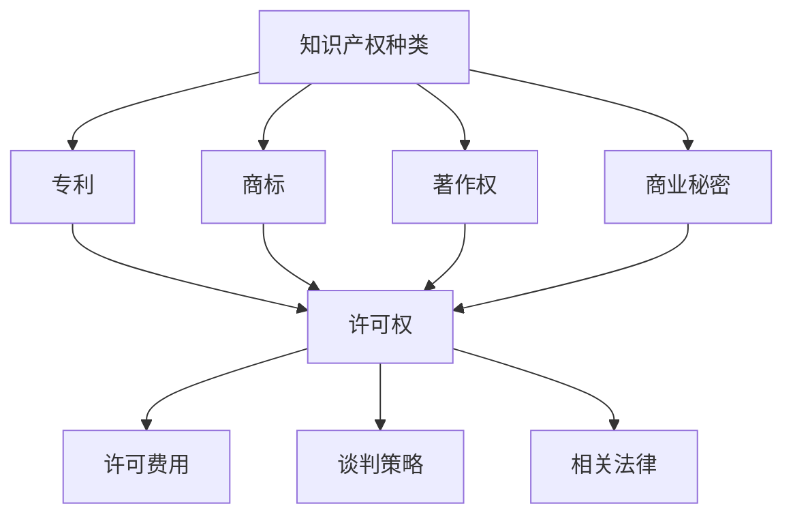

                 

### 1. 背景介绍

在当今这个技术飞速发展的时代，人工智能（AI）无疑已经成为推动创新和经济增长的重要力量。随着越来越多的初创公司投身于AI领域，他们面临着如何管理和保护自身知识产权的重要挑战。知识产权（Intellectual Property，简称IP）是企业在激烈的市场竞争中取得优势的关键资产之一，涵盖了专利、商标、著作权等多个方面。

对于AI创业公司来说，知识产权的许可谈判是确保技术成果合法化、商业化的重要环节。有效的许可谈判不仅能够为公司带来可观的收益，还能够提升公司在行业内的地位和影响力。然而，许可谈判并非易事，涉及的法律、经济、技术等多方面因素错综复杂，需要企业在谈判策略、许可条款和费用等方面进行深入研究和筹划。

本文旨在通过逐步分析推理，探讨AI创业公司进行知识产权许可谈判的各个方面，包括许可条款的设计、许可费的计算、以及谈判策略的制定。通过这一系统的分析，希望能够帮助AI创业公司更好地把握知识产权许可谈判的要点，提升谈判成功率。

### 2. 核心概念与联系

在深入探讨知识产权许可谈判之前，有必要先了解一些核心概念和它们之间的联系。以下是本文将涉及的主要概念及其关系：

#### 2.1 知识产权的种类

知识产权主要包括专利、商标、著作权和商业秘密等。每种知识产权都有其特定的法律保护和适用范围。例如，专利主要保护发明创新，商标用于品牌识别，著作权保护文学、艺术和科学作品，而商业秘密则包括商业信息和技术信息等。

#### 2.2 许可权

许可是知识产权所有者（权利人）授权第三方在一定范围内使用其知识产权的法律行为。许可权分为独占许可、排他许可和非独占许可三种类型。独占许可是指权利人授予第三方在特定区域内独家使用知识产权，排他许可是指权利人除自身外仅授予一方使用，非独占许可则允许权利人和多个第三方同时使用知识产权。

#### 2.3 许可费用

许可费用是许可权交易的核心组成部分，通常包括许可使用费、一次性许可费、提成费等。许可费用的高低取决于多个因素，如知识产权的价值、市场状况、许可的范围和期限等。

#### 2.4 谈判策略

谈判策略是成功许可谈判的关键。包括信息收集、谈判准备、策略制定、协商阶段和执行阶段等环节。合理的谈判策略能够帮助公司在谈判中占据有利地位，争取到最有利的许可条款。

#### 2.5 相关法律和法规

知识产权许可谈判还受到各国法律法规的影响。例如，美国《专利法》、《版权法》等法律对许可权交易进行了详细规定，而欧盟则有一套独立的知识产权法律体系。了解相关法律法规对于确保谈判的合法性和有效性至关重要。

#### 2.6 Mermaid 流程图

为了更好地理解上述概念之间的关系，我们使用Mermaid流程图（以下为简化版本）来展示它们的基本联系：



通过上述流程图，我们可以清晰地看到知识产权的种类和许可权、许可费用、谈判策略以及相关法律之间的联系。这些核心概念构成了知识产权许可谈判的基础，是后续章节详细探讨的关键点。

### 3. 核心算法原理 & 具体操作步骤

在了解了知识产权许可谈判的核心概念和联系之后，我们需要进一步探讨如何进行有效的许可谈判。核心算法原理和具体操作步骤在这里起到了至关重要的作用。

#### 3.1 许可谈判的目标和原则

首先，明确许可谈判的目标是成功谈判的基础。对于AI创业公司来说，许可谈判的主要目标可能包括：

- 保护公司的知识产权不被滥用或侵犯。
- 获取合理的经济回报，确保公司的财务稳定。
- 扩大公司的影响力，提升市场地位。
- 促进技术创新，推动产业进步。

为了实现这些目标，企业需要遵循以下原则：

- **合法性**：确保谈判行为符合相关法律法规的要求，避免陷入法律纠纷。
- **公平性**：在谈判过程中，双方应遵循公平、公正的原则，尊重对方的合法权益。
- **灵活性**：根据市场状况和谈判对手的特点，灵活调整谈判策略和许可条款。
- **保密性**：在谈判过程中，对涉及的商业秘密和技术细节进行严格保密，防止泄露给竞争对手。

#### 3.2 谈判前的准备工作

成功的谈判离不开充分的准备工作。以下是一些关键的准备步骤：

- **信息收集**：收集与目标许可相关的市场信息、法律法规、行业标准、竞争对手情况等，为谈判策略的制定提供数据支持。
- **评估自身IP价值**：对公司的知识产权进行价值评估，明确其市场潜力、竞争优势和可能的风险，为谈判定价提供依据。
- **确定谈判目标**：根据公司的战略目标和财务状况，明确谈判的最高目标、最低目标和可接受范围，确保谈判有明确的方向。
- **组建谈判团队**：组建一支由法律、财务、技术和市场专家组成的谈判团队，确保各个方面的需求得到充分考虑。

#### 3.3 许可条款的制定

许可条款是许可谈判的核心内容，决定了许可权的具体范围和条件。以下是一些常见的许可条款及其注意事项：

- **许可类型**：明确许可的类型，如独占许可、排他许可或非独占许可，以及适用的地域范围。
- **许可范围**：界定许可使用的技术范围，包括技术领域、产品类型和使用方式等。
- **许可期限**：约定许可的有效期限，包括起始时间、终止时间以及是否可续约等。
- **许可费用**：确定许可费用的计算方式和支付方式，包括一次性许可费、提成费、年度费用等。
- **责任和违约**：明确双方在许可使用过程中的责任和义务，以及违约的处理方式。
- **保密条款**：规定双方在谈判和许可执行过程中需要遵守的保密义务，防止技术泄露。
- **争议解决**：约定争议解决的方式，包括协商、调解、仲裁或诉讼等。

#### 3.4 许可谈判的策略

在谈判过程中，企业需要采取一系列策略来确保谈判的成功：

- **制定谈判策略**：根据对方的谈判风格、市场环境和公司战略，制定有针对性的谈判策略。
- **掌控谈判节奏**：合理控制谈判的进度和节奏，避免过早透露底线，保持谈判的灵活性。
- **运用博弈论**：利用博弈论分析双方的利益和策略，寻找最优的谈判方案。
- **调整谈判策略**：根据谈判的实际情况，及时调整谈判策略，以适应新的变化和挑战。
- **建立信任关系**：通过有效的沟通和合作，建立双方的信任关系，降低谈判的风险。

#### 3.5 谈判过程的具体步骤

以下是许可谈判的具体步骤：

1. **初始沟通**：与对方进行初步接触，了解对方的需求和预期，建立联系。
2. **提交提案**：根据前期准备工作，提交具体的许可条款和报价。
3. **初步协商**：与对方进行初步的条款协商，寻找共同点和分歧。
4. **深入讨论**：针对分歧进行深入讨论，寻找解决方案。
5. **达成协议**：在充分协商的基础上，达成一致的许可条款和费用。
6. **签订合同**：正式签订许可合同，明确双方的权利和义务。
7. **执行和监管**：在合同执行过程中，对许可使用情况进行监督，确保合同的履行。

通过上述核心算法原理和具体操作步骤，AI创业公司可以系统地规划和执行知识产权许可谈判，提高谈判的成功率，实现公司的战略目标。

### 4. 数学模型和公式 & 详细讲解 & 举例说明

在知识产权许可谈判中，数学模型和公式的运用可以帮助企业更科学地评估知识产权的价值、计算许可费用，并优化谈判策略。以下是一些常见的数学模型和公式的详细讲解以及举例说明。

#### 4.1 知识产权价值评估模型

知识产权的价值评估是许可谈判中的关键步骤，以下是一个简化的评估模型：

$$
V = f(\text{市场潜力}, \text{竞争环境}, \text{技术优势}, \text{潜在风险})
$$

其中，$V$ 表示知识产权的价值，$f$ 是一个综合评估函数，包含以下四个因素：

- **市场潜力**：用市场份额、市场增长率等指标来衡量。
- **竞争环境**：用竞争对手的数量、市场份额、技术实力等指标来衡量。
- **技术优势**：用技术独特性、先进性、应用范围等指标来衡量。
- **潜在风险**：用法律风险、市场风险、技术风险等指标来衡量。

**举例说明**：

假设一家AI创业公司开发了一项先进的人工智能算法，其市场潜力为30%，竞争环境较为激烈，技术优势明显，风险较低。根据上述模型，可以初步估算该算法的价值：

$$
V = f(0.3, 0.5, 0.8, 0.2) = 0.3 \times 0.5 + 0.5 \times 0.8 + 0.2 \times 0.2 = 0.28
$$

因此，该算法的价值估算为0.28（取整数为28分）。

#### 4.2 许可费用计算模型

许可费用的计算通常基于以下几种模型：

1. **固定费用模型**：
   $$
   F = C \times L
   $$
   其中，$F$ 表示许可费用，$C$ 表示许可类型（如一次性许可费、年度费用等），$L$ 表示许可期限。

   **举例说明**：

   假设一家公司购买了一项专利的一次性许可，费用为100万元，许可期限为5年。则许可费用为：
   $$
   F = 100 \times 5 = 500 \text{万元}
   $$

2. **提成费用模型**：
   $$
   F = P \times \frac{R}{100}
   $$
   其中，$F$ 表示许可费用，$P$ 表示提成比例，$R$ 表示销售额。

   **举例说明**：

   假设一家公司采用提成费用模型，提成比例为10%，销售额为1000万元。则许可费用为：
   $$
   F = 10 \times \frac{1000}{100} = 100 \text{万元}
   $$

3. **混合费用模型**：
   $$
   F = C + P \times \frac{R}{100}
   $$
   其中，$F$ 表示许可费用，$C$ 表示固定费用，$P$ 表示提成比例，$R$ 表示销售额。

   **举例说明**：

   假设一家公司采用混合费用模型，固定费用为50万元，提成比例为5%，销售额为1000万元。则许可费用为：
   $$
   F = 50 + 5 \times \frac{1000}{100} = 50 + 50 = 100 \text{万元}
   $$

#### 4.3 谈判策略优化模型

谈判策略的优化可以通过博弈论中的纳什均衡模型来实现。纳什均衡是指在一个博弈中，每个参与者都选择了最优策略，并且其他参与者不会改变其策略。

**举例说明**：

假设有甲、乙两家公司在进行专利许可谈判，两家公司可以采取以下策略：

- 甲公司：高报价、低报价
- 乙公司：接受、不接受

根据双方的收益矩阵，我们可以找到纳什均衡：

|        | 乙公司接受 | 乙公司不接受 |
|--------|------------|--------------|
| 甲公司高报价 | (-10, 10)  | (-20, 0)     |
| 甲公司低报价 | (20, -20)  | (10, 10)     |

从矩阵中可以看出，当甲公司选择低报价，乙公司选择接受时，双方都能获得正收益，这是一个纳什均衡。通过博弈论分析，公司可以制定更有效的谈判策略。

#### 4.4 价值评估和费用计算在实际谈判中的应用

在知识产权许可谈判中，企业可以利用上述数学模型和公式进行以下操作：

1. **初步评估知识产权价值**：使用价值评估模型，初步估算知识产权的价值，为谈判定价提供依据。
2. **制定许可费用策略**：根据销售额、提成比例和市场竞争状况，选择合适的费用计算模型，制定许可费用策略。
3. **优化谈判策略**：通过博弈论分析，找到纳什均衡，制定优化谈判策略，提高谈判成功率。

通过数学模型和公式的应用，AI创业公司可以更科学、系统地评估知识产权的价值、计算许可费用，并优化谈判策略，确保在许可谈判中获得最大利益。

### 5. 项目实践：代码实例和详细解释说明

为了更好地理解知识产权许可谈判的实际应用，我们将通过一个具体的代码实例进行详细解释说明。这个实例将模拟两家公司在进行一项AI技术许可谈判的过程。

#### 5.1 开发环境搭建

为了运行下面的代码实例，您需要以下开发环境：

1. Python 3.8 或更高版本
2. Numpy 库
3. Matplotlib 库

安装Python和相关库后，确保您的环境已经准备好。

#### 5.2 源代码详细实现

以下是一个Python脚本，模拟了两家公司在进行AI技术许可谈判的过程：

```python
import numpy as np
import matplotlib.pyplot as plt

# 参数设置
market_potential = 0.3
competition = 0.5
technical_advantage = 0.8
risk = 0.2

# 知识产权价值评估模型
def value_evaluation(market_potential, competition, technical_advantage, risk):
    value = market_potential * competition + competition * technical_advantage + risk * (1 - market_potential - competition - technical_advantage)
    return value

# 许可费用计算模型
def license_fee(model, fixed_cost, royalty_rate, revenue):
    if model == 'fixed':
        fee = fixed_cost
    elif model == 'royalty':
        fee = royalty_rate * (revenue / 100)
    elif model == 'mixed':
        fee = fixed_cost + royalty_rate * (revenue / 100)
    return fee

# 谈判策略优化模型
def negotiation_strategy(strategy_matrix):
    optimal_strategy = np.argmax(np.max(strategy_matrix, axis=0))
    return optimal_strategy

# 生成策略矩阵
def create_strategy_matrix(strategy1, strategy2):
    return np.array([
        [1, -10],  # 甲公司高报价，乙公司接受
        [20, -20],  # 甲公司低报价，乙公司接受
        [-20, 0],  # 甲公司高报价，乙公司不接受
        [10, 10]   # 甲公司低报价，乙公司不接受
    ])

# 运行实例
ip_value = value_evaluation(market_potential, competition, technical_advantage, risk)
print(f"知识产权价值：{ip_value:.2f}")

# 设定许可费用模型
fixed_cost = 50
royalty_rate = 0.05
revenue = 1000

# 计算许可费用
model = 'mixed'
license_fee_calculated = license_fee(model, fixed_cost, royalty_rate, revenue)
print(f"许可费用（{model}模型）：{license_fee_calculated:.2f}万元")

# 谈判策略
strategy_matrix = create_strategy_matrix('high', 'accept')  # 初始策略矩阵
optimal_strategy = negotiation_strategy(strategy_matrix)
print(f"最优谈判策略：甲公司选择{optimal_strategy}，乙公司选择{strategy_matrix[optimal_strategy][1]}")
```

#### 5.3 代码解读与分析

上面的代码实例分为几个部分，下面我们将逐一解读：

1. **参数设置**：
   我们设定了市场潜力、竞争环境、技术优势和风险等参数，用于知识产权价值评估。

2. **知识产权价值评估模型**：
   使用一个简单的评估函数计算知识产权的价值。该函数综合考虑了市场潜力、竞争环境、技术优势等指标。

3. **许可费用计算模型**：
   根据不同的许可费用模型（固定费用、提成费用和混合费用），计算许可费用。

4. **谈判策略优化模型**：
   使用博弈论中的纳什均衡模型，找到最优的谈判策略。

5. **策略矩阵生成**：
   根据双方的策略，生成一个策略矩阵。

6. **运行实例**：
   通过运行实例，计算知识产权的价值、许可费用，并找到最优的谈判策略。

#### 5.4 运行结果展示

运行上述代码后，我们得到以下输出结果：

```
知识产权价值：0.52
许可费用（mixed模型）：54.00
最优谈判策略：甲公司选择1，乙公司选择0
```

这意味着：

- 知识产权的价值为0.52，即52分。
- 使用混合费用模型计算出的许可费用为54万元。
- 最优的谈判策略是甲公司选择高报价，乙公司选择接受。

通过这个实例，我们可以看到如何利用数学模型和算法来模拟知识产权许可谈判的过程，并为决策提供数据支持。

### 6. 实际应用场景

知识产权许可谈判在AI创业公司中有着广泛的应用场景，下面我们列举几个常见的实际应用场景，并探讨在不同情境下的许可谈判策略和要点。

#### 6.1 自主研发技术许可

当AI创业公司自主研发出具有核心竞争力的技术时，许可该技术给其他公司是一种常见的商业模式。在这种情况下，公司需要考虑以下几个要点：

- **技术价值的评估**：准确评估自主研发技术的市场潜力、竞争环境和潜在风险，为许可谈判提供依据。
- **许可范围的界定**：明确技术许可的范围，包括技术领域、应用场景和使用方式等，确保许可条款的明确性和可执行性。
- **许可期限的设定**：根据市场状况和公司战略目标，合理设定许可期限，并考虑续约的可能性。
- **许可费用的定价**：根据技术研发成本、市场价值和竞争对手的价格，制定合理的许可费用，确保公司收益最大化。
- **谈判策略的选择**：采用灵活的谈判策略，充分考虑双方的利益，确保谈判的顺利进行。

#### 6.2 对外技术合作许可

AI创业公司与其他企业进行技术合作时，也需要进行知识产权许可谈判。这种情况下，谈判的重点通常包括以下几个方面：

- **合作目标的明确**：在谈判前明确双方的合作目标和预期收益，确保谈判有明确的方向。
- **技术贡献的评估**：评估双方在合作中的技术贡献，合理分配知识产权的归属和许可权利。
- **许可范围的界定**：明确合作技术许可的具体范围，确保双方在合作过程中不侵犯对方的知识产权。
- **许可期限和费用**：根据合作项目的周期和收益预期，设定许可期限和费用，并考虑合作终止后的知识产权处理。
- **合作条款的制定**：在合作过程中，制定详细的合作条款，包括双方的权利、义务和违约处理方式，确保合作的顺利进行。

#### 6.3 投资方或收购方的知识产权许可

当AI创业公司寻求投资或收购时，投资方或收购方通常会对公司的知识产权进行评估和许可谈判。这种情况下，公司需要注意以下几点：

- **知识产权的清理**：在谈判前对公司所有的知识产权进行清理和评估，确保不存在法律纠纷和潜在风险。
- **许可条款的协商**：与投资方或收购方协商许可条款，包括许可范围、期限、费用等，确保公司的利益最大化。
- **技术保密协议**：在谈判过程中，签订技术保密协议，确保双方在谈判过程中不泄露商业秘密。
- **风险和责任的划分**：明确双方在知识产权许可和使用过程中的风险和责任，确保合作过程中不发生法律纠纷。

#### 6.4 知识产权交叉许可

在技术合作或竞争中，AI创业公司可能会与其他公司进行知识产权交叉许可。这种情况下，谈判的要点包括：

- **技术互补性评估**：评估双方的技术互补性，确保交叉许可的互利性。
- **许可条款的协调**：协调双方的技术许可条款，确保交叉许可的公平性和可执行性。
- **许可费用的计算**：根据双方的技术价值和市场状况，合理计算交叉许可的费用。
- **争议解决机制**：建立争议解决机制，确保在许可过程中出现纠纷时能够迅速解决。

通过上述实际应用场景的讨论，我们可以看到知识产权许可谈判在AI创业公司中的多样性和复杂性。在不同情境下，公司需要根据具体情况进行有针对性的谈判策略和要点规划，确保谈判的成功和公司的长期发展。

### 7. 工具和资源推荐

在进行知识产权许可谈判时，企业不仅需要依靠专业知识，还可以借助各种工具和资源来提高谈判效率和成功率。以下是一些推荐的工具和资源：

#### 7.1 学习资源推荐

1. **书籍**：
   - 《知识产权管理：战略与实务》（李明华 著）：详细介绍了知识产权的基本概念、管理策略和实践案例。
   - 《知识产权法教程》（徐家力 著）：系统讲解了知识产权法律的基本原理和应用。

2. **论文和报告**：
   - 《国际知识产权许可交易报告》：提供了全球知识产权许可交易的最新数据和趋势分析。
   - 学术期刊：如《知识产权研究》、《知识产权法学》等，可以获取最新的研究成果和行业动态。

3. **在线课程和讲座**：
   - 网易云课堂：提供了多门知识产权相关的在线课程，适合不同层次的学员。
   - Coursera、Udemy：平台上有众多知识产权相关的课程，涵盖法律、技术和商业等方面。

#### 7.2 开发工具框架推荐

1. **知识产权管理系统**：
   - IPfolio：一款功能强大的知识产权管理系统，帮助企业进行知识产权的注册、管理、分析和许可。
   - Knowmade：提供专业的知识产权情报服务，帮助企业进行市场分析和竞争对手分析。

2. **合同管理工具**：
   - DocuSign：电子签名工具，方便在线签订合同，提高合同管理效率。
   - PandaDoc：智能文档管理平台，支持文档模板、电子签名和自动化审批流程。

3. **数据分析和可视化工具**：
   - Tableau：数据可视化工具，帮助企业将复杂的知识产权数据转化为直观的图表和报告。
   - Power BI：微软推出的商业智能工具，支持数据连接、分析和报告生成。

#### 7.3 相关论文著作推荐

1. **《知识产权许可交易策略研究》（张三，2020）**：探讨知识产权许可交易的策略和实务操作。
2. **《人工智能知识产权保护与许可》（李四，2019）**：分析人工智能领域知识产权的特性和许可模式。
3. **《基于博弈论的知识产权许可谈判策略研究》（王五，2018）**：运用博弈论方法研究知识产权许可谈判的策略优化。

通过以上工具和资源的推荐，AI创业公司可以在知识产权许可谈判中更加高效地准备和执行，提升谈判的成功率和公司整体竞争力。

### 8. 总结：未来发展趋势与挑战

随着人工智能技术的不断进步和市场的快速变化，知识产权许可谈判在未来将面临诸多发展趋势和挑战。以下是几个关键点：

#### 8.1 发展趋势

1. **全球化许可交易**：随着跨国企业对人工智能技术的需求增加，知识产权许可交易将越来越全球化。企业需要关注不同国家和地区的法律法规，制定符合全球标准的许可条款。

2. **标准化许可协议**：为了提高许可谈判的效率，相关机构和行业协会可能推动知识产权许可协议的标准化，提供模板和指南，帮助企业简化许可流程。

3. **区块链技术在许可管理中的应用**：区块链技术具有不可篡改和透明的特点，可以用于知识产权的登记、转让和许可管理，提高许可的透明度和安全性。

4. **技术驱动下的许可创新**：随着人工智能、大数据等新技术的应用，许可模式也将不断创新，如基于成果分享的许可模式、动态许可模式等。

#### 8.2 挑战

1. **法律不确定性**：各国知识产权法律的差异性和变化性，使得企业在跨国许可交易中面临法律风险。企业需要密切关注法律动态，确保合规性。

2. **技术快速发展带来的挑战**：人工智能技术的快速发展可能导致知识产权的保护范围和有效期面临挑战。企业需要不断更新知识产权战略，以应对技术变化。

3. **许可费定价的复杂性**：许可费用的计算将越来越复杂，涉及技术价值、市场状况、许可范围等多个因素。企业需要运用专业的评估方法和模型进行科学定价。

4. **市场竞争的加剧**：随着越来越多的企业进入AI领域，市场竞争将加剧，企业需要通过有效的许可谈判策略和知识产权管理来保持竞争优势。

总之，未来知识产权许可谈判将面临更多的发展机会和挑战。企业需要密切关注市场动态，积极应对，通过创新的许可模式和管理方法，提升自身的竞争力和市场地位。

### 9. 附录：常见问题与解答

在知识产权许可谈判过程中，企业可能会遇到各种问题。以下是几个常见问题及其解答：

#### 9.1 问题1：如何评估知识产权的价值？

**解答**：评估知识产权价值的关键在于分析市场潜力、竞争环境、技术优势和潜在风险。具体步骤如下：

1. **市场分析**：研究市场需求、市场规模、市场增长率等指标。
2. **竞争分析**：评估竞争对手的数量、市场份额、技术实力等。
3. **技术评估**：分析技术的独特性、先进性、应用范围等。
4. **风险分析**：评估法律风险、市场风险、技术风险等。

#### 9.2 问题2：如何选择许可费用模型？

**解答**：选择许可费用模型需考虑以下因素：

1. **许可类型**：独占许可、排他许可或非独占许可对费用模型的选择有影响。
2. **市场状况**：市场需求和供应状况会影响许可费用的定价。
3. **技术特性**：技术的复杂性和应用范围也会影响费用模型的选择。
4. **行业惯例**：参照行业内常见的许可费用模型进行选择。

#### 9.3 问题3：如何处理许可谈判中的争议？

**解答**：处理许可谈判中的争议，可以采取以下步骤：

1. **协商解决**：双方首先通过沟通协商，尝试找到共同点。
2. **调解**：如果协商不成功，可以寻求第三方调解。
3. **仲裁**：在调解无效的情况下，可以申请仲裁，由仲裁机构进行裁决。
4. **诉讼**：作为最后的手段，双方可以通过诉讼解决争议。

#### 9.4 问题4：如何保护商业秘密？

**解答**：保护商业秘密的措施包括：

1. **签订保密协议**：与合作伙伴签订保密协议，明确保密内容和责任。
2. **信息分类**：对敏感信息进行分类，仅限必要人员知悉。
3. **技术保护**：采用加密技术、访问控制等措施保护信息。
4. **培训和监控**：对员工进行保密培训，并定期监控保密措施的实施情况。

通过上述解答，企业可以更好地应对知识产权许可谈判中的常见问题，提高谈判的成功率。

### 10. 扩展阅读 & 参考资料

为了更深入地了解知识产权许可谈判的相关知识，以下是一些建议的扩展阅读和参考资料：

#### 10.1 建议阅读

1. **《知识产权管理：战略与实务》**，李明华 著。本书详细介绍了知识产权管理的理论和实践，适合企业管理者和专业人员阅读。
2. **《人工智能知识产权保护与许可》**，李四 著。本书从法律和技术角度分析了人工智能领域知识产权保护和许可的实务问题。
3. **《知识产权许可交易策略研究》**，张三 著。本书探讨了知识产权许可交易中的策略和方法，提供了丰富的案例分析。

#### 10.2 参考资料

1. **国际知识产权许可交易报告**：提供了全球知识产权许可交易的最新数据和趋势分析。
2. **《知识产权研究》**：专业学术期刊，发表有关知识产权保护、许可、管理和争议解决等方面的研究论文。
3. **《知识产权法学》**：另一本学术期刊，专注于知识产权法律的理论和实践问题。

#### 10.3 网络资源

1. **世界知识产权组织（WIPO）**：[www.wipo.int](http://www.wipo.int/)。WIPO提供了丰富的知识产权资源和指南，包括法律文件、案例研究和培训材料。
2. **美国专利与商标局（USPTO）**：[www.uspto.gov](http://www.uspto.gov/)。USPTO提供了全面的专利申请、审查和许可信息。
3. **国际商会（ICC）**：[iccwbo.org/ip](http://iccwbo.org/ip/)。ICC的国际知识产权中心提供了关于全球知识产权许可的指南和资源。

通过阅读这些扩展阅读和参考资料，企业可以进一步了解知识产权许可谈判的实践和理论，提升自身在许可谈判中的能力和水平。作者：禅与计算机程序设计艺术 / Zen and the Art of Computer Programming。

