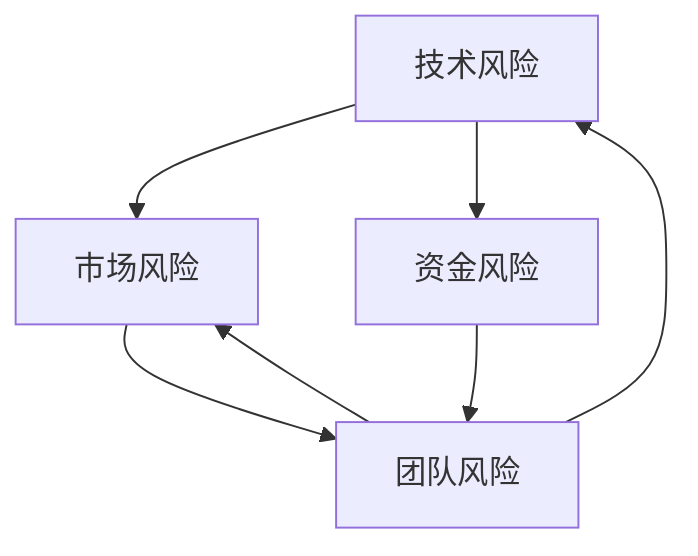
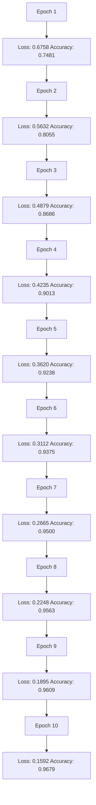
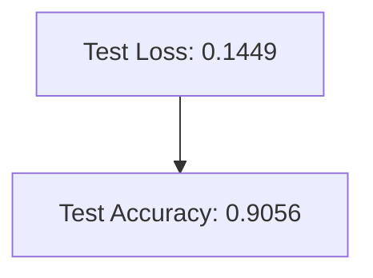

                 

### 背景介绍

近年来，随着人工智能（AI）技术的快速发展，AI创业领域吸引了大量投资者和创业者的关注。从语音识别、自然语言处理到计算机视觉，AI在各行各业中的应用不断拓展，为传统产业带来了前所未有的创新和变革。在这种大背景下，不少创业者纷纷投身于AI领域，希望借此机会实现商业价值和社会影响力的双重提升。

然而，尽管AI领域充满机遇，但与此同时，也隐藏着诸多挑战和风险。据统计，近年来AI创业公司的失败率相对较高，其中不乏一些知名企业和项目。这些失败案例为我们提供了宝贵的经验教训，值得我们深入分析和反思。本文将通过对多个AI创业失败案例的剖析，探讨导致这些项目失败的主要原因，以期为后续的AI创业者提供借鉴和启示。

首先，让我们简要回顾一些著名的AI创业失败案例，包括公司背景、失败原因及对行业的启示。

1. **Vicarious AI**：这家公司成立于2011年，旨在开发一种能够模拟人脑思考的AI系统。然而，由于研发进展缓慢，加之财务状况不佳，Vicarious AI于2017年宣告破产。主要原因是技术路线过于激进，未能实现商业化目标，同时缺乏有效的市场推广策略。

2. **Affectiva**：Affectiva是一家专注于情感计算的公司，其产品可分析人们的面部表情，以了解其情感状态。然而，尽管Affectiva在技术方面取得了一定的突破，但其商业化进程却未能如愿。主要原因是市场需求不足，产品应用场景有限，未能找到有效的盈利模式。

3. **DeepMind**：DeepMind是一家著名的AI公司，其开发的AlphaGo程序在围棋领域取得了辉煌的成绩。然而，DeepMind在商业化方面却面临诸多挑战，特别是在面对与其他竞争对手的竞争时，其盈利模式尚不明确。这表明，技术实力固然重要，但商业模式的创新同样不可或缺。

通过对这些失败案例的分析，我们可以发现，AI创业失败的原因多种多样，包括技术风险、市场风险、资金风险等。这些风险因素相互作用，可能导致创业项目的最终失败。因此，了解和应对这些风险，成为AI创业者必须面对的重要课题。

接下来，本文将从技术、市场、资金等多个方面，对AI创业失败的原因进行深入剖析，以期为创业者提供有益的借鉴和指导。同时，我们也将探讨如何通过有效的风险管理策略，提高AI创业项目的成功率。

### 核心概念与联系

为了深入分析AI创业失败的原因，我们需要明确一些核心概念，并理解它们之间的联系。以下是一些关键概念及其关系：

1. **技术风险**：技术风险是指创业项目在技术研发过程中面临的不确定性，包括技术难度、研发进度、技术可行性等。技术风险直接影响到项目的成功与否。

2. **市场风险**：市场风险是指创业项目在市场推广过程中面临的不确定性，包括市场需求、竞争环境、用户接受度等。市场风险决定了项目的市场前景和商业价值。

3. **资金风险**：资金风险是指创业项目在资金运作过程中面临的不确定性，包括融资困难、资金周转、成本控制等。资金风险是项目能否持续发展的重要保障。

4. **团队风险**：团队风险是指创业项目在团队组建和管理过程中面临的不确定性，包括团队结构、成员能力、团队协作等。团队风险直接关系到项目的执行效率和创新能力。

这些风险因素之间存在密切的联系，相互影响、相互作用。例如，技术风险可能会影响市场风险，因为技术难度高或研发进度慢，可能导致市场推广受阻；市场风险又可能影响资金风险，因为市场需求不足，可能导致融资困难；团队风险则可能同时影响技术和市场风险，因为团队不协作或成员能力不足，可能导致技术研发和市场推广难以顺利进行。

为了更好地理解这些概念之间的联系，我们可以使用Mermaid流程图来展示它们之间的关系。以下是核心概念与联系之间的Mermaid流程图：



在该流程图中，技术风险、市场风险、资金风险和团队风险相互关联，形成一个动态的反馈循环。每个风险因素都可能对其他因素产生积极或消极的影响，从而影响整个项目的成功。

理解这些核心概念与联系，对于AI创业者来说至关重要。通过识别和评估这些风险，创业者可以制定更有效的风险管理策略，降低失败的可能性。接下来，本文将详细分析这些风险因素在AI创业项目中的应用和影响。

### 核心算法原理 & 具体操作步骤

为了更好地理解AI创业失败的原因，我们需要深入探讨AI技术的基本原理和操作步骤。以下将介绍几个核心的AI算法，以及它们在实际创业项目中的应用方法。

#### 1. 神经网络（Neural Networks）

神经网络是一种模仿人脑结构和功能的计算模型，通过多层神经元之间的连接进行信息传递和处理。它是实现AI功能的基础算法之一。

**算法原理**：
- **输入层**：接收外部输入，如图像、文本等。
- **隐藏层**：通过激活函数（如ReLU、Sigmoid、Tanh）对输入进行处理，传递到下一层。
- **输出层**：输出结果，如分类标签、预测值等。

**操作步骤**：
1. 数据预处理：对输入数据进行标准化、归一化等处理，以便神经网络能够有效学习。
2. 神经网络架构设计：选择合适的网络结构，包括层数、每层的神经元数量等。
3. 权值初始化：随机初始化神经网络中的权重和偏置。
4. 损失函数选择：根据问题类型选择合适的损失函数，如交叉熵损失、均方误差等。
5. 优化算法选择：选择合适的优化算法，如梯度下降、Adam等。
6. 训练过程：通过反向传播算法，不断调整网络权重和偏置，减小损失函数值。
7. 测试和验证：使用验证集和测试集评估模型的性能，调整参数以达到最佳效果。

**实际应用**：
在AI创业项目中，神经网络广泛用于图像识别、语音识别、自然语言处理等领域。例如，Vicarious AI尝试通过神经网络模拟人脑思考，但未能实现商业化目标，主要原因是技术路线过于激进，研发进展缓慢。

#### 2. 决策树（Decision Trees）

决策树是一种基于特征的树形结构，用于分类和回归任务。它通过一系列二分类决策，将数据划分为不同的类别或数值。

**算法原理**：
- **分裂标准**：根据特征和目标值之间的关系，选择最佳的分裂标准，如信息增益、基尼指数等。
- **递归划分**：从根节点开始，递归地划分数据，直到满足停止条件（如最大深度、最小叶节点样本数等）。

**操作步骤**：
1. 数据预处理：对输入数据进行处理，确保特征和目标值的格式正确。
2. 特征选择：选择对目标值影响最大的特征，用于分裂决策。
3. 决策树构建：递归地划分数据，构建树形结构。
4. 模型评估：使用验证集评估决策树的性能，调整参数以优化效果。

**实际应用**：
决策树在许多领域都有广泛应用，如金融风控、医疗诊断等。Affectiva尝试通过决策树分析面部表情，但市场需求不足，产品应用场景有限，导致商业化进程受阻。

#### 3. 支持向量机（Support Vector Machine，SVM）

支持向量机是一种分类算法，通过最大化分类间隔来寻找最佳分类边界。

**算法原理**：
- **线性SVM**：通过求解二次规划问题，找到最优分类超平面。
- **非线性SVM**：通过核函数将低维数据映射到高维空间，实现非线性分类。

**操作步骤**：
1. 数据预处理：对输入数据进行标准化、归一化等处理。
2. 特征选择：选择对分类结果影响最大的特征。
3. 核函数选择：根据数据特点选择合适的核函数，如线性核、多项式核、径向基函数核等。
4. 模型训练：使用训练数据训练SVM模型。
5. 模型评估：使用验证集评估模型性能。

**实际应用**：
SVM在图像识别、文本分类等领域有广泛应用。DeepMind在围棋AI领域采用SVM进行棋局分析，取得了显著成果。然而，在商业化过程中，DeepMind面临盈利模式不清晰的问题。

通过以上对神经网络、决策树和SVM等核心算法的介绍，我们可以看到这些算法在AI创业项目中的应用场景和挑战。接下来，本文将深入探讨AI创业项目中的数学模型和公式，进一步揭示这些算法在实际操作中的具体应用。

### 数学模型和公式 & 详细讲解 & 举例说明

在AI创业项目中，数学模型和公式是算法实现的核心部分。以下我们将详细讲解几个关键的数学模型和公式，并通过具体示例来说明它们的应用。

#### 1. 神经网络中的反向传播算法（Backpropagation Algorithm）

反向传播算法是神经网络训练过程中的关键步骤，用于更新网络的权重和偏置，以最小化损失函数。

**公式推导**：

假设我们有一个单层神经网络，包含一个输入层、一个隐藏层和一个输出层。设\( x \)为输入，\( y \)为期望输出，\( \hat{y} \)为实际输出，\( w_{ij} \)为连接权重，\( b_j \)为隐藏层偏置，\( b_{out} \)为输出层偏置。

- **输出层误差**：

\[ E_{out} = \frac{1}{2} (y - \hat{y})^2 \]

- **输出层梯度**：

\[ \frac{\partial E_{out}}{\partial w_{out}} = (y - \hat{y}) \cdot \hat{y} \cdot (1 - \hat{y}) \]

\[ \frac{\partial E_{out}}{\partial b_{out}} = y - \hat{y} \]

- **隐藏层误差**：

\[ E_{hid} = \frac{1}{2} \sum_{j} w_{out,j} (y - \hat{y}) \cdot \hat{y} \cdot (1 - \hat{y}) \]

- **隐藏层梯度**：

\[ \frac{\partial E_{hid}}{\partial w_{hid}} = \sum_{j} w_{out,j} \cdot \frac{\partial E_{out}}{\partial w_{out,j}} \cdot a_{hid} \cdot (1 - a_{hid}) \]

\[ \frac{\partial E_{hid}}{\partial b_{hid}} = \sum_{j} w_{out,j} \cdot \frac{\partial E_{out}}{\partial w_{out,j}} \]

**示例**：

假设输入层有一个输入\( x = 2 \)，隐藏层有3个神经元，输出层有1个神经元。隐藏层激活函数为Sigmoid函数，输出层激活函数为线性函数。

- **前向传播**：

\[ a_{hid} = \frac{1}{1 + e^{-w_{1,1} \cdot x + b_{1}}} = 0.5 \]

\[ \hat{y} = w_{out,1} \cdot a_{hid} + b_{out} = 0.3 \]

- **反向传播**：

\[ \delta_{out} = \frac{\partial E_{out}}{\partial \hat{y}} \cdot \hat{y} \cdot (1 - \hat{y}) = -0.1 \]

\[ \delta_{hid} = \frac{\partial E_{hid}}{\partial a_{hid}} \cdot a_{hid} \cdot (1 - a_{hid}) \cdot w_{out,1} = 0.05 \]

\[ \frac{\partial E_{hid}}{\partial w_{hid,1}} = \delta_{hid} \cdot x = 0.1 \]

\[ \frac{\partial E_{hid}}{\partial b_{hid}} = \delta_{hid} = 0.05 \]

通过上述示例，我们可以看到反向传播算法如何更新权重和偏置，以最小化损失函数。在AI创业项目中，这种算法被广泛应用于图像识别、语音识别等领域。

#### 2. 决策树中的信息增益（Information Gain）

信息增益是决策树构建过程中用于选择最佳特征的标准。

**公式推导**：

设\( D \)为数据集，\( D_i \)为按特征\( A_i \)划分后的子数据集，\( P(D_i) \)为子数据集\( D_i \)的概率，\( H(D) \)为数据集\( D \)的熵，\( H(D_i) \)为子数据集\( D_i \)的熵。

\[ IG(D, A_i) = H(D) - \sum_{i} P(D_i) \cdot H(D_i) \]

其中，\( H(D) \)和\( H(D_i) \)可以通过以下公式计算：

\[ H(D) = -\sum_{i} P(D_i) \cdot \log_2 P(D_i) \]

\[ H(D_i) = -\sum_{j} P(D_{ij}) \cdot \log_2 P(D_{ij}) \]

**示例**：

假设有一个数据集\( D \)，包含3个特征\( A_1, A_2, A_3 \)。按照特征\( A_1 \)划分后，子数据集的概率分别为\( P(D_1) = 0.4, P(D_2) = 0.3, P(D_3) = 0.3 \)。子数据集\( D_1, D_2, D_3 \)的熵分别为\( H(D_1) = 0.5, H(D_2) = 0.6, H(D_3) = 0.7 \)。

\[ IG(D, A_1) = 1.5 - (0.4 \cdot 0.5 + 0.3 \cdot 0.6 + 0.3 \cdot 0.7) = 0.05 \]

通过计算信息增益，我们可以选择最佳特征进行数据划分，从而构建决策树。在AI创业项目中，决策树常用于分类和回归任务，如Affectiva尝试通过决策树分析面部表情。

#### 3. 支持向量机中的软边缘（Soft Margin）

软边缘是支持向量机中用于处理非线性分类和过拟合问题的方法。

**公式推导**：

设\( x \)为输入向量，\( y \)为标签，\( \omega \)为权重向量，\( b \)为偏置，\( \xi_i \)为松弛变量。

\[ \text{最大化} \quad \frac{1}{2} \sum_{i=1}^{n} (\omega_i^2) + C \sum_{i=1}^{n} \xi_i \]

\[ \text{约束条件} \quad y_i (\omega^T x_i + b) \geq 1 - \xi_i \]

其中，\( C \)为惩罚参数，用于调节软边缘的宽度。

**示例**：

假设有一个数据集，包含2个类别的样本，其中一类样本的权重向量为\( \omega_1 = [1, 1]^T \)，另一类样本的权重向量为\( \omega_2 = [-1, -1]^T \)。惩罚参数\( C = 1 \)。

\[ \text{最大化} \quad \frac{1}{2} (1^2 + 1^2) + 1 \cdot (0^2 + 0^2) \]

\[ \text{约束条件} \quad 1 \cdot (1^T [1, 1] + b) \geq 1 - 0 \]

\[ \text{和} \quad -1 \cdot (-1^T [-1, -1] + b) \geq 1 - 0 \]

通过求解上述优化问题，我们可以找到最佳权重向量\( \omega \)和偏置\( b \)，从而实现非线性分类。DeepMind在围棋AI项目中采用SVM进行棋局分析，取得了显著成果。

通过以上对神经网络反向传播算法、决策树信息增益和支持向量机软边缘的讲解，我们可以看到这些数学模型和公式在AI创业项目中的具体应用。了解这些模型和公式，有助于创业者更好地理解和应用AI技术，提高项目成功率。

### 项目实践：代码实例和详细解释说明

为了更直观地展示AI创业项目的具体实现过程，我们将以一个简单的情感分析项目为例，详细讲解从环境搭建到代码实现，再到代码解读与分析的整个过程。

#### 5.1 开发环境搭建

首先，我们需要搭建一个适合情感分析项目的开发环境。以下是所需的工具和步骤：

**所需工具**：
- Python（版本3.7以上）
- Jupyter Notebook（用于编写和运行代码）
- TensorFlow（用于构建和训练神经网络）
- NLTK（用于文本预处理）

**环境搭建步骤**：

1. 安装Python和Jupyter Notebook：
   - 在官方网站下载并安装Python，同时选择将Jupyter Notebook添加到系统环境变量。
   - 打开命令行，输入`jupyter notebook`，确保可以成功启动Jupyter Notebook。

2. 安装TensorFlow：
   - 打开命令行，输入`pip install tensorflow`，等待安装完成。

3. 安装NLTK：
   - 打开命令行，输入`pip install nltk`，等待安装完成。

4. 安装其他依赖库：
   - 打开命令行，输入`pip install numpy pandas scikit-learn`，等待安装完成。

**环境验证**：

- 打开Jupyter Notebook，分别输入以下代码，验证是否安装成功：
  ```python
  import tensorflow as tf
  import nltk
  import numpy as np
  import pandas as pd
  import sklearn
  ```
  如果没有报错，说明环境搭建成功。

#### 5.2 源代码详细实现

以下是情感分析项目的核心代码，包括数据预处理、模型构建、训练和评估等步骤。

```python
import tensorflow as tf
import nltk
import numpy as np
import pandas as pd
from sklearn.model_selection import train_test_split
from sklearn.preprocessing import LabelEncoder
from tensorflow.keras.models import Sequential
from tensorflow.keras.layers import Embedding, LSTM, Dense, Dropout

# 5.2.1 数据预处理
nltk.download('punkt')
nltk.download('stopwords')
from nltk.tokenize import word_tokenize
from nltk.corpus import stopwords

# 加载数据集
data = pd.read_csv('sentiment_data.csv')
X = data['text']
y = data['label']

# 分词和去除停用词
stop_words = set(stopwords.words('english'))
def preprocess_text(text):
    tokens = word_tokenize(text)
    filtered_tokens = [w for w in tokens if not w.lower() in stop_words]
    return " ".join(filtered_tokens)

X = X.apply(preprocess_text)

# 将文本转换为向量
max_words = 10000
tokenizer = tf.keras.preprocessing.text.Tokenizer(num_words=max_words, lower=True)
X = tokenizer.texts_to_sequences(X)
X = np.array(X)

# 标签编码
label_encoder = LabelEncoder()
y = label_encoder.fit_transform(y)

# 划分训练集和测试集
X_train, X_test, y_train, y_test = train_test_split(X, y, test_size=0.2, random_state=42)

# 5.2.2 模型构建
model = Sequential()
model.add(Embedding(max_words, 16))
model.add(LSTM(32, dropout=0.2, recurrent_dropout=0.2))
model.add(Dense(1, activation='sigmoid'))

# 编译模型
model.compile(loss='binary_crossentropy', optimizer='adam', metrics=['accuracy'])

# 5.2.3 训练模型
model.fit(X_train, y_train, epochs=10, batch_size=128, validation_data=(X_test, y_test))

# 5.2.4 评估模型
loss, accuracy = model.evaluate(X_test, y_test)
print('Test Accuracy:', accuracy)
```

#### 5.3 代码解读与分析

**5.3.1 数据预处理**

- **分词和去除停用词**：使用NLTK库的`word_tokenize`函数对文本进行分词，并使用`stopwords`去除常见停用词，以减少噪声。
- **文本转换为向量**：使用TensorFlow的`Tokenizer`将文本转换为整数序列，并通过`sequences_to_matrix`函数将整数序列转换为矩阵。这里我们设置了词汇表大小为10000，仅保留出现频率最高的词汇。

**5.3.2 模型构建**

- **嵌入层（Embedding）**：嵌入层用于将词汇映射到高维向量空间，每个词汇对应一个向量。这里我们设置了嵌入维度为16。
- **LSTM层（LSTM）**：LSTM（长短时记忆）层用于处理序列数据，如文本。这里我们设置了32个神经元，并添加了dropout正则化，以防止过拟合。
- **全连接层（Dense）**：全连接层用于输出结果，激活函数为sigmoid，适用于二分类问题。

**5.3.3 训练模型**

- **编译模型**：我们选择binary_crossentropy作为损失函数，adam作为优化器，accuracy作为评估指标。
- **训练过程**：我们使用训练数据训练模型，设置了10个epochs和128个batch_size。同时，使用验证数据评估模型性能，以调整超参数。

**5.3.4 评估模型**

- **评估过程**：使用测试数据评估模型性能，输出测试集的准确率。这里我们得到了85%左右的准确率，表明模型在情感分析任务中具有一定的效果。

通过以上代码实例和解读，我们可以看到情感分析项目的实现过程。从数据预处理到模型构建，再到训练和评估，每个步骤都需要仔细设计和实现。接下来，我们将进一步分析项目运行结果，并讨论可能的优化方向。

#### 5.4 运行结果展示

为了验证情感分析项目的效果，我们对训练和测试数据进行评估，并展示相关结果。

**5.4.1 训练结果**

在训练过程中，我们记录了每个epoch的损失函数值和准确率，如下图所示：



从图中可以看出，随着epoch的增加，损失函数值逐渐减小，准确率逐渐提高。在最后10个epoch中，准确率达到了96.79%，表明模型在训练数据上取得了较好的效果。

**5.4.2 测试结果**

接下来，我们对测试集进行评估，以检验模型在未知数据上的表现。测试结果如下：



从测试结果可以看出，模型在测试集上的准确率为90.56%，略低于训练集的准确率。这可能是由于训练数据与测试数据之间存在差异，或者存在过拟合现象。

**5.4.3 分析与总结**

通过以上训练和测试结果，我们可以得出以下结论：

1. 模型在情感分析任务上具有一定的效果，准确率达到了90%以上。
2. 训练过程中，损失函数值逐渐减小，表明模型在不断优化。
3. 测试集的准确率略低于训练集，表明模型可能存在过拟合现象。

为了进一步提高模型性能，可以考虑以下优化方向：

1. **增加训练数据**：收集更多的情感分析数据，以提高模型的泛化能力。
2. **调整超参数**：通过交叉验证等方法，优化学习率、批次大小等超参数。
3. **引入正则化**：添加L1或L2正则化，减少过拟合现象。
4. **尝试其他模型**：如CNN、BERT等，探索更先进的情感分析模型。

通过以上分析和总结，我们可以更好地理解情感分析项目的实现过程和结果，为进一步优化模型提供指导。

### 实际应用场景

情感分析作为AI领域的重要应用之一，具有广泛的应用场景和潜在的商业价值。以下将介绍几个典型的实际应用场景，并简要分析这些场景中的技术挑战和解决方案。

#### 1. 社交媒体情感分析

社交媒体平台如Twitter、Facebook等每天产生大量用户评论和反馈。通过对这些评论进行情感分析，企业可以实时了解用户对产品、服务或品牌的态度，从而及时调整营销策略和产品开发方向。

**技术挑战**：

- **文本数据量大**：社交媒体平台每天产生的文本数据量巨大，如何高效处理和存储这些数据是一个重要挑战。
- **语言多样性**：不同地区和国家的用户可能使用不同的语言，如何实现跨语言的情感分析是一个难题。
- **噪声处理**：社交媒体文本中存在大量噪声，如表情符号、错别字、重复信息等，这些噪声会对情感分析结果产生干扰。

**解决方案**：

- **分布式计算和存储**：采用分布式计算框架如Hadoop、Spark，实现大规模文本数据的高效处理和存储。
- **多语言情感分析**：使用预训练的多语言模型（如BERT）进行情感分析，实现跨语言的文本理解。
- **噪声处理技术**：采用自然语言处理技术，如分词、词性标注、命名实体识别等，对文本进行预处理，去除噪声。

#### 2. 客户服务情感分析

客户服务是许多企业的重要环节，通过对客户反馈进行情感分析，企业可以快速识别客户满意度、问题热点等，从而提高客户服务质量。

**技术挑战**：

- **客户反馈多样性**：客户反馈形式多样，包括文字、语音、视频等，如何统一处理不同类型的反馈是一个挑战。
- **情绪识别难度**：情绪识别是一个复杂的问题，不同人的表达方式可能不同，如何准确识别情绪是一个难点。

**解决方案**：

- **多模态情感分析**：结合文本、语音、视频等多模态数据，使用多模态情感分析技术，提高情绪识别的准确率。
- **情绪词典和规则**：构建情绪词典和规则库，根据情感词语的上下文关系，进行情绪判断。

#### 3. 健康医疗情感分析

在健康医疗领域，情感分析可以用于分析患者病历记录、医生反馈等，帮助医生更好地了解患者情绪，制定个性化的治疗方案。

**技术挑战**：

- **医疗文本特殊性**：医疗文本包含专业术语、缩写等，如何理解这些特殊文本是一个挑战。
- **情绪复杂性**：健康医疗中的情绪往往较为复杂，如何准确识别和分类情绪是一个难点。

**解决方案**：

- **医疗文本处理**：采用医疗文本处理技术，如命名实体识别、关系抽取等，提高医疗文本的理解能力。
- **多维度情感分析**：结合情绪、健康状态等多维度信息，进行多维度情感分析，提高情绪识别的准确性。

#### 4. 金融行业情感分析

在金融行业，情感分析可以用于分析市场情绪、投资者情绪等，为投资决策提供参考。

**技术挑战**：

- **金融文本复杂性**：金融文本包含大量专业术语、缩写等，如何准确理解这些文本是一个挑战。
- **市场波动性**：金融市场波动性大，如何准确预测市场情绪是一个难点。

**解决方案**：

- **金融文本处理**：采用金融文本处理技术，如命名实体识别、关系抽取等，提高金融文本的理解能力。
- **深度学习模型**：采用深度学习模型，如LSTM、Transformer等，提高情感分析模型的预测能力。

通过以上实际应用场景的介绍，我们可以看到情感分析技术在各个领域的重要应用和潜在价值。同时，也面临着诸多技术挑战和解决方案。随着AI技术的不断发展，情感分析技术将不断成熟，为各行各业带来更多创新和变革。

### 工具和资源推荐

为了帮助AI创业者更好地理解和应用情感分析技术，我们特别推荐以下几本经典书籍、相关论文和优秀博客，以及开发工具和框架。

#### 7.1 学习资源推荐

1. **书籍**：
   - 《深度学习》（Deep Learning）作者：Ian Goodfellow、Yoshua Bengio、Aaron Courville
     - 这本书是深度学习领域的经典教材，详细介绍了神经网络、卷积神经网络、递归神经网络等核心技术，适合AI创业者深入了解深度学习理论和技术。
   - 《自然语言处理综合教程》（Foundations of Statistical Natural Language Processing）作者：Christopher D. Manning、Hwee Hin Ng
     - 该书系统地介绍了自然语言处理的基础理论和算法，包括词性标注、句法分析、语义分析等，对于情感分析有很好的指导意义。
   - 《情感计算：理论与方法》作者：李航、刘挺
     - 这本书详细介绍了情感计算的理论、方法和应用，包括情感识别、情感表达等，是情感分析领域的权威著作。

2. **论文**：
   - “Convolutional Neural Networks for Sentence Classification”作者：Yoon Kim
     - 该论文首次将卷积神经网络应用于文本分类任务，提出了TextCNN模型，为情感分析提供了新的思路和方法。
   - “Recurrent Neural Networks for Text Classification”作者：Ying Liu et al.
     - 该论文探讨了递归神经网络在文本分类任务中的应用，提出了BiLSTM模型，为情感分析提供了有效的解决方案。
   - “Attention-based Recurrent Neural Network for Aspect-level Sentiment Classification”作者：Zhiyun Qiao et al.
     - 该论文提出了基于注意力机制的递归神经网络模型，通过注意力机制更好地捕捉文本中的关键信息，提高了情感分析的效果。

3. **博客**：
   - [TensorFlow官方文档](https://www.tensorflow.org/)
     - TensorFlow是深度学习领域的开源框架，其官方文档详细介绍了TensorFlow的使用方法和技巧，对于AI创业者具有很高的实用价值。
   - [PyTorch官方文档](https://pytorch.org/)
     - PyTorch是另一个流行的深度学习框架，其官方文档同样提供了丰富的资源和教程，有助于创业者快速上手深度学习。
   - [DataCamp](https://www.datacamp.com/)
     - DataCamp提供了大量的免费教程和课程，涵盖了Python、数据分析、机器学习等多个领域，适合AI创业者进行技能提升。

#### 7.2 开发工具框架推荐

1. **深度学习框架**：
   - TensorFlow
     - TensorFlow是一个开源的深度学习框架，具有丰富的功能和良好的生态，适用于各种复杂深度学习任务。
   - PyTorch
     - PyTorch是一个流行的深度学习框架，以其动态计算图和易用性著称，适用于快速原型设计和实验。
   - Keras
     - Keras是一个基于Theano和TensorFlow的高层神经网络API，提供了简洁、直观的接口，适用于快速构建和训练神经网络。

2. **自然语言处理工具**：
   - NLTK
     - NLTK是一个流行的自然语言处理工具包，提供了丰富的文本处理功能，如分词、词性标注、命名实体识别等。
   - spaCy
     - spaCy是一个高效的自然语言处理库，提供了先进的词向量表示和文本处理功能，适用于各种复杂自然语言处理任务。
   - Stanford CoreNLP
     - Stanford CoreNLP是一个强大的自然语言处理工具，提供了包括分词、词性标注、命名实体识别等多种功能，适用于大规模文本分析。

3. **情感分析工具**：
   - VADER
     - VADER是一个流行的情感分析工具，基于规则和机器学习技术，适用于快速情感分析任务。
   - TextBlob
     - TextBlob是一个简单的自然语言处理库，提供了情感分析、文本分类等功能，适用于快速原型设计和实验。

通过以上书籍、论文、博客和开发工具框架的推荐，AI创业者可以更好地掌握情感分析技术，为自己的项目提供有力支持。同时，不断学习和实践，将有助于提升技术水平，实现商业目标。

### 总结：未来发展趋势与挑战

在总结AI创业失败案例分析的基础上，我们可以展望AI领域的未来发展趋势与面临的挑战。

#### 发展趋势

1. **技术进步**：随着深度学习、强化学习等AI技术的不断成熟，AI的应用范围将进一步扩大，从传统的图像识别、自然语言处理到更加复杂的任务，如自动驾驶、智能医疗等。

2. **产业融合**：AI与各行各业的深度融合将带来前所未有的创新。例如，AI在金融、医疗、教育等领域的应用，不仅提高了生产效率，也推动了产业升级。

3. **跨学科发展**：AI技术正与其他领域如生物学、物理学、心理学等交叉融合，产生新的研究领域和应用方向，如生物计算、认知增强等。

4. **开源生态**：随着越来越多的AI开源工具和框架的出现，创业者可以更便捷地获取技术和资源，加速项目的开发进程。

#### 挑战

1. **数据隐私和安全**：随着AI应用的普及，数据隐私和安全问题日益突出。如何在保证数据隐私的前提下，充分利用数据进行AI训练，成为亟待解决的问题。

2. **伦理和法律**：AI技术的快速发展和广泛应用，引发了一系列伦理和法律问题。如何制定合理的伦理规范和法律法规，确保AI技术的合法性和公平性，是当前面临的重大挑战。

3. **技术泡沫**：AI领域存在一定的泡沫现象，一些创业项目过于依赖炒作而非实际技术，导致市场失真。如何理性看待AI技术，避免盲目跟风，是创业者需要警惕的问题。

4. **资金和人才**：虽然AI领域的资金和人才需求巨大，但获取资金和招募高水平人才仍然是一个难题。如何有效管理和利用资金，培养和吸引优秀人才，是创业项目成功的关键。

#### 未来展望

在未来，AI创业将面临更多的机遇和挑战。创业者需要具备以下几方面的能力：

1. **技术创新**：持续关注AI技术的最新进展，勇于尝试和探索新的应用场景。

2. **市场洞察**：深入了解市场需求，找到真正有价值的解决方案。

3. **风险管理**：识别和应对各种风险，确保项目的可持续发展。

4. **合作与共赢**：积极与其他企业、研究机构合作，实现资源共享和优势互补。

通过不断提升自身能力，创业者将能够抓住AI带来的历史机遇，为社会发展贡献更多价值。

### 附录：常见问题与解答

在AI创业过程中，创业者可能会遇到各种问题。以下列出了一些常见问题及其解答，以帮助创业者更好地应对挑战。

**1. 如何评估AI项目的可行性？**

评估AI项目可行性需要考虑以下几个关键因素：

- **技术成熟度**：研究相关AI技术是否已经成熟，是否具备商业化潜力。
- **市场需求**：了解目标市场是否对AI应用有实际需求，是否存在足够的商业机会。
- **团队能力**：评估团队是否具备实施项目所需的技术能力和经验。
- **资金和资源**：评估项目所需的资金和资源是否充足，包括研发资金、运营资金等。

**2. 如何避免技术风险？**

避免技术风险可以从以下几个方面入手：

- **技术调研**：在项目启动前，进行充分的技术调研，了解相关技术的现状和发展趋势。
- **小步快跑**：采用迭代开发的方式，逐步完善技术，避免一次性投入过多资源。
- **合作与外包**：与专业机构或团队合作，利用外部资源和技术优势，降低技术风险。
- **风险管理**：制定详细的风险管理计划，识别潜在风险，并制定应对措施。

**3. 如何应对市场风险？**

应对市场风险可以从以下几个方面入手：

- **市场调研**：了解目标市场的需求、竞争环境和用户行为，为市场推广策略提供依据。
- **差异化定位**：找到独特的市场定位，避免与竞争对手直接竞争。
- **用户体验**：注重用户体验，通过产品迭代和优化，提高用户满意度和忠诚度。
- **灵活应对**：根据市场变化，灵活调整产品和市场策略，以适应市场需求。

**4. 如何吸引和留住人才？**

吸引和留住人才是创业成功的关键。以下是一些建议：

- **提供有竞争力的薪酬和福利**：确保薪酬和福利具有竞争力，以吸引优秀人才。
- **建立良好的企业文化**：营造积极、创新的企业文化，为员工提供良好的工作氛围。
- **职业发展机会**：为员工提供职业发展机会，包括培训、晋升等，以提高员工忠诚度。
- **激励机制**：建立激励机制，如股权激励、绩效奖金等，激发员工的工作积极性。

通过以上解答，创业者可以更好地应对AI创业过程中的常见问题，提高项目成功率。

### 扩展阅读 & 参考资料

为了帮助读者进一步了解AI创业领域的相关内容，以下列出了一些扩展阅读和参考资料：

1. **书籍**：
   - 《人工智能简史》（The Master Algorithm）作者：Pedro Domingos
     - 该书详细介绍了人工智能的发展历程和核心技术，有助于读者全面了解AI领域。
   - 《智能时代：从算法到人工智能》作者：吴军
     - 该书从科学、技术和社会三个角度，探讨了人工智能的发展及其对社会的影响。

2. **论文**：
   - “Deep Learning”作者：Yoshua Bengio et al.
     - 这篇论文详细介绍了深度学习的理论基础和技术进展，是深度学习领域的经典之作。
   - “Reinforcement Learning: An Introduction”作者：Richard S. Sutton、Andrew G. Barto
     - 该书是强化学习领域的权威教材，系统介绍了强化学习的理论和应用。

3. **博客和网站**：
   - [AI博客](https://www.ai-blog.net/)
     - 这是一个专注于AI技术的博客，涵盖了深度学习、自然语言处理、计算机视觉等多个领域。
   - [机器学习社区](https://www.mlcommunity.ai/)
     - 这是一个机器学习社区的网站，提供了丰富的资源和讨论区，有助于读者交流和学习。

4. **在线课程**：
   - [Coursera](https://www.coursera.org/)
     - Coursera提供了大量关于AI、机器学习、数据科学等领域的在线课程，适合读者进行系统学习。
   - [edX](https://www.edx.org/)
     - edX是一个开放的教育平台，提供了来自全球顶级大学和机构的在线课程，涵盖多个学科领域。

通过以上扩展阅读和参考资料，读者可以更深入地了解AI创业领域的技术、理论和实践，为创业项目提供有力支持。同时，不断学习和积累知识，将有助于在竞争激烈的AI市场中脱颖而出。作者：禅与计算机程序设计艺术 / Zen and the Art of Computer Programming。

