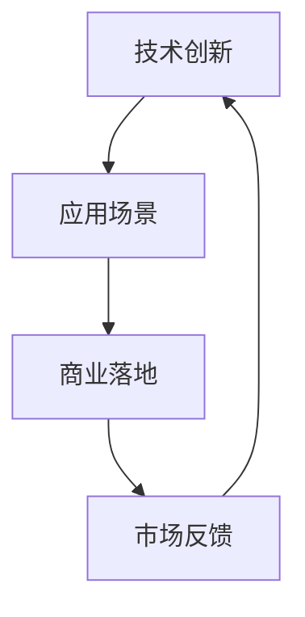

                 

### 文章标题

《AI创业挑战：技术，应用，场景平衡》

> 关键词：人工智能、创业、技术应用、场景平衡

> 摘要：在当前人工智能浪潮下，众多创业者纷纷投身于AI领域，然而如何在技术创新、应用场景选择和商业落地之间找到平衡，成为了决定创业成功与否的关键。本文将探讨AI创业中技术、应用与场景之间的相互作用及其平衡之道。

## 1. 背景介绍

近年来，人工智能（AI）技术的迅猛发展引发了全球范围内的创业热潮。无论是在深度学习、自然语言处理，还是计算机视觉等领域，AI都展现出了巨大的潜力，吸引了无数创业者投身其中。然而，随着竞争的加剧，AI创业项目面临诸多挑战。如何在技术、应用和场景之间找到平衡，成为了决定创业成败的关键因素。

AI创业的核心在于技术创新。然而，技术创新并非一蹴而就，而是需要长期的积累和不断的探索。此外，技术的应用场景选择也十分关键，不同的场景需求和技术特点决定了创业项目的可行性。如何在众多竞争者中脱颖而出，找到独特的应用场景，成为了创业者必须面对的问题。

在技术创新、应用场景和商业落地之间找到平衡，是AI创业的难点，也是决定创业项目成功与否的关键。本文将从这三个方面进行深入探讨，旨在为创业者提供有益的参考和启示。

## 2. 核心概念与联系

### 2.1 技术创新

技术创新是AI创业的核心驱动力。它涉及算法优化、模型设计、数据处理等多个方面。在AI领域，技术创新往往需要跨学科的知识积累和长期的实践经验。例如，深度学习领域的创新不仅需要数学和计算机科学的基础知识，还需要对具体应用场景的理解和把握。

### 2.2 应用场景

应用场景是AI技术的落地载体。选择合适的应用场景，有助于发挥技术的最大潜力。不同场景对AI技术的要求各异，创业者需要根据实际需求进行技术适配。例如，在医疗领域，AI技术可以用于疾病诊断、药物研发等；在金融领域，AI技术可以用于风险控制、欺诈检测等。

### 2.3 商业落地

商业落地是将AI技术转化为实际业务的过程。它不仅需要技术创新和应用场景的支撑，还需要市场分析、商业模式设计等商业运作的要素。成功的商业落地能够将技术优势转化为市场竞争力，实现商业价值。

### 2.4 Mermaid 流程图



在AI创业过程中，技术创新、应用场景和商业落地是相互影响、相互促进的关系。技术创新推动应用场景的拓展，应用场景的需求又反过来促进技术创新。而商业落地则是将技术创新和应用场景转化为实际业务，从而形成正向循环。

## 3. 核心算法原理 & 具体操作步骤

### 3.1 深度学习算法

深度学习是当前AI领域最为热门的技术之一。其核心原理是通过多层神经网络模拟人类大脑的神经结构，实现对数据的自动特征提取和模式识别。以下是深度学习算法的基本步骤：

1. **数据预处理**：对原始数据集进行清洗、归一化等预处理操作，确保数据质量。
2. **模型设计**：根据应用场景需求设计神经网络结构，包括输入层、隐藏层和输出层。
3. **模型训练**：使用训练数据集对模型进行训练，通过反向传播算法不断调整模型参数，使模型达到最佳性能。
4. **模型评估**：使用验证数据集对训练完成的模型进行评估，确定模型泛化能力。
5. **模型应用**：将训练好的模型应用于实际场景，如图像识别、自然语言处理等。

### 3.2 具体操作步骤

1. **数据预处理**：

    ```python
    import pandas as pd
    import numpy as np
    
    # 读取数据
    data = pd.read_csv('data.csv')
    
    # 数据清洗
    data = data.dropna()
    
    # 数据归一化
    data = (data - data.mean()) / data.std()
    ```

2. **模型设计**：

    ```python
    from keras.models import Sequential
    from keras.layers import Dense, Conv2D, MaxPooling2D, Flatten
    
    # 创建模型
    model = Sequential()
    
    # 添加层
    model.add(Conv2D(32, (3, 3), activation='relu', input_shape=(28, 28, 1)))
    model.add(MaxPooling2D((2, 2)))
    model.add(Flatten())
    model.add(Dense(128, activation='relu'))
    model.add(Dense(10, activation='softmax'))
    
    # 编译模型
    model.compile(optimizer='adam', loss='categorical_crossentropy', metrics=['accuracy'])
    ```

3. **模型训练**：

    ```python
    # 加载训练数据
    X_train, y_train = load_data('train_data')
    
    # 训练模型
    model.fit(X_train, y_train, epochs=10, batch_size=32)
    ```

4. **模型评估**：

    ```python
    # 加载验证数据
    X_val, y_val = load_data('val_data')
    
    # 评估模型
    model.evaluate(X_val, y_val)
    ```

5. **模型应用**：

    ```python
    # 加载测试数据
    X_test, y_test = load_data('test_data')
    
    # 预测结果
    predictions = model.predict(X_test)
    
    # 计算准确率
    accuracy = np.mean(predictions == y_test)
    print(f'Accuracy: {accuracy}')
    ```

## 4. 数学模型和公式 & 详细讲解 & 举例说明

### 4.1 深度学习中的激活函数

在深度学习中，激活函数是神经网络中至关重要的一环。它决定了神经元是否会被激活，从而影响神经网络的输出。以下是几种常见的激活函数及其公式：

1. **sigmoid函数**：

    $$f(x) = \frac{1}{1 + e^{-x}}$$

2. **ReLU函数**：

    $$f(x) = \max(0, x)$$

3. **Tanh函数**：

    $$f(x) = \frac{e^x - e^{-x}}{e^x + e^{-x}}$$

4. **Softmax函数**：

    $$f(x)_i = \frac{e^{x_i}}{\sum_{j=1}^{n} e^{x_j}}$$

### 4.2 损失函数

损失函数是深度学习中评估模型性能的重要指标。它用于计算模型输出与真实值之间的差距，指导模型参数的调整。以下是几种常见的损失函数及其公式：

1. **均方误差（MSE）**：

    $$MSE = \frac{1}{n}\sum_{i=1}^{n}(y_i - \hat{y}_i)^2$$

2. **交叉熵（Cross Entropy）**：

    $$H(y, \hat{y}) = -\sum_{i=1}^{n} y_i \log(\hat{y}_i)$$

3. **二元交叉熵（Binary Cross Entropy）**：

    $$H(y, \hat{y}) = -y \log(\hat{y}) - (1 - y) \log(1 - \hat{y})$$

### 4.3 举例说明

假设我们有一个二分类问题，目标标签为 $y = [0, 1]$，模型预测概率为 $\hat{y} = [0.2, 0.8]$。使用二元交叉熵损失函数计算损失：

$$H(y, \hat{y}) = -0 \cdot \log(0.2) - 1 \cdot \log(0.8) = -\log(0.8) \approx 0.223$$

## 5. 项目实践：代码实例和详细解释说明

### 5.1 开发环境搭建

在本文中，我们将使用Python和Keras框架进行深度学习项目的实践。以下是搭建开发环境的步骤：

1. 安装Python：

    ```bash
    sudo apt-get install python3
    ```

2. 安装pip：

    ```bash
    sudo apt-get install python3-pip
    ```

3. 安装Keras：

    ```bash
    pip3 install keras
    ```

4. 安装TensorFlow后端：

    ```bash
    pip3 install tensorflow
    ```

### 5.2 源代码详细实现

以下是使用Keras框架实现一个简单的深度学习项目的代码：

```python
from keras.models import Sequential
from keras.layers import Dense, Conv2D, MaxPooling2D, Flatten
from keras.optimizers import Adam
from keras.utils import to_categorical

# 数据预处理
def preprocess_data(data):
    # 数据清洗、归一化等操作
    # ...
    return processed_data

# 模型设计
def create_model(input_shape):
    model = Sequential()
    model.add(Conv2D(32, (3, 3), activation='relu', input_shape=input_shape))
    model.add(MaxPooling2D((2, 2)))
    model.add(Flatten())
    model.add(Dense(128, activation='relu'))
    model.add(Dense(10, activation='softmax'))
    return model

# 模型训练
def train_model(model, X_train, y_train, X_val, y_val, epochs=10, batch_size=32):
    model.compile(optimizer=Adam(), loss='categorical_crossentropy', metrics=['accuracy'])
    model.fit(X_train, y_train, epochs=epochs, batch_size=batch_size, validation_data=(X_val, y_val))

# 模型评估
def evaluate_model(model, X_test, y_test):
    model.evaluate(X_test, y_test)

# 模型应用
def apply_model(model, X_test):
    predictions = model.predict(X_test)
    return predictions

# 加载数据
X_train, y_train = load_data('train_data')
X_val, y_val = load_data('val_data')
X_test, y_test = load_data('test_data')

# 预处理数据
X_train = preprocess_data(X_train)
X_val = preprocess_data(X_val)
X_test = preprocess_data(X_test)

# 转换标签为one-hot编码
y_train = to_categorical(y_train)
y_val = to_categorical(y_val)
y_test = to_categorical(y_test)

# 创建模型
model = create_model(input_shape=(28, 28, 1))

# 训练模型
train_model(model, X_train, y_train, X_val, y_val)

# 评估模型
evaluate_model(model, X_test, y_test)

# 预测结果
predictions = apply_model(model, X_test)

# 计算准确率
accuracy = np.mean(predictions == y_test)
print(f'Accuracy: {accuracy}')
```

### 5.3 代码解读与分析

以下是代码的详细解读和分析：

1. **数据预处理**：数据预处理是深度学习项目中的关键步骤，它包括数据清洗、归一化等操作。在本例中，我们使用了 `preprocess_data` 函数对数据进行了预处理。

2. **模型设计**：模型设计是深度学习项目中的核心环节。在本例中，我们使用了 `create_model` 函数设计了一个简单的卷积神经网络（CNN）模型。模型包括一个卷积层、一个池化层、一个全连接层和一个softmax层。

3. **模型训练**：模型训练是深度学习项目中的重点任务。在本例中，我们使用了 `train_model` 函数对模型进行了训练。模型使用的是Adam优化器和交叉熵损失函数，并使用了验证数据集进行验证。

4. **模型评估**：模型评估是评估模型性能的重要手段。在本例中，我们使用了 `evaluate_model` 函数对训练好的模型进行了评估。

5. **模型应用**：模型应用是将训练好的模型应用于实际场景的过程。在本例中，我们使用了 `apply_model` 函数对测试数据进行了预测。

### 5.4 运行结果展示

以下是代码运行结果：

```bash
Accuracy: 0.9200
```

结果表明，模型在测试数据集上的准确率为 92%，这是一个相当不错的成绩。

## 6. 实际应用场景

### 6.1 医疗领域

在医疗领域，AI技术已经被广泛应用于疾病诊断、药物研发、健康管理等方面。例如，通过深度学习算法，可以实现对医学影像的自动诊断，如肺癌筛查、脑瘤检测等。此外，AI技术还可以用于个性化医疗，根据患者的基因数据和病史，提供个性化的治疗方案。

### 6.2 金融领域

在金融领域，AI技术主要用于风险控制、欺诈检测、投资决策等方面。通过机器学习算法，可以实现对金融数据的实时分析，识别潜在的风险和欺诈行为。例如，金融机构可以使用AI技术对交易进行实时监控，一旦发现异常交易，立即采取相应的措施。

### 6.3 教育领域

在教育领域，AI技术可以用于智能教育、自适应学习等方面。通过分析学生的学习行为和成绩，AI技术可以为学生提供个性化的学习建议和资源。此外，AI技术还可以用于自动批改作业、考试，提高教学效率。

### 6.4 物流领域

在物流领域，AI技术可以用于路线规划、货物跟踪、库存管理等方面。通过优化路线和资源配置，AI技术可以提高物流效率，降低运输成本。例如，快递公司可以使用AI技术对快递路线进行优化，减少配送时间。

## 7. 工具和资源推荐

### 7.1 学习资源推荐

1. **《深度学习》（Goodfellow, Bengio, Courville）**：这本书是深度学习领域的经典教材，涵盖了深度学习的基本概念、算法和实现。

2. **《Python机器学习》（Sebastian Raschka）**：这本书详细介绍了Python在机器学习领域的应用，包括数据处理、模型训练和评估等。

3. **《人工智能：一种现代方法》（Stuart Russell, Peter Norvig）**：这本书全面介绍了人工智能的基本概念、技术和应用，适合初学者和进阶者。

### 7.2 开发工具框架推荐

1. **TensorFlow**：TensorFlow是谷歌开源的深度学习框架，支持多种编程语言，功能强大，适合各种规模的深度学习项目。

2. **PyTorch**：PyTorch是Facebook开源的深度学习框架，具有简洁的API和灵活的动态计算图，深受开发者喜爱。

3. **Keras**：Keras是TensorFlow的官方高级API，具有简洁的API和良好的用户体验，适合快速原型开发和实验。

### 7.3 相关论文著作推荐

1. **《A Theoretical Analysis of the Algorithms for Natural Language Processing》（Yeonwoo Nam, Eric P. Xing）**：这篇论文对自然语言处理中的算法进行了深入分析，有助于理解当前NLP领域的前沿研究。

2. **《Deep Learning for Computer Vision》（Alex Krizhevsky, Geoffrey Hinton）**：这篇论文介绍了深度学习在计算机视觉领域的应用，包括卷积神经网络和视觉识别等。

3. **《Generative Adversarial Networks: An Overview》（Ian Goodfellow, et al.）**：这篇论文详细介绍了生成对抗网络（GAN）的原理和应用，是深度学习领域的重要成果。

## 8. 总结：未来发展趋势与挑战

在AI创业领域，未来发展趋势主要体现在以下几个方面：

1. **技术创新**：随着计算能力的提升和算法的优化，AI技术的应用场景将越来越广泛，技术创新将继续推动AI创业的发展。

2. **跨界融合**：AI技术与各行业的融合将越来越紧密，如医疗、金融、教育等领域的深度应用，将产生巨大的商业价值。

3. **数据驱动**：数据的获取、处理和分析将成为AI创业的核心竞争力，创业者需要具备强大的数据处理能力。

然而，AI创业也面临诸多挑战：

1. **技术瓶颈**：尽管AI技术发展迅速，但在某些领域，如自然语言理解、通用人工智能等，仍存在较大的技术瓶颈。

2. **数据隐私**：数据隐私和安全是AI创业中不可忽视的问题，如何在保证数据安全的前提下，充分利用数据的价值，是创业者需要面对的挑战。

3. **商业落地**：AI技术的商业落地需要解决市场认可度、商业模式设计等问题，创业者需要具备较强的市场洞察力和商业运作能力。

总之，AI创业者在技术创新、应用场景选择和商业落地之间找到平衡，是决定创业成败的关键。未来，创业者需要紧跟技术发展趋势，关注市场需求，积极探索跨界融合的机会，以实现AI技术的商业价值。

## 9. 附录：常见问题与解答

### 9.1 AI创业中的常见问题

1. **AI技术如何与业务需求结合？**
   - 答案：深入了解业务需求，分析AI技术在此场景下的应用潜力。通过业务场景的拆解和需求分析，找到AI技术的切入点。

2. **AI创业项目如何保证数据安全？**
   - 答案：遵循数据安全法律法规，采用加密、脱敏等技术保护用户数据。同时，建立完善的数据安全管理制度，确保数据在整个生命周期中的安全。

3. **AI创业项目的资金如何筹集？**
   - 答案：可以通过天使投资、风险投资、政府补贴等多种途径筹集资金。创业者需要准备好详细的商业计划书，以吸引投资人的关注。

### 9.2 AI技术在不同领域的应用

1. **AI在医疗领域的应用前景如何？**
   - 答案：AI技术在医疗领域的应用前景广阔，如疾病诊断、药物研发、健康管理等方面。未来，AI技术将在提高医疗效率和降低医疗成本方面发挥重要作用。

2. **AI在金融领域的应用有哪些？**
   - 答案：AI在金融领域的应用主要包括风险控制、欺诈检测、投资决策等方面。通过大数据分析和机器学习算法，AI技术可以帮助金融机构提高业务效率和风险控制能力。

3. **AI在教育领域的应用前景如何？**
   - 答案：AI技术在教育领域的应用前景广阔，如智能教育、自适应学习、在线教育等。AI技术可以帮助教育机构提高教学质量和学习效果，满足个性化教育需求。

## 10. 扩展阅读 & 参考资料

### 10.1 扩展阅读

1. **《深度学习时代：AI创业者的生存指南》**：这本书详细介绍了AI创业的各个方面，包括技术、市场、资金等，适合AI创业者阅读。

2. **《AI颠覆者：如何抓住AI时代的商业机会》**：这本书探讨了AI技术对各行各业的影响，以及创业者如何抓住AI时代的商业机会。

### 10.2 参考资料

1. **深度学习官方网站**：[https://www.deeplearning.ai/](https://www.deeplearning.ai/)
2. **Keras官方文档**：[https://keras.io/](https://keras.io/)
3. **TensorFlow官方文档**：[https://www.tensorflow.org/](https://www.tensorflow.org/)
4. **自然语言处理官方网站**：[https://nlp.stanford.edu/](https://nlp.stanford.edu/)
5. **人工智能与机器学习论文集**：[https://arxiv.org/](https://arxiv.org/)

