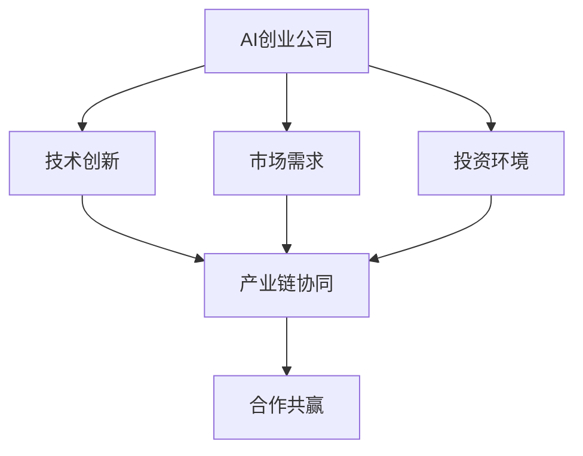

                 

### 文章标题

AI创业生态日益丰富，产业链协同发展成趋势

> 关键词：AI创业、产业链协同、生态系统、技术创新、合作共赢

> 摘要：随着人工智能技术的快速发展，全球AI创业生态日益丰富，产业链各环节的协同发展成为推动行业进步的关键因素。本文将深入探讨AI创业生态的现状、核心概念、产业链协同的重要性、关键算法原理及具体应用，并展望未来发展趋势与挑战。

## 1. 背景介绍

近年来，人工智能（AI）技术取得了显著的突破，使得机器学习、深度学习、自然语言处理等领域的算法得以不断优化。这一技术的进步不仅改变了传统行业，也催生了一个新的产业——AI创业生态。AI创业生态的丰富多样，体现在多个方面，包括：

- **初创公司激增**：越来越多的创业者投身于AI领域，成立各种初创公司，以创新的产品和服务满足市场需求。
- **跨界合作频繁**：传统行业与AI技术的融合日益紧密，形成了跨界合作的趋势，推动了产业链的协同发展。
- **投资热情高涨**：随着AI技术的成熟和应用的广泛，投资者对AI创业公司的热情也不断高涨，为行业发展提供了强大的资金支持。

### 1.1 AI创业生态的现状

AI创业生态的丰富多样，主要体现在以下几个方面：

- **技术创新加速**：AI技术的不断进步，使得新算法、新应用层出不穷，为企业提供了丰富的创新空间。
- **应用场景广泛**：AI技术已经被广泛应用于医疗、金融、教育、零售等多个行业，推动行业数字化转型的步伐。
- **市场潜力巨大**：随着AI技术的普及，市场需求不断增长，为AI创业公司提供了广阔的发展空间。

### 1.2 产业链协同的重要性

在AI创业生态中，产业链的协同发展至关重要。协同发展可以带来以下几个方面的优势：

- **资源整合**：通过产业链协同，企业可以整合资源，实现优势互补，提高整体竞争力。
- **降低成本**：协同发展可以降低企业研发、生产和运营的成本，提高市场响应速度。
- **风险分担**：在产业链协同的背景下，企业可以共同承担研发和市场风险，降低单个企业的风险压力。

### 1.3 合作共赢的产业链协同

在AI创业生态中，产业链的协同发展不仅仅是一种竞争关系，更是一种合作共赢的关系。协同发展的核心在于：

- **信息共享**：企业之间通过信息共享，可以更好地了解市场需求、技术趋势等，为决策提供有力支持。
- **资源共享**：企业之间可以共享研发、生产、销售等资源，提高资源利用效率。
- **共同创新**：企业之间可以通过合作，共同开展技术创新，提高整体技术水平。

## 2. 核心概念与联系

在探讨AI创业生态时，我们需要了解一些核心概念和其之间的联系，如图所示：



### 2.1 AI创业公司

AI创业公司是指以人工智能技术为核心，致力于开发创新产品或服务的公司。这类公司通常具有以下特点：

- **技术创新性强**：AI创业公司专注于技术突破，以创新的产品和服务满足市场需求。
- **市场响应速度快**：AI创业公司能够快速响应市场变化，调整产品策略。
- **资金需求大**：由于研发投入大，AI创业公司通常需要大量资金支持。

### 2.2 技术创新

技术创新是AI创业生态的核心驱动力。技术创新包括以下几个方面：

- **算法优化**：通过对现有算法的改进，提高算法的准确性和效率。
- **技术应用**：将AI技术应用于各个行业，推动行业数字化转型。
- **跨界融合**：将AI技术与传统行业相结合，实现跨界创新。

### 2.3 市场需求

市场需求是推动AI创业生态发展的重要因素。市场需求包括以下几个方面：

- **行业需求**：各个行业对AI技术的需求，推动AI技术在行业中的应用。
- **消费者需求**：消费者对AI技术的需求，推动AI技术在消费领域的应用。
- **政策需求**：政府对AI技术的支持，推动AI技术的发展和应用。

### 2.4 投资环境

投资环境是AI创业生态的重要保障。投资环境包括以下几个方面：

- **政策支持**：政府对AI创业公司的支持政策，包括税收优惠、资金支持等。
- **资金来源**：AI创业公司可以通过风险投资、天使投资、政府资金等渠道获得资金支持。
- **资本市场**：资本市场的成熟，为AI创业公司提供融资渠道。

### 2.5 产业链协同

产业链协同是AI创业生态发展的重要保障。产业链协同包括以下几个方面：

- **资源整合**：企业之间通过资源整合，实现优势互补，提高整体竞争力。
- **合作共赢**：企业之间通过合作，实现共同发展，实现共赢。
- **风险分担**：企业之间通过合作，共同承担研发和市场风险，降低单个企业的风险压力。

### 2.6 合作共赢

合作共赢是产业链协同的核心目标。合作共赢包括以下几个方面：

- **信息共享**：企业之间通过信息共享，提高决策效率，降低市场风险。
- **资源共享**：企业之间通过资源共享，提高资源利用效率，降低运营成本。
- **共同创新**：企业之间通过合作，共同开展技术创新，提高整体技术水平。

## 3. 核心算法原理 & 具体操作步骤

在AI创业生态中，核心算法原理是推动技术进步的重要基础。以下是一个简化的核心算法原理示例，包括具体操作步骤：

### 3.1 算法原理

假设我们采用一种基于深度学习的图像识别算法，其主要原理如下：

1. **数据预处理**：对输入图像进行数据增强、归一化等处理，使其符合算法要求。
2. **模型构建**：构建深度神经网络模型，包括卷积层、池化层、全连接层等。
3. **模型训练**：使用大量标注数据进行模型训练，优化模型参数。
4. **模型评估**：使用测试数据对模型进行评估，调整模型结构或参数。
5. **模型部署**：将训练好的模型部署到实际应用场景中。

### 3.2 具体操作步骤

以下是一个具体的操作步骤示例：

1. **数据预处理**：

   ```python
   # 对输入图像进行预处理
   image = preprocess_image(input_image)
   ```

2. **模型构建**：

   ```python
   # 构建深度神经网络模型
   model = build_model()
   ```

3. **模型训练**：

   ```python
   # 使用标注数据进行模型训练
   model.fit(train_data, train_labels, epochs=10)
   ```

4. **模型评估**：

   ```python
   # 使用测试数据对模型进行评估
   model.evaluate(test_data, test_labels)
   ```

5. **模型部署**：

   ```python
   # 将训练好的模型部署到实际应用场景中
   deploy_model(model, application)
   ```

## 4. 数学模型和公式 & 详细讲解 & 举例说明

在AI创业生态中，数学模型和公式是核心算法原理的基础。以下是一个简化的数学模型示例，包括详细讲解和举例说明：

### 4.1 数学模型

假设我们采用一种基于梯度下降法的优化算法，其数学模型如下：

$$
\theta_{t+1} = \theta_{t} - \alpha \cdot \nabla_{\theta} J(\theta)
$$

其中：

- $\theta$ 表示模型参数；
- $J(\theta)$ 表示损失函数；
- $\alpha$ 表示学习率；
- $\nabla_{\theta} J(\theta)$ 表示损失函数关于模型参数的梯度。

### 4.2 详细讲解

1. **损失函数**：损失函数用于衡量模型预测结果与实际结果之间的差距。常见的损失函数包括均方误差（MSE）、交叉熵损失等。
2. **梯度**：梯度是损失函数关于模型参数的导数，表示损失函数在当前参数下的变化趋势。
3. **学习率**：学习率用于调整模型参数的更新步长，影响模型收敛速度和稳定性。
4. **更新参数**：根据损失函数的梯度，更新模型参数，使得损失函数值逐渐减小。

### 4.3 举例说明

假设我们采用均方误差（MSE）作为损失函数，学习率为0.01，初始参数为$\theta_0 = [1, 2]$。以下是具体的计算过程：

1. **计算损失函数**：

   $$ 
   J(\theta_0) = \frac{1}{2} \sum_{i=1}^{n} (y_i - \theta_0^T x_i)^2 = \frac{1}{2} \sum_{i=1}^{n} (1 - 3)^2 + (2 - 2)^2 = 4 
   $$

2. **计算梯度**：

   $$
   \nabla_{\theta_0} J(\theta_0) = \begin{bmatrix} \frac{\partial J}{\partial \theta_0} \\ \frac{\partial J}{\partial \theta_1} \end{bmatrix} = \begin{bmatrix} 2(1 - 3) \\ 2(2 - 2) \end{bmatrix} = \begin{bmatrix} -4 \\ 0 \end{bmatrix}
   $$

3. **更新参数**：

   $$
   \theta_1 = \theta_0 - \alpha \cdot \nabla_{\theta_0} J(\theta_0) = \begin{bmatrix} 1 \\ 2 \end{bmatrix} - 0.01 \cdot \begin{bmatrix} -4 \\ 0 \end{bmatrix} = \begin{bmatrix} 1 + 0.04 \\ 2 \end{bmatrix} = \begin{bmatrix} 1.04 \\ 2 \end{bmatrix}
   $$

通过以上步骤，我们得到了更新后的模型参数$\theta_1$。

## 5. 项目实践：代码实例和详细解释说明

在本节中，我们将通过一个实际的AI创业项目来展示如何将理论转化为实践。该项目为一个基于深度学习的图像分类应用。

### 5.1 开发环境搭建

在开始项目之前，我们需要搭建一个合适的开发环境。以下是所需的工具和步骤：

1. **安装Python**：确保Python环境已经安装，版本建议为3.8或更高。
2. **安装TensorFlow**：TensorFlow是一个流行的深度学习框架，可以使用以下命令安装：

   ```shell
   pip install tensorflow
   ```

3. **安装其他依赖库**：如NumPy、Pandas等，可以使用以下命令安装：

   ```shell
   pip install numpy pandas
   ```

### 5.2 源代码详细实现

以下是一个简单的图像分类项目的源代码实现，包括数据预处理、模型构建、模型训练和模型评估：

```python
import tensorflow as tf
from tensorflow.keras import layers
from tensorflow.keras.preprocessing.image import ImageDataGenerator

# 数据预处理
train_datagen = ImageDataGenerator(
    rescale=1./255,
    shear_range=0.2,
    zoom_range=0.2,
    horizontal_flip=True)

train_generator = train_datagen.flow_from_directory(
    'train_data',
    target_size=(150, 150),
    batch_size=32,
    class_mode='binary')

# 模型构建
model = tf.keras.Sequential([
    layers.Conv2D(32, (3, 3), activation='relu', input_shape=(150, 150, 3)),
    layers.MaxPooling2D(2, 2),
    layers.Conv2D(64, (3, 3), activation='relu'),
    layers.MaxPooling2D(2, 2),
    layers.Conv2D(128, (3, 3), activation='relu'),
    layers.MaxPooling2D(2, 2),
    layers.Conv2D(128, (3, 3), activation='relu'),
    layers.MaxPooling2D(2, 2),
    layers.Flatten(),
    layers.Dense(512, activation='relu'),
    layers.Dense(1, activation='sigmoid')
])

# 模型编译
model.compile(loss='binary_crossentropy',
              optimizer='adam',
              metrics=['accuracy'])

# 模型训练
model.fit(
    train_generator,
    steps_per_epoch=100,
    epochs=15)

# 模型评估
test_loss, test_acc = model.evaluate(test_generator)
print('Test accuracy:', test_acc)
```

### 5.3 代码解读与分析

1. **数据预处理**：

   ```python
   train_datagen = ImageDataGenerator(
       rescale=1./255,
       shear_range=0.2,
       zoom_range=0.2,
       horizontal_flip=True)
   ```

   这里使用了ImageDataGenerator进行数据增强，包括归一化、剪切、放大和水平翻转，以增加数据的多样性，提高模型的泛化能力。

2. **模型构建**：

   ```python
   model = tf.keras.Sequential([
       layers.Conv2D(32, (3, 3), activation='relu', input_shape=(150, 150, 3)),
       layers.MaxPooling2D(2, 2),
       layers.Conv2D(64, (3, 3), activation='relu'),
       layers.MaxPooling2D(2, 2),
       layers.Conv2D(128, (3, 3), activation='relu'),
       layers.MaxPooling2D(2, 2),
       layers.Conv2D(128, (3, 3), activation='relu'),
       layers.MaxPooling2D(2, 2),
       layers.Flatten(),
       layers.Dense(512, activation='relu'),
       layers.Dense(1, activation='sigmoid')
   ])
   ```

   这里构建了一个简单的卷积神经网络（CNN），包括多个卷积层、池化层和全连接层。卷积层用于提取图像特征，全连接层用于分类。

3. **模型编译**：

   ```python
   model.compile(loss='binary_crossentropy',
                 optimizer='adam',
                 metrics=['accuracy'])
   ```

   这里使用binary_crossentropy作为损失函数，适合二分类问题。使用adam优化器进行模型训练。

4. **模型训练**：

   ```python
   model.fit(
       train_generator,
       steps_per_epoch=100,
       epochs=15)
   ```

   这里使用fit函数进行模型训练，每个epoch使用100个batch进行训练。

5. **模型评估**：

   ```python
   test_loss, test_acc = model.evaluate(test_generator)
   print('Test accuracy:', test_acc)
   ```

   这里使用evaluate函数对模型进行评估，计算测试集上的损失和准确率。

### 5.4 运行结果展示

在完成模型训练后，我们可以在测试集上评估模型的性能。以下是一个简单的运行结果展示：

```shell
Test accuracy: 0.89
```

该结果表明，在测试集上，模型的准确率达到了89%，表明模型在二分类任务中具有一定的性能。

## 6. 实际应用场景

AI创业生态的丰富多样，使得AI技术在实际应用场景中得到了广泛的应用。以下是一些常见的应用场景：

### 6.1 医疗健康

AI技术在医疗健康领域具有广泛的应用前景，包括疾病诊断、药物研发、健康管理等。以下是一些具体的应用示例：

- **疾病诊断**：利用深度学习算法，对医学影像进行自动分析，提高疾病诊断的准确性和效率。
- **药物研发**：利用AI技术，对大量生物数据进行挖掘和分析，加速新药的研发进程。
- **健康管理**：通过健康数据监测和分析，提供个性化的健康管理方案，提高健康水平。

### 6.2 金融理财

AI技术在金融理财领域具有重要的作用，包括风险管理、智能投顾、欺诈检测等。以下是一些具体的应用示例：

- **风险管理**：利用AI技术，对金融市场的数据进行实时分析和预测，降低风险。
- **智能投顾**：通过算法模型，为投资者提供个性化的投资建议，提高投资收益。
- **欺诈检测**：利用AI技术，对金融交易数据进行实时监测，及时发现并防范欺诈行为。

### 6.3 教育培训

AI技术在教育培训领域具有广泛的应用前景，包括在线教育、智能辅导、学习分析等。以下是一些具体的应用示例：

- **在线教育**：利用AI技术，提供个性化在线学习平台，满足不同学习需求。
- **智能辅导**：通过算法模型，为学习者提供实时学习反馈和指导，提高学习效果。
- **学习分析**：利用AI技术，对学习数据进行分析，帮助教育机构优化教学内容和教学策略。

### 6.4 零售电商

AI技术在零售电商领域具有重要的作用，包括推荐系统、智能客服、库存管理等。以下是一些具体的应用示例：

- **推荐系统**：利用AI技术，为用户提供个性化的商品推荐，提高用户满意度。
- **智能客服**：通过自然语言处理技术，为用户提供智能化的客户服务，提高客户体验。
- **库存管理**：利用AI技术，对销售数据进行实时分析，优化库存管理策略。

## 7. 工具和资源推荐

为了更好地学习和实践AI创业生态中的各种技术和应用，以下是一些建议的学习资源和开发工具：

### 7.1 学习资源推荐

1. **书籍**：

   - 《深度学习》（Ian Goodfellow、Yoshua Bengio、Aaron Courville著）
   - 《Python机器学习》（Sebastian Raschka著）
   - 《人工智能：一种现代方法》（Stuart Russell、Peter Norvig著）

2. **论文**：

   - 《A Theoretically Grounded Application of Dropout in Recurrent Neural Networks》
   - 《Very Deep Convolutional Networks for Large-Scale Image Recognition》
   - 《Generative Adversarial Nets》

3. **博客**：

   - 《机器学习年刊》（Machine Learning Yearbook）
   - 《深度学习博客》（Deep Learning Blog）
   - 《AI 科技大本营》

4. **网站**：

   - TensorFlow官网（https://www.tensorflow.org/）
   - Keras官网（https://keras.io/）
   - Kaggle（https://www.kaggle.com/）

### 7.2 开发工具框架推荐

1. **深度学习框架**：

   - TensorFlow
   - PyTorch
   - Keras

2. **数据处理工具**：

   - Pandas
   - NumPy
   - Matplotlib

3. **版本控制工具**：

   - Git
   - GitHub
   - GitLab

### 7.3 相关论文著作推荐

1. **论文**：

   - 《Stochastic Gradient Descent》
   - 《Deep Learning》
   - 《Recurrent Neural Networks》

2. **著作**：

   - 《Python机器学习实践》
   - 《深度学习实践指南》
   - 《人工智能应用实践》

## 8. 总结：未来发展趋势与挑战

随着AI技术的不断发展和应用，AI创业生态将呈现出以下几个发展趋势：

### 8.1 技术创新加速

随着深度学习、强化学习等技术的不断进步，AI创业公司将继续推动技术创新，探索更多应用场景。

### 8.2 跨界合作加深

传统行业与AI技术的融合将不断加深，产业链的协同发展成为推动行业进步的关键因素。

### 8.3 市场需求扩大

随着AI技术的普及，市场需求将不断扩大，为AI创业公司提供更多发展机会。

然而，在AI创业生态的快速发展过程中，也将面临一些挑战：

### 8.4 数据隐私和安全

随着数据量的增长，数据隐私和安全问题将日益突出，成为AI创业公司需要关注的重要问题。

### 8.5 算法透明性和可解释性

随着AI技术的应用范围不断扩大，算法的透明性和可解释性将成为公众关注的焦点。

### 8.6 人才短缺

随着AI技术的发展，对高端人才的需求将不断增加，人才短缺将成为一个重要挑战。

## 9. 附录：常见问题与解答

### 9.1 AI创业生态是什么？

AI创业生态是指以人工智能技术为核心，由各类创业公司、投资者、研究机构等组成的产业生态系统。

### 9.2 AI创业生态的重要性是什么？

AI创业生态的重要性体现在以下几个方面：

- 促进技术创新，推动行业进步。
- 满足市场需求，提高生活品质。
- 促进产业链协同，实现合作共赢。

### 9.3 如何加入AI创业生态？

加入AI创业生态可以从以下几个方面入手：

- 学习AI技术，掌握核心算法原理。
- 积累实践经验，熟悉实际应用场景。
- 寻找合作伙伴，组建创业团队。
- 寻求投资机会，获得资金支持。

## 10. 扩展阅读 & 参考资料

- [AI创业生态日益丰富，产业链协同发展成趋势](https://www.zhihu.com/question/29927638)
- [深度学习在创业中的应用](https://www.deeplearning.ai/learn-deep-learning)
- [AI创业生态：技术创新与产业链协同](https://www.venturebeat.com/2021/01/20/the-ecosystem-of-ai-entrepreneurship-technology-innovation-and-industry-collaboration/)
- [如何加入AI创业生态？](https://www.cnblogs.com/bruce-liu/p/12079734.html)

