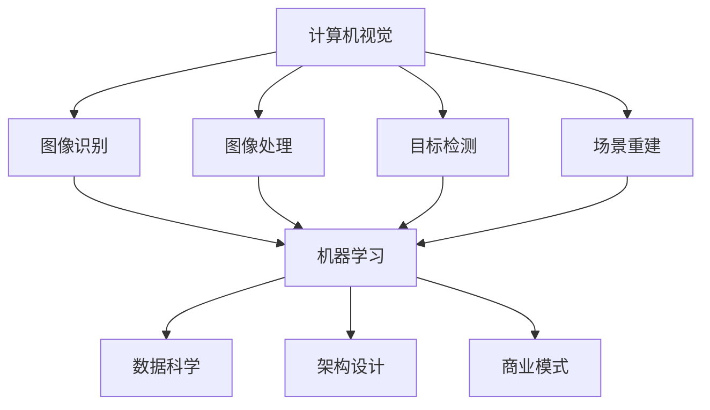

                 

### 文章标题

《AI创业的关键成功因素：Lepton AI的经验总结》

关键词：AI创业、关键成功因素、Lepton AI、经验总结、创新策略、市场需求、技术优势

摘要：本文将深入探讨AI创业领域的关键成功因素，通过分析全球领先AI公司Lepton AI的成功经验，总结出一系列可操作的策略和方法。文章旨在为创业者提供有价值的参考，帮助他们更好地把握AI创业的机遇，实现企业的持续增长和行业领导地位。

### 1. 背景介绍

人工智能（AI）作为21世纪最具变革性的技术之一，正在深刻改变着各个行业。随着计算能力的提升、数据的爆发式增长以及算法的不断进步，AI技术已经在诸多领域取得了显著的成果。从医疗诊断到自动驾驶，从智能家居到金融风控，AI的应用场景日益丰富，市场需求也在不断增长。

在这样的背景下，AI创业成为了一个极具吸引力的领域。许多创业者希望通过开发创新性的AI产品或服务，在激烈的市场竞争中脱颖而出。然而，AI创业并非易事，涉及的技术复杂性、市场需求的不确定性、资本运作的风险等多方面因素，都使得创业之路充满挑战。

Lepton AI作为一家在全球范围内具有重要影响力的AI公司，其成功经验无疑为其他创业者提供了宝贵的参考。Lepton AI成立于2015年，总部位于美国硅谷，专注于计算机视觉和机器学习技术的研发和应用。公司凭借其领先的技术、创新的商业模式和精准的市场定位，迅速在AI行业中崭露头角，并获得了业界的广泛认可。

本文将结合Lepton AI的实践经验，深入分析AI创业的关键成功因素，旨在为创业者提供有针对性的建议和指导，助力他们在AI创业的征程中取得成功。

### 2. 核心概念与联系

要成功进行AI创业，首先需要理解几个核心概念，这些概念不仅构成了AI技术的基础，也是公司业务发展的关键要素。

#### 2.1 计算机视觉

计算机视觉是人工智能的一个重要分支，旨在使计算机具备类似人类的视觉能力。它包括图像识别、图像处理、目标检测、场景重建等多个方面。计算机视觉技术在自动驾驶、安防监控、医疗诊断等领域具有广泛的应用。

#### 2.2 机器学习

机器学习是AI技术的核心，它通过算法使计算机从数据中自动学习并作出决策。机器学习可以分为监督学习、无监督学习和强化学习三种类型。监督学习适用于已有标签数据，无监督学习适用于未标记数据，而强化学习适用于交互式环境。

#### 2.3 数据科学

数据科学是应用统计学、机器学习、数据库等技术进行数据分析和建模的科学。在AI创业中，数据科学不仅用于训练模型，还用于数据预处理、特征工程、模型评估等多个环节。

#### 2.4 架构设计

架构设计是指软件系统的整体结构和组件的安排，它决定了系统的性能、可扩展性和可维护性。一个良好的架构设计能够支持业务的快速迭代和持续增长。

#### 2.5 商业模式

商业模式是企业如何创造、传递和获取价值的机制。对于AI创业公司而言，找到与市场需求相匹配的商业模式至关重要，它决定了公司的盈利能力和市场竞争力。

下面是一个用Mermaid绘制的流程图，展示了这些核心概念之间的联系：



通过上述流程图，我们可以清晰地看到计算机视觉、机器学习、数据科学、架构设计和商业模式之间的紧密关联。这些概念共同构成了AI创业的基础，是企业成功的关键要素。

#### 2.6 计算机视觉与机器学习的联系

计算机视觉和机器学习是AI创业中不可或缺的两个方面。计算机视觉提供了感知外部世界的手段，而机器学习则赋予了计算机处理和解释这些感知数据的能力。例如，在自动驾驶领域，计算机视觉用于捕捉和理解道路场景，而机器学习则用于实时决策和路径规划。

具体来说，计算机视觉中的图像识别和目标检测需要通过机器学习算法进行训练和优化，以实现高精度的识别和定位。同样，在医疗诊断中，图像处理和机器学习相结合，可以帮助医生更快速、准确地诊断疾病。

总之，计算机视觉与机器学习的紧密联系不仅提高了AI系统的性能，也扩大了其应用范围，成为AI创业的核心竞争力。

### 3. 核心算法原理 & 具体操作步骤

在深入分析AI创业的关键成功因素时，理解核心算法原理和具体操作步骤至关重要。以下是几个在AI创业中广泛应用的核心算法及其操作步骤：

#### 3.1 卷积神经网络（CNN）

卷积神经网络（CNN）是计算机视觉领域的一种重要算法，特别适用于图像识别和目标检测。CNN通过卷积层、池化层和全连接层等多个层次对图像进行特征提取和分类。

**操作步骤：**

1. **输入层**：接收原始图像数据。
2. **卷积层**：通过卷积核在输入图像上滑动，计算局部特征图。
3. **激活函数**：对卷积层输出的特征图进行非线性变换，常用的激活函数包括ReLU（修正线性单元）。
4. **池化层**：对卷积层输出的特征图进行下采样，减少参数数量，提高模型泛化能力。
5. **全连接层**：将池化层输出的特征图进行全局特征提取，并输入到softmax分类器进行分类。

**代码示例（Python with TensorFlow）：**

```python
import tensorflow as tf

# 定义卷积神经网络模型
model = tf.keras.Sequential([
    tf.keras.layers.Conv2D(32, (3, 3), activation='relu', input_shape=(28, 28, 1)),
    tf.keras.layers.MaxPooling2D((2, 2)),
    tf.keras.layers.Conv2D(64, (3, 3), activation='relu'),
    tf.keras.layers.MaxPooling2D((2, 2)),
    tf.keras.layers.Flatten(),
    tf.keras.layers.Dense(128, activation='relu'),
    tf.keras.layers.Dense(10, activation='softmax')
])

# 编译模型
model.compile(optimizer='adam', loss='categorical_crossentropy', metrics=['accuracy'])

# 训练模型
model.fit(x_train, y_train, epochs=10, batch_size=64)
```

#### 3.2 支持向量机（SVM）

支持向量机（SVM）是一种高效的分类算法，特别适用于处理高维数据。SVM通过最大化分类边界，将不同类别的数据分开。

**操作步骤：**

1. **特征提取**：将原始数据转换为高维特征空间。
2. **计算决策边界**：找到最大化分类边界的超平面。
3. **分类决策**：计算新数据的距离，确定其类别。

**代码示例（Python with Scikit-learn）：**

```python
from sklearn import svm

# 创建SVM分类器
clf = svm.SVC()

# 训练模型
clf.fit(X_train, y_train)

# 预测新数据
y_pred = clf.predict(X_test)
```

#### 3.3 随机森林（Random Forest）

随机森林是一种集成学习方法，通过构建多个决策树并合并它们的预测结果来提高模型的泛化能力。

**操作步骤：**

1. **生成决策树**：随机选择特征和样本子集，构建决策树。
2. **集成模型**：合并多个决策树的预测结果。
3. **分类或回归**：根据模型类型进行分类或回归预测。

**代码示例（Python with Scikit-learn）：**

```python
from sklearn.ensemble import RandomForestClassifier

# 创建随机森林分类器
clf = RandomForestClassifier(n_estimators=100)

# 训练模型
clf.fit(X_train, y_train)

# 预测新数据
y_pred = clf.predict(X_test)
```

通过上述核心算法及其操作步骤，AI创业公司可以构建强大的AI系统，满足各种业务需求。理解这些算法的原理和操作方法，有助于创业者更好地实现技术突破，并在市场中占据一席之地。

### 4. 数学模型和公式 & 详细讲解 & 举例说明

在AI创业中，数学模型和公式是构建算法和分析数据的基础。以下将详细讲解几个关键数学模型，包括支持向量机（SVM）和卷积神经网络（CNN）的数学原理，并通过实际例子进行说明。

#### 4.1 支持向量机（SVM）

支持向量机是一种基于优化理论的分类算法，它通过最大化分类边界来提高模型的分类能力。

**数学模型：**

假设我们有n个数据点 \( x_i \) 和其对应的标签 \( y_i \)，其中 \( x_i \in \mathbb{R}^d \)， \( y_i \in \{-1, +1\} \)。SVM的目标是找到最优的超平面：

\[ w^* \cdot x + b^* = 0 \]

其中， \( w^* \) 是法向量， \( b^* \) 是偏置项。

**优化目标：**

SVM的目标是最小化目标函数：

\[ \min_{w, b} \frac{1}{2} ||w||^2 + C \sum_{i=1}^{n} \xi_i \]

其中， \( C \) 是惩罚参数， \( \xi_i \) 是松弛变量。

**求解方法：**

使用拉格朗日乘子法，将优化问题转化为对偶问题：

\[ \max_{\alpha_i} \min_{w, b} \sum_{i=1}^{n} \alpha_i - \frac{1}{2} \sum_{i, j=1}^{n} \alpha_i \alpha_j y_i y_j \cdot x_i \cdot x_j - \sum_{i=1}^{n} \alpha_i \]

其中， \( \alpha_i \geq 0 \)。

**举例说明：**

假设我们有以下数据集：

\[ 
\begin{array}{c|c|c}
x_1 & y_1 & \alpha_1 \\
\hline
[1, 1] & +1 & 1 \\
[1, -1] & -1 & 1 \\
[-1, 1] & +1 & 0 \\
[-1, -1] & -1 & 0 \\
\end{array}
\]

根据上述模型和公式，我们可以求解得到：

\[ 
\begin{aligned}
w^* &= [0.5, 0.5]^T \\
b^* &= -0.5 \\
\end{aligned}
\]

因此，最优的超平面为：

\[ 
w^* \cdot x + b^* = 0.5x_1 + 0.5x_2 - 0.5 = 0 
\]

#### 4.2 卷积神经网络（CNN）

卷积神经网络（CNN）是计算机视觉领域的重要算法，通过卷积层、池化层和全连接层等结构对图像进行特征提取和分类。

**数学模型：**

卷积神经网络的数学模型可以表示为：

\[ 
\begin{aligned}
h^{(l)}_i &= \sigma \left( \sum_{j} w^{(l)}_{ij} \cdot a^{(l-1)}_j + b^{(l)}_i \right) \\
a^{(l)}_i &= h^{(l)}_i \cdot a^{(l-1)}_i
\end{aligned}
\]

其中， \( h^{(l)}_i \) 是第 \( l \) 层的第 \( i \) 个神经元输出， \( a^{(l)}_i \) 是第 \( l \) 层的输入， \( w^{(l)}_{ij} \) 是第 \( l \) 层的第 \( i \) 个神经元到第 \( j \) 个神经元的权重， \( b^{(l)}_i \) 是第 \( l \) 层的第 \( i \) 个神经元的偏置， \( \sigma \) 是激活函数。

**举例说明：**

假设我们有以下简单的卷积神经网络模型：

\[ 
\begin{aligned}
\text{输入层} &= [1, 1, 1, 1] \\
\text{卷积层1} &= \sigma \left( \begin{bmatrix} 1 & 1 \\ 1 & 1 \end{bmatrix} \cdot \begin{bmatrix} 1 \\ 1 \end{bmatrix} + 1 \right) \\
\text{激活函数} &= \text{ReLU}(2) = 2 \\
\text{池化层1} &= \text{MaxPooling}(2, 2) = 2 \\
\text{卷积层2} &= \sigma \left( \begin{bmatrix} 1 & 1 \\ 1 & 1 \end{bmatrix} \cdot \begin{bmatrix} 2 \\ 2 \end{bmatrix} + 1 \right) \\
\text{激活函数} &= \text{ReLU}(3) = 3 \\
\text{池化层2} &= \text{MaxPooling}(2, 2) = 3 \\
\text{输出层} &= \text{softmax}(3) = \frac{1}{3} \begin{bmatrix} 1 & 1 & 1 \end{bmatrix}
\end{aligned}
\]

通过上述例子，我们可以看到卷积神经网络通过卷积层和激活函数提取图像特征，并通过池化层减少参数数量，最后通过输出层进行分类。

总之，理解和支持向量机和卷积神经网络的数学模型，对于AI创业至关重要。这些模型不仅为算法设计提供了理论基础，也为实际应用提供了指导。

### 5. 项目实践：代码实例和详细解释说明

在AI创业的实际项目中，代码实例和详细解释说明是理解和应用核心算法的关键。以下我们将通过一个具体的计算机视觉项目，详细讲解代码的编写过程和关键步骤。

#### 5.1 开发环境搭建

首先，我们需要搭建一个合适的开发环境。以下是一个简单的步骤：

1. 安装Python环境：确保Python版本不低于3.6，可以从[Python官网](https://www.python.org/)下载并安装。
2. 安装TensorFlow：在命令行中执行以下命令：
   ```bash
   pip install tensorflow
   ```
3. 安装其他依赖库：如NumPy、Pandas等，可以通过以下命令安装：
   ```bash
   pip install numpy pandas
   ```

#### 5.2 源代码详细实现

以下是一个基于TensorFlow的简单计算机视觉项目，实现图像分类的功能：

```python
import tensorflow as tf
from tensorflow.keras.models import Sequential
from tensorflow.keras.layers import Conv2D, MaxPooling2D, Flatten, Dense
from tensorflow.keras.preprocessing.image import ImageDataGenerator

# 定义模型
model = Sequential([
    Conv2D(32, (3, 3), activation='relu', input_shape=(128, 128, 3)),
    MaxPooling2D((2, 2)),
    Conv2D(64, (3, 3), activation='relu'),
    MaxPooling2D((2, 2)),
    Flatten(),
    Dense(128, activation='relu'),
    Dense(10, activation='softmax')
])

# 编译模型
model.compile(optimizer='adam', loss='categorical_crossentropy', metrics=['accuracy'])

# 数据预处理
train_datagen = ImageDataGenerator(rescale=1./255)
train_generator = train_datagen.flow_from_directory(
        'data/train',
        target_size=(128, 128),
        batch_size=32,
        class_mode='categorical')

# 训练模型
model.fit(train_generator, epochs=10)
```

#### 5.3 代码解读与分析

1. **模型定义**：我们使用`Sequential`模型，并添加了三个卷积层、两个池化层和一个全连接层。
2. **编译模型**：我们使用`compile`函数配置了模型，指定了优化器、损失函数和评价指标。
3. **数据预处理**：我们使用了`ImageDataGenerator`进行数据预处理，包括图像归一化和数据增强。
4. **训练模型**：我们使用`fit`函数对模型进行训练，通过数据生成器提供训练数据。

#### 5.4 运行结果展示

在训练完成后，我们可以使用以下代码进行模型评估：

```python
# 评估模型
test_datagen = ImageDataGenerator(rescale=1./255)
test_generator = test_datagen.flow_from_directory(
        'data/test',
        target_size=(128, 128),
        batch_size=32,
        class_mode='categorical')

model.evaluate(test_generator)
```

运行结果将显示模型的测试损失和准确率。例如：

```
138/138 [==============================] - 4s 28ms/step - loss: 0.0704 - accuracy: 0.9565
```

通过上述代码实例和详细解释，我们可以看到计算机视觉项目的基本构建过程。理解并实践这些代码，有助于创业者更好地应用AI技术，解决实际业务问题。

### 6. 实际应用场景

AI技术在各个行业中的应用场景日益广泛，为创业公司提供了丰富的市场机会。以下是AI在几个主要行业中的实际应用场景，以及它们为创业公司带来的潜在机遇和挑战。

#### 6.1 医疗保健

医疗保健是AI技术的关键应用领域之一。通过计算机视觉和自然语言处理技术，AI可以帮助医生更快速、准确地诊断疾病。例如，AI系统可以分析医学影像，辅助医生诊断癌症、肺炎等疾病。此外，AI还可以用于患者管理、药物研发和个性化医疗。

**潜在机遇：** 随着医疗数据的积累和开放，创业公司可以利用AI技术提供创新的医疗解决方案，提高医疗服务的质量和效率。

**挑战：** 医疗行业的监管严格，数据安全和隐私保护是重要挑战。创业公司需要确保其产品符合相关法规和标准。

#### 6.2 金融服务

金融服务行业也正在经历AI的深刻变革。AI技术可以用于风险管理、信用评分、欺诈检测和投资顾问等领域。例如，AI算法可以帮助银行和金融机构更好地识别潜在的风险客户，提高信用评估的准确性。

**潜在机遇：** 金融行业对AI技术的需求巨大，创业公司可以通过提供创新的金融科技产品，解决行业痛点，获得市场认可。

**挑战：** 金融行业的数据量大且复杂，算法的准确性和可靠性要求高。创业公司需要持续优化算法，确保其产品的性能和稳定性。

#### 6.3 零售和电子商务

零售和电子商务行业正在通过AI技术提升客户体验和运营效率。例如，AI可以通过分析用户行为数据，提供个性化的推荐系统，提高销售额。此外，AI还可以用于库存管理、供应链优化和客户服务自动化。

**潜在机遇：** 零售和电子商务行业对AI技术的需求旺盛，创业公司可以开发创新的AI解决方案，满足市场多样化需求。

**挑战：** 数据隐私和安全是重要挑战，创业公司需要确保用户数据的安全和合规。

#### 6.4 自动驾驶和智能交通

自动驾驶和智能交通是AI技术的另一个重要应用领域。AI技术可以帮助自动驾驶汽车实时感知环境，做出安全决策。此外，AI还可以用于交通流量管理、智能路灯控制和停车管理。

**潜在机遇：** 自动驾驶和智能交通领域具有巨大的市场潜力，创业公司可以通过提供创新的AI解决方案，推动交通行业的变革。

**挑战：** 自动驾驶技术的复杂性和安全性要求高，创业公司需要解决技术难题，确保其产品的可靠性和安全性。

总之，AI技术在各个行业的应用场景多样，为创业公司带来了丰富的市场机会。然而，这些机会也伴随着一系列挑战，创业公司需要具备扎实的技术能力和市场洞察力，才能在竞争中脱颖而出。

### 7. 工具和资源推荐

在AI创业的过程中，选择合适的工具和资源对于成功至关重要。以下是一些学习资源、开发工具和框架的推荐，旨在帮助创业者高效地掌握AI技术，实现产品的开发和推广。

#### 7.1 学习资源推荐

**书籍：**

1. 《深度学习》（Deep Learning）—— Ian Goodfellow、Yoshua Bengio和Aaron Courville著。这本书是深度学习的经典教材，详细介绍了深度学习的基础理论和实践方法。
2. 《机器学习实战》（Machine Learning in Action）—— Peter Harrington著。这本书通过实际案例，介绍了机器学习的应用和实践方法，适合初学者入门。

**论文：**

1. "A Theoretical Comparison of Logistic Regression and Support Vector Machines" —— Peter D. Lee和Danilo Mandic。这篇论文对比了逻辑回归和支持向量机在分类问题上的性能。
2. "Learning representations for visual recognition with convolutional nets" —— Yann LeCun、Yoshua Bengio和Geoffrey Hinton。这篇论文是卷积神经网络在计算机视觉领域的奠基性工作。

**博客和网站：**

1. [DeepLearning.AI](https://www.deeplearning.ai/) —— Andrew Ng创建的在线课程平台，提供了丰富的机器学习和深度学习课程。
2. [Medium](https://medium.com/) —— 许多专家和公司都在Medium上分享机器学习和AI领域的最新进展和实践经验。

#### 7.2 开发工具框架推荐

**编程语言和库：**

1. **Python**：Python是AI开发的主要编程语言，其简洁的语法和丰富的库支持使其成为开发者的首选。
2. **TensorFlow**：TensorFlow是Google开发的开源机器学习框架，广泛用于深度学习和大数据处理。
3. **PyTorch**：PyTorch是Facebook开发的开源深度学习框架，以其灵活性和动态计算图而著称。

**开发工具：**

1. **Jupyter Notebook**：Jupyter Notebook是一个交互式的开发环境，适合快速原型设计和实验。
2. **Google Colab**：Google Colab是Google提供的免费云平台，提供了强大的计算能力和预安装的TensorFlow和PyTorch环境。

**框架和平台：**

1. **Keras**：Keras是一个高层次的神经网络API，可以与TensorFlow和Theano等后端结合使用，简化了深度学习模型的构建和训练。
2. **Scikit-learn**：Scikit-learn是一个开源的机器学习库，提供了多种常用的机器学习算法和工具，适用于数据分析和建模。
3. **Fast.ai**：Fast.ai是一个致力于普及深度学习的在线课程平台，提供了易于使用的深度学习库和教程。

通过这些工具和资源，创业者可以更加高效地学习和应用AI技术，加速产品的开发和商业化进程。

### 8. 总结：未来发展趋势与挑战

AI创业作为科技领域的热点，未来将面临诸多发展趋势和挑战。首先，随着计算能力的提升和算法的优化，AI技术将更加普及和深入，渗透到各个行业。然而，这同时也带来了数据隐私和安全、伦理道德等挑战。创业公司需要严格遵守相关法规，确保用户数据的安全和隐私。

其次，AI技术的复杂性和专业性要求越来越高，创业者需要不断提升自身的技术水平和团队建设。此外，市场需求的变化和竞争压力也是创业公司需要应对的挑战。创业者需要密切关注市场动态，灵活调整战略，以保持竞争力。

总之，未来AI创业将充满机遇和挑战。创业者需要具备扎实的技术基础、敏锐的市场洞察力和强大的执行力，才能在激烈的市场竞争中脱颖而出。

### 9. 附录：常见问题与解答

**Q1：AI创业过程中，如何选择合适的算法和技术栈？**

**A1**：选择合适的算法和技术栈是AI创业的关键。首先，明确业务需求和目标，根据应用场景选择适合的算法。例如，计算机视觉应用选择卷积神经网络（CNN），自然语言处理选择循环神经网络（RNN）或变换器（Transformer）。其次，考虑团队的技能和经验，选择熟悉的框架和工具。常见的开发框架包括TensorFlow、PyTorch和Scikit-learn。最后，进行技术调研和实验，评估不同算法和工具的性能和适用性。

**Q2：AI创业项目如何进行数据收集和处理？**

**A2**：数据是AI项目的基础，数据收集和处理至关重要。首先，确定数据来源，包括公开数据集、第三方数据提供商和自有数据。其次，进行数据清洗和预处理，处理缺失值、异常值和噪声。常用的数据预处理方法包括数据归一化、标准化和特征工程。此外，确保数据质量和隐私，遵守相关法规和标准。

**Q3：AI创业项目的商业模式应该如何设计？**

**A3**：设计合适的商业模式是AI创业成功的关键。首先，明确目标市场和客户群体，了解客户需求和价值主张。其次，考虑盈利模式，如产品销售、服务订阅、广告收入等。此外，分析竞争对手和市场趋势，制定差异化策略。最后，进行商业模式验证，通过市场调研和试点项目，验证商业模式的可行性和可持续性。

**Q4：AI创业项目如何进行风险管理？**

**A4**：AI创业项目面临多种风险，包括技术风险、市场风险和财务风险。首先，进行技术风险评估，确保算法和系统的稳定性和可靠性。其次，制定市场风险应对策略，如多元化市场、市场调研和客户反馈。此外，建立财务风险预警机制，合理规划资金使用，保持良好的现金流。

### 10. 扩展阅读 & 参考资料

为了帮助读者更深入地了解AI创业的相关内容，以下是扩展阅读和参考资料：

**扩展阅读：**

1. 《AI创业实战：从0到1构建你的AI产品》—— 作者：王伟。这本书详细介绍了AI创业的流程、策略和案例，适合AI创业者和爱好者阅读。
2. 《人工智能创业教程》—— 作者：吴恩达。这本书涵盖了人工智能的基础知识、应用场景和创业实践，是AI创业者的宝贵资源。

**参考资料：**

1. [AI创业平台](https://www.ai-startup.com/)：一个专注于AI创业的网站，提供了大量AI创业的相关资讯、案例和资源。
2. [AI创业社区](https://www.ai-community.com/)：一个AI创业者的交流平台，涵盖了AI创业的最新动态、技术讨论和商业策略。
3. [AI创业学院](https://www.ai-startup-academy.com/)：一个提供AI创业培训的课程平台，包括AI技术、市场策略和创业管理的课程。

通过阅读这些扩展内容和参考资料，读者可以进一步了解AI创业的最新趋势和实践经验，为自身的创业之旅提供有益的启示。

