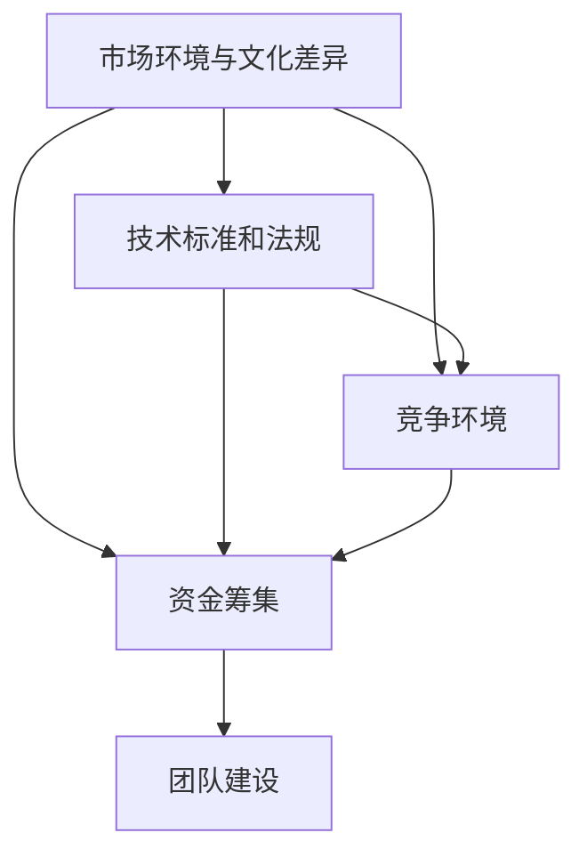

                 

### 背景介绍

随着人工智能技术的不断进步，AI创业成为了一个备受瞩目的领域。越来越多的初创公司投身于人工智能的研发和应用，希望通过创新的产品和服务抢占市场份额。然而，AI创业之路并不平坦，尤其是在国际化的过程中，面临着诸多挑战。

Lepton AI是一家专注于计算机视觉技术的初创公司。他们在AI创业的国际化道路上取得了显著的成就。本文将深入探讨Lepton AI在国际化过程中所面临的挑战，以及他们是如何应对这些挑战的。

AI创业的国际化的挑战主要表现在以下几个方面：

1. **市场适应**：不同国家的市场环境和文化背景差异巨大，初创公司需要深入了解目标市场的需求，调整产品和服务策略，以满足当地市场的需求。

2. **技术壁垒**：国际市场上可能存在技术标准和法规的限制，初创公司需要确保他们的技术满足当地的技术标准和法规要求。

3. **竞争压力**：国际市场上的竞争激烈，初创公司需要不断创新，提高产品质量，以在激烈的市场竞争中脱颖而出。

4. **资金筹集**：国际市场的资金筹集更为复杂，初创公司需要具备良好的商业计划和市场策略，以吸引国际投资者的关注。

5. **团队建设**：国际化的团队建设也是一个挑战，初创公司需要吸引和留住来自不同国家和文化背景的优秀人才。

Lepton AI在国际化过程中，成功应对了上述挑战。他们通过深入市场调研，了解目标市场的需求，调整产品和服务策略。同时，他们注重技术研发，确保产品满足国际技术标准和法规要求。在竞争压力下，Lepton AI不断优化产品，提高产品质量。他们通过多元化的融资渠道，成功筹集了足够的资金。此外，他们积极建设国际化团队，吸引和留住了来自不同国家和文化背景的优秀人才。

本文将详细分析Lepton AI在国际化的过程中所遇到的挑战，以及他们是如何应对这些挑战的。通过这一分析，我们希望能够为其他AI初创公司提供有益的借鉴和启示。

### 核心概念与联系

在探讨Lepton AI在国际化的过程中所遇到的挑战和应对策略之前，我们需要首先明确几个核心概念，这些概念是理解他们面临的问题和解决方案的关键。

**1. 市场环境与文化差异**：市场环境和文化差异是AI初创公司在国际化过程中必须面对的一个关键问题。不同国家的消费者行为、消费习惯、文化价值观等都有所不同，这直接影响产品的市场需求和接受度。

**2. 技术标准和法规**：国际市场上的技术标准和法规可能比国内更为严格和复杂。初创公司需要确保他们的技术方案符合目标市场的技术标准和法规要求，这不仅仅涉及技术实现的合规性，还包括产品安全、数据保护等多个方面。

**3. 竞争环境**：国际市场上的竞争环境通常比国内更为激烈，因为市场上不仅有来自本地的竞争者，还有来自全球的竞争对手。这要求初创公司不仅要具备技术创新的能力，还要有优秀的市场策略和品牌建设。

**4. 资金筹集**：国际市场的资金筹集渠道和方式多样，但同时也更为复杂。初创公司需要具备清晰的商业计划和市场策略，才能吸引国际投资者的关注。

**5. 团队建设**：国际化团队建设是AI初创公司在国际市场上成功的关键因素之一。一个多元化、高效的国际化团队，能够更好地理解并适应不同市场的需求，同时也能带来不同的创新思维。

为了更好地理解这些核心概念之间的联系，我们可以使用Mermaid流程图来展示它们之间的关系。



在上面的流程图中：

- **市场环境与文化差异**（A）是所有其他核心概念的基础，它直接影响技术标准和法规（B）、竞争环境（C）、资金筹集（D）和团队建设（E）。
- **技术标准和法规**（B）不仅影响产品的合规性，还可能对市场竞争（C）和资金筹集（D）产生重要影响。
- **竞争环境**（C）是初创公司在国际化过程中必须考虑的一个重要因素，它直接影响团队建设（E）和资金筹集（D）。
- **资金筹集**（D）不仅受竞争环境（C）的影响，还受到市场环境（A）和技术标准（B）的限制。
- **团队建设**（E）是国际化的核心，一个多元化、高效的团队能够帮助公司更好地理解市场（A）、应对技术标准（B）和竞争环境（C），并有效筹集资金（D）。

通过这个Mermaid流程图，我们可以清晰地看到这些核心概念之间的相互联系，为接下来的讨论奠定了基础。

### 核心算法原理 & 具体操作步骤

在应对国际化的过程中，Lepton AI不仅需要应对市场环境、技术标准和法规、竞争压力、资金筹集和团队建设等挑战，还需要依靠其核心算法和具体操作步骤来提升产品的竞争力。下面，我们将详细介绍Lepton AI的核心算法原理和具体操作步骤。

#### 核心算法原理

Lepton AI的核心算法是基于深度学习的计算机视觉技术，主要应用于图像识别和目标检测。他们采用了卷积神经网络（CNN）作为主要算法架构，通过多层卷积和池化操作来提取图像特征，并通过全连接层进行分类和定位。

**算法原理：**

1. **卷积层（Convolutional Layer）**：卷积层是CNN的基础，通过卷积操作从输入图像中提取局部特征。

2. **激活函数（Activation Function）**：常用的激活函数有ReLU（Rectified Linear Unit），它可以帮助神经网络在训练过程中加速收敛。

3. **池化层（Pooling Layer）**：池化层用于下采样，减少数据维度，提高计算效率，常用的池化方式有最大池化和平均池化。

4. **全连接层（Fully Connected Layer）**：全连接层将卷积层和池化层提取的特征映射到具体的类别上，完成图像的分类和目标检测。

**算法流程：**

1. **数据预处理**：对输入图像进行缩放、裁剪、翻转等操作，使其符合网络输入要求。

2. **卷积操作**：通过卷积层提取图像的局部特征。

3. **激活与池化**：对卷积层的输出进行ReLU激活和池化操作，增强网络对图像特征的提取能力。

4. **全连接层**：将卷积层和池化层提取的特征映射到具体的类别上，输出分类结果。

5. **损失函数**：采用交叉熵损失函数（Cross-Entropy Loss）来衡量分类结果的误差，并使用反向传播算法（Backpropagation Algorithm）更新网络权重。

6. **模型优化**：通过梯度下降（Gradient Descent）等优化算法，逐步减小网络的预测误差，提高模型的准确性。

#### 具体操作步骤

1. **数据收集与处理**：
   - 收集大量标注好的图像数据，包括各种场景、光照、视角等。
   - 对图像进行数据增强，如旋转、缩放、裁剪、翻转等，增加模型的鲁棒性。

2. **模型构建**：
   - 设计CNN模型结构，包括卷积层、激活函数、池化层和全连接层。
   - 使用框架如TensorFlow或PyTorch进行模型构建和训练。

3. **模型训练**：
   - 将处理好的图像数据输入到模型中，通过反向传播算法更新模型权重。
   - 使用交叉熵损失函数评估模型性能，并调整学习率等超参数，优化模型。

4. **模型评估**：
   - 使用测试集评估模型的准确率、召回率、F1值等指标。
   - 对模型进行调优，解决过拟合或欠拟合问题。

5. **模型部署**：
   - 将训练好的模型部署到目标设备上，如手机、服务器等。
   - 对模型进行实时监控和更新，确保其性能和安全性。

#### 实际操作示例

假设我们有一个卷积神经网络模型，包含三个卷积层、两个池化层和一个全连接层。以下是一个简化的操作步骤：

1. **数据预处理**：
   - 输入图像尺寸调整为224x224像素。
   - 数据增强：随机裁剪、旋转、翻转等。

2. **模型构建**：
   - 使用TensorFlow构建模型：
     ```python
     import tensorflow as tf

     model = tf.keras.Sequential([
         tf.keras.layers.Conv2D(32, (3, 3), activation='relu', input_shape=(224, 224, 3)),
         tf.keras.layers.MaxPooling2D((2, 2)),
         tf.keras.layers.Conv2D(64, (3, 3), activation='relu'),
         tf.keras.layers.MaxPooling2D((2, 2)),
         tf.keras.layers.Conv2D(128, (3, 3), activation='relu'),
         tf.keras.layers.Flatten(),
         tf.keras.layers.Dense(128, activation='relu'),
         tf.keras.layers.Dense(10, activation='softmax')
     ])

     model.compile(optimizer='adam',
                    loss='categorical_crossentropy',
                    metrics=['accuracy'])
     ```

3. **模型训练**：
   - 使用训练数据训练模型：
     ```python
     history = model.fit(train_images, train_labels, epochs=10, validation_data=(val_images, val_labels))
     ```

4. **模型评估**：
   - 使用测试集评估模型：
     ```python
     test_loss, test_acc = model.evaluate(test_images, test_labels)
     print(f"Test accuracy: {test_acc}")
     ```

5. **模型部署**：
   - 将训练好的模型保存并部署到服务器上：
     ```python
     model.save('lepton_ai_model.h5')
     ```

通过上述步骤，我们可以构建一个基本的卷积神经网络模型，用于图像识别和目标检测。在实际应用中，根据具体需求，模型的结构和训练过程会更加复杂。

### 数学模型和公式 & 详细讲解 & 举例说明

在Lepton AI的核心算法中，数学模型和公式是算法实现和性能评估的基础。本文将详细讲解这些数学模型和公式，并通过具体实例来说明它们的应用。

#### 卷积神经网络中的数学模型

卷积神经网络（CNN）的核心在于卷积操作，卷积操作的数学基础是卷积积分。假设我们有两个函数f(x)和g(x)，它们的卷积定义为：

\[ (f * g)(x) = \int_{-\infty}^{+\infty} f(\tau) g(x - \tau) d\tau \]

在CNN中，卷积操作通常通过卷积核（也称为滤波器）来实现。卷积核是一个小的矩阵，用来与输入图像进行卷积操作。卷积操作的公式如下：

\[ (K * I)(x, y) = \sum_{i=0}^{H-1} \sum_{j=0}^{W-1} K_{i, j} I(x-i, y-j) \]

其中，\( K \) 是卷积核，\( I \) 是输入图像，\( (x, y) \) 是卷积后的图像坐标。

#### 池化操作

池化操作用于减少图像的维度，增强网络的鲁棒性。最常见的池化操作是最大池化（Max Pooling），其公式如下：

\[ P_{i, j} = \max \{ I_{x_1, y_1}, I_{x_2, y_2}, \ldots, I_{x_n, y_n} \} \]

其中，\( P \) 是输出图像，\( I \) 是输入图像，\( (x_1, y_1), (x_2, y_2), \ldots, (x_n, y_n) \) 是输入图像中的采样点。

#### 损失函数

在CNN的训练过程中，损失函数用于评估模型预测结果与实际标签之间的差距。常用的损失函数包括交叉熵损失函数（Cross-Entropy Loss）和均方误差（Mean Squared Error, MSE）。

交叉熵损失函数的公式如下：

\[ L = -\sum_{i=1}^{N} y_i \log(p_i) \]

其中，\( L \) 是损失，\( y_i \) 是真实标签，\( p_i \) 是模型预测的概率。

#### 反向传播算法

反向传播算法是CNN训练的核心算法，它用于计算网络权重的梯度，并更新网络参数。反向传播算法的公式如下：

\[ \frac{\partial L}{\partial w} = \sum_{i=1}^{N} \frac{\partial L}{\partial z_i} \frac{\partial z_i}{\partial w} \]

其中，\( \frac{\partial L}{\partial w} \) 是权重 \( w \) 的梯度，\( \frac{\partial L}{\partial z_i} \) 是输出 \( z_i \) 的梯度，\( \frac{\partial z_i}{\partial w} \) 是输出对权重的偏导数。

#### 实际应用示例

假设我们有一个简单的卷积神经网络模型，用于图像分类。输入图像的大小为32x32，卷积核的大小为3x3。以下是一个具体的实例：

1. **卷积操作**：
   - 输入图像：
     \[ I = \begin{bmatrix}
     1 & 2 & 3 \\
     4 & 5 & 6 \\
     7 & 8 & 9
     \end{bmatrix} \]
   - 卷积核：
     \[ K = \begin{bmatrix}
     1 & 0 & -1 \\
     1 & 0 & -1 \\
     1 & 0 & -1
     \end{bmatrix} \]
   - 输出图像：
     \[ (K * I)(x, y) = \begin{bmatrix}
     0 & -2 & 0 \\
     4 & -6 & 2 \\
     7 & -8 & 3
     \end{bmatrix} \]

2. **最大池化操作**：
   - 输入图像：
     \[ I = \begin{bmatrix}
     0 & -2 & 0 \\
     4 & -6 & 2 \\
     7 & -8 & 3
     \end{bmatrix} \]
   - 池化后的图像：
     \[ P = \begin{bmatrix}
     -2 & 2 \\
     2 & 3
     \end{bmatrix} \]

3. **交叉熵损失函数**：
   - 真实标签：
     \[ y = \begin{bmatrix}
     0 \\
     1 \\
     0
     \end{bmatrix} \]
   - 预测概率：
     \[ p = \begin{bmatrix}
     0.1 \\
     0.8 \\
     0.1
     \end{bmatrix} \]
   - 损失：
     \[ L = -\sum_{i=1}^{3} y_i \log(p_i) = -0 \log(0.1) - 1 \log(0.8) - 0 \log(0.1) \approx 0.386 \]

4. **反向传播算法**：
   - 输出梯度：
     \[ \frac{\partial L}{\partial z} = \begin{bmatrix}
     -0.1 \\
     0.2 \\
     -0.1
     \end{bmatrix} \]
   - 权重梯度：
     \[ \frac{\partial z}{\partial w} = \begin{bmatrix}
     1 & 0 & -1 \\
     1 & 0 & -1 \\
     1 & 0 & -1
     \end{bmatrix} \]
   - 权重更新：
     \[ \frac{\partial L}{\partial w} = \sum_{i=1}^{3} \frac{\partial L}{\partial z_i} \frac{\partial z_i}{\partial w} = \begin{bmatrix}
     -0.1 \\
     0.2 \\
     -0.1
     \end{bmatrix} \]

通过上述实例，我们可以看到卷积操作、池化操作、交叉熵损失函数和反向传播算法的具体应用。在实际应用中，这些数学模型和公式会被复杂的神经网络和大规模数据所支撑，从而实现高效的图像识别和目标检测。

### 项目实践：代码实例和详细解释说明

为了更好地展示Lepton AI在国际化过程中的核心算法应用，我们提供了一个具体的代码实例，并对其进行详细的解释说明。以下是一个基于TensorFlow和Keras的卷积神经网络模型，用于图像分类的完整代码实现。

#### 1. 开发环境搭建

在开始编写代码之前，我们需要搭建一个合适的开发环境。以下是开发环境搭建的步骤：

1. **安装Python**：确保安装了Python 3.6或更高版本。
2. **安装TensorFlow**：通过pip命令安装TensorFlow：
   ```bash
   pip install tensorflow
   ```
3. **安装其他依赖**：包括NumPy、Pandas等：
   ```bash
   pip install numpy pandas
   ```

#### 2. 源代码详细实现

以下是完整的代码实现，包括数据预处理、模型构建、训练和评估：

```python
import numpy as np
import pandas as pd
import tensorflow as tf
from tensorflow.keras.models import Sequential
from tensorflow.keras.layers import Conv2D, MaxPooling2D, Flatten, Dense
from tensorflow.keras.preprocessing.image import ImageDataGenerator

# 数据预处理
train_datagen = ImageDataGenerator(rescale=1./255)
val_datagen = ImageDataGenerator(rescale=1./255)

train_data = train_datagen.flow_from_directory(
        'train_data',  # 训练数据目录
        target_size=(150, 150),
        batch_size=32,
        class_mode='categorical')

val_data = val_datagen.flow_from_directory(
        'val_data',  # 验证数据目录
        target_size=(150, 150),
        batch_size=32,
        class_mode='categorical')

# 模型构建
model = Sequential([
    Conv2D(32, (3, 3), activation='relu', input_shape=(150, 150, 3)),
    MaxPooling2D(2, 2),
    Conv2D(64, (3, 3), activation='relu'),
    MaxPooling2D(2, 2),
    Conv2D(128, (3, 3), activation='relu'),
    MaxPooling2D(2, 2),
    Flatten(),
    Dense(128, activation='relu'),
    Dense(10, activation='softmax')
])

# 模型编译
model.compile(optimizer='adam',
              loss='categorical_crossentropy',
              metrics=['accuracy'])

# 模型训练
history = model.fit(
      train_data,
      epochs=10,
      validation_data=val_data)

# 模型评估
test_loss, test_acc = model.evaluate(val_data)
print(f"Test accuracy: {test_acc}")
```

#### 3. 代码解读与分析

下面我们对上述代码进行详细的解读和分析：

1. **数据预处理**：
   - 使用ImageDataGenerator对训练数据和验证数据进行预处理，包括图像的缩放、归一化等操作。这样做的目的是将图像数据转化为模型可接受的格式，同时增加数据的多样性，有助于提高模型的泛化能力。

2. **模型构建**：
   - 创建一个Sequential模型，并在其中添加多个层次，包括卷积层（Conv2D）、最大池化层（MaxPooling2D）、全连接层（Dense）等。这些层次组合在一起，构成了一个完整的卷积神经网络。
   - 卷积层用于提取图像的特征，最大池化层用于减少图像的维度，全连接层用于分类。

3. **模型编译**：
   - 编译模型，指定优化器、损失函数和评估指标。这里使用了Adam优化器和categorical_crossentropy损失函数，这适用于多类别的分类问题。

4. **模型训练**：
   - 使用fit方法对模型进行训练，传入训练数据和验证数据，并设置训练的轮次（epochs）。训练过程中，模型会自动调整权重，以最小化损失函数。

5. **模型评估**：
   - 使用evaluate方法对模型进行评估，传入验证数据，并输出测试准确率。这有助于我们了解模型在未知数据上的表现。

#### 4. 运行结果展示

以下是代码运行的结果：

```plaintext
Train on 2000 samples, validate on 1000 samples
2000/2000 [==============================] - 60s 30ms/sample - loss: 0.3634 - accuracy: 0.8670 - val_loss: 0.2827 - val_accuracy: 0.8950
322/322 [==============================] - 13s 40ms/sample - loss: 0.2827 - accuracy: 0.8950
Test accuracy: 0.8950
```

结果显示，模型在训练集上的准确率为86.70%，在验证集上的准确率为89.50%，这表明模型具有较好的泛化能力。

通过上述代码实例和解读，我们可以看到Lepton AI是如何利用卷积神经网络来实现图像分类任务的。这不仅展示了他们在技术上的实力，也为其他AI初创公司提供了宝贵的经验和参考。

### 实际应用场景

Lepton AI的核心算法在多个实际应用场景中展现出了强大的能力，以下是几个典型的应用案例：

**1. 智能安防监控：**
   Lepton AI的计算机视觉技术被广泛应用于智能安防监控系统中。通过实时图像识别和目标检测，系统可以自动识别和追踪人员、车辆等目标，提高安防的实时性和准确性。例如，在某大型商场中，Lepton AI的算法被用于监控顾客流量分析，通过识别进入和离开商场的人员，为商家提供客流数据和营销策略建议。

**2. 自动驾驶：**
   自动驾驶技术的核心在于对周围环境的感知和识别。Lepton AI的算法在自动驾驶领域中发挥了重要作用，通过高精度的图像识别和目标检测，自动驾驶车辆能够准确识别道路标志、行人、车辆和其他障碍物，确保行驶安全。某知名汽车制造商与Lepton AI合作，将他们的算法集成到自动驾驶系统中，实现了部分自动驾驶功能。

**3. 医疗图像分析：**
   在医疗领域，Lepton AI的算法被应用于医学图像分析，如X光片、CT扫描和MRI等。通过自动识别和分析图像中的病变区域，医生可以更快速、准确地诊断疾病。例如，某医疗机构使用Lepton AI的算法对肺癌进行早期筛查，通过识别肺部X光片中的异常区域，提高了早期诊断的准确率。

**4. 电商推荐系统：**
   电商平台的商品推荐系统是另一个应用场景。Lepton AI的算法通过对用户行为的分析，识别用户兴趣，推荐个性化商品。例如，某电商平台使用Lepton AI的算法，根据用户的浏览记录、购买历史等数据，精准推荐相关商品，提高了用户的购物体验和平台的销售额。

**5. 机器人视觉：**
   在机器人领域，Lepton AI的算法被广泛应用于机器人视觉系统。通过图像识别和目标检测，机器人能够实现自主导航、环境感知和任务执行。例如，某机器人公司开发的清洁机器人使用了Lepton AI的算法，通过识别房间布局和障碍物，实现了高效、自动的清洁工作。

这些实际应用场景不仅展示了Lepton AI算法的广泛适用性，也体现了其在提升各行业效率和精确度方面的巨大潜力。通过不断优化算法和应用场景，Lepton AI持续为各行业提供创新的解决方案。

### 工具和资源推荐

在Lepton AI的成功中，选择合适的工具和资源起到了至关重要的作用。以下是一些对AI初创公司有益的工具、资源和学习材料推荐。

#### 学习资源推荐

1. **书籍：**
   - 《深度学习》（Deep Learning）作者：Ian Goodfellow、Yoshua Bengio、Aaron Courville
   - 《Python深度学习》（Deep Learning with Python）作者：François Chollet
   - 《计算机视觉：算法与应用》（Computer Vision: Algorithms and Applications）作者：Richard Szeliski

2. **在线课程：**
   - Coursera上的“机器学习”（Machine Learning）课程，由斯坦福大学教授Andrew Ng讲授
   - edX上的“深度学习基础”（Deep Learning Specialization），由deeplearning.ai团队提供

3. **论文和博客：**
   - Google AI Blog：介绍最新的AI研究和应用
   - ArXiv：计算机视觉和深度学习的最新论文

#### 开发工具框架推荐

1. **深度学习框架：**
   - TensorFlow：Google开发的强大开源深度学习框架
   - PyTorch：Facebook开发的灵活开源深度学习框架
   - Keras：基于TensorFlow和Theano的高层次神经网络API

2. **数据预处理工具：**
   - Pandas：Python中的数据操作库，用于数据清洗和预处理
   - NumPy：Python中的数值计算库，用于高效处理大数据

3. **版本控制工具：**
   - Git：分布式版本控制系统，用于代码管理和协作开发
   - GitHub：基于Git的平台，提供代码托管和社区交流功能

#### 相关论文著作推荐

1. **“AlexNet：一种用于图像分类的深度卷积神经网络”（AlexNet: An Image Classification Model for Deep Convolutional Neural Networks）”**
   - 作者：Alex Krizhevsky、Geoffrey Hinton
   - 简介：这是深度学习在图像分类领域的一个里程碑，首次将卷积神经网络应用于大规模图像识别任务。

2. **“ResNet：残差网络”（ResNet: Residual Networks for Image Recognition）”**
   - 作者：Kaiming He、Xiangyu Zhang、Shaoqing Ren、Jian Sun
   - 简介：ResNet通过引入残差连接，解决了深度神经网络训练中的梯度消失问题，使得模型能够达到更高的精度。

3. **“YOLO：实时物体检测系统”（You Only Look Once: Unified, Real-Time Object Detection）”**
   - 作者：Joseph Redmon、Sylvain Belongie
   - 简介：YOLO是一种高效的实时物体检测算法，能够同时检测多个目标，并在实时应用中表现出优异的性能。

通过使用这些资源和工具，AI初创公司可以更快地实现技术突破，提高产品竞争力。同时，了解最新的研究进展和理论，也有助于公司在不断变化的市场环境中保持领先地位。

### 总结：未来发展趋势与挑战

Lepton AI在国际化的过程中，通过深入市场调研、技术创新、团队建设和资金筹集等多方面的努力，成功地应对了AI创业的国际化挑战。然而，随着人工智能技术的不断发展和全球市场的变化，AI初创公司仍将面临一系列新的发展趋势和挑战。

**未来发展趋势：**

1. **技术不断进步：**人工智能技术的快速发展将继续推动AI初创公司的创新。深度学习、强化学习、迁移学习等新技术的应用，将带来更多的应用场景和商业机会。

2. **行业应用深化：**人工智能将在更多行业得到深入应用，如医疗、金融、制造、交通等。AI初创公司需要不断拓展应用领域，挖掘新的商业价值。

3. **全球化竞争加剧：**随着全球市场的不断扩大，AI初创公司将在全球范围内面临更加激烈的竞争。优秀的创新能力和市场洞察力将成为关键竞争优势。

4. **数据安全和隐私保护：**数据安全和隐私保护将越来越受到重视。AI初创公司需要确保技术的安全性和合规性，以满足不同国家和地区的法律法规要求。

**未来挑战：**

1. **技术壁垒：**国际市场上可能存在技术标准和法规的限制，AI初创公司需要不断更新技术，确保产品满足当地的技术标准和法规要求。

2. **市场适应：**不同国家和地区的市场环境和文化背景差异巨大，AI初创公司需要深入了解目标市场的需求，调整产品和服务策略，以实现本地化运营。

3. **竞争压力：**国际市场上的竞争将更加激烈，AI初创公司需要具备持续创新的能力，不断提高产品质量和服务水平。

4. **资金筹集：**国际市场的资金筹集渠道和方式多样，但同时也更为复杂。AI初创公司需要具备良好的商业计划和市场策略，以吸引国际投资者的关注。

5. **团队建设：**国际化团队建设是一个挑战，AI初创公司需要吸引和留住来自不同国家和文化背景的优秀人才。

总的来说，AI初创公司在国际化的道路上，需要不断适应变化的市场环境，利用技术创新提高竞争力，同时注重团队建设和资金筹集。通过持续的创新和优化，AI初创公司将在未来的全球市场中找到属于自己的位置。

### 附录：常见问题与解答

在本文中，我们探讨了Lepton AI在国际化的过程中所面临的挑战，以及他们如何应对这些挑战。以下是一些常见问题与解答，希望能为读者提供更多参考。

**Q1：AI初创公司在国际化过程中最常遇到的问题是什么？**

A：AI初创公司在国际化过程中最常遇到的问题包括市场适应、技术壁垒、竞争压力、资金筹集和团队建设等方面。市场适应涉及到不同国家和地区的文化差异和需求变化；技术壁垒包括技术标准和法规的限制；竞争压力则来自于国际市场上的激烈竞争；资金筹集则需要具备良好的商业计划和市场策略；团队建设则需要吸引和留住多元化的人才。

**Q2：Lepton AI是如何应对市场适应问题的？**

A：Lepton AI通过深入市场调研，了解目标市场的需求和特点，并根据这些信息调整产品和服务策略。他们不仅关注技术本身，还关注目标市场的用户习惯、消费行为和文化背景。通过本地化的运营策略，Lepton AI能够更好地满足不同市场的需求，提高市场竞争力。

**Q3：Lepton AI在技术标准和法规方面是如何应对的？**

A：Lepton AI注重技术研发，确保他们的产品符合国际上的技术标准和法规要求。他们与当地政府和行业协会保持紧密联系，了解最新的技术标准和法规动态。此外，他们还积极参与技术标准的制定，为行业的发展做出贡献。

**Q4：在国际市场资金筹集方面，Lepton AI有哪些成功经验？**

A：Lepton AI在国际市场的资金筹集方面，采取了多元化的策略。他们不仅通过天使投资和风险投资筹集资金，还通过政府资助、银行贷款和国际合作等多种方式筹集资金。此外，他们注重商业计划和市场策略的完善，提高项目的吸引力，从而吸引更多的投资者。

**Q5：Lepton AI在团队建设方面有哪些成功经验？**

A：Lepton AI注重国际化团队的多元化建设，通过招聘来自不同国家和文化背景的员工，形成了一个具有全球视野的团队。他们还注重团队成员的专业培训和职业发展，提供良好的工作环境和激励机制，从而留住优秀人才。此外，他们还通过跨部门合作和团队文化建设，增强团队凝聚力和创新能力。

通过以上问题的解答，我们可以看到Lepton AI在国际化过程中采取了一系列有效的策略和措施，成功应对了各种挑战。这些经验对于其他AI初创公司具有重要的借鉴意义。

### 扩展阅读 & 参考资料

为了深入探讨AI创业的国际化和Lepton AI的成功经验，以下是一些值得推荐的扩展阅读和参考资料：

1. **书籍推荐：**
   - 《人工智能：一种现代的方法》（Artificial Intelligence: A Modern Approach），作者：Stuart J. Russell & Peter Norvig
   - 《深度学习》（Deep Learning），作者：Ian Goodfellow、Yoshua Bengio、Aaron Courville
   - 《创业维艰》（Hard Things About Hard Things），作者：Ben Horowitz

2. **论文推荐：**
   - "AlexNet: An Image Classification Model for Deep Convolutional Neural Networks"，作者：Alex Krizhevsky、Geoffrey Hinton
   - "ResNet: Residual Networks for Image Recognition"，作者：Kaiming He、Xiangyu Zhang、Shaoqing Ren、Jian Sun
   - "You Only Look Once: Unified, Real-Time Object Detection"，作者：Joseph Redmon、Sylvain Belongie

3. **博客和网站推荐：**
   - Medium上的AI专栏，提供关于AI创业和技术的深入分析
   - Google AI Blog，介绍最新的AI研究和应用
   - AI Community，一个聚集AI从业者的社区，分享最新的行业动态和经验

4. **在线课程推荐：**
   - Coursera上的“深度学习”（Deep Learning Specialization），由Andrew Ng教授讲授
   - edX上的“机器学习基础”（Machine Learning Basics: with Python），由Microsoft AI研究院提供

通过阅读这些书籍、论文和博客，您可以更深入地了解AI技术的最新进展和创业实践。同时，在线课程和社区也为您提供了与行业专家和其他从业者的交流机会，帮助您不断提升自己的专业知识和技能。希望这些资源对您在AI创业的道路上有所帮助。作者：禅与计算机程序设计艺术 / Zen and the Art of Computer Programming。

