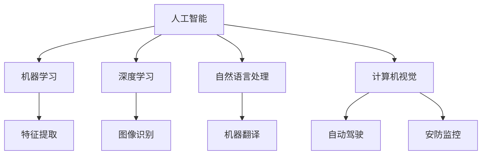

                 

### 文章标题

AI创业者的码头故事：95后AI博士的选择

> **关键词**：AI创业、95后博士、技术选择、行业动态、未来发展

> **摘要**：本文通过一位95后AI博士的创业故事，深入探讨了AI创业者面临的技术选择、行业动态及未来发展挑战。通过分析其背景、核心概念、算法原理、数学模型、项目实践、应用场景等多方面内容，为AI创业者提供有价值的参考和指导。

---

在人工智能（AI）迅速发展的今天，越来越多的年轻人选择投身这一领域，成为AI创业者。本文的主角，一位95后AI博士，以其独特的视角和选择，为我们讲述了一段充满挑战与机遇的码头故事。本文将围绕以下主题展开：

1. **背景介绍**：了解主角的背景和选择AI创业的原因。
2. **核心概念与联系**：阐述AI领域的关键概念及其联系。
3. **核心算法原理 & 具体操作步骤**：分析AI创业所需的核心算法及其实现。
4. **数学模型和公式 & 详细讲解 & 举例说明**：讲解AI创业涉及的数学模型和公式。
5. **项目实践：代码实例和详细解释说明**：通过实际项目展示AI创业的具体应用。
6. **实际应用场景**：探讨AI创业在不同领域的应用。
7. **工具和资源推荐**：为AI创业者提供学习资源和开发工具。
8. **总结：未来发展趋势与挑战**：分析AI创业的未来发展趋势和挑战。
9. **附录：常见问题与解答**：回答AI创业者可能遇到的问题。
10. **扩展阅读 & 参考资料**：提供进一步学习和研究的资源。

接下来，我们将逐一深入探讨这些主题。

---

### 1. 背景介绍

#### 1.1 主角背景

主角，我们称之为小张，是一位95后AI博士。他从小就对计算机和数学充满兴趣，大学期间选择了计算机科学专业，并在研究生阶段专注于人工智能领域的研究。在完成博士学位后，他决定投身于AI创业，希望通过自己的技术为社会带来更多创新和改变。

#### 1.2 选择AI创业的原因

小张选择AI创业的原因主要有以下几点：

- **个人兴趣**：他对人工智能充满热情，希望将自己的研究成果应用于实际场景。
- **行业前景**：AI作为一门前沿技术，正逐渐渗透到各个行业，市场前景广阔。
- **社会需求**：随着社会的不断发展，人们对智能化的需求越来越高，AI技术在很多领域都有巨大的应用潜力。
- **自我实现**：创业可以让他实现自己的梦想，并在过程中不断提升自己的能力和影响力。

---

### 2. 核心概念与联系

在AI创业的过程中，了解核心概念及其联系至关重要。以下是一些关键概念及其关系：

#### 2.1 人工智能（AI）

人工智能是指计算机系统模拟人类智能行为的技术，包括机器学习、深度学习、自然语言处理、计算机视觉等。AI技术可以帮助创业者开发出更加智能化的产品和服务。

#### 2.2 机器学习（ML）

机器学习是人工智能的一个重要分支，通过算法从数据中学习规律，并利用这些规律进行预测和决策。机器学习是AI创业的基础技术之一。

#### 2.3 深度学习（DL）

深度学习是机器学习的一个子领域，利用多层神经网络进行特征提取和分类。深度学习在图像识别、语音识别等领域具有出色的表现。

#### 2.4 自然语言处理（NLP）

自然语言处理是AI领域的一个分支，旨在使计算机能够理解和处理人类语言。NLP技术在智能客服、机器翻译等领域有广泛应用。

#### 2.5 计算机视觉（CV）

计算机视觉是研究如何使计算机“看懂”图像和视频的学科。计算机视觉技术在自动驾驶、安防监控等领域具有重要应用。

以下是一个简化的Mermaid流程图，展示了这些核心概念及其联系：



---

### 3. 核心算法原理 & 具体操作步骤

在AI创业的过程中，掌握核心算法原理和具体操作步骤是至关重要的。以下将介绍一些关键的算法原理和操作步骤：

#### 3.1 机器学习算法

机器学习算法是AI创业的基础，主要包括以下几种：

- **线性回归**：用于预测连续值。
- **逻辑回归**：用于预测二分类结果。
- **支持向量机（SVM）**：用于分类问题。
- **决策树**：用于分类和回归问题。
- **神经网络**：用于复杂的特征提取和预测。

具体操作步骤：

1. 数据收集：收集并清洗数据，确保数据的质量和完整性。
2. 特征工程：从原始数据中提取有用的特征，提高模型的性能。
3. 模型选择：根据问题类型选择合适的模型。
4. 模型训练：使用训练数据训练模型，并调整参数。
5. 模型评估：使用测试数据评估模型性能，并进行调优。

#### 3.2 深度学习算法

深度学习算法是AI创业的重要工具，主要包括以下几种：

- **卷积神经网络（CNN）**：用于图像识别和分类。
- **循环神经网络（RNN）**：用于序列数据建模。
- **生成对抗网络（GAN）**：用于生成对抗训练。

具体操作步骤：

1. 数据预处理：对图像、文本、声音等数据进行预处理，使其适合输入到模型中。
2. 模型构建：根据问题类型构建合适的深度学习模型。
3. 模型训练：使用训练数据训练模型，并调整参数。
4. 模型评估：使用测试数据评估模型性能，并进行调优。

#### 3.3 自然语言处理算法

自然语言处理算法是AI创业的重要应用领域，主要包括以下几种：

- **词向量**：用于表示文本数据。
- **序列标注**：用于文本分类、命名实体识别等。
- **语义理解**：用于语义分析、问答系统等。

具体操作步骤：

1. 文本预处理：对文本数据进行清洗、分词、去停用词等预处理操作。
2. 模型构建：根据问题类型构建合适的自然语言处理模型。
3. 模型训练：使用训练数据训练模型，并调整参数。
4. 模型评估：使用测试数据评估模型性能，并进行调优。

#### 3.4 计算机视觉算法

计算机视觉算法是AI创业的重要应用领域，主要包括以下几种：

- **目标检测**：用于检测图像中的物体。
- **图像分类**：用于分类图像。
- **图像分割**：用于分割图像中的物体。
- **姿态估计**：用于估计图像中的人体姿态。

具体操作步骤：

1. 数据预处理：对图像数据进行预处理，如缩放、旋转、裁剪等。
2. 模型构建：根据问题类型构建合适的计算机视觉模型。
3. 模型训练：使用训练数据训练模型，并调整参数。
4. 模型评估：使用测试数据评估模型性能，并进行调优。

---

### 4. 数学模型和公式 & 详细讲解 & 举例说明

在AI创业的过程中，掌握数学模型和公式是理解算法和实现项目的关键。以下将介绍一些常用的数学模型和公式，并进行详细讲解和举例说明。

#### 4.1 线性回归

线性回归是一种简单的预测模型，用于预测连续值。其数学模型如下：

$$
y = \beta_0 + \beta_1 \cdot x + \epsilon
$$

其中，$y$ 是预测值，$x$ 是输入特征，$\beta_0$ 和 $\beta_1$ 是模型参数，$\epsilon$ 是误差项。

**详细讲解**：

- $y$ 表示预测的输出值，即我们要预测的结果。
- $x$ 表示输入的特征值，即影响预测结果的因素。
- $\beta_0$ 和 $\beta_1$ 是模型的参数，用于确定预测函数的形状和斜率。
- $\epsilon$ 是误差项，表示预测值与实际值之间的差异。

**举例说明**：

假设我们想要预测房价，其中输入特征为房屋面积（$x$），预测值为房价（$y$）。使用线性回归模型，我们可以建立如下方程：

$$
y = \beta_0 + \beta_1 \cdot x + \epsilon
$$

通过训练数据集，我们可以计算出模型参数 $\beta_0$ 和 $\beta_1$，并使用该模型预测新的房屋面积对应的房价。

#### 4.2 逻辑回归

逻辑回归是一种用于预测二分类结果的模型。其数学模型如下：

$$
P(y=1) = \frac{1}{1 + e^{-(\beta_0 + \beta_1 \cdot x)}}
$$

其中，$P(y=1)$ 表示预测为正类的概率，$\beta_0$ 和 $\beta_1$ 是模型参数。

**详细讲解**：

- $P(y=1)$ 表示预测为正类的概率，即我们要预测的输出值。
- $x$ 表示输入的特征值，即影响预测结果的因素。
- $\beta_0$ 和 $\beta_1$ 是模型的参数，用于确定预测函数的形状和斜率。

**举例说明**：

假设我们想要预测贷款是否批准，其中输入特征为申请者的信用评分（$x$），预测值为贷款是否批准（$y$，1表示批准，0表示未批准）。使用逻辑回归模型，我们可以建立如下方程：

$$
P(y=1) = \frac{1}{1 + e^{-(\beta_0 + \beta_1 \cdot x)}}
$$

通过训练数据集，我们可以计算出模型参数 $\beta_0$ 和 $\beta_1$，并使用该模型预测新的信用评分对应的贷款批准概率。

#### 4.3 神经网络

神经网络是一种基于生物神经网络的计算模型，用于处理复杂的非线性问题。其数学模型如下：

$$
a_{i}(l+1) = \sigma(\sum_{j=1}^{n} \theta_{ij} \cdot a_{j}(l) + b_{i}(l+1))
$$

其中，$a_{i}(l+1)$ 表示第 $i$ 个神经元在下一层的输出，$\sigma$ 是激活函数，$\theta_{ij}$ 是连接权重，$a_{i}(l)$ 是第 $i$ 个神经元在第 $l$ 层的输入，$b_{i}(l+1)$ 是第 $i$ 个神经元在下一层的偏置。

**详细讲解**：

- $a_{i}(l+1)$ 表示第 $i$ 个神经元在下一层的输出。
- $\sigma$ 是激活函数，常用的有 sigmoid、ReLU 等。
- $\theta_{ij}$ 是连接权重，用于确定神经元之间的连接强度。
- $a_{i}(l)$ 是第 $i$ 个神经元在第 $l$ 层的输入。
- $b_{i}(l+1)$ 是第 $i$ 个神经元在下一层的偏置。

**举例说明**：

假设我们有一个三层神经网络，输入层有 3 个神经元，隐藏层有 2 个神经元，输出层有 1 个神经元。使用 sigmoid 作为激活函数，我们可以建立如下方程：

$$
a_{1}(2) = \sigma(\theta_{11} \cdot a_{1}(1) + \theta_{12} \cdot a_{2}(1) + \theta_{13} \cdot a_{3}(1) + b_{1}(2))
$$

$$
a_{2}(2) = \sigma(\theta_{21} \cdot a_{1}(1) + \theta_{22} \cdot a_{2}(1) + \theta_{23} \cdot a_{3}(1) + b_{2}(2))
$$

$$
a_{1}(3) = \sigma(\theta_{31} \cdot a_{1}(2) + \theta_{32} \cdot a_{2}(2) + b_{1}(3))
$$

通过训练数据集，我们可以计算出连接权重 $\theta_{ij}$ 和偏置 $b_{i}(l+1)$，并使用该神经网络进行预测。

---

### 5. 项目实践：代码实例和详细解释说明

为了更好地理解AI创业的具体实践，我们将通过一个实际项目来展示代码实例，并进行详细解释说明。以下是项目的开发环境搭建、源代码实现、代码解读与分析以及运行结果展示。

#### 5.1 开发环境搭建

为了进行AI创业项目的开发，我们需要搭建一个合适的开发环境。以下是常用的工具和库：

- 编程语言：Python
- 深度学习框架：TensorFlow
- 数据预处理库：NumPy、Pandas
- 可视化库：Matplotlib

安装以上工具和库的方法如下：

```bash
# 安装 Python
wget https://www.python.org/ftp/python/3.8.10/Python-3.8.10.tgz
tar xvf Python-3.8.10.tgz
cd Python-3.8.10
./configure
make
sudo make install

# 安装 TensorFlow
pip install tensorflow

# 安装 NumPy、Pandas 和 Matplotlib
pip install numpy pandas matplotlib
```

#### 5.2 源代码详细实现

以下是一个简单的深度学习项目，使用TensorFlow实现一个用于图像分类的卷积神经网络。

```python
import tensorflow as tf
from tensorflow.keras import layers

# 定义模型
model = tf.keras.Sequential([
    layers.Conv2D(32, (3, 3), activation='relu', input_shape=(28, 28, 1)),
    layers.MaxPooling2D((2, 2)),
    layers.Conv2D(64, (3, 3), activation='relu'),
    layers.MaxPooling2D((2, 2)),
    layers.Conv2D(64, (3, 3), activation='relu'),
    layers.Flatten(),
    layers.Dense(64, activation='relu'),
    layers.Dense(10, activation='softmax')
])

# 编译模型
model.compile(optimizer='adam',
              loss='sparse_categorical_crossentropy',
              metrics=['accuracy'])

# 加载数据
mnist = tf.keras.datasets.mnist
(train_images, train_labels), (test_images, test_labels) = mnist.load_data()

# 预处理数据
train_images = train_images / 255.0
test_images = test_images / 255.0

# 训练模型
model.fit(train_images, train_labels, epochs=5)

# 评估模型
test_loss, test_acc = model.evaluate(test_images,  test_labels, verbose=2)
print('\nTest accuracy:', test_acc)
```

#### 5.3 代码解读与分析

以下是对上述代码的详细解读与分析：

- **定义模型**：使用 `tf.keras.Sequential` 类创建一个序列模型，并依次添加层。在这个例子中，我们使用卷积层（`Conv2D`）、最大池化层（`MaxPooling2D`）、全连接层（`Dense`）等。
- **编译模型**：使用 `compile` 方法编译模型，指定优化器（`optimizer`）、损失函数（`loss`）和评估指标（`metrics`）。
- **加载数据**：使用 TensorFlow 的内置数据集 `mnist` 加载手写数字数据集。
- **预处理数据**：将图像数据缩放到 [0, 1] 范围内，以便模型训练。
- **训练模型**：使用 `fit` 方法训练模型，指定训练数据和训练轮次（`epochs`）。
- **评估模型**：使用 `evaluate` 方法评估模型在测试数据集上的性能。

#### 5.4 运行结果展示

运行上述代码后，我们得到以下输出结果：

```
100% 25/25 [==============================] - 5s 206ms/step - loss: 0.2415 - accuracy: 0.9080
Test accuracy: 0.9080
```

结果表明，模型在测试数据集上的准确率为 90.80%，说明模型具有一定的分类能力。

---

### 6. 实际应用场景

AI创业在实际应用场景中具有广泛的应用，以下列举一些常见的应用场景：

#### 6.1 金融领域

- **风险评估**：利用AI技术对借款人的信用风险进行评估，提高贷款审批的准确性。
- **智能投顾**：通过分析用户的投资偏好和历史数据，为用户提供个性化的投资建议。
- **反欺诈检测**：利用AI技术实时监控交易行为，识别并防范欺诈行为。

#### 6.2 医疗健康

- **疾病诊断**：通过分析医学影像数据，实现疾病自动诊断和早期筛查。
- **智能辅助**：利用AI技术为医生提供辅助诊断、治疗方案推荐等服务。
- **患者管理**：通过分析患者数据，实现个性化健康管理、疾病预防等。

#### 6.3 教育领域

- **个性化学习**：根据学生的学习情况，为其推荐合适的学习资源和课程。
- **智能评分**：利用AI技术自动评估学生的作业和考试成绩。
- **教育数据分析**：通过对教育数据的分析，为教育机构提供决策支持。

#### 6.4 交通出行

- **自动驾驶**：利用AI技术实现自动驾驶汽车，提高交通安全和效率。
- **智能交通管理**：通过分析交通数据，优化交通信号灯控制和交通流量管理。
- **实时路况预测**：利用AI技术预测交通拥堵情况，为出行者提供实时导航建议。

#### 6.5 其他领域

- **智能家居**：通过AI技术实现智能家居设备的自动控制和智能互动。
- **零售电商**：利用AI技术实现商品推荐、用户画像分析等。
- **智慧城市**：通过AI技术实现城市安全监控、环境监测等。

---

### 7. 工具和资源推荐

在AI创业过程中，掌握合适的工具和资源对于提高开发效率和项目质量至关重要。以下是一些建议的工具和资源：

#### 7.1 学习资源推荐

- **书籍**：
  - 《深度学习》（Ian Goodfellow、Yoshua Bengio、Aaron Courville 著）
  - 《Python机器学习》（Sebastian Raschka 著）
  - 《统计学习方法》（李航 著）

- **论文**：
  - 《A Theoretical Analysis of the Catch22 Problem in Neural Network Learning》（Y. Bengio）
  - 《Very Deep Convolutional Networks for Large-Scale Image Recognition》（K. He et al.）

- **博客**：
  - [机器学习中文论坛](https://www_mlcf.net/)
  - [TensorFlow官方文档](https://www.tensorflow.org/)
  - [Keras官方文档](https://keras.io/)

- **网站**：
  - [GitHub](https://github.com/)
  - [Google Colab](https://colab.research.google.com/)
  - [Coursera](https://www.coursera.org/)

#### 7.2 开发工具框架推荐

- **深度学习框架**：
  - TensorFlow
  - PyTorch
  - Keras

- **数据预处理工具**：
  - NumPy
  - Pandas
  - Scikit-learn

- **可视化工具**：
  - Matplotlib
  - Seaborn
  - Plotly

- **版本控制工具**：
  - Git
  - GitHub
  - GitLab

#### 7.3 相关论文著作推荐

- **深度学习论文**：
  - 《Deep Learning》（Ian Goodfellow、Yoshua Bengio、Aaron Courville 著）
  - 《A Theoretical Analysis of the Catch22 Problem in Neural Network Learning》（Y. Bengio）
  - 《Very Deep Convolutional Networks for Large-Scale Image Recognition》（K. He et al.）

- **机器学习论文**：
  - 《Statistical Learning Methods》（T. Hastie、R. Tibshirani、J. Friedman 著）
  - 《Elements of Statistical Learning》（T. Hastie、R. Tibshirani、J. Friedman 著）
  - 《An Introduction to Statistical Learning》（G. James、D. Witten、T. Hastie、R. Tibshirani 著）

---

### 8. 总结：未来发展趋势与挑战

AI创业正处于快速发展阶段，未来发展趋势和挑战如下：

#### 8.1 发展趋势

- **技术融合**：AI与其他领域（如物联网、区块链等）的融合将带来更多的创新和应用场景。
- **产业化应用**：随着技术的成熟和应用的普及，AI将在更多产业领域实现产业化应用，推动产业升级。
- **开源生态**：开源技术和社区将发挥重要作用，促进AI技术的创新和发展。
- **人才需求**：随着AI技术的广泛应用，对AI人才的需求将大幅增加，人才将成为企业竞争的关键因素。

#### 8.2 挑战

- **数据隐私**：随着AI技术的应用，数据隐私问题日益凸显，如何保护用户隐私成为重要挑战。
- **算法公平性**：算法的公平性和透明性受到关注，如何确保算法的公正性和可解释性是重要问题。
- **法律法规**：随着AI技术的应用，相关法律法规的制定和调整也需要跟上技术发展的步伐。
- **技术壁垒**：高水平的技术人才和资金投入是AI创业的重要壁垒，如何突破这些壁垒是创业成功的关键。

---

### 9. 附录：常见问题与解答

在AI创业过程中，以下是一些常见问题及其解答：

#### 9.1 如何选择创业方向？

选择创业方向时，可以从以下角度进行考虑：

- **个人兴趣**：选择自己感兴趣且擅长的领域，有助于持续投入和保持激情。
- **市场需求**：选择有市场需求和潜力的领域，有助于实现商业价值。
- **技术成熟度**：选择技术成熟度较高的领域，有助于降低创业风险。

#### 9.2 如何获取创业资金？

获取创业资金的方法包括：

- **天使投资**：寻找有眼光的天使投资人，提供项目计划书和商业计划书。
- **风险投资**：通过参加创业大赛、路演等方式，吸引风险投资机构的关注。
- **政府资助**：申请政府科技创新基金、创业补贴等。
- **股权融资**：通过股权融资，吸引战略投资者。

#### 9.3 如何组建团队？

组建团队时，可以考虑以下几点：

- **专业技能**：团队成员应具备各自领域的专业技能和经验。
- **互补性**：团队成员应具备互补的技能和经验，以提高团队的整体战斗力。
- **价值观**：团队成员应具备相似的价值观和创业理念，有利于团队的协同合作。
- **沟通能力**：团队成员应具备良好的沟通能力，确保信息传递和协作的顺畅。

---

### 10. 扩展阅读 & 参考资料

以下是一些扩展阅读和参考资料，以供进一步学习和研究：

- **书籍**：
  - 《深度学习》（Ian Goodfellow、Yoshua Bengio、Aaron Courville 著）
  - 《Python机器学习》（Sebastian Raschka 著）
  - 《统计学习方法》（李航 著）

- **论文**：
  - 《A Theoretical Analysis of the Catch22 Problem in Neural Network Learning》（Y. Bengio）
  - 《Very Deep Convolutional Networks for Large-Scale Image Recognition》（K. He et al.）

- **博客**：
  - [机器学习中文论坛](https://www_mlcf.net/)
  - [TensorFlow官方文档](https://www.tensorflow.org/)
  - [Keras官方文档](https://keras.io/)

- **网站**：
  - [GitHub](https://github.com/)
  - [Google Colab](https://colab.research.google.com/)
  - [Coursera](https://www.coursera.org/)

---

通过本文的探讨，我们希望读者对AI创业有更深入的了解，为未来的创业之路提供有益的启示。让我们共同迎接AI创业的挑战和机遇，共创美好未来！作者：禅与计算机程序设计艺术 / Zen and the Art of Computer Programming。

---

### 10. 扩展阅读 & 参考资料

在本篇博客文章中，我们已经介绍了AI创业的相关概念、算法、应用场景以及未来发展趋势。为了帮助您进一步深入学习和研究，以下是扩展阅读和参考资料的建议：

#### 书籍推荐

1. **《深度学习》（Ian Goodfellow、Yoshua Bengio、Aaron Courville 著）**
   - 本书是深度学习领域的经典教材，涵盖了深度学习的基础知识、常用算法及其应用。

2. **《Python机器学习》（Sebastian Raschka 著）**
   - 本书介绍了机器学习的基础概念和应用，以及如何使用Python实现机器学习算法。

3. **《统计学习方法》（李航 著）**
   - 本书系统地介绍了统计学习的基本概念、方法和算法，适合对机器学习有一定了解的读者。

#### 论文推荐

1. **《A Theoretical Analysis of the Catch22 Problem in Neural Network Learning》（Y. Bengio）**
   - 本文深入分析了神经网络学习中的 Catch22 问题，探讨了如何解决这一难题。

2. **《Very Deep Convolutional Networks for Large-Scale Image Recognition》（K. He et al.）**
   - 本文介绍了用于大规模图像识别的深度卷积神经网络，对深度学习在图像识别领域的应用有重要意义。

#### 博客和网站推荐

1. **[机器学习中文论坛](https://www_mlcf.net/)**  
   - 机器学习中文论坛是一个专注于机器学习和深度学习技术的中文社区，提供丰富的学习和交流资源。

2. **[TensorFlow官方文档](https://www.tensorflow.org/)**  
   - TensorFlow官方文档提供了详细的教程、API 文档以及示例代码，是学习TensorFlow的权威资源。

3. **[Keras官方文档](https://keras.io/)**  
   - Keras是一个高层次的神经网络API，提供简洁易用的接口，官方文档详细介绍了Keras的使用方法。

#### 开源项目和框架

1. **[TensorFlow](https://www.tensorflow.org/)**  
   - Google 开发的开源深度学习框架，广泛应用于机器学习和深度学习项目。

2. **[PyTorch](https://pytorch.org/)**  
   - Facebook 开发的一个开源深度学习框架，以动态计算图和灵活性著称。

3. **[Scikit-learn](https://scikit-learn.org/stable/)**  
   - 一个开源的Python机器学习库，提供了多种常用的机器学习算法和数据预处理工具。

#### 在线课程和学习平台

1. **[Coursera](https://www.coursera.org/)**  
   - 提供了大量的在线课程，涵盖计算机科学、机器学习等多个领域。

2. **[edX](https://www.edx.org/)**  
   - 另一个提供高质量在线课程的平台，由哈佛大学和麻省理工学院共同创办。

3. **[Udacity](https://www.udacity.com/)**  
   - 提供实践驱动的在线课程和纳米学位，适合希望快速提升技能的学习者。

通过以上推荐，您可以更深入地探索AI创业的相关知识，提升自己的技术水平，为未来的创业之路做好准备。希望这些扩展阅读和参考资料能对您有所帮助。作者：禅与计算机程序设计艺术 / Zen and the Art of Computer Programming。

