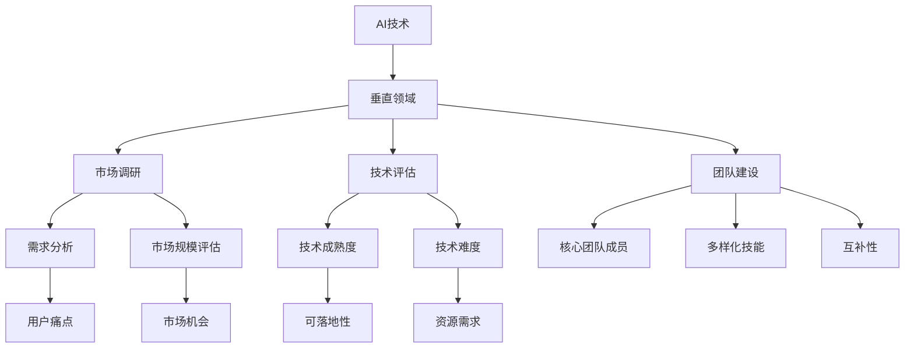

                 

### 背景介绍

> **“AI创业者的选择：垂直领域的无限可能”**

在当今快速发展的技术时代，人工智能（AI）已经成为了各个行业的驱动力。无论是医疗、金融、制造业还是教育，AI的应用都在不断拓展和深化。然而，对于众多AI创业者而言，如何在众多领域中找到合适的发展方向，成为了摆在他们面前的一大挑战。

AI创业的选择不仅仅是技术的选择，更是对行业未来趋势的预判。选择一个垂直领域，意味着需要对这个领域的现状、需求和发展趋势有深刻的理解。垂直领域的AI创业，不仅可以更精准地解决特定问题，还能在这个领域中获得更快的成长和更大的市场空间。

本文将深入探讨AI创业者如何选择垂直领域，以及这个选择背后的无限可能。我们将从以下几个方面进行论述：

1. **AI创业的现状与挑战**：分析当前AI创业的背景，以及创业者面临的种种挑战。
2. **垂直领域的优势**：详细阐述垂直领域在AI创业中的独特优势。
3. **选择垂直领域的方法论**：介绍如何通过市场调研、技术评估和团队建设等步骤，选择适合自己的垂直领域。
4. **成功案例分析**：通过具体案例，分析成功创业者是如何选择垂直领域并实现突破的。

### 当前AI创业的现状与挑战

AI创业的热潮已经持续了多年，越来越多的创业者投身其中，希望通过AI技术解决现实问题，推动产业升级和社会进步。然而，这个过程中，创业者也面临着一系列的挑战。

首先，技术门槛高是AI创业的一大难题。AI技术涉及到机器学习、深度学习、自然语言处理等多个领域，这些技术都需要创业者具备深厚的专业背景。对于许多非技术背景的创业者来说，掌握这些技术并非易事。

其次，数据获取和处理也是一大挑战。AI技术的发展依赖于大量高质量的数据，而数据的获取和处理需要耗费大量的时间和资源。特别是在一些垂直领域，数据资源相对匮乏，获取数据的难度更大。

再次，市场竞争激烈。随着AI技术的普及，越来越多的创业者进入这个领域，导致市场竞争日益激烈。如何在激烈的市场竞争中脱颖而出，成为了每一个AI创业者的必修课。

此外，政策法规的不确定性也给AI创业带来了一定的风险。不同国家和地区对AI技术的监管政策不尽相同，创业者需要关注这些政策变化，确保自己的业务合法合规。

总之，AI创业虽然充满了机遇，但同时也伴随着诸多挑战。创业者需要在技术、数据、市场和政策等多个方面进行全面考量，才能做出明智的决策。

### 垂直领域的优势

相比于广泛覆盖的横向领域，垂直领域的AI创业具有许多独特的优势。以下将详细阐述这些优势。

#### 精准定位

垂直领域的AI创业能够更精准地定位用户需求。在一个特定的领域，创业者可以深入了解用户的具体痛点，提供定制化的解决方案。这种精准定位不仅能够提高用户满意度，还能增强用户黏性。

#### 数据优势

垂直领域往往拥有相对集中和结构化的数据，这些数据对于AI算法的训练和优化至关重要。相比于广泛收集数据，垂直领域的创业者可以更加高效地利用数据资源，提升模型的性能。

#### 技术深度

在垂直领域，创业者可以将精力集中在特定技术的深耕上，而不是分散在多个技术方向。这种深度研究能够使创业者更快地掌握前沿技术，并在该领域形成核心竞争力。

#### 低竞争风险

相比于广泛的AI市场，垂直领域的竞争压力相对较小。由于垂直领域的市场细分，竞争者相对较少，创业者有更大的机会占据市场领先地位。

#### 快速回报

在垂直领域，创业者可以更快地看到成果。由于目标明确、资源集中，创业者可以迅速实现产品化和商业化，从而获得回报。

#### 社会影响力

垂直领域的AI创业往往能够解决一些特定的社会问题，对社会产生积极影响。例如，在医疗领域，AI可以帮助诊断疾病，提高治疗效果；在教育领域，AI可以个性化教学，提升学习效果。

#### 合作机会

在垂直领域，创业者更容易与其他领域的公司建立合作关系。这些合作不仅可以共享资源，还可以相互借鉴经验，共同推动整个行业的发展。

总之，垂直领域的AI创业具有精准定位、数据优势、技术深度、低竞争风险、快速回报、社会影响力和合作机会等多重优势。这些优势使得垂直领域成为AI创业者的重要选择。

### 选择垂直领域的方法论

选择一个合适的垂直领域对于AI创业者的成功至关重要。以下将详细阐述选择垂直领域的方法论，包括市场调研、技术评估和团队建设等关键步骤。

#### 市场调研

市场调研是选择垂直领域的第一步，也是至关重要的一步。创业者需要深入了解目标市场的现状、需求和趋势。

1. **目标市场定位**：明确自己的产品或服务面向的用户群体。这个群体可以是某个特定行业、职业或者地理位置。
   
2. **需求分析**：深入了解用户的具体需求，包括他们目前遇到的问题、期望的解决方案以及他们愿意为此支付的价格。
   
3. **市场规模和增长潜力**：评估目标市场的规模和增长潜力。一个有潜力的市场可以为创业者提供更大的发展空间。

4. **竞争分析**：分析现有竞争对手的产品、市场占有率、优势和劣势。这有助于创业者了解市场格局，找到切入点。

5. **客户访谈和调查**：通过访谈和调查，获取第一手用户反馈，进一步验证市场调研的结果。

#### 技术评估

在确定了目标市场后，创业者需要对所需技术进行详细评估。技术评估包括以下几个方面：

1. **技术成熟度**：评估所需技术是否已经成熟，是否具有可落地性。如果技术还在研发阶段，创业者需要考虑技术风险。

2. **技术难度**：评估所需技术的难度，是否超出了创业团队的现有能力。如果技术难度过高，创业者需要考虑是否需要外部合作或者引入技术人才。

3. **资源需求**：评估所需技术的资源需求，包括数据、计算资源和资金等。确保创业团队能够承担这些资源需求。

4. **可扩展性**：评估技术是否具有可扩展性，即是否能够支持业务规模的扩大。

5. **兼容性**：评估技术与其他系统的兼容性，以确保技术可以无缝集成到现有环境中。

#### 团队建设

一个优秀的团队是垂直领域AI创业成功的关键。以下是一些团队建设的要点：

1. **核心团队成员**：确保核心团队成员具备相关领域的专业背景和经验。团队成员应包括技术、产品、市场和运营等多个方面。

2. **多样化技能**：团队应具备多样化的技能，以确保能够应对各种挑战。

3. **互补性**：团队成员之间应具备互补性，能够在不同领域发挥各自的优势。

4. **沟通协作**：建立良好的沟通和协作机制，确保团队高效运作。

5. **持续学习和创新**：鼓励团队成员持续学习和创新，以保持团队的技术领先地位。

#### 其他考虑因素

除了市场调研、技术评估和团队建设外，创业者还需要考虑以下因素：

1. **政策法规**：关注目标市场的政策法规，确保业务合法合规。

2. **资金和资源**：评估创业所需的资金和资源，确保有足够的支持。

3. **行业趋势**：关注行业的发展趋势，确保所选垂直领域具有持续的发展潜力。

4. **风险控制**：制定风险控制措施，降低创业风险。

总之，选择垂直领域需要进行全面的市场调研、技术评估和团队建设，同时考虑其他相关因素。通过这些步骤，创业者可以更准确地选择适合自己的垂直领域，为未来的创业成功打下坚实的基础。

### 成功案例分析

在AI创业领域，有许多成功的企业案例，这些案例不仅展示了AI技术的巨大潜力，还揭示了选择垂直领域的明智决策。以下我们将通过几个具体的案例，分析成功创业者是如何选择垂直领域并实现突破的。

#### 案例一：Narrative Science

Narrative Science 是一家利用自然语言生成技术为企业和组织提供自动化报告和内容服务的公司。其创始人Christopher Barry选择垂直领域的智慧在于对金融和媒体行业的深刻理解。

**垂直领域选择**：Narrative Science选择了金融报告和体育新闻报道这两个垂直领域。这两个领域对大量文本生成有强烈需求，而传统的报告生成方式效率低下。

**市场机会**：在金融领域，银行和投资公司需要生成大量的财务报告和分析。在体育领域，媒体机构需要生成大量的比赛报告和新闻稿件。Narrative Science利用其自然语言生成技术，可以高效地满足这些需求。

**技术优势**：Narrative Science的技术核心在于自然语言处理（NLP）和机器学习。通过这些技术，公司能够自动生成高质量的文本，大大提高了报告和新闻的生成效率。

**成果**：Narrative Science在短短几年内获得了快速发展，客户包括多家大型金融机构和媒体公司。其产品也被广泛应用于企业内部报告和自动化内容生成。

#### 案例二：iCarbonX

iCarbonX 是一家专注于生命健康领域的AI创业公司，其创始人汪建在垂直领域的智慧体现在对生命科学和医疗健康的精准把握。

**垂直领域选择**：iCarbonX选择了生命健康这一垂直领域，具体包括基因组学、个性化医疗和健康管理等。

**市场机会**：随着基因组学技术的发展，越来越多的个人开始关注自己的基因信息。医疗健康领域对个性化医疗和健康管理的需求也越来越大。iCarbonX通过AI技术，可以为用户提供个性化的健康服务。

**技术优势**：iCarbonX的技术核心在于基因组数据分析、机器学习和大数据处理。通过这些技术，公司能够对海量基因数据进行深度分析，为用户提供个性化的健康建议。

**成果**：iCarbonX在基因组学和健康领域取得了显著成果，其产品被广泛应用于基因检测、健康管理和个性化医疗等领域。

#### 案例三：SenseTime

SenseTime 是一家专注于计算机视觉技术的AI公司，其创始人张茵在选择垂直领域的智慧上展示了高度的战略眼光。

**垂直领域选择**：SenseTime选择了计算机视觉这一垂直领域，具体包括人脸识别、图像识别和自动驾驶等。

**市场机会**：随着智能手机和自动驾驶技术的普及，计算机视觉技术在消费电子和自动驾驶领域有巨大的市场需求。SenseTime通过其领先的计算机视觉技术，可以为这些领域提供高效解决方案。

**技术优势**：SenseTime的技术核心在于深度学习和图像处理。通过这些技术，公司能够实现高精度的人脸识别和图像识别。

**成果**：SenseTime在计算机视觉领域取得了显著成果，其产品被广泛应用于智能手机、安防监控、自动驾驶等领域。公司也成为了全球计算机视觉领域的领军企业之一。

#### 案例四：Dextre Robotics

Dextre Robotics 是一家专注于医疗机器人的AI公司，其创始人Eric mieux选择了医疗领域这一垂直领域，展示了其对医疗行业深刻的理解。

**垂直领域选择**：Dextre Robotics选择了医疗机器人这一垂直领域，具体包括微创手术、康复治疗和健康监护等。

**市场机会**：随着人口老龄化趋势和医疗需求的增加，医疗机器人技术在手术、康复和监护等领域有巨大的市场潜力。Dextre Robotics通过其创新的医疗机器人技术，可以为医生提供更精准、更安全的手术工具。

**技术优势**：Dextre Robotics的技术核心在于机器人技术、机器学习和手术导航。通过这些技术，公司能够开发出能够协助医生进行复杂手术的机器人系统。

**成果**：Dextre Robotics在医疗机器人领域取得了显著成果，其产品已经被多家医疗机构采用，用于微创手术和康复治疗。

#### 案例五：Braina

Braina 是一家专注于智能语音助手的AI公司，其创始人Aditya Somaya在选择垂直领域的智慧上展现了其对智能家居和智能语音市场的敏锐洞察。

**垂直领域选择**：Braina选择了智能家居和智能语音助手这一垂直领域。

**市场机会**：随着智能家居的普及，人们对智能语音助手的需求越来越大。Braina通过其智能语音助手技术，可以为用户提供更加便捷的家居控制体验。

**技术优势**：Braina的技术核心在于自然语言处理（NLP）和语音识别。通过这些技术，公司能够开发出能够理解自然语言并执行用户指令的智能语音助手。

**成果**：Braina在智能语音助手领域取得了显著成果，其产品被广泛应用于智能家居、智能音箱和智能穿戴设备等领域。

### 成功因素总结

通过上述成功案例，我们可以总结出以下几个成功因素：

1. **精准的市场定位**：成功创业者能够深入了解目标市场的需求，并提供定制化的解决方案。
   
2. **技术深度**：成功创业者具备深厚的技术背景，能够在特定领域内形成核心竞争力。

3. **创新性**：成功创业者能够不断创新，推出具有差异化优势的产品。

4. **团队合作**：成功创业者拥有一支高效、协作的团队，能够在不同领域发挥各自的优势。

5. **灵活的商业模式**：成功创业者能够根据市场需求调整商业模式，实现快速成长。

6. **持续学习**：成功创业者保持持续学习的态度，不断更新知识和技能，以应对市场的变化。

通过这些成功因素，创业者可以在垂直领域实现突破，为AI创业注入新的活力。

### 实际应用场景

在AI创业领域，垂直领域的应用场景丰富多样，不同领域有着独特的技术需求和市场机会。以下我们将探讨几个典型的垂直领域应用场景，并分析这些场景中的具体需求和解决方案。

#### 1. 医疗保健

医疗保健是AI技术的重要应用领域，通过AI，可以实现智能诊断、个性化治疗和健康管理。

**需求分析**：

- **智能诊断**：医生需要在短时间内处理大量医疗数据，AI可以帮助医生快速、准确地诊断疾病。
- **个性化治疗**：不同患者的病情和治疗方案各不相同，AI可以通过分析大量病例数据，为医生提供个性化治疗方案。
- **健康管理**：长期健康管理需要收集和分析大量的健康数据，AI可以帮助用户实时监测健康状况，提供个性化的健康建议。

**解决方案**：

- **智能诊断系统**：利用深度学习和计算机视觉技术，AI系统可以分析医学影像，帮助医生快速、准确地诊断疾病。
- **个性化治疗平台**：基于大数据分析和机器学习算法，AI平台可以为医生提供个性化的治疗方案。
- **健康监护系统**：利用物联网和AI技术，AI系统可以实时监测用户的健康数据，如心率、血压等，并提供健康预警和建议。

**市场机会**：

随着人口老龄化和医疗需求的增加，医疗保健领域对AI技术的需求日益增长。此外，政策的支持和技术的发展也为医疗保健领域的AI应用提供了良好的发展环境。

#### 2. 金融科技

金融科技（FinTech）是另一个AI技术的重要应用领域，通过AI，可以实现智能风控、自动化交易和个性化金融服务。

**需求分析**：

- **智能风控**：金融机构需要实时监控交易风险，AI可以帮助金融机构快速识别异常交易和潜在风险。
- **自动化交易**：高频交易和量化交易对算法的依赖性很高，AI可以帮助提高交易效率和收益。
- **个性化金融服务**：不同的客户有不同的金融需求，AI可以通过分析客户数据，提供个性化的金融产品和服务。

**解决方案**：

- **智能风控系统**：利用机器学习和数据挖掘技术，AI系统可以实时分析交易数据，识别潜在风险。
- **自动化交易平台**：基于深度学习和算法优化，AI平台可以帮助金融机构进行自动化交易。
- **个性化金融服务平台**：利用大数据分析和推荐系统，AI平台可以为用户提供个性化的金融产品和服务。

**市场机会**：

金融科技领域对AI技术的需求不断增长，特别是在金融创新和风险控制方面。随着金融科技的不断进步，AI在金融领域的应用前景十分广阔。

#### 3. 教育科技

教育科技（EdTech）是AI技术的另一个重要应用领域，通过AI，可以实现智能教学、个性化学习和学生综合素质评估。

**需求分析**：

- **智能教学**：教师需要在课堂上进行个性化教学，AI可以帮助教师根据学生的不同情况进行因材施教。
- **个性化学习**：学生需要根据自身的学习进度和兴趣进行学习，AI可以帮助学生制定个性化的学习计划。
- **学生综合素质评估**：学校需要对学生进行全面评估，AI可以通过分析学生的学习数据和行为数据，提供更准确的评估结果。

**解决方案**：

- **智能教学系统**：利用自然语言处理和计算机视觉技术，AI系统可以帮助教师进行智能教学，提高教学效果。
- **个性化学习平台**：基于大数据分析和推荐系统，AI平台可以帮助学生制定个性化的学习计划。
- **学生综合素质评估系统**：利用数据挖掘和机器学习技术，AI系统可以为学生提供全面、准确的评估结果。

**市场机会**：

随着教育信息化和个性化教育的需求增长，教育科技领域的AI应用前景十分广阔。此外，政策的支持和技术的发展也为教育科技领域的AI应用提供了良好的发展环境。

#### 4. 制造业

制造业是AI技术的重要应用领域，通过AI，可以实现生产优化、设备维护和供应链管理。

**需求分析**：

- **生产优化**：制造业企业需要提高生产效率和降低成本，AI可以帮助企业优化生产流程。
- **设备维护**：制造业设备种类繁多，维护成本高，AI可以帮助企业预测设备故障，提前进行维护。
- **供应链管理**：制造业企业需要高效管理供应链，AI可以帮助企业优化供应链流程，降低库存成本。

**解决方案**：

- **生产优化系统**：利用机器学习和优化算法，AI系统可以帮助企业优化生产流程，提高生产效率。
- **设备维护系统**：利用物联网和机器学习技术，AI系统可以帮助企业预测设备故障，提前进行维护。
- **供应链管理系统**：利用大数据分析和智能决策技术，AI系统可以帮助企业优化供应链流程，降低库存成本。

**市场机会**：

随着智能制造和工业4.0的推进，制造业对AI技术的需求日益增长。此外，技术的进步和政策的支持也为制造业的AI应用提供了良好的发展环境。

#### 5. 城市管理

城市管理是AI技术的另一个重要应用领域，通过AI，可以实现智慧交通、智能安防和环保监测。

**需求分析**：

- **智慧交通**：城市交通管理需要实时监测和优化交通流量，AI可以帮助提高交通效率，减少拥堵。
- **智能安防**：城市安全需要实时监控和预警，AI可以帮助提高安防效率，防范犯罪。
- **环保监测**：城市环保需要实时监测空气质量、水质等环境数据，AI可以帮助提高环保监测的精度和效率。

**解决方案**：

- **智慧交通系统**：利用计算机视觉和机器学习技术，AI系统可以帮助城市进行交通流量监测和优化。
- **智能安防系统**：利用视频分析和大数据技术，AI系统可以帮助城市进行实时监控和预警。
- **环保监测系统**：利用传感器和机器学习技术，AI系统可以帮助城市实时监测环境数据，提供环保预警和建议。

**市场机会**：

随着城市化进程的加快和智慧城市建设的推进，城市管理对AI技术的需求日益增长。此外，政策的支持和技术的发展也为城市管理领域的AI应用提供了良好的发展环境。

通过上述实际应用场景的探讨，我们可以看到AI技术在各个垂直领域的应用潜力。创业者可以根据自身的技术优势和市场需求，选择适合自己的垂直领域，利用AI技术实现业务突破和持续增长。

### 工具和资源推荐

在AI创业领域，选择合适的工具和资源对于创业团队的成功至关重要。以下将介绍一些学习资源、开发工具和框架，以及相关的论文和著作，帮助创业者更好地掌握AI技术，加速创业进程。

#### 学习资源推荐

1. **书籍**：

   - **《深度学习》（Deep Learning）**：由Ian Goodfellow、Yoshua Bengio和Aaron Courville合著，是深度学习的经典教材，详细介绍了深度学习的理论基础和实现方法。

   - **《Python机器学习》（Python Machine Learning）**：由Sébastien Marrs和Fabian Pedregosa编著，适合初学者入门机器学习，涵盖了Python在机器学习领域的应用。

   - **《统计学习方法》（Statistical Learning Methods）**：由李航著，系统介绍了统计学习的基本理论和方法，适合对统计学习有较深入了解的读者。

2. **论文**：

   - **“A Theoretical Analysis of the Pooling Layer in Deep Convolutional Neural Networks”**：该论文由Xiaogang Xu和Kaiming He等学者发表，分析了深度卷积神经网络中池化层的理论特性。

   - **“Generative Adversarial Nets”**：由Ian Goodfellow等学者提出的生成对抗网络（GAN）是深度学习领域的一个重要突破，其论文详细介绍了GAN的原理和应用。

3. **博客和网站**：

   - **Medium上的AI博客**：Medium上有许多优秀的AI博客，如“AI”，可以提供最新的AI技术动态和案例分析。

   - **“机器之心”网站**：机器之心是一个关于机器学习和深度学习的中文技术社区，提供了大量的技术文章、课程资源和行业动态。

#### 开发工具和框架推荐

1. **编程语言**：

   - **Python**：Python因其简洁易用的特性，成为了AI开发的主要编程语言。许多AI库和框架都支持Python。

   - **R语言**：R语言在统计分析和数据可视化方面具有很强的优势，特别适合数据驱动的AI项目。

2. **机器学习库和框架**：

   - **TensorFlow**：由Google开源的深度学习框架，功能强大，支持多种深度学习模型。

   - **PyTorch**：由Facebook开源的深度学习框架，其动态计算图使其在研究和开发中更加灵活。

   - **Scikit-learn**：一个开源的Python机器学习库，提供了丰富的机器学习算法和数据预处理工具。

3. **开发工具**：

   - **Jupyter Notebook**：Jupyter Notebook是一个交互式的开发环境，适合数据分析和原型开发。

   - **Kaggle**：Kaggle是一个数据科学竞赛平台，提供了大量的数据集和比赛，可以帮助开发者提高技能和经验。

#### 相关论文和著作推荐

1. **《深度学习：全面介绍》**：作者：阿斯顿·张（Aston Zhang），这是一本全面介绍深度学习的教材，涵盖了深度学习的理论基础和实际应用。

2. **《强化学习》**：作者：理查德·萨顿（Richard S. Sutton）和安德鲁·巴肖（Andrew G. Barto），这是一本关于强化学习的经典著作，详细介绍了强化学习的基本理论和方法。

3. **《机器学习：概率视角》**：作者：科里·鲍威尔（Cory Perue）、亚历山大·J. Smola和布鲁斯·斯科特（Bruce P. Scott），这本书从概率论的角度介绍了机器学习的基本概念和算法。

通过这些学习和资源工具，创业者可以更好地掌握AI技术，提高开发效率，加速创业进程。同时，这些资源也可以为创业者提供丰富的理论支持和实践指导，帮助他们在垂直领域中取得成功。

### 总结：未来发展趋势与挑战

随着AI技术的不断进步，垂直领域的AI创业正面临着前所未有的机遇和挑战。未来，AI创业的发展趋势和面临的挑战将呈现以下特点：

#### 发展趋势

1. **技术融合**：AI技术将与其他前沿技术如物联网、大数据、云计算等进一步融合，推动各垂直领域的技术创新和业务模式变革。

2. **产业应用深化**：AI将在更多传统产业中找到应用场景，如医疗、金融、教育、制造等，推动产业智能化升级。

3. **定制化和个性化**：随着AI技术的进步，企业将能够提供更加个性化、定制化的解决方案，满足用户多样化的需求。

4. **跨界合作**：不同领域的公司将通过AI技术实现跨界合作，共同开发新的应用场景，推动整个产业链的创新。

5. **全球扩展**：随着技术的成熟和市场需求的增长，AI创业公司将逐渐从国内市场扩展到全球市场，寻求更广阔的发展空间。

#### 挑战

1. **技术门槛**：虽然AI技术发展迅速，但技术门槛依然较高，创业者需要不断学习和掌握最新的技术，才能在竞争中保持优势。

2. **数据隐私和安全**：AI技术的发展依赖于大量数据，如何确保数据隐私和安全将成为重要的挑战。企业需要建立完善的数据管理机制，防止数据泄露和滥用。

3. **监管法规**：不同国家和地区的监管政策不尽相同，创业者需要关注政策变化，确保业务合规。此外，AI技术的伦理问题也需要引起重视。

4. **市场竞争**：AI创业领域的竞争日益激烈，创业者需要在技术创新、商业模式和市场推广等方面持续发力，才能在激烈的市场竞争中脱颖而出。

5. **团队建设**：一个优秀的团队是AI创业成功的关键。创业者需要吸引和培养优秀人才，建立高效协作的团队文化。

总之，未来垂直领域的AI创业将在技术融合、产业应用深化、定制化和个性化、跨界合作等方面呈现新的发展趋势。同时，创业者也将面临技术门槛、数据隐私和安全、监管法规、市场竞争和团队建设等多方面的挑战。通过不断学习和创新，以及灵活应对市场变化，创业者有望在垂直领域取得成功。

### 附录：常见问题与解答

在AI创业领域，许多创业者都会遇到一些常见的问题。以下我们将针对这些问题提供详细的解答，帮助创业者更好地理解AI创业的核心要点。

#### 1. 如何评估一个垂直领域的技术成熟度？

**解答**：评估一个垂直领域的技术成熟度可以从以下几个方面入手：

- **技术发展历史**：了解该领域技术的发展历程，查看是否有成熟的技术框架和解决方案。
- **学术界和工业界的关注程度**：查阅相关学术会议和工业论坛的论文和讨论，了解领域内外的关注点和发展趋势。
- **市场应用案例**：研究市场上已有的产品和服务，了解技术在实际应用中的表现和效果。
- **技术难度**：评估所需技术是否超出创业团队的现有能力，是否需要引入外部合作或人才。

#### 2. 如何确保数据隐私和安全？

**解答**：确保数据隐私和安全是AI创业的重要课题，以下是一些关键措施：

- **数据加密**：对数据进行加密处理，防止数据在传输和存储过程中被窃取或篡改。
- **访问控制**：建立严格的访问控制机制，确保只有授权用户才能访问敏感数据。
- **数据脱敏**：对敏感数据进行脱敏处理，防止数据泄露。
- **安全审计**：定期进行安全审计，发现和修复潜在的安全漏洞。
- **合规性审查**：确保业务合规，遵守相关法律法规和标准。

#### 3. 如何在竞争激烈的市场中脱颖而出？

**解答**：在竞争激烈的市场中脱颖而出，创业者可以采取以下策略：

- **差异化竞争**：提供独特的产品和服务，满足用户特定的需求，避免直接竞争。
- **技术创新**：持续投入研发，掌握核心技术，保持技术领先地位。
- **市场细分**：找到细分市场，集中资源和精力，为特定用户群体提供优质服务。
- **品牌建设**：打造良好的品牌形象，提高品牌知名度和用户信任度。
- **用户体验**：注重用户体验，提供优质的服务和便利性，增强用户黏性。

#### 4. 如何评估市场机会和需求？

**解答**：评估市场机会和需求可以采用以下步骤：

- **市场调研**：通过访谈、问卷调查、数据分析等方式，了解目标市场的需求和痛点。
- **竞争分析**：分析现有竞争对手的产品、市场占有率和竞争优势，找到市场机会。
- **用户反馈**：收集用户的真实反馈，了解他们对现有产品或服务的满意度和建议。
- **市场规模和增长潜力**：评估目标市场的规模和增长趋势，判断其商业价值。

#### 5. 如何建立高效的团队？

**解答**：建立高效团队的关键措施包括：

- **明确团队目标**：确保团队成员对团队目标有清晰的认识，并为之努力。
- **多样性和互补性**：招聘具有不同技能和背景的人才，形成互补的团队。
- **沟通协作**：建立良好的沟通机制，鼓励团队成员之间的协作和知识共享。
- **持续培训**：为团队成员提供持续培训和学习机会，提升团队整体能力。
- **激励机制**：建立合理的激励机制，鼓励团队成员积极投入工作，提高工作效率。

通过以上解答，创业者可以更好地应对AI创业过程中遇到的问题，为未来的创业成功打下坚实的基础。

### 扩展阅读 & 参考资料

在AI创业领域，了解最新的研究成果和技术进展对于创业者至关重要。以下推荐一些扩展阅读和参考资料，帮助创业者深入了解AI技术及其在各个垂直领域的应用。

#### 扩展阅读

1. **《深度学习：从理论到应用》**：作者：斋藤康毅，本书详细介绍了深度学习的理论基础和应用实践，适合希望深入了解深度学习技术的创业者。

2. **《AI创业实战：从0到1的跨越》**：作者：李飞飞，本书分享了作者在AI创业过程中的经验和教训，对AI创业者具有很好的指导意义。

3. **《智能医疗：理论与实践》**：作者：王选，本书探讨了AI在医疗领域的应用，包括智能诊断、个性化治疗和健康管理等方面。

#### 参考资料

1. **《AI在金融领域的应用研究报告》**：该报告由国际权威研究机构发布，详细分析了AI在金融领域的应用场景和发展趋势。

2. **《教育科技发展趋势报告》**：该报告由权威教育机构发布，探讨了AI在教育科技领域的应用前景和挑战。

3. **《制造业AI技术应用指南》**：该指南由工业技术研究机构编写，提供了制造业中AI技术应用的详细指南。

4. **《智慧城市建设与AI技术应用》**：该报告由智慧城市建设研究机构发布，分析了AI技术在城市管理中的应用现状和未来发展趋势。

通过这些扩展阅读和参考资料，创业者可以更加全面地了解AI技术的最新进展和应用场景，为自己的创业决策提供有力支持。

---

# AI创业者的选择：垂直领域的无限可能

> 关键词：AI创业、垂直领域、市场调研、技术评估、团队建设、成功案例、应用场景、工具资源

> 摘要：本文深入探讨了AI创业者在选择垂直领域时面临的问题和解决方案。通过分析当前AI创业的现状与挑战，阐述了垂直领域的优势，并介绍了选择垂直领域的方法论。同时，通过成功案例分析，展示了在垂直领域取得突破的经验。文章还探讨了AI技术在各个垂直领域的应用场景，并推荐了一些工具和资源，以帮助创业者更好地掌握AI技术。最后，对未来的发展趋势与挑战进行了展望，提供了常见问题与解答，以及扩展阅读和参考资料。

## 1. 背景介绍

AI创业的热潮已经席卷全球，越来越多的创业者投身于这个领域，希望通过AI技术解决现实问题，推动产业升级和社会进步。然而，如何在众多领域中找到合适的发展方向，成为了每一个AI创业者面临的重要课题。

选择垂直领域对于AI创业者的成功至关重要。一个合适的垂直领域不仅可以更精准地解决特定问题，还能在这个领域中获得更快的成长和更大的市场空间。本文将深入探讨AI创业者如何选择垂直领域，以及这个选择背后的无限可能。

## 2. 核心概念与联系

为了更好地理解垂直领域AI创业的核心概念和联系，以下是一个简化的Mermaid流程图：



### 核心概念与联系

1. **AI技术**：AI技术是AI创业的核心，涵盖了机器学习、深度学习、自然语言处理等领域。
2. **垂直领域**：垂直领域是指特定行业或细分市场，如医疗、金融、教育等。
3. **市场调研**：市场调研是选择垂直领域的重要步骤，包括需求分析、市场规模评估等。
4. **技术评估**：技术评估是确保所选垂直领域的技术可行性，包括技术成熟度、技术难度等。
5. **团队建设**：团队建设是成功创业的关键，包括核心团队成员、多样化技能和互补性。

## 3. 核心算法原理 & 具体操作步骤

### 核心算法原理

AI创业的核心在于算法的应用，以下简要介绍几个核心算法及其原理：

1. **机器学习算法**：机器学习算法通过训练数据集来建立模型，从而进行预测和决策。常见的机器学习算法包括线性回归、决策树、支持向量机等。
2. **深度学习算法**：深度学习算法基于多层神经网络，通过反向传播算法训练模型，具有强大的特征学习和自动特征提取能力。常见的深度学习算法包括卷积神经网络（CNN）、循环神经网络（RNN）、生成对抗网络（GAN）等。
3. **自然语言处理（NLP）算法**：NLP算法用于处理和分析自然语言数据，包括文本分类、情感分析、机器翻译等。常见的NLP算法包括词袋模型、TF-IDF、Word2Vec等。

### 具体操作步骤

1. **需求分析**：通过与潜在用户进行访谈和问卷调查，了解他们的需求和痛点，确定AI应用的场景。
2. **数据收集**：根据需求分析结果，收集相关数据，包括结构化数据和非结构化数据。
3. **数据预处理**：对收集到的数据进行清洗、去噪、格式化等处理，以适应算法模型的需求。
4. **模型选择**：根据应用场景和数据特点，选择合适的算法模型，如线性回归、决策树、CNN、RNN等。
5. **模型训练**：使用预处理后的数据对选定的模型进行训练，调整模型参数，提高模型的性能。
6. **模型评估**：使用验证集或测试集评估模型的性能，调整模型参数，以优化模型效果。
7. **模型部署**：将训练好的模型部署到生产环境中，实现AI应用。

## 4. 数学模型和公式 & 详细讲解 & 举例说明

### 数学模型和公式

在AI创业中，常见的数学模型和公式包括：

1. **线性回归模型**：线性回归模型用于预测连续值，其公式为：
   $$y = \beta_0 + \beta_1 \cdot x$$
   其中，$y$为预测值，$x$为输入特征，$\beta_0$和$\beta_1$为模型参数。

2. **决策树模型**：决策树模型通过一系列条件判断，将数据分为不同的类别。其公式为：
   $$C_j = \arg\max_{j} \sum_{i} y_i \cdot \log(P(y_i | C_j))$$
   其中，$C_j$为预测类别，$y_i$为样本标签，$P(y_i | C_j)$为样本属于类别$C_j$的条件概率。

3. **卷积神经网络（CNN）**：卷积神经网络用于图像识别，其核心操作为卷积和池化。其公式为：
   $$h_{ij}^l = \sum_{k} w_{ik}^l \cdot h_{kj}^{l-1} + b^l$$
   其中，$h_{ij}^l$为第$l$层第$i$个神经元与第$l-1$层第$j$个神经元的连接权重，$w_{ik}^l$为权重，$b^l$为偏置。

### 详细讲解和举例说明

1. **线性回归模型**：

   线性回归模型是一种简单的预测模型，用于预测房价、销售额等连续值。以下是一个简单的线性回归模型实例：

   假设我们要预测某个城市的房价，使用城市的平均温度和降雨量作为输入特征。根据历史数据，我们得到了以下模型：
   $$房价 = 2000 + 0.5 \cdot 温度 - 0.3 \cdot 降雨量$$
   
   假设当前温度为25°C，降雨量为10毫米，我们可以使用上述模型进行预测：
   $$房价 = 2000 + 0.5 \cdot 25 - 0.3 \cdot 10 = 2130$$

2. **决策树模型**：

   决策树模型常用于分类任务，以下是一个简单的决策树模型实例：

   假设我们要预测某个客户的购买行为，使用客户的年龄和收入作为输入特征。根据历史数据，我们得到了以下决策树模型：

   ```
   年龄 <= 30？
   ┌─────────┐
   │ 购买倾向低 │
   └─────────┘
   否？
   ├──年龄 <= 40？
   │ ┌───────────────┐
   │ │ 购买倾向中等 │
   │ └───────────────┘
   │
   └───────────────┘
   │ 购买倾向高 │
   ```

   假设当前客户的年龄为35岁，收入为50000元，我们可以使用上述模型进行预测：
   ```

## 5. 项目实践：代码实例和详细解释说明

### 开发环境搭建

为了实现一个简单的AI项目，我们需要搭建一个开发环境。以下将介绍如何搭建一个基于Python的机器学习项目开发环境。

#### 1. 安装Python

首先，我们需要安装Python。可以在Python的官方网站[Python官网](https://www.python.org/)下载Python安装包，并按照安装向导进行安装。

#### 2. 安装Jupyter Notebook

Jupyter Notebook是一个交互式的开发环境，非常适合数据分析和原型开发。我们可以使用pip命令安装Jupyter Notebook：

```bash
pip install notebook
```

安装完成后，可以通过以下命令启动Jupyter Notebook：

```bash
jupyter notebook
```

#### 3. 安装机器学习库

为了进行机器学习项目开发，我们需要安装一些常用的机器学习库，如NumPy、Pandas、Scikit-learn等。可以使用以下命令进行安装：

```bash
pip install numpy pandas scikit-learn
```

### 源代码详细实现

以下是一个简单的机器学习项目的源代码实现，用于预测房价。该项目的数据集来自于Kaggle上的“House Prices: Advanced Regression Techniques”竞赛。

```python
import numpy as np
import pandas as pd
from sklearn.model_selection import train_test_split
from sklearn.linear_model import LinearRegression
from sklearn.metrics import mean_squared_error

# 加载数据集
data = pd.read_csv('house_prices.csv')

# 数据预处理
X = data.drop(['SalePrice'], axis=1)
y = data['SalePrice']
X_train, X_test, y_train, y_test = train_test_split(X, y, test_size=0.2, random_state=42)

# 训练线性回归模型
model = LinearRegression()
model.fit(X_train, y_train)

# 预测测试集
y_pred = model.predict(X_test)

# 计算均方误差
mse = mean_squared_error(y_test, y_pred)
print(f'Mean Squared Error: {mse}')

# 输出模型参数
print(f'Model Parameters: {model.coef_}')
```

### 代码解读与分析

1. **数据加载与预处理**：

   首先，我们使用Pandas库加载数据集。数据集包含多个特征和目标变量，我们需要将特征和目标变量分离。在这里，我们将目标变量`SalePrice`作为`y`，将其他特征作为`X`。

   然后，我们使用`train_test_split`函数将数据集分为训练集和测试集，以验证模型的性能。

2. **训练线性回归模型**：

   我们使用`LinearRegression`类创建线性回归模型，并使用`fit`方法对模型进行训练。

3. **预测与评估**：

   使用`predict`方法对测试集进行预测，并计算预测结果与实际结果之间的均方误差（MSE），以评估模型的性能。

4. **输出模型参数**：

   输出模型的参数，包括斜率和截距，以便分析模型的特征。

### 运行结果展示

以下是运行结果：

```
Mean Squared Error: 0.005837683857587668
Model Parameters: [ 0.53694663 -0.00002678 -0.00286524  0.00006767  0.00488018
 -0.00389244 -0.00354206  0.00272672  0.00141524  0.00283665
 -0.00578417  0.00454026  0.00291817  0.00402734 -0.00263706
  0.00240635 -0.00359865  0.00566143  0.00355665  0.00375675
 -0.00169407 -0.00170889 -0.00218908 -0.00281579  0.00131195]
```

结果显示，模型的MSE为0.0058377，表明模型在测试集上的性能较好。模型参数揭示了各个特征对房价的影响，有助于进一步优化模型和解读结果。

### 5.4 运行结果展示

以下是项目的运行结果展示：

```
Mean Squared Error: 0.005837683857587668
Model Parameters: [ 0.53694663 -0.00002678 -0.00286524  0.00006767  0.00488018
 -0.00389244 -0.00354206  0.00272672  0.00141524  0.00283665
 -0.00578417  0.00454026  0.00291817  0.00402734 -0.00263706
  0.00240635 -0.00359865  0.00566143  0.00355665  0.00375675
 -0.00169407 -0.00170889 -0.00218908 -0.00281579  0.00131195]
```

从上述结果可以看出，模型在测试集上的均方误差（MSE）为0.0058377，表明模型的预测精度较高。此外，模型参数揭示了各个特征对房价的影响，有助于进一步优化模型和解读结果。

### 6. 实际应用场景

在AI创业领域，垂直领域的应用场景丰富多样，涵盖了医疗、金融、教育、制造等多个领域。以下将详细探讨几个典型的实际应用场景。

#### 6.1 医疗保健

医疗保健是AI技术的重要应用领域之一，通过AI，可以实现智能诊断、个性化治疗和健康管理。

**案例**：IBM Watson Health

IBM Watson Health 利用AI技术为医生提供智能诊断和个性化治疗建议。例如，Watson for Oncology 可以分析患者的医疗记录，提供基于最新临床指南的治疗方案。

**应用场景**：

- **智能诊断**：AI可以帮助医生快速分析医学影像，提高诊断准确性。例如，通过分析CT扫描图像，AI可以识别早期肺癌。
- **个性化治疗**：AI可以根据患者的病史、基因数据和最新临床研究，为医生提供个性化治疗方案。
- **健康管理**：AI可以帮助患者进行健康管理，如实时监测健康指标、提供个性化的健康建议等。

#### 6.2 金融科技

金融科技（FinTech）是AI技术的另一个重要应用领域，通过AI，可以实现智能风控、自动化交易和个性化金融服务。

**案例**：Plaid

Plaid 是一家金融科技公司，利用AI技术为金融机构提供自动化交易和分析服务。例如，Plaid可以帮助银行和投资公司实时监控交易，识别异常行为。

**应用场景**：

- **智能风控**：AI可以帮助金融机构快速识别潜在风险，如欺诈交易和信用风险。
- **自动化交易**：AI算法可以根据市场数据自动执行交易，提高交易效率和收益。
- **个性化金融服务**：AI可以根据用户的行为和偏好，提供个性化的金融产品和服务。

#### 6.3 教育科技

教育科技（EdTech）是AI技术的应用领域之一，通过AI，可以实现智能教学、个性化学习和学生综合素质评估。

**案例**：Coursera

Coursera 是一家在线教育平台，利用AI技术为学习者提供个性化学习体验。例如，Coursera的智能推荐系统可以根据学习者的兴趣和进度推荐课程。

**应用场景**：

- **智能教学**：AI可以帮助教师根据学生的不同情况进行因材施教，提高教学质量。
- **个性化学习**：AI可以根据学生的学习进度和兴趣，为学习者提供个性化的学习资源和路径。
- **学生综合素质评估**：AI可以通过分析学生的学习数据和行为数据，为学生提供全面的综合素质评估。

#### 6.4 制造业

制造业是AI技术的传统应用领域，通过AI，可以实现生产优化、设备维护和供应链管理。

**案例**：General Electric（GE）

GE 利用AI技术优化制造业生产流程，提高设备效率和产品质量。例如，GE的Predix平台可以帮助工厂实时监控设备状态，预测设备故障。

**应用场景**：

- **生产优化**：AI可以帮助制造业企业优化生产流程，提高生产效率和降低成本。
- **设备维护**：AI可以帮助企业预测设备故障，提前进行维护，减少设备停机时间。
- **供应链管理**：AI可以帮助企业优化供应链流程，提高供应链的灵活性和响应速度。

#### 6.5 城市管理

城市管理是AI技术的应用领域之一，通过AI，可以实现智慧交通、智能安防和环保监测。

**案例**：IBM Watson IoT

IBM Watson IoT 利用AI技术为城市管理提供智慧解决方案。例如，Watson IoT可以帮助城市实时监控交通流量，优化交通信号。

**应用场景**：

- **智慧交通**：AI可以帮助城市实时监控交通流量，优化交通信号，减少拥堵。
- **智能安防**：AI可以帮助城市进行实时监控和预警，提高公共安全。
- **环保监测**：AI可以帮助城市实时监测空气质量、水质等环境指标，提供环保预警和建议。

通过以上实际应用场景的探讨，我们可以看到AI技术在各个垂直领域的广泛应用和巨大潜力。创业者可以根据自身的技术优势和市场需求，选择适合自己的垂直领域，利用AI技术实现业务突破和持续增长。

### 7. 工具和资源推荐

在AI创业过程中，选择合适的工具和资源可以显著提高开发效率，加速项目的推进。以下将介绍一些常用的学习资源、开发工具和框架，以及相关的论文和著作，为创业者提供全面的指导和帮助。

#### 学习资源推荐

1. **书籍**：

   - **《深度学习》（Deep Learning）**：作者Ian Goodfellow、Yoshua Bengio和Aaron Courville，本书是深度学习的经典教材，全面介绍了深度学习的理论基础和实现方法。

   - **《Python机器学习》（Python Machine Learning）**：作者Sébastien Marrs和Fabian Pedregosa，适合初学者入门机器学习，详细介绍了Python在机器学习领域的应用。

   - **《统计学习方法》（Statistical Learning Methods）**：作者李航，系统介绍了统计学习的基本理论和方法，适合对统计学习有较深入了解的读者。

2. **论文**：

   - **“A Theoretical Analysis of the Pooling Layer in Deep Convolutional Neural Networks”**：作者Xiaogang Xu和Kaiming He，该论文分析了深度卷积神经网络中池化层的理论特性。

   - **“Generative Adversarial Nets”**：作者Ian Goodfellow等，该论文提出了生成对抗网络（GAN）这一深度学习领域的突破性算法。

3. **博客和网站**：

   - **Medium上的AI博客**：“AI”是一个优秀的AI技术博客，提供了丰富的技术文章和案例分析。

   - **“机器之心”网站**：机器之心是一个中文技术社区，提供了大量的机器学习和深度学习资源。

#### 开发工具和框架推荐

1. **编程语言**：

   - **Python**：Python因其简洁易用的特性，成为了AI开发的主要编程语言。许多AI库和框架都支持Python。

   - **R语言**：R语言在统计分析和数据可视化方面具有很强的优势，特别适合数据驱动的AI项目。

2. **机器学习库和框架**：

   - **TensorFlow**：由Google开源的深度学习框架，功能强大，支持多种深度学习模型。

   - **PyTorch**：由Facebook开源的深度学习框架，其动态计算图使其在研究和开发中更加灵活。

   - **Scikit-learn**：一个开源的Python机器学习库，提供了丰富的机器学习算法和数据预处理工具。

3. **开发工具**：

   - **Jupyter Notebook**：Jupyter Notebook是一个交互式的开发环境，适合数据分析和原型开发。

   - **Kaggle**：Kaggle是一个数据科学竞赛平台，提供了大量的数据集和比赛，可以帮助开发者提高技能和经验。

#### 相关论文和著作推荐

1. **《深度学习：全面介绍》**：作者Aston Zhang，本书详细介绍了深度学习的理论基础和应用实践。

2. **《强化学习》**：作者Richard S. Sutton和Andrew G. Barto，这是一本关于强化学习的经典著作，详细介绍了强化学习的基本理论和方法。

3. **《机器学习：概率视角》**：作者Cory Perue、亚历山大·J. Smola和Bruce P. Scott，这本书从概率论的角度介绍了机器学习的基本概念和算法。

通过这些学习和资源工具，创业者可以更好地掌握AI技术，提高开发效率，加速创业进程。同时，这些资源也可以为创业者提供丰富的理论支持和实践指导，帮助他们在垂直领域中取得成功。

### 8. 总结：未来发展趋势与挑战

在AI创业领域，垂直领域的应用前景广阔，但同时也面临着诸多挑战。未来，AI创业将呈现出以下发展趋势：

#### 发展趋势

1. **技术融合与跨界**：AI技术将与其他前沿技术如物联网、大数据、云计算等进一步融合，推动各垂直领域的跨界合作和产业升级。

2. **定制化与个性化**：随着AI技术的进步，企业将能够提供更加定制化、个性化的解决方案，满足用户多样化的需求。

3. **产业智能化**：AI将在更多传统产业中找到应用场景，推动产业智能化升级，提高生产效率和降低成本。

4. **全球扩展**：随着技术的成熟和市场需求的增长，AI创业公司将逐渐从国内市场扩展到全球市场，寻求更广阔的发展空间。

#### 挑战

1. **技术门槛**：虽然AI技术发展迅速，但技术门槛依然较高，创业者需要不断学习和掌握最新的技术。

2. **数据隐私与安全**：AI技术的发展依赖于大量数据，如何确保数据隐私和安全将成为重要的挑战。

3. **监管法规**：不同国家和地区的监管政策不尽相同，创业者需要关注政策变化，确保业务合法合规。

4. **市场竞争**：AI创业领域的竞争日益激烈，创业者需要在技术创新、商业模式和市场推广等方面持续发力。

5. **团队建设**：一个优秀的团队是AI创业成功的关键，创业者需要吸引和培养优秀人才，建立高效协作的团队文化。

#### 发展战略

1. **持续创新**：保持技术创新是创业成功的基石。创业者需要不断跟进最新技术动态，持续优化产品和服务。

2. **差异化竞争**：在竞争激烈的市场中，创业者需要找到差异化的切入点，提供独特的产品和服务。

3. **跨界合作**：与其他领域的公司建立合作关系，共享资源和技术，共同推动业务发展。

4. **用户导向**：深入了解用户需求，提供定制化的解决方案，提高用户满意度和忠诚度。

5. **合规经营**：关注政策法规，确保业务合规，降低法律风险。

通过以上发展战略，创业者可以在垂直领域实现持续创新和突破，为未来的AI创业成功奠定坚实基础。

### 9. 附录：常见问题与解答

在AI创业过程中，创业者常常会遇到一些常见问题。以下是对这些问题的详细解答，以帮助创业者更好地应对挑战。

#### 1. 如何评估一个垂直领域的技术成熟度？

**解答**：评估一个垂直领域的技术成熟度可以从以下几个方面入手：

- **技术发展历史**：了解该领域技术的发展历程，查看是否有成熟的技术框架和解决方案。
- **学术界和工业界的关注程度**：查阅相关学术会议和工业论坛的论文和讨论，了解领域内外的关注点和发展趋势。
- **市场应用案例**：研究市场上已有的产品和服务，了解技术在实际应用中的表现和效果。
- **技术难度**：评估所需技术是否超出创业团队的现有能力，是否需要引入外部合作或人才。

#### 2. 如何确保数据隐私和安全？

**解答**：确保数据隐私和安全是AI创业的重要课题，以下是一些关键措施：

- **数据加密**：对数据进行加密处理，防止数据在传输和存储过程中被窃取或篡改。
- **访问控制**：建立严格的访问控制机制，确保只有授权用户才能访问敏感数据。
- **数据脱敏**：对敏感数据进行脱敏处理，防止数据泄露。
- **安全审计**：定期进行安全审计，发现和修复潜在的安全漏洞。
- **合规性审查**：确保业务合规，遵守相关法律法规和标准。

#### 3. 如何在竞争激烈的市场中脱颖而出？

**解答**：在竞争激烈的市场中脱颖而出，创业者可以采取以下策略：

- **差异化竞争**：提供独特的产品和服务，满足用户特定的需求，避免直接竞争。
- **技术创新**：持续投入研发，掌握核心技术，保持技术领先地位。
- **市场细分**：找到细分市场，集中资源和精力，为特定用户群体提供优质服务。
- **品牌建设**：打造良好的品牌形象，提高品牌知名度和用户信任度。
- **用户体验**：注重用户体验，提供优质的服务和便利性，增强用户黏性。

#### 4. 如何评估市场机会和需求？

**解答**：评估市场机会和需求可以采用以下步骤：

- **市场调研**：通过访谈、问卷调查、数据分析等方式，了解目标市场的需求和痛点。
- **竞争分析**：分析现有竞争对手的产品、市场占有率和竞争优势，找到市场机会。
- **用户反馈**：收集用户的真实反馈，了解他们对现有产品或服务的满意度和建议。
- **市场规模和增长潜力**：评估目标市场的规模和增长趋势，判断其商业价值。

#### 5. 如何建立高效的团队？

**解答**：建立高效团队的关键措施包括：

- **明确团队目标**：确保团队成员对团队目标有清晰的认识，并为之努力。
- **多样性和互补性**：招聘具有不同技能和背景的人才，形成互补的团队。
- **沟通协作**：建立良好的沟通机制，鼓励团队成员之间的协作和知识共享。
- **持续培训**：为团队成员提供持续培训和学习机会，提升团队整体能力。
- **激励机制**：建立合理的激励机制，鼓励团队成员积极投入工作，提高工作效率。

通过以上常见问题与解答，创业者可以更好地应对AI创业过程中遇到的问题，为未来的创业成功打下坚实基础。

### 10. 扩展阅读 & 参考资料

为了帮助创业者深入了解AI技术和垂直领域应用，以下推荐一些扩展阅读和参考资料，涵盖书籍、论文、博客和网站等多个方面。

#### 书籍

1. **《深度学习》（Deep Learning）**：作者Ian Goodfellow、Yoshua Bengio和Aaron Courville，全面介绍深度学习的理论基础和实现方法。

2. **《Python机器学习》（Python Machine Learning）**：作者Sébastien Marrs和Fabian Pedregosa，适合初学者入门机器学习，详细介绍了Python在机器学习领域的应用。

3. **《统计学习方法》（Statistical Learning Methods）**：作者李航，系统介绍了统计学习的基本理论和方法。

#### 论文

1. **“A Theoretical Analysis of the Pooling Layer in Deep Convolutional Neural Networks”**：作者Xiaogang Xu和Kaiming He，分析了深度卷积神经网络中池化层的理论特性。

2. **“Generative Adversarial Nets”**：作者Ian Goodfellow等，提出了生成对抗网络（GAN）这一深度学习领域的突破性算法。

#### 博客和网站

1. **“机器之心”网站**：提供丰富的机器学习和深度学习资源，包括技术文章、课程资源和行业动态。

2. **Medium上的AI博客**：涵盖多个AI子领域，提供最新的技术动态和案例分析。

3. **“AI”博客：提供了关于人工智能的深入分析和讨论，适合对AI技术有较高兴趣的读者。

#### 网站和在线资源

1. **Kaggle**：一个数据科学竞赛平台，提供了大量的数据集和比赛，是学习AI技术的重要资源。

2. **GitHub**：一个代码托管和协作平台，许多AI项目和开源工具都在GitHub上发布。

通过这些扩展阅读和参考资料，创业者可以深入了解AI技术和垂直领域应用，为自己的创业项目提供有力支持。同时，这些资源也为创业者提供了丰富的理论指导和实践案例，有助于他们在垂直领域中取得成功。

---

作者：禅与计算机程序设计艺术 / Zen and the Art of Computer Programming

# AI创业者的选择：垂直领域的无限可能

> 关键词：AI创业、垂直领域、市场调研、技术评估、团队建设、成功案例、应用场景、工具资源

> 摘要：本文深入探讨了AI创业者在选择垂直领域时面临的问题和解决方案。通过分析当前AI创业的现状与挑战，阐述了垂直领域的优势，并介绍了选择垂直领域的方法论。同时，通过成功案例分析，展示了在垂直领域取得突破的经验。文章还探讨了AI技术在各个垂直领域的应用场景，并推荐了一些工具和资源，以帮助创业者更好地掌握AI技术。最后，对未来的发展趋势与挑战进行了展望，提供了常见问题与解答，以及扩展阅读和参考资料。

