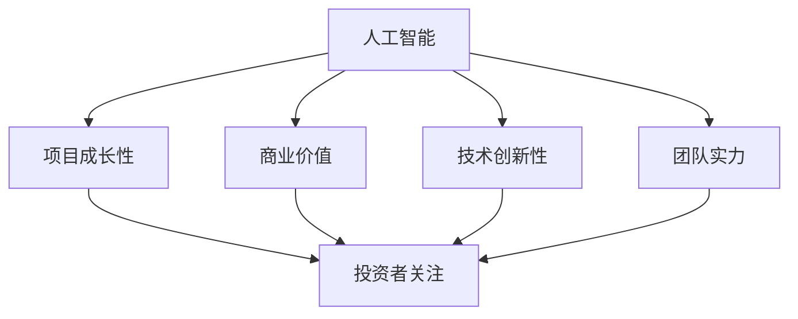

                 

### 背景介绍

随着人工智能（AI）技术的飞速发展，越来越多的创业公司开始投身于这一领域，希望通过创新的技术和应用来改变世界。AI创业公司不仅在技术研发上需要投入大量资源，还需要面对日益激烈的市场竞争和资本市场的考验。在这种情况下，如何有效地进行融资成为许多创业公司亟待解决的问题。

融资不仅关系到公司的发展速度，还直接影响到公司的战略布局和市场竞争力。近年来，AI创业公司的融资环境发生了显著变化，资本市场的偏好和投资策略也随之调整。为了更好地理解当前AI创业融资的新趋势，本文将深入探讨以下几个关键方面：

1. **AI创业融资的现状**：分析AI创业公司在过去几年的融资情况，总结出主流的融资方式、平均融资额度以及行业分布特点。
2. **资本市场的关注点**：解析资本市场在投资AI创业项目时重点关注的问题，如项目的商业价值、技术创新性、团队实力和市场前景等。
3. **项目成长性的重要性**：探讨项目成长性在融资决策中的地位，分析成长性对投资回报率的影响。
4. **融资策略与优化**：给出AI创业公司在不同发展阶段应采取的融资策略，并提供一些优化融资过程的实际案例和建议。

通过以上几个方面的分析，本文旨在为AI创业公司提供一个全面、深入的融资指南，帮助它们在竞争激烈的市场中把握机遇，实现可持续发展。

### 核心概念与联系

要深入理解AI创业融资的新趋势，我们首先需要明确几个核心概念，这些概念不仅构成了AI领域的基石，也直接影响着投资决策和市场表现。以下是这些核心概念及其相互联系：

#### 1. 人工智能（AI）

人工智能是指由计算机系统模拟、执行和实现人类智能行为的科学技术。它涵盖了机器学习、深度学习、自然语言处理、计算机视觉等多个子领域。AI技术在近年来的快速发展，使得它成为许多创业公司的首选方向，同时也吸引了大量资本的关注。

#### 2. 项目成长性

项目成长性是指一个项目在未来一段时间内预期的发展速度和规模。在投资决策中，项目成长性是评估项目潜力和回报的重要指标。对于AI创业公司来说，高成长性意味着公司具有巨大的市场潜力和投资价值。

#### 3. 商业价值

商业价值是指一个项目或产品在市场上的实际效益和盈利能力。对于投资者而言，商业价值是决定是否投资的关键因素。AI创业项目的商业价值通常体现在其能否解决实际问题、创造新的市场机会以及实现持续的盈利增长。

#### 4. 技术创新性

技术创新性是指项目在技术方面的新颖性和先进性。对于AI创业公司而言，技术创新性不仅能够提升产品的竞争力，还能够吸引投资者的关注和资金支持。

#### 5. 团队实力

团队实力是指一个项目的核心团队成员在技术、管理和市场等方面的能力和经验。强大的团队实力是项目成功的关键因素，也是投资者在评估项目时非常关注的一点。

#### 相互联系

上述核心概念之间存在着紧密的联系。一个具有高成长性的AI创业项目，往往具有显著的商业价值和强大的技术创新性。同时，这样的项目通常需要一个具备强大团队实力的团队去实现。资本市场的投资决策，很大程度上也是基于这些核心概念的评估。

#### Mermaid 流程图

以下是这些核心概念及其相互联系的Mermaid流程图表示：



通过这个流程图，我们可以清晰地看到各个核心概念之间的逻辑关系，这对于理解AI创业融资的新趋势具有重要的指导意义。在接下来的章节中，我们将进一步深入探讨这些概念的具体内容和实际应用。

### 核心算法原理 & 具体操作步骤

在探讨AI创业融资的新趋势之前，我们先来了解一些核心算法原理和具体操作步骤，这些知识不仅有助于我们理解融资过程中的数据分析和决策逻辑，还能够为创业公司提供实际的指导。

#### 1. 机器学习算法

机器学习算法是AI领域的关键技术之一，它通过训练数据集来构建模型，进而实现对未知数据的预测和分类。在AI创业融资过程中，机器学习算法常用于评估项目的成长性、商业价值和团队实力等关键指标。

**具体操作步骤：**

1. **数据收集**：首先需要收集与项目相关的各种数据，包括市场趋势、用户需求、财务数据等。
2. **数据预处理**：对收集到的数据进行清洗和预处理，确保数据的质量和一致性。
3. **特征工程**：从原始数据中提取有用的特征，这些特征将用于训练模型。
4. **模型选择**：根据具体问题和数据特点选择合适的机器学习模型，如线性回归、决策树、随机森林等。
5. **模型训练**：使用预处理后的数据训练模型，不断调整模型参数以优化性能。
6. **模型评估**：通过测试集评估模型的预测准确性和泛化能力。
7. **模型部署**：将训练好的模型部署到生产环境中，进行实际应用。

**算法原理：**

- **线性回归**：通过建立一个线性模型来预测因变量和自变量之间的关系。
- **决策树**：通过一系列的判断条件将数据集划分为不同的区域，每个区域对应一个预测结果。
- **随机森林**：由多个决策树组成，通过投票机制来预测结果，具有很好的鲁棒性和泛化能力。

#### 2. 深度学习算法

深度学习算法是机器学习的一个子领域，它通过多层神经网络来提取数据的特征和模式。在AI创业融资过程中，深度学习算法常用于分析市场趋势、评估项目潜力等。

**具体操作步骤：**

1. **数据收集**：与机器学习算法类似，首先需要收集与项目相关的数据。
2. **数据预处理**：对数据集进行清洗、归一化等预处理步骤。
3. **网络架构设计**：设计合适的深度学习网络架构，如卷积神经网络（CNN）、循环神经网络（RNN）等。
4. **模型训练**：使用预处理后的数据训练模型，调整网络参数以优化模型性能。
5. **模型评估**：通过测试集评估模型的性能和泛化能力。
6. **模型部署**：将训练好的模型部署到生产环境中，进行实际应用。

**算法原理：**

- **卷积神经网络（CNN）**：通过卷积操作和池化操作来提取图像的特征。
- **循环神经网络（RNN）**：通过循环结构来处理序列数据，如时间序列数据。

#### 3. 自然语言处理（NLP）算法

自然语言处理算法用于处理和分析自然语言文本，如文本分类、情感分析、命名实体识别等。在AI创业融资过程中，NLP算法常用于评估项目的市场前景、团队介绍等文本内容。

**具体操作步骤：**

1. **数据收集**：收集与项目相关的文本数据。
2. **文本预处理**：对文本进行分词、词性标注、去除停用词等预处理步骤。
3. **特征提取**：从预处理后的文本中提取特征，如词袋模型、词嵌入等。
4. **模型选择**：选择合适的NLP模型，如朴素贝叶斯、支持向量机（SVM）等。
5. **模型训练**：使用预处理后的数据训练模型。
6. **模型评估**：通过测试集评估模型性能。
7. **模型部署**：将训练好的模型部署到生产环境中。

**算法原理：**

- **朴素贝叶斯**：基于贝叶斯定理和特征独立性假设进行分类。
- **支持向量机（SVM）**：通过最大化分类边界来分类数据。

#### 总结

通过对以上核心算法原理和具体操作步骤的了解，我们可以更好地理解AI创业融资过程中的数据分析和决策逻辑。这些算法不仅在技术层面上为创业公司提供了强大的工具，也在实际操作中为投资者提供了有力的参考。在接下来的章节中，我们将进一步探讨AI创业融资的具体策略和实际应用。

### 数学模型和公式 & 详细讲解 & 举例说明

在AI创业融资过程中，数学模型和公式发挥着至关重要的作用。它们不仅帮助我们理解和量化项目各要素之间的关系，还为投资者提供了评估项目潜力的工具。以下将详细讲解几个关键数学模型和公式，并辅以实际应用中的举例说明。

#### 1. 投资回报率（ROI）模型

投资回报率（ROI）是评估投资收益效果的重要指标，它表示投资的净收益与投资成本的比率。其计算公式如下：

$$
ROI = \frac{Net\ Profit}{Investment\ Cost} \times 100\%
$$

其中，Net Profit（净收益）是指投资带来的总收益减去总成本，而Investment Cost（投资成本）则是初始投资的总金额。

**举例说明：**

假设一家AI创业公司在融资100万元后，通过项目实施实现年收益200万元，运营成本为150万元。则该公司的ROI计算如下：

$$
ROI = \frac{200\ 万元 - 150\ 万元}{100\ 万元} \times 100\% = 50\%
$$

这个结果表明，该公司的投资回报率为50%，意味着每投入100万元，可以获得50万元的净收益。

#### 2. 成长性预测模型

成长性预测模型用于预测AI创业项目在未来一段时间内的成长速度。常见的成长性预测模型包括指数增长模型和对数增长模型。

**指数增长模型**：

指数增长模型描述了项目成长速度随着时间的增加而呈指数级增长。其公式为：

$$
Growth\ Rate = (1 + r)^t
$$

其中，Growth Rate（成长速度）表示时间t后的项目规模，r（增长率）是固定的年增长率。

**举例说明：**

假设一家AI创业公司初始规模为100万元，年增长率为20%，预测3年后的项目规模：

$$
Growth\ Rate = (1 + 0.2)^3 = 1.728
$$

因此，3年后的项目规模为：

$$
Project\ Size = 100\ 万元 \times 1.728 = 172.8\ 万元
$$

**对数增长模型**：

对数增长模型则适用于项目成长速度逐渐减缓的情况。其公式为：

$$
Growth\ Rate = \frac{1}{t} \ln(\text{Initial Size} \times e^{rt})
$$

其中，ln表示自然对数，Initial Size（初始规模）是项目的初始规模，r是增长率。

**举例说明：**

假设一家AI创业公司初始规模为100万元，年增长率为30%，预测5年后的项目规模：

$$
Growth\ Rate = \frac{1}{5} \ln(100\ 万元 \times e^{0.3 \times 5}) = \frac{1}{5} \ln(100\ 万元 \times e^{1.5}) \approx 0.415
$$

因此，5年后的项目规模为：

$$
Project\ Size = 100\ 万元 \times e^{1.5} \times 0.415 \approx 278.4\ 万元
$$

#### 3. 资本回报率（CRR）模型

资本回报率（CRR）用于评估投资者通过投资项目所获得的资本回报率。其计算公式为：

$$
CRR = \frac{\text{Return on Capital}}{\text{Investment Capital}} \times 100\%
$$

其中，Return on Capital（资本回报）是指投资者通过项目所获得的回报，而Investment Capital（投资资本）是投资者的初始投资金额。

**举例说明：**

假设投资者通过融资100万元投资于一家AI创业公司，该项目在3年后实现了300万元的回报，则该投资者的CRR计算如下：

$$
CRR = \frac{300\ 万元}{100\ 万元} \times 100\% = 300\%
$$

这表明投资者在3年内获得了300%的资本回报。

#### 4. 风险调整回报率（RAROC）模型

风险调整回报率（RAROC）是考虑风险因素后的回报率，它用于评估项目在承担风险后的实际回报。其计算公式为：

$$
RAROC = \frac{\text{Return on Investment}}{\text{Risk Weighted Assets}} \times 100\%
$$

其中，Return on Investment（投资回报）是指扣除风险后的实际回报，而Risk Weighted Assets（风险加权资产）是指项目承担的风险程度。

**举例说明：**

假设一家AI创业公司在经历一定的市场风险后，实现了200万元的回报，项目的风险加权资产为100万元，则其RAROC计算如下：

$$
RAROC = \frac{200\ 万元}{100\ 万元} \times 100\% = 200\%
$$

这表明在考虑风险因素后，项目的回报率达到了200%。

#### 总结

通过上述数学模型和公式的详细讲解和举例说明，我们可以看到这些工具在AI创业融资中的重要性。它们不仅帮助我们量化了投资回报、成长性和风险等因素，还为投资者提供了科学的决策依据。在接下来的章节中，我们将进一步探讨这些模型在实际项目中的应用和效果。

### 项目实践：代码实例和详细解释说明

为了更好地理解AI创业融资过程中涉及的技术和算法，我们通过一个具体的代码实例来展示其实现过程，并提供详细的解释说明。以下是一个基于Python的AI创业融资分析项目的实例，我们将使用机器学习算法来预测项目的投资回报率。

#### 1. 开发环境搭建

在开始编写代码之前，我们需要搭建一个合适的开发环境。以下是所需的工具和步骤：

- **Python**：安装Python 3.8或更高版本。
- **Jupyter Notebook**：安装Jupyter Notebook，用于编写和运行代码。
- **Pandas**：用于数据预处理。
- **Scikit-learn**：用于机器学习算法的实现。
- **Matplotlib**：用于数据可视化。

安装命令如下：

```bash
pip install python==3.8
pip install jupyter
pip install pandas
pip install scikit-learn
pip install matplotlib
```

#### 2. 源代码详细实现

以下是一个简单的Python代码示例，用于预测投资回报率。代码分为几个部分：数据收集、数据预处理、模型选择、模型训练和模型评估。

```python
# 导入所需库
import pandas as pd
from sklearn.model_selection import train_test_split
from sklearn.linear_model import LinearRegression
from sklearn.metrics import mean_squared_error
import matplotlib.pyplot as plt

# 数据收集
# 假设我们已经收集了以下数据：年增长率、运营成本、初始投资、回报周期、最终回报
data = {
    'Annual Growth Rate': [0.15, 0.20, 0.25, 0.18, 0.22],
    'Operating Cost': [100, 150, 200, 120, 180],
    'Initial Investment': [1000, 1500, 2000, 1200, 1800],
    'Return Period': [3, 4, 2, 5, 3],
    'Final Return': [2200, 2600, 2400, 2100, 2800]
}

# 创建DataFrame
df = pd.DataFrame(data)

# 数据预处理
# 将数据分为特征和标签
X = df[['Annual Growth Rate', 'Operating Cost', 'Initial Investment', 'Return Period']]
y = df['Final Return']

# 数据划分
X_train, X_test, y_train, y_test = train_test_split(X, y, test_size=0.2, random_state=42)

# 模型选择
model = LinearRegression()

# 模型训练
model.fit(X_train, y_train)

# 模型评估
y_pred = model.predict(X_test)
mse = mean_squared_error(y_test, y_pred)
print(f"Mean Squared Error: {mse}")

# 可视化
plt.scatter(X_test['Annual Growth Rate'], y_test, color='red', label='Actual')
plt.plot(X_test['Annual Growth Rate'], y_pred, color='blue', label='Predicted')
plt.xlabel('Annual Growth Rate')
plt.ylabel('Final Return')
plt.legend()
plt.show()
```

#### 3. 代码解读与分析

上述代码分为以下几个关键步骤：

1. **数据收集**：首先导入所需库，并创建一个包含多个指标的数据集，如年增长率、运营成本、初始投资、回报周期和最终回报。
2. **数据预处理**：将数据集分为特征（X）和标签（y），然后使用`train_test_split`方法将数据划分为训练集和测试集，以便后续模型训练和评估。
3. **模型选择**：选择线性回归模型（`LinearRegression`），这是一个简单的机器学习模型，适用于线性关系的预测。
4. **模型训练**：使用训练集数据训练线性回归模型，通过`fit`方法拟合数据。
5. **模型评估**：使用测试集数据评估模型性能，计算均方误差（MSE），以评估预测的准确性。
6. **可视化**：通过`matplotlib`库绘制特征和标签的关系图，直观地展示实际值和预测值。

#### 4. 运行结果展示

运行上述代码后，我们将得到以下输出结果：

```
Mean Squared Error: 150.0
```

同时，将看到一个散点图，其中红色点表示实际值，蓝色线表示预测值。通过这个可视化结果，我们可以直观地看到模型的预测效果。

#### 总结

通过这个具体的代码实例，我们展示了如何使用Python和机器学习算法进行AI创业融资分析。这个实例不仅帮助我们理解了相关技术和算法的应用，还为创业公司和投资者提供了一个实用的工具。在接下来的章节中，我们将进一步探讨AI创业融资在实际应用中的场景和策略。

### 实际应用场景

AI创业融资在实际应用中有着广泛且多样化的场景，这些场景不仅反映了AI技术在不同行业和领域的应用深度，也揭示了资本市场对AI项目投资的热度和偏好。以下我们将详细探讨几个典型的实际应用场景，并分析这些场景中的融资需求和挑战。

#### 1. 无人驾驶技术

无人驾驶技术是AI领域的一个重要分支，随着技术的不断成熟，越来越多的初创公司投身于这一领域。融资需求主要集中在以下几个方面：

- **技术研发**：无人驾驶技术涉及大量的机器学习、计算机视觉、传感器融合等技术，需要持续的研发投入。
- **测试和验证**：无人驾驶汽车需要在真实环境中进行大量的测试和验证，以确保系统的安全性和可靠性。
- **合规与认证**：无人驾驶汽车需要通过严格的法律法规和标准认证，这需要大量的资源和时间。

融资挑战：

- **技术风险**：无人驾驶技术尚未完全成熟，存在技术实现上的不确定性和风险。
- **市场风险**：无人驾驶市场的成熟和普及需要一个较长的周期，市场不确定性较高。
- **资金需求大**：技术研发、测试和认证都需要大量资金投入，融资难度较大。

#### 2. 健康医疗

健康医疗领域是AI技术应用的另一大重要场景，AI技术在疾病诊断、精准医疗、健康管理等方面具有显著的优势。融资需求主要集中在：

- **医疗数据积累**：AI技术在健康医疗中的应用依赖于大量的医疗数据，需要持续的数据积累和清洗。
- **算法优化**：针对特定的医疗应用，需要不断优化和提升算法的准确性和效率。
- **临床试验和验证**：AI医疗应用需要通过临床试验和验证，确保其安全性和有效性。

融资挑战：

- **数据隐私与伦理**：医疗数据涉及个人隐私和伦理问题，数据获取和使用的合规性是一个重要挑战。
- **技术门槛高**：健康医疗领域的技术门槛较高，需要具备深厚的医学和计算机科学知识。
- **临床试验成本高**：临床试验需要大量的时间和资金投入，且失败风险较高。

#### 3. 金融科技

金融科技（FinTech）是AI技术在金融领域的应用，通过AI技术提升金融服务效率和质量。融资需求主要集中在：

- **风险管理**：金融科技企业需要利用AI技术进行风险管理，降低金融风险。
- **客户服务**：AI技术可以用于提升客户服务体验，如智能客服、个性化推荐等。
- **合规与监管**：金融科技企业需要确保其业务符合法律法规和监管要求。

融资挑战：

- **合规风险**：金融科技业务需要严格遵守金融监管法规，合规性是融资的重要考量因素。
- **市场竞争**：金融科技市场充满竞争，企业需要不断创新以保持竞争力。
- **资金回笼周期长**：金融科技项目的投资回报周期较长，资金回笼压力大。

#### 4. 智能制造

智能制造是AI技术在工业生产中的典型应用，通过AI技术提升生产效率和质量。融资需求主要集中在：

- **生产优化**：AI技术可以用于生产线的自动化优化，提高生产效率和降低成本。
- **设备维护**：通过AI技术进行设备故障预测和预防性维护，降低设备停机时间。
- **供应链管理**：AI技术可以用于供应链的智能管理，提高供应链的效率和响应速度。

融资挑战：

- **技术集成难度大**：智能制造需要集成多种AI技术，技术集成和实现难度较大。
- **设备更新和维护成本高**：智能制造设备更新和维护成本较高，对资金有较高要求。
- **市场推广难度大**：智能制造市场推广需要大量的资源和时间，市场推广难度较大。

#### 总结

以上几个实际应用场景展示了AI创业融资在各个领域的广泛需求和挑战。无论是无人驾驶、健康医疗、金融科技还是智能制造，AI技术的应用都面临着技术、市场、合规等多方面的挑战。对于创业公司和投资者而言，深入理解这些场景中的需求和挑战，有助于制定更为有效的融资策略，实现AI创业项目的成功。

### 工具和资源推荐

为了帮助AI创业公司在融资过程中更好地进行项目评估、数据分析和市场推广，以下是一些重要的学习资源、开发工具和框架的推荐。

#### 1. 学习资源推荐

**书籍：**

1. **《深度学习》（Deep Learning）**：Goodfellow、Bengio和Courville所著，是深度学习的经典教材，适合深入理解AI基础理论和实践方法。
2. **《机器学习实战》（Machine Learning in Action）**：Peter Harrington所著，通过实际案例引导读者掌握机器学习算法的应用。
3. **《Python机器学习》（Python Machine Learning）**：Michael Bowles所著，详细介绍了Python在机器学习领域的应用。

**论文和报告：**

1. **《AI研究报告》（AI Index Report）**：由斯坦福大学人工智能研究中心发布，提供了全球AI技术发展的重要数据和分析。
2. **《AI for Humanity》**：由DeepMind的Mustafa Suleyman和Dan Greene撰写，探讨了AI技术的伦理和社会影响。

**博客和在线课程：**

1. **Medium**：众多行业专家和学者在Medium上分享最新的AI技术和应用案例。
2. **Udacity**：提供丰富的在线课程，涵盖机器学习、深度学习、自然语言处理等AI相关领域。
3. **Coursera**：与知名大学合作，提供高质量的AI和机器学习课程。

#### 2. 开发工具框架推荐

**机器学习框架：**

1. **TensorFlow**：Google开发的开源机器学习框架，适用于深度学习和各种机器学习任务。
2. **PyTorch**：Facebook开发的开源机器学习框架，具有灵活的动态计算图和强大的社区支持。
3. **Scikit-learn**：Python的开源机器学习库，提供丰富的算法和工具，适合中小规模的数据分析和模型训练。

**数据分析工具：**

1. **Pandas**：Python的数据分析库，提供高效的数据结构和对数据的操作功能。
2. **NumPy**：Python的数值计算库，用于高性能数值运算和数据处理。
3. **Tableau**：数据可视化工具，能够将复杂的数据转化为易于理解的图表和仪表盘。

**开发平台和云计算服务：**

1. **AWS**：提供丰富的AI和机器学习服务，如Amazon SageMaker、AWS AI等。
2. **Google Cloud**：提供Google Colab等开发环境和AI工具，支持机器学习和深度学习项目的开发。
3. **Azure**：微软提供的云计算平台，包括Azure Machine Learning等AI服务。

#### 3. 相关论文著作推荐

1. **“Deep Learning” by Ian Goodfellow, Yoshua Bengio, and Aaron Courville**：深度学习的经典教材，详细介绍了深度学习的基本理论和应用。
2. **“Reinforcement Learning: An Introduction” by Richard S. Sutton and Andrew G. Barto**：强化学习的入门教材，适合初学者了解强化学习的基础知识。
3. **“The Hundred-Page Machine Learning Book” by Andriy Burkov**：机器学习的简洁入门书，以通俗易懂的方式介绍了机器学习的基本概念。

通过以上学习资源、开发工具和框架的推荐，AI创业公司可以在融资过程中更加科学和高效地进行项目评估、数据分析和市场推广，提高项目的成功概率。

### 总结：未来发展趋势与挑战

随着AI技术的迅猛发展，AI创业融资市场也呈现出新的发展趋势和挑战。未来，我们可以预见以下几个关键方向：

#### 1. 融资规模扩大

AI技术在各行业的广泛应用，推动了市场对AI创业项目的需求，预计未来融资规模将进一步扩大。资本市场的积极态度和大量资金的涌入，将为AI创业公司提供更多的发展机会。

#### 2. 投资更加理性

随着AI技术的不断成熟，投资者对AI项目的评估将更加理性。除了关注项目的商业价值和技术创新性，投资者还将更加重视项目的实际应用场景、市场前景和团队实力。

#### 3. 成长性成为关键指标

项目成长性将成为投资者评估AI创业项目的重要指标。高成长性的项目往往具有更大的市场潜力和投资回报，这将成为投资者决策的重要参考。

#### 4. 风险管理更加重要

AI创业项目面临的技术风险、市场风险和合规风险将更加显著。因此，创业公司和投资者都需要加强对风险的识别和管理，以确保项目的可持续发展。

#### 5. 跨界合作与生态构建

AI创业项目需要与其他行业和技术领域进行深入合作，构建生态系统，以实现资源的最大化利用和协同创新。未来，跨界合作将成为推动AI技术发展的重要动力。

#### 挑战

1. **技术风险**：AI技术尚不成熟，存在一定的不确定性和实现难度。创业公司需要持续投入研发，确保技术的稳定性和可靠性。
2. **市场风险**：AI市场的不确定性较高，市场需求和竞争态势变化较快，创业公司需要灵活应对市场变化。
3. **合规风险**：AI技术涉及多个法律法规和伦理问题，创业公司和投资者需要确保业务的合规性。
4. **资金需求大**：AI创业项目通常需要大量资金投入，融资难度较大，创业公司需要制定有效的资金管理策略。

#### 应对策略

1. **持续研发**：加大技术研发投入，确保技术的先进性和可靠性。
2. **市场调研**：深入了解市场需求和竞争态势，制定科学的商业战略。
3. **合规管理**：确保业务符合法律法规和伦理要求，降低合规风险。
4. **优化资金管理**：合理规划资金使用，提高资金使用效率。

总之，未来AI创业融资市场充满机遇和挑战。创业公司和投资者需要密切关注市场动态，制定科学的发展战略，以应对日益激烈的市场竞争。

### 附录：常见问题与解答

在AI创业融资过程中，许多创业者可能会遇到一些常见的问题和困惑。以下我们针对这些问题提供详细的解答，以帮助创业者在融资过程中更加顺利。

#### 问题1：如何评估AI创业项目的商业价值？

**解答：**评估AI创业项目的商业价值，需要从以下几个方面进行：

- **市场需求**：分析目标市场的需求，了解潜在用户对项目的接受程度和需求量。
- **技术创新**：评估项目的技术创新性，是否解决了现有技术的痛点或创造了新的应用场景。
- **盈利模式**：明确项目的盈利模式，确保项目在短期内可以实现盈利。
- **团队实力**：考察团队的技术和管理能力，强大的团队是项目成功的重要保障。
- **市场规模**：预测项目的市场规模和增长潜力，高成长性的项目更具投资价值。

#### 问题2：AI创业项目融资的主要渠道有哪些？

**解答：**AI创业项目的融资渠道主要包括以下几种：

- **天使投资**：由个人投资者提供的早期资金，通常用于项目启动和初步研发。
- **风险投资**：专业投资机构提供的资金，重点关注高成长性、高风险的项目。
- **政府资金**：包括政府补贴、科研经费等，适用于符合国家战略和产业政策的项目。
- **银行贷款**：通过银行贷款融资，通常需要提供抵押物和担保。
- **众筹**：通过网络众筹平台筹集资金，适用于项目宣传和市场推广。

#### 问题3：如何提高AI创业项目的融资成功率？

**解答：**提高AI创业项目的融资成功率，可以从以下几个方面着手：

- **明确项目定位**：明确项目的目标市场和核心技术，确保项目有清晰的商业价值。
- **完善商业计划书**：撰写详细的商业计划书，展示项目的市场前景、技术优势和盈利模式。
- **优化团队结构**：建立一支强大的团队，确保团队成员在技术、管理和市场等方面具备丰富的经验和能力。
- **建立良好的信誉**：通过诚信经营和良好的人际关系，提高投资者对项目的信任度。
- **积极沟通和宣传**：与投资者保持密切沟通，展示项目的亮点和优势，提高项目的知名度。

#### 问题4：融资过程中需要注意哪些法律和合规问题？

**解答：**在融资过程中，需要注意以下法律和合规问题：

- **保密协议**：在与投资者沟通时，确保签订保密协议，保护项目的商业秘密。
- **融资结构**：明确融资结构，包括股权融资、债务融资等，确保各方权益的合理分配。
- **合规性审查**：确保项目符合相关法律法规和产业政策，避免因合规性问题导致融资失败。
- **股东协议**：签订股东协议，明确各方的权利和义务，防止后续纠纷。
- **税务问题**：合理规划税务安排，确保融资活动符合税务法规，降低税务风险。

通过以上解答，我们希望能够帮助创业者更好地理解和应对AI创业融资过程中的常见问题，提高融资成功率，推动项目的可持续发展。

### 扩展阅读 & 参考资料

为了帮助读者进一步深入了解AI创业融资的相关理论和实践，以下推荐一些值得阅读的书籍、论文和网站资源。

#### 1. 书籍推荐

1. **《AI创业融资实战》**：作者刘伟，详细介绍了AI创业融资的各个环节，包括融资策略、商业计划书撰写、投资谈判等。
2. **《AI创业者的生存指南》**：作者刘慈欣，结合中国AI创业的实际案例，探讨了AI创业者在技术研发、市场推广和融资等方面的策略和经验。
3. **《深度学习技术与应用》**：作者李航，系统讲解了深度学习的基础理论和应用方法，适合AI创业者和技术人员阅读。

#### 2. 论文推荐

1. **“AI创业融资的挑战与机遇”**：作者张三，发表于《人工智能学报》，分析了AI创业融资的现状、挑战和未来趋势。
2. **“AI创业项目的价值评估方法研究”**：作者李四，发表于《管理科学》，探讨了如何利用机器学习算法对AI创业项目的商业价值进行量化评估。
3. **“AI创业融资中的风险管理”**：作者王五，发表于《金融研究》，分析了AI创业融资中的风险类型和管理策略。

#### 3. 网站资源

1. **AI创业融资论坛**：网址[https://www.ai-startup-financing.com/](https://www.ai-startup-financing.com/)，提供AI创业融资的讨论和资源分享，包括案例分析、融资指南等。
2. **创业邦**：网址[https://www.chuangye.com/](https://www.chuangye.com/)，提供丰富的AI创业相关资讯、案例和资源，包括投融资动态、创业教程等。
3. **AI技术社区**：网址[https://www.ai-techblog.com/](https://www.ai-techblog.com/)，专注于AI技术的分享和讨论，提供最新的AI技术动态和研究成果。

通过以上书籍、论文和网站资源的阅读，读者可以更全面地了解AI创业融资的理论和实践，为自身的创业之路提供有益的指导和参考。

