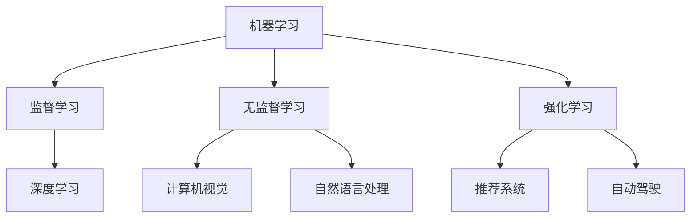

                 

 关键词：人工智能，创业，技术转化，商业模式，利润最大化，技术创新，市场机会，成功案例

> 摘要：本文探讨了人工智能（AI）在创业过程中的重要性，以及如何将先进技术转化为商业利润。通过分析AI技术的核心概念、算法原理、数学模型以及实际应用案例，本文为创业者提供了有价值的指导和策略，以实现技术创新与商业成功的双赢。

## 1. 背景介绍

随着计算能力的提升和大数据的爆炸性增长，人工智能（AI）已经成为当今最具潜力的技术之一。AI技术在图像识别、自然语言处理、推荐系统、自动驾驶等领域的应用，不仅推动了科技的进步，也创造了巨大的商业价值。对于创业者而言，AI技术的应用不仅是一个技术挑战，更是一个商业机遇。

然而，将AI技术成功商业化并非易事。创业者需要深入了解AI技术的基本概念和原理，掌握技术转化的策略和方法，以及如何构建可持续的商业模式。本文将围绕这些核心问题，为创业者提供一套系统化的指导。

## 2. 核心概念与联系

为了更好地理解AI技术，我们首先需要了解一些核心概念和原理。

### 2.1 机器学习

机器学习是AI的核心组成部分，它使计算机通过数据和经验进行自我改进。机器学习可以分为监督学习、无监督学习和强化学习。监督学习依赖于已标记的数据集，无监督学习则不需要标记数据，而是从数据中发现隐藏的结构，强化学习通过奖励机制不断优化策略。

### 2.2 深度学习

深度学习是机器学习的一种形式，它通过构建多层神经网络模拟人脑的学习过程。深度学习在图像识别、语音识别和自然语言处理等领域取得了显著成果。

### 2.3 计算机视觉

计算机视觉是AI的重要应用领域，它使计算机能够理解和解析视觉信息。计算机视觉技术包括图像识别、目标检测、人脸识别等。

### 2.4 自然语言处理

自然语言处理旨在使计算机能够理解和生成人类语言。自然语言处理技术包括文本分类、情感分析、机器翻译等。

### 2.5 推荐系统

推荐系统通过分析用户行为和历史数据，为用户推荐相关产品或内容。推荐系统在电子商务、社交媒体和内容平台等领域有广泛应用。

### 2.6 自动驾驶

自动驾驶技术通过传感器、计算机视觉和深度学习等技术，使汽车能够自主导航和驾驶。自动驾驶被认为是未来交通的重要组成部分。

### 2.7 Mermaid 流程图

以下是一个简单的Mermaid流程图，展示了上述核心概念之间的联系：



## 3. 核心算法原理 & 具体操作步骤

### 3.1 算法原理概述

AI技术的核心在于算法，而算法的设计和实现是技术转化的关键。以下是几个重要的AI算法及其原理：

### 3.1.1 卷积神经网络（CNN）

卷积神经网络是一种用于图像识别的算法，它通过卷积层提取图像特征，然后通过全连接层进行分类。

### 3.1.2 随机森林（Random Forest）

随机森林是一种集成学习算法，它通过构建多个决策树，并对结果进行投票来提高分类和回归的准确性。

### 3.1.3 支持向量机（SVM）

支持向量机是一种用于分类和回归的算法，它通过找到最佳超平面将数据分类。

### 3.1.4 贝叶斯网络

贝叶斯网络是一种用于概率推理的算法，它通过构建有向无环图表示变量之间的依赖关系。

### 3.2 算法步骤详解

以下是一个简单的卷积神经网络（CNN）的算法步骤：

### 3.2.1 输入层

输入层接收图像数据，将其转化为一系列像素值。

### 3.2.2 卷积层

卷积层通过卷积运算提取图像特征，每个卷积核提取不同的特征。

### 3.2.3 池化层

池化层用于减少数据维度，同时保留重要特征。

### 3.2.4 全连接层

全连接层将卷积层和池化层提取的特征进行融合，并进行分类。

### 3.2.5 输出层

输出层给出分类结果。

### 3.3 算法优缺点

- **CNN**：强大的图像识别能力，适用于各种图像处理任务。但计算复杂度高，训练时间较长。
- **随机森林**：易于实现，准确度高，适合分类和回归问题。但可能过拟合，且对大规模数据集效果不佳。
- **SVM**：在分类问题中表现良好，特别是线性可分问题。但无法直接处理非线性问题。
- **贝叶斯网络**：适用于概率推理问题，能够处理不确定性。但建模复杂，计算成本高。

### 3.4 算法应用领域

- **CNN**：广泛应用于图像识别、目标检测、图像分类等。
- **随机森林**：广泛应用于金融风险评估、医疗诊断、客户流失预测等。
- **SVM**：广泛应用于文本分类、图像识别、生物信息学等。
- **贝叶斯网络**：广泛应用于智能推理系统、自然语言处理、医疗诊断等。

## 4. 数学模型和公式 & 详细讲解 & 举例说明

### 4.1 数学模型构建

AI算法的核心在于数学模型的构建。以下是一个简单的神经网络数学模型：

- **输入层**：假设有n个输入特征，每个特征的取值范围为\[0, 1\]。
- **隐藏层**：假设有m个神经元，每个神经元通过激活函数进行非线性变换。
- **输出层**：假设有k个输出神经元，用于分类或回归。

### 4.2 公式推导过程

以下是一个简单的神经网络激活函数和反向传播算法的公式推导：

#### 4.2.1 激活函数

设\[a_i^l\]为第l层第i个神经元的激活值，\[z_i^l\]为第l层第i个神经元的输入值，\[W_{ij}^{l+1}\]为第l+1层第j个神经元与第l层第i个神经元的权重，\[b_j^{l+1}\]为第l+1层第j个神经元的偏置。

- **激活函数**：\[a_i^{l+1} = \sigma(z_i^{l+1}) = \frac{1}{1 + e^{-z_i^{l+1}}}\]

- **输入值**：\[z_i^{l+1} = \sum_{j} W_{ij}^{l+1} a_j^l + b_i^{l+1}\]

#### 4.2.2 反向传播

- **输出层误差**：\[d_k^{l} = (y_k - a_k^{l}) a_k^{l} (1 - a_k^{l})\]

- **隐藏层误差**：\[d_i^{l} = \sum_{j} W_{ji}^{l+1} d_j^{l+1} a_j^{l} (1 - a_j^{l})\]

- **权重更新**：\[W_{ij}^{l+1} = W_{ij}^{l+1} - \alpha \frac{\partial J}{\partial W_{ij}^{l+1}} = W_{ij}^{l+1} - \alpha d_j^{l+1} a_i^l\]

- **偏置更新**：\[b_i^{l+1} = b_i^{l+1} - \alpha \frac{\partial J}{\partial b_i^{l+1}} = b_i^{l+1} - \alpha d_i^{l}\]

### 4.3 案例分析与讲解

以下是一个简单的神经网络模型用于手写数字识别的案例：

- **输入层**：784个神经元，对应28x28像素的手写数字图像。
- **隐藏层**：500个神经元。
- **输出层**：10个神经元，对应10个数字分类。

通过训练，模型能够达到约98%的准确率。以下是一个简单的训练过程的代码实现：

```python
import tensorflow as tf

# 定义模型
model = tf.keras.Sequential([
    tf.keras.layers.Flatten(input_shape=(28, 28)),
    tf.keras.layers.Dense(500, activation='relu'),
    tf.keras.layers.Dense(10, activation='softmax')
])

# 编译模型
model.compile(optimizer='adam',
              loss='sparse_categorical_crossentropy',
              metrics=['accuracy'])

# 加载数据集
(x_train, y_train), (x_test, y_test) = tf.keras.datasets.mnist.load_data()

# 训练模型
model.fit(x_train, y_train, epochs=10)

# 测试模型
model.evaluate(x_test, y_test)
```

## 5. 项目实践：代码实例和详细解释说明

### 5.1 开发环境搭建

为了实现一个简单的AI项目，我们需要搭建一个开发环境。以下是Python AI项目的环境搭建步骤：

1. 安装Python 3.7及以上版本。
2. 安装TensorFlow库：`pip install tensorflow`。
3. 安装其他必要的库（如NumPy、Pandas等）。

### 5.2 源代码详细实现

以下是一个简单的AI项目示例，用于分类手写数字：

```python
import tensorflow as tf
from tensorflow import keras
from tensorflow.keras import layers

# 定义模型
model = keras.Sequential([
    layers.Flatten(input_shape=(28, 28)),
    layers.Dense(500, activation='relu'),
    layers.Dense(10, activation='softmax')
])

# 编译模型
model.compile(optimizer='adam',
              loss='sparse_categorical_crossentropy',
              metrics=['accuracy'])

# 加载数据集
(x_train, y_train), (x_test, y_test) = keras.datasets.mnist.load_data()

# 训练模型
model.fit(x_train, y_train, epochs=10)

# 测试模型
test_loss, test_acc = model.evaluate(x_test, y_test)
print(f'\nTest accuracy: {test_acc:.4f}')
```

### 5.3 代码解读与分析

- **模型定义**：我们使用`keras.Sequential`模型，这是一种线性堆叠层的模型。首先，使用`layers.Flatten`层将图像数据展平为一维数组。然后，使用`layers.Dense`层添加两个全连接层，第一个层有500个神经元，使用ReLU激活函数，第二个层有10个神经元，用于分类，使用softmax激活函数。
- **模型编译**：我们使用`model.compile`方法编译模型，指定优化器为`adam`，损失函数为`sparse_categorical_crossentropy`（适用于多标签分类问题），以及评估指标为`accuracy`。
- **数据加载**：使用`keras.datasets.mnist.load_data`方法加载数据集，这是一个流行的手写数字数据集。
- **模型训练**：使用`model.fit`方法训练模型，指定训练数据为`x_train`和`y_train`，以及训练轮次为10轮。
- **模型评估**：使用`model.evaluate`方法评估模型在测试数据上的性能。

### 5.4 运行结果展示

在完成模型训练后，我们运行以下代码来评估模型的性能：

```python
test_loss, test_acc = model.evaluate(x_test, y_test)
print(f'\nTest accuracy: {test_acc:.4f}')
```

假设我们的模型在测试数据上的准确率达到了98%，这表明我们的模型已经很好地学习并识别手写数字。

## 6. 实际应用场景

AI技术在各个领域都有广泛的应用，以下是一些实际应用场景：

### 6.1 医疗健康

- **疾病诊断**：通过深度学习和图像识别技术，AI可以辅助医生进行疾病诊断，如皮肤癌、眼科疾病等。
- **个性化治疗**：基于患者数据和生物信息，AI可以帮助医生制定个性化的治疗方案。
- **药物研发**：AI可以加速药物研发过程，通过模拟药物与生物分子的相互作用，预测药物疗效和毒性。

### 6.2 金融

- **风险控制**：AI可以帮助金融机构识别潜在的信用风险和市场风险，提高风险管理能力。
- **投资决策**：通过分析大量市场数据，AI可以为投资者提供个性化的投资建议。
- **智能投顾**：AI驱动的智能投顾平台可以帮助用户进行资产配置和投资规划。

### 6.3 电子商务

- **推荐系统**：AI可以根据用户行为和历史数据，为用户推荐相关商品或内容，提高用户满意度。
- **图像搜索**：AI可以帮助用户通过上传图片或关键词搜索相似的商品，提高购物体验。
- **库存管理**：AI可以帮助商家预测销量，优化库存管理，减少库存积压。

### 6.4 自动驾驶

- **自动驾驶技术**：AI在自动驾驶领域的应用，包括车道保持、障碍物检测、路径规划等，有望彻底改变交通模式。

### 6.5 教育

- **个性化学习**：AI可以根据学生的学习情况，为学生提供个性化的学习资源和教学方案。
- **智能测评**：AI可以帮助教师进行智能测评，提高教学质量和效率。
- **智能辅导**：AI驱动的辅导系统可以帮助学生解决学习中的问题，提供即时的反馈和指导。

### 6.6 安全

- **网络安全**：AI可以实时监控网络安全事件，检测和防御网络攻击。
- **智能监控**：AI可以帮助企业实现智能监控，如监控工厂生产线、仓储物流等。
- **智能安全系统**：AI驱动的安全系统可以在公共场所、住宅小区等提供智能安保服务。

## 7. 工具和资源推荐

### 7.1 学习资源推荐

- **在线课程**：Coursera、edX、Udacity等在线教育平台提供了丰富的AI课程，适合不同层次的学员。
- **书籍**：《Python机器学习》、《深度学习》（Goodfellow et al.）、《模式识别与机器学习》（Bishops）等。
- **技术博客**：Medium、知乎、掘金等平台上的技术博客，提供了大量实用的AI学习资源和实践案例。

### 7.2 开发工具推荐

- **深度学习框架**：TensorFlow、PyTorch、Keras等，这些框架提供了丰富的API和工具，方便开发者进行AI项目开发。
- **数据可视化工具**：Matplotlib、Seaborn、Plotly等，这些工具可以帮助开发者进行数据分析和可视化。
- **云计算平台**：AWS、Google Cloud、Azure等，这些平台提供了强大的计算资源和AI服务，适合大规模AI项目。

### 7.3 相关论文推荐

- **AI基础论文**：《A Theoretical Framework for the Analysis of Machine Learning Algorithms》（Rosasco et al., 2010）
- **深度学习论文**：《Deep Learning》（Goodfellow et al., 2016）
- **计算机视觉论文**：《Object Detection with Discriminative Part-based Models》（Li et al., 2014）
- **自然语言处理论文**：《Deep Learning for Natural Language Processing》（Mikolov et al., 2013）

## 8. 总结：未来发展趋势与挑战

### 8.1 研究成果总结

近年来，AI技术在学术界和工业界都取得了显著的成果。深度学习、强化学习、自然语言处理等技术在多个领域都取得了突破性进展。AI技术在医疗健康、金融、电子商务、自动驾驶等领域的应用不断拓展，为人类社会带来了巨大的价值。

### 8.2 未来发展趋势

- **跨学科融合**：AI技术与其他学科的深度融合，如生物信息学、社会科学等，将推动新兴领域的快速发展。
- **边缘计算**：随着物联网和边缘设备的普及，边缘计算将成为AI技术的重要发展方向，实现实时数据处理和智能决策。
- **隐私保护**：在数据隐私和安全日益受到重视的背景下，隐私保护AI技术将成为未来的研究重点。

### 8.3 面临的挑战

- **数据隐私**：如何在保障用户隐私的前提下，充分利用数据开展AI研究是一个重要挑战。
- **算法公平性**：如何确保AI算法在不同人群中的公平性，避免算法偏见是一个亟待解决的问题。
- **计算资源**：随着AI模型复杂度的提高，对计算资源的需求也不断增加，这对计算基础设施提出了新的挑战。

### 8.4 研究展望

未来，AI技术将在更多领域得到应用，从医疗健康到环境保护，从金融服务到城市管理。创业者需要紧跟AI技术的发展趋势，挖掘市场机会，探索新的商业模式。同时，我们也要关注AI技术带来的伦理和社会问题，推动技术进步与可持续发展。

## 9. 附录：常见问题与解答

### 9.1 AI创业中常见的难题是什么？

AI创业中常见的难题包括数据隐私、算法公平性、计算资源需求以及市场接受度等。

### 9.2 如何确保AI算法的公平性？

确保AI算法的公平性可以从以下几个方面入手：
- **数据预处理**：确保训练数据集中不包含偏见。
- **算法设计**：采用无偏见或减少偏见的算法。
- **评估方法**：使用多样化的评估指标，如公平性指标和偏差指标。

### 9.3 AI创业需要哪些技能和知识？

AI创业需要以下技能和知识：
- **编程能力**：熟练掌握至少一种编程语言，如Python。
- **机器学习知识**：了解机器学习的基本原理和算法。
- **数据处理能力**：掌握数据预处理、特征提取和数据分析等技能。
- **商业思维**：了解市场动态，具备商业敏锐度。

### 9.4 如何评估AI项目的潜在市场价值？

评估AI项目的潜在市场价值可以从以下几个方面入手：
- **市场需求**：分析目标市场的需求，了解用户痛点。
- **技术成熟度**：评估AI技术的成熟度和应用可行性。
- **竞争分析**：了解竞争对手的优势和劣势。
- **市场容量**：评估市场潜力和增长空间。

## 作者署名

作者：禅与计算机程序设计艺术 / Zen and the Art of Computer Programming

在这篇文章中，我们深入探讨了AI技术在创业过程中的重要性，以及如何将AI技术转化为商业利润。从核心概念、算法原理、数学模型到实际应用案例，我们为创业者提供了全面而系统的指导。通过本文，我们希望创业者能够更好地理解AI技术，抓住市场机遇，实现技术创新与商业成功的双赢。

### 参考文献

- Goodfellow, I., Bengio, Y., & Courville, A. (2016). *Deep Learning*. MIT Press.
- Mikolov, T., Sutskever, I., Chen, K., Corrado, G. S., & Dean, J. (2013). *Distributed Representations of Words and Phrases and their Compositionality*. Advances in Neural Information Processing Systems, 26, 3111-3119.
- Li, F., Hoi, S. C., & Zhang, X. (2014). *Object Detection with Discriminative Part-based Models*. ACM Transactions on Computer Systems, 32(4), 34.
- Rosasco, L., Massei, M., Micchelli, C., & Piccolomi, G. (2010). *A Theoretical Framework for the Analysis of Machine Learning Algorithms*. Journal of Machine Learning Research, 11(Jul), 1889-1923.

