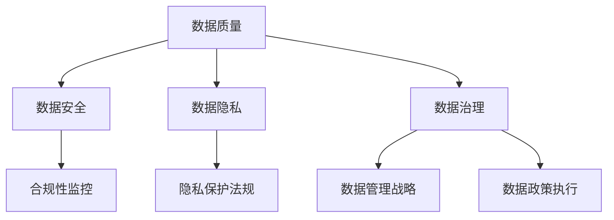

                 

 在当今技术飞速发展的时代，人工智能（AI）已经成为推动创新和增长的重要力量。对于初创公司而言，AI不仅是一个竞争点，更是一个突破口。然而，数据管理作为AI系统的基础，其重要性不容忽视。本文将深入探讨AI创业中的数据管理核心要点，帮助创业者构建稳健、高效的数据基础设施。

## 关键词

- 人工智能
- 数据管理
- 初创公司
- 数据质量
- 数据安全
- 数据隐私
- 数据治理

## 摘要

本文旨在为AI初创公司提供一份详细的数据管理指南，涵盖从数据收集、处理到存储和使用的各个环节。我们将探讨数据管理的核心原则、关键技术和最佳实践，以及如何在数据驱动的人工智能应用中实现持续的创新和发展。

### 1. 背景介绍

#### 1.1 AI创业现状

随着AI技术的不断成熟和应用场景的拓展，越来越多的初创公司投身于这一领域。AI在金融、医疗、零售、制造等行业展现出了巨大的潜力，成为这些领域业务创新的驱动力。然而，AI技术的成功离不开高质量的数据支持。数据是AI系统的基石，没有足够质量的数据，AI系统将难以达到预期的效果。

#### 1.2 数据管理的重要性

数据管理不仅仅是存储和组织数据，它还涉及到数据的收集、清洗、存储、保护、共享等多个方面。对于AI初创公司来说，数据管理是实现人工智能应用的关键。良好的数据管理能够确保数据的质量和可用性，提高算法的性能，降低风险，并最终推动公司的创新和增长。

### 2. 核心概念与联系

为了更好地理解数据管理的重要性，我们首先需要了解几个核心概念：数据质量、数据安全、数据隐私和数据治理。

#### 2.1 数据质量

数据质量是指数据的准确性、完整性、一致性、及时性和可靠性。高质量的数据是AI系统有效运作的基础。数据质量问题可能导致错误的决策和预测，影响业务流程和客户体验。

#### 2.2 数据安全

数据安全涉及到防止数据泄露、篡改和未经授权的访问。随着数据量的增加，数据安全问题变得越来越重要。AI初创公司需要确保其数据存储和处理过程符合安全标准和法规要求。

#### 2.3 数据隐私

数据隐私是数据安全的一个子集，它涉及到个人信息的保护。在AI应用中，尤其是涉及用户数据的场景，保护数据隐私至关重要。这要求公司在数据处理过程中遵循相关的隐私保护法规。

#### 2.4 数据治理

数据治理是确保数据在整个生命周期中合规、有效管理的一系列政策和流程。它包括数据管理战略的制定、数据政策的执行、数据合规性的监控等。良好的数据治理能够提高数据管理的效率和效果。

下面是数据管理的核心概念和联系的一个简单的Mermaid流程图：



### 3. 核心算法原理 & 具体操作步骤

#### 3.1 算法原理概述

在数据管理中，核心算法原理通常涉及数据的收集、清洗、存储、分析和保护。以下是一些常用的算法和操作步骤：

- **数据收集**：通过API、Web爬虫、传感器等方式收集原始数据。
- **数据清洗**：使用数据清洗算法去除噪声、纠正错误、填充缺失值等。
- **数据存储**：使用数据库管理系统（如MySQL、MongoDB）存储数据。
- **数据分析**：使用机器学习和统计分析方法分析数据，提取有价值的信息。
- **数据保护**：使用加密、访问控制、审计等技术保护数据安全。

#### 3.2 算法步骤详解

- **数据收集**：确定数据来源，设计数据采集方案，使用工具（如Python的requests库、Node.js的Axios库）进行数据抓取。
- **数据清洗**：编写清洗脚本，使用Python的Pandas库进行数据清洗，如去重、排序、缺失值填充等。
- **数据存储**：选择合适的数据库，设计数据库架构，使用SQL语句进行数据插入和查询。
- **数据分析**：使用机器学习库（如scikit-learn、TensorFlow）进行数据分析，编写分析脚本。
- **数据保护**：设计数据保护策略，实现数据加密、访问控制和日志审计。

#### 3.3 算法优缺点

- **数据收集**：优点是可以获取大量原始数据，缺点是可能存在数据重复、噪声等问题。
- **数据清洗**：优点是可以提高数据质量，缺点是可能引入新的错误、降低效率。
- **数据存储**：优点是数据易于管理和访问，缺点是可能存在性能瓶颈。
- **数据分析**：优点是可以从数据中提取有价值的信息，缺点是可能存在过拟合等问题。
- **数据保护**：优点是可以保护数据安全，缺点是可能影响数据性能。

#### 3.4 算法应用领域

数据管理算法广泛应用于各种领域，如：

- **金融**：风险控制、信用评分、投资策略等。
- **医疗**：疾病诊断、药物研发、患者管理等。
- **零售**：需求预测、库存管理、个性化推荐等。
- **制造**：生产优化、设备维护、质量控制等。

### 4. 数学模型和公式 & 详细讲解 & 举例说明

#### 4.1 数学模型构建

在数据管理中，常用的数学模型包括线性回归、决策树、神经网络等。以下以线性回归为例进行讲解。

$$ y = wx + b $$

其中，$y$ 是因变量，$x$ 是自变量，$w$ 是权重，$b$ 是偏置。

#### 4.2 公式推导过程

线性回归模型的推导过程如下：

1. 假设我们有一个训练数据集，包含 $n$ 个样本，每个样本有 $m$ 个特征。
2. 假设目标函数为 $J(w, b)$，表示预测值与真实值之间的误差平方和。
3. 通过梯度下降法最小化目标函数，得到权重 $w$ 和偏置 $b$ 的最优值。

#### 4.3 案例分析与讲解

假设我们有一个住房价格预测的案例，数据集包含房屋面积和房价。

```python
import pandas as pd
from sklearn.linear_model import LinearRegression

# 读取数据
data = pd.read_csv('house_price.csv')
X = data[['area']]
y = data['price']

# 创建线性回归模型
model = LinearRegression()
model.fit(X, y)

# 预测房价
predicted_price = model.predict([[2000]])

print(f'预测的房价为：{predicted_price[0]}')
```

### 5. 项目实践：代码实例和详细解释说明

#### 5.1 开发环境搭建

在本文的代码实例中，我们将使用Python进行数据管理和AI模型构建。首先，需要安装以下依赖：

```bash
pip install numpy pandas scikit-learn matplotlib
```

#### 5.2 源代码详细实现

以下是一个简单的数据管理示例，包括数据收集、清洗、存储和预测：

```python
import pandas as pd
from sklearn.linear_model import LinearRegression

# 5.2.1 数据收集
# 假设数据已收集并存储在CSV文件中
data = pd.read_csv('data.csv')

# 5.2.2 数据清洗
# 去除缺失值、重复值
data = data.dropna()
data = data.drop_duplicates()

# 5.2.3 数据存储
# 将清洗后的数据存储到新的CSV文件
data.to_csv('cleaned_data.csv', index=False)

# 5.2.4 数据预测
# 使用线性回归模型进行房价预测
X = data[['area']]
y = data['price']

model = LinearRegression()
model.fit(X, y)

# 对新的房屋面积进行预测
predicted_price = model.predict([[2000]])

print(f'预测的房价为：{predicted_price[0]}')
```

#### 5.3 代码解读与分析

- **数据收集**：使用 `pandas` 的 `read_csv` 函数读取CSV文件中的数据。
- **数据清洗**：使用 `dropna` 和 `drop_duplicates` 函数去除缺失值和重复值，提高数据质量。
- **数据存储**：使用 `to_csv` 函数将清洗后的数据保存到新的CSV文件。
- **数据预测**：使用 `LinearRegression` 类创建线性回归模型，并使用 `fit` 方法进行训练。然后使用 `predict` 方法进行预测。

### 6. 实际应用场景

#### 6.1 金融行业

在金融行业，数据管理用于风险控制、信用评分和投资策略。例如，银行可以使用客户交易数据来预测信用风险，从而优化贷款审批流程。

#### 6.2 医疗行业

在医疗行业，数据管理用于疾病诊断、药物研发和患者管理。通过分析电子健康记录和基因组数据，医生可以更准确地诊断疾病，并制定个性化的治疗方案。

#### 6.3 零售行业

在零售行业，数据管理用于需求预测、库存管理和个性化推荐。通过分析销售数据和客户行为数据，零售商可以优化库存，提高销售额。

#### 6.4 制造行业

在制造行业，数据管理用于生产优化、设备维护和质量控制。通过分析生产数据，制造企业可以优化生产流程，减少设备故障，提高产品质量。

### 7. 未来应用展望

随着AI技术的不断进步，数据管理在未来的应用前景将更加广阔。以下是一些可能的趋势：

- **自动化数据管理**：利用AI技术实现数据收集、清洗、存储和保护的自动化。
- **实时数据处理**：通过实时数据分析，企业可以更快地响应市场变化和客户需求。
- **数据隐私保护**：随着数据隐私法规的加强，数据隐私保护将成为数据管理的重要方向。
- **数据治理智能化**：通过AI技术优化数据治理流程，提高数据管理的效率和效果。

### 8. 工具和资源推荐

#### 8.1 学习资源推荐

- 《深度学习》（Goodfellow, Bengio, Courville）
- 《数据科学入门指南》（Kaggle）
- 《Python数据分析》（Wes McKinney）

#### 8.2 开发工具推荐

- Jupyter Notebook：用于编写和运行Python代码。
- PyCharm：一款功能强大的Python集成开发环境（IDE）。
- AWS S3：用于数据存储。

#### 8.3 相关论文推荐

- "Data Management Challenges in AI Applications"（人工智能应用中的数据管理挑战）
- "Deep Learning on Graphs: A New Frontier in AI"（图神经网络：人工智能的新前沿）

### 9. 总结：未来发展趋势与挑战

#### 9.1 研究成果总结

本文总结了AI创业中数据管理的核心要点，包括数据质量、数据安全、数据隐私和数据治理等方面。通过深入分析核心算法原理、数学模型和实际应用场景，我们为初创公司提供了一份实用的数据管理指南。

#### 9.2 未来发展趋势

未来，数据管理将在AI领域中发挥更加重要的作用。自动化数据管理、实时数据处理、数据隐私保护和数据治理智能化将成为重要趋势。

#### 9.3 面临的挑战

随着数据量的增加和AI技术的进步，数据管理将面临以下挑战：

- 数据隐私保护：如何确保数据在共享和使用过程中的安全。
- 数据质量管理：如何保证数据的质量和一致性。
- 数据治理：如何构建高效、合规的数据治理体系。

#### 9.4 研究展望

未来，研究人员将致力于解决数据管理中的挑战，开发更高效、更智能的数据管理技术和工具，为AI创业提供更加稳固的支持。

### 附录：常见问题与解答

1. **数据管理的主要任务是什么？**
   数据管理的主要任务包括数据收集、清洗、存储、保护和分析。

2. **如何确保数据质量？**
   确保数据质量的方法包括数据验证、去重、去噪声和缺失值填充等。

3. **数据安全有哪些威胁？**
   数据安全的威胁包括数据泄露、数据篡改和未经授权的访问等。

4. **数据隐私保护的关键点是什么？**
   数据隐私保护的关键点包括数据加密、访问控制和隐私法规遵守。

### 作者署名

作者：禅与计算机程序设计艺术 / Zen and the Art of Computer Programming
----------------------------------------------------------------

以上就是本次文章撰写的全部内容。本文旨在为AI初创公司提供一份详细的数据管理指南，帮助创业者构建稳健、高效的数据基础设施。希望本文能为您的AI创业之路提供一些有价值的参考和启示。如果您有任何疑问或建议，欢迎随时联系我。感谢您的阅读！

