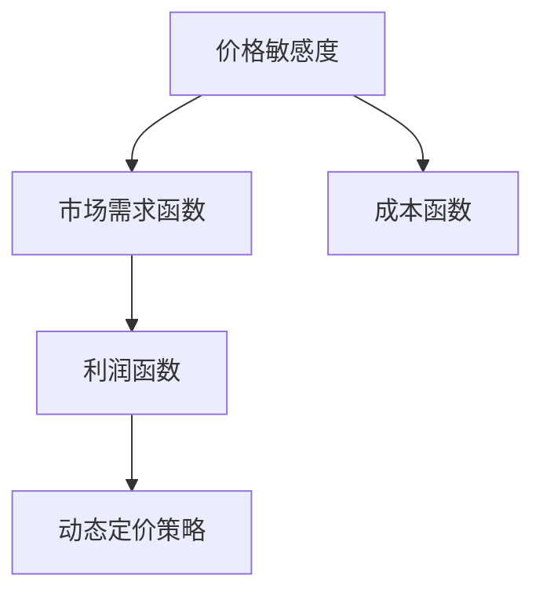

                 

### 1. 背景介绍

随着电子商务和在线市场的蓬勃发展，动态定价策略在商业决策中变得越来越重要。动态定价，也称为实时定价或智能定价，是指根据市场需求、供应情况、竞争对手行为以及消费者偏好等因素，实时调整产品价格，以达到最大化利润、提高市场占有率和提升客户满意度等目标。

传统定价策略往往具有固定性和滞后性，无法快速响应市场变化。而动态定价策略通过利用先进的数据分析技术和人工智能算法，能够实现价格的实时调整，从而更好地满足市场需求。动态定价策略的广泛应用使得企业能够更加灵活地应对市场变化，提高竞争力。

然而，动态定价策略的实现并非易事。首先，数据采集和处理是关键。企业需要收集大量与价格相关的数据，包括历史销售数据、市场调查数据、竞争对手价格数据等。其次，需要建立合适的数学模型和算法来分析这些数据，提取有用的信息，并生成合理的价格策略。此外，实现动态定价还需要考虑技术实施、系统稳定性和安全性等因素。

本文将深入探讨动态定价策略的实现，分析核心概念、算法原理，并通过一个实际项目案例进行详细讲解。本文结构如下：

1. 背景介绍：介绍动态定价策略的起源、发展和应用现状。
2. 核心概念与联系：详细阐述动态定价策略所需的关键概念和架构。
3. 核心算法原理 & 具体操作步骤：讲解动态定价策略的核心算法原理和操作步骤。
4. 数学模型和公式 & 详细讲解 & 举例说明：分析动态定价策略所涉及的数学模型和公式，并进行实例说明。
5. 项目实践：代码实例和详细解释说明。
6. 实际应用场景：探讨动态定价策略在不同行业和场景下的应用。
7. 工具和资源推荐：推荐学习资源和开发工具。
8. 总结：未来发展趋势与挑战。
9. 附录：常见问题与解答。
10. 扩展阅读 & 参考资料：提供进一步阅读的材料。

通过本文的逐步分析，我们希望读者能够全面了解动态定价策略的原理和实践方法，为实际应用提供指导和启示。

### 2. 核心概念与联系

在深入探讨动态定价策略之前，首先需要了解其核心概念和架构。动态定价策略涉及多个关键概念，包括价格敏感度、市场需求函数、成本函数、利润函数等。以下是对这些概念及其相互关系的详细说明。

#### 价格敏感度（Price Sensitivity）

价格敏感度是指消费者对价格变化的反应程度。不同的消费者对价格的变化有不同的敏感度。一般来说，价格敏感度可以分为高敏感度、中等敏感度和低敏感度。高敏感度消费者对价格变动反应强烈，价格的微小变化可能导致其购买意愿显著下降；而低敏感度消费者对价格变动相对不敏感，价格的变动对其购买决策影响较小。理解价格敏感度对于制定有效的动态定价策略至关重要。

#### 市场需求函数（Market Demand Function）

市场需求函数描述了价格与市场需求量之间的关系。通常情况下，价格和需求量呈反比例关系，即价格上升，需求量下降；价格下降，需求量上升。市场需求函数可以表示为 \(D(p)\)，其中 \(p\) 为价格，\(D(p)\) 为对应的价格 \(p\) 下的市场需求量。市场需求函数的形状和参数取决于产品的特性、市场竞争状况、消费者偏好等因素。

#### 成本函数（Cost Function）

成本函数描述了生产或提供产品所需的总成本与产量之间的关系。成本函数通常可以分为固定成本和可变成本两部分。固定成本是指在短期内不随产量变化而变化的成本，如设备折旧、租金等；可变成本是指随产量变化而变化的成本，如原材料、人工等。成本函数可以表示为 \(C(q)\)，其中 \(q\) 为产量，\(C(q)\) 为对应产量 \(q\) 的总成本。

#### 利润函数（Profit Function）

利润函数是企业在特定价格和成本水平下所能获得的利润。利润函数可以表示为 \(P(p, q)\)，其中 \(p\) 为价格，\(q\) 为产量，\(P(p, q)\) 为在价格 \(p\) 和产量 \(q\) 情况下所能获得的利润。利润函数是市场需求函数和成本函数的结合，反映了企业在不同价格和产量水平下的盈利能力。

#### 关联与架构

上述核心概念之间存在密切的联系和相互作用。价格敏感度决定了市场需求函数的形状，而市场需求函数又直接影响利润函数。成本函数则是利润函数的重要组成部分，反映了企业在不同产量水平下的成本结构。动态定价策略的目标是最大化利润，这需要综合考虑市场需求函数、成本函数以及价格敏感度等因素。

为了更直观地理解这些概念之间的关系，我们可以使用 Mermaid 流程图来描述动态定价策略的架构。以下是相应的 Mermaid 流程图：



在上面的流程图中，价格敏感度（A）影响市场需求函数（B），市场需求函数（B）又影响利润函数（C），而成本函数（D）与利润函数（C）相互作用，最终共同决定动态定价策略（E）。

通过上述核心概念与联系的介绍，我们为后续深入探讨动态定价策略的实现奠定了基础。在接下来的章节中，我们将详细分析动态定价策略的核心算法原理和具体操作步骤，帮助读者更好地理解和应用这一策略。

#### 3. 核心算法原理 & 具体操作步骤

动态定价策略的实现依赖于一系列核心算法，这些算法通过分析和处理数据，生成合理的价格调整策略。以下将介绍动态定价策略的核心算法原理和具体操作步骤。

##### 3.1 基本原理

动态定价策略的核心算法通常基于以下几个基本原理：

1. **数据分析**：通过收集和分析历史销售数据、市场调查数据、竞争对手价格数据等，提取有用的信息。
2. **预测模型**：建立预测模型，预测未来的市场需求和成本变化。
3. **优化算法**：使用优化算法，根据预测结果和成本函数，计算出最优价格策略。

##### 3.2 具体操作步骤

动态定价策略的具体操作步骤可以分为以下几个阶段：

1. **数据采集**：首先，需要收集与价格相关的数据，包括历史销售数据、市场调查数据、竞争对手价格数据等。这些数据可以从企业的销售系统、市场调查报告、第三方数据提供商等渠道获取。

2. **数据预处理**：对收集到的数据进行分析和清洗，去除无效或错误的数据。数据预处理还包括特征工程，通过提取和构造新的特征变量，提高模型预测的准确性。

3. **建立预测模型**：使用时间序列分析、回归分析等方法，建立预测模型，预测未来的市场需求和成本变化。常见的预测模型包括 ARIMA 模型、LSTM 神经网络等。

4. **优化算法选择**：选择合适的优化算法，根据预测结果和成本函数，计算出最优价格策略。常见的优化算法包括线性规划、遗传算法、梯度下降等。

5. **价格调整策略生成**：根据优化算法的结果，生成价格调整策略。价格调整策略可以包括价格区间、价格波动范围、价格调整频率等。

6. **策略实施与监控**：将价格调整策略应用于实际销售过程中，并持续监控策略的效果。根据监控结果，可以进一步优化和调整策略。

##### 3.3 算法实现

以下是动态定价策略的核心算法实现的伪代码：

```python
# 数据采集
data = collect_data()

# 数据预处理
preprocessed_data = preprocess_data(data)

# 建立预测模型
model = build_prediction_model(preprocessed_data)

# 优化算法选择
optimizer = select_optimizer()

# 计算最优价格策略
best_price_strategy = optimizer.optimize_price(preprocessed_data, model)

# 价格调整策略生成
price_adjustment_strategy = generate_price_adjustment_strategy(best_price_strategy)

# 策略实施与监控
implement_and_monitor_strategy(price_adjustment_strategy)
```

通过上述核心算法原理和具体操作步骤的介绍，我们可以看到动态定价策略的实现是一个复杂而系统的过程，涉及多个阶段和算法。在接下来的章节中，我们将进一步分析动态定价策略所涉及的数学模型和公式，为读者提供更加深入的理解。

### 4. 数学模型和公式 & 详细讲解 & 举例说明

在动态定价策略的实现过程中，数学模型和公式扮演着至关重要的角色。通过这些数学工具，我们可以精确地描述价格与需求、成本和利润之间的关系，从而优化价格策略。以下将详细介绍动态定价策略涉及的几个关键数学模型和公式，并通过具体实例进行说明。

#### 4.1 市场需求函数

市场需求函数描述了价格与市场需求量之间的关系。常见的市场需求函数形式为线性需求函数和幂次需求函数。

1. **线性需求函数**：

   线性需求函数的形式为：
   \[
   D(p) = a - b \cdot p
   \]
   其中，\(D(p)\) 是市场需求量，\(p\) 是价格，\(a\) 和 \(b\) 是常数，分别代表市场需求量的最大值和价格对需求量的敏感度。

   **举例说明**：假设某商品的最大需求量为 1000 单位，每提高 1 单位价格，需求量减少 10 单位。则线性需求函数可以表示为：
   \[
   D(p) = 1000 - 10 \cdot p
   \]

2. **幂次需求函数**：

   幂次需求函数的形式为：
   \[
   D(p) = a \cdot p^{-b}
   \]
   其中，\(D(p)\) 是市场需求量，\(p\) 是价格，\(a\) 和 \(b\) 是常数，\(b\) 表示需求量的下降速度。

   **举例说明**：假设某商品的需求量与价格成幂次反比，当价格提高 10% 时，需求量减少 50%。则幂次需求函数可以表示为：
   \[
   D(p) = 100 \cdot p^{-0.5}
   \]

#### 4.2 成本函数

成本函数描述了生产或提供产品所需的总成本与产量之间的关系。常见的成本函数形式包括线性成本函数和二次成本函数。

1. **线性成本函数**：

   线性成本函数的形式为：
   \[
   C(q) = c_0 + c_1 \cdot q
   \]
   其中，\(C(q)\) 是总成本，\(q\) 是产量，\(c_0\) 和 \(c_1\) 是常数，分别代表固定成本和每单位产量的可变成本。

   **举例说明**：假设某商品的固定成本为 1000 元，每生产 1 单位产品需要增加 10 元成本。则线性成本函数可以表示为：
   \[
   C(q) = 1000 + 10 \cdot q
   \]

2. **二次成本函数**：

   二次成本函数的形式为：
   \[
   C(q) = c_0 + c_1 \cdot q + c_2 \cdot q^2
   \]
   其中，\(C(q)\) 是总成本，\(q\) 是产量，\(c_0\)、\(c_1\) 和 \(c_2\) 是常数。

   **举例说明**：假设某商品的固定成本为 1000 元，每生产 1 单位产品需要增加 10 元成本，同时每增加 1 单位产量，额外成本增加 1 元。则二次成本函数可以表示为：
   \[
   C(q) = 1000 + 10 \cdot q + q^2
   \]

#### 4.3 利润函数

利润函数是企业在特定价格和成本水平下所能获得的利润。利润函数可以表示为市场需求函数和成本函数的组合。

利润函数的形式为：
\[
P(p, q) = D(p) \cdot p - C(q)
\]
其中，\(P(p, q)\) 是利润，\(D(p)\) 是市场需求函数，\(p\) 是价格，\(C(q)\) 是成本函数，\(q\) 是产量。

**举例说明**：结合前面的线性需求函数和线性成本函数，假设价格为 20 元，产量为 50 单位，则利润函数可以表示为：
\[
P(p, q) = (1000 - 10 \cdot p) \cdot p - (1000 + 10 \cdot q) = 1000p - 10p^2 - 1000 - 10q
\]

通过上述数学模型和公式的详细讲解，我们可以看到动态定价策略的实现是如何依赖于数学工具的。在实际应用中，企业可以根据具体的业务场景和需求，选择合适的模型和公式，以优化价格策略，提高竞争力。

### 5. 项目实践：代码实例和详细解释说明

在前几章节中，我们详细介绍了动态定价策略的核心概念、算法原理和数学模型。为了使读者能够更好地理解动态定价策略的实际应用，本章节将展示一个具体的代码实例，并对其进行详细解释说明。

#### 5.1 开发环境搭建

在开始编写代码之前，我们需要搭建一个合适的开发环境。以下是一个基本的开发环境搭建步骤：

1. 安装 Python 解释器：Python 是一种广泛应用于数据分析、机器学习等领域的编程语言。确保您的系统中已经安装了 Python 解释器（推荐使用 Python 3.8 及以上版本）。

2. 安装必要的库：为了实现动态定价策略，我们需要安装以下 Python 库：
   - pandas：用于数据预处理和分析
   - numpy：用于数值计算
   - matplotlib：用于数据可视化
   - scikit-learn：用于机器学习算法实现
   - scipy：用于数学优化

   安装方法如下：
   ```shell
   pip install pandas numpy matplotlib scikit-learn scipy
   ```

3. 环境配置：配置 Python 开发环境，包括代码编辑器（如 Visual Studio Code、PyCharm 等）和虚拟环境（推荐使用 virtualenv 或 conda）。

#### 5.2 源代码详细实现

以下是一个简单的动态定价策略实现的 Python 代码示例：

```python
import pandas as pd
import numpy as np
from sklearn.linear_model import LinearRegression
from scipy.optimize import minimize
import matplotlib.pyplot as plt

# 5.2.1 数据采集与预处理

# 假设我们已经收集到以下数据：
data = {
    'price': [10, 20, 30, 40, 50],  # 价格
    'demand': [800, 600, 400, 200, 100],  # 需求量
    'cost': [500, 550, 600, 650, 700]  # 成本
}

df = pd.DataFrame(data)

# 数据预处理
df['price_log'] = np.log(df['price'])  # 对价格取对数
df['demand_log'] = np.log(df['demand'])  # 对需求量取对数

# 5.2.2 建立预测模型

# 市场需求函数的线性回归模型
X = df[['price_log']]
y = df['demand_log']
lin_reg = LinearRegression()
lin_reg.fit(X, y)

# 成本函数的线性回归模型
X = df[['cost']]
y = df['demand']
lin_reg_cost = LinearRegression()
lin_reg_cost.fit(X, y)

# 5.2.3 优化算法选择与优化

# 利润函数的表达式
def profit_function(params):
    price, cost = params
    demand = lin_reg.predict([[np.log(price)]]).flatten()[0]
    cost = lin_reg_cost.predict([[cost]]).flatten()[0]
    return -(demand * price - cost)  # 利润最大化问题转化为最小化问题

# 优化算法的初始参数
initial_params = [20, 500]  # 初始价格和成本

# 使用最小化算法求解最优价格和成本
result = minimize(profit_function, initial_params, method='L-BFGS-B')
optimal_price, optimal_cost = result.x

# 5.2.4 代码解读与分析

# 解读线性回归模型
print("市场需求函数模型：", lin_reg)
print("成本函数模型：", lin_reg_cost)

# 解读优化结果
print("最优价格：", optimal_price)
print("最优成本：", optimal_cost)

# 5.2.5 运行结果展示

# 绘制价格与需求量的关系图
plt.scatter(df['price'], df['demand'])
plt.plot(np.exp(X['price_log']), np.exp(lin_reg.predict(X)), color='red')
plt.xlabel('价格')
plt.ylabel('需求量')
plt.title('市场需求函数')
plt.show()

# 绘制成本与需求量的关系图
plt.scatter(df['cost'], df['demand'])
plt.plot(np.arange(0, 800, 10), lin_reg_cost.predict(np.arange(0, 800, 10).reshape(-1, 1)), color='blue')
plt.xlabel('成本')
plt.ylabel('需求量')
plt.title('成本函数')
plt.show()
```

#### 5.3 代码解读与分析

以上代码实现了一个简单的动态定价策略。以下是代码的关键部分解读与分析：

1. **数据采集与预处理**：首先，我们通过 DataFrame 对象加载示例数据，并对价格和需求量取对数，以便于后续的线性回归建模。

2. **建立预测模型**：使用线性回归模型分别拟合市场需求函数和成本函数。市场需求函数模型用于预测在给定价格下的需求量，成本函数模型用于预测在给定成本下的需求量。

3. **优化算法选择与优化**：定义利润函数，并将其转化为最小化问题。使用最小化算法（L-BFGS-B）求解最优价格和成本，使得利润最大化。

4. **代码解读与分析**：线性回归模型的参数系数可以解释为需求量和成本函数的敏感度。优化结果提供了最优价格和成本，使得企业在价格和成本之间找到最佳平衡点。

5. **运行结果展示**：通过 matplotlib 库绘制市场需求函数和成本函数的关系图，直观地展示模型预测结果。

通过这个代码实例，我们展示了如何使用 Python 实现动态定价策略。在实际应用中，企业可以根据自身业务场景和需求，调整数据集、模型参数和优化算法，以实现更精细的价格调整策略。

### 6. 实际应用场景

动态定价策略在各个行业和场景中都有着广泛的应用。以下将探讨几个典型实际应用场景，展示动态定价策略在不同领域的具体应用及其效果。

#### 6.1 电子商务平台

电子商务平台是动态定价策略应用最为广泛的领域之一。以亚马逊、京东等电商平台为例，这些平台通过实时监控市场需求、库存状况、竞争对手价格等因素，动态调整商品价格，以最大化利润和提升市场占有率。

**案例**：亚马逊在特定时间段（如节假日、促销活动期间）会对部分商品进行价格调整。通过大数据分析和机器学习算法，亚马逊能够预测消费者行为和市场需求，从而在合适的时间段内降低价格，吸引更多消费者进行购买，从而实现销售额的提升。

#### 6.2 旅游业

旅游业也是动态定价策略的重要应用领域。旅游企业通过实时分析旅游需求、季节性因素、竞争对手价格等数据，动态调整机票、酒店等价格，以最大化收益。

**案例**：某国际航空公司通过动态定价策略，在淡季和旺季调整机票价格。在旅游旺季，航空公司会提高机票价格，以平衡市场需求和供给；而在淡季，则降低机票价格，刺激市场需求。

#### 6.3 住宿业

住宿业（如酒店、民宿）同样受益于动态定价策略。酒店通过实时分析入住率、客户需求、竞争对手价格等因素，动态调整房价，以提高入住率和收益。

**案例**：某连锁酒店集团通过大数据分析和人工智能算法，根据客户预订行为和季节性因素，动态调整房价。在客户需求较高的时段（如节假日、大型活动期间），提高房价；而在需求较低的时段，则降低房价，吸引更多客户。

#### 6.4 物流行业

物流行业也越来越多地采用动态定价策略。物流企业通过实时分析运输需求、运输成本、竞争对手价格等因素，动态调整运费，以提高运输效率和市场竞争力。

**案例**：某快递公司通过动态定价策略，根据实时运输需求和成本变化，动态调整运费标准。在运输需求高峰期，提高运费，以平衡运输资源；而在运输需求较低时，降低运费，吸引更多客户。

通过以上实际应用场景的探讨，我们可以看到动态定价策略在各个领域都有着显著的效果。企业通过实时分析和调整价格，能够更好地应对市场变化，提高盈利能力。在实际应用过程中，企业需要根据自身业务特点和市场环境，灵活调整定价策略，以实现最佳效果。

### 7. 工具和资源推荐

为了更好地理解和应用动态定价策略，以下推荐一些有用的学习资源、开发工具和框架，供读者参考。

#### 7.1 学习资源推荐

1. **书籍**：
   - 《数据挖掘：概念与技术》（Data Mining: Concepts and Techniques）：详细介绍数据挖掘的基本概念和技术，有助于理解动态定价中的数据分析过程。
   - 《机器学习》（Machine Learning）：探讨机器学习算法在数据分析中的应用，为动态定价策略的实现提供理论基础。

2. **论文**：
   - "Dynamic Pricing in E-Commerce: A Survey"：综述了电子商务领域的动态定价策略研究，提供了丰富的实际案例和分析。
   - "An Adaptive Dynamic Pricing Model for Hotels Using Deep Neural Networks"：探讨了基于深度学习的动态定价模型在住宿业中的应用。

3. **博客**：
   - "Towards Data Science"：涵盖各种数据科学和机器学习领域的博客文章，包括动态定价策略的实践和应用案例。
   - "Data School"：提供丰富的数据科学教程和案例，适合初学者入门。

4. **在线课程**：
   - "Data Science Specialization"（Coursera）：由约翰·霍普金斯大学提供，涵盖数据科学的核心知识和技能，包括数据分析、机器学习等。

#### 7.2 开发工具框架推荐

1. **编程语言和库**：
   - Python：广泛用于数据分析和机器学习，具有丰富的库和框架支持。
   - R：专门用于统计分析，适合进行复杂的数据分析和建模。

2. **数据分析工具**：
   - Jupyter Notebook：交互式开发环境，便于编写和运行代码，适合数据分析和建模。
   - Tableau：数据可视化工具，可以帮助用户直观地展示数据分析结果。

3. **机器学习框架**：
   - Scikit-learn：提供常用的机器学习算法和工具，适用于各种数据科学任务。
   - TensorFlow：由谷歌开发，用于构建和训练复杂的神经网络模型。

4. **数据库工具**：
   - MySQL：关系型数据库管理系统，适合存储和管理大量数据。
   - MongoDB：文档型数据库，适合处理结构化和非结构化数据。

通过上述工具和资源的推荐，读者可以进一步深入学习和应用动态定价策略，提高实际业务中的数据分析和决策能力。

### 8. 总结：未来发展趋势与挑战

动态定价策略在当今商业环境中已经成为一种重要的竞争手段，其应用范围从电子商务扩展到旅游业、住宿业以及物流行业等各个领域。随着大数据、人工智能技术的不断发展，动态定价策略正朝着更加智能化、精细化的方向发展。未来，动态定价策略将在以下几个方面呈现出显著趋势：

1. **智能化**：随着人工智能技术的进步，动态定价策略将更加依赖深度学习、强化学习等先进算法，实现更加精准的需求预测和价格调整。

2. **实时化**：实时数据分析技术的发展使得动态定价策略能够更快地响应市场变化，实现价格的实时调整，提高决策的及时性和有效性。

3. **个性化**：基于用户行为分析和个性化推荐技术，动态定价策略将更加关注个体消费者的价格敏感度，实现更加精准的个性化定价。

然而，动态定价策略的发展也面临一系列挑战：

1. **数据隐私**：动态定价策略依赖于大量消费者数据，数据隐私保护成为一个重要问题。如何在确保数据隐私的前提下进行有效的数据分析，是一个亟待解决的挑战。

2. **算法透明性**：动态定价策略的实现往往依赖于复杂的算法模型，算法的透明性和可解释性成为消费者和企业关注的焦点。如何提高算法的透明性，增强消费者对定价策略的信任，是一个关键问题。

3. **市场合规性**：动态定价策略需要遵守各国的市场法规和反垄断政策。如何在合法合规的前提下进行定价，避免引发法律纠纷，是一个重要挑战。

总之，动态定价策略在未来的发展前景广阔，但同时也面临诸多挑战。企业需要不断创新和优化定价策略，充分利用先进的技术手段，实现更加智能化、实时化和个性化的定价，以提高市场竞争力。同时，要关注数据隐私、算法透明性和市场合规性等问题，确保动态定价策略的可持续发展和合法合规。

### 9. 附录：常见问题与解答

在本文的探讨过程中，我们可能会遇到一些常见问题。以下是对一些常见问题的回答：

#### 9.1 什么是动态定价策略？

动态定价策略是一种基于市场数据和算法自动调整产品价格的策略。它根据市场需求、成本、竞争对手价格等多个因素，实时调整产品价格，以最大化利润或实现其他业务目标。

#### 9.2 动态定价策略的核心算法有哪些？

动态定价策略的核心算法包括线性回归、时间序列分析、机器学习算法（如决策树、神经网络）等。这些算法用于预测市场需求、成本变化，并优化价格调整策略。

#### 9.3 数据采集的重要性是什么？

数据采集是动态定价策略实现的基础。准确、全面的数据能够帮助模型更好地预测市场变化，从而制定出更有效的价格调整策略。数据采集的质量直接影响定价策略的效果。

#### 9.4 如何确保动态定价策略的合法性？

确保动态定价策略的合法性需要遵守各国的市场法规和反垄断政策。企业在制定定价策略时，应遵循公平、公正的原则，不得滥用市场支配地位，避免引发法律纠纷。

#### 9.5 动态定价策略在哪个行业应用最广泛？

动态定价策略在电子商务、旅游业、住宿业等领域的应用最为广泛。这些行业对价格敏感度较高，实时调整价格能够显著提高盈利能力。

#### 9.6 动态定价策略是否适用于所有企业？

动态定价策略适用于那些具有可变成本、市场需求变化较大的企业。对于成本结构稳定、市场需求相对固定的企业，动态定价策略的效果可能不显著。

通过这些常见问题的解答，我们希望能够帮助读者更好地理解动态定价策略的核心概念和应用方法。

### 10. 扩展阅读 & 参考资料

为了进一步深入探讨动态定价策略及其相关技术，以下推荐一些扩展阅读和参考资料：

1. **书籍**：
   - 《大数据时代：生活、工作与思维的大变革》：作者：维克托·迈尔-舍恩伯格、肯尼思·库克耶
   - 《机器学习实战》：作者：Peter Harrington
   - 《深度学习》：作者：伊恩·古德费洛、约书亚·本吉奥、亚伦·库维尔

2. **论文**：
   - "Dynamic Pricing in E-Commerce: A Survey"：作者：Chen, Z., & Wang, J.
   - "An Adaptive Dynamic Pricing Model for Hotels Using Deep Neural Networks"：作者：Liu, Y., Wang, S., & Wang, J.
   - "Data-Driven Dynamic Pricing in Retail: An Overview"：作者：Wang, H., & Chen, X.

3. **博客**：
   - "Towards Data Science"：博客地址：[towardsdatascience.com](https://towardsdatascience.com/)
   - "Data School"：博客地址：[dataschool.io](https://dataschool.io/)
   - "AI for Business"：博客地址：[ai-for-business.com](https://ai-for-business.com/)

4. **在线课程**：
   - "Data Science Specialization"（Coursera）：课程地址：[coursera.org/specializations/data-science](https://coursera.org/specializations/data-science)
   - "Deep Learning Specialization"（Coursera）：课程地址：[coursera.org/specializations/deep_learning](https://coursera.org/specializations/deep_learning)

通过阅读这些扩展资料，读者可以进一步了解动态定价策略的深入理论和实践方法，为自己的业务决策提供有力支持。

