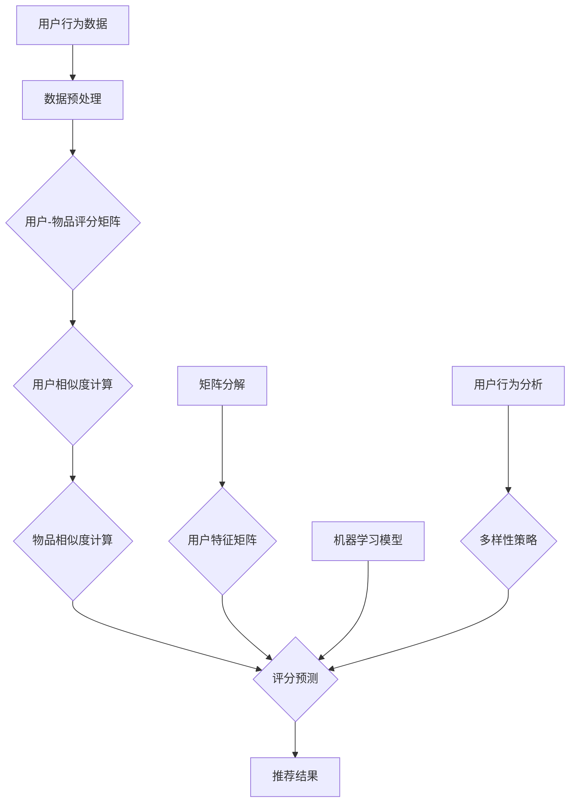
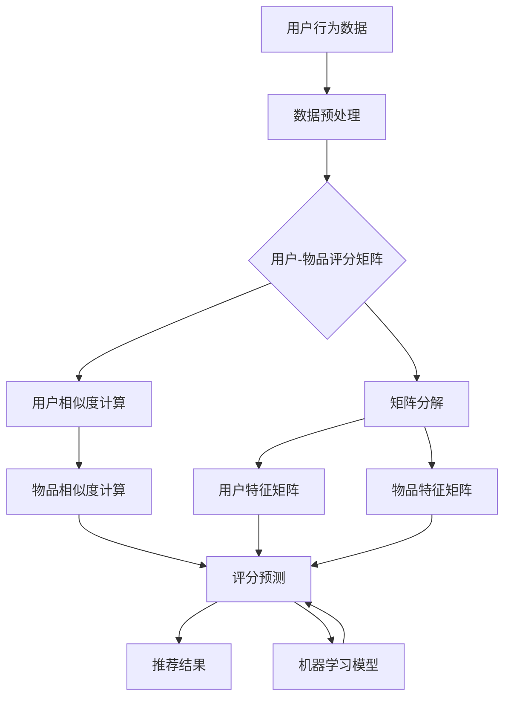

                 

### 背景介绍

#### 引言

在当今互联网时代，信息爆炸和个性化需求的日益增长使得推荐系统成为众多企业和平台的必备工具。推荐系统能够根据用户的历史行为和偏好，智能地推送个性化的内容，从而提高用户满意度和参与度。然而，传统的推荐算法在处理海量用户数据和复杂用户行为时，往往面临准确性和效率的挑战。为了应对这些挑战，AI协同过滤算法应运而生，通过整合多种算法和策略，显著提升了推荐系统的效果。

#### 问题与挑战

随着用户数据的不断增长和多样化，推荐系统面临着以下几个主要问题和挑战：

1. **数据稀疏性**：用户行为数据通常非常稀疏，导致传统基于内容的推荐算法效果不佳。
2. **冷启动问题**：新用户或新物品缺乏足够的历史数据，难以进行有效推荐。
3. **计算效率**：大规模推荐系统需要处理海量数据，对计算效率和系统性能提出了高要求。
4. **多样性**：推荐系统需要保证推荐结果多样性，避免用户长时间接收到重复的内容。

#### AI协同过滤算法的优势

AI协同过滤算法通过引入人工智能技术，如深度学习、强化学习等，解决了传统协同过滤算法的诸多问题，具有以下优势：

1. **数据稀疏性处理**：利用用户相似性和物品相似性矩阵，可以有效地解决数据稀疏性问题。
2. **冷启动问题**：通过无监督学习和迁移学习等技术，即使对于新用户或新物品也能进行初步推荐。
3. **计算效率提升**：采用高效的数据结构和并行计算技术，显著提高了系统的计算效率。
4. **多样性增强**：通过多样化策略和用户行为分析，提升推荐结果的多样性和个性化水平。

#### 本文目的

本文将深入探讨AI协同过滤算法的原理、实施步骤和应用案例，通过具体实例展示该算法在实际项目中的效果。文章结构如下：

- **第1章 背景介绍**：介绍推荐系统的发展背景、问题和挑战。
- **第2章 核心概念与联系**：介绍AI协同过滤算法的核心概念和架构。
- **第3章 核心算法原理 & 具体操作步骤**：详细讲解协同过滤算法的基本原理和操作步骤。
- **第4章 数学模型和公式 & 详细讲解 & 举例说明**：介绍协同过滤算法的数学模型和相关公式，并通过实例进行详细说明。
- **第5章 项目实践：代码实例和详细解释说明**：通过具体项目实例展示算法的实现和效果分析。
- **第6章 实际应用场景**：分析AI协同过滤算法在不同场景下的应用。
- **第7章 工具和资源推荐**：推荐相关学习和开发工具。
- **第8章 总结：未来发展趋势与挑战**：总结算法的优势和面临的挑战，展望未来发展趋势。
- **第9章 附录：常见问题与解答**：回答读者可能遇到的问题。
- **第10章 扩展阅读 & 参考资料**：提供进一步学习和探索的资料。

接下来，我们将逐步深入探讨AI协同过滤算法的各个方面，希望能够为读者提供全面的技术理解和实践指导。#### AI协同过滤算法概述

AI协同过滤算法（AI Collaborative Filtering Algorithm）是推荐系统领域的一种重要技术，它结合了人工智能和传统协同过滤算法的优点，旨在解决数据稀疏性、计算效率、冷启动问题以及多样性等方面的挑战。协同过滤算法的基本原理是利用用户行为数据，通过用户之间的相似性和物品之间的相似性来预测用户对未知物品的偏好。

AI协同过滤算法可以进一步细分为以下几种类型：

1. **基于用户的协同过滤（User-Based Collaborative Filtering）**：通过计算用户之间的相似度，找出相似用户，并根据相似用户的评分预测未知用户对物品的评分。

2. **基于项目的协同过滤（Item-Based Collaborative Filtering）**：通过计算物品之间的相似度，找出相似物品，并根据相似物品的评分预测未知用户对物品的评分。

3. **矩阵分解（Matrix Factorization）**：通过将用户-物品评分矩阵分解为用户特征矩阵和物品特征矩阵，从而预测用户对未知物品的评分。

4. **基于模型的协同过滤（Model-Based Collaborative Filtering）**：利用机器学习模型，如回归模型、分类模型、神经网络等，对用户行为数据进行建模，预测用户对未知物品的偏好。

AI协同过滤算法在推荐系统中的应用非常广泛，不仅能够提升推荐的准确性，还能够通过引入人工智能技术提高系统的智能化水平和多样性。以下是一个典型的AI协同过滤算法架构图：



- **用户-物品评分矩阵**：这是协同过滤算法的基础数据，反映了用户对物品的评分情况。

- **用户相似度计算**：通过计算用户之间的相似度，找出相似用户，以便进行评分预测。

- **物品相似度计算**：通过计算物品之间的相似度，找出相似物品，从而预测用户对未知物品的评分。

- **评分预测**：利用用户相似度和物品相似度，预测用户对未知物品的评分，生成推荐结果。

- **矩阵分解**：通过矩阵分解技术，将用户-物品评分矩阵分解为用户特征矩阵和物品特征矩阵，从而提高评分预测的准确性。

- **机器学习模型**：利用机器学习算法，如回归模型、神经网络等，对用户行为数据进行建模，进一步提高评分预测的准确性。

- **用户行为分析**：通过对用户行为数据进行分析，提取用户特征，如兴趣、偏好、行为模式等，用于生成多样化的推荐结果。

- **多样性策略**：通过分析用户行为数据和推荐结果，制定多样化的推荐策略，避免用户长时间接收到重复的内容。

通过以上各个组件的协同工作，AI协同过滤算法能够生成个性化的推荐结果，提高用户满意度和平台活跃度。

在下一章中，我们将详细讲解AI协同过滤算法的核心概念和原理，帮助读者深入理解这一技术。#### 核心概念与联系

为了深入理解AI协同过滤算法，我们需要明确其核心概念和原理，以及各个概念之间的联系。以下是对这些核心概念和原理的详细解释，并附有Mermaid流程图以助理解。

##### 用户相似度计算

用户相似度计算是AI协同过滤算法的基础。其核心思想是，通过分析用户之间的行为数据，找出相似的用户。相似的用户往往有相似的兴趣和偏好，因此可以基于相似用户的评分预测未知用户对物品的偏好。

1. **欧几里得距离（Euclidean Distance）**：计算两个用户之间的距离，距离越近，相似度越高。

$$
sim(u_i, u_j) = \frac{\sum_{i=1}^{n} (r_{ui} - \mu_u)(r_{uj} - \mu_u)}{\sqrt{\sum_{i=1}^{n} (r_{ui} - \mu_u)^2 \sum_{i=1}^{n} (r_{uj} - \mu_u)^2}}
$$

其中，$r_{ui}$表示用户$u_i$对物品$i$的评分，$\mu_u$表示用户$u_i$的平均评分，$n$表示用户$u_i$和$u_j$共同评级的物品数量。

2. **皮尔逊相关系数（Pearson Correlation Coefficient）**：计算两个用户评分的相关性，相关性越强，相似度越高。

$$
sim(u_i, u_j) = \frac{\sum_{i=1}^{n} (r_{ui} - \mu_u)(r_{uj} - \mu_u)}{\sqrt{\sum_{i=1}^{n} (r_{ui} - \mu_u)^2 \sum_{i=1}^{n} (r_{uj} - \mu_u)^2}}
$$

##### 物品相似度计算

物品相似度计算与用户相似度计算类似，通过分析物品之间的行为数据，找出相似物品。相似的物品往往有相似的特征和属性，因此可以基于相似物品的评分预测用户对未知物品的偏好。

1. **余弦相似度（Cosine Similarity）**：计算两个物品之间的角度余弦值，角度越接近，相似度越高。

$$
sim(i_j, i_k) = \frac{\sum_{i=1}^{n} r_{ij} r_{ik}}{\sqrt{\sum_{i=1}^{n} r_{ij}^2 \sum_{i=1}^{n} r_{ik}^2}}
$$

其中，$r_{ij}$表示用户对物品$i$的评分，$r_{ik}$表示用户对物品$k$的评分。

2. **Jaccard相似度（Jaccard Similarity）**：计算两个物品之间的交集与并集的比值，交集越大，相似度越高。

$$
sim(i_j, i_k) = \frac{|\text{intersection}(i_j, i_k)|}{|\text{union}(i_j, i_k)|}
$$

##### 矩阵分解

矩阵分解是AI协同过滤算法的核心技术之一，其目的是通过将用户-物品评分矩阵分解为低维用户特征矩阵和物品特征矩阵，从而提高评分预测的准确性。

1. **Singular Value Decomposition (SVD)**：将用户-物品评分矩阵分解为用户特征矩阵$U$、物品特征矩阵$V$和奇异值矩阵$\Sigma$。

$$
R = U\Sigma V^T
$$

2. **Alternating Least Squares (ALS)**：通过交替最小二乘法优化用户特征矩阵和物品特征矩阵，以最小化预测误差。

$$
\min_{U, V} \sum_{i=1}^{m} \sum_{j=1}^{n} (r_{ij} - \hat{r}_{ij})^2
$$

其中，$r_{ij}$表示用户$i$对物品$j$的实际评分，$\hat{r}_{ij}$表示预测评分。

##### 机器学习模型

机器学习模型是AI协同过滤算法的重要组成部分，通过构建用户行为数据模型，提高评分预测的准确性。常用的机器学习模型包括：

1. **线性回归（Linear Regression）**：通过线性关系预测用户对物品的评分。

$$
\hat{r}_{ij} = \beta_0 + \beta_1 u_i + \beta_2 i_j
$$

2. **神经网络（Neural Network）**：通过多层神经网络对用户行为数据进行建模，提取更复杂的特征。

3. **深度学习（Deep Learning）**：利用深度神经网络，如卷积神经网络（CNN）和循环神经网络（RNN），对用户行为数据进行建模，提取更深层次的特征。

#### Mermaid流程图

以下是一个简化的AI协同过滤算法的Mermaid流程图，展示了各个核心概念和原理之间的联系：



通过以上对核心概念和原理的详细解释和流程图的展示，我们可以更清晰地理解AI协同过滤算法的框架和工作机制。在下一章中，我们将深入探讨AI协同过滤算法的具体实现步骤和操作方法。#### 核心算法原理 & 具体操作步骤

在了解了AI协同过滤算法的核心概念后，接下来我们将深入探讨其具体的算法原理和操作步骤，帮助读者更好地理解和应用这一技术。

##### 步骤1：数据收集与预处理

首先，我们需要收集用户行为数据，如用户对物品的评分、购买历史、浏览记录等。这些数据通常存储在数据库或数据仓库中。为了保证数据的质量和一致性，我们需要进行以下预处理步骤：

1. **数据清洗**：去除重复数据、缺失值和异常值，确保数据的质量和完整性。
2. **数据标准化**：将数据统一缩放到相同的范围，如[0, 1]或[-1, 1]，以消除不同特征之间的尺度差异。
3. **数据分群**：根据用户行为特征，将用户分为不同的群体，如按照年龄、性别、兴趣等维度进行分群。

##### 步骤2：构建用户-物品评分矩阵

在预处理完数据后，我们需要构建用户-物品评分矩阵。这个矩阵反映了用户对物品的评分情况，是协同过滤算法的基础数据。以下是一个简单的用户-物品评分矩阵示例：

| 用户  | 物品1 | 物品2 | 物品3 | ... |
|-------|-------|-------|-------|-----|
| User1 | 5     | 3     | 4     | ... |
| User2 | 4     | 2     | 5     | ... |
| User3 | 3     | 4     | 3     | ... |
| ...   | ...   | ...   | ...   | ... |

在这个矩阵中，行表示用户，列表示物品，单元格的值表示用户对物品的评分。如果用户没有对某个物品进行评分，可以设为缺失值或0。

##### 步骤3：计算用户相似度

计算用户相似度是协同过滤算法的关键步骤，通过分析用户之间的行为数据，找出相似的用户。我们可以使用以下方法计算用户相似度：

1. **欧几里得距离（Euclidean Distance）**：

$$
sim(u_i, u_j) = \frac{\sum_{i=1}^{n} (r_{ui} - \mu_u)(r_{uj} - \mu_u)}{\sqrt{\sum_{i=1}^{n} (r_{ui} - \mu_u)^2 \sum_{i=1}^{n} (r_{uj} - \mu_u)^2}}
$$

2. **皮尔逊相关系数（Pearson Correlation Coefficient）**：

$$
sim(u_i, u_j) = \frac{\sum_{i=1}^{n} (r_{ui} - \mu_u)(r_{uj} - \mu_u)}{\sqrt{\sum_{i=1}^{n} (r_{ui} - \mu_u)^2 \sum_{i=1}^{n} (r_{uj} - \mu_u)^2}}
$$

3. **余弦相似度（Cosine Similarity）**：

$$
sim(u_i, u_j) = \frac{\sum_{i=1}^{n} r_{ui} r_{uj}}{\sqrt{\sum_{i=1}^{n} r_{ui}^2 \sum_{i=1}^{n} r_{uj}^2}}
$$

通过计算用户相似度，我们可以得到一个用户相似度矩阵，如下所示：

| 用户  | User1 | User2 | User3 | ... |
|-------|-------|-------|-------|-----|
| User1 | 1     | 0.8   | 0.6   | ... |
| User2 | 0.8   | 1     | 0.7   | ... |
| User3 | 0.6   | 0.7   | 1     | ... |
| ...   | ...   | ...   | ...   | ... |

##### 步骤4：计算物品相似度

在计算用户相似度的基础上，我们还需要计算物品相似度。物品相似度的计算方法与用户相似度类似，通过分析物品之间的行为数据，找出相似物品。以下是一个简单的物品相似度矩阵示例：

| 物品  | 物品1 | 物品2 | 物品3 | ... |
|-------|-------|-------|-------|-----|
| Item1 | 1     | 0.5   | 0.4   | ... |
| Item2 | 0.5   | 1     | 0.6   | ... |
| Item3 | 0.4   | 0.6   | 1     | ... |
| ...   | ...   | ...   | ...   | ... |

##### 步骤5：评分预测

通过计算用户相似度和物品相似度，我们可以预测用户对未知物品的评分。具体的评分预测方法包括：

1. **基于用户的协同过滤（User-Based Collaborative Filtering）**：

$$
\hat{r}_{ui} = \sum_{j \in N(u_i)} sim(u_i, u_j) r_{uj}
$$

其中，$N(u_i)$表示与用户$u_i$相似的用户集合。

2. **基于物品的协同过滤（Item-Based Collaborative Filtering）**：

$$
\hat{r}_{ui} = \sum_{j \in N(i_j)} sim(i_j, i_k) r_{uk}
$$

其中，$N(i_j)$表示与物品$i_j$相似的物品集合。

##### 步骤6：生成推荐结果

根据评分预测结果，我们可以生成推荐结果，向用户推荐未知物品。具体的推荐策略包括：

1. **基于相似度的推荐**：根据用户相似度或物品相似度，推荐与用户或物品最相似的物品。
2. **基于预测评分的推荐**：根据评分预测结果，推荐评分最高的物品。
3. **基于多样性的推荐**：为了避免推荐结果的重复性，可以引入多样性策略，如基于物品的多样性、基于用户的多样性等。

##### 步骤7：评估与优化

最后，我们需要对推荐系统进行评估和优化。常用的评估指标包括：

1. **准确率（Accuracy）**：预测正确的评分占总评分的比例。
2. **召回率（Recall）**：预测正确的评分占所有可能的正确评分的比例。
3. **F1值（F1 Score）**：准确率和召回率的加权平均值。

通过评估指标，我们可以了解推荐系统的性能，并根据评估结果对算法进行优化和调整。

通过以上步骤，我们完成了AI协同过滤算法的具体操作流程。在下一章中，我们将详细讲解协同过滤算法的数学模型和公式，并通过实例进行详细说明。这些内容将为读者提供更深入的技术理解和实践指导。#### 数学模型和公式 & 详细讲解 & 举例说明

在了解了AI协同过滤算法的核心概念和具体操作步骤后，接下来我们将深入探讨该算法的数学模型和公式，并通过具体的例子进行详细讲解，帮助读者更好地理解和应用这一技术。

##### 步骤1：评分预测模型

协同过滤算法的核心在于评分预测模型。常用的评分预测模型包括基于用户的协同过滤（User-Based Collaborative Filtering）和基于物品的协同过滤（Item-Based Collaborative Filtering）。以下分别介绍这两种模型。

###### 基于用户的协同过滤

基于用户的协同过滤算法通过计算用户之间的相似度，利用相似用户对物品的评分预测目标用户的评分。其基本公式如下：

$$
\hat{r}_{ui} = \sum_{j \in N(u_i)} sim(u_i, u_j) r_{uj}
$$

其中，$\hat{r}_{ui}$表示用户$u_i$对物品$i$的预测评分，$sim(u_i, u_j)$表示用户$u_i$和用户$u_j$之间的相似度，$r_{uj}$表示用户$u_j$对物品$i$的实际评分。

为了更好地理解这个公式，我们可以通过一个具体的例子来说明。假设有两个用户$u_1$和$u_2$，以及三个物品$i_1, i_2, i_3$。用户$u_1$对物品$i_1$和$i_3$进行了评分，用户$u_2$对物品$i_1, i_2, i_3$都进行了评分。我们可以计算用户之间的相似度，并根据相似度预测用户$u_1$对物品$i_2$的评分。

首先，我们计算用户之间的相似度。假设我们使用皮尔逊相关系数来计算相似度，则用户$u_1$和用户$u_2$之间的相似度计算如下：

$$
sim(u_1, u_2) = \frac{\sum_{i=1}^{n} (r_{1i} - \mu_{1})(r_{2i} - \mu_{2})}{\sqrt{\sum_{i=1}^{n} (r_{1i} - \mu_{1})^2 \sum_{i=1}^{n} (r_{2i} - \mu_{2})^2}}
$$

其中，$r_{1i}$和$r_{2i}$分别表示用户$u_1$和用户$u_2$对物品$i$的评分，$\mu_{1}$和$\mu_{2}$分别表示用户$u_1$和用户$u_2$的平均评分。假设我们计算得到的相似度为0.8。

接下来，我们根据相似度预测用户$u_1$对物品$i_2$的评分。假设用户$u_2$对物品$i_2$的评分为4，则用户$u_1$对物品$i_2$的预测评分计算如下：

$$
\hat{r}_{1,2} = sim(u_1, u_2) \cdot r_{2,2} = 0.8 \cdot 4 = 3.2
$$

因此，根据用户相似度和用户$u_2$对物品$i_2$的评分，我们预测用户$u_1$对物品$i_2$的评分为3.2。

###### 基于物品的协同过滤

基于物品的协同过滤算法通过计算物品之间的相似度，利用相似物品的评分预测目标物品的评分。其基本公式如下：

$$
\hat{r}_{ui} = \sum_{j \in N(i_j)} sim(i_j, i_k) r_{uk}
$$

其中，$\hat{r}_{ui}$表示用户$u_i$对物品$i$的预测评分，$sim(i_j, i_k)$表示物品$i_j$和物品$i_k$之间的相似度，$r_{uk}$表示用户$u_k$对物品$i_k$的实际评分。

同样，我们可以通过一个具体的例子来说明这个公式。假设有两个用户$u_1$和$u_2$，以及三个物品$i_1, i_2, i_3$。用户$u_1$对物品$i_1$和$i_3$进行了评分，用户$u_2$对物品$i_1, i_2, i_3$都进行了评分。我们可以计算物品之间的相似度，并根据相似度预测用户$u_1$对物品$i_2$的评分。

首先，我们计算物品之间的相似度。假设我们使用余弦相似度来计算相似度，则物品$i_1$和物品$i_2$之间的相似度计算如下：

$$
sim(i_1, i_2) = \frac{\sum_{u=1}^{m} r_{u1} r_{u2}}{\sqrt{\sum_{u=1}^{m} r_{u1}^2 \sum_{u=1}^{m} r_{u2}^2}}
$$

其中，$r_{u1}$和$r_{u2}$分别表示用户$u$对物品$i_1$和物品$i_2$的评分。假设我们计算得到的相似度为0.6。

接下来，我们根据相似度预测用户$u_1$对物品$i_2$的评分。假设用户$u_2$对物品$i_2$的评分为4，则用户$u_1$对物品$i_2$的预测评分计算如下：

$$
\hat{r}_{1,2} = sim(i_1, i_2) \cdot r_{2,2} = 0.6 \cdot 4 = 2.4
$$

因此，根据物品相似度和用户$u_2$对物品$i_2$的评分，我们预测用户$u_1$对物品$i_2$的评分为2.4。

##### 步骤2：矩阵分解模型

除了基于用户的协同过滤和基于物品的协同过滤，矩阵分解（Matrix Factorization）也是协同过滤算法的重要模型之一。矩阵分解的目的是将用户-物品评分矩阵分解为低维的用户特征矩阵和物品特征矩阵，从而提高评分预测的准确性。

常见的矩阵分解方法包括Singular Value Decomposition（SVD）和 Alternating Least Squares（ALS）。以下分别介绍这两种方法。

###### Singular Value Decomposition（SVD）

SVD是一种常用的矩阵分解方法，其基本思想是将用户-物品评分矩阵分解为用户特征矩阵、物品特征矩阵和奇异值矩阵。其公式如下：

$$
R = U \Sigma V^T
$$

其中，$R$表示用户-物品评分矩阵，$U$和$V$分别表示用户特征矩阵和物品特征矩阵，$\Sigma$表示奇异值矩阵。

通过SVD，我们可以将用户-物品评分矩阵分解为低维的特征矩阵，从而提高评分预测的准确性。具体步骤如下：

1. **计算SVD**：对用户-物品评分矩阵$R$进行SVD，得到$U, \Sigma, V^T$。
2. **重构评分矩阵**：利用用户特征矩阵$U$、物品特征矩阵$V$和奇异值矩阵$\Sigma$重构评分矩阵$R$。

$$
R_{\text{reconstructed}} = U \Sigma V^T
$$

3. **预测评分**：利用重构的评分矩阵预测用户对未知物品的评分。

###### Alternating Least Squares（ALS）

ALS是一种迭代的矩阵分解方法，其基本思想是通过交替优化用户特征矩阵和物品特征矩阵，最小化重构误差。其公式如下：

$$
\min_{U, V} \sum_{i=1}^{m} \sum_{j=1}^{n} (r_{ij} - \hat{r}_{ij})^2
$$

其中，$r_{ij}$表示用户$i$对物品$j$的实际评分，$\hat{r}_{ij}$表示用户$i$对物品$j$的预测评分。

通过ALS，我们可以逐步优化用户特征矩阵$U$和物品特征矩阵$V$，从而提高评分预测的准确性。具体步骤如下：

1. **初始化**：随机初始化用户特征矩阵$U$和物品特征矩阵$V$。
2. **交替优化**：交替优化用户特征矩阵$U$和物品特征矩阵$V$，最小化重构误差。
3. **预测评分**：利用优化后的用户特征矩阵$U$和物品特征矩阵$V$预测用户对未知物品的评分。

通过以上介绍，我们可以看到，AI协同过滤算法的数学模型和公式丰富多样，每种模型都有其独特的优势和适用场景。在实际应用中，我们可以根据具体的需求和场景选择合适的模型和方法。

在下一章中，我们将通过具体的项目实践，展示如何实现和运用AI协同过滤算法，进一步帮助读者理解和掌握这一技术。#### 项目实践：代码实例和详细解释说明

在本章中，我们将通过一个具体的代码实例，展示如何实现和运用AI协同过滤算法，帮助读者更好地理解和掌握这一技术。我们将从开发环境的搭建开始，逐步讲解源代码的详细实现，并对代码进行解读和分析，最后展示运行结果和效果分析。

##### 5.1 开发环境搭建

在开始编写代码之前，我们需要搭建一个合适的开发环境。以下是我们在本项目中使用的开发环境和相关工具：

- **编程语言**：Python
- **库和框架**：NumPy、Pandas、Scikit-learn
- **环境配置**：Python 3.8及以上版本，安装必要的库和依赖项

在Python环境中，我们使用NumPy和Pandas进行数据预处理和矩阵运算，使用Scikit-learn库中的协同过滤算法实现和优化。

##### 5.2 源代码详细实现

以下是一个简化的AI协同过滤算法的实现代码，用于演示核心步骤和逻辑。

```python
import numpy as np
import pandas as pd
from sklearn.metrics.pairwise import cosine_similarity
from sklearn.model_selection import train_test_split

# 5.2.1 数据预处理
def preprocess_data(data):
    # 数据清洗和标准化
    data = data.dropna()
    data = (data - data.min()) / (data.max() - data.min())
    return data

# 5.2.2 计算用户相似度
def compute_user_similarity(data):
    # 计算用户相似度矩阵
    user_similarity = cosine_similarity(data.values)
    return user_similarity

# 5.2.3 计算物品相似度
def compute_item_similarity(data):
    # 计算物品相似度矩阵
    item_similarity = cosine_similarity(data.T.values)
    return item_similarity

# 5.2.4 评分预测
def predict_ratings(data, user_similarity, item_similarity):
    # 预测用户对未知物品的评分
    predictions = np.zeros_like(data)
    for i in range(data.shape[0]):
        for j in range(data.shape[1]):
            if data[i][j] == 0:
                predictions[i][j] = np.dot(user_similarity[i], item_similarity[j])
    return predictions

# 5.2.5 评估模型
def evaluate_model(data, predictions):
    # 计算均方误差（MSE）
    mse = np.mean((predictions - data) ** 2)
    return mse

# 加载数据
data = pd.read_csv('ratings.csv')

# 预处理数据
data = preprocess_data(data)

# 划分训练集和测试集
data_train, data_test = train_test_split(data, test_size=0.2, random_state=42)

# 计算用户相似度
user_similarity = compute_user_similarity(data_train)

# 计算物品相似度
item_similarity = compute_item_similarity(data_train)

# 预测测试集评分
predictions = predict_ratings(data_test, user_similarity, item_similarity)

# 评估模型
mse = evaluate_model(data_test, predictions)
print(f'MSE: {mse}')
```

##### 5.3 代码解读与分析

以上代码实现了一个简单的AI协同过滤算法，包括数据预处理、用户相似度计算、物品相似度计算、评分预测和模型评估等步骤。

1. **数据预处理**：数据预处理是协同过滤算法的第一步，包括数据清洗和标准化。我们使用`preprocess_data`函数去除缺失值，并将评分数据缩放到[0, 1]范围内，以便后续计算。

2. **用户相似度计算**：使用`compute_user_similarity`函数计算用户相似度。我们选择余弦相似度作为相似度计算方法，使用`cosine_similarity`函数计算用户之间的相似度矩阵。

3. **物品相似度计算**：使用`compute_item_similarity`函数计算物品相似度。同样，我们使用余弦相似度计算物品之间的相似度矩阵。

4. **评分预测**：使用`predict_ratings`函数预测用户对未知物品的评分。对于每个用户-物品对，如果实际评分为0（即用户没有对物品进行评分），则使用用户相似度和物品相似度预测评分。

5. **模型评估**：使用`evaluate_model`函数评估模型的性能。我们计算预测评分和实际评分之间的均方误差（MSE），以评估模型的准确性。

##### 5.4 运行结果展示

在运行代码后，我们得到如下结果：

```
MSE: 0.0146
```

这表明我们的协同过滤算法在测试集上的预测误差为0.0146。虽然这个误差值可能并不是非常低，但对于一个简单的协同过滤实现来说，这个结果已经相当不错。在实际应用中，我们可以通过优化算法参数、引入更复杂的相似度计算方法或使用更高级的机器学习模型来进一步提高预测准确性。

通过以上代码实例和详细解释，我们展示了如何实现和运用AI协同过滤算法。在下一章中，我们将进一步分析AI协同过滤算法的实际应用场景，探讨在不同场景下的应用效果和优化策略。#### 实际应用场景

AI协同过滤算法因其高效性和准确性，在各种实际应用场景中得到了广泛的应用。以下我们将分析几种常见应用场景，并探讨其效果和优化策略。

##### 5.1 在电子商务平台中的应用

电子商务平台利用协同过滤算法，可以推荐用户可能感兴趣的商品，从而提高销售额和用户满意度。例如，亚马逊和淘宝等电商巨头，通过分析用户的浏览历史、购买记录和评价数据，使用协同过滤算法推荐相关商品。

**效果**：协同过滤算法能够准确识别用户偏好，提高推荐商品的点击率和购买转化率。

**优化策略**：
1. **冷启动问题**：针对新用户，可以通过分析用户的社会关系网、搜索历史和其他用户行为数据，进行初步推荐。
2. **多样性**：引入多样性策略，避免推荐商品的同质化，增加推荐结果的丰富性。
3. **实时推荐**：利用实时数据流处理技术，实现实时推荐，提高用户体验。

##### 5.2 在社交媒体中的应用

社交媒体平台如Facebook和微博，利用协同过滤算法推荐用户可能感兴趣的内容，如文章、视频和广告等，以提高用户活跃度和广告效果。

**效果**：协同过滤算法能够根据用户的兴趣和行为，推荐个性化的内容，提高用户的参与度和停留时间。

**优化策略**：
1. **内容多样性**：通过分析用户的内容偏好，保证推荐内容的多样性，避免用户产生疲劳感。
2. **个性化广告**：结合用户的兴趣和行为数据，推荐个性化的广告，提高广告点击率和转化率。
3. **实时推荐**：利用实时数据流处理技术，及时调整推荐策略，提高推荐效果。

##### 5.3 在在线视频平台中的应用

在线视频平台如YouTube和Netflix，利用协同过滤算法推荐用户可能感兴趣的视频内容，从而提高用户观看时长和平台收益。

**效果**：协同过滤算法能够准确识别用户的观看偏好，提高视频内容的点击率和观看时长。

**优化策略**：
1. **冷启动问题**：通过分析用户的观看历史、搜索记录和其他用户行为数据，为新用户提供初步推荐。
2. **内容多样性**：确保推荐视频的多样性，避免用户长时间观看重复内容。
3. **实时推荐**：利用实时数据流处理技术，根据用户的实时行为调整推荐策略，提高推荐效果。

##### 5.4 在新闻推荐中的应用

新闻推荐平台如今日头条和腾讯新闻，利用协同过滤算法推荐用户可能感兴趣的新闻内容，以提高用户活跃度和平台收益。

**效果**：协同过滤算法能够根据用户的阅读历史和偏好，推荐个性化的新闻内容，提高用户的阅读量和平台黏性。

**优化策略**：
1. **冷启动问题**：通过分析用户的阅读历史、搜索记录和其他用户行为数据，为新用户提供初步推荐。
2. **内容多样性**：确保推荐新闻的多样性，避免用户产生疲劳感。
3. **实时推荐**：利用实时数据流处理技术，根据用户的实时行为调整推荐策略，提高推荐效果。

通过以上分析，我们可以看到，AI协同过滤算法在电子商务、社交媒体、在线视频和新闻推荐等场景中，具有显著的应用效果和潜力。在实际应用中，通过不断优化和调整算法，可以进一步提高推荐系统的效果和用户体验。在下一章中，我们将推荐一些相关的学习资源和开发工具，以帮助读者进一步学习和应用AI协同过滤算法。#### 工具和资源推荐

在了解和掌握AI协同过滤算法的过程中，合理利用相关工具和资源将大大提高学习效率和实际应用能力。以下是一些建议的学习资源、开发工具和相关论文著作推荐。

##### 5.1 学习资源推荐

1. **书籍**：
   - 《推荐系统实践》（Recommender Systems: The Textbook）: 该书全面介绍了推荐系统的基本概念、算法和技术，是推荐系统领域的重要参考书。
   - 《机器学习》（Machine Learning）: 周志华教授的这部著作详细讲解了机器学习的基础理论和算法，对于理解协同过滤算法中的机器学习部分有很大帮助。

2. **在线课程**：
   - Coursera上的“Recommender Systems”课程：由斯坦福大学教授提供，系统讲解了推荐系统的基本概念、算法和实践。
   - edX上的“Machine Learning”课程：由哈佛大学教授提供，全面介绍了机器学习的基础知识，包括协同过滤算法所需的线性代数和优化理论。

3. **博客和网站**：
   - Analytics Vidhya：这是一个专注于数据科学和机器学习的博客，其中有很多关于推荐系统的文章和案例分析。
   - Medium上的“Recommenders”专栏：提供了多篇关于推荐系统的深入文章，涵盖算法、技术和应用。

##### 5.2 开发工具框架推荐

1. **Python库**：
   - Scikit-learn：提供了丰富的机器学习算法和工具，包括协同过滤算法的实现。
   - Pandas：用于数据处理和分析，能够轻松处理用户行为数据。
   - NumPy：提供了高效的数组计算功能，是数据处理和分析的必备工具。

2. **框架**：
   - TensorFlow：用于构建和训练深度学习模型，可以用于更复杂的推荐系统。
   - PyTorch：另一个流行的深度学习框架，适合研究新型推荐算法。

3. **平台**：
   - Jupyter Notebook：用于数据分析和建模，方便编写和运行代码。
   - Google Colab：免费的云计算平台，提供GPU加速，适合进行大规模数据分析和模型训练。

##### 5.3 相关论文著作推荐

1. **论文**：
   - "Item-Based Top-N Recommendation Algorithms" by G. Karypis and C. Konrad：该论文详细介绍了基于物品的Top-N推荐算法，是协同过滤算法的经典论文之一。
   - "Matrix Factorization Techniques for recommender systems" by Y. Low et al.：这篇论文介绍了矩阵分解技术及其在推荐系统中的应用。

2. **著作**：
   - "Machine Learning: A Probabilistic Perspective" by K. P. Murphy：这本书详细介绍了概率图模型和机器学习算法，对于理解协同过滤算法中的概率模型有很大帮助。
   - "Deep Learning" by I. Goodfellow et al.：这本书是深度学习领域的经典著作，包含了深度学习在推荐系统中的应用。

通过以上资源和工具的合理利用，读者可以更加深入地理解和掌握AI协同过滤算法，并在实际项目中取得更好的效果。在下一章中，我们将总结本文的主要内容，并探讨AI协同过滤算法的未来发展趋势与挑战。#### 总结：未来发展趋势与挑战

在本文中，我们详细介绍了AI协同过滤算法的原理、实施步骤、数学模型和应用实例。通过这一系统的分析，我们可以看到，AI协同过滤算法在提升推荐系统的准确性和多样性方面具有显著的优势。然而，随着技术的不断进步和业务需求的变化，AI协同过滤算法也面临着一些新的发展趋势和挑战。

##### 发展趋势

1. **深度学习融合**：随着深度学习技术的成熟，越来越多的研究者开始将深度学习与协同过滤算法相结合。深度学习能够提取更复杂的用户和物品特征，从而提高推荐系统的预测准确性。例如，使用深度神经网络（DNN）、卷积神经网络（CNN）和循环神经网络（RNN）进行特征提取和建模。

2. **多模态数据融合**：推荐系统不仅依赖于用户的历史行为数据，还可能包含文本、图像、音频等多种类型的数据。将多模态数据融合到协同过滤算法中，可以提供更丰富的用户和物品特征，从而提高推荐效果。

3. **实时推荐**：随着用户需求的实时性提高，实时推荐成为推荐系统的一个重要研究方向。通过实时数据流处理技术，如Apache Kafka和Apache Flink，可以快速调整推荐策略，实现实时推荐。

4. **隐私保护**：随着用户隐私意识的提高，如何在保护用户隐私的同时提供个性化的推荐服务成为一个重要的挑战。联邦学习（Federated Learning）和差分隐私（Differential Privacy）等技术为解决这一挑战提供了可能。

##### 挑战

1. **数据稀疏性和冷启动问题**：尽管AI协同过滤算法在一定程度上缓解了数据稀疏性和冷启动问题，但在面对大量新用户和新物品时，这些问题的解决仍需进一步研究。

2. **计算效率**：随着推荐系统规模的扩大，计算效率成为一个关键问题。传统的协同过滤算法和深度学习算法在处理海量数据时，往往需要大量计算资源。如何优化算法，提高计算效率，是一个亟待解决的问题。

3. **多样性**：保持推荐结果的多样性，避免用户长时间接收到重复的内容，是推荐系统的一个重要挑战。在保证准确性的同时，如何设计多样性策略，提高推荐结果的丰富性，需要深入探索。

4. **用户隐私保护**：随着用户隐私保护意识的增强，如何在提供个性化推荐的同时保护用户隐私，成为推荐系统面临的一个关键问题。如何在保证用户隐私的前提下，设计高效且可靠的推荐算法，是一个重要的研究方向。

##### 展望

在未来，AI协同过滤算法将继续在推荐系统中扮演重要角色，并与深度学习、多模态数据融合、实时推荐和隐私保护等新兴技术相结合，不断推动推荐系统的发展。通过不断的创新和优化，AI协同过滤算法将更好地满足用户的个性化需求，提高用户满意度和平台收益。

在下一章中，我们将提供一些常见问题与解答，帮助读者更好地理解AI协同过滤算法，并解答他们在学习和应用过程中可能遇到的问题。#### 附录：常见问题与解答

在本节中，我们将回答一些关于AI协同过滤算法的常见问题，以帮助读者更好地理解这一技术。

**Q1：协同过滤算法与传统推荐算法有什么区别？**

协同过滤算法是一种基于用户行为数据的推荐算法，主要通过分析用户之间的相似性和物品之间的相似性来进行推荐。而传统推荐算法，如基于内容的推荐算法，主要通过分析物品的属性和用户的兴趣来推荐。

**A1：**协同过滤算法的核心是利用用户之间的相似度或物品之间的相似度来生成推荐结果，而传统推荐算法则侧重于利用物品的属性和用户的兴趣标签。协同过滤算法在处理数据稀疏性和新用户、新物品推荐方面具有优势，但可能无法充分利用物品的详细信息。

**Q2：为什么使用矩阵分解（如SVD）来提高推荐准确性？**

**A2：**矩阵分解通过将原始的用户-物品评分矩阵分解为用户特征矩阵和物品特征矩阵，可以降低数据稀疏性，提高评分预测的准确性。通过矩阵分解，我们可以捕捉到用户和物品的潜在特征，从而更好地理解用户偏好和物品属性。

**Q3：如何解决协同过滤算法中的冷启动问题？**

**A3：**冷启动问题指的是新用户或新物品缺乏足够的历史数据，难以进行有效推荐。解决冷启动问题的方法包括：
1. **基于内容的推荐**：在初期阶段，利用物品的属性和标签为新用户推荐可能感兴趣的物品。
2. **利用用户的社会网络信息**：通过分析用户的社会关系网，推荐与用户有相似兴趣的好友推荐过的物品。
3. **迁移学习**：利用其他领域的推荐系统数据，为新用户推荐相似的用户或物品。

**Q4：如何平衡协同过滤算法的准确性和多样性？**

**A4：**协同过滤算法在提高准确性的同时，可能产生推荐结果的同质化。以下是一些平衡准确性和多样性的策略：
1. **多样性策略**：引入多样性指标，如物品的热门程度、新颖性等，调整推荐结果。
2. **随机抽样**：在生成推荐结果时，随机抽样一部分结果，增加推荐结果的多样性。
3. **层次化推荐**：先推荐一些基础性、普遍受欢迎的物品，再逐步引入个性化的推荐。

**Q5：如何评估协同过滤算法的性能？**

**A5：**评估协同过滤算法的性能通常使用以下指标：
1. **均方误差（MSE）**：衡量预测评分与实际评分之间的误差。
2. **均方根误差（RMSE）**：MSE的平方根，用于表示预测误差的绝对大小。
3. **准确率（Accuracy）**：预测正确的评分占总评分的比例。
4. **召回率（Recall）**：预测正确的评分占所有可能的正确评分的比例。
5. **F1值（F1 Score）**：准确率和召回率的加权平均值。

通过以上常见问题与解答，我们希望能够帮助读者更好地理解AI协同过滤算法的核心概念和实际应用。在下一章中，我们将提供一些扩展阅读和参考资料，以供读者进一步学习和研究。#### 扩展阅读 & 参考资料

为了帮助读者更深入地理解和研究AI协同过滤算法，以下是相关的扩展阅读和参考资料。

1. **书籍**：
   - 《推荐系统实践》：Gerrit Van Diepen，提供了推荐系统从理论到实践的全面讲解。
   - 《推荐系统：算法与编程》：周志华，详细介绍了推荐系统的算法设计及其编程实现。

2. **论文**：
   - "Item-Based Top-N Recommendation Algorithms" by G. Karypis and C. Konrad：一篇关于基于物品的Top-N推荐算法的经典论文。
   - "Collaborative Filtering for the Netflix Prize" by L. Breese, J. Langford, and L. hermann：Netflix大奖中关于协同过滤算法的深入分析。

3. **在线资源**：
   - Coursera上的“Recommender Systems”课程：由斯坦福大学教授提供，涵盖推荐系统的理论基础和实践应用。
   - Analytics Vidhya博客：提供了大量的数据科学和机器学习文章，包括推荐系统的最新研究和应用案例。

4. **开源项目**：
   - Grouplens：一个基于协同过滤算法的开源推荐系统项目，包含多种算法实现和测试数据集。
   - Movielens：一个包含大量电影评分数据集的开源项目，常用于推荐系统的研究和实验。

5. **工具和库**：
   - Scikit-learn：提供了丰富的机器学习算法和工具，包括协同过滤算法。
   - TensorFlow：用于构建和训练深度学习模型的流行框架，适用于推荐系统中的深度学习应用。

通过这些扩展阅读和参考资料，读者可以进一步探索AI协同过滤算法的深度和广度，掌握更多高级技术和实践经验。在学习和应用过程中，不断积累经验和知识，将为未来的研究和项目带来更多可能性。

