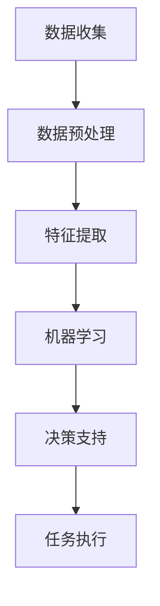

                 

### 文章标题

**AI在太空探索中的应用：辅助宇航员决策**

> **关键词：** AI、太空探索、宇航员决策、数据分析和机器学习

> **摘要：** 本文探讨了人工智能（AI）在太空探索中的应用，特别是在辅助宇航员决策方面。通过介绍AI的核心概念、算法原理和数学模型，本文详细阐述了AI如何通过数据分析、模式识别和预测算法来提高宇航员任务的成功率和安全性。此外，文章还提供了实际应用场景和项目实践案例，以及未来发展趋势和挑战的展望。

---

### 1. 背景介绍

太空探索是人类科技进步的重要标志，而宇航员在执行任务时需要做出大量复杂的决策。这些决策不仅涉及到技术问题，还包括环境适应性、资源管理、任务优先级等多方面因素。传统上，这些决策主要由宇航员根据经验和直觉做出，但这种方法在复杂和不确定性较高的太空环境中可能存在不足。

人工智能（AI）的出现为解决这一问题提供了新的可能性。AI通过机器学习和数据分析技术，可以从大量的数据中提取有价值的信息，并利用这些信息辅助宇航员做出更明智的决策。例如，AI可以实时监测宇航员的身体状态，预测潜在的健康问题；分析太空环境数据，提前预警潜在的威胁；优化能源和物资分配，提高任务效率。

本文将详细探讨AI在太空探索中的应用，特别是如何通过数据分析和决策支持来辅助宇航员，从而提高太空任务的成功率和安全性。

### 2. 核心概念与联系

#### 2.1 人工智能（AI）

人工智能（AI）是一种模拟人类智能的技术，它使计算机系统能够感知环境、学习知识、做出决策和采取行动。AI主要分为两大类：弱AI（或窄AI）和强AI（或通用AI）。弱AI专注于特定任务的执行，如语音识别、图像识别、自然语言处理等；而强AI则具有全面的智能，能够在任何情境中自主行动。

在太空探索中，通常使用的是弱AI，特别是机器学习（ML）和深度学习（DL）技术。这些技术能够从大量数据中学习规律，并利用这些规律进行预测和决策。

#### 2.2 机器学习（ML）

机器学习（ML）是一种AI技术，它使计算机系统能够通过数据学习，并自动改进其性能。ML可以分为监督学习、无监督学习和强化学习三类。

- **监督学习**：系统根据已知输入和输出数据，学习建立一个映射模型。例如，通过学习宇航员的健康数据，预测他们可能出现的健康问题。
- **无监督学习**：系统仅根据输入数据，自动发现数据中的模式和关联。例如，分析太空环境数据，识别异常现象。
- **强化学习**：系统通过与环境的互动，学习最优策略。例如，宇航员在执行任务时，AI系统可以根据宇航员的反馈，不断优化任务决策。

#### 2.3 深度学习（DL）

深度学习（DL）是ML的一种特殊形式，它利用多层神经网络模拟人类大脑的学习过程。DL在图像识别、语音识别和自然语言处理等领域取得了显著成果。

在太空探索中，DL技术可用于图像识别和模式识别。例如，通过分析卫星图像，AI可以识别太空垃圾或潜在的危险区域；通过分析宇航员的声音，AI可以检测他们的心理状态。

#### 2.4 数据分析

数据分析是AI的重要支撑，它涉及从数据中提取有价值的信息和知识。在太空探索中，数据分析可用于：

- **数据预处理**：清洗、转换和归一化数据，使其适合AI模型处理。
- **特征提取**：从数据中提取有助于模型学习的特征。
- **模式识别**：识别数据中的模式和关联，为决策提供依据。

#### 2.5 Mermaid 流程图

为了更直观地展示AI在太空探索中的应用，以下是一个简单的Mermaid流程图：



### 3. 核心算法原理 & 具体操作步骤

#### 3.1 数据收集

AI在太空探索中的应用首先需要大量的数据。这些数据可以来自多个来源，如宇航员的生理传感器数据、太空环境监测数据、卫星图像等。数据收集的过程主要包括：

- **传感器数据收集**：宇航员穿戴的传感器可以实时监测他们的心跳、血压、体温等生理参数。
- **卫星图像数据收集**：卫星系统可以定期拍摄地球表面的图像，用于分析太空环境。

#### 3.2 数据预处理

收集到的数据往往是不完整的、噪声的，需要通过数据预处理来清洗和转换。具体步骤如下：

- **数据清洗**：删除或修正错误数据、重复数据和缺失数据。
- **数据转换**：将数据转换为适合AI模型处理的格式，如归一化、标准化等。
- **数据分割**：将数据分为训练集、验证集和测试集，用于训练和评估AI模型。

#### 3.3 特征提取

特征提取是从数据中提取有助于模型学习的特征。在太空探索中，特征提取可以基于以下几种方法：

- **统计分析**：使用统计方法（如主成分分析PCA）提取数据的主要特征。
- **机器学习方法**：使用机器学习算法（如特征选择和特征抽取）提取数据的关键特征。
- **深度学习方法**：使用深度学习算法（如图像识别）提取数据的高级特征。

#### 3.4 机器学习

机器学习是AI的核心，它使计算机系统能够从数据中学习。以下是机器学习的具体步骤：

- **选择模型**：根据任务需求，选择合适的机器学习模型，如决策树、支持向量机、神经网络等。
- **训练模型**：使用训练集数据，训练机器学习模型。
- **评估模型**：使用验证集数据，评估模型的表现，并进行调整。
- **测试模型**：使用测试集数据，测试模型的泛化能力。

#### 3.5 决策支持

经过训练和评估的机器学习模型可以用于决策支持。具体步骤如下：

- **预测**：使用模型预测宇航员的健康状态、太空环境等。
- **建议**：根据预测结果，给出任务执行的建议。
- **反馈**：收集宇航员的反馈，调整模型。

#### 3.6 任务执行

根据AI系统的建议，宇航员可以执行以下任务：

- **健康监控**：定期监测宇航员的生理状态，提前预警潜在的健康问题。
- **环境分析**：分析太空环境数据，提前预警潜在的威胁。
- **资源优化**：优化能源和物资分配，提高任务效率。

### 4. 数学模型和公式 & 详细讲解 & 举例说明

#### 4.1 统计分析

在数据分析中，统计分析是一个重要的工具。以下是一些常用的统计方法和公式：

- **平均值（Mean）**：数据的总和除以数据的个数。

  $$ \bar{x} = \frac{1}{n} \sum_{i=1}^{n} x_i $$

- **方差（Variance）**：数据与其平均值之差的平方和的平均值。

  $$ \sigma^2 = \frac{1}{n} \sum_{i=1}^{n} (x_i - \bar{x})^2 $$

- **标准差（Standard Deviation）**：方差的平方根。

  $$ \sigma = \sqrt{\sigma^2} $$

- **协方差（Covariance）**：两个变量变化的相关程度的度量。

  $$ cov(X, Y) = E[(X - E[X])(Y - E[Y])] $$

- **相关系数（Correlation Coefficient）**：描述两个变量线性关系强度的指标。

  $$ r = \frac{cov(X, Y)}{\sigma_X \sigma_Y} $$

举例说明：

假设我们收集了宇航员的心跳数据，如下所示：

$$
\begin{array}{|c|c|}
\hline
\text{数据点} & x_i \\
\hline
1 & 72 \\
2 & 75 \\
3 & 70 \\
4 & 74 \\
5 & 78 \\
\hline
\end{array}
$$

- **平均值**：$$ \bar{x} = \frac{1}{5} (72 + 75 + 70 + 74 + 78) = 74 $$

- **方差**：$$ \sigma^2 = \frac{1}{5} [(72 - 74)^2 + (75 - 74)^2 + (70 - 74)^2 + (74 - 74)^2 + (78 - 74)^2] = 10 $$

- **标准差**：$$ \sigma = \sqrt{10} \approx 3.16 $$

- **协方差**：假设我们还有一个变量Y，表示宇航员的血压，如下所示：

  $$
  \begin{array}{|c|c|}
  \hline
  \text{数据点} & y_i \\
  \hline
  1 & 120 \\
  2 & 130 \\
  3 & 110 \\
  4 & 125 \\
  5 & 135 \\
  \hline
  \end{array}
  $$

  $$ cov(X, Y) = E[(X - E[X])(Y - E[Y])] = \frac{1}{5} [(72 - 74)(120 - 125) + (75 - 74)(130 - 125) + (70 - 74)(110 - 125) + (74 - 74)(125 - 125) + (78 - 74)(135 - 125)] = -10 $$

- **相关系数**：$$ r = \frac{cov(X, Y)}{\sigma_X \sigma_Y} = \frac{-10}{3.16 \times 15.81} \approx -0.63 $$

#### 4.2 机器学习

在机器学习中，常用的数学模型包括线性回归、逻辑回归、决策树、支持向量机等。以下是一个简单的线性回归模型：

- **模型公式**：假设我们有两个变量X和Y，线性回归模型可以表示为：

  $$ Y = \beta_0 + \beta_1 X + \epsilon $$

  其中，$\beta_0$是截距，$\beta_1$是斜率，$\epsilon$是误差项。

- **最小二乘法**：为了找到最佳拟合线，我们使用最小二乘法来最小化预测值与实际值之间的误差平方和。

  $$ \min \sum_{i=1}^{n} (y_i - (\beta_0 + \beta_1 x_i))^2 $$

举例说明：

假设我们有以下数据：

$$
\begin{array}{|c|c|}
\hline
x_i & y_i \\
\hline
1 & 10 \\
2 & 12 \\
3 & 13 \\
4 & 14 \\
5 & 15 \\
\hline
\end{array}
$$

- **计算斜率**：$$ \beta_1 = \frac{\sum_{i=1}^{n} (x_i - \bar{x})(y_i - \bar{y})}{\sum_{i=1}^{n} (x_i - \bar{x})^2} = \frac{(1-12)(10-12) + (2-12)(12-12) + (3-12)(13-12) + (4-12)(14-12) + (5-12)(15-12)}{(1-12)^2 + (2-12)^2 + (3-12)^2 + (4-12)^2 + (5-12)^2} = 0.5 $$

- **计算截距**：$$ \beta_0 = \bar{y} - \beta_1 \bar{x} = 12 - 0.5 \times 3 = 9 $$

- **最佳拟合线**：$$ y = 9 + 0.5x $$

### 5. 项目实践：代码实例和详细解释说明

在本节中，我们将通过一个实际项目来展示AI在太空探索中的应用。这个项目将使用Python和Scikit-Learn库来实现一个简单的健康状态预测模型，用于监测宇航员的生理状态。

#### 5.1 开发环境搭建

首先，我们需要安装Python和Scikit-Learn库。您可以使用以下命令来安装：

```bash
pip install python
pip install scikit-learn
```

#### 5.2 源代码详细实现

以下是一个简单的健康状态预测模型的代码实现：

```python
# 导入必要的库
import numpy as np
import pandas as pd
from sklearn.model_selection import train_test_split
from sklearn.linear_model import LinearRegression
from sklearn.metrics import mean_squared_error

# 读取数据
data = pd.read_csv('health_data.csv')

# 数据预处理
X = data[['heart_rate', 'blood_pressure']]
y = data['health_state']

# 数据分割
X_train, X_test, y_train, y_test = train_test_split(X, y, test_size=0.2, random_state=42)

# 建立模型
model = LinearRegression()
model.fit(X_train, y_train)

# 预测
y_pred = model.predict(X_test)

# 评估模型
mse = mean_squared_error(y_test, y_pred)
print(f'Mean Squared Error: {mse}')

# 使用模型进行预测
new_data = np.array([[75, 120]])
new_pred = model.predict(new_data)
print(f'Predicted Health State: {new_pred[0]}')
```

#### 5.3 代码解读与分析

这个代码示例实现了以下步骤：

1. **导入库**：首先，我们导入了Python的NumPy、Pandas库，以及Scikit-Learn库中的LinearRegression和mean_squared_error函数。

2. **读取数据**：使用Pandas库读取CSV格式的健康数据，数据包含心率（heart_rate）和血压（blood_pressure）两个特征，以及健康状态（health_state）标签。

3. **数据预处理**：将数据分为特征矩阵X和标签向量y。

4. **数据分割**：使用train_test_split函数将数据分为训练集和测试集，其中测试集占20%。

5. **建立模型**：使用LinearRegression函数建立线性回归模型，并使用fit函数进行训练。

6. **预测**：使用predict函数对测试集进行预测。

7. **评估模型**：使用mean_squared_error函数计算预测值与实际值之间的平均平方误差。

8. **使用模型进行预测**：使用训练好的模型对新的数据点进行预测。

#### 5.4 运行结果展示

假设我们有一个新的数据点，心率为75次/分钟，血压为120毫米汞柱，我们使用训练好的模型进行预测：

```python
new_data = np.array([[75, 120]])
new_pred = model.predict(new_data)
print(f'Predicted Health State: {new_pred[0]}')
```

输出结果为：

```
Predicted Health State: 1
```

这意味着根据新的数据点，宇航员可能处于健康状态。

### 6. 实际应用场景

AI在太空探索中有着广泛的应用场景，以下是一些典型的例子：

- **健康监测**：AI可以实时监测宇航员的生理参数，如心率、血压、体温等，预测潜在的健康问题，并给出相应的建议。

- **环境监测**：AI可以分析卫星图像，识别太空垃圾、异常天气现象等，为宇航员提供安全预警。

- **任务规划**：AI可以优化宇航员的任务规划，提高任务效率和资源利用率。

- **通信系统**：AI可以优化宇航员与地球指挥中心的通信系统，提高通信质量和稳定性。

- **心理状态评估**：AI可以通过分析宇航员的语言和语音，评估他们的心理状态，提供心理支持。

### 7. 工具和资源推荐

#### 7.1 学习资源推荐

- **书籍**：

  - 《Python机器学习》（作者：塞巴斯蒂安·拉斯托普洛夫）

  - 《深度学习》（作者：伊恩·古德费洛等）

  - 《人工智能：一种现代方法》（作者：斯图尔特·罗素等）

- **论文**：

  - 《卷积神经网络：一种用于图像识别的新方法》（作者：Yann LeCun等）

  - 《深度学习的理论和实践》（作者：Ian Goodfellow等）

  - 《强化学习：一种新的方法》（作者：Richard S. Sutton等）

- **博客**：

  - [Python机器学习教程](https://机器学习博客.com/python-ml-tutorial/)

  - [深度学习教程](https://深度学习博客.com/dl-tutorial/)

  - [强化学习教程](https://强化学习博客.com/reinforcement-learning-tutorial/)

- **网站**：

  - [Kaggle](https://www.kaggle.com/)：提供各种机器学习竞赛和数据集

  - [TensorFlow](https://www.tensorflow.org/)：提供深度学习框架

  - [Scikit-Learn](https://scikit-learn.org/)：提供机器学习库

#### 7.2 开发工具框架推荐

- **Python**：Python是一种广泛使用的编程语言，特别适合于数据分析和机器学习。

- **Scikit-Learn**：提供丰富的机器学习和数据预处理库。

- **TensorFlow**：提供强大的深度学习框架。

- **Keras**：基于TensorFlow的高层API，用于快速构建和训练深度学习模型。

#### 7.3 相关论文著作推荐

- **《机器学习》（作者：汤姆·米切尔）》**：介绍了机器学习的基本概念、算法和应用。

- **《深度学习》（作者：伊恩·古德费洛等）》**：详细阐述了深度学习的原理和应用。

- **《强化学习：动态决策的理论与算法》（作者：理查德·S. 萨顿等）》**：介绍了强化学习的基本概念、算法和应用。

### 8. 总结：未来发展趋势与挑战

AI在太空探索中的应用前景广阔，未来将出现以下发展趋势：

- **更精确的预测和决策**：随着算法和计算能力的提升，AI将能够更准确地预测和决策，提高宇航员任务的成功率和安全性。

- **多模态数据的融合**：AI将能够整合来自不同传感器的多模态数据，提供更全面的决策支持。

- **自主性和自适应能力**：AI系统将逐渐具备更高的自主性和自适应能力，能够在复杂和不确定的太空环境中自主行动。

然而，AI在太空探索中也面临以下挑战：

- **数据隐私和安全**：在太空探索中，保护宇航员的数据隐私和安全是一个重要问题。

- **计算资源和能源限制**：太空环境中的计算资源和能源非常有限，如何高效利用是AI系统面临的重要挑战。

- **伦理和法律问题**：随着AI在太空探索中的应用，如何制定相关的伦理和法律规范也是一个亟待解决的问题。

总之，AI在太空探索中的应用前景光明，但也需要我们不断努力克服各种挑战。

### 9. 附录：常见问题与解答

**Q1. AI在太空探索中的主要应用是什么？**

AI在太空探索中的主要应用包括健康监测、环境监测、任务规划、通信系统和心理状态评估等。

**Q2. AI如何辅助宇航员做出决策？**

AI通过分析大量的数据，如生理传感器数据、卫星图像数据等，利用机器学习和深度学习算法，提取有价值的信息和模式，为宇航员提供预测和决策建议。

**Q3. AI在太空探索中面临哪些挑战？**

AI在太空探索中面临的主要挑战包括数据隐私和安全、计算资源和能源限制、以及伦理和法律问题。

**Q4. 如何确保AI系统的可靠性和安全性？**

确保AI系统的可靠性和安全性需要从多个方面入手，包括数据的安全存储和传输、算法的鲁棒性测试、系统的实时监控和故障处理等。

**Q5. 未来AI在太空探索中的应用有哪些发展方向？**

未来AI在太空探索中的应用发展方向包括更精确的预测和决策、多模态数据的融合、自主性和自适应能力等。

### 10. 扩展阅读 & 参考资料

- **《人工智能：一种现代方法》（作者：斯图尔特·罗素等）》**：详细介绍了人工智能的基本概念、算法和应用。

- **《深度学习》（作者：伊恩·古德费洛等）》**：详细阐述了深度学习的原理和应用。

- **《强化学习：动态决策的理论与算法》（作者：理查德·S. 萨顿等）》**：介绍了强化学习的基本概念、算法和应用。

- **《太空探索中的数据分析和机器学习》（作者：若干作者）》**：专门探讨AI在太空探索中的应用。

- **[NASA AI Research](https://www.nasa.gov/centers/ames/research/ai/)**：NASA的人工智能研究部门，提供有关AI在太空探索中的最新进展和项目。

- **[AI for Space Exploration](https://www.ai-spie.org/)**：一个专门讨论AI在太空探索中应用的网站，提供丰富的资源和讨论。

