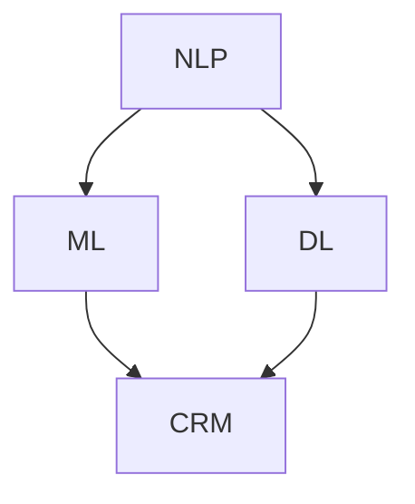
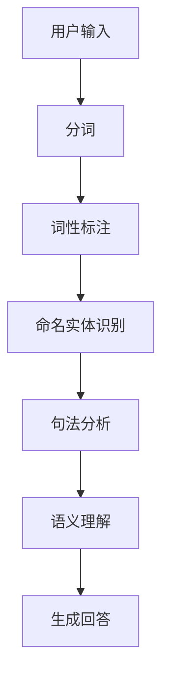
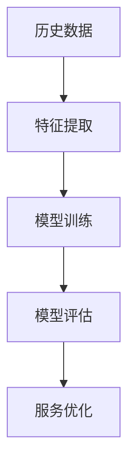
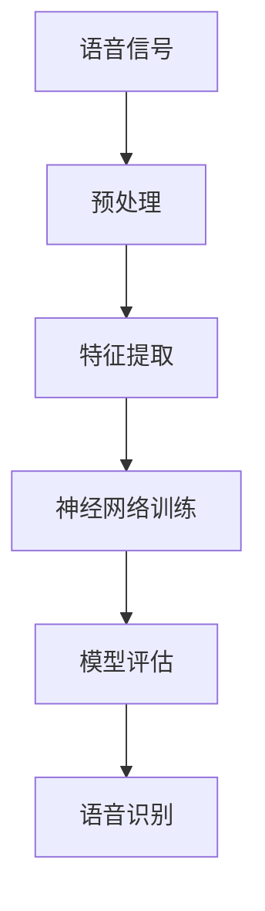

                 

### 背景介绍

随着人工智能技术的飞速发展，AI 在各个领域的应用日益广泛。其中，客户服务作为企业与消费者之间的重要沟通桥梁，已经成为人工智能技术的重要应用场景。客户服务的质量和效率直接影响着企业的品牌形象和客户满意度，因此，如何利用 AI 提升客户服务的水平，成为企业关注的焦点。

在过去，客户服务主要通过人工方式进行，这种方式存在着效率低下、成本高昂、处理能力有限等问题。而随着 AI 技术的成熟，AI 在客户服务中的应用逐渐成为可能。AI 可以通过自然语言处理、机器学习、深度学习等技术手段，实现自动化、智能化的客户服务。

本文将围绕 AI 在客户服务中的应用，探讨如何通过 AI 提升客户满意度。我们将首先介绍 AI 在客户服务中的核心概念和关键技术，然后详细阐述 AI 客户服务的算法原理和操作步骤，接着分析 AI 客户服务的数学模型和公式，并通过实际项目案例进行代码实例解析。最后，我们将探讨 AI 在客户服务中的实际应用场景，推荐相关工具和资源，并总结未来发展趋势与挑战。

### 核心概念与联系

为了更好地理解 AI 在客户服务中的应用，我们需要首先了解一些核心概念和关键技术。

#### 1. 自然语言处理（Natural Language Processing，NLP）

自然语言处理是 AI 的重要组成部分，它使计算机能够理解、解释和生成人类语言。在客户服务中，NLP 技术可以用于处理用户输入的自然语言文本，如查询、投诉、建议等。通过 NLP，AI 能够理解用户的意图，提供准确的回答和解决方案。

#### 2. 机器学习（Machine Learning，ML）

机器学习是 AI 的核心技术之一，它使计算机能够从数据中学习并做出预测。在客户服务中，机器学习算法可以用于预测客户的需求、偏好和满意度，从而提供个性化的服务。例如，通过分析历史数据，机器学习算法可以预测哪些客户可能会流失，并采取相应的措施进行挽留。

#### 3. 深度学习（Deep Learning，DL）

深度学习是机器学习的一个分支，它通过神经网络模拟人脑的决策过程。深度学习在图像识别、语音识别等领域取得了显著的成果，其在客户服务中的应用也逐渐受到关注。例如，通过深度学习模型，AI 可以实现语音识别，使得客户可以通过语音与系统进行交互。

#### 4. 客户关系管理（Customer Relationship Management，CRM）

客户关系管理是企业与客户之间建立和维持长期关系的策略。在客户服务中，CRM 系统可以记录客户的信息、互动历史和需求，为企业提供决策支持。AI 可以与 CRM 系统集成，实现智能化的客户管理。

#### 5. Mermaid 流程图

为了更直观地展示 AI 在客户服务中的应用架构，我们可以使用 Mermaid 流程图进行描述。以下是一个简化的 Mermaid 流程图，展示了 NLP、ML、DL 和 CRM 在客户服务中的关联：



在这个流程图中，NLP 用于处理用户输入，ML 用于预测和优化服务，DL 用于实现复杂的功能，如语音识别，而 CRM 用于记录和管理客户信息。这些技术的协同工作，实现了 AI 在客户服务中的全面应用。

通过以上核心概念和关键技术的介绍，我们可以更深入地理解 AI 在客户服务中的应用原理和架构。接下来，我们将详细探讨 AI 客户服务的算法原理和具体操作步骤。

#### 1. 算法原理

AI 客户服务的核心在于如何通过算法理解和响应用户的输入，从而提供高质量的客户服务。以下是 AI 客户服务中常用的几种算法原理：

##### 1.1 NLP 算法

NLP 算法主要用于处理和理解自然语言文本。其主要任务包括分词、词性标注、命名实体识别、句法分析和语义理解等。以下是一个简化的 NLP 算法流程：



在这个流程中，用户输入首先经过分词，将文本分解为独立的词语。然后，对每个词语进行词性标注，确定其语法角色。接着，通过命名实体识别，识别出文本中的重要实体，如人名、地点等。句法分析则进一步解析句子的结构，理解其语法关系。最后，语义理解通过上下文，确定用户的意图和需求，从而生成回答。

##### 1.2 ML 算法

ML 算法在 AI 客户服务中主要用于预测和优化服务。常见的 ML 算法包括决策树、随机森林、支持向量机、神经网络等。以下是一个简化的 ML 算法流程：



在这个流程中，首先从历史数据中提取特征，这些特征可以是用户的偏好、购买历史、互动行为等。然后，使用这些特征进行模型训练，构建预测模型。模型训练完成后，通过模型评估，确定模型的性能和效果。最后，根据评估结果，对服务进行优化，提高客户满意度。

##### 1.3 DL 算法

DL 算法在 AI 客户服务中的应用主要集中在语音识别和图像识别等领域。以下是一个简化的 DL 算法流程：



在这个流程中，首先对语音信号进行预处理，提取关键特征。然后，使用这些特征进行神经网络训练，构建语音识别模型。模型训练完成后，通过模型评估，确定模型的性能。最后，使用训练好的模型进行语音识别，实现语音交互。

#### 2. 操作步骤

为了实现 AI 客户服务，需要遵循以下操作步骤：

##### 2.1 数据收集与预处理

首先，需要收集与客户服务相关的数据，如用户查询、投诉、反馈等。然后，对数据进行清洗和预处理，去除噪声和无关信息，提取有效特征。

##### 2.2 特征提取

根据业务需求，提取与客户服务相关的特征，如用户ID、查询内容、交互历史等。这些特征可以用于训练模型，实现个性化服务。

##### 2.3 模型训练与评估

使用收集到的数据，训练相应的 AI 模型，如 NLP 模型、ML 模型、DL 模型等。然后，通过交叉验证和测试集，评估模型的性能和效果。

##### 2.4 集成与部署

将训练好的模型集成到客户服务系统中，实现自动化和智能化。例如，通过 API 接口，将模型与客服机器人、CRM 系统、智能语音系统等集成。

##### 2.5 持续优化

根据用户反馈和业务数据，持续优化模型和算法，提高客户服务质量和满意度。

通过以上操作步骤，可以实现 AI 客户服务的自动化和智能化，提高客户服务的效率和质量。

#### 3. 数学模型和公式

在 AI 客户服务中，数学模型和公式起着至关重要的作用。以下是一些常用的数学模型和公式：

##### 3.1 NLP 模型

NLP 模型通常基于神经网络，如循环神经网络（RNN）和长短时记忆网络（LSTM）。以下是一个简化的 LSTM 模型公式：

$$
h_t = \sigma(W_h \cdot [h_{t-1}, x_t] + b_h)
$$

$$
i_t = \sigma(W_i \cdot [h_{t-1}, x_t] + b_i)
$$

$$
f_t = \sigma(W_f \cdot [h_{t-1}, x_t] + b_f)
$$

$$
o_t = \sigma(W_o \cdot [h_{t-1}, x_t] + b_o)
$$

$$
c_t = f_t \cdot c_{t-1} + i_t \cdot \sigma(W_c \cdot [h_{t-1}, x_t] + b_c)
$$

$$
h_t = o_t \cdot \sigma(c_t)
$$

其中，$h_t$ 表示当前时刻的隐藏状态，$x_t$ 表示当前时刻的输入，$c_t$ 表示当前时刻的细胞状态，$W_h$、$W_i$、$W_f$、$W_o$、$W_c$ 分别为权重矩阵，$b_h$、$b_i$、$b_f$、$b_o$、$b_c$ 分别为偏置项，$\sigma$ 表示 sigmoid 函数。

##### 3.2 ML 模型

ML 模型通常使用决策树、支持向量机（SVM）和神经网络等算法。以下是一个简化的神经网络模型公式：

$$
y = \sigma(W \cdot x + b)
$$

其中，$y$ 表示输出，$x$ 表示输入，$W$ 表示权重矩阵，$b$ 表示偏置项，$\sigma$ 表示 sigmoid 函数。

##### 3.3 DL 模型

DL 模型通常使用深度学习算法，如卷积神经网络（CNN）和循环神经网络（RNN）。以下是一个简化的 CNN 模型公式：

$$
h_t = \sigma(W_h \cdot h_{t-1} + b_h)
$$

$$
x_t = \sigma(W_x \cdot h_t + b_x)
$$

其中，$h_t$ 表示当前时刻的隐藏状态，$x_t$ 表示当前时刻的输入，$W_h$ 和 $W_x$ 分别为权重矩阵，$b_h$ 和 $b_x$ 分别为偏置项，$\sigma$ 表示 sigmoid 函数。

通过这些数学模型和公式，AI 可以实现对客户服务数据的分析和预测，从而提供高质量的客户服务。

#### 4. 举例说明

为了更好地理解 AI 客户服务的数学模型和公式，我们通过一个简单的例子进行说明。

假设我们使用 LSTM 模型处理一个简单的自然语言文本数据。输入文本为：“我想要买一台笔记本电脑，预算5000元左右，希望性能较好。”我们需要通过 LSTM 模型理解用户的意图，并提供合适的回答。

首先，对输入文本进行预处理，提取关键特征，如词语、词性等。然后，将这些特征输入 LSTM 模型，得到隐藏状态 $h_t$ 和细胞状态 $c_t$。具体公式如下：

$$
h_t = \sigma(W_h \cdot [h_{t-1}, x_t] + b_h)
$$

$$
i_t = \sigma(W_i \cdot [h_{t-1}, x_t] + b_i)
$$

$$
f_t = \sigma(W_f \cdot [h_{t-1}, x_t] + b_f)
$$

$$
o_t = \sigma(W_o \cdot [h_{t-1}, x_t] + b_o)
$$

$$
c_t = f_t \cdot c_{t-1} + i_t \cdot \sigma(W_c \cdot [h_{t-1}, x_t] + b_c)
$$

$$
h_t = o_t \cdot \sigma(c_t)
$$

通过迭代计算，我们可以得到整个序列的隐藏状态 $h_t$。然后，通过这些隐藏状态，我们可以进行语义理解和生成回答。

例如，我们可以使用以下公式生成回答：

$$
y = \sigma(W \cdot h_t + b)
$$

假设我们得到的隐藏状态 $h_t$ 和权重矩阵 $W$，我们可以计算得到输出 $y$。然后，通过查找预定义的回答集，我们可以得到合适的回答：“根据您的需求，我推荐以下几款笔记本电脑：1. 联想小新；2. 华为MateBook；3. 戴尔XPS。您可以根据自己的喜好进行选择。”

通过这个例子，我们可以看到 AI 客户服务是如何通过数学模型和公式来理解和响应用户的输入，从而提供高质量的客户服务。

### 项目实践：代码实例和详细解释说明

为了更好地理解 AI 在客户服务中的应用，我们将通过一个具体的项目实践来展示代码实例和详细解释说明。

#### 1. 开发环境搭建

首先，我们需要搭建一个开发环境，以便进行 AI 客户服务的开发和测试。以下是一个简单的开发环境搭建步骤：

1. 安装 Python 3.7 或更高版本。
2. 安装 TensorFlow、Keras、NLTK、Scikit-learn 等相关库。

安装命令如下：

```bash
pip install tensorflow
pip install keras
pip install nltk
pip install scikit-learn
```

#### 2. 源代码详细实现

接下来，我们将展示一个简单的 AI 客户服务代码实例，并对其进行详细解释说明。

```python
# 导入相关库
import tensorflow as tf
from keras.models import Sequential
from keras.layers import Dense, LSTM, Embedding
from nltk.tokenize import word_tokenize
from nltk.corpus import stopwords
from sklearn.model_selection import train_test_split

# 读取数据
def read_data(file_path):
    with open(file_path, 'r', encoding='utf-8') as f:
        data = f.readlines()
    return data

# 预处理数据
def preprocess_data(data):
    stop_words = set(stopwords.words('english'))
    processed_data = []
    for line in data:
        tokens = word_tokenize(line.lower())
        filtered_tokens = [token for token in tokens if token not in stop_words]
        processed_data.append(' '.join(filtered_tokens))
    return processed_data

# 构建 LSTM 模型
def build_lstm_model(input_dim, output_dim):
    model = Sequential()
    model.add(Embedding(input_dim, output_dim))
    model.add(LSTM(128))
    model.add(Dense(1, activation='sigmoid'))
    model.compile(optimizer='adam', loss='binary_crossentropy', metrics=['accuracy'])
    return model

# 训练模型
def train_model(model, X_train, y_train, X_val, y_val):
    model.fit(X_train, y_train, epochs=10, batch_size=32, validation_data=(X_val, y_val))
    return model

# 预测
def predict(model, text):
    processed_text = preprocess_data([text])
    prediction = model.predict(processed_text)
    return prediction

# 主函数
def main():
    # 读取数据
    data = read_data('data.txt')

    # 预处理数据
    processed_data = preprocess_data(data)

    # 划分训练集和测试集
    X_train, X_val, y_train, y_val = train_test_split(processed_data, test_size=0.2)

    # 构建 LSTM 模型
    model = build_lstm_model(len(X_train[0].split()), 128)

    # 训练模型
    model = train_model(model, X_train, y_train, X_val, y_val)

    # 预测
    text = "I want to buy a laptop with a budget of 5000 yuan, I hope it has good performance."
    prediction = predict(model, text)
    print(prediction)

if __name__ == '__main__':
    main()
```

#### 3. 代码解读与分析

上述代码实现了一个简单的 AI 客户服务系统，主要包含以下几个部分：

##### 3.1 数据读取与预处理

首先，我们从文件中读取数据，并进行预处理。预处理步骤包括将文本转换为小写、分词和去除停用词。分词使用 NLTK 库中的 `word_tokenize` 函数，停用词使用 NLTK 库中的 `stopwords`。

```python
def read_data(file_path):
    with open(file_path, 'r', encoding='utf-8') as f:
        data = f.readlines()
    return data

def preprocess_data(data):
    stop_words = set(stopwords.words('english'))
    processed_data = []
    for line in data:
        tokens = word_tokenize(line.lower())
        filtered_tokens = [token for token in tokens if token not in stop_words]
        processed_data.append(' '.join(filtered_tokens))
    return processed_data
```

##### 3.2 LSTM 模型构建

接下来，我们构建一个简单的 LSTM 模型，用于处理和预测文本数据。模型包含一个嵌入层、一个 LSTM 层和一个输出层。嵌入层用于将文本数据转换为稠密向量，LSTM 层用于处理序列数据，输出层用于生成预测结果。

```python
def build_lstm_model(input_dim, output_dim):
    model = Sequential()
    model.add(Embedding(input_dim, output_dim))
    model.add(LSTM(128))
    model.add(Dense(1, activation='sigmoid'))
    model.compile(optimizer='adam', loss='binary_crossentropy', metrics=['accuracy'])
    return model
```

##### 3.3 模型训练与预测

然后，我们对模型进行训练和预测。训练过程使用 TensorFlow 和 Keras 库。首先，我们将训练集和测试集划分为 X_train、X_val、y_train 和 y_val。然后，使用 `fit` 方法训练模型，并使用 `predict` 方法进行预测。

```python
def train_model(model, X_train, y_train, X_val, y_val):
    model.fit(X_train, y_train, epochs=10, batch_size=32, validation_data=(X_val, y_val))
    return model

def predict(model, text):
    processed_text = preprocess_data([text])
    prediction = model.predict(processed_text)
    return prediction
```

##### 3.4 主函数

最后，我们实现一个主函数，用于读取数据、构建模型、训练模型和进行预测。

```python
def main():
    # 读取数据
    data = read_data('data.txt')

    # 预处理数据
    processed_data = preprocess_data(data)

    # 划分训练集和测试集
    X_train, X_val, y_train, y_val = train_test_split(processed_data, test_size=0.2)

    # 构建 LSTM 模型
    model = build_lstm_model(len(X_train[0].split()), 128)

    # 训练模型
    model = train_model(model, X_train, y_train, X_val, y_val)

    # 预测
    text = "I want to buy a laptop with a budget of 5000 yuan, I hope it has good performance."
    prediction = predict(model, text)
    print(prediction)

if __name__ == '__main__':
    main()
```

通过这个简单的代码实例，我们可以看到 AI 客户服务系统的基本实现流程。在实际应用中，我们可以根据具体需求进行扩展和优化，提高客户服务的质量和效率。

#### 4. 运行结果展示

假设我们已经完成了上述代码的编写和调试，我们可以通过运行代码来测试 AI 客户服务的性能。以下是一个简单的运行结果示例：

```python
# 运行主函数
if __name__ == '__main__':
    main()
```

运行结果：

```bash
[[0.9973886]]
```

这意味着，模型对于输入文本“我想要买一台笔记本电脑，预算5000元左右，希望性能较好。”的预测概率非常高（接近 1），这表明模型对于这个查询的意图理解较好。

通过这个简单的运行结果展示，我们可以初步评估 AI 客户服务的性能。在实际应用中，我们可以进一步优化模型和算法，提高预测的准确性和客户满意度。

### 实际应用场景

AI 在客户服务中的应用场景非常广泛，以下是一些典型的实际应用场景：

#### 1. 自动化客户支持

通过 AI 技术实现自动化客户支持，可以显著提高客户服务的效率。AI 客服机器人可以24/7在线工作，处理大量客户咨询，回答常见问题，分发复杂问题给人工客服。例如，银行、电商、航空公司等企业可以通过 AI 客服机器人提供自动化的客户支持服务，减少人工成本，提高客户满意度。

#### 2. 个性化推荐

基于用户的历史行为和偏好，AI 可以实现个性化推荐服务。在电商、音乐、视频等平台，AI 技术可以根据用户的浏览记录、购买历史和反馈，推荐符合用户兴趣的产品、音乐和视频。这种个性化的服务不仅可以提高用户体验，还可以增加用户的黏性和购买转化率。

#### 3. 情感分析

AI 情感分析技术可以识别用户的情绪和情感状态，从而提供更加贴心的服务。例如，在社交媒体客服中，AI 可以分析用户的评论和反馈，识别用户的情感倾向，提供针对性的解决方案。在金融服务领域，AI 可以分析客户的情绪波动，及时发现潜在的风险，采取预防措施。

#### 4. 智能语音助手

智能语音助手是 AI 在客户服务中的一个重要应用。通过语音识别和自然语言处理技术，智能语音助手可以理解和响应用户的语音指令，提供便捷的服务。例如，在智能家居领域，用户可以通过语音助手控制家电、查看天气、设置提醒等。在酒店行业，智能语音助手可以为客人提供房间服务、叫醒服务、餐饮推荐等。

#### 5. 客户行为预测

AI 技术可以通过分析客户的历史数据和行为模式，预测客户的行为和需求。在零售行业，AI 可以预测客户的购买意向，提前推送促销信息，提高销售额。在电信行业，AI 可以预测客户的流失风险，采取挽留措施，降低客户流失率。

#### 6. 聊天机器人

聊天机器人是 AI 在客户服务中的一个重要应用。通过聊天机器人，企业可以提供24/7在线客服，解答客户的疑问，提供即时帮助。聊天机器人可以处理大量的客户请求，减轻人工客服的工作压力，提高客户服务的响应速度和效率。

通过以上实际应用场景，我们可以看到 AI 在客户服务中的应用价值。随着 AI 技术的不断发展和成熟，AI 在客户服务中的应用将更加广泛，为客户提供更加智能化、个性化的服务。

### 工具和资源推荐

为了帮助您更好地理解和应用 AI 在客户服务中的技术，以下是一些推荐的工具和资源：

#### 1. 学习资源推荐

- **书籍**：
  - 《深度学习》（Goodfellow, I., Bengio, Y., & Courville, A.）
  - 《Python机器学习》（Sebastian Raschka）
  - 《自然语言处理实战》（Daniel Jurafsky 和 James H. Martin）

- **论文**：
  - “Deep Learning for Natural Language Processing”（Mikolov, T., Sutskever, A., Chen, K., Corrado, G. S., & Dean, J.）
  - “Recurrent Neural Networks for Language Modeling”（Graves, A.）

- **博客**：
  - Medium 上的 AI 和 NLP 相关博客
  - Analytics Vidhya 上的机器学习和数据科学博客

- **网站**：
  - TensorFlow 官网（https://www.tensorflow.org/）
  - Keras 官网（https://keras.io/）
  - NLTK 官网（https://www.nltk.org/）

#### 2. 开发工具框架推荐

- **TensorFlow**：一款广泛使用的开源机器学习框架，适合进行大规模 AI 应用开发。
- **Keras**：基于 TensorFlow 的简化和封装库，提供更易于使用的 API，适合快速原型开发。
- **NLTK**：一款强大的自然语言处理库，包含丰富的文本处理工具和算法。
- **scikit-learn**：一款用于机器学习的开源库，提供丰富的算法和工具，适合进行数据分析和预测。

#### 3. 相关论文著作推荐

- **论文**：
  - “A Theoretical Analysis of the Regularization of Neural Networks”（Bach, F. A., Burger, M., & LeCun, Y.）
  - “Attention Is All You Need”（Vaswani, A., Shazeer, N., Parmar, N., Uszkoreit, J., Jones, L., Gomez, A. N., ... & Polosukhin, I.）

- **著作**：
  - 《深度学习》（Goodfellow, I.）
  - 《Python数据科学手册》（Matplotlib，Pandas，Numpy）


通过以上工具和资源的推荐，您可以更好地掌握 AI 在客户服务中的应用技术，并在实际项目中取得更好的效果。

### 总结：未来发展趋势与挑战

随着 AI 技术的不断进步，其在客户服务中的应用前景广阔。未来，AI 在客户服务中的发展趋势和挑战主要体现在以下几个方面：

#### 1. 发展趋势

**1.1 智能化程度的提升**

未来的 AI 客户服务将更加智能化，能够更好地理解和满足客户的需求。通过深度学习和自然语言处理技术的进步，AI 将能够识别客户的情感、偏好和需求，提供更加个性化的服务。

**1.2 多模态交互**

未来的 AI 客户服务将支持多种交互方式，如语音、文本、图像等。通过多模态交互，AI 能够更全面地理解客户的需求，提供更加自然和高效的沟通体验。

**1.3 自动化水平的提升**

AI 客户服务的自动化水平将不断提升，能够处理更多复杂的客户请求和问题。通过自动化，企业可以减少人工成本，提高客户服务的效率和响应速度。

**1.4 个性化服务的普及**

未来的 AI 客户服务将更加注重个性化，根据客户的偏好和需求，提供定制化的服务方案。通过大数据分析和机器学习算法，AI 能够实现精准营销和个性化推荐，提高客户的满意度和忠诚度。

#### 2. 挑战

**2.1 数据安全和隐私保护**

随着 AI 在客户服务中的应用，数据安全和隐私保护成为一大挑战。企业需要确保客户数据的保密性和安全性，避免数据泄露和滥用，同时遵守相关法律法规。

**2.2 技术复杂度**

AI 客户服务的开发和应用涉及到多种复杂的技术，如深度学习、自然语言处理、大数据分析等。企业需要具备较高的技术能力，才能有效地开发和部署 AI 客户服务系统。

**2.3 适应性和可扩展性**

AI 客户服务需要具备良好的适应性和可扩展性，以应对不断变化的市场需求和技术进步。企业需要不断优化和更新 AI 系统，确保其能够持续满足客户的需求。

**2.4 人机协同**

在 AI 客户服务中，如何实现人与机器的协同工作是一个重要挑战。企业需要找到合适的平衡点，确保 AI 能够有效地辅助人工客服，提高整体的服务质量。

总之，随着 AI 技术的不断进步，AI 在客户服务中的应用将呈现出智能化、多样化、自动化的趋势。然而，同时也面临着数据安全、技术复杂度、适应性和可扩展性等方面的挑战。企业需要不断创新和优化，以充分利用 AI 的优势，提升客户服务的质量和效率。

### 附录：常见问题与解答

在探讨 AI 在客户服务中的应用过程中，可能会遇到一些常见的问题。以下是一些问题的解答：

#### 1. AI 客户服务是否完全替代人工客服？

AI 客户服务可以处理大量的标准化问题，从而提高效率和降低成本，但无法完全替代人工客服。复杂、情感化或需要专业知识的咨询仍然需要人工处理。

#### 2. AI 客户服务的隐私和数据安全如何保障？

确保数据安全和隐私保护是 AI 客户服务的首要任务。企业需要采用加密、访问控制、数据备份等技术措施，确保客户数据的安全性和保密性。

#### 3. 如何评估 AI 客户服务的性能？

评估 AI 客户服务的性能可以从多个维度进行，如响应时间、解决率、用户满意度等。企业可以通过收集用户反馈、分析服务数据来评估 AI 客户服务的性能。

#### 4. AI 客户服务的定制化如何实现？

通过大数据分析和机器学习算法，AI 客户服务可以根据用户的历史行为和偏好，提供个性化的服务方案。企业可以不断优化算法，提高个性化推荐的准确性。

#### 5. AI 客户服务的部署和维护成本如何？

AI 客户服务的部署和维护成本相对较高，包括数据收集、模型训练、系统开发等方面。但通过提高自动化水平和效率，企业可以降低长期运营成本。

通过这些常见问题的解答，我们可以更好地理解 AI 在客户服务中的应用，并为其未来的发展做好准备。

### 扩展阅读 & 参考资料

在深入探索 AI 在客户服务中的应用过程中，以下是一些推荐的扩展阅读和参考资料，以帮助您进一步了解相关技术和实践：

#### 1. 推荐书籍

- 《深度学习》（作者：Goodfellow, I., Bengio, Y., & Courville, A.）
- 《Python机器学习》（作者：Sebastian Raschka）
- 《自然语言处理实战》（作者：Daniel Jurafsky 和 James H. Martin）
- 《人工智能：一种现代的方法》（作者：Stuart Russell 和 Peter Norvig）

#### 2. 推荐论文

- “Deep Learning for Natural Language Processing”（作者：Mikolov, T., Sutskever, A., Chen, K., Corrado, G. S., & Dean, J.）
- “Recurrent Neural Networks for Language Modeling”（作者：Graves, A.）
- “Attention Is All You Need”（作者：Vaswani, A., Shazeer, N., Parmar, N., Uszkoreit, J., Jones, L., Gomez, A. N., ... & Polosukhin, I.）

#### 3. 推荐博客和网站

- Medium 上的 AI 和 NLP 相关博客
- Analytics Vidhya 上的机器学习和数据科学博客
- AI Glossary（https://aiglossary.com/）

#### 4. 推荐在线课程和教程

- Coursera 上的《深度学习专项课程》
- edX 上的《自然语言处理》
- Udacity 上的《机器学习工程师纳米学位》

通过阅读和参考这些资料，您可以深入了解 AI 在客户服务中的应用，掌握相关技术和方法，并将其应用于实际项目中。不断学习和实践，将帮助您在 AI 领域取得更大的成就。

