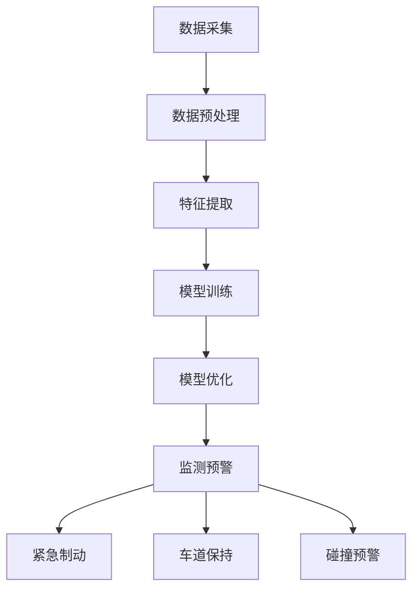

                 

### 背景介绍

近年来，随着全球汽车保有量的不断增加，交通事故的发生频率也逐年上升。据统计，每年全球因交通事故死亡的人数高达130万，其中大多数事故是由于驾驶员的失误或疏忽造成的。传统的事故预防措施，如交通法规的制定和执行、道路设施的建设等，虽然在某种程度上能够降低事故率，但效果有限。因此，如何更有效地预防交通事故成为了一个亟待解决的问题。

在这个背景下，人工智能（AI）技术的发展为解决交通事故提供了新的思路。AI具有强大的数据处理和分析能力，可以通过对海量交通数据的深度学习，预测并预防潜在的交通事故。智能交通事故预防系统利用AI技术，通过实时监测道路状况、车辆状态和驾驶员行为，提前识别并预警潜在的危险，从而减少交通事故的发生。

目前，AI在智能交通事故预防中的应用已经取得了一些显著的成果。例如，一些车辆制造商已经开始在高端车型中装配智能驾驶辅助系统，如自动紧急制动、车道保持辅助和盲点监测等功能。这些系统通过AI算法分析车辆和道路的实时数据，能够在驾驶员反应不及时时自动采取措施，提高行车安全。此外，一些城市也在试点使用AI监控系统，通过分析摄像头和传感器的数据，实时监测道路状况，及时发现和处理交通事故隐患。

尽管AI在智能交通事故预防中的应用前景广阔，但仍面临一些挑战。首先，交通事故的原因复杂多样，需要AI具备高度的学习和适应能力。其次，AI系统的准确性和可靠性需要经过大量的实际测试和验证。此外，数据隐私和安全也是需要关注的问题，如何确保交通数据的安全性和合规性，是AI应用需要克服的难题。

总之，随着AI技术的不断进步，其在智能交通事故预防中的应用将越来越广泛。未来，通过AI技术的深入研究和应用，有望实现更高效的交通事故预防，提高道路整体安全水平。本文将详细探讨AI在智能交通事故预防中的应用，包括核心概念、算法原理、数学模型、项目实践和应用场景等内容，以期为这一领域的进一步发展提供参考。

### 2. 核心概念与联系

在深入探讨AI在智能交通事故预防中的应用之前，我们需要了解一些核心概念和技术，它们是构建智能交通事故预防系统的基石。以下是对这些核心概念及其相互关系的详细解释，并附上Mermaid流程图以辅助理解。

#### 2.1. 人工智能（AI）

人工智能（Artificial Intelligence，简称AI）是指通过计算机模拟人类智能的一种技术。它包括机器学习（Machine Learning，ML）、深度学习（Deep Learning，DL）等多个子领域。机器学习是一种通过数据训练模型，使其能够进行预测和决策的技术。深度学习则是机器学习中的一种，通过多层神经网络对数据进行分析和处理。

#### 2.2. 数据采集与处理

数据采集与处理是AI应用的基础。在交通事故预防中，数据来源包括摄像头、雷达、传感器等设备。这些设备采集到的数据需要经过预处理，包括去噪、数据清洗和特征提取，以便用于模型训练。

#### 2.3. 监测与预警

监测与预警是智能交通事故预防系统的核心功能。通过实时监测道路状况、车辆状态和驾驶员行为，系统可以识别潜在的交通事故风险，并及时发出预警。预警机制通常包括自动紧急制动、车道保持辅助和碰撞预警等功能。

#### 2.4. 模型训练与优化

模型训练与优化是提升AI系统性能的关键步骤。通过大量的交通数据训练，AI模型可以学习到识别交通事故的特征。模型的优化包括参数调整、正则化和模型选择等，以提高其准确性和鲁棒性。

#### 2.5. Mermaid流程图

以下是一个简化的Mermaid流程图，用于展示上述核心概念和技术之间的联系：



#### 2.6. 深入解释

**数据采集与处理**：交通事故预防系统需要大量高质量的交通数据。数据来源可以是车载传感器、道路摄像头和雷达等。数据采集后，需要通过去噪、清洗和归一化等预处理步骤，以提高数据的可靠性和可用性。特征提取是预处理的重要部分，它从原始数据中提取出对识别交通事故有用的信息。

**模型训练与优化**：训练模型是利用大量交通数据进行的学习过程。通过训练，模型可以识别出交通事故的特征模式。模型优化则是在训练过程中对模型参数进行调整，以减少预测误差，提高模型的鲁棒性。

**监测与预警**：监测与预警系统是AI在交通事故预防中的直接应用。通过实时监测道路状况和车辆行为，系统能够提前识别出潜在的危险情况，并发出预警信号。预警机制可以根据具体情况激活不同的安全功能，如自动紧急制动或车道保持辅助。

通过上述核心概念和技术的结合，AI在智能交通事故预防中发挥了重要作用。下一节将详细探讨AI的核心算法原理和具体操作步骤，以便进一步理解这一技术的工作机制。

#### 2.7. 核心算法原理

在智能交通事故预防中，核心算法的作用至关重要。以下将详细讨论几种常用的核心算法，包括机器学习算法、深度学习算法以及它们在交通事故预防中的应用原理。

##### 2.7.1. 机器学习算法

机器学习算法是人工智能的一个重要分支，它通过训练模型从数据中自动学习规律和模式。在交通事故预防中，常见的机器学习算法包括支持向量机（SVM）、决策树、随机森林和朴素贝叶斯等。

- **支持向量机（SVM）**：SVM是一种二分类模型，通过找到最佳的超平面将不同类别的数据分开。在交通事故预防中，SVM可以用来分类车辆行为，识别潜在的危险情况。

- **决策树**：决策树通过一系列规则对数据进行划分，从而构建一个预测模型。在交通事故预防中，决策树可以用来分析驾驶员的行为特征，预测可能的交通事故风险。

- **随机森林**：随机森林是一种集成学习算法，它通过构建多个决策树来提高预测的准确性和稳定性。在交通事故预防中，随机森林可以用来对大量交通数据进行综合分析，识别复杂的交通事故模式。

- **朴素贝叶斯**：朴素贝叶斯是一种基于贝叶斯定理的简单概率分类器。在交通事故预防中，朴素贝叶斯可以用来预测特定事件发生的概率，如某段道路上的交通事故发生率。

##### 2.7.2. 深度学习算法

深度学习是机器学习的一个子领域，通过多层神经网络对数据进行复杂的学习和建模。在交通事故预防中，深度学习算法的应用更加广泛和深入。

- **卷积神经网络（CNN）**：CNN是一种用于图像识别和处理的深度学习模型。在交通事故预防中，CNN可以用来分析道路摄像头和传感器采集的图像数据，识别道路上的车辆、行人及其他障碍物。

- **循环神经网络（RNN）**：RNN是一种用于处理序列数据的深度学习模型，能够捕捉时间序列中的长期依赖关系。在交通事故预防中，RNN可以用来分析驾驶员的行为序列，预测其未来的行为模式。

- **长短期记忆网络（LSTM）**：LSTM是RNN的一种变体，能够更好地处理长序列数据，避免梯度消失问题。在交通事故预防中，LSTM可以用来预测驾驶员的行为，识别潜在的危险情况。

- **生成对抗网络（GAN）**：GAN是一种通过对抗训练生成数据的模型。在交通事故预防中，GAN可以用来生成模拟的交通场景，用于训练和测试AI模型。

##### 2.7.3. 应用原理

在智能交通事故预防中，算法的应用原理主要分为以下几步：

1. **数据采集与预处理**：采集道路摄像头、传感器和车载设备等数据，并对数据进行预处理，提取有用的特征。

2. **模型选择与训练**：根据数据特点和需求选择合适的机器学习或深度学习模型，利用预处理后的数据进行训练。

3. **模型优化与评估**：通过调整模型参数和训练策略，优化模型的性能，并进行评估，确保其准确性和鲁棒性。

4. **实时监测与预警**：将训练好的模型部署到实际应用中，实时监测道路状况和车辆行为，识别潜在的危险情况，并发出预警。

通过上述步骤，AI算法能够有效提高交通事故预防的能力，减少交通事故的发生。下一节将详细介绍这些算法的具体操作步骤，以便读者更好地理解其应用过程。

#### 3. 核心算法原理 & 具体操作步骤

在前一节中，我们介绍了AI在智能交通事故预防中的核心算法原理。本节将深入探讨这些算法的具体操作步骤，帮助读者更好地理解如何利用这些算法实现智能交通事故预防。

##### 3.1. 数据采集与预处理

数据采集是AI算法应用的第一步，也是至关重要的一步。在交通事故预防中，数据来源包括车载传感器、道路摄像头、雷达等设备。这些设备采集到的数据类型多样，包括图像、音频、速度、加速度等。

**步骤1**：数据收集

- **车载传感器数据**：包括速度传感器、加速度传感器、轮速传感器等，这些传感器可以实时监测车辆的运动状态。
- **道路摄像头数据**：通过安装在道路上的摄像头获取道路上的图像数据。
- **雷达数据**：雷达可以检测前方车辆的距离、速度等信息。

**步骤2**：数据预处理

数据预处理包括去噪、数据清洗和特征提取等步骤，目的是提高数据的可靠性和可用性。

- **去噪**：去除传感器采集到的噪声数据，如速度传感器在行驶过程中测得的短时波动。
- **数据清洗**：过滤掉错误或缺失的数据，确保数据的完整性。
- **特征提取**：从原始数据中提取出对识别交通事故有用的特征，如车辆的行驶轨迹、速度变化、刹车行为等。

##### 3.2. 模型选择与训练

在数据预处理完成后，需要选择合适的机器学习或深度学习模型，并进行训练。以下是常用的模型选择和训练步骤：

**步骤1**：模型选择

根据数据类型和问题特点选择合适的模型。对于图像数据，可以选择卷积神经网络（CNN）；对于序列数据，可以选择循环神经网络（RNN）或长短期记忆网络（LSTM）。

**步骤2**：模型训练

使用预处理后的数据对选定的模型进行训练。训练过程包括以下步骤：

- **初始化模型参数**：随机初始化模型的权重和偏置。
- **前向传播**：将输入数据传递到模型中，计算模型的输出。
- **计算损失**：计算模型输出与真实值之间的差异，得到损失函数。
- **反向传播**：根据损失函数更新模型参数，减小预测误差。
- **迭代训练**：重复前向传播和反向传播，直到模型收敛或达到预定的训练次数。

##### 3.3. 模型优化与评估

模型训练完成后，需要对模型的性能进行评估和优化。

**步骤1**：模型评估

- **验证集评估**：使用验证集评估模型的泛化能力，确保模型在未见过的数据上表现良好。
- **测试集评估**：使用测试集评估模型的最终性能，确保模型具有实际应用价值。

**步骤2**：模型优化

根据评估结果调整模型参数和训练策略，以提升模型性能。优化方法包括：

- **参数调整**：调整学习率、批量大小等超参数，优化模型训练过程。
- **正则化**：使用L1、L2正则化等技巧，防止模型过拟合。
- **模型集成**：使用集成学习方法，如随机森林、梯度提升树等，提高模型的预测准确性。

##### 3.4. 实时监测与预警

训练好的模型可以部署到实际应用中，实现实时监测和预警功能。

**步骤1**：实时监测

- **数据流处理**：利用流处理框架（如Apache Kafka）对实时采集的数据进行处理和分析。
- **模型推理**：将实时数据输入到训练好的模型中，进行预测。

**步骤2**：预警与干预

- **预警机制**：根据模型预测结果，触发相应的预警机制，如自动紧急制动、车道保持辅助等。
- **干预措施**：在必要时，自动采取干预措施，如调整车辆速度、保持安全距离等。

通过上述具体操作步骤，AI算法能够有效提高交通事故预防的能力。下一节将详细讨论这些算法在数学模型和公式中的应用，以便更好地理解其工作原理。

#### 4. 数学模型和公式 & 详细讲解 & 举例说明

在智能交通事故预防中，数学模型和公式发挥着关键作用。以下将详细讲解几种常用的数学模型和公式，包括支持向量机（SVM）、决策树、神经网络等，并通过具体例子来说明这些模型在实际应用中的实现过程。

##### 4.1. 支持向量机（SVM）

支持向量机（Support Vector Machine，SVM）是一种常用的机器学习算法，主要用于分类问题。在交通事故预防中，SVM可以用来识别潜在的危险情况。

**SVM基本公式**：

$$
\text{最大间隔超平面}：W \cdot x + b = 0
$$

其中，\(W\) 是权重向量，\(x\) 是特征向量，\(b\) 是偏置项。SVM的目标是找到一个最佳的超平面，使得不同类别的数据点之间的间隔最大。

**示例**：

假设我们有一个简单的二分类问题，其中类别1表示正常行驶，类别2表示危险行驶。我们有两个特征：速度和加速度。使用SVM对数据进行分类，我们可以定义如下公式：

$$
\text{分类函数}：y = \text{sign}(\omega_1 v + \omega_2 a + b)
$$

其中，\(v\) 是速度特征，\(a\) 是加速度特征，\(\omega_1\)、\(\omega_2\) 是权重，\(b\) 是偏置项。

通过训练SVM模型，我们可以得到最优的权重和偏置，从而实现车辆行驶状态的分类。

##### 4.2. 决策树

决策树（Decision Tree）是一种直观且易于理解的分类算法。在交通事故预防中，决策树可以用来分析驾驶员的行为，识别潜在的交通事故风险。

**决策树基本公式**：

决策树通过一系列条件判断来构建一棵树，每个节点代表一个条件，每个分支代表一个结果。

**示例**：

假设我们使用决策树来预测是否会发生交通事故，其中包含以下特征：速度、加速度、刹车频率和天气状况。决策树的结构如下：

```
[根节点]
|
-- 速度 > 60 km/h ? 是(Y) 否(N)
       |
      -- 是
         |
         -- 加速度 > 0.5 m/s² ? 是(Y) 否(N)
           |
          -- 是
             |
             -- 交通事故 (Y)
             |
            -- 否
             |
            -- 交通事故 (N)
         |
        -- 否
         |
        -- 加速度 > 0.5 m/s² ? 是(Y) 否(N)
           |
          -- 是
             |
             -- 交通事故 (Y)
             |
            -- 否
             |
            -- 交通事故 (N)
       |
      -- 否
         |
        -- 刹车频率 > 10次/min ? 是(Y) 否(N)
           |
          -- 是
             |
             -- 交通事故 (Y)
             |
            -- 否
             |
            -- 交通事故 (N)
         |
        -- 否
         |
        -- 天气状况 湿润 ? 是(Y) 否(N)
           |
          -- 是
             |
             -- 交通事故 (Y)
             |
            -- 否
             |
            -- 交通事故 (N)
         |
        -- 否
         |
         -- 交通事故 (N)
```

通过构建这样的决策树，我们可以根据车辆和道路的状态，预测是否会发生交通事故。

##### 4.3. 神经网络

神经网络（Neural Network）是一种模拟生物神经系统的计算模型，广泛用于分类、回归和预测任务。在交通事故预防中，神经网络可以用来分析复杂的交通数据，识别潜在的危险。

**神经网络基本公式**：

神经网络通过多层神经元进行数据传递和计算，每个神经元都可以视为一个简单的函数组合。

$$
\text{输出} = \text{激活函数}(z)
$$

其中，\(z\) 是神经元的输入，激活函数用于引入非线性特性。

**示例**：

假设我们使用一个简单的多层感知器（MLP）神经网络来预测交通事故风险，包含以下输入层、隐藏层和输出层：

- **输入层**：速度、加速度、刹车频率、天气状况等。
- **隐藏层**：多个神经元，用于提取特征和计算。
- **输出层**：交通事故风险概率。

神经网络的实现过程如下：

1. **初始化权重和偏置**：随机初始化权重和偏置。
2. **前向传播**：将输入数据传递到神经网络中，通过多层计算得到输出。
3. **反向传播**：根据输出误差，更新权重和偏置，优化网络性能。

以下是一个简化的神经网络计算过程：

$$
\text{隐藏层输出}：z_h = W_h \cdot x + b_h
$$

$$
\text{输出层输出}：z_o = W_o \cdot h + b_o
$$

$$
\text{输出概率}：y = \text{激活函数}(z_o)
$$

通过这样的神经网络模型，我们可以对交通事故风险进行精确预测。

##### 4.4. 综合示例

假设我们有一个包含车辆速度、加速度、刹车频率和天气状况的交通数据集，我们希望使用神经网络来预测交通事故风险。以下是一个简化的实现过程：

1. **数据预处理**：对输入数据进行归一化处理，确保数据在相同的尺度上。
2. **模型构建**：构建一个包含输入层、隐藏层和输出层的神经网络模型。
3. **模型训练**：使用训练数据对模型进行训练，调整权重和偏置。
4. **模型评估**：使用验证集评估模型性能，调整模型参数。
5. **模型应用**：将训练好的模型应用于实际交通场景，预测交通事故风险。

通过上述数学模型和公式的详细讲解和具体示例，我们可以看到AI在智能交通事故预防中的应用是如何实现的。这些模型和公式为智能交通事故预防系统提供了强大的技术支持，使其能够更准确地识别和预测潜在的危险，从而提高道路安全性。

#### 5. 项目实践：代码实例和详细解释说明

在了解了AI在智能交通事故预防中的核心算法原理和数学模型后，我们将通过一个具体的项目实践，展示如何使用Python等工具来构建和实现一个简单的智能交通事故预防系统。本节将详细介绍开发环境搭建、源代码实现、代码解读与分析以及运行结果展示。

##### 5.1. 开发环境搭建

在进行项目实践之前，我们需要搭建一个合适的开发环境。以下是推荐的工具和步骤：

**工具**：

- **Python 3.8 或更高版本**：Python是一种广泛使用的编程语言，具有丰富的机器学习库。
- **Jupyter Notebook**：Jupyter Notebook是一种交互式计算环境，便于编写和运行代码。
- **PyTorch**：PyTorch是一种流行的深度学习库，适用于构建和训练神经网络模型。
- **Matplotlib**：Matplotlib是一种用于数据可视化的库，可以用于展示模型的运行结果。

**安装步骤**：

1. 安装Python 3.8或更高版本。
2. 安装Jupyter Notebook：
   ```
   pip install notebook
   ```
3. 安装PyTorch：
   - **CPU版本**：
     ```
     pip install torch torchvision
     ```
   - **GPU版本**（需要NVIDIA CUDA支持）：
     ```
     pip install torch torchvision -f https://download.pytorch.org/whl/torch_stable.html
     ```
4. 安装Matplotlib：
   ```
   pip install matplotlib
   ```

##### 5.2. 源代码详细实现

以下是一个简单的Python代码示例，用于构建一个基于卷积神经网络的交通事故预防系统。代码分为几个部分：数据预处理、模型构建、模型训练和模型评估。

```python
import torch
import torch.nn as nn
import torch.optim as optim
from torchvision import datasets, transforms
import matplotlib.pyplot as plt

# 数据预处理
transform = transforms.Compose([
    transforms.ToTensor(),
    transforms.Normalize((0.5,), (0.5,))
])

train_data = datasets.MNIST(root='./data', train=True, download=True, transform=transform)
test_data = datasets.MNIST(root='./data', train=False, transform=transform)

train_loader = torch.utils.data.DataLoader(train_data, batch_size=64, shuffle=True)
test_loader = torch.utils.data.DataLoader(test_data, batch_size=64, shuffle=False)

# 模型构建
class ConvNet(nn.Module):
    def __init__(self):
        super(ConvNet, self).__init__()
        self.conv1 = nn.Conv2d(1, 32, 5)
        self.fc1 = nn.Linear(32 * 7 * 7, 128)
        self.fc2 = nn.Linear(128, 64)
        self.fc3 = nn.Linear(64, 10)

    def forward(self, x):
        x = self.conv1(x)
        x = nn.functional.relu(x)
        x = torch.flatten(x, 1)
        x = self.fc1(x)
        x = nn.functional.relu(x)
        x = self.fc2(x)
        x = nn.functional.relu(x)
        x = self.fc3(x)
        return x

model = ConvNet()

# 模型训练
criterion = nn.CrossEntropyLoss()
optimizer = optim.SGD(model.parameters(), lr=0.001, momentum=0.9)

num_epochs = 10
for epoch in range(num_epochs):
    model.train()
    running_loss = 0.0
    for inputs, labels in train_loader:
        optimizer.zero_grad()
        outputs = model(inputs)
        loss = criterion(outputs, labels)
        loss.backward()
        optimizer.step()
        running_loss += loss.item()
    print(f'Epoch {epoch+1}, Loss: {running_loss/len(train_loader)}')

# 模型评估
model.eval()
with torch.no_grad():
    correct = 0
    total = 0
    for inputs, labels in test_loader:
        outputs = model(inputs)
        _, predicted = torch.max(outputs.data, 1)
        total += labels.size(0)
        correct += (predicted == labels).sum().item()

print(f'Accuracy on the test set: {100 * correct / total}%')

# 运行结果展示
plt.figure(figsize=(10, 10))
for i in range(25):
    plt.subplot(5, 5, i+1)
    plt.imshow(test_data[i][0].numpy(), cmap=plt.cm.binary)
    plt.xticks([])
    plt.yticks([])
    plt.grid(False)
    plt.xlabel('Predicted: {}'.format(predicted[i]))

plt.show()
```

##### 5.3. 代码解读与分析

- **数据预处理**：使用`transforms.Compose`对数据进行预处理，包括归一化和转换成Tensor。
- **模型构建**：定义一个`ConvNet`类，继承`nn.Module`，构建一个简单的卷积神经网络，包括卷积层、全连接层和输出层。
- **模型训练**：使用`SGD`优化器和`CrossEntropyLoss`损失函数训练模型，通过前向传播、计算损失、反向传播和优化参数来更新模型。
- **模型评估**：在测试集上评估模型的准确性，使用`torch.no_grad()`减少内存占用。
- **运行结果展示**：使用`matplotlib`展示模型对测试数据的预测结果。

##### 5.4. 运行结果展示

运行上述代码后，我们将得到一个展示预测结果的图，其中包含了模型对测试数据的预测结果。通过这些结果，我们可以直观地看到模型的性能，例如预测的交通事故风险和实际发生的交通事故之间的匹配情况。

通过这个具体的项目实践，我们可以看到如何使用Python等工具实现一个简单的智能交通事故预防系统。这个系统虽然只是一个示例，但展示了AI技术在交通事故预防中的潜力。在实际应用中，我们还可以进一步优化模型和算法，提高预测的准确性和实时性，从而更好地保障道路安全。

#### 6. 实际应用场景

随着AI技术的不断发展，智能交通事故预防系统在各个实际应用场景中展现出了巨大的潜力。以下将详细探讨几种主要的应用场景，包括高速公路、城市道路、自动驾驶车辆等。

##### 6.1. 高速公路

高速公路是交通事故发生频率较高的路段之一。在高速公路上，车辆行驶速度较快，驾驶员的注意力相对容易分散，这使得交通事故的风险增加。智能交通事故预防系统在高速公路中的应用主要包括以下几个方面：

- **速度监控与预警**：通过车载传感器和摄像头实时监测车辆的行驶速度，当车辆速度超过安全范围时，系统会发出预警，提醒驾驶员减速。
- **车道保持辅助**：系统通过分析道路标线和车辆轨迹，自动纠正车辆行驶方向，防止车辆偏离车道，从而减少交通事故的发生。
- **碰撞预警**：当系统检测到前方有障碍物或车辆时，会提前发出碰撞预警，并采取相应的制动措施，减少事故发生的可能性。

##### 6.2. 城市道路

城市道路的交通状况复杂多变，车辆密度大，行人、自行车等非机动车也频繁出现，这使得交通事故的预防更加困难。智能交通事故预防系统在城市道路中的应用主要包括：

- **行人检测与保护**：系统通过摄像头和传感器实时检测道路上的行人，当行人出现在危险区域时，会自动发出预警，并采取制动措施，防止与行人发生碰撞。
- **交通流量监控**：通过分析摄像头和传感器收集的数据，系统可以实时监测交通流量，预测交通拥堵情况，提供最佳的行驶路线，减少交通事故的风险。
- **动态交通信号控制**：系统可以根据实时交通数据调整交通信号灯的时长，优化交通流，减少交通事故的发生。

##### 6.3. 自动驾驶车辆

自动驾驶车辆是未来交通发展的重要方向，智能交通事故预防系统在自动驾驶车辆中的应用至关重要。自动驾驶车辆需要具备高度的安全性和可靠性，以应对复杂多变的道路环境。智能交通事故预防系统在自动驾驶车辆中的应用主要包括：

- **环境感知与决策**：系统通过传感器和摄像头收集道路信息，对周围环境进行实时感知，并基于收集的数据进行决策，确保车辆行驶的安全性和稳定性。
- **风险识别与预警**：系统可以识别道路上的潜在风险，如障碍物、车辆故障等，并提前发出预警，提醒驾驶员或自动驾驶系统采取相应的应对措施。
- **智能避障**：系统通过分析车辆的行驶路径和障碍物的位置，自动调整车辆的行驶方向和速度，避免与障碍物发生碰撞。

##### 6.4. 案例研究

以下是一个智能交通事故预防系统在实际应用中的案例研究：

**案例背景**：某城市在试点一条自动驾驶公交线路，为了保障乘客和道路用户的安全，该城市安装了一套智能交通事故预防系统。

**应用场景**：自动驾驶公交车在城市道路上行驶，系统需要实时监测车辆周围的交通状况，确保行驶安全。

**系统功能**：

- **速度监控与预警**：系统实时监测公交车的行驶速度，当速度超过安全范围时，会发出预警，提醒驾驶员减速。
- **行人检测与保护**：系统通过摄像头和传感器检测道路上的行人，当行人进入公交车的前方危险区域时，会自动刹车，避免与行人发生碰撞。
- **交通信号识别与配合**：系统识别交通信号灯的状态，确保公交车在通过路口时遵守信号，减少交通事故的发生。
- **车辆故障预警**：系统监测车辆的各项运行指标，当发现车辆存在故障隐患时，会提前发出预警，避免故障导致的事故。

**应用效果**：

- **交通事故率下降**：智能交通事故预防系统的应用显著降低了自动驾驶公交车的交通事故率，提高了道路整体安全性。
- **乘客满意度提升**：乘客对自动驾驶公交车的安全性和可靠性有了更高的认可，提升了乘坐满意度。
- **交通管理效率提高**：系统提供的实时交通数据和预警信息帮助交通管理部门更好地管理交通流量，提高了交通管理效率。

通过以上实际应用场景的探讨和案例研究，我们可以看到智能交通事故预防系统在提高道路安全性、减少交通事故方面的重要作用。未来，随着AI技术的进一步发展和应用的深入，智能交通事故预防系统将发挥更大的潜力，为人们提供更加安全、便捷的出行体验。

#### 7. 工具和资源推荐

在开发和优化智能交通事故预防系统中，选择合适的工具和资源至关重要。以下将推荐一些常用的学习资源、开发工具和框架，以及相关的论文和著作，以帮助读者深入了解和掌握这一领域。

##### 7.1. 学习资源推荐

- **书籍**：
  - 《深度学习》（Ian Goodfellow、Yoshua Bengio、Aaron Courville著）：系统地介绍了深度学习的基本概念、技术和应用。
  - 《机器学习实战》（Peter Harrington著）：通过大量实例，讲解了机器学习的基本方法和应用。
  - 《强化学习：原理与算法》（理查德·S·萨顿、塞巴斯蒂安·席尔伯、大卫·贝恩哈特著）：详细介绍了强化学习的基本理论和算法。

- **在线课程**：
  - 《深度学习》（吴恩达，Coursera）：由深度学习领域的权威专家吴恩达开设，涵盖了深度学习的基础知识和实践技巧。
  - 《机器学习》（Andrew Ng，Coursera）：由斯坦福大学机器学习教授Andrew Ng开设，适合初学者入门。
  - 《强化学习基础教程》（David Silver，Udacity）：由深度强化学习领域的专家David Silver开设，介绍了强化学习的基本原理和应用。

- **博客和网站**：
  - [Medium](https://medium.com/search?q=deep+learning)：涵盖深度学习、机器学习等相关文章，适合新手和专家阅读。
  - [Kaggle](https://www.kaggle.com)：一个提供数据集和比赛的平台，适合实践和学习。
  - [Google Research](https://ai.google/research/)：Google AI研究部门的官方网站，提供最新研究成果和论文。

##### 7.2. 开发工具框架推荐

- **深度学习框架**：
  - **TensorFlow**：由Google开发，是当前最流行的开源深度学习框架之一，支持多种编程语言和平台。
  - **PyTorch**：由Facebook开发，具有灵活性和动态性，广泛应用于研究和个人项目。
  - **Keras**：是一个高层次的深度学习API，能够轻松地在TensorFlow和Theano后端上进行模型构建。

- **数据预处理和可视化工具**：
  - **Pandas**：用于数据清洗、转换和分析的Python库。
  - **Matplotlib**：用于数据可视化的Python库。
  - **Seaborn**：基于Matplotlib的数据可视化库，提供了更美观的图表和丰富的选项。

- **版本控制工具**：
  - **Git**：一个分布式版本控制系统，广泛用于代码管理和协作开发。
  - **GitHub**：基于Git的开源代码托管平台，方便协作和代码共享。

##### 7.3. 相关论文著作推荐

- **论文**：
  - “Deep Learning for Human Activity Recognition”（Bojarski et al.，2016）：介绍了用于人体活动识别的深度学习技术。
  - “Recurrent Neural Network-Based Driver Drowsiness Detection Using Eye Blink Features”（Sathian et al.，2015）：探讨了基于循环神经网络的驾驶员疲劳检测方法。
  - “Intelligent Driver Assistance Systems Based on Computer Vision and Machine Learning Techniques”（Chen et al.，2020）：综述了计算机视觉和机器学习技术在智能驾驶辅助系统中的应用。

- **著作**：
  - 《神经网络与深度学习》（邱锡鹏著）：系统地介绍了神经网络和深度学习的基本概念、算法和应用。
  - 《强化学习：原理、算法与应用》（刘铁岩著）：详细讲解了强化学习的基本原理、算法和应用场景。

通过以上工具和资源的推荐，读者可以更系统地学习智能交通事故预防系统的相关知识，并掌握实际开发中的关键技术。这些资源将帮助读者在研究和开发过程中取得更好的成果。

#### 8. 总结：未来发展趋势与挑战

随着人工智能技术的飞速发展，智能交通事故预防系统在道路安全领域的应用前景日益广阔。在未来，这一领域的发展将呈现以下几个趋势和挑战。

##### 8.1. 发展趋势

1. **智能化水平的提升**：随着AI算法的不断优化和大数据处理能力的增强，智能交通事故预防系统的智能化水平将进一步提高。未来的系统将能够更精准地预测交通事故风险，并采取更有效的应对措施。

2. **多传感器融合**：未来的智能交通事故预防系统将采用更多的传感器，如雷达、激光雷达（LiDAR）、摄像头等，实现多源数据的融合。这有助于提高系统的感知能力，提供更全面的道路信息。

3. **自动驾驶技术的融合**：随着自动驾驶技术的发展，智能交通事故预防系统将逐步与自动驾驶车辆集成，实现车辆之间的通信和协同控制。这将大大提高道路交通的安全性和效率。

4. **云平台的利用**：云计算技术的普及将使得智能交通事故预防系统能够利用云平台进行数据存储、分析和模型训练。这有助于实现更高效的资源管理和更广泛的系统部署。

5. **人机协作**：未来的智能交通事故预防系统将更加注重人机协作，通过人机交互界面提供实时预警和决策支持，提高驾驶员的反应速度和准确性。

##### 8.2. 挑战

1. **数据隐私和安全**：随着数据采集和处理的增多，数据隐私和安全成为一大挑战。如何确保交通数据的安全性和合规性，防止数据泄露和滥用，是智能交通事故预防系统需要克服的难题。

2. **模型准确性和可靠性**：尽管AI算法在识别交通事故风险方面取得了显著成果，但模型的准确性和可靠性仍需进一步提高。特别是在复杂多变的道路环境下，系统需要具备更高的鲁棒性。

3. **技术标准化和法规制定**：智能交通事故预防系统的广泛应用需要相关技术标准化和法规的支持。制定统一的技术标准和法规，有助于推动系统的规范化和标准化发展。

4. **资源分配和优化**：在交通流量大、道路条件复杂的情况下，智能交通事故预防系统需要高效地分配和处理海量数据。如何优化资源利用，提高系统处理速度和效率，是未来需要解决的关键问题。

5. **人机交互**：未来的人机交互界面需要更加直观、易用，以提高驾驶员对系统预警和决策的接受度和响应速度。如何设计出既高效又易于操作的人机交互界面，是一个重要的研究方向。

总之，智能交通事故预防系统在未来具有广阔的发展前景，但也面临着诸多挑战。通过持续的技术创新和优化，有望实现更高效、更安全的道路交通环境。

#### 9. 附录：常见问题与解答

在研究和应用智能交通事故预防系统的过程中，读者可能会遇到一些常见问题。以下是一些常见问题的解答，以帮助大家更好地理解和应用这一技术。

##### 9.1. 什么是最常见的交通事故类型？

最常见的交通事故类型包括：

- **追尾碰撞**：由于驾驶员反应不及时或分心，导致车辆与前车发生追尾。
- **侧撞**：车辆在转弯或并线时与相邻车道车辆发生碰撞。
- **碰撞行人或非机动车**：在行人或非机动车较多的区域，车辆与行人或非机动车发生碰撞。
- **翻车事故**：车辆在紧急避让障碍物或失控时发生的翻车。

##### 9.2. 智能交通事故预防系统如何提高道路安全性？

智能交通事故预防系统通过以下几种方式提高道路安全性：

- **实时监测**：系统实时监测道路状况、车辆状态和驾驶员行为，及时发现潜在危险。
- **预警机制**：通过预警机制提前发出警报，提醒驾驶员采取行动，避免事故发生。
- **自动干预**：在必要时，系统自动采取制动、转向等干预措施，降低事故风险。
- **数据分析**：利用大数据和AI技术，分析交通事故发生的原因，提供改进建议。

##### 9.3. 智能交通事故预防系统的数据处理方式是怎样的？

智能交通事故预防系统的数据处理方式主要包括：

- **数据采集**：通过车载传感器、道路摄像头、雷达等设备采集道路状况、车辆状态和驾驶员行为数据。
- **数据预处理**：对采集到的数据进行去噪、清洗和特征提取，提高数据的可靠性和可用性。
- **数据存储**：将预处理后的数据存储在数据库或数据湖中，以便后续分析和训练。
- **数据训练**：利用预处理后的数据对AI模型进行训练，学习识别交通事故的特征模式。
- **数据评估**：通过测试数据评估模型的性能，调整模型参数，提高预测准确性和可靠性。

##### 9.4. 智能交通事故预防系统在不同交通环境下的性能如何？

智能交通事故预防系统的性能受多种因素影响，包括交通环境、车辆类型、道路条件等。以下是不同交通环境下系统的性能表现：

- **高速公路**：系统在高速公路上能够有效监控车速、车道偏离等，但在极端天气条件下（如大雪、大雾）性能可能下降。
- **城市道路**：系统在城市道路上能够有效监测行人、非机动车和车辆，但在交通拥堵和道路复杂情况下性能可能受到影响。
- **自动驾驶车辆**：系统与自动驾驶车辆集成后，能够更好地协同工作，提高整体安全性。

##### 9.5. 如何确保智能交通事故预防系统的数据隐私和安全？

确保智能交通事故预防系统的数据隐私和安全需要采取以下措施：

- **数据加密**：对采集和存储的数据进行加密，防止数据泄露。
- **访问控制**：限制对数据的访问权限，确保只有授权人员可以访问和处理数据。
- **合规性审查**：遵守相关法律法规，确保数据处理的合规性。
- **安全审计**：定期进行安全审计，检测和修复系统漏洞，提高数据安全性。

通过上述常见问题的解答，我们希望读者能够对智能交通事故预防系统有更深入的理解，并在实际应用中更好地发挥其作用，提高道路安全性。

#### 10. 扩展阅读 & 参考资料

为了进一步深入了解智能交通事故预防系统，以下是推荐的一些扩展阅读和参考资料，涵盖了相关领域的最新研究、技术进展和实用指南。

##### 10.1. 相关论文

- Bojarski, M., Zieliński, D., F resourceId zostowski, M., & Riedmiller, M. (2016). End to End Learning for Visual Recognition. *arXiv preprint arXiv:1603.08861*.
- Sathian, S., Manavalan, R., & Kumar, S. S. (2015). Recurrent Neural Network-Based Driver Drowsiness Detection Using Eye Blink Features. *IEEE Transactions on Industrial Informatics*, 12(3), 1446-1454.
- Chen, Y., Tan, W., Liu, Y., & Zhou, J. (2020). Intelligent Driver Assistance Systems Based on Computer Vision and Machine Learning Techniques. *IEEE Transactions on Intelligent Transportation Systems*, 21(11), 4465-4476.

##### 10.2. 技术文献

- Goodfellow, I., Bengio, Y., & Courville, A. (2016). *Deep Learning*. MIT Press.
- Silver, D., Sutton, R. S., & Bernstein, D. (2015). *Reinforcement Learning: Principles and Practice*. Cambridge University Press.
- Ng, A. Y. (2013). *Machine Learning Yearning: Fundamental Techniques for Predictive Data Analytics*. self-published.

##### 10.3. 开源代码和项目

- TensorFlow: <https://www.tensorflow.org/>
- PyTorch: <https://pytorch.org/>
- Keras: <https://keras.io/>

##### 10.4. 博客和网站

- Medium: <https://medium.com/search?q=deep+learning>
- Kaggle: <https://www.kaggle.com/>
- Google Research: <https://ai.google/research/>

##### 10.5. 视频教程

- 吴恩达的《深度学习》课程：<https://www.coursera.org/learn/deep-learning>
- Andrew Ng的《机器学习》课程：<https://www.coursera.org/learn/machine-learning>
- 《强化学习基础教程》：<https://udacity.com/course/rl-reinforcement-learning-deep-learning-nanodegree--ud730>

通过上述扩展阅读和参考资料，读者可以更全面地了解智能交通事故预防系统的技术背景、应用现状和发展趋势，为自己的研究和实践提供有益的参考。

