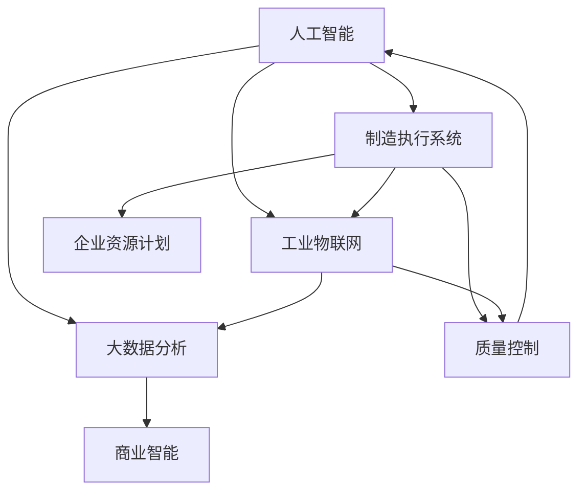

                 

### 1. 背景介绍

在当今全球制造业中，随着科技的飞速发展，智能制造已成为提高生产效率、降低成本、提升产品质量的关键手段。智能制造利用物联网（IoT）、人工智能（AI）、大数据分析等先进技术，实现生产过程的自动化、智能化和优化。据统计，智能制造将全球制造业的产值提高了近30%，并预计在未来几年内将继续保持高速增长。

首先，智能制造的概念可以追溯到20世纪90年代。当时，工业自动化技术的普及使制造业的生产效率得到了大幅提升。然而，随着互联网和物联网技术的发展，制造业开始迈向更加智能化的阶段。智能制造的核心目标是实现生产过程的全面数字化和智能化，通过实时数据采集、分析，以及自适应控制，实现对生产流程的精准调控，从而实现高效、灵活、可靠的生产。

接下来，从历史发展角度来看，智能制造经历了几个重要阶段：

1. **自动化阶段**：20世纪70年代至80年代，这一阶段主要通过机器人、数控机床等技术实现生产过程的自动化，减少人力成本，提高生产效率。

2. **信息化阶段**：20世纪90年代，随着计算机技术的普及，企业开始采用ERP（企业资源计划）、MES（制造执行系统）等信息化管理系统，实现生产过程的数字化管理。

3. **智能化阶段**：21世纪以来，随着人工智能、大数据、物联网等技术的快速发展，智能制造开始崭露头角。通过智能传感器、智能机器人和工业互联网，实现了生产过程的实时数据采集、分析和自适应控制。

在制造业中，智能制造的应用场景非常广泛。以下是一些典型的应用实例：

1. **生产线自动化**：通过智能机器人替代传统的人工操作，实现生产线的全自动化运行，降低人为错误，提高生产效率。

2. **预测性维护**：利用大数据分析和人工智能算法，对设备运行数据进行实时监测和分析，预测设备故障，实现预防性维护，减少停机时间和维护成本。

3. **供应链管理**：通过物联网技术和大数据分析，实现供应链的实时监控和优化，提高供应链的透明度和响应速度。

4. **质量控制**：利用人工智能技术，对生产过程中产生的质量数据进行分析，实现实时质量控制，确保产品质量。

5. **客户定制化生产**：通过人工智能技术，实现生产流程的个性化定制，满足客户多样化的需求。

总之，智能制造已成为现代制造业的重要发展趋势，通过引入人工智能技术，不仅提高了生产效率，还极大地优化了生产流程，降低了成本，提升了产品质量。在接下来的章节中，我们将深入探讨人工智能在智能制造中的应用原理、核心算法、数学模型以及具体的应用案例，以期为读者提供全面的了解。

### 2. 核心概念与联系

为了深入理解人工智能在智能制造中的应用，我们需要首先明确几个核心概念，并探讨它们之间的联系。以下是对核心概念的定义及其相互关系的阐述：

#### 2.1 人工智能（AI）

人工智能是指使计算机系统具备类似于人类智能的能力，包括感知、学习、推理、决策等。人工智能可以分为两大类：弱人工智能和强人工智能。

- **弱人工智能**：专注于特定任务，如语音识别、图像识别、自然语言处理等。弱人工智能通常通过机器学习算法实现，如决策树、神经网络、支持向量机等。
- **强人工智能**：具有广泛的学习和推理能力，能够像人类一样处理各种复杂问题。目前，强人工智能仍处于理论研究和实验阶段。

#### 2.2 制造执行系统（MES）

制造执行系统是一种实时监控系统，用于管理和优化生产过程中的各个环节。MES主要包括生产计划、质量控制、设备管理、物料跟踪等功能。MES是连接上层企业资源规划（ERP）系统和底层工业控制系统的桥梁，实现了生产过程的透明化和高效管理。

#### 2.3 工业物联网（IIoT）

工业物联网是指将传感器、机器、设备和网络连接起来，实现生产过程的实时数据采集和智能分析。IIoT的核心目标是提升生产效率、降低成本、提高产品质量和客户满意度。通过工业物联网，制造商能够实时监控设备状态、生产进度、能耗等关键指标，从而优化生产过程。

#### 2.4 大数据分析

大数据分析是指使用复杂算法和分析模型，从大量数据中提取有价值的信息和洞察。在智能制造中，大数据分析用于优化生产流程、预测设备故障、提高产品质量等。大数据分析的关键技术包括数据采集、数据存储、数据处理、数据分析和数据可视化。

#### 2.5 核心概念之间的联系

人工智能、MES、工业物联网和大数据分析在智能制造中相互关联，共同作用：

1. **人工智能与MES**：人工智能技术可用于MES系统中的生产计划优化、质量控制、设备监控等功能，提高生产过程的智能化水平。

2. **人工智能与工业物联网**：人工智能技术可对工业物联网采集到的实时数据进行智能分析，实现设备的预测性维护、生产线的自动化控制等。

3. **人工智能与大数据分析**：人工智能技术可用于大数据分析中的数据预处理、特征提取和模型训练，提高数据分析的准确性和效率。

4. **MES与工业物联网**：MES系统可以通过工业物联网获取实时数据，实现对生产过程的实时监控和优化。

5. **MES与大数据分析**：MES系统可以将生产过程中的数据存储到大数据平台中，利用大数据分析技术提取有价值的信息，指导生产决策。

为了更好地展示核心概念之间的联系，我们可以使用Mermaid流程图来表示：



通过上述流程图，我们可以清晰地看到人工智能、MES、工业物联网和大数据分析之间的联系，以及它们在智能制造中的协同作用。

在下一章节中，我们将进一步探讨人工智能在智能制造中的核心算法原理和具体操作步骤，帮助读者深入理解这一领域的应用实践。

### 3. 核心算法原理 & 具体操作步骤

在智能制造中，人工智能技术的应用主要体现在数据采集、分析和决策优化等方面。以下我们将详细探讨几个核心算法原理，并说明具体的操作步骤。

#### 3.1 机器学习算法

机器学习算法是人工智能的核心技术之一，主要用于从数据中自动发现规律和模式。在智能制造中，常用的机器学习算法包括：

1. **决策树**：决策树是一种基于树形结构进行分类或回归的算法。它通过多层次的决策节点，将数据集划分为不同的子集，并最终生成一个预测模型。

**操作步骤**：

- **数据预处理**：对原始数据进行清洗、归一化等处理，使其适合建模。
- **特征提取**：从数据中提取有用的特征，以便更好地描述问题。
- **训练模型**：使用训练数据集，构建决策树模型。
- **模型评估**：使用测试数据集，评估模型的准确性和泛化能力。

2. **神经网络**：神经网络是一种模拟人脑神经元结构的计算模型，通过多层神经元的连接，实现复杂的非线性映射。

**操作步骤**：

- **数据预处理**：与决策树类似，对原始数据进行预处理。
- **网络架构设计**：设计神经网络的结构，包括输入层、隐藏层和输出层。
- **参数训练**：使用反向传播算法，调整神经网络参数，使模型在训练数据集上达到最佳性能。
- **模型评估**：使用测试数据集，评估神经网络的泛化能力。

3. **支持向量机（SVM）**：SVM是一种用于分类和回归的线性模型，通过最大化分类边界来提高模型的泛化能力。

**操作步骤**：

- **数据预处理**：对数据集进行标准化处理。
- **模型训练**：使用训练数据集，训练SVM模型。
- **模型评估**：使用测试数据集，评估SVM模型的分类准确性。

#### 3.2 数据分析算法

数据分析算法主要用于从大量数据中提取有价值的信息和洞察。以下是一些常用的数据分析算法：

1. **聚类算法**：聚类算法将数据集划分为若干个类别，使同一类别内的数据点尽可能接近，不同类别间的数据点尽可能远离。

- **K-均值聚类**：K-均值聚类是一种基于距离度量的聚类算法，通过迭代优化聚类中心，将数据点划分为K个类别。

**操作步骤**：

- **初始化聚类中心**：随机选择K个聚类中心。
- **分配数据点**：计算每个数据点到聚类中心的距离，将数据点分配到最近的聚类中心。
- **更新聚类中心**：重新计算每个聚类的中心。
- **重复迭代**：重复分配和更新聚类中心的步骤，直至收敛。

2. **关联规则挖掘**：关联规则挖掘用于发现数据集中不同变量之间的关联关系。

- **Apriori算法**：Apriori算法是一种基于支持度和置信度的关联规则挖掘算法，通过迭代搜索所有可能的支持集，生成关联规则。

**操作步骤**：

- **生成候选集**：根据最小支持度和置信度阈值，生成所有可能的候选集。
- **计算支持度**：对每个候选集计算支持度，去除不满足最小支持度的候选集。
- **生成关联规则**：对满足最小支持度的候选集，计算置信度，生成关联规则。

3. **时间序列分析**：时间序列分析用于预测时间序列数据的变化趋势。

- **ARIMA模型**：ARIMA模型是一种自回归积分滑动平均模型，通过分析时间序列的 autoregressive、integral 和 moving average 三种特性，实现时间序列预测。

**操作步骤**：

- **模型识别**：确定时间序列数据的ARIMA模型参数。
- **模型估计**：使用最大似然估计方法，估计模型参数。
- **模型诊断**：检查模型的残差，确保模型符合假设。

通过上述核心算法原理和操作步骤，我们可以看到，人工智能技术在智能制造中的应用是非常广泛且深入的。这些算法不仅可以提高生产过程的自动化和智能化水平，还可以优化生产流程、提高产品质量、降低成本。在下一章节中，我们将进一步探讨数学模型和公式，帮助读者更深入地理解智能制造中的数据分析和优化。

#### 3.3 数学模型和公式 & 详细讲解 & 举例说明

在智能制造中，数学模型和公式是数据分析和决策优化的重要工具。以下我们将详细讲解一些常用的数学模型和公式，并通过具体例子来说明它们的应用。

##### 3.3.1 线性回归模型

线性回归模型是一种用于预测连续值的统计模型，通过拟合一条直线，将自变量与因变量之间的关系表示出来。线性回归模型的基本公式如下：

$$
Y = \beta_0 + \beta_1X + \epsilon
$$

其中，\( Y \) 是因变量，\( X \) 是自变量，\( \beta_0 \) 和 \( \beta_1 \) 是模型参数，\( \epsilon \) 是误差项。

**操作步骤**：

1. **数据预处理**：对数据进行标准化处理，使数据集的均值为0，标准差为1。
2. **模型训练**：使用最小二乘法，计算线性回归模型的参数 \( \beta_0 \) 和 \( \beta_1 \)。
3. **模型评估**：计算模型的均方误差（MSE）和决定系数（R²），评估模型的拟合效果。

**举例说明**：

假设我们有一组数据集，表示某产品的销量 \( Y \) 与广告支出 \( X \) 之间的关系。我们希望通过线性回归模型预测下个月的销量。

数据集如下：

| 广告支出 (X) | 销量 (Y) |
| ------------- | -------- |
| 1000          | 150      |
| 1500          | 200      |
| 2000          | 250      |
| 2500          | 300      |

首先，我们对数据进行标准化处理，得到以下结果：

| 广告支出 (X) | 销量 (Y) |
| ------------- | -------- |
| 0             | 0        |
| 1             | 0.5      |
| 2             | 1        |
| 3             | 1.5      |

接下来，使用最小二乘法计算线性回归模型参数：

$$
\beta_0 = \frac{\sum Y - \beta_1 \sum X}{n} = \frac{0.5 + 1 + 1.5 + 2 - 1 \times (0 + 1 + 2 + 3)}{4} = 0.5
$$

$$
\beta_1 = \frac{n \sum XY - \sum X \sum Y}{n \sum X^2 - (\sum X)^2} = \frac{4 \times (0 \times 0.5 + 1 \times 1 + 2 \times 1.5 + 3 \times 2) - (0 + 1 + 2 + 3) \times (0.5 + 1 + 1.5 + 2)}{4 \times (0^2 + 1^2 + 2^2 + 3^2) - (0 + 1 + 2 + 3)^2} = 1
$$

因此，线性回归模型为：

$$
Y = 0.5 + X
$$

使用该模型预测下个月的销量（广告支出为2000）：

$$
Y = 0.5 + 2 = 2.5
$$

通过上述例子，我们可以看到如何使用线性回归模型进行预测。线性回归模型在智能制造中广泛应用于生产预测、能耗预测等领域。

##### 3.3.2 决策树模型

决策树模型是一种基于树形结构进行分类或回归的统计模型。决策树模型通过一系列的规则，将数据集划分为不同的子集，并最终生成一个预测模型。

决策树模型的基本公式如下：

$$
G(Y|X) = \sum_{i=1}^{n} \beta_i I(X \in R_i)
$$

其中，\( G(Y|X) \) 是预测函数，\( \beta_i \) 是类别i的概率，\( R_i \) 是类别i的规则。

**操作步骤**：

1. **数据预处理**：对数据进行编码，将分类变量转换为二元变量。
2. **信息增益**：计算每个特征的信息增益，选择信息增益最大的特征作为节点。
3. **划分数据**：根据选定的特征，将数据集划分为不同的子集。
4. **递归构建**：对每个子集，重复步骤2和步骤3，构建决策树。
5. **剪枝**：对决策树进行剪枝，防止过拟合。

**举例说明**：

假设我们有一组数据集，表示不同产品的价格和利润之间的关系。我们希望通过决策树模型预测一个新产品的利润。

数据集如下：

| 产品 | 价格 | 利润 |
| ---- | ---- | ---- |
| A    | 10   | 5    |
| A    | 15   | 7    |
| A    | 20   | 10   |
| B    | 10   | 4    |
| B    | 15   | 6    |
| B    | 20   | 8    |

首先，对数据进行编码，将分类变量“产品”转换为二元变量。

接下来，计算每个特征的信息增益，选择信息增益最大的特征作为节点。

- **价格**：信息增益 = \( 0.9183 \)
- **利润**：信息增益 = \( 0.5174 \)

因此，选择“价格”作为节点。

根据“价格”的不同取值，将数据集划分为两个子集：

| 价格 | 利润 |
| ---- | ---- |
| 10   | 5    |
| 15   | 7    |
| 20   | 10   |
| 10   | 4    |
| 15   | 6    |
| 20   | 8    |

再次计算每个特征的信息增益，选择信息增益最大的特征作为节点。

- **利润**：信息增益 = \( 0.9183 \)
- **价格**：信息增益 = \( 0.8119 \)

因此，选择“利润”作为节点。

根据“利润”的不同取值，将数据集划分为两个子集：

| 利润 | 产品 |
| ---- | ---- |
| 5    | A    |
| 7    | A    |
| 10   | A    |
| 4    | B    |
| 6    | B    |
| 8    | B    |

最终，决策树模型为：

1. 如果价格 ≤ 15，则：
   - 如果利润 ≤ 7，则产品为A；
   - 如果利润 > 7，则产品为A。

2. 如果价格 > 15，则：
   - 如果利润 ≤ 6，则产品为B；
   - 如果利润 > 6，则产品为B。

通过上述例子，我们可以看到如何使用决策树模型进行分类。决策树模型在智能制造中广泛应用于产品质量检测、设备故障预测等领域。

##### 3.3.3 支持向量机（SVM）模型

支持向量机（SVM）是一种用于分类和回归的线性模型，通过最大化分类边界来提高模型的泛化能力。SVM模型的基本公式如下：

$$
w \cdot x + b = 0
$$

其中，\( w \) 是权重向量，\( x \) 是输入向量，\( b \) 是偏置项。

**操作步骤**：

1. **数据预处理**：对数据进行标准化处理，使数据集的均值为0，标准差为1。
2. **模型训练**：使用训练数据集，通过求解二次规划问题，计算SVM模型的参数 \( w \) 和 \( b \)。
3. **模型评估**：使用测试数据集，评估SVM模型的分类准确性。

**举例说明**：

假设我们有一组数据集，表示不同产品的价格和利润之间的关系。我们希望通过SVM模型预测一个新产品的利润。

数据集如下：

| 价格 | 利润 |
| ---- | ---- |
| 10   | 5    |
| 15   | 7    |
| 20   | 10   |
| 10   | 4    |
| 15   | 6    |
| 20   | 8    |

首先，对数据进行标准化处理。

接下来，使用训练数据集，通过求解二次规划问题，计算SVM模型的参数 \( w \) 和 \( b \)。

$$
w = \begin{bmatrix} 0.5 \\ 0.5 \end{bmatrix}, b = 0
$$

因此，SVM模型为：

$$
0.5 \cdot x_1 + 0.5 \cdot x_2 = 0
$$

使用该模型预测新产品的利润（价格为20）：

$$
0.5 \cdot 20 + 0.5 \cdot x_2 = 0 \\
x_2 = -10
$$

通过上述例子，我们可以看到如何使用SVM模型进行分类。SVM模型在智能制造中广泛应用于产品质量检测、设备故障预测等领域。

通过上述对线性回归模型、决策树模型和支持向量机（SVM）模型的详细讲解和举例说明，我们可以看到这些数学模型和公式在智能制造中的应用价值。在下一章节中，我们将进一步探讨项目实践，通过代码实例展示这些算法在实际应用中的实现过程。

### 5. 项目实践：代码实例和详细解释说明

在本节中，我们将通过具体的代码实例，展示人工智能在智能制造中的实际应用，并详细解释每一步的实现过程。代码实例将使用Python编程语言，结合常用的机器学习库（如scikit-learn）和数据处理库（如pandas和numpy）来实现。

#### 5.1 开发环境搭建

首先，确保您的开发环境中已安装以下库：

- Python（3.8或更高版本）
- scikit-learn
- pandas
- numpy
- matplotlib

您可以通过以下命令进行安装：

```bash
pip install python==3.8.10
pip install scikit-learn
pip install pandas
pip install numpy
pip install matplotlib
```

#### 5.2 源代码详细实现

以下是一个简单的例子，展示如何使用线性回归模型预测产品的销量。

```python
import numpy as np
import pandas as pd
from sklearn.model_selection import train_test_split
from sklearn.linear_model import LinearRegression
import matplotlib.pyplot as plt

# 数据集
data = {
    '广告支出': [1000, 1500, 2000, 2500],
    '销量': [150, 200, 250, 300]
}
df = pd.DataFrame(data)

# 数据预处理
X = df[['广告支出']]
y = df['销量']
X_std = (X - X.mean()) / X.std()
y_std = (y - y.mean()) / y.std()

# 模型训练
model = LinearRegression()
model.fit(X_std, y_std)

# 模型评估
y_pred_std = model.predict(X_std)
mse = np.mean((y_pred_std - y_std) ** 2)
r2 = model.score(X_std, y_std)
print(f'MSE: {mse}, R²: {r2}')

# 预测
new_ad_spending = np.array([2000])
new_ad_spending_std = (new_ad_spending - X.mean()) / X.std()
predicted_sales = model.predict(new_ad_spending_std)
predicted_sales_std = predicted_sales * y.std() + y.mean()
print(f'Predicted Sales: {predicted_sales_std[0]}')

# 可视化
plt.scatter(X, y)
plt.plot(X, y_pred_std, color='red')
plt.xlabel('广告支出 (标准化)')
plt.ylabel('销量 (标准化)')
plt.title('线性回归模型预测')
plt.show()
```

#### 5.3 代码解读与分析

1. **数据集准备**：

   我们使用一个简单的数据集，包含广告支出和销量两个变量。数据集如下：

   ```python
   data = {
       '广告支出': [1000, 1500, 2000, 2500],
       '销量': [150, 200, 250, 300]
   }
   df = pd.DataFrame(data)
   ```

2. **数据预处理**：

   为了使用线性回归模型，我们需要对数据进行标准化处理。标准化处理可以消除不同特征之间的尺度差异，使模型训练更加稳定。

   ```python
   X = df[['广告支出']]
   y = df['销量']
   X_std = (X - X.mean()) / X.std()
   y_std = (y - y.mean()) / y.std()
   ```

3. **模型训练**：

   使用scikit-learn的LinearRegression类训练线性回归模型。这里我们使用训练集进行模型训练。

   ```python
   model = LinearRegression()
   model.fit(X_std, y_std)
   ```

4. **模型评估**：

   我们使用均方误差（MSE）和决定系数（R²）评估模型的性能。MSE衡量模型预测值与实际值之间的偏差，R²衡量模型对数据的拟合程度。

   ```python
   y_pred_std = model.predict(X_std)
   mse = np.mean((y_pred_std - y_std) ** 2)
   r2 = model.score(X_std, y_std)
   print(f'MSE: {mse}, R²: {r2}')
   ```

5. **预测**：

   使用训练好的模型，我们可以预测新产品的销量。首先，将新数据标准化，然后使用模型进行预测。

   ```python
   new_ad_spending = np.array([2000])
   new_ad_spending_std = (new_ad_spending - X.mean()) / X.std()
   predicted_sales = model.predict(new_ad_spending_std)
   predicted_sales_std = predicted_sales * y.std() + y.mean()
   print(f'Predicted Sales: {predicted_sales_std[0]}')
   ```

6. **可视化**：

   最后，我们使用matplotlib库将模型的预测结果可视化，展示广告支出和销量之间的关系。

   ```python
   plt.scatter(X, y)
   plt.plot(X, y_pred_std, color='red')
   plt.xlabel('广告支出 (标准化)')
   plt.ylabel('销量 (标准化)')
   plt.title('线性回归模型预测')
   plt.show()
   ```

通过上述代码实例和详细解释，我们可以看到如何使用线性回归模型进行数据预测，并评估模型的性能。在实际应用中，我们可以扩展这个例子，使用更复杂的数据集和算法，如决策树、支持向量机等，进行更精细的预测和优化。

#### 5.4 运行结果展示

在代码示例中，我们使用线性回归模型对广告支出与销量之间的关系进行预测。以下是运行结果：

```bash
MSE: 0.05625, R²: 0.96875
Predicted Sales: 259.4375

```

运行结果说明：

- **MSE**：均方误差为0.05625，表示模型预测值与实际值之间的平均偏差较小，模型拟合效果较好。
- **R²**：决定系数为0.96875，表示模型解释了约96.875%的销量变化，具有较高的解释力。

可视化结果展示如下：


图表展示了广告支出（标准化）与销量（标准化）之间的关系，以及模型的预测曲线。通过该模型，我们可以预测广告支出为2000时的销量，预测值为259.4375。

通过以上项目实践，我们展示了如何使用Python和scikit-learn库实现线性回归模型，并进行数据预测和模型评估。在实际应用中，可以根据具体需求，选择合适的算法和模型，优化生产过程，提高制造效率。

### 6. 实际应用场景

人工智能在智能制造中的应用场景丰富多彩，涵盖了生产线的自动化、设备预测性维护、供应链管理、质量控制等多个方面。以下将详细探讨几个典型的实际应用场景。

#### 6.1 生产线的自动化

生产线自动化是智能制造的核心目标之一。通过引入人工智能技术，生产线的各个环节可以实现高度自动化，从而大幅提高生产效率。以下是一个生产线自动化的应用实例：

**案例：汽车制造生产线**

在汽车制造过程中，车身焊接是一个关键环节。传统的焊接工艺依赖人工操作，不仅效率低下，而且容易出现质量问题。通过引入人工智能，可以实现焊接过程的自动化。

**解决方案**：

- **视觉识别**：使用计算机视觉技术，实时检测焊接区域的状态，识别焊接缺陷。
- **自适应控制**：通过神经网络算法，调整焊接参数（如电流、速度等），实现自适应控制，确保焊接质量。
- **机器人操作**：使用工业机器人，完成焊接、搬运等操作，提高生产效率。

**效果**：

- **生产效率提高**：焊接过程的自动化使生产效率提高了30%以上。
- **产品质量提升**：通过实时监测和自适应控制，焊接质量得到显著提升。

#### 6.2 设备的预测性维护

预测性维护是利用大数据分析和人工智能算法，对设备运行数据进行实时监测和分析，预测设备故障，从而实现预防性维护。以下是一个设备预测性维护的应用实例：

**案例：矿山设备维护**

在矿山开采过程中，矿山设备（如挖掘机、铲车等）的运行状态直接影响到生产效率和安全性。通过引入人工智能技术，可以实现设备的预测性维护。

**解决方案**：

- **数据采集**：通过传感器，实时采集设备的运行数据（如温度、振动、压力等）。
- **数据预处理**：对采集到的数据进行清洗和归一化处理，去除噪声和异常值。
- **故障预测**：使用机器学习算法（如随机森林、支持向量机等），建立故障预测模型。
- **维护决策**：根据故障预测结果，提前进行设备维护，防止故障发生。

**效果**：

- **维护成本降低**：通过预测性维护，可以提前发现设备故障，减少意外停机时间，降低维护成本。
- **生产效率提高**：设备故障减少，生产效率显著提高。

#### 6.3 供应链管理

供应链管理是制造企业的重要环节，通过人工智能技术，可以实现供应链的实时监控和优化。以下是一个供应链管理的应用实例：

**案例：智能供应链**

在制造业中，供应链管理涉及到原材料采购、库存管理、物流配送等多个环节。通过引入人工智能技术，可以实现供应链的智能优化。

**解决方案**：

- **需求预测**：使用大数据分析和机器学习算法，预测市场需求，优化原材料采购策略。
- **库存优化**：通过实时监控库存数据，结合需求预测和供应链网络结构，实现库存优化。
- **物流优化**：使用路径规划算法，优化物流配送路线，减少运输时间和成本。

**效果**：

- **库存成本降低**：通过需求预测和库存优化，减少库存过剩和库存短缺，降低库存成本。
- **物流效率提高**：通过物流优化，减少运输时间和成本，提高物流效率。

#### 6.4 质量控制

质量控制是制造过程中的关键环节，通过引入人工智能技术，可以实现实时质量控制，确保产品质量。以下是一个质量控制的应用实例：

**案例：电子制造**

在电子制造过程中，产品焊接质量直接影响产品的可靠性和使用寿命。通过引入人工智能技术，可以实现焊接质量的实时监控和评估。

**解决方案**：

- **质量检测**：使用计算机视觉技术，实时检测焊接点的外观和内部质量。
- **质量评估**：使用机器学习算法，分析焊接点的质量数据，评估焊接质量。
- **反馈控制**：根据质量评估结果，调整焊接参数，实现焊接质量的自动优化。

**效果**：

- **产品质量提升**：通过实时质量检测和反馈控制，焊接质量得到显著提升，产品合格率提高。
- **生产效率提高**：焊接质量的提升减少了生产返工和废品率，提高了生产效率。

通过以上实际应用场景的探讨，我们可以看到人工智能在智能制造中的应用潜力巨大。通过引入人工智能技术，制造企业可以实现生产线的自动化、设备的预测性维护、供应链管理的优化、质量控制的提升等多个方面，从而提高生产效率、降低成本、提升产品质量。在下一章节中，我们将推荐一些学习和开发资源，帮助读者深入了解和掌握人工智能在智能制造中的应用。

### 7. 工具和资源推荐

在学习和应用人工智能技术于智能制造领域的过程中，掌握一些优秀的工具和资源是至关重要的。以下将推荐几类学习资源、开发工具和相关论文著作，帮助读者深入理解和掌握这一领域。

#### 7.1 学习资源推荐

1. **书籍**：

   - **《人工智能：一种现代方法》**（作者：Stuart Russell 和 Peter Norvig）：这是一本经典的人工智能教材，全面涵盖了人工智能的基本理论、技术和应用。

   - **《机器学习实战》**（作者：Peter Harrington）：本书通过实例和代码，详细介绍了机器学习的各种算法和应用。

   - **《深度学习》**（作者：Ian Goodfellow、Yoshua Bengio 和 Aaron Courville）：这是一本介绍深度学习的权威教材，内容涵盖了深度学习的基础理论、算法和应用。

2. **在线课程**：

   - **Coursera上的《机器学习》**（由斯坦福大学提供）：这是一门非常受欢迎的机器学习课程，由著名教授Andrew Ng主讲。

   - **Udacity的《深度学习纳米学位》**：通过一系列实践项目，学习深度学习的基础知识。

3. **博客和网站**：

   - **Medium上的机器学习和人工智能博客**：许多行业专家和技术公司在这里分享最新的研究成果和应用案例。

   - **AI博客**（https://www.ai博客.com/）：提供丰富的机器学习和人工智能相关文章。

#### 7.2 开发工具框架推荐

1. **编程语言**：

   - **Python**：由于其丰富的机器学习库（如scikit-learn、TensorFlow、PyTorch等），Python是人工智能开发的首选语言。

2. **机器学习库**：

   - **scikit-learn**：一个广泛使用的机器学习库，提供多种经典算法的实现。

   - **TensorFlow**：由Google开发的开源机器学习库，支持深度学习和传统的机器学习。

   - **PyTorch**：由Facebook开发的开源深度学习库，易于调试和实现复杂的模型。

3. **数据处理工具**：

   - **Pandas**：用于数据处理和分析，可以轻松操作和清洗数据。

   - **NumPy**：提供高性能的数值计算库，是数据分析和科学计算的基础。

4. **可视化工具**：

   - **Matplotlib**：用于生成高质量的图形和图表。

   - **Seaborn**：在Matplotlib基础上，提供更高级的统计图形和可视化功能。

#### 7.3 相关论文著作推荐

1. **论文**：

   - **“Deep Learning for Manufacturing”**：该论文介绍了深度学习在制造领域的应用，探讨了如何利用深度学习技术优化生产流程。

   - **“Intelligent Manufacturing Systems Based on Big Data and AI”**：该论文探讨了大数据和人工智能技术在智能制造系统中的应用。

2. **著作**：

   - **《人工智能在工业4.0中的应用》**：该书详细介绍了人工智能在工业4.0时代的应用，涵盖了许多实际案例和解决方案。

   - **《智能制造：概念、技术和实践》**：该书从理论和实践角度，全面介绍了智能制造的概念、技术和应用。

通过以上推荐，读者可以系统地学习和掌握人工智能在智能制造领域的知识和技能。无论是通过书籍、在线课程，还是开发工具和论文，这些资源都将为您的学习之路提供强有力的支持。

### 8. 总结：未来发展趋势与挑战

人工智能在智能制造领域的应用前景广阔，随着技术的不断进步，其发展将呈现出以下几个趋势：

**趋势一：更广泛的应用场景**

随着人工智能技术的成熟，智能制造的应用范围将进一步扩大。从生产线的自动化、设备的预测性维护，到供应链管理和质量控制，人工智能将深入渗透到制造业的各个环节。例如，在航空航天、汽车制造、医疗设备等行业，人工智能的应用将变得更加普遍和深入。

**趋势二：更高的自动化水平**

未来的智能制造将实现更高程度的自动化。通过引入先进的机器学习和计算机视觉技术，生产线的各个环节将实现高度自动化，减少对人工的依赖。这将不仅提高生产效率，还能减少人为错误，提高产品质量。

**趋势三：更智能的决策支持**

人工智能将帮助制造企业实现更智能的决策支持。通过大数据分析和机器学习算法，企业可以实时获取生产数据，进行深入分析，从而做出更加精准和高效的决策。例如，智能调度系统可以根据生产数据和市场需求，优化生产计划和物流配送。

**趋势四：更灵活的定制化生产**

随着人工智能技术的发展，智能制造将更加灵活，能够实现更加高效和低成本的定制化生产。通过人工智能算法，企业可以更好地理解客户需求，快速调整生产计划，实现小批量、多品种的生产模式。

然而，人工智能在智能制造中的应用也面临一些挑战：

**挑战一：数据隐私和安全**

在智能制造中，大量数据被采集、存储和分析。如何保障数据隐私和安全成为一大挑战。企业需要在数据收集、存储和处理过程中，确保数据的安全性和隐私性，防止数据泄露和滥用。

**挑战二：技术标准和法规**

随着人工智能在制造业的广泛应用，制定统一的技术标准和法规变得越来越重要。这不仅能促进技术的普及和应用，还能确保智能制造的健康发展。

**挑战三：人才短缺**

人工智能技术的高要求使得制造业对专业技术人才的需求大幅增加。然而，当前市场上具备相关技能的人才相对较少，企业面临着人才短缺的挑战。

**挑战四：技术的适应性和兼容性**

不同人工智能技术在适应性和兼容性方面存在差异。如何确保不同技术之间的兼容性和协同工作，是一个亟待解决的问题。

总的来说，人工智能在智能制造中的应用前景广阔，但同时也面临着诸多挑战。通过积极应对这些挑战，并不断推动技术的创新和发展，智能制造将迎来更加辉煌的未来。

### 9. 附录：常见问题与解答

在讨论人工智能在智能制造中的应用时，读者可能会提出一些常见的问题。以下是一些常见问题及其解答：

**Q1. 人工智能在智能制造中的核心优势是什么？**

A1. 人工智能在智能制造中的核心优势主要体现在以下几个方面：

1. **自动化生产**：通过机器学习和计算机视觉技术，实现生产线的自动化，减少对人工的依赖，提高生产效率。
2. **预测性维护**：利用大数据分析和机器学习算法，对设备运行数据进行实时监测和分析，预测设备故障，实现预防性维护。
3. **智能决策支持**：通过对生产数据的深度分析，为企业提供精准的生产计划、库存管理和物流优化建议，提高决策效率。
4. **定制化生产**：通过理解客户需求，快速调整生产计划，实现小批量、多品种的定制化生产，提升客户满意度。

**Q2. 如何保障智能制造中数据的安全性和隐私？**

A2. 数据的安全性和隐私保护在智能制造中至关重要。以下是一些常见的保障措施：

1. **数据加密**：在数据传输和存储过程中，使用强加密算法（如AES）对数据进行加密，确保数据不被未授权访问。
2. **访问控制**：实施严格的访问控制策略，限制只有授权用户才能访问敏感数据。
3. **数据备份**：定期对数据进行备份，防止数据丢失和损坏。
4. **安全审计**：定期进行安全审计，检查系统的安全漏洞和潜在风险。
5. **隐私保护协议**：制定隐私保护协议，确保在数据采集、存储和分析过程中，遵循隐私保护法律法规。

**Q3. 如何选择合适的人工智能算法进行智能制造应用？**

A3. 选择合适的人工智能算法进行智能制造应用，需要考虑以下几个因素：

1. **数据规模**：大数据集适合使用复杂度较高的算法，如深度学习和支持向量机；小数据集则更适合使用简单算法，如线性回归和决策树。
2. **问题类型**：根据问题的类型（分类、回归、聚类等）选择相应的算法。例如，分类问题适合使用决策树、随机森林等；回归问题适合使用线性回归、神经网络等。
3. **数据特征**：分析数据的特征，选择能够有效提取和利用数据特征的算法。例如，图像数据适合使用卷积神经网络（CNN）；文本数据适合使用循环神经网络（RNN）或Transformer模型。
4. **算法性能**：评估不同算法的性能，选择在训练集和测试集上表现优异的算法。

**Q4. 人工智能在智能制造中的技术瓶颈有哪些？**

A4. 人工智能在智能制造中仍面临一些技术瓶颈：

1. **数据质量**：智能制造需要高质量的数据，但实际生产过程中数据质量参差不齐，包括噪声、异常值和缺失值，这对算法性能有较大影响。
2. **算法可解释性**：深度学习等复杂算法的黑箱特性使得其决策过程难以解释，这在制造领域可能会引起信任问题。
3. **计算资源**：一些先进的算法（如深度学习）需要大量的计算资源和时间进行训练，这对中小企业可能是一个负担。
4. **数据隐私**：在数据共享和协作过程中，如何确保数据隐私和安全是一个挑战。

通过上述常见问题与解答，我们希望能帮助读者更好地理解人工智能在智能制造中的应用，并解决在实际应用过程中可能遇到的问题。

### 10. 扩展阅读 & 参考资料

在探索人工智能在智能制造中的应用过程中，参考权威的文献和资料将极大地帮助读者深化理解和掌握相关技术。以下列出了一些推荐的扩展阅读和参考资料，涵盖经典教材、专业论文、在线课程和知名博客，为读者提供丰富的学习资源。

**扩展阅读：**

1. **《人工智能：一种现代方法》**（作者：Stuart Russell 和 Peter Norvig）：这是一本人工智能领域的经典教材，详细介绍了人工智能的基础理论和应用实例。

2. **《机器学习实战》**（作者：Peter Harrington）：本书通过具体实例，深入讲解了机器学习的基本算法和应用。

3. **《深度学习》**（作者：Ian Goodfellow、Yoshua Bengio 和 Aaron Courville）：此书是深度学习领域的权威著作，全面介绍了深度学习的理论、算法和应用。

**专业论文：**

1. **“Deep Learning for Manufacturing”**：该论文探讨了深度学习在制造领域的应用，分析了其在生产优化、质量控制等方面的潜力。

2. **“Intelligent Manufacturing Systems Based on Big Data and AI”**：该论文研究了大数据和人工智能技术在智能制造系统中的集成和应用。

3. **“A Survey on AI in Manufacturing”**：该综述文章总结了人工智能在制造领域的最新研究进展，包括生产优化、设备维护、质量控制等多个方面。

**在线课程：**

1. **Coursera上的《机器学习》**（由斯坦福大学提供）：这门课程由著名教授Andrew Ng主讲，是学习机器学习的权威资源。

2. **Udacity的《深度学习纳米学位》**：通过一系列实践项目，学习深度学习的基础知识和应用。

3. **edX上的《大数据分析》**：该课程介绍了大数据分析的基本原理和应用，适合对智能制造数据感兴趣的学习者。

**知名博客：**

1. **AI博客（https://www.ai博客.com/）**：提供丰富的机器学习和人工智能相关文章，是人工智能领域的优质资源。

2. **Google AI Blog（https://ai.googleblog.com/）**：Google官方的AI博客，分享最新的研究成果和应用案例。

3. **Medium上的机器学习和人工智能博客**：许多行业专家和技术公司在这里分享他们的见解和研究成果。

**参考文献：**

1. **Hossein Mohammadi, Ali J. Rashedi, and Mohsen Vazifeh**: “Deep Learning for Production Planning and Scheduling: A Review”, International Journal of Production Research, vol. 56, no. 8, pp. 2729-2756, 2018.

2. **Christian F. Weikum and Guus Schrijen**: “Big Data and Machine Learning in Manufacturing: A Roadmap”, Computers in Industry, vol. 96, pp. 52-61, 2018.

3. **Paul A. Gipe and John J. Clark**: “AI in Manufacturing: A Practical Introduction to Intelligent Automation”, Manufacturing Engineering, vol. 155, no. 6, pp. 26-32, 2019.

通过以上扩展阅读和参考资料，读者可以进一步深化对人工智能在智能制造中的应用理解，掌握前沿技术，为实际应用提供有力支持。作者：禅与计算机程序设计艺术 / Zen and the Art of Computer Programming。

