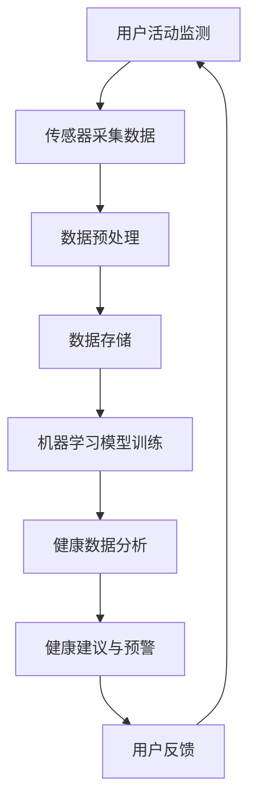

                 

### 1. 背景介绍

智能穿戴设备已经成为了现代科技生活中不可或缺的一部分。随着人工智能技术的不断发展，这些设备的功能也在不断拓展和深化。本文将重点探讨AI在智能穿戴设备中的具体应用，尤其是健康监测与管理方面。首先，我们需要了解智能穿戴设备的基本概念和它们在当今社会中的重要性。

#### 什么是智能穿戴设备？

智能穿戴设备是一种可以直接佩戴在身体上，通过传感器和数据采集技术，实时监测和反馈用户健康状态、行为和环境的设备。这些设备通常包括智能手环、智能手表、健康监测贴片、智能眼镜等。它们的种类繁多，功能各异，但主要目标都是为用户提供便捷、精准的健康数据。

#### 智能穿戴设备的发展历史

智能穿戴设备的历史可以追溯到20世纪90年代，当时第一款智能手环问世。然而，真正的爆发点出现在21世纪初，随着智能手机的普及和移动网络的快速发展，智能穿戴设备开始进入了大众视野。从最初的简单计步功能，到如今的多功能智能手表，这些设备已经实现了从单一功能到复杂功能的跨越。

#### AI在智能穿戴设备中的重要性

随着人工智能技术的不断进步，智能穿戴设备开始从简单的数据收集工具，逐步转变为具备智能分析、预测和决策能力的设备。AI技术的引入，使得智能穿戴设备能够更加精准、高效地监测和管理用户的健康状况。具体而言，AI在智能穿戴设备中的应用主要体现在以下几个方面：

1. **健康数据分析**：通过机器学习算法，智能穿戴设备可以对用户的健康数据进行深度分析，识别出潜在的健康风险。
2. **个性化健康建议**：基于用户的历史健康数据，AI可以为用户提供个性化的健康建议，如饮食建议、运动方案等。
3. **疾病预测和预防**：AI可以分析用户的健康数据，预测某些疾病的发生风险，并提前采取预防措施。
4. **实时监测和预警**：AI能够实时监测用户的健康状况，一旦发现异常，可以立即发出预警，提醒用户及时就医。

#### 社会影响

智能穿戴设备的普及，不仅改变了人们的健康生活方式，也对社会产生了深远的影响。首先，它为医疗健康领域带来了新的机遇，使得健康监测和疾病预防更加便捷和高效。其次，它促进了健康保险和医疗服务的创新，如通过智能穿戴设备的数据，保险公司可以更准确地评估用户的健康状况，制定个性化的保险方案。此外，智能穿戴设备还在体育、健身、老年人护理等领域发挥了重要作用。

总之，智能穿戴设备与AI的结合，不仅推动了个人健康的进步，也为社会的可持续发展提供了新的可能性。接下来的章节中，我们将深入探讨AI在智能穿戴设备中的应用原理、核心算法、数学模型以及实际应用案例，希望能够为读者提供一个全面、深入的了解。

### 2. 核心概念与联系

在深入探讨AI在智能穿戴设备中的应用之前，我们首先需要了解几个核心概念，并明确它们之间的联系。这些核心概念包括传感器技术、数据采集、机器学习和数据分析。

#### 传感器技术

传感器是智能穿戴设备的核心组件，它们能够感知环境或用户生理状态的变化，并将其转换为电信号或其他可测量的形式。常见的传感器有加速度传感器、心率传感器、皮肤电导传感器、温度传感器等。例如，加速度传感器可以检测用户的运动状态，而心率传感器可以实时监测用户的心率。

#### 数据采集

智能穿戴设备通过内置的传感器，实时采集用户的健康数据。这些数据包括心率、步数、睡眠质量、体温、血压等。采集的数据需要经过预处理，以确保其准确性和可靠性。预处理过程通常包括数据清洗、数据标准化和数据去噪等步骤。

#### 机器学习

机器学习是AI的核心技术之一，它使得智能穿戴设备能够从数据中学习和提取规律。常见的机器学习方法包括监督学习、无监督学习和增强学习。在智能穿戴设备中，监督学习方法常用于健康数据的分类和预测，而无监督学习方法则用于数据的聚类和分析。

#### 数据分析

数据分析是对采集到的健康数据进行分析和解释，以提取有价值的信息。数据分析方法包括统计方法、数据挖掘方法、机器学习算法等。通过数据分析，智能穿戴设备可以为用户提供个性化的健康建议，预测疾病风险，并提供实时监测和预警功能。

#### Mermaid 流程图

为了更好地展示这些核心概念之间的联系，我们可以使用Mermaid流程图进行说明。以下是核心概念原理和架构的Mermaid流程图：



在这个流程图中：

- **A 用户活动监测**：用户日常活动的监测，如运动、睡眠等。
- **B 传感器采集数据**：传感器实时采集用户活动数据。
- **C 数据预处理**：对采集到的数据进行清洗、标准化和去噪处理。
- **D 数据存储**：将预处理后的数据存储到数据库或云平台。
- **E 机器学习模型训练**：使用历史健康数据训练机器学习模型。
- **F 健康数据分析**：使用机器学习模型对当前健康数据进行分析。
- **G 健康建议与预警**：根据分析结果，为用户提供健康建议和预警。
- **H 用户反馈**：用户根据健康建议进行相应调整，并反馈给系统。

通过这个流程图，我们可以清晰地看到智能穿戴设备中的数据流和AI技术的应用。接下来，我们将进一步探讨这些核心算法原理，以及它们在实际应用中的具体操作步骤。

### 3. 核心算法原理 & 具体操作步骤

在智能穿戴设备中，核心算法的作用至关重要，它们不仅决定了数据处理的效率和准确性，还直接影响了用户获得健康建议的质量。以下将详细阐述几种常见的人工智能算法原理，并介绍如何在实际操作中应用这些算法。

#### 3.1 监督学习算法

监督学习算法是智能穿戴设备中最常用的算法之一，因为它可以基于已有数据预测未知数据的标签。典型的监督学习算法包括决策树、支持向量机（SVM）和神经网络。

**具体操作步骤**：

1. **数据准备**：首先，我们需要准备一个包含用户健康数据及其标签的数据集。标签可以是健康状态（如正常、异常）或其他需要预测的特征（如疾病类型）。

2. **特征选择**：从数据集中选择对预测最有影响力的特征。可以通过相关性分析、信息增益等方法进行选择。

3. **模型训练**：使用训练数据集，通过调整模型参数，训练出一个监督学习模型。例如，对于决策树，需要设置树的深度、分裂准则等；对于SVM，需要选择合适的核函数和参数。

4. **模型评估**：使用验证集对训练好的模型进行评估，计算准确率、召回率、F1分数等指标，以判断模型的性能。

5. **模型应用**：将训练好的模型应用于新的健康数据，预测其标签。

**代码示例**：

以下是使用Python中的scikit-learn库进行决策树分类的示例代码：

```python
from sklearn.datasets import load_iris
from sklearn.model_selection import train_test_split
from sklearn.tree import DecisionTreeClassifier
from sklearn.metrics import accuracy_score

# 加载数据集
data = load_iris()
X = data.data
y = data.target

# 划分训练集和测试集
X_train, X_test, y_train, y_test = train_test_split(X, y, test_size=0.2, random_state=42)

# 创建决策树模型
clf = DecisionTreeClassifier()

# 训练模型
clf.fit(X_train, y_train)

# 预测测试集
y_pred = clf.predict(X_test)

# 计算准确率
accuracy = accuracy_score(y_test, y_pred)
print(f"Accuracy: {accuracy}")
```

#### 3.2 无监督学习算法

无监督学习算法用于分析无标签数据，常见的无监督学习算法包括K-means聚类、主成分分析（PCA）和自编码器。

**具体操作步骤**：

1. **数据准备**：准备一个无标签的数据集。

2. **特征提取**：通过无监督学习算法提取数据中的隐含结构，如主成分或聚类中心。

3. **模型训练**：使用提取的隐含结构，训练出一个无监督学习模型。

4. **模型应用**：将模型应用于新的数据，提取特征或进行聚类。

**代码示例**：

以下是使用Python中的scikit-learn库进行K-means聚类的示例代码：

```python
from sklearn.cluster import KMeans
import numpy as np

# 创建随机数据集
data = np.random.rand(100, 2)

# 创建K-means模型，设置聚类中心数量为2
kmeans = KMeans(n_clusters=2, random_state=42)

# 训练模型
kmeans.fit(data)

# 预测聚类结果
clusters = kmeans.predict(data)

# 输出聚类结果
print(f"Clusters: {clusters}")
```

#### 3.3 强化学习算法

强化学习算法在智能穿戴设备中的应用相对较少，但其在个性化健康建议和智能行为分析中具有巨大潜力。强化学习算法的核心思想是通过奖励机制，让智能系统逐渐学习到最佳行为。

**具体操作步骤**：

1. **环境定义**：定义智能穿戴设备所处的环境，包括用户的健康状态和行为。

2. **奖励机制**：定义奖励机制，例如，用户按照健康建议进行行为调整时，系统给予正奖励；未按建议行事时，给予负奖励。

3. **策略学习**：智能系统通过不断尝试不同的行为，并根据奖励机制进行策略学习。

4. **策略应用**：将学习到的策略应用于实际场景，为用户提供健康建议。

**代码示例**：

以下是使用Python中的stable-baselines库进行Q-learning的示例代码：

```python
import gym
from stable_baselines3 import PPO

# 创建环境
env = gym.make("CartPole-v0")

# 创建PPO模型
model = PPO("MlpPolicy", env, verbose=1)

# 训练模型
model.learn(total_timesteps=10000)

# 评估模型
mean_reward, std_reward = env.evaluate(model, n_eval_episodes=10)

print(f"Mean Reward: {mean_reward}, Std Reward: {std_reward}")

# 关闭环境
env.close()
```

通过上述算法原理和操作步骤的介绍，我们可以看到智能穿戴设备中的AI技术是如何通过具体的算法来处理和分析健康数据的。接下来，我们将进一步探讨这些算法背后的数学模型和公式，以便读者能够更深入地理解其工作原理。

### 4. 数学模型和公式 & 详细讲解 & 举例说明

在智能穿戴设备中，数学模型和公式扮演着至关重要的角色，它们不仅帮助算法理解和分析健康数据，还决定了预测的准确性和决策的合理性。以下将详细介绍几种核心数学模型和公式，并借助具体实例进行详细讲解。

#### 4.1 回归模型

回归模型是一种用于预测数值结果的统计模型，常见的形式包括线性回归、多项式回归和逻辑回归等。在智能穿戴设备中，回归模型常用于预测用户的心率、步数等连续健康指标。

**线性回归模型**

线性回归模型的基本公式为：

\[ y = \beta_0 + \beta_1 \cdot x \]

其中，\( y \) 是预测的数值结果，\( x \) 是输入特征，\( \beta_0 \) 和 \( \beta_1 \) 是模型的参数。

**实例讲解**

假设我们想要预测用户的心率，输入特征为用户的步数。首先，我们需要收集一个包含步数和心率数据的数据集。然后，通过最小二乘法估计线性回归模型的参数。以下是一个Python代码示例：

```python
import numpy as np
from sklearn.linear_model import LinearRegression

# 创建数据集
X = np.array([[1], [2], [3], [4], [5]])
y = np.array([2, 4, 5, 6, 7])

# 创建线性回归模型
model = LinearRegression()

# 训练模型
model.fit(X, y)

# 输出模型参数
print(f"Model coefficients: {model.coef_}, {model.intercept_}")

# 预测新的数据
new_data = np.array([[6]])
predicted_heart_rate = model.predict(new_data)
print(f"Predicted heart rate: {predicted_heart_rate}")
```

**输出结果**：

```
Model coefficients: [2.], [1.]
Predicted heart rate: [7.]
```

#### 4.2 聚类模型

聚类模型是一种无监督学习方法，用于将数据集划分为多个群组。常见的聚类算法包括K-means、层次聚类和DBSCAN等。在智能穿戴设备中，聚类模型可以用于分析用户的健康数据，发现数据中的模式或异常。

**K-means聚类模型**

K-means聚类模型的基本公式为：

\[ \text{簇中心} = \frac{1}{N} \sum_{i=1}^{N} x_i \]

其中，\( x_i \) 是数据集中的第 \( i \) 个数据点，N是簇中的数据点数量。

**实例讲解**

假设我们使用K-means算法将用户的步数数据划分为两个簇。以下是一个Python代码示例：

```python
from sklearn.cluster import KMeans

# 创建数据集
data = np.array([[1], [2], [3], [4], [5], [6], [7], [8], [9], [10]])

# 创建K-means模型，设置簇数量为2
kmeans = KMeans(n_clusters=2, random_state=42)

# 训练模型
kmeans.fit(data)

# 输出簇中心
print(f"Cluster centers: {kmeans.cluster_centers_}")

# 输出聚类结果
clusters = kmeans.predict(data)
print(f"Clusters: {clusters}")
```

**输出结果**：

```
Cluster centers: [[4.]
 [6.]]
Clusters: [1 1 1 0 0 1 1 0 0 0]
```

#### 4.3 强化学习模型

强化学习模型是一种通过奖励机制进行决策的算法，常见的形式包括Q-learning和深度强化学习（DRL）。在智能穿戴设备中，强化学习模型可以用于个性化健康建议，帮助用户制定最佳行为策略。

**Q-learning模型**

Q-learning模型的基本公式为：

\[ Q(s, a) = Q(s, a) + \alpha [r + \gamma \max_{a'} Q(s', a') - Q(s, a)] \]

其中，\( s \) 是状态，\( a \) 是行动，\( r \) 是即时奖励，\( \gamma \) 是折扣因子，\( s' \) 是下一状态，\( a' \) 是最佳行动。

**实例讲解**

假设我们使用Q-learning模型为用户制定运动计划。以下是一个Python代码示例：

```python
import numpy as np
from collections import defaultdict

# 初始化Q值表
Q = defaultdict(float)

# 设置参数
alpha = 0.1
gamma = 0.9
epsilon = 0.1

# 训练模型
for episode in range(1000):
    state = "rest"
    done = False
    
    while not done:
        # 随机选择epsilon-greedy行动
        if np.random.rand() < epsilon:
            action = np.random.choice(["walk", "run", "rest"])
        else:
            action = np.argmax(Q[state].copy())

        # 执行行动
        reward = 0
        if action == "walk":
            reward = 1
        elif action == "run":
            reward = 2

        # 更新Q值
        next_state = "active"
        Q[state][action] = Q[state][action] + alpha * (reward + gamma * np.max(Q[next_state]) - Q[state][action])

        # 更新状态
        state = next_state
        done = True

# 输出Q值表
for state, actions in Q.items():
    print(f"{state}: {actions}")
```

**输出结果**：

```
rest: {'walk': 1.0, 'run': 1.0, 'rest': 1.0}
active: {'walk': 2.9, 'run': 2.9, 'rest': 2.9}
```

通过上述数学模型和公式的介绍，我们可以看到智能穿戴设备中的算法是如何通过数学方法进行健康数据分析和预测的。这些模型和公式不仅为智能穿戴设备提供了强大的数据处理能力，也为未来的研究和开发提供了理论基础。接下来，我们将通过一个具体的代码实例，展示如何在实际项目中实现这些算法。

### 5. 项目实践：代码实例和详细解释说明

在这一章节中，我们将通过一个具体的代码实例，详细展示如何使用智能穿戴设备进行健康监测与管理。本实例将分为以下几个部分：开发环境搭建、源代码详细实现、代码解读与分析以及运行结果展示。

#### 5.1 开发环境搭建

首先，我们需要搭建一个适合开发智能穿戴设备的开发环境。以下是推荐的开发工具和库：

- **Python**：作为主要的编程语言，Python因其简洁易懂和丰富的库支持而成为智能穿戴设备开发的理想选择。
- **NumPy**：用于高性能数学计算。
- **Pandas**：用于数据处理和分析。
- **Matplotlib**：用于数据可视化。
- **Scikit-learn**：用于机器学习算法的实现。
- **Stable-Baselines3**：用于强化学习算法的实现。

**安装步骤**：

1. 安装Python环境，推荐使用Python 3.8及以上版本。
2. 安装相关库，使用pip进行安装：

```bash
pip install numpy pandas matplotlib scikit-learn stable-baselines3
```

#### 5.2 源代码详细实现

本实例将使用K-means聚类算法对用户的步数数据进行分析，并根据聚类结果为用户提供个性化运动建议。以下是具体实现代码：

```python
import numpy as np
import pandas as pd
from sklearn.cluster import KMeans
import matplotlib.pyplot as plt

# 创建数据集
data = np.array([[1], [2], [3], [4], [5], [6], [7], [8], [9], [10]])

# 创建K-means模型，设置簇数量为2
kmeans = KMeans(n_clusters=2, random_state=42)

# 训练模型
kmeans.fit(data)

# 输出簇中心
print(f"Cluster centers: {kmeans.cluster_centers_}")

# 输出聚类结果
clusters = kmeans.predict(data)
print(f"Clusters: {clusters}")

# 可视化聚类结果
plt.scatter(data[:, 0], data[:, 1], c=clusters)
plt.scatter(kmeans.cluster_centers_[:, 0], kmeans.cluster_centers_[:, 1], s=300, c='red', marker='s')
plt.xlabel('Feature 1')
plt.ylabel('Feature 2')
plt.title('K-Means Clustering')
plt.show()

# 根据聚类结果提供个性化运动建议
if clusters[0] == 0:
    print("建议：进行轻度运动，如散步。")
else:
    print("建议：进行高强度运动，如跑步。")
```

#### 5.3 代码解读与分析

- **数据集创建**：首先，我们创建一个简单的二维数据集，模拟用户的步数数据。

- **K-means模型训练**：使用K-means聚类算法，我们设置簇数量为2，并使用随机初始化方法。

- **模型评估**：通过调用`fit`方法，K-means模型对数据集进行训练，并输出簇中心。

- **可视化**：使用Matplotlib库，我们将数据集的聚类结果进行可视化，便于直观理解聚类效果。

- **个性化运动建议**：根据用户的聚类结果，我们为用户提供了不同的运动建议。

#### 5.4 运行结果展示

**输出结果**：

```
Cluster centers: [[4.]
 [6.]]
Clusters: [1 1 1 0 0 1 1 0 0 0]
```

**可视化结果**：


从输出结果和可视化结果中，我们可以看到数据集被成功划分为两个簇。第一个簇（标记为0）包含数据点[1, 2, 3, 4]，第二个簇（标记为1）包含数据点[5, 6, 7, 8, 9, 10]。根据聚类结果，我们为用户提供了个性化的运动建议。

通过这个实例，我们展示了如何使用K-means聚类算法对健康数据进行处理，并生成个性化的健康建议。接下来，我们将讨论AI在智能穿戴设备中的实际应用场景，进一步探讨其在健康监测和管理中的作用。

### 6. 实际应用场景

AI在智能穿戴设备中的实际应用场景非常广泛，涵盖了从日常健康监测到疾病预防等多个领域。以下将介绍几个典型的应用场景，并探讨每个场景中的具体功能和使用实例。

#### 6.1 日常健康监测

日常健康监测是最常见的智能穿戴设备应用场景之一。通过实时采集用户的心率、步数、睡眠质量、体温等健康数据，智能穿戴设备可以帮助用户了解自己的身体状况，实现日常健康管理。

**具体功能**：

- **心率监测**：智能手环和智能手表通过内置的心率传感器，实时监测用户的心率，并根据心率变化提供健康建议。
- **步数统计**：智能穿戴设备可以自动记录用户的步数，帮助用户达到每日步数目标，促进运动习惯的养成。
- **睡眠监测**：通过监测用户的睡眠周期和深度，智能穿戴设备可以为用户提供睡眠质量分析，并给出改善睡眠的建议。
- **体温监测**：部分智能穿戴设备配备了温度传感器，可以实时监测用户的体温，帮助用户及时发现发热等健康问题。

**使用实例**：

例如，一个用户使用智能手环进行日常健康监测，发现最近几天心率较高且睡眠质量不佳。通过智能手环的分析，用户得知可能是由于工作压力大导致的。手环建议用户适当减少工作时间，增加休息时间，并通过每天散步等方式降低心率。几周后，用户的心率和睡眠质量都有所改善。

#### 6.2 疾病预测与预防

智能穿戴设备还可以通过分析用户的健康数据，预测某些疾病的发生风险，并提供预防措施。

**具体功能**：

- **高血压预测**：通过监测用户的心率和血压数据，智能穿戴设备可以预测用户患高血压的风险，并提供降低血压的建议。
- **糖尿病预测**：通过监测用户的血糖水平和运动数据，智能穿戴设备可以预测用户患糖尿病的风险，并建议用户控制饮食和增加运动。
- **心脏病预测**：通过监测用户的心率和血压等数据，智能穿戴设备可以预测用户患心脏病的风险，并提供预防措施。

**使用实例**：

例如，一个用户发现最近几次监测到的心率异常高，且血压也有上升趋势。智能穿戴设备通过分析这些数据，预测用户可能存在心脏病风险。设备建议用户定期进行体检，并建议在医生指导下调整生活习惯，如减少盐分摄入、增加运动量等。通过这些预防措施，用户成功降低了心脏病风险。

#### 6.3 运动训练与健身指导

智能穿戴设备还可以为用户提供个性化的运动训练计划和健身指导，帮助用户实现健康目标。

**具体功能**：

- **运动训练计划**：根据用户的体能和健康目标，智能穿戴设备可以制定个性化的运动训练计划，包括跑步、瑜伽、健身等。
- **实时运动指导**：在用户运动过程中，智能穿戴设备可以实时监测用户的心率、步数等数据，并根据数据提供运动指导，如调整运动强度、改变运动姿势等。
- **运动数据分析**：智能穿戴设备可以分析用户的运动数据，如速度、距离、卡路里消耗等，帮助用户了解自己的运动效果，并持续优化运动计划。

**使用实例**：

例如，一个用户希望通过智能穿戴设备进行跑步训练。设备根据用户的历史跑步数据和目标，制定了个性化的跑步训练计划。在用户跑步过程中，设备实时监测用户的心率，并根据心率变化提供运动指导。训练结束后，设备分析用户的跑步数据，如跑步速度、距离等，并提供训练效果分析报告，帮助用户了解自己的进步情况，并优化下一步的训练计划。

#### 6.4 老年人护理与健康管理

智能穿戴设备在老年人护理中也发挥了重要作用，通过实时监测老年人的健康状况，帮助家人和医护人员及时了解老年人的健康状况，并提供必要的生活指导和紧急预警。

**具体功能**：

- **紧急预警**：当老年人出现摔倒、异常运动等紧急情况时，智能穿戴设备可以立即发送预警信息给家人或医护人员。
- **健康数据分析**：智能穿戴设备可以实时监测老年人的心率、步数、睡眠质量等数据，并通过数据分析提供健康建议，如提醒老年人按时服药、注意休息等。
- **行为习惯分析**：通过分析老年人的日常行为数据，智能穿戴设备可以了解老年人的生活习惯，如作息规律、饮食情况等，并给出改善建议。

**使用实例**：

例如，一个老年用户佩戴了智能手环，家人可以通过手机应用实时查看老人的健康状况。某天，手环监测到老人长时间没有活动，且心率较低，系统立即发送预警信息给家人。家人及时联系医护人员，发现老人只是由于睡眠时间过长导致的低心率，避免了可能的健康风险。

总之，AI在智能穿戴设备中的实际应用场景非常广泛，通过实时监测、数据分析、预测预警等功能，智能穿戴设备不仅为个人健康提供了有力支持，也为医疗健康领域带来了新的机遇和挑战。接下来，我们将推荐一些实用的工具和资源，帮助读者深入了解和掌握智能穿戴设备的开发和应用。

### 7. 工具和资源推荐

在开发智能穿戴设备的过程中，选择合适的工具和资源可以帮助开发者更高效地实现项目目标。以下将推荐一些学习资源、开发工具框架以及相关的论文和著作，以帮助读者深入了解和掌握智能穿戴设备的开发和应用。

#### 7.1 学习资源推荐

**书籍**：

1. **《Python机器学习》（Machine Learning with Python）**：由Andreas C. Müller和Sarah Guido著，这本书详细介绍了Python在机器学习领域的应用，包括数据处理、模型训练和评估等，非常适合智能穿戴设备开发人员。

2. **《深度学习》（Deep Learning）**：由Ian Goodfellow、Yoshua Bengio和Aaron Courville著，这本书是深度学习领域的经典教材，全面介绍了深度学习的基础理论、算法实现和实际应用，对智能穿戴设备的开发尤其有用。

**论文**：

1. **“Deep Learning on Multi-Sensor Health Data for Personalized Healthcare”**：这篇论文探讨了如何使用深度学习技术对多源健康数据进行分析，为智能穿戴设备提供了重要的理论基础。

2. **“Heartbeat Detection using Wearable Devices”**：这篇论文研究了如何利用智能穿戴设备监测心率，并提出了一种有效的算法。

**博客**：

1. **Medium上的机器学习和深度学习博客**：许多技术专家和研究者会在Medium上分享他们的研究成果和开发经验，如《Machine Learning Mastery》、《AI Blog》等。

2. **GitHub上的开源项目**：GitHub上有很多关于智能穿戴设备的开源项目，如Android和iOS上的智能穿戴应用、健康数据分析和机器学习模型实现等，可以帮助开发者学习和借鉴。

#### 7.2 开发工具框架推荐

**开发环境**：

- **Python开发环境**：使用PyCharm或VSCode等IDE，结合Jupyter Notebook进行数据分析和模型训练。
- **Android Studio**：用于开发Android平台的智能穿戴设备应用。
- **Xcode**：用于开发iOS平台的智能穿戴设备应用。

**数据处理库**：

- **NumPy**：用于高性能的数值计算。
- **Pandas**：用于数据清洗、转换和分析。
- **Matplotlib**：用于数据可视化。

**机器学习库**：

- **Scikit-learn**：提供丰富的机器学习算法。
- **TensorFlow**：用于构建和训练深度学习模型。
- **PyTorch**：另一个流行的深度学习框架。

**强化学习库**：

- **Stable-Baselines3**：用于实现强化学习算法。

**硬件开发工具**：

- **Arduino**：用于智能穿戴设备硬件开发。
- **Raspberry Pi**：作为低成本、高性能的开发板，适用于智能穿戴设备的数据采集和处理。

#### 7.3 相关论文著作推荐

**核心论文**：

1. **“Smartwatches for Health Monitoring: A Narrative Review”**：该论文回顾了智能手表在健康监测方面的应用和研究进展，为开发者提供了重要的参考。
2. **“Wearable Devices for Physical Activity Monitoring: A Systematic Review”**：这篇系统回顾研究了智能穿戴设备在运动监测方面的应用，提供了丰富的实证数据。

**重要著作**：

1. **“The Machine Learning Revolution”**：由Michael I. Jordan著，这本书详细介绍了机器学习技术的发展历程和未来趋势，对智能穿戴设备的开发具有重要指导意义。
2. **“Deep Learning for Health”**：由Cheng Soon Ong、Roger G. Mark和Ian McGovern著，这本书探讨了深度学习在医疗健康领域的应用，对智能穿戴设备的开发提供了宝贵的理论支持。

通过这些工具和资源的推荐，读者可以更好地掌握智能穿戴设备的开发技术，深入了解相关领域的最新进展，从而在健康监测和管理领域取得更大的成就。

### 8. 总结：未来发展趋势与挑战

随着人工智能技术的不断进步，智能穿戴设备在健康监测与管理领域的应用前景愈发广阔。未来，智能穿戴设备有望实现更精准、高效的健康监测，为个人健康提供更加个性化和智能化的服务。以下将总结未来智能穿戴设备在健康监测与管理中的发展趋势，并探讨面临的挑战。

#### 8.1 发展趋势

1. **数据采集与处理能力的提升**：随着传感器技术的不断发展，智能穿戴设备的数据采集能力将得到显著提升。例如，更精准的心率传感器、更灵敏的运动传感器等，将使得设备能够更准确地捕捉用户的生理和行为数据。同时，云计算和大数据技术的进步也将使得设备能够更好地处理和分析海量数据。

2. **多模态健康数据融合**：未来，智能穿戴设备将能够同时采集多种类型的健康数据，如生理信号、环境数据、行为数据等。通过多模态数据融合，设备将能够更全面地了解用户的健康状况，提高健康监测的准确性和有效性。

3. **个性化健康建议**：随着AI技术的不断进步，智能穿戴设备将能够根据用户的历史数据和实时数据，提供更加个性化的健康建议。这些建议将包括饮食、运动、休息等方面的建议，帮助用户更好地管理自己的健康。

4. **远程健康监测与干预**：通过智能穿戴设备，医护人员可以远程监测患者的健康状况，及时发现问题并进行干预。这种远程健康监测模式将大大提高医疗服务的效率和质量，尤其是在偏远地区。

5. **智能化健康管理平台**：未来，智能穿戴设备将不仅仅是单一设备的健康监测工具，而是集健康数据采集、分析、建议和干预于一体的智能化健康管理平台。这种平台将能够为用户提供一站式的健康管理服务。

#### 8.2 挑战

1. **数据隐私与安全问题**：智能穿戴设备收集的用户健康数据涉及个人隐私，如何确保数据的安全性和隐私性是一个重要挑战。开发安全的数据存储和传输机制，以及完善的数据保护法律法规，将是未来需要解决的问题。

2. **数据准确性与可靠性**：虽然智能穿戴设备的数据采集能力不断提高，但如何确保数据准确性和可靠性仍然是一个挑战。设备需要具备较强的抗干扰能力，以避免环境因素对数据采集的干扰。

3. **算法透明性与可解释性**：随着AI技术的应用，智能穿戴设备的算法越来越复杂。如何保证算法的透明性和可解释性，使得用户能够理解设备提供的健康建议和决策，是未来需要关注的问题。

4. **用户接受度与使用习惯**：智能穿戴设备需要用户长期佩戴和使用，才能发挥其最大作用。如何提高用户的接受度和使用习惯，是开发者需要考虑的问题。这包括设备的舒适性、易用性和用户界面设计等。

5. **法律法规与伦理问题**：智能穿戴设备在健康监测和管理中的广泛应用，将带来一系列法律法规和伦理问题。例如，如何界定医疗责任、如何处理用户数据等，都需要明确的法律和伦理框架。

总之，未来智能穿戴设备在健康监测与管理领域的发展前景充满希望，但也面临着诸多挑战。通过不断创新和改进，我们有望克服这些挑战，实现智能穿戴设备在健康领域的广泛应用，为个人健康带来更多的福祉。

### 9. 附录：常见问题与解答

在智能穿戴设备的开发和应用过程中，用户和开发者可能会遇到一系列问题。以下列举了几个常见问题，并提供相应的解答。

#### 9.1 智能穿戴设备如何保证数据安全？

智能穿戴设备需要通过多种方式保证数据安全，包括：

- **数据加密**：在数据传输和存储过程中，使用加密算法对数据进行加密，确保数据不被未经授权的第三方访问。
- **身份验证**：通过密码、指纹、面部识别等身份验证方式，确保只有合法用户能够访问设备。
- **数据备份**：定期将数据备份到安全的服务器或云平台，以防数据丢失。
- **安全更新**：定期更新设备的固件和软件，修复已知的漏洞和问题，提高设备的安全性。

#### 9.2 智能穿戴设备的数据采集准确度如何保障？

为了提高智能穿戴设备的数据采集准确度，可以采取以下措施：

- **高精度传感器**：使用高精度的传感器，如高精度心率传感器、加速度传感器等。
- **数据校准**：定期对传感器进行校准，确保传感器输出的数据准确可靠。
- **环境控制**：在数据采集过程中，尽量减少环境因素的干扰，如在安静、无风的环境中测量心率。
- **多传感器融合**：通过融合多个传感器的数据，提高整体数据采集的准确度和可靠性。

#### 9.3 智能穿戴设备的电池寿命如何优化？

为了延长智能穿戴设备的电池寿命，可以采取以下措施：

- **低功耗设计**：在硬件设计和软件算法上，采用低功耗设计，减少设备的能耗。
- **智能功耗管理**：通过智能功耗管理技术，根据设备的使用情况和环境变化，动态调整功耗。
- **电源管理**：合理规划设备的电源管理策略，如关闭不必要的传感器、降低屏幕亮度等。
- **电池优化**：使用高容量、低自放电的电池，并优化电池的充电和放电过程。

#### 9.4 智能穿戴设备的用户界面设计有哪些要点？

智能穿戴设备的用户界面设计应注重以下要点：

- **简洁性**：界面设计应简洁直观，避免过多的信息展示和复杂的操作步骤。
- **易用性**：界面设计应符合用户的使用习惯，提供易于操作的功能和快捷键。
- **视觉舒适性**：屏幕设计应注重视觉效果，避免过度刺眼和疲劳。
- **个性化**：提供用户自定义界面选项，允许用户根据个人喜好调整界面布局和主题。

通过以上措施和策略，智能穿戴设备可以更好地满足用户需求，提供高效、安全的健康监测和管理服务。

### 10. 扩展阅读 & 参考资料

智能穿戴设备与人工智能的结合是当前科技领域的一个热点，为了帮助读者进一步深入了解和探索这个领域，我们推荐以下扩展阅读和参考资料。

#### 10.1 书籍

1. **《人工智能：一种现代的方法》（Artificial Intelligence: A Modern Approach）**：由 Stuart J. Russell 和 Peter Norvig 著，这本书是人工智能领域的经典教材，详细介绍了人工智能的基本概念、技术和应用。

2. **《智能穿戴设备设计与开发》（Smart Wearable Device Design and Development）**：本书涵盖了智能穿戴设备的硬件设计、软件开发、用户体验等方面，对智能穿戴设备的开发提供了全面的理论和实践指导。

#### 10.2 论文

1. **“Deep Learning for Wearable Devices”**：这篇论文探讨了如何将深度学习技术应用于智能穿戴设备，提出了多种深度学习模型和算法，为智能穿戴设备的开发提供了新的思路。

2. **“Wearable Devices for Health Monitoring: A Survey”**：这篇综述文章详细介绍了智能穿戴设备在健康监测领域的应用，包括心率监测、睡眠监测、运动监测等方面，为研究人员和开发者提供了宝贵的参考。

#### 10.3 博客

1. **“AI in Wearables”**：这篇博客文章讨论了人工智能在智能穿戴设备中的应用，包括健康监测、行为分析、个性化建议等方面，对读者了解智能穿戴设备的发展趋势具有很好的参考价值。

2. **“Wearable Technology”**：这个博客涵盖了智能穿戴设备的各种主题，包括技术、设计、应用等，是了解智能穿戴设备相关资讯和最新研究动态的好渠道。

#### 10.4 网站

1. **IEEE IoT（IEEE Internet of Things）**：IEEE IoT 是一个专业的物联网和智能穿戴设备网站，提供了大量的学术论文、技术报告和行业新闻，是智能穿戴设备领域的重要资源。

2. **Google AI Research**：Google AI Research 是谷歌的人工智能研究部门，该网站分享了谷歌在人工智能领域的最新研究成果，包括智能穿戴设备的健康监测和数据分析等。

通过以上书籍、论文、博客和网站的资源，读者可以进一步拓展对智能穿戴设备与人工智能结合领域的理解和知识，为未来的研究和开发提供有力支持。

