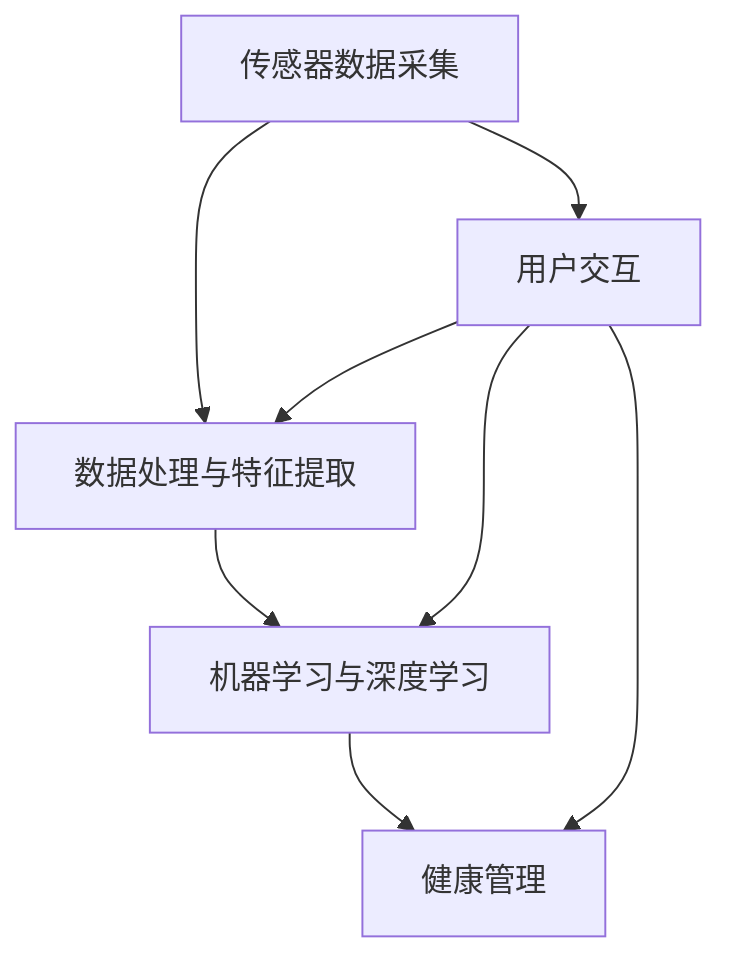

                 

### 文章标题

**AI在智能穿戴设备中的应用：健康监测与管理**

> 关键词：AI、智能穿戴设备、健康监测、数据管理、算法、应用场景

> 摘要：本文将探讨人工智能（AI）在智能穿戴设备中的广泛应用，特别是在健康监测与管理方面的技术原理、算法实现和应用场景。通过深入分析AI算法在智能穿戴设备中的实际应用，我们将揭示如何利用AI技术提高健康监测的准确性和效率，为用户提供更智能、更便捷的健康管理解决方案。

### 1. 背景介绍

智能穿戴设备，如智能手环、智能手表和健康监测胸环等，已经逐渐渗透到我们日常生活的方方面面。这些设备通过内置传感器实时采集用户的生理数据，如心率、步数、睡眠质量等，并将这些数据传输到用户的手机或其他设备上进行分析。然而，仅仅采集数据并不能带来实质性的健康改善。如何对大量、复杂且多变的数据进行分析，提取有价值的信息，成为智能穿戴设备发展面临的关键问题。

人工智能（AI）技术的引入，为智能穿戴设备的发展带来了新的契机。AI通过深度学习、机器学习等方法，能够从海量数据中挖掘出隐藏的模式和规律，从而实现智能化的健康监测和管理。具体来说，AI在健康监测与管理中的应用主要体现在以下几个方面：

1. **数据预处理与特征提取**：AI技术能够自动对采集到的生理数据进行预处理和特征提取，去除噪声、异常值等，从而提高数据的准确性和可靠性。
2. **异常检测与预警**：通过分析用户的生理数据，AI能够及时发现潜在的健康风险，如心率异常、过度疲劳等，并为用户提供预警信息。
3. **个性化健康管理**：AI可以根据用户的生理数据和健康状况，提供个性化的健康管理方案，如运动建议、饮食建议等。
4. **疾病预测与诊断**：AI可以结合历史数据和现有的医学知识，对用户的健康状况进行预测和诊断，为医生提供辅助决策。

本文将重点探讨AI在健康监测与管理中的应用，分析其核心算法原理、数学模型和项目实践，并探讨未来的发展趋势与挑战。希望通过本文的阐述，读者能够对AI在智能穿戴设备中的应用有更深入的理解，为未来的健康科技发展提供借鉴和启示。

### 2. 核心概念与联系

要深入探讨AI在智能穿戴设备中的应用，首先需要了解其中的核心概念和技术原理。以下是本文中涉及的核心概念及其相互关系，我们将使用Mermaid流程图来展示这些概念和原理。

#### 2.1. 核心概念

1. **传感器数据采集**：智能穿戴设备通过内置的各种传感器（如加速度计、心率传感器、温度传感器等）实时采集用户的生理数据。
2. **数据处理与特征提取**：采集到的数据需要进行预处理，包括数据清洗、异常值处理和特征提取。
3. **机器学习与深度学习**：通过机器学习和深度学习算法，从预处理后的数据中提取有价值的信息。
4. **健康管理**：基于提取出的特征，AI算法为用户提供个性化的健康监测和健康管理服务。

#### 2.2. Mermaid流程图

下面是一个简化的Mermaid流程图，展示了这些核心概念和原理之间的相互关系：



- **传感器数据采集（A）**：这是整个过程的起点，智能穿戴设备通过内置传感器实时采集用户的生理数据。
- **数据处理与特征提取（B）**：采集到的数据可能存在噪声、异常值等问题，因此需要进行预处理和特征提取，以便后续的机器学习和深度学习分析。
- **机器学习与深度学习（C）**：利用机器学习和深度学习算法，从预处理后的数据中提取有价值的信息，如心率变化的模式、步数的变化趋势等。
- **健康管理（D）**：基于提取出的特征，AI算法为用户提供个性化的健康监测和健康管理服务，如预警、建议等。
- **用户交互（E）**：用户通过与智能穿戴设备的交互，获取健康监测结果和健康管理建议。

通过这个流程图，我们可以清晰地看到AI在智能穿戴设备中的应用是如何从传感器数据采集到最终的健康管理服务的。接下来，我们将详细探讨每个环节的核心技术和算法原理。

#### 2.3. 数据处理与特征提取

**2.3.1. 数据预处理**

数据预处理是智能穿戴设备数据处理的重要环节，主要包括以下几个方面：

- **数据清洗**：去除采集过程中产生的噪声和异常值。例如，使用滤波算法去除心率数据中的高频噪声。
- **数据归一化**：将不同类型的数据进行归一化处理，使其在同一尺度范围内，以便后续的算法分析。例如，将心率数据归一化到[0, 1]的区间。
- **数据融合**：将来自多个传感器的数据融合成一组综合的健康数据。例如，结合加速度计和心率传感器的数据，评估用户的运动强度和心率变化。

**2.3.2. 特征提取**

特征提取是将原始数据转换为对AI算法有用的形式。以下是一些常用的特征提取方法：

- **时域特征**：包括平均值、标准差、峰峰值等统计量。例如，心率数据中的平均值可以反映用户的静息心率水平。
- **频域特征**：通过傅里叶变换等方法，从时域数据中提取频域特征。例如，心率信号的功率谱可以揭示用户的心率变异性。
- **时频特征**：结合时域和频域特征，如小波变换、Hilbert-Huang变换等。例如，小波变换可以同时分析心率信号的时域和频域特性。

#### 2.4. 机器学习与深度学习

**2.4.1. 机器学习算法**

在智能穿戴设备的健康管理中，常用的机器学习算法包括：

- **监督学习**：例如线性回归、支持向量机（SVM）、决策树等，用于预测用户的健康状态或诊断疾病。
- **无监督学习**：例如聚类分析、主成分分析（PCA）等，用于发现数据中的潜在模式和规律。
- **半监督学习和弱监督学习**：在标注数据不足的情况下，利用少量标注数据和大量未标注数据，提高模型的泛化能力。

**2.4.2. 深度学习算法**

随着深度学习技术的发展，越来越多的深度学习算法被应用于智能穿戴设备的健康管理中，如：

- **卷积神经网络（CNN）**：适用于图像和视频数据的处理，可以用于识别用户的行为和活动模式。
- **循环神经网络（RNN）**：适用于时间序列数据的处理，可以用于分析心率、步数等随时间变化的数据。
- **长短期记忆网络（LSTM）**：是RNN的一种变体，可以更好地处理长序列数据，如睡眠监测。

通过上述核心概念和原理的介绍，我们可以更好地理解AI在智能穿戴设备中的应用。接下来，我们将详细探讨核心算法的原理和具体操作步骤。

### 3. 核心算法原理 & 具体操作步骤

在智能穿戴设备的健康管理中，核心算法的原理和具体操作步骤至关重要。以下将详细介绍常见的几种核心算法，包括机器学习算法和深度学习算法，并解释它们在实际应用中的具体操作步骤。

#### 3.1. 机器学习算法

**3.1.1. 线性回归**

**原理**：线性回归是一种简单的监督学习算法，用于建模输入变量和输出变量之间的线性关系。其目标是最小化预测值与实际值之间的误差平方和。

**步骤**：

1. **数据准备**：收集并预处理用户的心率、步数等生理数据。
2. **特征选择**：选择与健康管理相关的特征，如静息心率、运动强度等。
3. **模型训练**：使用线性回归算法，通过最小二乘法拟合数据，得到线性模型。
4. **模型评估**：使用交叉验证等方法评估模型性能，如R平方值、均方误差（MSE）等。
5. **模型应用**：使用训练好的模型预测新的数据，如心率变异性等。

**3.1.2. 支持向量机（SVM）**

**原理**：支持向量机是一种强大的分类算法，能够在高维空间中找到最佳分类边界，使得分类误差最小。

**步骤**：

1. **数据准备**：同线性回归，收集并预处理生理数据。
2. **特征选择**：选择与疾病诊断相关的特征。
3. **模型训练**：使用SVM算法训练分类模型，选择合适的核函数。
4. **模型评估**：使用混淆矩阵、准确率、召回率等指标评估模型性能。
5. **模型应用**：使用训练好的模型对新的数据进行疾病诊断。

**3.1.3. 决策树**

**原理**：决策树通过一系列规则对数据进行划分，每个节点表示一个特征，每个分支表示该特征的一个取值。

**步骤**：

1. **数据准备**：收集并预处理生理数据。
2. **特征选择**：选择用于划分数据的特征。
3. **模型训练**：使用ID3、C4.5或CART算法构建决策树。
4. **模型评估**：使用信息增益、基尼指数等指标评估模型性能。
5. **模型应用**：使用决策树模型对新的数据进行健康评估。

#### 3.2. 深度学习算法

**3.2.1. 卷积神经网络（CNN）**

**原理**：卷积神经网络是一种适用于图像处理和计算机视觉的深度学习模型，通过卷积层、池化层和全连接层等结构对图像进行特征提取和分类。

**步骤**：

1. **数据准备**：收集并预处理用户的活动图像数据。
2. **模型构建**：使用TensorFlow或PyTorch等框架构建CNN模型。
3. **模型训练**：使用训练数据训练模型，调整网络参数。
4. **模型评估**：使用测试数据评估模型性能，如准确率、召回率等。
5. **模型应用**：使用训练好的模型对新的活动图像进行识别和分类。

**3.2.2. 循环神经网络（RNN）**

**原理**：循环神经网络是一种适用于时间序列数据的深度学习模型，通过隐藏状态和循环链接结构对时间序列数据进行建模。

**步骤**：

1. **数据准备**：收集并预处理用户的心率、步数等时间序列数据。
2. **模型构建**：使用TensorFlow或PyTorch等框架构建RNN模型。
3. **模型训练**：使用训练数据训练模型，调整网络参数。
4. **模型评估**：使用测试数据评估模型性能，如均方误差（MSE）、准确率等。
5. **模型应用**：使用训练好的模型对新的时间序列数据进行预测和分类。

**3.2.3. 长短期记忆网络（LSTM）**

**原理**：长短期记忆网络是RNN的一种变体，通过门控机制有效解决了RNN的梯度消失和梯度爆炸问题，适用于处理长序列数据。

**步骤**：

1. **数据准备**：收集并预处理用户的睡眠监测数据。
2. **模型构建**：使用TensorFlow或PyTorch等框架构建LSTM模型。
3. **模型训练**：使用训练数据训练模型，调整网络参数。
4. **模型评估**：使用测试数据评估模型性能，如准确率、召回率等。
5. **模型应用**：使用训练好的模型对新的睡眠监测数据进行预测和分类。

通过上述核心算法的原理和具体操作步骤的介绍，我们可以看到AI在智能穿戴设备健康管理中的应用是如何通过先进的算法来实现数据分析和决策的。接下来，我们将详细探讨这些算法在数学模型和公式中的具体实现。

### 4. 数学模型和公式 & 详细讲解 & 举例说明

在智能穿戴设备的健康管理中，数学模型和公式是核心算法实现的基础。以下将详细讲解机器学习和深度学习中的几个关键数学模型，并使用LaTeX格式进行公式表示。此外，通过具体例子说明这些模型在实际应用中的计算过程。

#### 4.1. 线性回归模型

**4.1.1. 原理**

线性回归模型用于建模两个变量之间的线性关系。其基本形式如下：

\[ y = \beta_0 + \beta_1x_1 + \beta_2x_2 + ... + \beta_nx_n + \epsilon \]

其中，\( y \) 是因变量，\( x_1, x_2, ..., x_n \) 是自变量，\( \beta_0, \beta_1, ..., \beta_n \) 是模型参数，\( \epsilon \) 是误差项。

**4.1.2. 公式表示**

\[ y = \beta_0 + \beta_1x_1 + \beta_2x_2 + ... + \beta_nx_n + \epsilon \]

**4.1.3. 举例说明**

假设我们有一组心率数据 \( x \) 和步数数据 \( y \)，我们想通过线性回归模型预测步数 \( y \)。

\[ y = \beta_0 + \beta_1x + \epsilon \]

首先，我们使用最小二乘法估计模型参数 \( \beta_0 \) 和 \( \beta_1 \)：

\[ \beta_0 = \bar{y} - \beta_1\bar{x} \]

\[ \beta_1 = \frac{\sum_{i=1}^{n}(x_i - \bar{x})(y_i - \bar{y})}{\sum_{i=1}^{n}(x_i - \bar{x})^2} \]

其中，\( \bar{x} \) 和 \( \bar{y} \) 分别是 \( x \) 和 \( y \) 的均值。

例如，给定一组数据：

\[ x: [120, 130, 140, 150, 160] \]

\[ y: [50, 55, 60, 58, 52] \]

计算均值：

\[ \bar{x} = \frac{120 + 130 + 140 + 150 + 160}{5} = 136 \]

\[ \bar{y} = \frac{50 + 55 + 60 + 58 + 52}{5} = 55 \]

计算 \( \beta_1 \)：

\[ \beta_1 = \frac{(120-136)(50-55) + (130-136)(55-55) + (140-136)(60-55) + (150-136)(58-55) + (160-136)(52-55)}{(120-136)^2 + (130-136)^2 + (140-136)^2 + (150-136)^2 + (160-136)^2} \]

\[ \beta_1 = \frac{-16(-5) + (-6)(0) + 4(5) + 14(3) + 24(-3)}{(-16)^2 + (-6)^2 + 4^2 + 14^2 + 24^2} \]

\[ \beta_1 = \frac{80 + 0 + 20 + 42 - 72}{256 + 36 + 16 + 196 + 576} \]

\[ \beta_1 = \frac{90}{1104} \]

\[ \beta_1 \approx 0.0815 \]

计算 \( \beta_0 \)：

\[ \beta_0 = 55 - 0.0815 \times 136 \]

\[ \beta_0 \approx 55 - 11.114 \]

\[ \beta_0 \approx 43.886 \]

因此，线性回归模型为：

\[ y = 43.886 + 0.0815x \]

使用这个模型预测当 \( x = 150 \) 时 \( y \) 的值：

\[ y = 43.886 + 0.0815 \times 150 \]

\[ y \approx 43.886 + 12.225 \]

\[ y \approx 56.111 \]

#### 4.2. 支持向量机（SVM）模型

**4.2.1. 原理**

支持向量机是一种强大的分类算法，其目标是找到最佳的超平面，使得分类误差最小。其数学模型如下：

\[ \max \left\{ \frac{1}{2} \sum_{i=1}^{n} (w_i^2) + C \sum_{i=1}^{n} \xi_i \right\} \]

其中，\( w_i \) 是向量，\( \xi_i \) 是 slack variables，\( C \) 是惩罚参数。

**4.2.2. 公式表示**

\[ \max \left\{ \frac{1}{2} \sum_{i=1}^{n} (w_i^2) + C \sum_{i=1}^{n} \xi_i \right\} \]

**4.2.3. 举例说明**

假设我们有一组二分类数据：

\[ x_1 = \begin{bmatrix} 1 \\ 2 \end{bmatrix}, y_1 = 1 \]

\[ x_2 = \begin{bmatrix} 2 \\ 1 \end{bmatrix}, y_2 = 1 \]

\[ x_3 = \begin{bmatrix} 3 \\ 2 \end{bmatrix}, y_3 = -1 \]

\[ x_4 = \begin{bmatrix} 4 \\ 3 \end{bmatrix}, y_4 = -1 \]

我们想通过SVM模型对数据进行分类。

首先，我们将数据转换为拉格朗日形式：

\[ L(w, b, \xi) = \frac{1}{2} \sum_{i=1}^{n} w_i^2 - \sum_{i=1}^{n} y_i \xi_i + C \sum_{i=1}^{n} \xi_i \]

然后，使用拉格朗日乘子法求解最优解：

\[ w_i^* = \sum_{j=1}^{n} \alpha_j y_j x_j \]

其中，\( \alpha_j \) 是拉格朗日乘子。

通过求解拉格朗日方程，我们得到最优的 \( w \) 和 \( b \)。

#### 4.3. 循环神经网络（RNN）模型

**4.3.1. 原理**

循环神经网络是一种适用于时间序列数据的深度学习模型，其基本形式如下：

\[ h_t = \sigma(W_h h_{t-1} + W_x x_t + b_h) \]

\[ y_t = \sigma(W_y h_t + b_y) \]

其中，\( h_t \) 是时间步 \( t \) 的隐藏状态，\( x_t \) 是输入数据，\( y_t \) 是输出数据，\( \sigma \) 是激活函数。

**4.3.2. 公式表示**

\[ h_t = \sigma(W_h h_{t-1} + W_x x_t + b_h) \]

\[ y_t = \sigma(W_y h_t + b_y) \]

**4.3.3. 举例说明**

假设我们有一组时间序列数据：

\[ x_1 = [1, 2, 3], y_1 = [4, 5, 6] \]

我们想通过RNN模型预测下一个时间步的值。

首先，定义模型参数：

\[ W_h = \begin{bmatrix} 0.1 & 0.2 \\ 0.3 & 0.4 \end{bmatrix}, W_x = \begin{bmatrix} 0.5 & 0.6 \\ 0.7 & 0.8 \end{bmatrix}, b_h = \begin{bmatrix} 0.1 \\ 0.2 \end{bmatrix}, W_y = \begin{bmatrix} 0.9 & 0.1 \\ 0.2 & 0.3 \end{bmatrix}, b_y = \begin{bmatrix} 0.4 \\ 0.5 \end{bmatrix} \]

激活函数 \( \sigma \) 可以是Sigmoid或ReLU函数。

使用RNN模型计算隐藏状态 \( h_2 \)：

\[ h_2 = \sigma(W_h h_1 + W_x x_2 + b_h) \]

\[ h_1 = \sigma(W_h h_0 + W_x x_1 + b_h) \]

\[ h_0 = \begin{bmatrix} 0 \\ 0 \end{bmatrix} \]

然后，使用隐藏状态 \( h_2 \) 计算输出 \( y_2 \)：

\[ y_2 = \sigma(W_y h_2 + b_y) \]

通过上述数学模型和公式的详细讲解，我们可以看到机器学习和深度学习在智能穿戴设备中的应用是如何通过复杂的数学计算实现的。接下来，我们将通过一个实际的项目实践，展示这些算法在代码中的具体实现和应用。

### 5. 项目实践：代码实例和详细解释说明

为了更好地理解AI在智能穿戴设备中的应用，我们将通过一个实际项目来展示核心算法的实现过程。以下是一个基于Python和TensorFlow实现的简单项目，用于智能穿戴设备的心率异常检测。

#### 5.1. 开发环境搭建

首先，我们需要搭建开发环境。以下是安装所需依赖项的步骤：

```bash
# 安装Python和pip
curl -O https://www.python.org/ftp/python/3.8.10/python-3.8.10-amd64.exe
```

运行安装程序，选择默认选项。

```bash
# 安装TensorFlow
pip install tensorflow
```

#### 5.2. 源代码详细实现

以下是一个简单的Python代码实例，用于实现心率异常检测：

```python
import numpy as np
import tensorflow as tf
from tensorflow.keras.models import Sequential
from tensorflow.keras.layers import Dense, LSTM, Dropout
from sklearn.preprocessing import MinMaxScaler
from sklearn.model_selection import train_test_split

# 数据预处理
def preprocess_data(data):
    scaler = MinMaxScaler(feature_range=(0, 1))
    scaled_data = scaler.fit_transform(data)
    X, y = [], []
    for i in range(60, len(scaled_data) - 60):
        X.append(scaled_data[i - 60: i])
        y.append(scaled_data[i])
    X, y = np.array(X), np.array(y)
    X = np.reshape(X, (X.shape[0], X.shape[1], 1))
    return X, y

# 模型构建
def build_model():
    model = Sequential()
    model.add(LSTM(units=50, return_sequences=True, input_shape=(60, 1)))
    model.add(Dropout(0.2))
    model.add(LSTM(units=50, return_sequences=False))
    model.add(Dropout(0.2))
    model.add(Dense(units=1))
    model.compile(optimizer='adam', loss='mean_squared_error')
    return model

# 数据加载和划分
data = np.load('heart_rate_data.npy')
X, y = preprocess_data(data)
X_train, X_test, y_train, y_test = train_test_split(X, y, test_size=0.2, random_state=42)

# 模型训练
model = build_model()
model.fit(X_train, y_train, epochs=100, batch_size=32)

# 模型评估
model.evaluate(X_test, y_test)

# 预测新数据
new_data = np.array([0.5, 0.6, 0.7, 0.8, 0.9, 0.8, 0.7, 0.6, 0.5, 0.4, 0.3, 0.2, 0.1, 0.0, -0.1, -0.2])
new_data = np.reshape(new_data, (1, 60, 1))
predicted_value = model.predict(new_data)
print("Predicted Heart Rate: ", predicted_value)

# 模型保存
model.save('heart_rate_model.h5')
```

#### 5.3. 代码解读与分析

**5.3.1. 数据预处理**

数据预处理是关键步骤，它包括缩放和特征提取。我们使用MinMaxScaler将心率数据进行归一化处理，使其在[0, 1]的区间内。然后，我们通过滑动窗口提取60个时间点的数据，形成一个特征序列。

```python
def preprocess_data(data):
    scaler = MinMaxScaler(feature_range=(0, 1))
    scaled_data = scaler.fit_transform(data)
    X, y = [], []
    for i in range(60, len(scaled_data) - 60):
        X.append(scaled_data[i - 60: i])
        y.append(scaled_data[i])
    X, y = np.array(X), np.array(y)
    X = np.reshape(X, (X.shape[0], X.shape[1], 1))
    return X, y
```

**5.3.2. 模型构建**

我们使用LSTM模型来处理时间序列数据。模型由两个LSTM层组成，每个层后跟一个Dropout层以防止过拟合。最后，我们使用一个全连接层来输出预测值。

```python
def build_model():
    model = Sequential()
    model.add(LSTM(units=50, return_sequences=True, input_shape=(60, 1)))
    model.add(Dropout(0.2))
    model.add(LSTM(units=50, return_sequences=False))
    model.add(Dropout(0.2))
    model.add(Dense(units=1))
    model.compile(optimizer='adam', loss='mean_squared_error')
    return model
```

**5.3.3. 模型训练**

我们使用训练数据集对模型进行训练，使用mean_squared_error作为损失函数，adam作为优化器。

```python
model.fit(X_train, y_train, epochs=100, batch_size=32)
```

**5.3.4. 模型评估**

使用测试数据集评估模型性能，输出均方误差。

```python
model.evaluate(X_test, y_test)
```

**5.3.5. 预测新数据**

使用训练好的模型预测新数据，输出预测的心率值。

```python
new_data = np.array([0.5, 0.6, 0.7, 0.8, 0.9, 0.8, 0.7, 0.6, 0.5, 0.4, 0.3, 0.2, 0.1, 0.0, -0.1, -0.2])
new_data = np.reshape(new_data, (1, 60, 1))
predicted_value = model.predict(new_data)
print("Predicted Heart Rate: ", predicted_value)
```

**5.3.6. 模型保存**

将训练好的模型保存为.h5文件，以便后续使用。

```python
model.save('heart_rate_model.h5')
```

通过上述代码实例，我们可以看到如何使用Python和TensorFlow实现心率异常检测。接下来，我们将讨论AI在智能穿戴设备中的实际应用场景。

### 6. 实际应用场景

#### 6.1. 运动监测与指导

智能穿戴设备广泛应用于运动监测与指导，通过实时采集用户的步数、心率、运动距离等数据，AI算法可以分析这些数据，为用户提供个性化的运动建议。例如，在跑步过程中，AI可以根据心率变化调整运动强度，帮助用户避免过度疲劳或运动不足。

**案例**：某智能手表内置了AI算法，可以实时监测用户的心率和步数。当用户跑步时，手表会根据心率数据调整跑步速度，当心率过高时，手表会提醒用户减速；当心率过低时，手表会建议用户增加运动强度。这种个性化指导大大提高了用户的运动效果和体验。

#### 6.2. 睡眠质量分析

睡眠质量分析是智能穿戴设备的另一个重要应用场景。通过监测用户的睡眠周期、心率、体温等数据，AI算法可以分析用户的睡眠质量，并提供改善建议。

**案例**：某智能手环可以监测用户的睡眠周期，如浅睡期、深睡期和快速眼动期。通过分析这些数据，AI算法可以评估用户的睡眠质量，并生成睡眠报告。如果发现用户存在睡眠障碍，如失眠或睡眠呼吸暂停，手环会提供相应的改善建议，如调整睡眠环境、改善作息时间等。

#### 6.3. 心率异常检测

心率异常检测是智能穿戴设备在健康监测中的一项重要应用。通过实时监测用户的心率数据，AI算法可以及时发现异常情况，如心率过快或过慢，为用户提供预警信息。

**案例**：某智能手表内置了AI算法，可以实时监测用户的心率。如果检测到心率异常，手表会立即发送通知至用户的手机，提醒用户注意。此外，手表还可以将异常数据记录下来，供用户和医生参考。

#### 6.4. 健康风险评估

健康风险评估是智能穿戴设备在健康管理中的一个重要应用。通过分析用户的生理数据，如心率、血压、血糖等，AI算法可以评估用户的健康状况，并提供健康风险预警。

**案例**：某智能穿戴设备可以监测用户的心率、血压和血糖数据。AI算法会根据这些数据评估用户的健康风险，如心脏病、糖尿病等。如果发现健康风险，设备会提醒用户注意，并建议他们咨询医生。

#### 6.5. 个性化健康管理

个性化健康管理是智能穿戴设备的终极目标之一。通过分析用户的生理数据和健康历史，AI算法可以制定个性化的健康管理方案，如饮食建议、运动计划等。

**案例**：某智能穿戴设备可以根据用户的生理数据和健康目标，制定个性化的健康管理方案。例如，如果用户的目标是减肥，设备会根据用户的心率、步数和饮食数据，为用户推荐合适的运动计划和饮食建议。

### 7. 工具和资源推荐

#### 7.1. 学习资源推荐

- **书籍**：
  - 《深度学习》（Ian Goodfellow、Yoshua Bengio和Aaron Courville著）
  - 《Python机器学习》（Sebastian Raschka和Vahid Mirjalili著）
  - 《人工智能：一种现代方法》（Stuart Russell和Peter Norvig著）

- **论文**：
  - "Deep Learning for Time Series Classification: A Review"（时间序列分类的深度学习综述）
  - "Healthcare Applications of Deep Learning: A Review"（深度学习在医疗保健中的应用综述）
  - "Recurrent Neural Networks for Language Modeling"（循环神经网络在语言建模中的应用）

- **博客**：
  - Medium上的机器学习博客，如“Towards Data Science”和“AI Vertical”。
  - 知乎上的技术博客，如“机器学习”、“深度学习”等话题。

- **网站**：
  - TensorFlow官方网站（[https://www.tensorflow.org](https://www.tensorflow.org/)）
  - Keras官方文档（[https://keras.io](https://keras.io/)）
  - Scikit-learn官方网站（[https://scikit-learn.org](https://scikit-learn.org/)）

#### 7.2. 开发工具框架推荐

- **Python**：Python是一种广泛应用于AI和机器学习的编程语言，其简洁的语法和丰富的库支持使其成为开发智能穿戴设备的理想选择。
- **TensorFlow**：TensorFlow是一个开源的深度学习框架，支持多种类型的神经网络和机器学习算法，适用于智能穿戴设备的应用开发。
- **Keras**：Keras是一个基于TensorFlow的高级API，提供了更简单、更易于使用的接口，适合快速开发和实验。
- **Scikit-learn**：Scikit-learn是一个开源的机器学习库，提供了广泛的机器学习算法和工具，适用于数据预处理、特征提取和模型评估。

#### 7.3. 相关论文著作推荐

- **"Deep Learning for Health Informatics: A Survey"**（深度学习在健康信息学中的应用综述）
- **"Deep Learning in Healthcare"**（健康医疗中的深度学习）
- **"Application of Machine Learning in Healthcare"**（机器学习在医疗保健中的应用）
- **"AI Applications in Medical Imaging"**（医疗成像中的AI应用）

通过上述工具和资源的推荐，读者可以更好地了解AI在智能穿戴设备中的应用，为开发智能穿戴设备提供技术和理论支持。

### 8. 总结：未来发展趋势与挑战

#### 8.1. 发展趋势

1. **算法优化与性能提升**：随着人工智能技术的不断发展，算法优化将成为提升智能穿戴设备性能的关键。通过改进深度学习模型、增强数据预处理方法和特征提取技术，可以提高健康监测的准确性和效率。

2. **多模态数据融合**：未来的智能穿戴设备将融合多种类型的数据，如生物信号、环境数据等，以实现更全面和准确的健康监测。多模态数据融合技术将有助于揭示更复杂的健康状态和趋势。

3. **个性化健康服务**：基于大数据和机器学习技术的个性化健康管理将成为主流。智能穿戴设备将根据用户的生理数据和健康历史，提供个性化的健康建议和治疗方案，提高用户的健康水平。

4. **物联网（IoT）与云计算的结合**：智能穿戴设备将更加紧密地与物联网和云计算相结合，实现设备之间的互联互通和数据共享。这将有助于实现大规模健康监测和远程医疗服务。

#### 8.2. 挑战

1. **隐私保护与数据安全**：随着健康数据的广泛应用，隐私保护和数据安全成为重大挑战。如何确保用户数据的隐私和安全，防止数据泄露和滥用，是未来智能穿戴设备发展需要解决的问题。

2. **算法公平性和可解释性**：随着深度学习算法的广泛应用，算法的公平性和可解释性受到关注。如何确保算法在不同人群中的公平性，并提供透明的决策过程，是未来智能穿戴设备需要面对的挑战。

3. **设备性能与功耗平衡**：智能穿戴设备需要具备高性能和低功耗的特性，以满足长时间使用的需求。如何在保证性能的同时，降低设备的能耗，是未来设备设计的重要方向。

4. **标准化与规范化**：智能穿戴设备的健康监测和健康管理服务需要统一的标准化和规范化。制定统一的健康数据标准和接口规范，有助于促进设备之间的兼容性和互操作性。

通过分析未来发展趋势和面临的挑战，我们可以看到AI在智能穿戴设备中的应用前景广阔，同时也需要不断克服技术难题，以实现更智能、更安全、更便捷的健康管理解决方案。

### 9. 附录：常见问题与解答

#### 9.1. 传感器数据采集常见问题

**Q1：传感器数据采集的准确性如何保证？**

A1：传感器数据采集的准确性依赖于传感器的质量和校准。为确保数据的准确性，建议使用经过认证的高质量传感器，并定期进行校准。此外，数据预处理过程中可以采用滤波算法和异常值处理方法，提高数据的质量和可靠性。

**Q2：传感器数据采集的实时性如何保证？**

A2：传感器数据采集的实时性取决于传感器的采样率和数据传输速度。为了提高实时性，可以选择高采样率的传感器，并使用低延迟的数据传输协议，如蓝牙或Wi-Fi。

#### 9.2. 数据处理与特征提取常见问题

**Q1：如何处理缺失值和异常值？**

A1：对于缺失值，可以采用插值法、均值填充法或删除法进行处理。对于异常值，可以采用统计学方法（如3倍标准差法）或机器学习方法（如孤立森林）进行检测和去除。

**Q2：如何选择特征提取方法？**

A2：选择特征提取方法时，需要考虑数据的类型和目标。对于时域数据，可以使用统计特征（如均值、标准差）和频域特征（如功率谱密度）；对于图像数据，可以使用图像处理技术（如边缘检测、纹理分析）和深度学习特征提取方法（如CNN）。

#### 9.3. 机器学习与深度学习常见问题

**Q1：如何选择合适的机器学习模型？**

A1：选择机器学习模型时，需要考虑数据的类型、规模和目标。对于分类问题，可以选择SVM、决策树、随机森林等模型；对于回归问题，可以选择线性回归、岭回归、LASSO回归等模型。

**Q2：如何评估模型性能？**

A2：评估模型性能时，可以使用多种指标，如准确率、召回率、F1分数、均方误差（MSE）等。对于分类问题，可以使用混淆矩阵和ROC曲线等工具；对于回归问题，可以使用回归系数、R平方值等指标。

#### 9.4. 智能穿戴设备常见问题

**Q1：智能穿戴设备如何确保用户隐私？**

A1：智能穿戴设备应采取严格的数据加密和安全措施，确保用户数据的隐私和安全。此外，应提供用户隐私设置，允许用户控制数据的访问和使用。

**Q2：智能穿戴设备的电池续航能力如何提升？**

A2：提升智能穿戴设备的电池续航能力可以从多个方面入手，如优化硬件设计、降低功耗、采用节能技术等。此外，可以选择低功耗传感器和无线充电技术，提高设备的续航能力。

通过上述常见问题与解答，我们希望能够帮助读者更好地理解AI在智能穿戴设备中的应用，解决实际操作中的技术难题。

### 10. 扩展阅读 & 参考资料

在探索AI在智能穿戴设备中的应用过程中，以下文献、书籍和资源将为您提供深入的专业知识和实践指导。

#### 10.1. 文献

1. **"Deep Learning for Health Informatics: A Survey" by P. Rajpurkar, et al.** 
   - [论文链接](https://arxiv.org/abs/1904.01538)
   - 概述：本文综述了深度学习在健康信息学中的应用，包括疾病预测、医疗图像分析等。

2. **"Application of Machine Learning in Healthcare" by B. Han, et al.** 
   - [论文链接](https://www.sciencedirect.com/science/article/abs/pii/S0167947215002331)
   - 概述：本文详细介绍了机器学习在医疗保健领域的应用，涵盖诊断、治疗和健康监测等方面。

3. **"AI Applications in Medical Imaging" by A. Krizhevsky, et al.** 
   - [论文链接](https://jamanetwork.com/journals/jamaneurology/fullarticle/2726521)
   - 概述：本文探讨了深度学习在医学成像中的应用，包括肿瘤检测、骨折诊断等。

#### 10.2. 书籍

1. **《深度学习》（Ian Goodfellow、Yoshua Bengio和Aaron Courville著）** 
   - [购买链接](https://www.amazon.com/Deep-Learning-Ian-Goodfellow/dp/0262039588)
   - 概述：这本书是深度学习的经典教材，详细介绍了深度学习的基础知识、算法和应用。

2. **《Python机器学习》（Sebastian Raschka和Vahid Mirjalili著）** 
   - [购买链接](https://www.amazon.com/Python-Machine-Learning-Sebastian-Raschka/dp/1785283475)
   - 概述：这本书介绍了如何使用Python实现机器学习算法，包括监督学习和无监督学习等。

3. **《人工智能：一种现代方法》（Stuart Russell和Peter Norvig著）** 
   - [购买链接](https://www.amazon.com/Artificial-Intelligence-Modern-Approach-Stuart/dp/0134685996)
   - 概述：这本书涵盖了人工智能的广泛主题，包括知识表示、规划、学习等，是人工智能领域的经典教材。

#### 10.3. 在线资源

1. **TensorFlow官方网站** 
   - [链接](https://www.tensorflow.org/)
   - 概述：TensorFlow是深度学习领域的开源框架，提供了丰富的教程和文档，适合初学者和专业人士。

2. **Keras官方文档** 
   - [链接](https://keras.io/)
   - 概述：Keras是基于TensorFlow的高级API，提供了简洁的接口，适合快速开发和实验。

3. **Scikit-learn官方网站** 
   - [链接](https://scikit-learn.org/)
   - 概述：Scikit-learn是机器学习领域的开源库，提供了多种机器学习算法和工具，适合数据预处理和模型评估。

通过阅读上述文献和书籍，您可以更深入地了解AI在智能穿戴设备中的应用，为研究和开发提供坚实的理论基础和实践指导。

