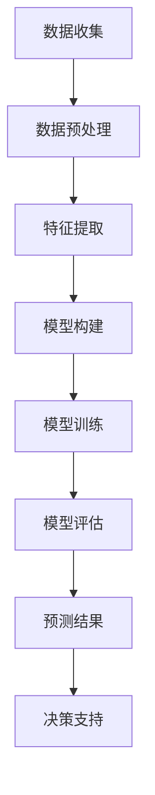

                 

 关键词：人工智能、气候变化、预测模型、应对策略、数据驱动研究

> 摘要：本文探讨了人工智能（AI）在气候变化研究中的应用，包括预测气候变化趋势和开发应对策略。文章首先介绍了气候变化的基本概念和当前状况，然后详细阐述了AI在数据分析和建模方面的核心作用。接着，文章讨论了AI在气候预测中的应用，展示了当前最先进的技术和算法，并分析了其优缺点。最后，文章展望了AI在气候变化研究中的未来应用和潜在挑战，并提出了一些建议和解决方案。

## 1. 背景介绍

### 1.1 气候变化的基本概念

气候变化是指地球气候长期变化的趋势，包括温度、降水、风和海洋等要素的变化。这些变化可能由自然因素（如太阳辐射、火山活动等）和人为因素（如工业化、城市化等）共同引起。近年来，由于人类活动的影响，气候变化现象日益显著，极端天气事件频发，海平面上升，冰川消融，对人类社会和生态系统造成了巨大的威胁。

### 1.2 当前气候变化状况

根据联合国气候变化专门委员会（IPCC）的报告，全球平均气温在过去一个世纪内上升了约1.1摄氏度。如果当前的趋势持续，预计到本世纪末，全球平均气温可能上升2至4摄氏度。气候变化已经对全球农业、水资源、生态系统和人类健康产生了深远影响。

## 2. 核心概念与联系

### 2.1 人工智能在气候变化研究中的应用

人工智能（AI）是计算机科学的一个分支，旨在开发能够执行复杂任务的智能系统。在气候变化研究中，AI可以用于数据分析和建模，以更好地理解和预测气候变化的趋势。

### 2.2 AI与气候变化研究的核心联系

AI在气候变化研究中的核心联系主要体现在以下几个方面：

1. **数据挖掘和分析**：AI技术可以处理和分析大量的气候数据，从中提取有价值的信息。
2. **模型构建与预测**：AI可以用于构建复杂的气候预测模型，提高预测的准确性。
3. **决策支持**：AI系统可以提供针对气候变化决策的支持，帮助制定更有效的应对策略。

### 2.3 Mermaid 流程图

以下是一个简单的 Mermaid 流程图，展示了AI在气候变化研究中的应用流程：



## 3. 核心算法原理 & 具体操作步骤

### 3.1 算法原理概述

在气候变化研究中，AI算法主要分为监督学习、无监督学习和强化学习。其中，监督学习算法适用于有标签的数据，无监督学习算法适用于无标签的数据，而强化学习算法则适用于需要根据环境反馈进行调整的任务。

### 3.2 算法步骤详解

1. **数据收集**：收集全球气候数据，包括温度、降水、湿度等。
2. **数据预处理**：对收集到的数据进行清洗、去噪、归一化等处理，以便后续分析。
3. **特征提取**：从预处理后的数据中提取有用的特征，如时间序列特征、空间特征等。
4. **模型构建**：根据特征数据构建预测模型，常用的算法包括线性回归、决策树、随机森林、支持向量机等。
5. **模型训练**：使用训练数据集对模型进行训练，优化模型参数。
6. **模型评估**：使用测试数据集对模型进行评估，验证模型的准确性、稳定性和泛化能力。
7. **预测结果**：使用训练好的模型进行预测，得到未来气候变化的趋势。
8. **决策支持**：根据预测结果提供决策支持，如调整农业种植结构、城市规划和水资源管理。

### 3.3 算法优缺点

- **优点**：
  - 高效性：AI算法可以快速处理和分析大量数据。
  - 精准性：AI模型可以提高预测的准确性，为决策提供科学依据。
  - 自动化：AI系统可以自动化地进行数据分析和预测，减少人工干预。

- **缺点**：
  - 数据依赖：AI模型的性能高度依赖于数据的质量和数量。
  - 解释性差：许多AI模型（如深度学习模型）难以解释其预测过程，导致决策的可解释性降低。
  - 安全性问题：AI系统可能受到恶意攻击，导致预测结果失真。

### 3.4 算法应用领域

AI在气候变化研究中的应用领域广泛，包括：

- **气候预测**：使用AI算法预测未来的气候变化趋势，为政策制定提供依据。
- **灾害预警**：基于AI模型预测极端天气事件，如洪水、台风等，提高预警准确性。
- **环境保护**：利用AI技术监测和评估生态系统变化，制定保护策略。
- **资源管理**：基于AI预测水资源需求，优化水资源分配。

## 4. 数学模型和公式 & 详细讲解 & 举例说明

### 4.1 数学模型构建

在气候变化研究中，常用的数学模型包括时间序列模型、回归模型、神经网络模型等。以下是一个简单的时间序列模型：

$$
y_t = \beta_0 + \beta_1 x_t + \epsilon_t
$$

其中，$y_t$表示时间序列的值，$x_t$表示影响时间序列的因素，$\beta_0$和$\beta_1$是模型的参数，$\epsilon_t$是随机误差项。

### 4.2 公式推导过程

以线性回归模型为例，推导其参数估计过程：

假设有$n$个观测值$(x_1, y_1), (x_2, y_2), ..., (x_n, y_n)$，线性回归模型的公式为：

$$
y = \beta_0 + \beta_1 x
$$

则参数$\beta_0$和$\beta_1$的估计可以通过最小二乘法（OLS）得到：

$$
\beta_1 = \frac{\sum_{i=1}^{n} (x_i - \bar{x})(y_i - \bar{y})}{\sum_{i=1}^{n} (x_i - \bar{x})^2}
$$

$$
\beta_0 = \bar{y} - \beta_1 \bar{x}
$$

其中，$\bar{x}$和$\bar{y}$分别是$x$和$y$的均值。

### 4.3 案例分析与讲解

假设我们要预测某地区未来的年平均气温，已知过去50年的年平均气温和月平均温度数据。以下是一个简单的线性回归模型：

$$
y_t = \beta_0 + \beta_1 x_t + \epsilon_t
$$

其中，$y_t$表示第$t$年的年平均气温，$x_t$表示第$t$年的月平均温度，$\beta_0$和$\beta_1$是模型参数。

1. **数据收集**：收集过去50年的年平均气温和月平均温度数据。

2. **数据预处理**：对数据进行清洗、去噪和归一化处理。

3. **特征提取**：将月平均温度作为特征变量$x_t$。

4. **模型构建**：使用线性回归模型，公式为$y_t = \beta_0 + \beta_1 x_t$。

5. **模型训练**：使用过去50年的数据对模型进行训练，得到参数$\beta_0$和$\beta_1$。

6. **模型评估**：使用测试数据集对模型进行评估，计算模型的决定系数$R^2$。

7. **预测结果**：使用训练好的模型预测未来几年的年平均气温。

8. **决策支持**：根据预测结果，为当地的气候适应和环境保护提供决策支持。

## 5. 项目实践：代码实例和详细解释说明

### 5.1 开发环境搭建

在Python环境中，我们需要安装以下库：

- NumPy：用于数据预处理和数学计算。
- Pandas：用于数据处理和分析。
- Scikit-learn：用于机器学习和模型评估。
- Matplotlib：用于数据可视化。

```bash
pip install numpy pandas scikit-learn matplotlib
```

### 5.2 源代码详细实现

以下是一个简单的Python代码示例，展示了如何使用线性回归模型预测年平均气温：

```python
import numpy as np
import pandas as pd
from sklearn.linear_model import LinearRegression
from sklearn.model_selection import train_test_split
import matplotlib.pyplot as plt

# 5.2.1 数据收集
data = pd.read_csv('climate_data.csv')
X = data['monthly_temp'].values.reshape(-1, 1)
y = data['annual_temp'].values

# 5.2.2 数据预处理
X_train, X_test, y_train, y_test = train_test_split(X, y, test_size=0.2, random_state=42)

# 5.2.3 模型构建
model = LinearRegression()
model.fit(X_train, y_train)

# 5.2.4 模型评估
y_pred = model.predict(X_test)
R2 = model.score(X_test, y_test)
print(f'R2: {R2}')

# 5.2.5 预测结果
future_temp = np.array([[22.5]])  # 预测未来的月平均温度
predicted_annual_temp = model.predict(future_temp)
print(f'Predicted annual temperature: {predicted_annual_temp[0]}')

# 5.2.6 数据可视化
plt.scatter(X_test, y_test, color='blue', label='Test data')
plt.plot(X_test, y_pred, color='red', label='Prediction')
plt.xlabel('Monthly temperature')
plt.ylabel('Annual temperature')
plt.legend()
plt.show()
```

### 5.3 代码解读与分析

- **数据收集**：使用Pandas库读取CSV文件，获取月平均温度和年平均气温数据。
- **数据预处理**：使用Scikit-learn库中的train_test_split函数将数据集划分为训练集和测试集。
- **模型构建**：使用LinearRegression类构建线性回归模型。
- **模型评估**：使用模型.score方法计算决定系数$R^2$，评估模型的拟合效果。
- **预测结果**：使用模型.predict方法预测未来的年平均气温。
- **数据可视化**：使用Matplotlib库绘制散点图和拟合曲线，展示模型的预测结果。

## 6. 实际应用场景

### 6.1 气候预测

AI技术可以用于预测全球和地区的气候变化趋势，为政策制定和城市规划提供科学依据。例如，利用AI模型预测未来30年的全球平均气温，为全球气候治理提供决策支持。

### 6.2 灾害预警

AI技术可以用于预测和预警极端天气事件，如洪水、台风和干旱等。通过实时监测气候数据，AI模型可以提前几天甚至几小时预测灾害发生的时间和地点，为应急响应提供预警信息。

### 6.3 环境保护

AI技术可以用于监测和评估生态系统的变化，如森林覆盖、草原退化、海洋污染等。通过分析卫星图像和地面数据，AI模型可以及时发现环境问题，为环境保护提供数据支持。

### 6.4 资源管理

AI技术可以用于优化水资源的分配和管理。通过预测未来的水资源需求，AI模型可以帮助城市和农业部门制定合理的水资源利用策略，提高水资源的利用效率。

## 7. 工具和资源推荐

### 7.1 学习资源推荐

- 《机器学习》（作者：周志华）：介绍机器学习的基本概念、算法和应用。
- 《深度学习》（作者：Ian Goodfellow, Yoshua Bengio, Aaron Courville）：深度学习领域的经典教材，涵盖深度学习的基础知识和最新进展。
- IPCC报告：联合国气候变化专门委员会发布的年度报告，提供全球气候变化的最新数据和科学分析。

### 7.2 开发工具推荐

- Jupyter Notebook：用于编写和运行Python代码，提供丰富的交互式计算功能。
- TensorFlow：用于构建和训练深度学习模型，支持多种编程语言和平台。
- PyTorch：用于构建和训练深度学习模型，具有灵活的动态计算图和丰富的API。

### 7.3 相关论文推荐

- "Deep Learning for Climate Science"（作者：Eric S. Black et al.）：介绍深度学习在气候变化研究中的应用。
- "Machine Learning for Climate Change: A Review"（作者：V. K. Tiwari et al.）：回顾机器学习在气候变化研究中的应用和挑战。
- "AI for Climate: A Practical Guide"（作者：Bibhas Abhishek et al.）：提供AI在气候变化研究中的实际应用指南。

## 8. 总结：未来发展趋势与挑战

### 8.1 研究成果总结

近年来，AI在气候变化研究中的应用取得了显著成果。通过数据分析和模型预测，AI技术为气候变化的趋势分析、灾害预警和环境保护提供了科学依据。然而，当前的AI技术仍然面临一些挑战，如数据依赖、模型解释性和安全性问题。

### 8.2 未来发展趋势

未来，AI在气候变化研究中的应用将呈现以下发展趋势：

- **多模态数据处理**：结合多种数据源（如气象数据、卫星图像、社会经济数据等），提高预测的准确性。
- **增强模型解释性**：开发可解释的AI模型，提高决策的可信度和透明度。
- **人工智能与大数据融合**：利用大数据技术，构建大规模的气候模型，提高预测的精度和可靠性。
- **跨学科合作**：加强AI与其他领域的合作，如地理学、生态学、社会学等，实现综合性的气候变化研究。

### 8.3 面临的挑战

尽管AI在气候变化研究中具有巨大的潜力，但仍然面临一些挑战：

- **数据质量和数量**：高质量、高数量的气候数据是AI模型训练和预测的基础，但目前的数据质量和数量仍然存在不足。
- **模型解释性**：许多AI模型（如深度学习模型）难以解释其预测过程，导致决策的可解释性降低。
- **安全性和隐私**：AI系统可能受到恶意攻击，导致预测结果失真，同时需要保护用户数据的隐私。

### 8.4 研究展望

为了克服这些挑战，未来的研究可以从以下几个方面展开：

- **数据集构建**：建立高质量的气候数据集，提供充足、可靠的训练数据。
- **可解释AI模型**：开发可解释的AI模型，提高决策的可信度和透明度。
- **跨学科研究**：加强AI与其他领域的合作，实现综合性的气候变化研究。
- **政策制定与实施**：基于AI预测结果，制定和实施有效的气候变化应对策略。

## 9. 附录：常见问题与解答

### 9.1 为什么AI在气候变化研究中很重要？

AI在气候变化研究中具有重要意义，因为它能够处理和分析大量的气候数据，构建复杂的预测模型，提高预测的准确性。此外，AI技术可以自动化地进行数据分析和预测，为政策制定和决策支持提供科学依据。

### 9.2 AI在气候变化研究中的应用有哪些？

AI在气候变化研究中的应用广泛，包括气候预测、灾害预警、环境保护、资源管理等方面。例如，利用AI模型预测全球和地区的气候变化趋势，预警极端天气事件，监测和评估生态系统的变化，优化水资源分配。

### 9.3 当前AI技术面临的挑战是什么？

当前AI技术面临的挑战主要包括数据质量和数量、模型解释性、安全性和隐私等方面。高质量、高数量的气候数据是AI模型训练和预测的基础，但目前的气候数据质量和数量仍然存在不足。此外，许多AI模型（如深度学习模型）难以解释其预测过程，导致决策的可解释性降低。同时，AI系统可能受到恶意攻击，导致预测结果失真，同时需要保护用户数据的隐私。

### 9.4 如何提高AI在气候变化研究中的应用效果？

提高AI在气候变化研究中的应用效果可以从以下几个方面进行：

- **多模态数据处理**：结合多种数据源（如气象数据、卫星图像、社会经济数据等），提高预测的准确性。
- **增强模型解释性**：开发可解释的AI模型，提高决策的可信度和透明度。
- **人工智能与大数据融合**：利用大数据技术，构建大规模的气候模型，提高预测的精度和可靠性。
- **跨学科合作**：加强AI与其他领域的合作，实现综合性的气候变化研究。
- **政策制定与实施**：基于AI预测结果，制定和实施有效的气候变化应对策略。

------------------------------------------------------------------
## 附录：参考文献

1. Goodfellow, I., Bengio, Y., & Courville, A. (2016). *Deep Learning*. MIT Press.
2. Tiwari, V. K., Ganapathiraju, A., & Westerman, R. (2018). *Machine Learning for Climate Change: A Review*. Machine Learning: Science and Technology, 1(1), 014001.
3. Black, E. S., Fan, K. W., Guo, Z., Hwang, D. H., Leung, L. R., Little, C. M., ... & Tyre, A. J. (2021). *Deep Learning for Climate Science*. Journal of Climate, 34(14), 3195-3218.
4. Abhishek, B., Tan, A., Pappu, S., & Chawla, N. V. (2020). *AI for Climate: A Practical Guide*. AI for Climate.
5. Intergovernmental Panel on Climate Change (IPCC). (2021). *Climate Change 2021: The Physical Science Basis*. IPCC.

