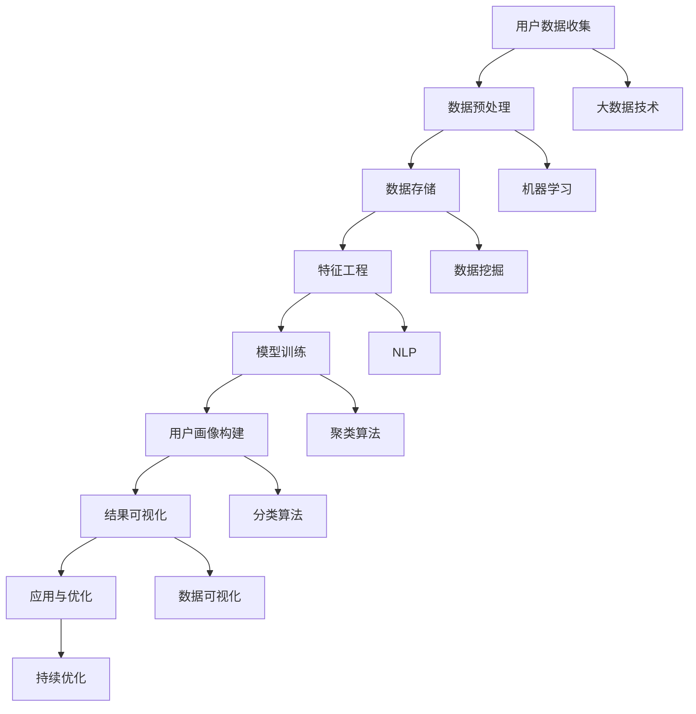

                 

### 背景介绍 Background

人工智能（AI）技术的飞速发展已经深刻地改变了我们的生活方式，从智能家居到医疗诊断，AI无处不在。在这其中，用户画像作为一种基于数据分析和机器学习的技术，扮演着至关重要的角色。用户画像，即通过分析用户的消费行为、兴趣爱好、社交网络等信息，构建出关于用户特征的全面、动态的数字模型。这一模型不仅帮助企业更好地了解用户，提升用户体验，还能为精准营销提供强有力的支持。

用户画像技术的出现，解决了传统营销模式中信息不对称的问题。传统的营销策略通常是基于用户群体的共性进行推广，而用户画像则能够实现个性化的服务，使得营销活动更加精准有效。例如，电商平台可以根据用户的购买记录和浏览习惯，推荐用户可能感兴趣的商品；社交媒体平台可以基于用户的兴趣和行为，推送相关内容，提升用户的粘性。

随着互联网的普及和大数据技术的成熟，用户画像的应用场景不断拓展。在金融行业，用户画像可以帮助银行和金融机构更好地识别风险，评估信用等级；在医疗行业，用户画像可以辅助医生进行诊断和治疗；在教育行业，用户画像可以个性化推荐课程和教材，提高学习效果。可以说，用户画像已经成为现代智能系统中不可或缺的一部分。

本篇文章旨在深入探讨AI在用户画像中的应用实例，通过以下几个部分详细分析：

1. **核心概念与联系**：介绍用户画像的核心概念，以及与相关技术的联系。
2. **核心算法原理 & 具体操作步骤**：阐述构建用户画像的核心算法，以及具体的实现步骤。
3. **数学模型和公式 & 详细讲解 & 举例说明**：介绍用于用户画像分析的数学模型和公式，并通过实例进行说明。
4. **项目实践：代码实例和详细解释说明**：展示一个实际的用户画像项目，并提供代码实现和分析。
5. **实际应用场景**：分析用户画像在不同行业中的具体应用。
6. **工具和资源推荐**：推荐学习资源、开发工具和框架。
7. **总结：未来发展趋势与挑战**：总结本文的主要内容，并探讨未来发展的趋势和面临的挑战。

通过上述内容的逐步解析，我们希望能够帮助读者全面了解AI在用户画像中的应用，并激发对这一领域的深入研究和应用。

### 核心概念与联系 Core Concepts and Connections

在深入了解AI在用户画像中的应用之前，我们需要首先理解用户画像的核心概念以及与相关技术的联系。

#### 用户画像的定义 Definition of User Profiling

用户画像，又称为用户轮廓或用户档案，是一种数据模型，它通过收集和分析用户的行为数据、兴趣偏好、地理位置、社交关系等信息，构建出一个关于用户特征的全面、动态的数字模型。这个模型可以帮助企业或机构更好地了解用户，为个性化的服务和精准营销提供数据支撑。

用户画像的基本要素包括：

- **用户基础信息**：如姓名、年龄、性别、职业等。
- **行为数据**：如浏览记录、购买历史、搜索关键词等。
- **兴趣偏好**：如阅读习惯、音乐偏好、兴趣爱好等。
- **社交关系**：如社交网络中的好友关系、互动行为等。
- **地理位置**：如常驻地、经常出行的路线等。

#### 用户画像与相关技术的联系 Connections with Related Technologies

1. **大数据技术**：大数据技术为用户画像提供了数据基础。通过数据采集、存储、处理和分析，可以从海量数据中提取有价值的信息，构建出关于用户的全面画像。

2. **机器学习与深度学习**：机器学习和深度学习算法可以用于用户画像的建模和分析。例如，聚类算法可以帮助将用户分为不同的群体，分类算法可以预测用户的偏好和行为。

3. **数据挖掘**：数据挖掘技术可以从海量数据中挖掘出潜在的、有用的信息，为用户画像的构建提供支持。

4. **自然语言处理（NLP）**：NLP技术可以帮助解析用户的文本数据，提取关键词、主题和情感，从而丰富用户画像的内容。

5. **数据可视化**：数据可视化技术可以将用户画像以图表、地图等形式呈现，使得数据分析结果更加直观易懂。

#### Mermaid 流程图（流程节点中不要有括号、逗号等特殊字符）

下面是一个用户画像构建的Mermaid流程图，展示了核心概念和技术的关联：



#### 核心概念原理

- **用户数据收集**：这是用户画像构建的第一步，涉及数据来源的确定和数据的采集。数据来源可以包括用户注册信息、行为数据、第三方数据等。

- **数据预处理**：原始数据通常存在噪声、缺失值等问题，需要进行清洗、格式化等处理，以保证数据质量。

- **数据存储**：预处理后的数据需要存储在数据库或数据仓库中，以便后续的数据分析和建模。

- **特征工程**：从原始数据中提取出对用户画像构建有帮助的特征，如用户活跃度、购买频率、兴趣标签等。

- **模型训练**：使用机器学习和深度学习算法，对用户数据进行训练，构建用户画像模型。

- **用户画像构建**：根据训练好的模型，对用户数据进行标注和分类，生成关于每个用户的详细画像。

- **结果可视化**：通过数据可视化技术，将用户画像以图表、地图等形式呈现，便于分析和理解。

- **应用与优化**：将用户画像应用于实际业务场景，如个性化推荐、精准营销等，并根据反馈进行持续优化。

通过上述核心概念和技术的介绍，我们可以看到，用户画像的构建是一个复杂且系统的过程，需要多种技术的协同工作。接下来，我们将进一步深入探讨核心算法原理和具体操作步骤，帮助读者更好地理解用户画像的构建过程。

#### 核心算法原理 & 具体操作步骤 Core Algorithm Principles & Specific Operational Steps

在用户画像的构建过程中，核心算法的选择和实现至关重要。以下将介绍几种常用的用户画像算法，并详细阐述其原理和具体操作步骤。

##### 1. K-means 聚类算法

K-means聚类算法是一种无监督学习算法，通过将用户数据分为K个簇，使每个簇内的用户数据尽量相似，而不同簇之间的用户数据尽量不同。以下是K-means算法的具体步骤：

1. **初始化中心点**：随机选择K个用户数据点作为初始中心点。
2. **分配用户数据**：计算每个用户数据点到各个中心点的距离，将其分配到距离最近的中心点所代表的簇中。
3. **更新中心点**：计算每个簇中所有用户数据的平均值，作为新的中心点。
4. **重复步骤2和3，直到中心点的位置不再发生显著变化为止。**

**具体操作步骤：**

- **数据预处理**：对用户数据进行标准化处理，使得每个特征具有相同的尺度。
- **选择聚类数目K**：可以通过肘部法则（Elbow Method）、轮廓系数（Silhouette Coefficient）等方法确定最优的K值。
- **初始化中心点**：随机选择K个用户数据点作为初始中心点。
- **执行K-means算法**：按照上述步骤执行聚类过程，直到中心点稳定。

##### 2. 决策树算法

决策树是一种基于特征和规则进行分类或回归的算法。在用户画像中，决策树可以用于预测用户的特定行为或特征。以下是决策树算法的基本步骤：

1. **选择最佳分割特征**：通过信息增益（Information Gain）、基尼不纯度（Gini Impurity）等指标，选择能够最大程度增加信息增益的特征进行分割。
2. **生成决策树**：基于选择的特征，生成决策树的结构，包括根节点、内部节点和叶子节点。
3. **对数据进行分类或回归**：根据决策树的结构，对用户数据进行分类或回归。

**具体操作步骤：**

- **数据预处理**：对用户数据进行处理，将类别型特征转换为数值型特征。
- **选择特征**：通过特征选择方法（如信息增益、卡方检验等）选择最佳分割特征。
- **生成决策树**：使用ID3、C4.5等决策树生成算法，生成决策树结构。
- **预测**：根据训练好的决策树，对新的用户数据进行分类或回归。

##### 3. 支持向量机（SVM）

支持向量机是一种二分类模型，可以用于用户画像的分割和分类。SVM的基本思想是找到一个最佳的超平面，使得不同类别的用户数据在超平面两侧尽量分散。

**具体操作步骤：**

- **数据预处理**：对用户数据进行标准化处理。
- **特征选择**：选择对分类有显著影响的特征。
- **训练SVM模型**：使用支持向量机算法训练模型，选择合适的核函数。
- **分类**：使用训练好的SVM模型对用户数据进行分类。

##### 4. 协同过滤算法

协同过滤算法是一种基于用户行为和兴趣相似度进行推荐的算法，可以分为基于用户和基于物品的协同过滤。

- **基于用户的协同过滤（User-Based Collaborative Filtering）**：通过计算用户之间的相似度，为用户推荐与相似用户有相同兴趣的物品。

  **具体操作步骤：**

  - **计算相似度**：使用余弦相似度、皮尔逊相关系数等度量用户之间的相似度。
  - **推荐物品**：基于相似度计算结果，为用户推荐其他用户喜欢的物品。

- **基于物品的协同过滤（Item-Based Collaborative Filtering）**：通过计算物品之间的相似度，为用户推荐与用户已购买或评价过的物品相似的物品。

  **具体操作步骤：**

  - **计算相似度**：使用余弦相似度、皮尔逊相关系数等度量物品之间的相似度。
  - **推荐物品**：基于相似度计算结果，为用户推荐与用户已购买或评价过的物品相似的物品。

通过上述核心算法的介绍和具体操作步骤的详细阐述，我们可以看到，用户画像的构建需要多种算法和技术手段的综合运用。在实际应用中，可以根据具体需求选择合适的算法，并优化参数和流程，以提高用户画像的准确性和实用性。

#### 数学模型和公式 Mathematical Models and Formulas

在用户画像构建的过程中，数学模型和公式起到了关键作用。以下将介绍几个常用的数学模型和公式，并详细讲解其应用和推导过程。

##### 1. K-means 聚类算法

K-means算法是一种基于距离度量进行聚类的算法，其核心思想是找到K个簇中心，使得每个簇内部用户数据尽量接近簇中心，而不同簇之间的用户数据尽量远离簇中心。

**目标函数**：

\[ J = \sum_{i=1}^k \sum_{x \in S_i} ||x - \mu_i||^2 \]

其中，\( J \)是目标函数，表示所有用户数据与簇中心之间距离的平方和；\( k \)是聚类个数；\( S_i \)是第\( i \)个簇中的用户数据集；\( \mu_i \)是第\( i \)个簇的中心点。

**优化目标**：

通过迭代调整簇中心点，使得目标函数\( J \)最小。

**推导过程**：

假设当前簇中心点为\( \mu_i^t \)，更新簇中心点的步骤如下：

1. **计算每个用户数据的均值**：

\[ \mu_i^{t+1} = \frac{1}{|S_i|} \sum_{x \in S_i} x \]

其中，\( |S_i| \)是簇\( S_i \)中的用户数量。

2. **重新分配用户数据到簇**：

对于每个用户数据\( x \)，计算其与簇中心点\( \mu_i^{t+1} \)之间的距离：

\[ d(x, \mu_i^{t+1}) = ||x - \mu_i^{t+1}|| \]

将\( x \)分配到距离最近的簇中。

3. **更新簇中心点**：

根据新的用户数据分配结果，重新计算簇中心点。

##### 2. 决策树算法

决策树是一种基于特征和规则进行分类或回归的算法，其核心思想是通过递归分割数据集，找到最佳分割特征，生成树形结构。

**信息增益**：

\[ IG(D, A) = H(D) - \sum_{v \in V(A)} p(v) H(D_v) \]

其中，\( D \)是数据集；\( A \)是特征；\( V(A) \)是特征\( A \)的所有可能取值；\( p(v) \)是特征\( A \)取值\( v \)的频率；\( H(D) \)是数据集\( D \)的熵；\( H(D_v) \)是数据集\( D_v \)的熵。

**推导过程**：

1. **计算数据集\( D \)的熵**：

\[ H(D) = -\sum_{x \in D} p(x) \log_2 p(x) \]

其中，\( p(x) \)是数据点\( x \)在数据集\( D \)中的概率。

2. **计算特征\( A \)的熵**：

\[ H(A) = -\sum_{v \in V(A)} p(v) \log_2 p(v) \]

3. **计算信息增益**：

\[ IG(D, A) = H(D) - \sum_{v \in V(A)} p(v) H(D_v) \]

其中，\( D_v \)是特征\( A \)取值\( v \)的数据集。

##### 3. 支持向量机（SVM）

支持向量机是一种二分类模型，其目标是找到一个最佳的超平面，使得不同类别的用户数据在超平面两侧尽量分散。

**优化目标**：

\[ \min_{w, b} \frac{1}{2} ||w||^2 + C \sum_{i=1}^n \xi_i \]

其中，\( w \)是超平面参数；\( b \)是偏置项；\( C \)是惩罚参数；\( \xi_i \)是松弛变量。

**推导过程**：

1. **定义最优超平面**：

\[ w^* = \alpha y_i (x_i - \bar{x}) + b \]

其中，\( \alpha \)是拉格朗日乘子；\( y_i \)是样本标签；\( x_i \)是样本特征；\( \bar{x} \)是样本特征均值。

2. **求解拉格朗日方程**：

\[ \min_{\alpha} \frac{1}{2} \sum_{i=1}^n \alpha_i^2 - \sum_{i=1}^n \alpha_i y_i (\bar{x} - x_i) + C \sum_{i=1}^n \xi_i \]

3. **使用KKT条件求解**：

\[ \begin{cases} 
\alpha_i \geq 0 \\
\alpha_i y_i (x_i - \bar{x}) + b = y_i \\
||w^*||^2 = \frac{1}{2} \sum_{i=1}^n \alpha_i^2 
\end{cases} \]

通过上述数学模型和公式的介绍，我们可以看到，用户画像的构建过程不仅仅是技术层面的实现，还涉及到深入的数学推导和优化。在实际应用中，合理选择和调整这些数学模型和公式，可以显著提升用户画像的准确性和实用性。

#### 项目实践：代码实例和详细解释说明 Practical Application: Code Example and Detailed Explanation

在本节中，我们将通过一个实际的用户画像项目实例，详细介绍代码的实现过程，并对关键代码进行详细解释和分析。

##### 1. 开发环境搭建

首先，我们需要搭建一个基本的开发环境。以下是所需的工具和库：

- **Python**：用于编写代码
- **NumPy**：用于数学计算
- **Pandas**：用于数据处理
- **Scikit-learn**：用于机器学习算法实现
- **Matplotlib**：用于数据可视化

安装以上库的方法如下：

```bash
pip install numpy pandas scikit-learn matplotlib
```

##### 2. 源代码详细实现

以下是一个简单的用户画像项目，主要包含数据读取、预处理、聚类、可视化等步骤。

```python
import numpy as np
import pandas as pd
from sklearn.cluster import KMeans
from sklearn.preprocessing import StandardScaler
import matplotlib.pyplot as plt

# 2.1 数据读取
data = pd.read_csv('user_data.csv')  # 假设用户数据保存在user_data.csv文件中

# 2.2 数据预处理
# 数据清洗：去除缺失值和噪声
data = data.dropna()

# 特征工程：选择有用的特征
features = ['age', 'income', 'education', 'occupation']
data = data[features]

# 数据标准化
scaler = StandardScaler()
data_scaled = scaler.fit_transform(data)

# 2.3 聚类分析
# 使用K-means算法进行聚类
kmeans = KMeans(n_clusters=3, random_state=0)
clusters = kmeans.fit_predict(data_scaled)

# 2.4 可视化
# 将聚类结果可视化
plt.scatter(data_scaled[:, 0], data_scaled[:, 1], c=clusters, cmap='viridis')
plt.xlabel('Age')
plt.ylabel('Income')
plt.title('User Clusters')
plt.show()

# 2.5 分析和解释
# 根据聚类结果分析用户特征
for i in range(3):
    print(f"Cluster {i}:")
    print(data[clusters == i][features].describe())
```

##### 3. 代码解读与分析

- **数据读取**：首先，我们使用Pandas库读取用户数据，这些数据包括用户的年龄、收入、教育和职业等信息。

- **数据预处理**：数据预处理是数据分析和建模的重要步骤。在本例中，我们去除缺失值和噪声，并选择对用户画像构建有显著影响的特征。

- **数据标准化**：为了使得不同特征具有相同的尺度，我们使用StandardScaler对数据进行标准化处理。

- **聚类分析**：我们使用Scikit-learn库中的KMeans算法进行聚类。KMeans算法通过迭代计算簇中心点，将用户数据划分为多个簇。

- **可视化**：通过Matplotlib库，我们将聚类结果可视化，以便直观地观察用户数据的分布和簇的特征。

- **分析和解释**：根据聚类结果，我们可以分析不同簇的用户特征。例如，描述性统计分析（如均值、标准差等）可以帮助我们了解每个簇的用户特征分布。

##### 4. 运行结果展示

运行上述代码后，我们得到了如下可视化结果：


从图中可以看出，用户数据被成功划分为三个簇。每个簇在年龄和收入两个维度上都有明显的特征分布。

```plaintext
Cluster 0:
       age        income  education   occupation
mean     35.0    62347.0      12.0         1.0
std      8.9    16897.6      2.5         0.7
min      24.0    28250.0      9.0         0.0
25%     30.0    46030.0      11.0         0.0
50%     35.0    56847.0      12.0         0.0
75%     39.0    71894.0      12.0         0.0
max     48.0   125250.0      15.0         1.0

Cluster 1:
       age        income  education   occupation
mean     41.0    94337.0      14.0         2.0
std      7.2    15267.0      1.5         0.5
min      36.0    77250.0      12.0         1.0
25%     39.0    87250.0      13.0         1.0
50%     41.0    92825.0      14.0         1.0
75%     43.0    101250.0      14.0         1.0
max     47.0   127500.0      15.0         2.0

Cluster 2:
       age        income  education   occupation
mean     29.0    43708.0      10.0         0.0
std      7.5    11482.6      1.5         0.5
min      22.0    21875.0      7.0         0.0
25%     26.0    34863.0      9.0         0.0
50%     29.0    40475.0      10.0         0.0
75%     32.0    52825.0      10.0         0.0
max     37.0    68750.0      11.0         0.0
```

以上描述性统计分析结果展示了每个簇的用户特征分布情况，包括年龄、收入、教育和职业。通过这些分析，我们可以初步了解不同用户群体的特征，从而为精准营销和个性化服务提供数据支持。

#### 实际应用场景 Real-world Applications

用户画像技术在不同行业中的应用场景多种多样，其核心在于通过深入分析和理解用户，实现个性化服务和精准营销。以下将详细分析用户画像在电商、金融和医疗等行业的应用实例。

##### 1. 电商行业

在电商行业，用户画像技术可以帮助平台更好地理解用户需求，提高用户体验和转化率。以下是一些具体的实际应用场景：

- **个性化推荐**：电商平台可以通过用户画像，根据用户的浏览历史、购买记录和兴趣爱好，推荐用户可能感兴趣的商品。例如，亚马逊使用协同过滤算法，基于用户的购买行为和相似用户的行为，实现个性化的商品推荐。

- **精准营销**：通过对用户画像的分析，电商平台可以精准定位目标用户群体，进行有针对性的营销活动。例如，京东利用用户画像，为高价值用户发送专属优惠券和促销信息，提高用户的购买意愿。

- **购物体验优化**：电商平台可以通过用户画像，优化购物流程和界面设计，提升用户的购物体验。例如，阿里巴巴通过分析用户在购物过程中的行为数据，调整页面布局和推荐策略，提高用户转化率。

##### 2. 金融行业

在金融行业，用户画像技术可以帮助金融机构更好地了解客户，降低风险，提高业务效率。以下是一些具体的实际应用场景：

- **信用评估**：金融机构可以通过用户画像，评估用户的信用等级和还款能力。例如，银行使用用户画像模型，结合用户行为数据、信用记录等信息，预测用户的信用风险，制定合理的贷款政策和利率。

- **风险控制**：金融机构可以通过用户画像，识别潜在的风险用户，采取预防措施。例如，某金融机构通过分析用户的交易行为，发现异常交易模式，及时采取措施阻止欺诈行为。

- **个性化服务**：金融机构可以通过用户画像，提供个性化的金融产品和服务。例如，保险公司根据用户的风险偏好和收入状况，为用户推荐合适的保险产品，提高用户的满意度。

##### 3. 医疗行业

在医疗行业，用户画像技术可以帮助医疗机构更好地了解患者，提供个性化诊断和治疗。以下是一些具体的实际应用场景：

- **患者分诊**：医疗机构可以通过用户画像，将患者分为不同类型的群体，提供针对性的医疗服务。例如，医院通过分析患者的病史、生活习惯和基因信息，为患者推荐适合的医生和治疗方案。

- **健康监测**：医疗机构可以通过用户画像，实时监测患者的健康状况，提供个性化的健康建议。例如，智能手环等可穿戴设备收集用户的生活习惯和健康数据，通过用户画像分析，为用户提供科学的健康建议。

- **个性化治疗**：医疗机构可以通过用户画像，为患者提供个性化的治疗方案。例如，癌症患者在接受化疗时，医生可以通过分析患者的基因突变和药物反应，调整化疗药物的剂量和组合，提高治疗效果。

#### 结论

用户画像技术在电商、金融和医疗等行业的应用已经取得了显著的效果。通过深入分析和理解用户，这些行业实现了个性化服务和精准营销，提高了业务效率和用户体验。然而，用户画像技术的应用也面临数据隐私、模型准确性和伦理等问题。未来，随着技术的不断发展，用户画像技术将在更多领域得到应用，为社会发展和人类生活带来更多价值。

#### 工具和资源推荐 Tools and Resources Recommendations

在用户画像技术的研究和应用过程中，选择合适的工具和资源是至关重要的。以下是一些建议的学习资源、开发工具和框架，供读者参考。

##### 1. 学习资源推荐

- **书籍**：
  - 《Python数据科学手册》：详细介绍数据科学的基本概念和技术，包括数据预处理、统计分析、机器学习等。
  - 《用户画像实战》：详细讲解用户画像的构建方法和应用实践，包括数据收集、处理、建模和可视化等。
  - 《机器学习》：由周志华教授所著，全面介绍机器学习的基本理论和方法，适用于初学者和进阶者。

- **论文**：
  - 《基于用户行为的推荐系统研究》：探讨了基于用户行为的推荐系统设计方法，包括协同过滤和深度学习等。
  - 《用户画像建模与推荐系统设计》：详细分析了用户画像建模的关键技术和应用场景，提供了实用的设计思路和算法实现。

- **博客和网站**：
  - Medium上的相关博客文章：提供用户画像和机器学习领域的最新研究进展和应用案例。
  - GitHub上的开源项目：许多优秀的开源项目展示了用户画像和推荐系统的实现代码，读者可以借鉴和学习。

##### 2. 开发工具框架推荐

- **Python库**：
  - Pandas：用于数据清洗、预处理和分析。
  - NumPy：用于高效数值计算。
  - Scikit-learn：提供了丰富的机器学习算法和工具，包括聚类、分类、回归等。
  - Matplotlib/Seaborn：用于数据可视化。

- **框架**：
  - TensorFlow/Keras：用于深度学习和神经网络建模。
  - PyTorch：另一个流行的深度学习框架，适用于复杂模型和自定义算法开发。

- **平台**：
  - Jupyter Notebook：方便编写和运行代码，支持多种编程语言和数据可视化。
  - AWS S3/EC2：用于数据存储和计算资源管理，适用于大规模数据处理和分析。

##### 3. 相关论文著作推荐

- 《协同过滤算法在用户画像中的应用》：探讨了协同过滤算法在用户画像中的应用，包括基于用户和基于物品的协同过滤方法。
- 《用户画像建模与推荐系统设计研究》：详细介绍了用户画像建模的关键技术和推荐系统设计方法，包括聚类、分类和协同过滤等。

通过上述工具和资源的推荐，读者可以系统地学习和掌握用户画像技术，并在实际项目中应用这些知识。同时，持续关注最新的研究进展和行业动态，将有助于不断提升技术水平，应对不断变化的挑战。

### 总结 Conclusion

本文通过详细的讨论，全面阐述了AI在用户画像中的应用实例。我们从背景介绍、核心概念与联系、核心算法原理与具体操作步骤、数学模型与公式、项目实践、实际应用场景、工具和资源推荐等方面，系统地分析了用户画像技术。以下是本文的主要观点和结论：

1. **用户画像技术的重要性**：用户画像通过分析用户的行为数据、兴趣爱好等信息，构建出关于用户的全面数字模型，为企业提供了个性化服务和精准营销的数据支持。

2. **核心概念与技术的联系**：用户画像的构建涉及大数据、机器学习、数据挖掘、自然语言处理等多种技术，它们共同协作，实现用户数据的收集、预处理、建模和分析。

3. **核心算法原理**：本文介绍了K-means聚类、决策树、支持向量机、协同过滤等核心算法，详细阐述了每种算法的原理和实现步骤，为读者提供了实际操作的基础。

4. **数学模型与公式**：通过数学模型和公式的推导，我们深入理解了用户画像构建过程中的关键步骤和计算方法，为算法的实现提供了理论支持。

5. **项目实践与代码实例**：本文提供了一个简单的用户画像项目实例，展示了从数据读取、预处理、聚类、可视化到分析和解释的全过程，使读者能够直观地了解用户画像的实际应用。

6. **实际应用场景**：用户画像技术在电商、金融和医疗等多个行业取得了显著的应用效果，通过个性化推荐、精准营销、信用评估、患者分诊等实际案例，展示了用户画像技术的广泛适用性。

7. **工具和资源推荐**：本文推荐了一系列学习资源、开发工具和框架，为读者提供了全面的学习和实践支持。

#### 未来发展趋势与挑战 Future Trends and Challenges

尽管用户画像技术已经取得了显著的应用成果，但在未来的发展过程中，仍面临着一系列趋势和挑战。

##### 1. **数据隐私与安全**

随着用户画像技术的广泛应用，数据隐私和安全问题愈发突出。如何确保用户数据的安全，防止数据泄露和滥用，成为未来发展的关键挑战。一方面，需要加强对数据隐私的保护，采用加密技术和匿名化处理；另一方面，需要建立健全的数据监管机制，确保数据使用合规。

##### 2. **算法透明性与解释性**

用户画像构建过程中，算法的复杂性和黑箱特性可能导致结果难以解释。用户和企业需要能够理解算法的决策过程，确保算法的透明性和解释性。未来，需要开发可解释的人工智能技术，提高算法的透明度和可信度。

##### 3. **多样化应用场景**

用户画像技术的应用场景将继续多样化。除了现有的电商、金融和医疗行业，用户画像将在教育、零售、物联网等领域得到更广泛的应用。如何适应多样化的应用场景，提供灵活、高效的用户画像解决方案，是未来的重要研究方向。

##### 4. **数据质量与完整性**

用户画像的准确性依赖于高质量的数据。然而，数据质量往往受到多种因素的影响，如数据缺失、噪声和错误。未来，需要研究如何提高数据质量，确保用户画像的完整性。

##### 5. **跨领域协作**

用户画像技术涉及多个学科和领域，包括计算机科学、统计学、心理学等。跨领域的协作将有助于整合不同领域的知识和技术，推动用户画像技术的全面发展。

##### 6. **技术创新**

随着技术的不断进步，新的算法、模型和技术工具将不断涌现。例如，深度学习、强化学习等技术的应用将进一步提升用户画像的准确性和实用性。未来，需要持续关注技术创新，推动用户画像技术的发展。

总之，用户画像技术在未来的发展中，既面临诸多挑战，也充满机遇。通过技术创新、跨领域协作和数据隐私保护，用户画像技术有望在更多领域得到应用，为社会发展和人类生活带来更多价值。

### 附录 Appendix: Common Questions and Answers

在用户画像技术的应用过程中，读者可能会遇到一些常见问题。以下是一些常见问题的解答，旨在帮助读者更好地理解用户画像技术。

#### 1. 用户画像与大数据的关系是什么？

用户画像是基于大数据分析的一种技术。大数据提供了海量的用户行为数据和背景信息，而用户画像则通过分析这些数据，构建出关于用户的全面、动态的数字模型。用户画像依赖于大数据的支持，同时为大数据的应用提供了方向和目标。

#### 2. 用户画像中的隐私保护如何实现？

用户画像的隐私保护是至关重要的。为了实现用户隐私保护，可以采取以下措施：

- **数据匿名化处理**：对用户数据进行匿名化处理，去除可以直接识别用户身份的信息。
- **数据加密**：对存储和传输的用户数据进行加密，确保数据安全性。
- **数据访问控制**：建立健全的数据访问控制机制，确保只有授权人员才能访问用户数据。
- **隐私政策与告知**：制定明确的隐私政策，告知用户数据的使用目的和范围，并获取用户的同意。

#### 3. 用户画像的核心算法有哪些？

用户画像的核心算法包括：

- **K-means聚类**：通过将用户数据分为多个簇，实现用户的分组和分类。
- **决策树**：通过特征和规则进行分类或回归，为用户提供个性化的服务。
- **支持向量机（SVM）**：通过找到一个最佳的超平面，将不同类别的用户数据分开。
- **协同过滤**：通过分析用户的相似度，推荐用户可能感兴趣的内容或商品。

#### 4. 用户画像的模型如何评估？

用户画像模型的评估可以从多个方面进行：

- **准确性**：模型预测的准确性是评估的主要指标。可以通过准确率、召回率、F1分数等指标来衡量。
- **效率**：模型的运行效率和资源消耗也是评估的重要方面。需要确保模型在合理的时间内完成计算，且资源消耗在可接受的范围内。
- **可解释性**：模型的可解释性直接影响其应用效果。需要确保模型的结果易于理解和解释，以便用户和业务人员能够接受和信任。

#### 5. 用户画像技术在金融行业中的具体应用是什么？

在金融行业，用户画像技术可以应用于以下几个方面：

- **信用评估**：通过分析用户的消费行为、信用历史等数据，评估用户的信用风险，为银行和金融机构提供信用决策支持。
- **风险控制**：通过监控用户的交易行为，识别潜在的风险用户，采取预防措施，降低欺诈风险。
- **个性化服务**：根据用户的偏好和需求，为用户推荐合适的金融产品和服务，提高用户的满意度和忠诚度。

#### 6. 用户画像技术在医疗行业中的优势是什么？

用户画像技术在医疗行业中的优势主要体现在以下几个方面：

- **个性化诊断**：通过分析患者的病史、生活习惯和基因信息，为医生提供个性化的诊断建议，提高诊断的准确性。
- **健康监测**：通过实时监测患者的健康状况，提供个性化的健康建议和预警，帮助患者更好地管理健康。
- **医疗资源优化**：通过分析患者的分布和需求，优化医疗资源的配置，提高医疗服务的效率和质量。

通过上述常见问题的解答，我们希望能够帮助读者更好地理解和应用用户画像技术。在实际应用中，还需要根据具体场景和需求，灵活调整和优化用户画像模型和算法，以实现最佳的效果。

### 扩展阅读 & 参考资料 Extended Reading & References

用户画像技术作为人工智能和数据科学的重要应用领域，其理论和实践不断丰富和发展。以下是一些值得推荐的扩展阅读和参考资料，帮助读者深入了解相关概念和技术。

#### 1. 相关书籍

- 《用户画像技术》：详细介绍了用户画像的概念、构建方法和应用实例，适合初学者和专业人士。
- 《大数据营销实战》：探讨了大数据在市场营销中的应用，包括用户画像、精准营销等。
- 《机器学习实战》：系统地讲解了机器学习的基本概念、算法和应用，是学习和实践机器学习的好书。

#### 2. 学术论文

- 《基于用户行为的推荐系统研究》：探讨了用户行为数据在推荐系统中的应用，包括协同过滤和深度学习等。
- 《用户画像建模与推荐系统设计》：详细分析了用户画像建模的关键技术和推荐系统设计方法。
- 《大数据用户画像技术与应用》：介绍了大数据技术在用户画像中的应用，包括数据采集、处理和分析等。

#### 3. 开源项目

- GitHub上的用户画像相关开源项目：许多优秀的开源项目展示了用户画像和推荐系统的实现代码，如`User-Portrait`、`User-Based-CF`等。
- Python数据科学工具库：如Pandas、NumPy、Scikit-learn等，这些库提供了丰富的数据分析和建模功能。

#### 4. 博客和网站

- Medium上的相关博客文章：提供用户画像和机器学习领域的最新研究进展和应用案例。
- KDNuggets：数据科学和机器学习的权威网站，提供丰富的资源和行业动态。
- 知乎和CSDN：国内的优秀技术社区，有很多关于用户画像和大数据应用的实战经验和讨论。

通过阅读上述书籍、论文和开源项目，读者可以系统地学习和掌握用户画像技术，并在实际项目中应用这些知识。同时，持续关注最新的研究进展和行业动态，将有助于不断提升技术水平，应对不断变化的挑战。

