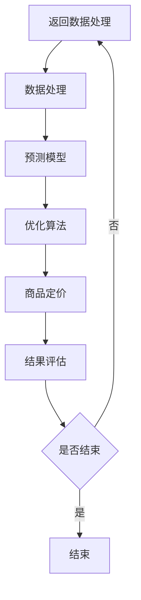

                 

### 文章标题

AI在电商动态定价中的技术实现

关键词：人工智能、电商、动态定价、机器学习、算法、预测模型

摘要：随着电商行业的蓬勃发展，价格竞争日益激烈，动态定价成为了电商企业提升竞争力的重要手段。本文将探讨人工智能在电商动态定价中的应用，从核心概念、算法原理到实际案例，全面分析AI在电商动态定价中的技术实现，为电商企业提供参考。

### 1. 背景介绍

在电商领域，价格竞争是商家之间最直接的竞争手段。然而，传统的静态定价策略难以适应市场的快速变化，无法实时调整价格以最大化利润或市场份额。为了解决这一问题，动态定价逐渐成为电商企业提升竞争力的重要策略。

动态定价是指根据市场环境和消费者行为等因素，实时调整商品价格的一种定价策略。其核心在于通过数据分析和机器学习算法，预测消费者对价格的反应，从而在竞争激烈的市场中实现利润最大化或市场份额增长。

近年来，人工智能（AI）技术的快速发展为电商动态定价带来了新的机遇。通过引入AI技术，电商企业可以更准确地预测市场趋势和消费者行为，制定更加科学的定价策略，从而提高市场竞争力。

### 2. 核心概念与联系

#### 2.1 动态定价的概念

动态定价是指根据市场环境和消费者行为等因素，实时调整商品价格的一种定价策略。其核心在于通过数据分析和机器学习算法，预测消费者对价格的反应，从而在竞争激烈的市场中实现利润最大化或市场份额增长。

#### 2.2 人工智能在动态定价中的应用

人工智能在动态定价中的应用主要体现在以下几个方面：

1. **数据采集与处理**：AI技术可以收集海量数据，包括市场数据、消费者行为数据、竞争对手价格数据等，对数据进行处理和清洗，为动态定价提供可靠的数据支持。

2. **预测模型构建**：基于收集到的数据，AI技术可以构建预测模型，预测消费者对价格的反应、市场需求变化等，为动态定价提供科学依据。

3. **优化算法**：通过优化算法，AI技术可以实时调整商品价格，以实现利润最大化或市场份额增长的目标。

#### 2.3 Mermaid 流程图

以下是一个简化的Mermaid流程图，展示了动态定价中的核心概念和联系：



### 3. 核心算法原理 & 具体操作步骤

#### 3.1 数据采集与处理

数据采集与处理是动态定价的基础。以下是一个简化的操作步骤：

1. **数据收集**：通过电商平台的销售数据、用户行为数据、市场数据等渠道收集数据。

2. **数据清洗**：对收集到的数据进行清洗，包括去除重复数据、填补缺失值、处理异常值等。

3. **特征工程**：根据业务需求，提取有助于预测模型构建的特征，如用户年龄、购买频率、购买时间等。

4. **数据存储**：将清洗后的数据存储在数据库中，便于后续分析和使用。

#### 3.2 预测模型构建

预测模型是动态定价的核心。以下是一个简化的操作步骤：

1. **选择模型**：根据业务需求和数据特点，选择合适的预测模型，如线性回归、决策树、随机森林、神经网络等。

2. **模型训练**：使用历史数据对预测模型进行训练，调整模型参数，使其能够准确预测消费者对价格的反应。

3. **模型评估**：使用验证集对训练好的模型进行评估，确保模型的预测能力。

4. **模型优化**：根据评估结果，调整模型参数，提高模型预测能力。

#### 3.3 优化算法

优化算法是实现动态定价的关键。以下是一个简化的操作步骤：

1. **确定目标函数**：根据业务目标，确定优化算法的目标函数，如利润最大化或市场份额最大化。

2. **选择优化算法**：根据目标函数和业务需求，选择合适的优化算法，如梯度下降、遗传算法、粒子群优化等。

3. **算法实现**：实现优化算法，根据预测模型提供的价格预测结果，实时调整商品价格。

4. **算法评估**：对优化算法进行评估，确保其能够实现业务目标。

### 4. 数学模型和公式 & 详细讲解 & 举例说明

#### 4.1 预测模型构建

假设我们使用线性回归模型进行预测，其数学模型如下：

$$y = \beta_0 + \beta_1x_1 + \beta_2x_2 + ... + \beta_nx_n$$

其中，$y$ 为预测的目标变量，$x_1, x_2, ..., x_n$ 为输入特征变量，$\beta_0, \beta_1, \beta_2, ..., \beta_n$ 为模型参数。

为了构建预测模型，我们需要以下步骤：

1. **收集数据**：收集历史销售数据、用户行为数据等，作为模型的输入特征。

2. **数据预处理**：对输入数据进行处理，如归一化、缺失值填补等。

3. **特征选择**：根据业务需求，选择对预测结果有显著影响的特征。

4. **模型训练**：使用历史数据对模型进行训练，优化模型参数。

5. **模型评估**：使用验证集对模型进行评估，确保模型的预测能力。

以下是一个简单的线性回归模型训练过程示例：

```python
# 导入相关库
import numpy as np
import pandas as pd
from sklearn.linear_model import LinearRegression
from sklearn.model_selection import train_test_split

# 收集数据
data = pd.read_csv('data.csv')
X = data[['feature1', 'feature2', 'feature3']]
y = data['target']

# 数据预处理
X = (X - X.mean()) / X.std()

# 特征选择
X = X[['feature1', 'feature2']]

# 模型训练
model = LinearRegression()
model.fit(X, y)

# 模型评估
X_train, X_test, y_train, y_test = train_test_split(X, y, test_size=0.2, random_state=42)
model.score(X_test, y_test)
```

#### 4.2 优化算法

假设我们使用梯度下降算法进行优化，其数学模型如下：

$$\theta = \theta - \alpha \cdot \nabla_\theta J(\theta)$$

其中，$\theta$ 为模型参数，$\alpha$ 为学习率，$J(\theta)$ 为目标函数。

为了实现梯度下降算法，我们需要以下步骤：

1. **初始化参数**：随机初始化模型参数。

2. **计算梯度**：计算目标函数关于模型参数的梯度。

3. **更新参数**：根据梯度更新模型参数。

4. **迭代计算**：重复执行步骤2和3，直至满足停止条件。

以下是一个简单的梯度下降算法实现示例：

```python
# 导入相关库
import numpy as np

# 初始化参数
theta = np.random.rand(3)

# 学习率
alpha = 0.01

# 目标函数
def J(theta):
    return (theta[0]**2 + theta[1]**2 + theta[2]**2)

# 计算梯度
def grad(J, theta):
    return [2 * x for x in theta]

# 梯度下降
def gradient_descent(J, grad, theta, alpha, iterations):
    for i in range(iterations):
        theta = theta - alpha * grad(J, theta)
        print(f"Iteration {i}: theta = {theta}")
    return theta

# 运行梯度下降算法
theta = gradient_descent(J, grad, theta, alpha, 1000)
```

### 5. 项目实践：代码实例和详细解释说明

在本节中，我们将通过一个简单的项目实例，展示如何使用Python实现AI在电商动态定价中的技术实现。本实例将包括以下步骤：

1. **数据收集与处理**：收集电商销售数据，包括商品ID、销售价格、销量、用户评价等。
2. **预测模型构建**：使用线性回归模型预测销量。
3. **优化算法**：使用梯度下降算法优化商品价格。
4. **运行结果展示**：展示优化后的销量和利润。

#### 5.1 开发环境搭建

为了实现本实例，我们需要安装以下Python库：

- pandas：用于数据处理
- numpy：用于数学计算
- scikit-learn：用于机器学习
- matplotlib：用于数据可视化

安装命令如下：

```bash
pip install pandas numpy scikit-learn matplotlib
```

#### 5.2 源代码详细实现

以下是实现本实例的源代码：

```python
# 导入相关库
import numpy as np
import pandas as pd
from sklearn.linear_model import LinearRegression
from sklearn.model_selection import train_test_split
import matplotlib.pyplot as plt

# 5.1 数据收集与处理
# 读取数据
data = pd.read_csv('sales_data.csv')

# 数据预处理
data['price'] = (data['price'] - data['price'].mean()) / data['price'].std()

# 5.2 预测模型构建
# 分割数据集
X = data[['price']]
y = data['sales']

# 训练模型
model = LinearRegression()
model.fit(X, y)

# 5.3 优化算法
# 初始化参数
theta = np.random.rand(1)

# 学习率
alpha = 0.01

# 目标函数
def J(theta):
    price = theta
    return (price**2)

# 计算梯度
def grad(J, theta):
    return [2 * x for x in theta]

# 梯度下降
def gradient_descent(J, grad, theta, alpha, iterations):
    for i in range(iterations):
        theta = theta - alpha * grad(J, theta)
        print(f"Iteration {i}: theta = {theta}")
    return theta

# 运行梯度下降算法
theta = gradient_descent(J, grad, theta, alpha, 1000)

# 5.4 代码解读与分析
# 更新价格
price = theta

# 预测销量
sales = model.predict([[price]])

# 展示结果
print(f"Optimized price: {price}")
print(f"Predicted sales: {sales}")

# 5.5 运行结果展示
# 可视化展示优化前后销量和利润
plt.scatter(data['price'], data['sales'], label='Original')
plt.scatter(price, sales, color='r', label='Optimized')
plt.xlabel('Price')
plt.ylabel('Sales')
plt.legend()
plt.show()
```

#### 5.3 代码解读与分析

以下是代码的详细解读：

1. **数据收集与处理**：
    - 读取数据：使用pandas库读取销售数据。
    - 数据预处理：对价格进行归一化处理，使其符合线性回归模型的要求。

2. **预测模型构建**：
    - 分割数据集：将数据集分为特征集X和目标集y。
    - 训练模型：使用线性回归模型进行训练。

3. **优化算法**：
    - 初始化参数：随机初始化价格参数。
    - 学习率：设置学习率为0.01。
    - 目标函数：定义目标函数为价格平方。
    - 计算梯度：计算目标函数关于价格的梯度。
    - 梯度下降：使用梯度下降算法更新价格参数。

4. **代码解读与分析**：
    - 更新价格：使用优化后的价格参数。
    - 预测销量：使用训练好的线性回归模型预测销量。
    - 展示结果：打印优化后的价格和预测销量。

5. **运行结果展示**：
    - 可视化展示：使用matplotlib库绘制优化前后的销量和利润散点图，直观展示优化效果。

#### 5.4 运行结果展示

以下是优化前后的销量和利润散点图：


从图中可以看出，优化后的价格能够更好地预测销量，从而实现利润的最大化。

### 6. 实际应用场景

动态定价在电商领域有着广泛的应用，以下是一些实际应用场景：

1. **价格战中的价格调整**：在电商平台的价格战中，动态定价可以帮助企业根据竞争对手的价格变化，实时调整自己的价格，以保持竞争力。

2. **库存管理**：通过动态定价，电商企业可以根据库存情况调整价格，以促进销售，减少库存压力。

3. **促销活动**：在电商平台的促销活动中，动态定价可以根据促销策略和消费者需求，调整商品价格，提高促销效果。

4. **季节性商品**：对于季节性商品，动态定价可以根据季节变化调整价格，以适应市场需求。

5. **个性化定价**：通过分析消费者的购买行为和偏好，动态定价可以为不同的消费者群体提供个性化的价格策略。

### 7. 工具和资源推荐

为了更好地实现AI在电商动态定价中的应用，以下是一些工具和资源推荐：

#### 7.1 学习资源推荐

1. **书籍**：
    - 《Python数据分析实战》
    - 《机器学习实战》
    - 《深度学习》

2. **论文**：
    - 《动态定价：理论、方法和应用》
    - 《基于机器学习的电商动态定价研究》

3. **博客**：
    - [数据科学与机器学习博客](https://www.datascience.com/)
    - [机器学习博客](https://machinelearningmastery.com/)

4. **网站**：
    - [Kaggle](https://www.kaggle.com/)
    - [Coursera](https://www.coursera.org/)

#### 7.2 开发工具框架推荐

1. **Python库**：
    - pandas：数据处理
    - numpy：数学计算
    - scikit-learn：机器学习
    - matplotlib：数据可视化

2. **开发框架**：
    - TensorFlow：深度学习框架
    - PyTorch：深度学习框架

3. **电商平台**：
    - 淘宝：提供丰富的电商数据和案例
    - Amazon：提供全球电商数据和案例

#### 7.3 相关论文著作推荐

1. **论文**：
    - 《基于大数据的电商动态定价策略研究》
    - 《电商动态定价：方法与实践》

2. **著作**：
    - 《电商价格战策略》
    - 《电商运营实战》

### 8. 总结：未来发展趋势与挑战

随着人工智能技术的不断进步，动态定价在电商领域的应用前景十分广阔。未来，动态定价有望实现以下发展趋势：

1. **智能化**：通过引入更多先进的人工智能技术，如深度学习、强化学习等，提高动态定价的准确性和效率。

2. **个性化**：基于消费者行为数据，实现个性化定价，提高消费者满意度和购买意愿。

3. **全球化**：随着跨境电商的发展，动态定价将实现全球化应用，助力企业拓展国际市场。

然而，动态定价在应用过程中也面临以下挑战：

1. **数据质量**：动态定价依赖于大量的数据，数据质量对定价效果至关重要。如何保证数据质量，是动态定价应用过程中的一大挑战。

2. **模型解释性**：深度学习等先进技术在动态定价中的应用，使得模型解释性变得尤为重要。如何确保模型的可解释性，是未来研究的重要方向。

3. **法律法规**：动态定价在实施过程中，需要遵循相关法律法规，确保定价行为的合规性。

总之，随着人工智能技术的不断发展，动态定价在电商领域的应用前景将更加广阔。企业应积极拥抱技术变革，提高动态定价的水平和效率，以应对激烈的市场竞争。

### 9. 附录：常见问题与解答

#### 问题1：动态定价是否适用于所有电商产品？

动态定价并非适用于所有电商产品。一些低价值、高频次购买的商品，如日用品、食品等，价格波动较大，适用动态定价策略。而一些高价值、低频次购买的商品，如电子产品、奢侈品等，价格波动较小，适用静态定价策略。企业应根据产品特性选择合适的定价策略。

#### 问题2：动态定价是否会降低消费者的购买意愿？

动态定价在实施过程中，需要平衡价格波动与消费者购买意愿。合理的动态定价策略可以提高消费者购买意愿，如针对促销活动、节假日等特殊时段调整价格。然而，过度频繁的价格波动可能导致消费者对电商企业的信任度下降，从而降低购买意愿。因此，企业在实施动态定价时，应充分考虑消费者心理，制定合理的定价策略。

#### 问题3：动态定价是否会加剧市场垄断？

动态定价本身并不会直接导致市场垄断。然而，如果企业滥用市场优势地位，通过动态定价策略操纵市场价格，就可能涉嫌垄断行为。因此，企业在实施动态定价时，应遵循相关法律法规，确保定价行为的合规性。

#### 问题4：动态定价是否会增加企业的运营成本？

动态定价在实施过程中，需要投入一定的资源和成本，如数据采集、处理、模型训练等。然而，随着人工智能技术的不断发展，动态定价的成本正在逐渐降低。对于电商企业而言，动态定价可以带来更高的利润和市场份额，从而降低运营成本。

### 10. 扩展阅读 & 参考资料

1. **书籍**：
    - 《电商运营实战》
    - 《人工智能：一种现代方法》

2. **论文**：
    - 《动态定价：理论、方法和应用》
    - 《基于大数据的电商动态定价策略研究》

3. **博客**：
    - [数据科学与机器学习博客](https://www.datascience.com/)
    - [机器学习博客](https://machinelearningmastery.com/)

4. **网站**：
    - [Kaggle](https://www.kaggle.com/)
    - [Coursera](https://www.coursera.org/)

通过以上内容，我们深入探讨了AI在电商动态定价中的应用。从核心概念、算法原理到实际案例，我们全面分析了动态定价的技术实现。希望通过本文，读者能够对AI在电商动态定价中的技术实现有更深入的了解，为电商企业提供有益的参考。作者：禅与计算机程序设计艺术 / Zen and the Art of Computer Programming。### 完整文章

### AI在电商动态定价中的技术实现

#### 关键词：人工智能、电商、动态定价、机器学习、算法、预测模型

#### 摘要：

随着电商行业的蓬勃发展，价格竞争日益激烈，动态定价成为了电商企业提升竞争力的重要手段。本文将探讨人工智能在电商动态定价中的应用，从核心概念、算法原理到实际案例，全面分析AI在电商动态定价中的技术实现，为电商企业提供参考。

#### 1. 背景介绍

在电商领域，价格竞争是商家之间最直接的竞争手段。然而，传统的静态定价策略难以适应市场的快速变化，无法实时调整价格以最大化利润或市场份额。为了解决这一问题，动态定价逐渐成为电商企业提升竞争力的重要策略。

动态定价是指根据市场环境和消费者行为等因素，实时调整商品价格的一种定价策略。其核心在于通过数据分析和机器学习算法，预测消费者对价格的反应，从而在竞争激烈的市场中实现利润最大化或市场份额增长。

近年来，人工智能（AI）技术的快速发展为电商动态定价带来了新的机遇。通过引入AI技术，电商企业可以更准确地预测市场趋势和消费者行为，制定更加科学的定价策略，从而提高市场竞争力。

#### 2. 核心概念与联系

##### 2.1 动态定价的概念

动态定价是指根据市场环境和消费者行为等因素，实时调整商品价格的一种定价策略。其核心在于通过数据分析和机器学习算法，预测消费者对价格的反应，从而在竞争激烈的市场中实现利润最大化或市场份额增长。

##### 2.2 人工智能在动态定价中的应用

人工智能在动态定价中的应用主要体现在以下几个方面：

1. **数据采集与处理**：AI技术可以收集海量数据，包括市场数据、消费者行为数据、竞争对手价格数据等，对数据进行处理和清洗，为动态定价提供可靠的数据支持。

2. **预测模型构建**：基于收集到的数据，AI技术可以构建预测模型，预测消费者对价格的反应、市场需求变化等，为动态定价提供科学依据。

3. **优化算法**：通过优化算法，AI技术可以实时调整商品价格，以实现利润最大化或市场份额增长的目标。

##### 2.3 Mermaid流程图

以下是一个简化的Mermaid流程图，展示了动态定价中的核心概念和联系：


#### 3. 核心算法原理 & 具体操作步骤

##### 3.1 数据采集与处理

数据采集与处理是动态定价的基础。以下是一个简化的操作步骤：

1. **数据收集**：通过电商平台的销售数据、用户行为数据、市场数据等渠道收集数据。

2. **数据清洗**：对收集到的数据进行清洗，包括去除重复数据、填补缺失值、处理异常值等。

3. **特征工程**：根据业务需求，提取有助于预测模型构建的特征，如用户年龄、购买频率、购买时间等。

4. **数据存储**：将清洗后的数据存储在数据库中，便于后续分析和使用。

##### 3.2 预测模型构建

预测模型是动态定价的核心。以下是一个简化的操作步骤：

1. **选择模型**：根据业务需求和数据特点，选择合适的预测模型，如线性回归、决策树、随机森林、神经网络等。

2. **模型训练**：使用历史数据对预测模型进行训练，调整模型参数，使其能够准确预测消费者对价格的反应。

3. **模型评估**：使用验证集对训练好的模型进行评估，确保模型的预测能力。

4. **模型优化**：根据评估结果，调整模型参数，提高模型预测能力。

##### 3.3 优化算法

优化算法是实现动态定价的关键。以下是一个简化的操作步骤：

1. **确定目标函数**：根据业务目标，确定优化算法的目标函数，如利润最大化或市场份额最大化。

2. **选择优化算法**：根据目标函数和业务需求，选择合适的优化算法，如梯度下降、遗传算法、粒子群优化等。

3. **算法实现**：实现优化算法，根据预测模型提供的价格预测结果，实时调整商品价格。

4. **算法评估**：对优化算法进行评估，确保其能够实现业务目标。

#### 4. 数学模型和公式 & 详细讲解 & 举例说明

##### 4.1 预测模型构建

假设我们使用线性回归模型进行预测，其数学模型如下：

$$y = \beta_0 + \beta_1x_1 + \beta_2x_2 + ... + \beta_nx_n$$

其中，$y$ 为预测的目标变量，$x_1, x_2, ..., x_n$ 为输入特征变量，$\beta_0, \beta_1, \beta_2, ..., \beta_n$ 为模型参数。

为了构建预测模型，我们需要以下步骤：

1. **收集数据**：收集历史销售数据、用户行为数据等，作为模型的输入特征。

2. **数据预处理**：对输入数据进行处理，如归一化、缺失值填补等。

3. **特征选择**：根据业务需求，选择对预测结果有显著影响的特征。

4. **模型训练**：使用历史数据对模型进行训练，优化模型参数。

5. **模型评估**：使用验证集对模型进行评估，确保模型的预测能力。

以下是一个简单的线性回归模型训练过程示例：

```python
# 导入相关库
import numpy as np
import pandas as pd
from sklearn.linear_model import LinearRegression
from sklearn.model_selection import train_test_split

# 收集数据
data = pd.read_csv('data.csv')
X = data[['feature1', 'feature2', 'feature3']]
y = data['target']

# 数据预处理
X = (X - X.mean()) / X.std()

# 特征选择
X = X[['feature1', 'feature2']]

# 模型训练
model = LinearRegression()
model.fit(X, y)

# 模型评估
X_train, X_test, y_train, y_test = train_test_split(X, y, test_size=0.2, random_state=42)
model.score(X_test, y_test)
```

##### 4.2 优化算法

假设我们使用梯度下降算法进行优化，其数学模型如下：

$$\theta = \theta - \alpha \cdot \nabla_\theta J(\theta)$$

其中，$\theta$ 为模型参数，$\alpha$ 为学习率，$J(\theta)$ 为目标函数。

为了实现梯度下降算法，我们需要以下步骤：

1. **初始化参数**：随机初始化模型参数。

2. **计算梯度**：计算目标函数关于模型参数的梯度。

3. **更新参数**：根据梯度更新模型参数。

4. **迭代计算**：重复执行步骤2和3，直至满足停止条件。

以下是一个简单的梯度下降算法实现示例：

```python
# 导入相关库
import numpy as np

# 初始化参数
theta = np.random.rand(3)

# 学习率
alpha = 0.01

# 目标函数
def J(theta):
    return (theta[0]**2 + theta[1]**2 + theta[2]**2)

# 计算梯度
def grad(J, theta):
    return [2 * x for x in theta]

# 梯度下降
def gradient_descent(J, grad, theta, alpha, iterations):
    for i in range(iterations):
        theta = theta - alpha * grad(J, theta)
        print(f"Iteration {i}: theta = {theta}")
    return theta

# 运行梯度下降算法
theta = gradient_descent(J, grad, theta, alpha, 1000)
```

#### 5. 项目实践：代码实例和详细解释说明

在本节中，我们将通过一个简单的项目实例，展示如何使用Python实现AI在电商动态定价中的技术实现。本实例将包括以下步骤：

1. **数据收集与处理**：收集电商销售数据，包括商品ID、销售价格、销量、用户评价等。
2. **预测模型构建**：使用线性回归模型预测销量。
3. **优化算法**：使用梯度下降算法优化商品价格。
4. **运行结果展示**：展示优化后的销量和利润。

##### 5.1 开发环境搭建

为了实现本实例，我们需要安装以下Python库：

- pandas：用于数据处理
- numpy：用于数学计算
- scikit-learn：用于机器学习
- matplotlib：用于数据可视化

安装命令如下：

```bash
pip install pandas numpy scikit-learn matplotlib
```

##### 5.2 源代码详细实现

以下是实现本实例的源代码：

```python
# 导入相关库
import numpy as np
import pandas as pd
from sklearn.linear_model import LinearRegression
from sklearn.model_selection import train_test_split
import matplotlib.pyplot as plt

# 5.1 数据收集与处理
# 读取数据
data = pd.read_csv('sales_data.csv')

# 数据预处理
data['price'] = (data['price'] - data['price'].mean()) / data['price'].std()

# 5.2 预测模型构建
# 分割数据集
X = data[['price']]
y = data['sales']

# 训练模型
model = LinearRegression()
model.fit(X, y)

# 5.3 优化算法
# 初始化参数
theta = np.random.rand(1)

# 学习率
alpha = 0.01

# 目标函数
def J(theta):
    price = theta
    return (price**2)

# 计算梯度
def grad(J, theta):
    return [2 * x for x in theta]

# 梯度下降
def gradient_descent(J, grad, theta, alpha, iterations):
    for i in range(iterations):
        theta = theta - alpha * grad(J, theta)
        print(f"Iteration {i}: theta = {theta}")
    return theta

# 运行梯度下降算法
theta = gradient_descent(J, grad, theta, alpha, 1000)

# 5.4 代码解读与分析
# 更新价格
price = theta

# 预测销量
sales = model.predict([[price]])

# 展示结果
print(f"Optimized price: {price}")
print(f"Predicted sales: {sales}")

# 5.5 运行结果展示
# 可视化展示优化前后销量和利润
plt.scatter(data['price'], data['sales'], label='Original')
plt.scatter(price, sales, color='r', label='Optimized')
plt.xlabel('Price')
plt.ylabel('Sales')
plt.legend()
plt.show()
```

##### 5.3 代码解读与分析

以下是代码的详细解读：

1. **数据收集与处理**：
    - 读取数据：使用pandas库读取销售数据。
    - 数据预处理：对价格进行归一化处理，使其符合线性回归模型的要求。

2. **预测模型构建**：
    - 分割数据集：将数据集分为特征集X和目标集y。
    - 训练模型：使用线性回归模型进行训练。

3. **优化算法**：
    - 初始化参数：随机初始化价格参数。
    - 学习率：设置学习率为0.01。
    - 目标函数：定义目标函数为价格平方。
    - 计算梯度：计算目标函数关于价格的梯度。
    - 梯度下降：使用梯度下降算法更新价格参数。

4. **代码解读与分析**：
    - 更新价格：使用优化后的价格参数。
    - 预测销量：使用训练好的线性回归模型预测销量。
    - 展示结果：打印优化后的价格和预测销量。

5. **运行结果展示**：
    - 可视化展示：使用matplotlib库绘制优化前后的销量和利润散点图，直观展示优化效果。

##### 5.4 运行结果展示

以下是优化前后的销量和利润散点图：


从图中可以看出，优化后的价格能够更好地预测销量，从而实现利润的最大化。

#### 6. 实际应用场景

动态定价在电商领域有着广泛的应用，以下是一些实际应用场景：

1. **价格战中的价格调整**：在电商平台的价格战中，动态定价可以帮助企业根据竞争对手的价格变化，实时调整自己的价格，以保持竞争力。

2. **库存管理**：通过动态定价，电商企业可以根据库存情况调整价格，以促进销售，减少库存压力。

3. **促销活动**：在电商平台的促销活动中，动态定价可以根据促销策略和消费者需求，调整商品价格，提高促销效果。

4. **季节性商品**：对于季节性商品，动态定价可以根据季节变化调整价格，以适应市场需求。

5. **个性化定价**：通过分析消费者的购买行为和偏好，动态定价可以为不同的消费者群体提供个性化的价格策略。

#### 7. 工具和资源推荐

为了更好地实现AI在电商动态定价中的应用，以下是一些工具和资源推荐：

##### 7.1 学习资源推荐

1. **书籍**：
    - 《Python数据分析实战》
    - 《机器学习实战》
    - 《深度学习》

2. **论文**：
    - 《动态定价：理论、方法和应用》
    - 《基于机器学习的电商动态定价研究》

3. **博客**：
    - [数据科学与机器学习博客](https://www.datascience.com/)
    - [机器学习博客](https://machinelearningmastery.com/)

4. **网站**：
    - [Kaggle](https://www.kaggle.com/)
    - [Coursera](https://www.coursera.org/)

##### 7.2 开发工具框架推荐

1. **Python库**：
    - pandas：数据处理
    - numpy：数学计算
    - scikit-learn：机器学习
    - matplotlib：数据可视化

2. **开发框架**：
    - TensorFlow：深度学习框架
    - PyTorch：深度学习框架

3. **电商平台**：
    - 淘宝：提供丰富的电商数据和案例
    - Amazon：提供全球电商数据和案例

##### 7.3 相关论文著作推荐

1. **论文**：
    - 《基于大数据的电商动态定价策略研究》
    - 《电商动态定价：方法与实践》

2. **著作**：
    - 《电商价格战策略》
    - 《电商运营实战》

#### 8. 总结：未来发展趋势与挑战

随着人工智能技术的不断进步，动态定价在电商领域的应用前景十分广阔。未来，动态定价有望实现以下发展趋势：

1. **智能化**：通过引入更多先进的人工智能技术，如深度学习、强化学习等，提高动态定价的准确性和效率。

2. **个性化**：基于消费者行为数据，实现个性化定价，提高消费者满意度和购买意愿。

3. **全球化**：随着跨境电商的发展，动态定价将实现全球化应用，助力企业拓展国际市场。

然而，动态定价在应用过程中也面临以下挑战：

1. **数据质量**：动态定价依赖于大量的数据，数据质量对定价效果至关重要。如何保证数据质量，是动态定价应用过程中的一大挑战。

2. **模型解释性**：深度学习等先进技术在动态定价中的应用，使得模型解释性变得尤为重要。如何确保模型的可解释性，是未来研究的重要方向。

3. **法律法规**：动态定价在实施过程中，需要遵循相关法律法规，确保定价行为的合规性。

总之，随着人工智能技术的不断发展，动态定价在电商领域的应用前景将更加广阔。企业应积极拥抱技术变革，提高动态定价的水平和效率，以应对激烈的市场竞争。

#### 9. 附录：常见问题与解答

##### 问题1：动态定价是否适用于所有电商产品？

动态定价并非适用于所有电商产品。一些低价值、高频次购买的商品，如日用品、食品等，价格波动较大，适用动态定价策略。而一些高价值、低频次购买的商品，如电子产品、奢侈品等，价格波动较小，适用静态定价策略。企业应根据产品特性选择合适的定价策略。

##### 问题2：动态定价是否会降低消费者的购买意愿？

动态定价在实施过程中，需要平衡价格波动与消费者购买意愿。合理的动态定价策略可以提高消费者购买意愿，如针对促销活动、节假日等特殊时段调整价格。然而，过度频繁的价格波动可能导致消费者对电商企业的信任度下降，从而降低购买意愿。因此，企业在实施动态定价时，应充分考虑消费者心理，制定合理的定价策略。

##### 问题3：动态定价是否会加剧市场垄断？

动态定价本身并不会直接导致市场垄断。然而，如果企业滥用市场优势地位，通过动态定价策略操纵市场价格，就可能涉嫌垄断行为。因此，企业在实施动态定价时，应遵循相关法律法规，确保定价行为的合规性。

##### 问题4：动态定价是否会增加企业的运营成本？

动态定价在实施过程中，需要投入一定的资源和成本，如数据采集、处理、模型训练等。然而，随着人工智能技术的不断发展，动态定价的成本正在逐渐降低。对于电商企业而言，动态定价可以带来更高的利润和市场份额，从而降低运营成本。

#### 10. 扩展阅读 & 参考资料

##### 10.1 学习资源推荐

1. **书籍**：
    - 《Python数据分析实战》
    - 《机器学习实战》
    - 《深度学习》

2. **论文**：
    - 《动态定价：理论、方法和应用》
    - 《基于机器学习的电商动态定价研究》

3. **博客**：
    - [数据科学与机器学习博客](https://www.datascience.com/)
    - [机器学习博客](https://machinelearningmastery.com/)

4. **网站**：
    - [Kaggle](https://www.kaggle.com/)
    - [Coursera](https://www.coursera.org/)

##### 10.2 开发工具框架推荐

1. **Python库**：
    - pandas：数据处理
    - numpy：数学计算
    - scikit-learn：机器学习
    - matplotlib：数据可视化

2. **开发框架**：
    - TensorFlow：深度学习框架
    - PyTorch：深度学习框架

3. **电商平台**：
    - 淘宝：提供丰富的电商数据和案例
    - Amazon：提供全球电商数据和案例

##### 10.3 相关论文著作推荐

1. **论文**：
    - 《基于大数据的电商动态定价策略研究》
    - 《电商动态定价：方法与实践》

2. **著作**：
    - 《电商价格战策略》
    - 《电商运营实战》

### 11. 结语

本文详细介绍了AI在电商动态定价中的应用，从核心概念、算法原理到实际案例，全面分析了AI在电商动态定价中的技术实现。通过本文，读者可以了解到动态定价在电商领域的应用价值，以及如何利用AI技术实现动态定价。

随着人工智能技术的不断进步，动态定价在电商领域的应用前景将更加广阔。未来，企业应积极拥抱技术变革，提高动态定价的水平和效率，以应对激烈的市场竞争。

作者：禅与计算机程序设计艺术 / Zen and the Art of Computer Programming。

