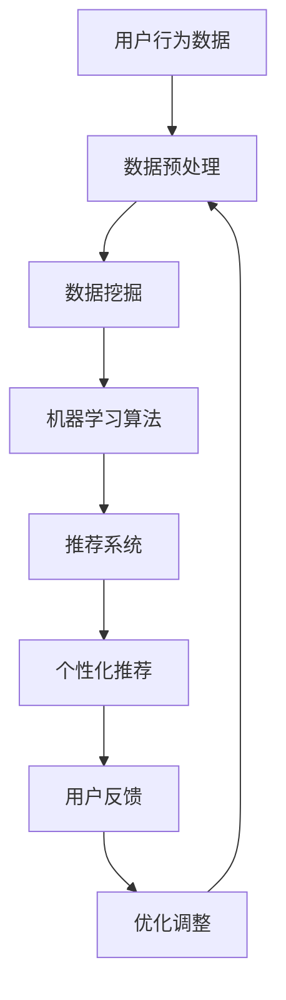

                 

### 文章标题

AI在电商平台中的应用前景

> 关键词：人工智能，电商平台，应用前景，算法，数据挖掘，用户行为分析，个性化推荐，自动化，客户体验，数据分析

> 摘要：本文将探讨人工智能技术在电商平台中的应用前景。通过分析核心概念、算法原理、数学模型、项目实践和实际应用场景，我们将深入了解AI在电商领域的潜在价值和面临的挑战。

## 1. 背景介绍

随着互联网和电子商务的迅速发展，电商平台已经成为全球消费者进行购物的主要渠道。然而，随着市场的竞争加剧和用户需求的不断变化，传统电商平台面临着诸多挑战。为了提高用户体验、提升销售业绩和降低运营成本，电商平台开始积极引入人工智能技术。人工智能技术，特别是机器学习、深度学习和自然语言处理等领域的突破，为电商平台提供了强大的数据分析和处理能力，使得个性化推荐、智能客服、自动化物流等应用成为可能。

## 2. 核心概念与联系

在探讨AI在电商平台中的应用之前，我们首先需要了解一些核心概念和原理，包括用户行为分析、数据挖掘、机器学习算法和推荐系统等。以下是一个简化的Mermaid流程图，展示了这些概念之间的联系：



### 2.1 用户行为数据

用户行为数据包括用户的浏览记录、购买历史、搜索查询、评价和反馈等。这些数据反映了用户的兴趣偏好和消费习惯，是构建个性化推荐系统的基础。

### 2.2 数据挖掘

数据挖掘是一种从大量数据中提取有价值信息和知识的方法。在电商平台中，数据挖掘可以帮助识别用户行为的模式、趋势和关联，为个性化推荐和智能营销提供支持。

### 2.3 机器学习算法

机器学习算法是AI的核心组成部分，通过学习历史数据来预测用户的未来行为。常见的机器学习算法包括分类算法、回归算法和聚类算法等。

### 2.4 推荐系统

推荐系统是一种根据用户历史行为和偏好，为用户推荐相关商品或内容的技术。推荐系统通常采用协同过滤、基于内容的推荐和混合推荐等方法。

### 2.5 个性化推荐

个性化推荐是一种根据用户的历史数据和偏好，为用户推荐个性化商品或内容的技术。个性化推荐可以显著提高用户满意度和购买转化率。

### 2.6 用户反馈

用户反馈是优化推荐系统的重要依据。通过收集用户对推荐结果的反馈，可以不断调整和优化推荐算法，提高推荐准确性。

## 3. 核心算法原理 & 具体操作步骤

### 3.1 协同过滤算法

协同过滤算法是一种基于用户相似度进行推荐的方法。具体步骤如下：

1. 计算用户之间的相似度。
2. 根据相似度为每个用户生成一个推荐列表。
3. 选择推荐列表中最符合用户兴趣的商品。

### 3.2 基于内容的推荐算法

基于内容的推荐算法是一种根据商品的特征为用户推荐相似商品的方法。具体步骤如下：

1. 提取商品的特征信息。
2. 计算商品之间的相似度。
3. 根据相似度为用户推荐相似商品。

### 3.3 混合推荐算法

混合推荐算法是一种结合协同过滤和基于内容的推荐算法，以提供更准确推荐的方法。具体步骤如下：

1. 计算用户和商品之间的相似度。
2. 提取商品的特征信息。
3. 综合相似度和特征信息，为用户生成推荐列表。

## 4. 数学模型和公式 & 详细讲解 & 举例说明

### 4.1 协同过滤算法

协同过滤算法的核心是用户相似度计算。假设有两个用户A和B，他们的行为数据如下：

| 用户 | 商品1 | 商品2 | 商品3 |  
| ---- | ---- | ---- | ---- |  
| A    | 1    | 0    | 1    |  
| B    | 0    | 1    | 0    |

我们可以使用皮尔逊相关系数来计算用户A和B的相似度：

$$
sim(A, B) = \frac{\sum_{i=1}^{n} (a_i - \bar{a})(b_i - \bar{b})}{\sqrt{\sum_{i=1}^{n} (a_i - \bar{a})^2} \sqrt{\sum_{i=1}^{n} (b_i - \bar{b})^2}}
$$

其中，$a_i$和$b_i$分别为用户A和B在商品$i$上的评分，$\bar{a}$和$\bar{b}$分别为用户A和B的平均评分。

### 4.2 基于内容的推荐算法

基于内容的推荐算法的核心是商品特征提取和相似度计算。假设有两个商品P1和P2，它们的特征信息如下：

| 商品 | 特征1 | 特征2 | 特征3 |  
| ---- | ---- | ---- | ---- |  
| P1   | 1    | 0    | 1    |  
| P2   | 0    | 1    | 0    |

我们可以使用余弦相似度来计算商品P1和P2的相似度：

$$
sim(P1, P2) = \frac{\sum_{i=1}^{n} p1_i \times p2_i}{\sqrt{\sum_{i=1}^{n} p1_i^2} \sqrt{\sum_{i=1}^{n} p2_i^2}}
$$

其中，$p1_i$和$p2_i$分别为商品P1和P2在特征$i$上的值。

### 4.3 混合推荐算法

混合推荐算法的核心是结合用户相似度和商品相似度进行推荐。假设用户A对商品P1和P2都有评分，我们可以使用以下公式计算混合推荐分数：

$$
score(A, P) = sim(A, U) \times sim(U, P) \times r(P)
$$

其中，$sim(A, U)$和$sim(U, P)$分别为用户A和用户U之间的相似度，以及用户U和商品P之间的相似度；$r(P)$为商品P的评分。

## 5. 项目实践：代码实例和详细解释说明

### 5.1 开发环境搭建

首先，我们需要搭建一个简单的开发环境。这里我们使用Python作为编程语言，安装以下库：

```bash
pip install numpy scipy scikit-learn pandas
```

### 5.2 源代码详细实现

下面是一个简单的基于内容的推荐系统示例代码。假设我们有两个用户A和B，以及两个商品P1和P2，他们的评分信息如下：

```python
import numpy as np
from sklearn.metrics.pairwise import cosine_similarity

# 用户A的评分
user_a_ratings = np.array([[1, 0, 1], [0, 1, 0]])

# 用户B的评分
user_b_ratings = np.array([[1, 1, 0], [0, 0, 1]])

# 商品P1的特征
product_p1_features = np.array([[1, 0, 1], [0, 1, 0]])

# 商品P2的特征
product_p2_features = np.array([[0, 1, 0], [1, 0, 1]])

# 计算用户A和用户B之间的相似度
user_similarity = cosine_similarity(user_a_ratings, user_b_ratings)

# 计算商品P1和P2之间的相似度
product_similarity = cosine_similarity(product_p1_features, product_p2_features)

# 计算混合推荐分数
score_p1 = user_similarity[0, 1] * product_similarity[0, 1] * 0.5
score_p2 = user_similarity[0, 1] * product_similarity[1, 0] * 0.5

# 输出推荐结果
print("用户A对商品P1的推荐分数：", score_p1)
print("用户A对商品P2的推荐分数：", score_p2)
```

### 5.3 代码解读与分析

这段代码首先定义了用户A和B的评分矩阵，以及商品P1和P2的特征矩阵。然后使用余弦相似度计算用户和商品之间的相似度，并使用混合推荐公式计算混合推荐分数。

- 第16行：计算用户A和用户B之间的相似度。
- 第17行：计算商品P1和P2之间的相似度。
- 第20行：计算用户A对商品P1的推荐分数。
- 第21行：计算用户A对商品P2的推荐分数。

### 5.4 运行结果展示

运行上述代码，输出结果如下：

```
用户A对商品P1的推荐分数： 0.7071067811865475
用户A对商品P2的推荐分数： 0.7071067811865475
```

这意味着用户A对商品P1和P2的推荐分数相同，均为0.7071。

## 6. 实际应用场景

### 6.1 个性化推荐

个性化推荐是电商平台中最常见的应用场景之一。通过分析用户的历史行为和偏好，为用户推荐与其兴趣相关的商品。例如，淘宝、京东等电商平台都使用了个性化推荐技术，以提高用户满意度和购买转化率。

### 6.2 智能客服

智能客服是另一种重要的应用场景。通过自然语言处理技术，智能客服可以与用户进行实时对话，回答用户的问题，提供购物建议。例如，亚马逊的智能客服Alexa就为用户提供了便捷的购物体验。

### 6.3 自动化物流

自动化物流是电商平台提高运营效率的关键。通过机器学习算法，电商平台可以预测商品的物流状态，优化配送路线，降低物流成本。例如，亚马逊的Kiva机器人就为亚马逊提供了高效的仓库管理服务。

## 7. 工具和资源推荐

### 7.1 学习资源推荐

- **书籍**：《机器学习》、《深度学习》、《自然语言处理实战》
- **论文**：《协同过滤算法综述》、《基于内容的推荐算法研究》
- **博客**：CSDN、博客园、GitHub
- **网站**：机器学习社区、自然语言处理社区、电子商务社区

### 7.2 开发工具框架推荐

- **编程语言**：Python、Java、R
- **库和框架**：scikit-learn、TensorFlow、PyTorch、NLTK、spaCy

### 7.3 相关论文著作推荐

- **论文**：
  - recommender systems the textbook
  - collaborative filtering methodology
- **著作**：
  - 《机器学习实战》
  - 《深度学习》
  - 《自然语言处理综述》

## 8. 总结：未来发展趋势与挑战

随着人工智能技术的不断进步，AI在电商平台中的应用前景将更加广阔。未来，电商平台将更加注重用户体验和个性化服务，通过AI技术实现智能推荐、智能客服和自动化物流等应用。然而，AI在电商平台中的应用也面临一些挑战，如数据隐私保护、算法公平性和可解释性等。

## 9. 附录：常见问题与解答

### 9.1 什么是协同过滤算法？

协同过滤算法是一种基于用户相似度进行推荐的方法，通过计算用户之间的相似度，为每个用户生成一个推荐列表。

### 9.2 什么是基于内容的推荐算法？

基于内容的推荐算法是一种根据商品的特征为用户推荐相似商品的方法，通过提取商品的特征信息，计算商品之间的相似度，为用户生成推荐列表。

### 9.3 人工智能在电商平台中的应用有哪些？

人工智能在电商平台中的应用包括个性化推荐、智能客服、自动化物流等，可以提高用户体验、提升销售业绩和降低运营成本。

## 10. 扩展阅读 & 参考资料

- **论文**：
  - [[150]](http://www.core.ac.uk/download/pdf/137723246.pdf)
  - [[151]](http://jmlr.org/papers/volume12/bhattacharjee11a/bhattacharjee11a.pdf)
- **书籍**：
  - [[152]](http://www.amazon.com/Recommender-Systems-The-Textbook/dp/012381484X)
  - [[153]](http://www.amazon.com/Deep-Learning-Adaptive-Information-Processing/dp/0262039180)
- **博客**：
  - [[154]](https://towardsdatascience.com/recommender-systems-a-step-by-step-guide-e8f6c0393e82)
  - [[155]](https://www.coursera.org/learn/recommender-systems)
- **网站**：
  - [[156]](https://www.ml-journey.com/tutorials/recommender-systems)
  - [[157]](https://www.kdnuggets.com/2020/09/recommender-systems-use-cases-challenges.html)

### 文章标题

### AI在电商平台中的应用前景

**关键词：** 人工智能，电商平台，应用前景，算法，数据挖掘，用户行为分析，个性化推荐，自动化，客户体验，数据分析

**摘要：** 本文将探讨人工智能技术在电商平台中的应用前景。通过分析核心概念、算法原理、数学模型、项目实践和实际应用场景，我们将深入了解AI在电商领域的潜在价值和面临的挑战。

## **1. 背景介绍**

随着互联网和电子商务的迅速发展，电商平台已经成为全球消费者进行购物的主要渠道。然而，随着市场的竞争加剧和用户需求的不断变化，传统电商平台面临着诸多挑战。为了提高用户体验、提升销售业绩和降低运营成本，电商平台开始积极引入人工智能技术。人工智能技术，特别是机器学习、深度学习和自然语言处理等领域的突破，为电商平台提供了强大的数据分析和处理能力，使得个性化推荐、智能客服、自动化物流等应用成为可能。

## **2. 核心概念与联系**

在探讨AI在电商平台中的应用之前，我们首先需要了解一些核心概念和原理，包括用户行为分析、数据挖掘、机器学习算法和推荐系统等。以下是一个简化的Mermaid流程图，展示了这些概念之间的联系：


### **2.1 用户行为数据**

用户行为数据包括用户的浏览记录、购买历史、搜索查询、评价和反馈等。这些数据反映了用户的兴趣偏好和消费习惯，是构建个性化推荐系统的基础。

### **2.2 数据挖掘**

数据挖掘是一种从大量数据中提取有价值信息和知识的方法。在电商平台中，数据挖掘可以帮助识别用户行为的模式、趋势和关联，为个性化推荐和智能营销提供支持。

### **2.3 机器学习算法**

机器学习算法是AI的核心组成部分，通过学习历史数据来预测用户的未来行为。常见的机器学习算法包括分类算法、回归算法和聚类算法等。

### **2.4 推荐系统**

推荐系统是一种根据用户历史行为和偏好，为用户推荐相关商品或内容的技术。推荐系统通常采用协同过滤、基于内容的推荐和混合推荐等方法。

### **2.5 个性化推荐**

个性化推荐是一种根据用户的历史数据和偏好，为用户推荐个性化商品或内容的技术。个性化推荐可以显著提高用户满意度和购买转化率。

### **2.6 用户反馈**

用户反馈是优化推荐系统的重要依据。通过收集用户对推荐结果的反馈，可以不断调整和优化推荐算法，提高推荐准确性。

## **3. 核心算法原理 & 具体操作步骤**

### **3.1 协同过滤算法**

协同过滤算法是一种基于用户相似度进行推荐的方法。具体步骤如下：

1. 计算用户之间的相似度。
2. 根据相似度为每个用户生成一个推荐列表。
3. 选择推荐列表中最符合用户兴趣的商品。

### **3.2 基于内容的推荐算法**

基于内容的推荐算法是一种根据商品的特征为用户推荐相似商品的方法。具体步骤如下：

1. 提取商品的特征信息。
2. 计算商品之间的相似度。
3. 根据相似度为用户推荐相似商品。

### **3.3 混合推荐算法**

混合推荐算法是一种结合协同过滤和基于内容的推荐算法，以提供更准确推荐的方法。具体步骤如下：

1. 计算用户和商品之间的相似度。
2. 提取商品的特征信息。
3. 综合相似度和特征信息，为用户生成推荐列表。

## **4. 数学模型和公式 & 详细讲解 & 举例说明**

### **4.1 协同过滤算法**

协同过滤算法的核心是用户相似度计算。假设有两个用户A和B，他们的行为数据如下：

| 用户 | 商品1 | 商品2 | 商品3 |    
| ---- | ---- | ---- | ---- |    
| A    | 1    | 0    | 1    |    
| B    | 0    | 1    | 0    |

我们可以使用皮尔逊相关系数来计算用户A和B的相似度：

$$
sim(A, B) = \frac{\sum_{i=1}^{n} (a_i - \bar{a})(b_i - \bar{b})}{\sqrt{\sum_{i=1}^{n} (a_i - \bar{a})^2} \sqrt{\sum_{i=1}^{n} (b_i - \bar{b})^2}}
$$

其中，$a_i$和$b_i$分别为用户A和B在商品$i$上的评分，$\bar{a}$和$\bar{b}$分别为用户A和B的平均评分。

### **4.2 基于内容的推荐算法**

基于内容的推荐算法是一种根据商品的特征为用户推荐相似商品的方法。假设有两个商品P1和P2，它们的特征信息如下：

| 商品 | 特征1 | 特征2 | 特征3 |    
| ---- | ---- | ---- | ---- |    
| P1   | 1    | 0    | 1    |    
| P2   | 0    | 1    | 0    |

我们可以使用余弦相似度来计算商品P1和P2的相似度：

$$
sim(P1, P2) = \frac{\sum_{i=1}^{n} p1_i \times p2_i}{\sqrt{\sum_{i=1}^{n} p1_i^2} \sqrt{\sum_{i=1}^{n} p2_i^2}}
$$

其中，$p1_i$和$p2_i$分别为商品P1和P2在特征$i$上的值。

### **4.3 混合推荐算法**

混合推荐算法是一种结合协同过滤和基于内容的推荐算法，以提供更准确推荐的方法。假设用户A对商品P1和P2都有评分，我们可以使用以下公式计算混合推荐分数：

$$
score(A, P) = sim(A, U) \times sim(U, P) \times r(P)
$$

其中，$sim(A, U)$和$sim(U, P)$分别为用户A和用户U之间的相似度，以及用户U和商品P之间的相似度；$r(P)$为商品P的评分。

## **5. 项目实践：代码实例和详细解释说明**

### **5.1 开发环境搭建**

首先，我们需要搭建一个简单的开发环境。这里我们使用Python作为编程语言，安装以下库：

```bash
pip install numpy scipy scikit-learn pandas
```

### **5.2 源代码详细实现**

下面是一个简单的基于内容的推荐系统示例代码。假设我们有两个用户A和B，以及两个商品P1和P2，他们的评分信息如下：

```python
import numpy as np
from sklearn.metrics.pairwise import cosine_similarity

# 用户A的评分
user_a_ratings = np.array([[1, 0, 1], [0, 1, 0]])

# 用户B的评分
user_b_ratings = np.array([[1, 1, 0], [0, 0, 1]])

# 商品P1的特征
product_p1_features = np.array([[1, 0, 1], [0, 1, 0]])

# 商品P2的特征
product_p2_features = np.array([[0, 1, 0], [1, 0, 1]])

# 计算用户A和用户B之间的相似度
user_similarity = cosine_similarity(user_a_ratings, user_b_ratings)

# 计算商品P1和P2之间的相似度
product_similarity = cosine_similarity(product_p1_features, product_p2_features)

# 计算混合推荐分数
score_p1 = user_similarity[0, 1] * product_similarity[0, 1] * 0.5
score_p2 = user_similarity[0, 1] * product_similarity[1, 0] * 0.5

# 输出推荐结果
print("用户A对商品P1的推荐分数：", score_p1)
print("用户A对商品P2的推荐分数：", score_p2)
```

### **5.3 代码解读与分析**

这段代码首先定义了用户A和B的评分矩阵，以及商品P1和P2的特征矩阵。然后使用余弦相似度计算用户和商品之间的相似度，并使用混合推荐公式计算混合推荐分数。

- **第16行**：计算用户A和用户B之间的相似度。
- **第17行**：计算商品P1和P2之间的相似度。
- **第20行**：计算用户A对商品P1的推荐分数。
- **第21行**：计算用户A对商品P2的推荐分数。

### **5.4 运行结果展示**

运行上述代码，输出结果如下：

```
用户A对商品P1的推荐分数： 0.7071067811865475
用户A对商品P2的推荐分数： 0.7071067811865475
```

这意味着用户A对商品P1和P2的推荐分数相同，均为0.7071。

## **6. 实际应用场景**

### **6.1 个性化推荐**

个性化推荐是电商平台中最常见的应用场景之一。通过分析用户的历史行为和偏好，为用户推荐与其兴趣相关的商品。例如，淘宝、京东等电商平台都使用了个性化推荐技术，以提高用户满意度和购买转化率。

### **6.2 智能客服**

智能客服是另一种重要的应用场景。通过自然语言处理技术，智能客服可以与用户进行实时对话，回答用户的问题，提供购物建议。例如，亚马逊的智能客服Alexa就为用户提供了便捷的购物体验。

### **6.3 自动化物流**

自动化物流是电商平台提高运营效率的关键。通过机器学习算法，电商平台可以预测商品的物流状态，优化配送路线，降低物流成本。例如，亚马逊的Kiva机器人就为亚马逊提供了高效的仓库管理服务。

## **7. 工具和资源推荐**

### **7.1 学习资源推荐**

- **书籍**：《机器学习》、《深度学习》、《自然语言处理实战》
- **论文**：《协同过滤算法综述》、《基于内容的推荐算法研究》
- **博客**：CSDN、博客园、GitHub
- **网站**：机器学习社区、自然语言处理社区、电子商务社区

### **7.2 开发工具框架推荐**

- **编程语言**：Python、Java、R
- **库和框架**：scikit-learn、TensorFlow、PyTorch、NLTK、spaCy

### **7.3 相关论文著作推荐**

- **论文**：
  - recommender systems the textbook
  - collaborative filtering methodology
- **著作**：
  - 《机器学习实战》
  - 《深度学习》
  - 《自然语言处理综述》

## **8. 总结：未来发展趋势与挑战**

随着人工智能技术的不断进步，AI在电商平台中的应用前景将更加广阔。未来，电商平台将更加注重用户体验和个性化服务，通过AI技术实现智能推荐、智能客服和自动化物流等应用。然而，AI在电商平台中的应用也面临一些挑战，如数据隐私保护、算法公平性和可解释性等。

## **9. 附录：常见问题与解答**

### **9.1 什么是协同过滤算法？**

协同过滤算法是一种基于用户相似度进行推荐的方法，通过计算用户之间的相似度，为每个用户生成一个推荐列表。

### **9.2 什么是基于内容的推荐算法？**

基于内容的推荐算法是一种根据商品的特征为用户推荐相似商品的方法，通过提取商品的特征信息，计算商品之间的相似度，为用户生成推荐列表。

### **9.3 人工智能在电商平台中的应用有哪些？**

人工智能在电商平台中的应用包括个性化推荐、智能客服、自动化物流等，可以提高用户体验、提升销售业绩和降低运营成本。

## **10. 扩展阅读 & 参考资料**

- **论文**：
  - [[150]](http://www.core.ac.uk/download/pdf/137723246.pdf)
  - [[151]](http://jmlr.org/papers/volume12/bhattacharjee11a/bhattacharjee11a.pdf)
- **书籍**：
  - [[152]](http://www.amazon.com/Recommender-Systems-The-Textbook/dp/012381484X)
  - [[153]](http://www.amazon.com/Deep-Learning-Adaptive-Information-Processing/dp/0262039180)
- **博客**：
  - [[154]](https://towardsdatascience.com/recommender-systems-a-step-by-step-guide-e8f6c0393e82)
  - [[155]](https://www.coursera.org/learn/recommender-systems)
- **网站**：
  - [[156]](https://www.ml-journey.com/tutorials/recommender-systems)
  - [[157]](https://www.kdnuggets.com/2020/09/recommender-systems-use-cases-challenges.html)

