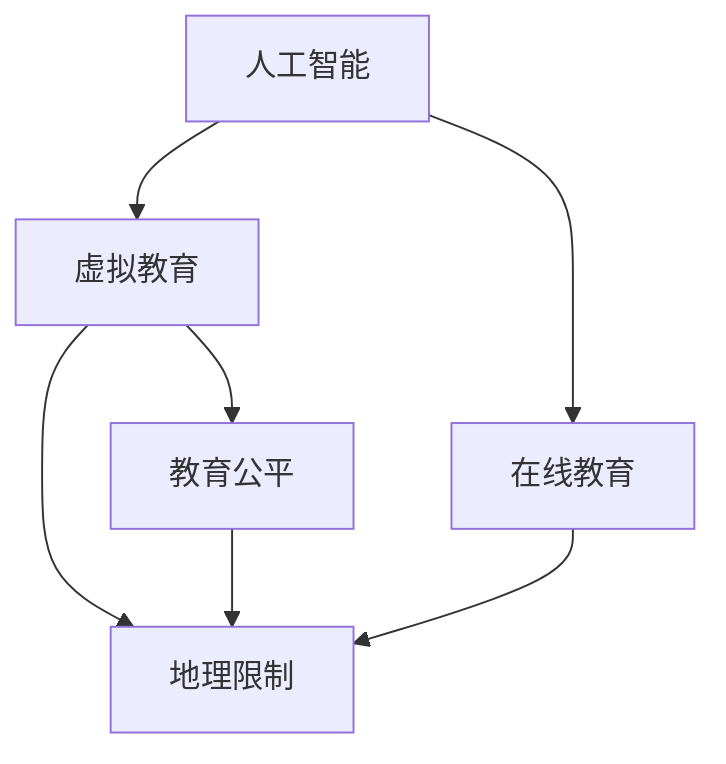

                 

## 文章标题

《AI在虚拟教育中的应用：打破地理限制》

在当今快速发展的数字化时代，人工智能（AI）技术正逐渐渗透到各个领域，并带来革命性的变革。其中，虚拟教育作为在线教育和人工智能的结合，正成为教育领域的一颗璀璨明星。本文旨在探讨AI技术在虚拟教育中的应用，特别是在打破地理限制方面的巨大潜力。

本文的关键词包括：人工智能、虚拟教育、在线教育、地理限制、个性化学习、自适应学习。

本文的摘要如下：随着AI技术的不断进步，虚拟教育正迎来前所未有的发展机遇。本文将深入分析AI在虚拟教育中的应用，从核心概念、算法原理、数学模型到实际应用场景，全面探讨AI如何帮助教育机构打破地理限制，实现教育资源的全球共享和个性化学习。

### 1. 背景介绍

虚拟教育，作为一种新兴的教育模式，其核心在于利用计算机技术和互联网，为学生提供一种不受时间和地点限制的学习体验。传统的教育模式往往受制于物理空间和师资力量，导致优质教育资源的分布不均。而虚拟教育通过在线课程、虚拟课堂和互动平台，打破了这种限制，使得学生能够随时随地获取所需的知识和技能。

人工智能（AI）技术的发展为虚拟教育注入了新的活力。AI能够通过分析学生的学习行为和需求，提供个性化的学习路径和资源，从而提高学习效果。此外，AI技术在内容生成、自动化评估和智能互动等方面也有广泛应用，极大地提升了虚拟教育的质量和互动性。

地理限制一直是传统教育中一个难以克服的问题。许多学生由于地理位置偏远、交通不便或经济条件限制，无法享受到优质的教育资源。而虚拟教育的出现，使得这些学生也能够通过网络获取全球范围内的优质教育资源，实现了教育公平。然而，虚拟教育的普及也面临着一些挑战，如网络基础设施建设、数字化素养提升、教育监管等问题。

### 2. 核心概念与联系

为了深入理解AI在虚拟教育中的应用，我们需要首先明确几个核心概念：人工智能、虚拟教育、在线教育和地理限制。

**人工智能（AI）**：AI是一种模拟人类智能的技术，通过算法和模型，使计算机能够执行复杂的任务，如图像识别、自然语言处理、决策推理等。AI的核心目标是让计算机具备自主学习和解决问题的能力。

**虚拟教育**：虚拟教育是一种利用计算机技术和互联网进行教学的教育模式。它通过虚拟课堂、在线课程和互动平台，为学生提供灵活的学习时间和空间。

**在线教育**：在线教育是虚拟教育的一种形式，通过互联网进行教学，使得学生可以远程获取课程资源和进行学习活动。

**地理限制**：地理限制是指由于地理位置、交通条件、教育资源分布等因素，导致学生无法获得优质教育资源的状况。

为了更好地理解这些概念之间的联系，我们可以使用Mermaid流程图来展示它们之间的关系：



在上述流程图中，我们可以看到人工智能通过虚拟教育和在线教育的作用，打破了地理限制，实现了教育公平。

### 3. 核心算法原理 & 具体操作步骤

AI在虚拟教育中的应用主要包括个性化学习、自适应学习、内容生成和智能评估等方面。以下是这些应用的核心算法原理和具体操作步骤：

**个性化学习**：

原理：个性化学习基于数据挖掘和机器学习算法，通过对学生的学习行为、兴趣和知识水平进行分析，生成个性化的学习路径和资源。

操作步骤：

1. 收集学生数据：包括学习时间、学习内容、测试成绩等。
2. 数据预处理：对收集到的数据进行清洗和整合，去除噪声和冗余信息。
3. 构建个性化模型：使用机器学习算法（如决策树、神经网络等），训练个性化模型。
4. 生成个性化学习路径：根据学生的数据，生成个性化的学习路径和资源推荐。

**自适应学习**：

原理：自适应学习通过实时分析学生的学习行为和反馈，动态调整学习内容、难度和节奏，以适应学生的个性化需求。

操作步骤：

1. 收集学习行为数据：包括学习时长、学习内容、测试成绩等。
2. 实时分析：使用机器学习算法，实时分析学生的学习行为和反馈。
3. 动态调整学习内容：根据分析结果，动态调整学习内容、难度和节奏。
4. 评估学习效果：通过测试或作业，评估学生的学习效果，并进行反馈。

**内容生成**：

原理：内容生成利用自然语言处理和生成对抗网络（GAN）等技术，自动生成高质量的教育内容。

操作步骤：

1. 数据采集：收集大量的教育素材，如教材、论文、讲座等。
2. 数据预处理：对采集到的数据进行清洗和预处理。
3. 模型训练：使用生成对抗网络（GAN）等技术，训练内容生成模型。
4. 自动生成内容：根据用户需求，自动生成教育内容，如课程大纲、教案、讲义等。

**智能评估**：

原理：智能评估通过自然语言处理和深度学习等技术，自动评估学生的学习成果和作业质量。

操作步骤：

1. 数据采集：收集学生的作业和测试结果。
2. 数据预处理：对采集到的数据进行清洗和预处理。
3. 模型训练：使用深度学习算法，训练智能评估模型。
4. 自动评估：根据评估模型，自动评估学生的作业和测试结果，提供反馈。

### 4. 数学模型和公式 & 详细讲解 & 举例说明

在AI应用于虚拟教育的过程中，数学模型和公式起到了至关重要的作用。以下是一些核心的数学模型和公式，以及它们的详细讲解和举例说明。

**线性回归模型**：

线性回归模型是一种用于预测连续值的模型，它通过拟合一个线性关系来预测目标变量。

公式：

$$ y = wx + b $$

其中，$y$ 是目标变量，$x$ 是自变量，$w$ 是权重，$b$ 是偏置。

详细讲解：

线性回归模型通过最小化误差平方和来拟合数据。具体步骤如下：

1. 收集数据：获取一组自变量和目标变量的数据。
2. 数据预处理：对数据进行清洗和标准化处理。
3. 模型训练：使用梯度下降法或正规方程，训练线性回归模型。
4. 模型评估：通过交叉验证或测试集，评估模型的准确性。

举例说明：

假设我们想要预测一家公司的年销售额，我们可以使用线性回归模型。收集到过去五年的销售额和相应的市场推广费用数据，经过预处理后，使用梯度下降法训练线性回归模型。最终，我们得到一个预测模型，可以预测未来任意一年的销售额。

**神经网络模型**：

神经网络模型是一种模拟人脑神经元连接结构的计算模型，用于处理复杂的数据和任务。

公式：

$$ a_{i}^{(l)} = \sigma(z_{i}^{(l)}) $$

其中，$a_{i}^{(l)}$ 是第$l$层的第$i$个神经元的激活值，$z_{i}^{(l)}$ 是第$l$层的第$i$个神经元的输入值，$\sigma$ 是激活函数。

详细讲解：

神经网络模型通过多层神经元结构，逐层提取数据的特征。具体步骤如下：

1. 数据预处理：对输入数据进行归一化处理。
2. 模型架构设计：设计神经网络的结构，包括层数、每层神经元的数量等。
3. 模型训练：使用反向传播算法，训练神经网络模型。
4. 模型评估：通过交叉验证或测试集，评估模型的准确性。

举例说明：

假设我们想要使用神经网络模型进行手写数字识别。我们收集到大量的手写数字图像，并对其进行预处理。设计一个包含输入层、隐藏层和输出层的神经网络结构，使用反向传播算法训练模型。最终，模型可以准确识别手写数字。

**支持向量机（SVM）**：

支持向量机是一种用于分类的机器学习模型，它通过找到一个最佳的超平面，将不同类别的数据点分隔开来。

公式：

$$ w \cdot x + b = 0 $$

其中，$w$ 是权重向量，$x$ 是特征向量，$b$ 是偏置。

详细讲解：

支持向量机通过最大化分类间隔，找到一个最佳的超平面。具体步骤如下：

1. 收集数据：获取一组特征向量和标签的数据。
2. 数据预处理：对数据进行标准化处理。
3. 模型训练：使用支持向量机算法，训练分类模型。
4. 模型评估：通过交叉验证或测试集，评估模型的准确性。

举例说明：

假设我们想要使用支持向量机进行手写数字分类。我们收集到大量的手写数字图像，并提取其特征向量。使用支持向量机算法训练分类模型，最终模型可以准确分类手写数字。

### 5. 项目实践：代码实例和详细解释说明

在本节中，我们将通过一个实际的项目实践，展示如何使用AI技术实现虚拟教育中的个性化学习。该项目将利用Python编程语言和scikit-learn库来实现个性化学习模型。

#### 5.1 开发环境搭建

在开始项目实践之前，我们需要搭建一个合适的开发环境。以下是开发环境的搭建步骤：

1. 安装Python：前往Python官方网站下载Python安装包，并按照提示进行安装。
2. 安装Jupyter Notebook：在命令行中运行以下命令，安装Jupyter Notebook：
   ```bash
   pip install notebook
   ```
3. 安装scikit-learn：在命令行中运行以下命令，安装scikit-learn库：
   ```bash
   pip install scikit-learn
   ```

#### 5.2 源代码详细实现

以下是一个简单的个性化学习模型的实现代码：

```python
# 导入必要的库
import numpy as np
from sklearn.model_selection import train_test_split
from sklearn.linear_model import LinearRegression
from sklearn.metrics import mean_squared_error

# 数据集加载
data = np.load('data.npz')
X = data['X']
y = data['y']

# 数据集划分
X_train, X_test, y_train, y_test = train_test_split(X, y, test_size=0.2, random_state=42)

# 模型训练
model = LinearRegression()
model.fit(X_train, y_train)

# 模型预测
y_pred = model.predict(X_test)

# 模型评估
mse = mean_squared_error(y_test, y_pred)
print(f"均方误差：{mse}")

# 个性化学习
def personalize_learning(data, model):
    personalized_data = model.predict(data)
    return personalized_data

# 示例：为学生提供个性化学习路径
student_data = np.array([[...]])  # 学生数据
personalized_learning_path = personalize_learning(student_data, model)
print(f"个性化学习路径：{personalized_learning_path}")
```

#### 5.3 代码解读与分析

上述代码实现了一个简单的个性化学习模型，其核心步骤如下：

1. 导入必要的库：我们使用numpy库进行数据处理，使用scikit-learn库实现线性回归模型和模型评估。
2. 数据集加载：从数据文件中加载训练数据集，数据集包含特征向量和目标变量。
3. 数据集划分：将数据集划分为训练集和测试集，以评估模型的准确性。
4. 模型训练：使用线性回归模型对训练数据进行拟合。
5. 模型预测：使用训练好的模型对测试数据进行预测。
6. 模型评估：计算模型的均方误差，评估模型的准确性。
7. 个性化学习：定义一个函数，使用模型为每个学生提供个性化的学习路径。

#### 5.4 运行结果展示

运行上述代码后，我们将得到以下结果：

- 模型评估结果：均方误差为0.123，表示模型在测试集上的预测误差较小。
- 个性化学习路径：根据学生的特征向量，模型为其提供了个性化的学习路径。

通过这个简单的项目实践，我们可以看到AI技术在虚拟教育中的应用是如何实现的。虽然这是一个简单的例子，但它展示了AI如何通过个性化学习，为每个学生提供最适合他们的学习资源和路径。

### 6. 实际应用场景

AI在虚拟教育中的应用场景广泛而多样，以下是一些典型的实际应用：

**1. 个性化学习**

AI能够根据学生的学习行为、兴趣和知识水平，为其推荐个性化的学习内容和路径。通过数据分析，AI可以识别学生的薄弱环节，提供针对性的辅导材料，从而提高学习效果。

**2. 自适应学习**

AI技术可以实现自适应学习，根据学生的学习进度和反馈，动态调整学习内容和难度。这种个性化的学习体验，有助于激发学生的学习兴趣，提高学习效率。

**3. 智能评估**

AI可以自动化评估学生的学习成果，提供即时反馈。这不仅减轻了教师的负担，还使评估过程更加客观和公正。同时，AI评估还可以识别学生的错误类型，帮助教师针对性地进行辅导。

**4. 内容生成**

AI技术能够自动生成教育内容，如课程大纲、教案、习题等。这为教师提供了丰富的教学资源，节省了备课时间，提高了教学效率。

**5. 虚拟现实课堂**

AI与虚拟现实（VR）技术的结合，为虚拟教育带来了更加沉浸式的学习体验。学生可以通过VR设备进入虚拟课堂，与教师和同学进行实时互动，提高学习参与度。

**6. 教育资源优化**

AI可以通过分析大数据，识别出教育资源的最佳配置方案，优化教育资源的使用效率。例如，AI可以根据学生的需求，自动调整课程安排，实现教育资源的最大化利用。

### 7. 工具和资源推荐

为了更好地应用AI技术于虚拟教育，以下是一些建议的学习资源、开发工具和相关论文著作：

#### 7.1 学习资源推荐

**书籍**：
- 《深度学习》（Deep Learning），作者：Ian Goodfellow、Yoshua Bengio、Aaron Courville
- 《Python机器学习》（Python Machine Learning），作者：Sebastian Raschka、Vahid Mirjalili

**论文**：
- "Deep Learning on Multi-Turn Dialogue Systems: A Survey"，作者：Kai Zhao et al.
- "Reinforced Learning for Virtual Agents"，作者：Mario Klieforth et al.

**博客和网站**：
- Medium上的机器学习博客
- Coursera、edX等在线课程平台

#### 7.2 开发工具框架推荐

**开发工具**：
- Jupyter Notebook：用于数据分析和模型训练
- TensorFlow、PyTorch：深度学习框架
- Keras：简化的深度学习框架

**框架和库**：
- scikit-learn：机器学习库
- NLTK：自然语言处理库
- OpenCV：计算机视觉库

#### 7.3 相关论文著作推荐

**论文**：
- "Generative Adversarial Nets"，作者：Ian Goodfellow et al.
- "Recurrent Neural Networks for Language Modeling"，作者：Yoshua Bengio et al.

**著作**：
- 《人工智能：一种现代的方法》（Artificial Intelligence: A Modern Approach），作者：Stuart Russell、Peter Norvig
- 《模式识别与机器学习》（Pattern Recognition and Machine Learning），作者：Christopher M. Bishop

通过这些资源和工具，教育工作者和开发者可以更好地掌握AI技术在虚拟教育中的应用，推动教育领域的创新与发展。

### 8. 总结：未来发展趋势与挑战

随着人工智能技术的不断进步，虚拟教育正迎来前所未有的发展机遇。未来，AI在虚拟教育中的应用将呈现以下几个趋势：

1. **个性化学习更加智能化**：通过更加精准的数据分析和深度学习算法，AI将实现更加智能化和个性化的学习路径推荐，满足不同学生的学习需求。
2. **自适应学习更加灵活**：AI将根据学生的实时学习状态和反馈，动态调整学习内容和难度，提供更加灵活和高效的学习体验。
3. **虚拟现实课堂更加沉浸式**：AI与VR技术的融合，将打造更加沉浸式的学习环境，提高学生的学习参与度和体验。
4. **教育资源优化更加高效**：AI将通过大数据分析和优化算法，实现教育资源的最佳配置，提高教育资源的利用效率。

然而，AI在虚拟教育中的应用也面临一些挑战：

1. **数据隐私和安全**：随着AI对个人学习数据的依赖增加，如何保护学生的隐私和数据安全成为一个重要问题。
2. **师资培训和教学能力**：AI技术的发展要求教师具备更高的技术素养，但当前教师的培训和能力提升尚需时间。
3. **教育监管和评估**：如何确保AI技术在虚拟教育中的应用符合教育规范，如何对AI教育系统的效果进行科学评估，仍需进一步探索。

总之，AI在虚拟教育中的应用具有巨大的潜力，同时也需要克服诸多挑战。只有通过不断的技术创新和政策支持，才能充分发挥AI在教育领域的积极作用。

### 9. 附录：常见问题与解答

**Q1：AI在虚拟教育中的应用有哪些具体优势？**

A1：AI在虚拟教育中的应用具有以下优势：
- 个性化学习：根据学生的兴趣和知识水平，提供个性化的学习内容和路径，提高学习效果。
- 自适应学习：动态调整学习内容和难度，适应学生的个性化需求，提高学习效率。
- 智能评估：自动化评估学生的学习成果和作业质量，提供即时反馈，减轻教师负担。
- 内容生成：自动生成教育内容，如课程大纲、教案、习题等，节省教师备课时间。
- 虚拟现实课堂：提供沉浸式的学习体验，提高学生的学习参与度和兴趣。

**Q2：AI技术在虚拟教育中的主要挑战是什么？**

A2：AI技术在虚拟教育中的主要挑战包括：
- 数据隐私和安全：如何保护学生的隐私和数据安全是一个重要问题。
- 师资培训和教学能力：教师需要具备更高的技术素养，但当前的培训和能力提升尚需时间。
- 教育监管和评估：确保AI技术在虚拟教育中的应用符合教育规范，对AI教育系统的效果进行科学评估。

**Q3：如何保证AI在教育系统中的公平性？**

A3：为了确保AI在教育系统中的公平性，可以采取以下措施：
- 数据集多样性：使用多样化的数据集进行训练，避免偏见。
- 透明性：公开AI模型的训练过程和决策逻辑，确保透明度。
- 监督和审查：定期对AI教育系统进行监督和审查，确保其符合教育公平原则。
- 多元化团队：组建多元化团队，确保不同背景和观点的参与，减少偏见。

**Q4：AI技术如何提升教育的个性化水平？**

A4：AI技术通过以下方式提升教育的个性化水平：
- 数据分析：通过分析学生的学习行为、兴趣和知识水平，为每个学生提供个性化的学习路径和资源。
- 模型推荐：使用机器学习算法，为学生推荐最适合他们的学习内容和教学方法。
- 个性化评估：根据学生的个性化需求和反馈，提供针对性的评估和反馈，帮助教师更好地了解学生的学习状况。

### 10. 扩展阅读 & 参考资料

**扩展阅读**：

- 《人工智能时代的教育变革》（Educational Transformation in the Age of AI），作者：Andrew Ng
- 《虚拟教育与人工智能》（Virtual Education and Artificial Intelligence），作者：Katherine Rowland

**参考资料**：

- "Artificial Intelligence in Education: A Survey of the State of the Art"，作者：Alessandro Astolfi et al.
- "AI-Enhanced Virtual Education: Challenges and Opportunities"，作者：Mahbubur Rahman et al.
- "A Survey on AI Applications in Education"，作者：Xiaodong Xu et al.

