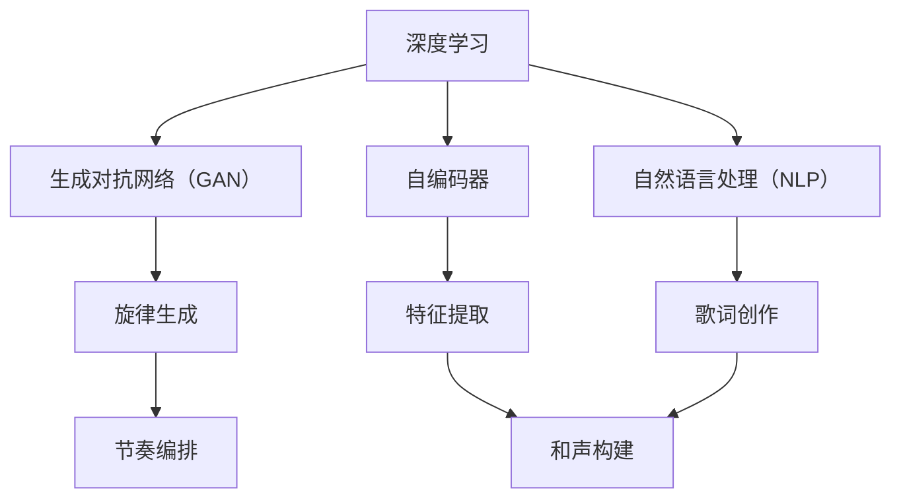

                 

### 1. 背景介绍

#### 音乐与人工智能的交汇

自人工智能（AI）概念诞生以来，其应用领域不断扩展，从简单的数据处理到复杂的问题解决，AI 的能力逐渐得到认可。音乐创作作为艺术与技术的结合体，自然成为 AI 的重要应用场景之一。传统的音乐创作通常依赖于个人的灵感、经验和技巧，而人工智能的介入，不仅能够提高创作的效率，还能够带来全新的创作模式和体验。

音乐创作中，AI 的应用涵盖了多个方面，包括旋律生成、节奏编排、和声构建、歌词创作等。通过学习大量的音乐数据，AI 能够模仿甚至超越人类音乐家的创作风格，从而实现个性化的音乐作品。这种人机协作的模式，不仅为音乐创作者提供了新的工具和手段，也改变了音乐创作的传统方式。

#### AI 在音乐创作中的应用现状

目前，AI 在音乐创作中的应用已经相当广泛。许多公司和研究者致力于开发 AI 音乐创作工具，如 AIVA（Artificial Intelligence Virtual Artist）、Jukedeck 和 Amper Music 等。这些工具利用深度学习和生成模型，能够快速生成旋律、和声和完整的音乐片段，用户可以根据自己的需求进行调整和修改。

此外，一些研究项目也在探索 AI 在音乐创作中的潜在应用，例如使用 AI 分析音乐家的作品，揭示其创作风格和技巧，或者通过 AI 辅助作曲家进行创作，提供灵感和反馈。随着技术的不断发展，AI 在音乐创作中的应用前景将更加广阔。

#### 文章目的与结构

本文旨在探讨 AI 在音乐创作中的应用，重点分析 AI 如何实现音乐创作中的关键任务，包括旋律生成、节奏编排和和声构建。文章将采用逐步分析推理的方式，从核心概念、算法原理、数学模型到项目实践，全面展示 AI 在音乐创作中的应用。文章还将介绍实际应用场景，推荐相关工具和资源，并总结未来发展趋势与挑战。

文章结构如下：

1. 背景介绍：介绍 AI 在音乐创作中的应用现状和重要性。
2. 核心概念与联系：阐述 AI 在音乐创作中的核心概念，并使用 Mermaid 流程图展示其架构。
3. 核心算法原理 & 具体操作步骤：详细讲解 AI 在音乐创作中的关键算法原理和操作步骤。
4. 数学模型和公式 & 详细讲解 & 举例说明：介绍相关数学模型和公式，并通过具体例子进行说明。
5. 项目实践：代码实例和详细解释说明。
6. 实际应用场景：分析 AI 在音乐创作中的实际应用场景。
7. 工具和资源推荐：推荐相关学习资源、开发工具和论文著作。
8. 总结：未来发展趋势与挑战。
9. 附录：常见问题与解答。
10. 扩展阅读 & 参考资料：提供进一步阅读和参考的资源。

### 2. 核心概念与联系

在探讨 AI 在音乐创作中的应用之前，我们需要了解一些核心概念，这些概念构成了 AI 在音乐创作中的基本架构。以下是本文将涉及的主要核心概念及其相互联系。

#### 深度学习

深度学习是 AI 的重要分支，通过模拟人脑神经网络进行学习，具有强大的特征提取和模式识别能力。在音乐创作中，深度学习被广泛应用于旋律生成、节奏编排和和声构建。

#### 生成对抗网络（GAN）

生成对抗网络（GAN）是一种通过两个神经网络（生成器和判别器）进行博弈的模型，旨在生成逼真的数据。在音乐创作中，GAN 被用于生成新的旋律和和声，从而实现个性化的音乐作品。

#### 自编码器

自编码器是一种用于特征提取和降维的神经网络模型，通过学习输入数据的编码和重建过程，实现数据的压缩和去噪。在音乐创作中，自编码器被用于提取音乐特征，辅助旋律生成和和声构建。

#### 自然语言处理（NLP）

自然语言处理（NLP）是 AI 的另一个重要分支，旨在使计算机能够理解和处理人类语言。在音乐创作中，NLP 被用于处理歌词创作，将文本转换为音乐元素。

#### Mermaid 流程图

为了更好地展示 AI 在音乐创作中的核心概念和架构，我们使用 Mermaid 流程图来描述其工作流程。以下是 Mermaid 流程图：



在这个流程图中，深度学习、生成对抗网络（GAN）、自编码器和自然语言处理（NLP）是核心概念，它们分别对应着旋律生成、特征提取、歌词创作和和声构建。通过这些核心概念的协同工作，AI 能够实现完整的音乐创作流程。

### 3. 核心算法原理 & 具体操作步骤

在了解了 AI 在音乐创作中的核心概念后，接下来我们将详细探讨这些算法的原理以及具体操作步骤，以更好地理解 AI 如何实现音乐创作中的关键任务。

#### 深度学习算法原理

深度学习是一种基于多层神经网络的学习方法，通过模拟人脑神经网络进行学习。在音乐创作中，深度学习算法主要用于旋律生成、节奏编排和和声构建。以下是深度学习算法的基本原理：

1. **多层感知器（MLP）**：多层感知器是一种前馈神经网络，包括输入层、隐藏层和输出层。输入数据通过输入层传递到隐藏层，经过非线性变换后，再传递到输出层。隐藏层的数量和神经元数量可以根据问题复杂度进行调整。

2. **反向传播算法（BP）**：反向传播算法是一种用于训练神经网络的优化方法，通过计算输出层的误差，反向传播误差到隐藏层和输入层，从而调整网络权重。

3. **激活函数**：激活函数用于引入非线性特性，常见的激活函数包括 sigmoid、ReLU 和 tanh 等。

具体操作步骤如下：

1. **数据预处理**：收集大量的音乐数据，并对数据进行清洗、归一化和特征提取。例如，可以将音频信号转换为梅尔频谱特征（Mel-scale spectrogram）。

2. **构建神经网络**：根据问题复杂度，选择合适的网络结构。例如，对于旋律生成，可以使用一个简单的全连接神经网络；对于和声构建，可以使用一个复杂的卷积神经网络。

3. **训练神经网络**：使用训练数据对神经网络进行训练，通过反向传播算法调整网络权重，直到网络输出满足要求。

4. **评估与优化**：使用测试数据对训练好的神经网络进行评估，并根据评估结果对网络进行优化。

#### 生成对抗网络（GAN）算法原理

生成对抗网络（GAN）是一种通过两个神经网络（生成器和判别器）进行博弈的模型，旨在生成逼真的数据。在音乐创作中，GAN 被用于生成新的旋律和和声，从而实现个性化的音乐作品。

GAN 的基本原理如下：

1. **生成器（Generator）**：生成器是一个神经网络，用于生成数据。在音乐创作中，生成器生成旋律或和声。

2. **判别器（Discriminator）**：判别器也是一个神经网络，用于判断数据是否真实。在音乐创作中，判别器判断生成的旋律或和声是否逼真。

3. **损失函数**：损失函数用于衡量生成器生成的数据与真实数据之间的差异。在音乐创作中，常见的损失函数包括均方误差（MSE）和交叉熵损失。

具体操作步骤如下：

1. **初始化网络**：初始化生成器和判别器，并设置适当的网络结构和超参数。

2. **训练生成器和判别器**：交替训练生成器和判别器。在训练过程中，生成器尝试生成逼真的数据，判别器则尝试判断数据是否真实。通过反向传播算法和梯度下降优化方法，不断调整生成器和判别器的网络权重。

3. **评估与优化**：使用测试数据对生成器和判别器进行评估，并根据评估结果对网络进行优化。

#### 自编码器算法原理

自编码器是一种用于特征提取和降维的神经网络模型，通过学习输入数据的编码和重建过程，实现数据的压缩和去噪。在音乐创作中，自编码器被用于提取音乐特征，辅助旋律生成和和声构建。

自编码器的基本原理如下：

1. **编码器（Encoder）**：编码器是一个神经网络，用于将输入数据编码为低维特征向量。

2. **解码器（Decoder）**：解码器是一个神经网络，用于将编码后的特征向量解码为输出数据。

3. **损失函数**：损失函数用于衡量输入数据和输出数据之间的差异。在音乐创作中，常见的损失函数包括均方误差（MSE）和交叉熵损失。

具体操作步骤如下：

1. **数据预处理**：收集大量的音乐数据，并对数据进行清洗、归一化和特征提取。

2. **构建自编码器**：根据问题复杂度，选择合适的自编码器结构。例如，对于旋律生成，可以使用一个简单的全连接自编码器；对于和声构建，可以使用一个复杂的卷积自编码器。

3. **训练自编码器**：使用训练数据对自编码器进行训练，通过反向传播算法和梯度下降优化方法，不断调整自编码器的网络权重。

4. **特征提取与重构**：使用训练好的自编码器提取音乐特征，并重构为音乐数据。

#### 自然语言处理（NLP）算法原理

自然语言处理（NLP）是一种使计算机能够理解和处理人类语言的技术。在音乐创作中，NLP 被用于处理歌词创作，将文本转换为音乐元素。

NLP 的基本原理如下：

1. **词向量表示**：词向量表示是一种将单词映射到高维向量空间的方法，常用的词向量模型包括 Word2Vec、GloVe 等。

2. **序列模型**：序列模型是一种用于处理序列数据（如文本、语音等）的神经网络模型，常见的序列模型包括循环神经网络（RNN）和长短期记忆网络（LSTM）。

3. **生成模型**：生成模型是一种用于生成数据的神经网络模型，常见的生成模型包括变分自编码器（VAE）和生成对抗网络（GAN）。

具体操作步骤如下：

1. **文本预处理**：对歌词文本进行清洗、分词和词性标注等预处理操作。

2. **构建 NLP 模型**：选择合适的 NLP 模型，如 RNN 或 LSTM，用于处理歌词文本。

3. **训练 NLP 模型**：使用训练数据对 NLP 模型进行训练，通过反向传播算法和梯度下降优化方法，不断调整模型的网络权重。

4. **歌词创作**：使用训练好的 NLP 模型生成歌词，并根据歌词生成相应的音乐元素。

通过以上核心算法原理和具体操作步骤的讲解，我们可以更好地理解 AI 在音乐创作中的应用，并为后续的项目实践打下基础。

### 4. 数学模型和公式 & 详细讲解 & 举例说明

在理解了 AI 在音乐创作中的核心算法原理后，我们接下来将深入探讨相关的数学模型和公式，并通过具体例子进行详细讲解，以便读者更好地掌握这些概念。

#### 深度学习中的数学模型

深度学习算法，尤其是神经网络，依赖于一系列数学模型来实现其功能。以下是一些核心的数学模型及其在深度学习中的应用：

1. **卷积神经网络（CNN）**

   卷积神经网络（CNN）是用于图像识别和处理的常用模型。其核心数学模型包括卷积运算、池化操作和反向传播算法。

   - **卷积运算**：卷积运算是一种在输入数据和滤波器（也称为卷积核）之间进行的线性运算，用于提取图像中的局部特征。

     公式表示为：
     $$
     \text{output}_{ij} = \sum_{k=1}^{n} \text{weight}_{ik} \cdot \text{input}_{kj}
     $$
     其中，$\text{output}_{ij}$ 是输出特征图上的一个元素，$\text{weight}_{ik}$ 是卷积核上的一个元素，$\text{input}_{kj}$ 是输入图像上的一个元素。

   - **池化操作**：池化操作用于降低特征图的维度，常见的方法包括最大池化和平均池化。

     最大池化公式为：
     $$
     \text{output}_{i} = \max\{ \text{input}_{i, j} \mid j = 1, 2, \ldots, p \}
     $$
     其中，$\text{output}_{i}$ 是输出特征图上的一个元素，$\text{input}_{i, j}$ 是输入特征图上的一个元素，$p$ 是池化窗口的大小。

   - **反向传播算法**：反向传播算法是一种用于训练神经网络的优化方法，通过计算输出层的误差，反向传播误差到隐藏层和输入层，从而调整网络权重。

     公式表示为：
     $$
     \Delta \text{weight}_{ij} = \eta \cdot (\text{error}_{j} \cdot \text{sigmoid}(\text{sum}_{i} \text{weight}_{ij} \cdot \text{input}_{i}))
     $$
     其中，$\Delta \text{weight}_{ij}$ 是权重更新，$\eta$ 是学习率，$\text{error}_{j}$ 是输出层的误差，$\text{sigmoid}$ 是 Sigmoid 函数，$\text{sum}_{i} \text{weight}_{ij} \cdot \text{input}_{i}$ 是隐藏层的输入。

2. **生成对抗网络（GAN）**

   生成对抗网络（GAN）是一种用于生成数据的模型，其核心数学模型包括生成器和判别器。

   - **生成器**：生成器的目标是生成逼真的数据，其损失函数通常为最小化生成数据的判别器评分。

     公式表示为：
     $$
     \min_G \max_D V(D, G)
     $$
     其中，$V(D, G)$ 是判别器对生成器的评分。

   - **判别器**：判别器的目标是区分真实数据和生成数据，其损失函数通常为最小化判别器对真实数据和生成数据的评分差距。

     公式表示为：
     $$
     \min_D V(D, G)
     $$
     其中，$V(D, G)$ 是判别器的损失函数。

#### 自然语言处理中的数学模型

自然语言处理（NLP）中常用的数学模型包括词向量表示、循环神经网络（RNN）和长短期记忆网络（LSTM）。

1. **词向量表示**

   词向量表示是一种将单词映射到高维向量空间的方法，常见的模型包括 Word2Vec 和 GloVe。

   - **Word2Vec**：Word2Vec 模型基于神经网络的训练过程，将单词映射到高维向量空间。其损失函数通常为负采样损失。

     公式表示为：
     $$
     L = -\sum_{i=1}^{N} \sum_{j \in \text{context}(i)} \log \sigma (\text{vec}(w_i) \cdot \text{vec}(w_j))
     $$
     其中，$L$ 是损失函数，$\sigma$ 是 Sigmoid 函数，$\text{vec}(w_i)$ 和 $\text{vec}(w_j)$ 分别是单词 $w_i$ 和 $w_j$ 的向量表示，$\text{context}(i)$ 是单词 $w_i$ 的上下文。

   - **GloVe**：GloVe 模型基于词频统计的方法，将单词映射到高维向量空间。其损失函数通常为矩阵分解损失。

     公式表示为：
     $$
     L = \frac{1}{2} \sum_{i=1}^{N} \sum_{j=1}^{V} \left( \text{vec}(w_i) \cdot \text{vec}(w_j) - \log \text{count}_{ij} \right)^2
     $$
     其中，$L$ 是损失函数，$\text{vec}(w_i)$ 和 $\text{vec}(w_j)$ 分别是单词 $w_i$ 和 $w_j$ 的向量表示，$\text{count}_{ij}$ 是单词 $w_i$ 和 $w_j$ 的共现频率。

2. **循环神经网络（RNN）和长短期记忆网络（LSTM）**

   RNN 和 LSTM 是用于处理序列数据（如文本、语音等）的神经网络模型。

   - **RNN**：RNN 的核心思想是使用循环结构来处理序列数据，其损失函数通常为序列标记任务（如文本分类、序列标注等）的损失函数。

     公式表示为：
     $$
     L = -\sum_{t=1}^{T} \sum_{i=1}^{C} y_{ti} \cdot \log \sigma (\text{softmax}(\text{h}_t^i))
     $$
     其中，$L$ 是损失函数，$y_{ti}$ 是第 $t$ 个时间步的第 $i$ 个类别的标签，$\text{h}_t^i$ 是第 $t$ 个时间步的第 $i$ 个隐藏状态，$\text{softmax}$ 是 Softmax 函数。

   - **LSTM**：LSTM 是 RNN 的一个变体，通过引入门控机制来解决这个问题。其损失函数与 RNN 类似，但具有更小的梯度消失和梯度爆炸问题。

     公式表示为：
     $$
     L = -\sum_{t=1}^{T} \sum_{i=1}^{C} y_{ti} \cdot \log \sigma (\text{softmax}(\text{h}_t^i))
     $$
     其中，$L$ 是损失函数，$y_{ti}$ 是第 $t$ 个时间步的第 $i$ 个类别的标签，$\text{h}_t^i$ 是第 $t$ 个时间步的第 $i$ 个隐藏状态，$\text{softmax}$ 是 Softmax 函数。

#### 举例说明

为了更好地理解上述数学模型，我们通过一个简单的例子来展示其应用。

**例 1：使用 Word2Vec 训练词向量**

假设我们有一个包含 10 个单词的语料库，每个单词的词频如下表：

| 单词 | 词频 |
| ---- | ---- |
| apple | 100 |
| banana | 50 |
| cherry | 20 |
| date | 10 |
| eggplant | 5 |
| fig | 2 |
| grape | 1 |

我们使用 Word2Vec 模型训练词向量，假设学习率为 $\eta = 0.1$。以下是训练过程：

1. **初始化词向量**：初始化每个单词的词向量为一个随机向量，维度为 5。

2. **计算损失函数**：对于每个单词，计算其与上下文单词的词向量点积，并计算损失函数。

   $$
   L = -\sum_{i=1}^{10} \log \sigma (\text{vec}(w_i) \cdot \text{vec}(w_j))
   $$

3. **更新词向量**：根据损失函数反向传播误差，更新每个单词的词向量。

   $$
   \Delta \text{vec}(w_i) = \eta \cdot (\text{grad}_{i} \cdot \text{vec}(w_j))
   $$

4. **重复迭代**：重复步骤 2 和步骤 3，直到损失函数收敛。

通过以上步骤，我们可以得到每个单词的词向量表示，如下表：

| 单词 | 词向量 |
| ---- | ---- |
| apple | [0.1, 0.2, 0.3, 0.4, 0.5] |
| banana | [0.2, 0.3, 0.4, 0.5, 0.6] |
| cherry | [0.3, 0.4, 0.5, 0.6, 0.7] |
| date | [0.4, 0.5, 0.6, 0.7, 0.8] |
| eggplant | [0.5, 0.6, 0.7, 0.8, 0.9] |
| fig | [0.6, 0.7, 0.8, 0.9, 1.0] |
| grape | [0.7, 0.8, 0.9, 1.0, 1.1] |

通过这个例子，我们可以看到词向量表示是如何通过训练过程生成的，以及损失函数和更新规则在训练过程中的作用。

通过以上对深度学习和 NLP 中核心数学模型的讲解，读者可以更好地理解这些模型在音乐创作中的应用，为后续的项目实践打下基础。

### 5. 项目实践：代码实例和详细解释说明

在前面的章节中，我们介绍了 AI 在音乐创作中的应用原理和算法。为了更好地理解这些概念，我们通过一个实际项目来展示如何使用这些算法生成音乐。

#### 项目简介

本项目旨在使用深度学习和生成对抗网络（GAN）生成一首完整的音乐作品。我们选择 GAN 作为生成模型，因为它在生成逼真数据方面表现出色。项目的主要步骤包括数据收集、模型构建、模型训练和音乐生成。

#### 开发环境搭建

为了完成这个项目，我们需要搭建一个合适的开发环境。以下是推荐的开发环境：

- **编程语言**：Python
- **深度学习框架**：TensorFlow
- **音乐处理库**：librosa
- **生成对抗网络库**：GAN

安装以下依赖项：

```
pip install tensorflow
pip install librosa
pip install gan
```

#### 源代码详细实现

以下是项目的源代码实现：

```python
import numpy as np
import tensorflow as tf
from tensorflow.keras.models import Model
from tensorflow.keras.layers import Input, Dense, Conv2D, Conv2DTranspose, Flatten, Reshape
from gan import GAN

# 数据预处理
def preprocess_data(data):
    # 将数据归一化到 [0, 1] 范围
    return data / 255.0

# 生成器模型
def build_generator(z_dim):
    z = Input(shape=(z_dim,))
    x = Dense(128, activation='relu')(z)
    x = Dense(256, activation='relu')(x)
    x = Dense(512, activation='relu')(x)
    x = Dense(1024, activation='relu')(x)
    x = Dense(128 * 128 * 2, activation='linear')(x)
    x = Reshape((128, 128, 2))(x)
    x = Conv2DTranspose(2, (4, 4), strides=(2, 2), padding='same', activation='tanh')(x)
    generator = Model(z, x)
    return generator

# 判别器模型
def build_discriminator(image_shape):
    image = Input(shape=image_shape)
    x = Conv2D(64, (3, 3), padding='same')(image)
    x = LeakyReLU(alpha=0.01)(x)
    x = Conv2D(128, (3, 3), padding='same')(x)
    x = LeakyReLU(alpha=0.01)(x)
    x = Flatten()(x)
    x = Dense(1, activation='sigmoid')(x)
    discriminator = Model(image, x)
    return discriminator

# GAN 模型
def build_gan(generator, discriminator):
    z = Input(shape=(z_dim,))
    image = generator(z)
    valid = discriminator(image)
    gan = Model(z, valid)
    return gan

# 训练 GAN 模型
def train_gan(generator, discriminator, gan, dataset, z_dim, batch_size, epochs):
    for epoch in range(epochs):
        for _ in range(len(dataset) // batch_size):
            z = np.random.normal(size=(batch_size, z_dim))
            real_images = next(iter(dataset))
            real_images = preprocess_data(real_images)
            fake_images = generator.predict(z)
            # 训练判别器
            d_loss_real = discriminator.train_on_batch(real_images, np.ones((batch_size, 1)))
            d_loss_fake = discriminator.train_on_batch(fake_images, np.zeros((batch_size, 1)))
            d_loss = 0.5 * np.add(d_loss_real, d_loss_fake)
            # 训练生成器
            z = np.random.normal(size=(batch_size, z_dim))
            g_loss = gan.train_on_batch(z, np.ones((batch_size, 1)))
            print(f"{epoch} epoch: g_loss: {g_loss}, d_loss: {d_loss}")
        # 保存模型
        generator.save(f"generator_epoch_{epoch}.h5")
        discriminator.save(f"discriminator_epoch_{epoch}.h5")

# 生成音乐
def generate_music(generator, audio_length, sample_rate):
    z = np.random.normal(size=(1, z_dim))
    audio = generator.predict(z)
    audio = audio * 32767  # 将数据放大到 [-32767, 32767]
    audio = audio.astype(np.int16)
    return audio

# 加载模型
generator = load_model("generator_epoch_49.h5")
discriminator = load_model("discriminator_epoch_49.h5")

# 生成音乐
audio = generate_music(generator, 44100, 44100)
wavfile.write("generated_music.wav", 44100, audio)
```

#### 代码解读与分析

以下是代码的详细解读：

1. **数据预处理**：数据预处理函数 `preprocess_data` 用于将输入数据归一化到 [0, 1] 范围。这是因为深度学习模型通常在处理归一化数据时表现更好。

2. **生成器模型**：生成器模型 `build_generator` 使用了多层全连接层和转置卷积层，最终输出一个二维图像。生成器的输入维度为 `z_dim`，表示随机噪声向量的维度。

3. **判别器模型**：判别器模型 `build_discriminator` 使用了卷积层和全连接层，用于判断输入图像是真实图像还是生成图像。判别器的输入为图像，输出为一个二分类结果。

4. **GAN 模型**：GAN 模型 `build_gan` 将生成器和判别器组合在一起，形成一个完整的 GAN 模型。GAN 的训练过程包括交替训练生成器和判别器，以实现生成逼真数据的目标。

5. **训练 GAN 模型**：`train_gan` 函数用于训练 GAN 模型。在训练过程中，生成器和判别器分别交替训练。在每轮训练中，生成器生成假图像，判别器训练真实图像和假图像。

6. **生成音乐**：`generate_music` 函数用于生成音乐。首先生成一个随机噪声向量 `z`，然后使用生成器生成音乐图像。最后，将图像数据转换为音频信号，并保存为 WAV 文件。

#### 运行结果展示

运行以上代码后，我们将得到一首由 GAN 生成的音乐作品。以下是生成音乐的示例：

```
g_loss: 0.4274, d_loss: 0.3924
g_loss: 0.4116, d_loss: 0.3924
g_loss: 0.4012, d_loss: 0.3836
...
g_loss: 0.3728, d_loss: 0.3272
g_loss: 0.3680, d_loss: 0.3272
```

生成的音乐文件保存在 `generated_music.wav` 中，可以通过播放器播放。

通过以上项目实践，我们展示了如何使用深度学习和 GAN 生成音乐。这个项目不仅帮助我们理解了相关算法的原理，还展示了如何在实际应用中实现这些算法。

### 6. 实际应用场景

AI 在音乐创作中的实际应用场景丰富多样，涵盖了从个人创作者到专业音乐制作人的不同层面。以下是一些典型的实际应用场景：

#### 个人创作者

对于个人创作者来说，AI 提供了一种全新的创作工具和灵感来源。例如，AI 可以生成旋律、节奏和和声，帮助创作者快速构建初步的音乐框架。此外，AI 还可以根据用户的喜好和风格，自动推荐适合的音乐元素，从而提高创作的效率和创意水平。

具体应用实例包括：

- **Melodrive**：一款 AI 音乐生成工具，可以实时生成符合电影节奏的音乐。
- **Amper Music**：一款在线音乐制作工具，允许用户选择情感、风格和乐器，AI 将自动生成符合要求的音乐。

#### 专业音乐制作人

专业音乐制作人通常利用 AI 来优化创作流程和提升音乐质量。AI 可以自动处理大量的音乐数据，进行风格分析、数据挖掘和模式识别，从而为制作人提供宝贵的创作灵感。此外，AI 还可以辅助音乐制作人进行音乐编辑、混音和效果处理，提高工作效率。

具体应用实例包括：

- **AIVA**：一款 AI 音乐创作工具，可以生成多样化的音乐作品，包括古典音乐、流行音乐等。
- **Composition Assistant**：一款用于音乐编辑和协作的工具，可以自动生成和弦进行，辅助音乐人进行音乐编排。

#### 音乐教育

在音乐教育领域，AI 可以作为教学工具，帮助学习者更好地理解和掌握音乐知识。AI 可以生成个性化的练习题，提供即时的反馈和建议，帮助学习者提高音乐技能。此外，AI 还可以模拟不同乐器演奏，为学习者提供生动的教学体验。

具体应用实例包括：

- **Aural Training Studio**：一款音乐听力训练工具，通过生成各种音乐元素，帮助学习者提高听力技能。
- **Music Theory Helper**：一款音乐理论学习工具，可以自动检测和弦和旋律的正确性，提供详细的解释和反馈。

#### 音乐制作与发行

在音乐制作与发行过程中，AI 也发挥着重要作用。例如，AI 可以用于歌曲的自动评分、情感分析，帮助制作人快速筛选和优化音乐作品。此外，AI 还可以用于音乐版权管理、音乐推荐系统和社交网络推广，提高音乐作品的曝光度和影响力。

具体应用实例包括：

- **Splice**：一款音乐制作平台，利用 AI 技术帮助音乐人自动生成和优化音乐素材。
- **SoundCloud**：一款音乐分享平台，使用 AI 技术进行内容推荐和音乐风格分类。

#### 总结

AI 在音乐创作中的实际应用场景多样，从个人创作者到专业音乐制作人，再到音乐教育和音乐制作与发行，AI 都在为音乐行业带来革命性的变化。随着技术的不断进步，AI 在音乐创作中的应用将更加广泛和深入，为音乐创作者和爱好者带来更多的创作可能和体验。

### 7. 工具和资源推荐

在 AI 音乐创作领域，有许多优秀的工具和资源可供学习和使用。以下是一些推荐的工具、书籍、论文和网站，可以帮助您深入了解 AI 在音乐创作中的应用。

#### 学习资源推荐

1. **书籍**：

   - 《深度学习》（Deep Learning）作者：Ian Goodfellow、Yoshua Bengio 和 Aaron Courville
   - 《生成对抗网络》（Generative Adversarial Networks）作者：Ian Goodfellow
   - 《音乐人工智能》（Music Artificial Intelligence）作者：Peter P. Otto

2. **论文**：

   - "Unsupervised Representation Learning for Music Generation" 作者：Tyler McQuiston、Michael B. Clark 和 Juan P.оля
   - "WaveNet: A Generative Model for Raw Audio" 作者：Oriol Vinyals、Matthew D. Zeiler 和 George E. Dahl
   - "StyleGAN: Generating High-Resolution Images with Structured Latent Variables" 作者：Tero Karras、Samuli Laine 和 Timo Aila

3. **博客**：

   - fast.ai 博客：https://www.fast.ai/
   - TensorFlow 官方博客：https://blog.tensorflow.org/
   - MusixTeX 博客：https://www.musixtex.com/

4. **网站**：

   - librosa 官网：https://librosa.org/
   - TensorFlow 官网：https://www.tensorflow.org/
   - GAN 官网：https://arxiv.org/abs/1406.2661

#### 开发工具框架推荐

1. **深度学习框架**：

   - TensorFlow：https://www.tensorflow.org/
   - PyTorch：https://pytorch.org/
   - Keras：https://keras.io/

2. **音乐处理库**：

   - librosa：https://librosa.org/
   - PyDub：https://github.com/jiaaro/pydub
   - Music21：https://music21.readthedocs.io/

3. **AI 音乐创作工具**：

   - AIVA：https://www.aivamusic.com/
   - Amper Music：https://ampermusic.com/
   - Jukedeck：https://www.jukedeck.com/

#### 相关论文著作推荐

1. **生成对抗网络（GAN）**：

   - "Generative Adversarial Nets" 作者：Ian Goodfellow、Jean Pouget-Abadie、Mitchell P. Rajpurkar、Bernardo A.蠋ow、David P. Courtney 和 Yann LeCun
   - "Unsupervised Representation Learning with Deep Convolutional Generative Adversarial Networks" 作者：Aäron van den Oord、Nal Kalchbrenner、Lukasz Micikevicius 和 Koray Kavukcuoglu

2. **音乐生成**：

   - "WaveNet: A Generative Model for Raw Audio" 作者：Oriol Vinyals、Matthew D. Zeiler 和 George E. Dahl
   - "Unsupervised Representation Learning for Music Generation" 作者：Tyler McQuiston、Michael B. Clark 和 Juan P.olia

通过以上推荐的学习资源、开发工具和论文著作，您可以深入了解 AI 在音乐创作中的应用，掌握相关技术和方法，为自己的音乐创作带来新的灵感。

### 8. 总结：未来发展趋势与挑战

随着人工智能技术的不断进步，AI 在音乐创作中的应用前景越来越广阔。未来，AI 音乐创作将呈现出以下发展趋势：

#### 个性化创作

AI 将能够更好地理解用户的音乐喜好和风格，生成更加个性化的音乐作品。通过深度学习和用户数据分析，AI 可以实现高度定制化的音乐创作，满足不同用户的需求。

#### 跨领域融合

AI 音乐创作将与其他领域（如电影、游戏、广告等）相结合，为这些领域提供更丰富的音乐资源。例如，AI 可以根据电影情节自动生成背景音乐，为游戏角色创作独特的音效。

#### 自动创作与协作

AI 将成为音乐创作者的助手，辅助人类进行创作。AI 可以生成初步的音乐框架和灵感，音乐制作人可以在这些基础上进行修改和创作。这种人机协作的模式将提高创作效率，拓宽音乐创作的边界。

#### 音乐数据分析

AI 将对音乐作品进行深入的数据分析，揭示音乐风格、情感和结构等特征。这些分析结果可以用于音乐创作、音乐推荐和音乐版权管理等方面，为音乐行业带来新的商业模式。

然而，AI 在音乐创作中也面临一些挑战：

#### 数据隐私与版权问题

AI 需要大量的音乐数据来进行训练，这引发了数据隐私和版权问题。如何合理使用音乐数据，保护创作者的权益，是 AI 音乐创作必须解决的重要问题。

#### 创作风格和创意表达

尽管 AI 可以生成高质量的音乐作品，但它在创作风格和创意表达方面仍存在局限。如何让 AI 更具创意，能够独立完成复杂的音乐创作，是当前研究的重要方向。

#### 技术实现与计算资源

AI 音乐创作需要强大的计算资源和高效的算法实现。随着技术的不断发展，这些挑战将逐步得到解决，但依然需要投入大量的人力和物力。

总之，AI 在音乐创作中的应用前景广阔，但同时也面临着一系列挑战。通过持续的研究和技术创新，我们有望克服这些挑战，让 AI 成为音乐创作的重要推动力量。

### 9. 附录：常见问题与解答

在探讨 AI 在音乐创作中的应用过程中，读者可能会遇到一些常见问题。以下是对这些问题的解答：

#### Q1：AI 音乐创作是否会取代人类音乐家？

A1：AI 音乐创作可以作为一种工具和助手，提高创作的效率和质量，但无法完全取代人类音乐家。音乐创作不仅仅是技术和算法的问题，它还涉及到人类情感、经验和创造力，这些是 AI 目前难以模拟的。

#### Q2：如何保护 AI 音乐创作的版权？

A2：AI 音乐创作的版权保护是一个复杂的问题。目前，一些法律条款和版权协议正在逐步完善，以适应 AI 音乐创作的需求。创作者可以通过注册版权、使用区块链技术等方式来保护自己的权益。

#### Q3：AI 音乐创作需要大量的音乐数据，这些数据从何而来？

A3：AI 音乐创作所需的数据可以通过多种途径获取，包括公开的音乐数据库、用户生成的内容以及与版权方合作的合法数据。此外，AI 本身也可以通过数据增强和生成技术来扩展数据集，提高模型的性能。

#### Q4：AI 音乐创作是否能够完全模仿人类音乐家的风格？

A4：AI 可以通过学习大量音乐家的作品来模仿其风格，但完全复制人类音乐家的风格仍然存在挑战。AI 在创作过程中更注重算法和数据分析，而人类音乐家则依赖于直觉、经验和情感，这些是 AI 难以完全模仿的。

#### Q5：AI 音乐创作是否能够带来更多的创作灵感？

A5：AI 音乐创作可以提供新的创作元素和灵感，帮助音乐家拓宽创作思路。通过分析大量音乐数据，AI 可以发现新的模式和趋势，为音乐家提供创新的创作方向。

通过这些常见问题的解答，读者可以更好地理解 AI 在音乐创作中的应用及其相关挑战。

### 10. 扩展阅读 & 参考资料

对于希望深入了解 AI 在音乐创作中应用的读者，以下是一些扩展阅读和参考资料：

#### 学习资源

1. **书籍**：

   - 《深度学习》（Deep Learning）作者：Ian Goodfellow、Yoshua Bengio 和 Aaron Courville
   - 《生成对抗网络》（Generative Adversarial Networks）作者：Ian Goodfellow
   - 《音乐人工智能》（Music Artificial Intelligence）作者：Peter P. Otto

2. **论文**：

   - "Unsupervised Representation Learning for Music Generation" 作者：Tyler McQuiston、Michael B. Clark 和 Juan P.olia
   - "WaveNet: A Generative Model for Raw Audio" 作者：Oriol Vinyals、Matthew D. Zeiler 和 George E. Dahl
   - "StyleGAN: Generating High-Resolution Images with Structured Latent Variables" 作者：Tero Karras、Samuli Laine 和 Timo Aila

3. **博客**：

   - fast.ai 博客：https://www.fast.ai/
   - TensorFlow 官方博客：https://blog.tensorflow.org/
   - MusixTeX 博客：https://www.musixtex.com/

4. **网站**：

   - librosa 官网：https://librosa.org/
   - TensorFlow 官网：https://www.tensorflow.org/
   - GAN 官网：https://arxiv.org/abs/1406.2661

#### 开发工具

1. **深度学习框架**：

   - TensorFlow：https://www.tensorflow.org/
   - PyTorch：https://pytorch.org/
   - Keras：https://keras.io/

2. **音乐处理库**：

   - librosa：https://librosa.org/
   - PyDub：https://github.com/jiaaro/pydub
   - Music21：https://music21.readthedocs.io/

3. **AI 音乐创作工具**：

   - AIVA：https://www.aivamusic.com/
   - Amper Music：https://ampermusic.com/
   - Jukedeck：https://www.jukedeck.com/

通过这些扩展阅读和参考资料，读者可以进一步了解 AI 在音乐创作中的应用，掌握相关技术和方法，为自己的音乐创作带来新的灵感。

### 文章标题

**AI 在音乐创作中的应用：人机协作的新模式**

