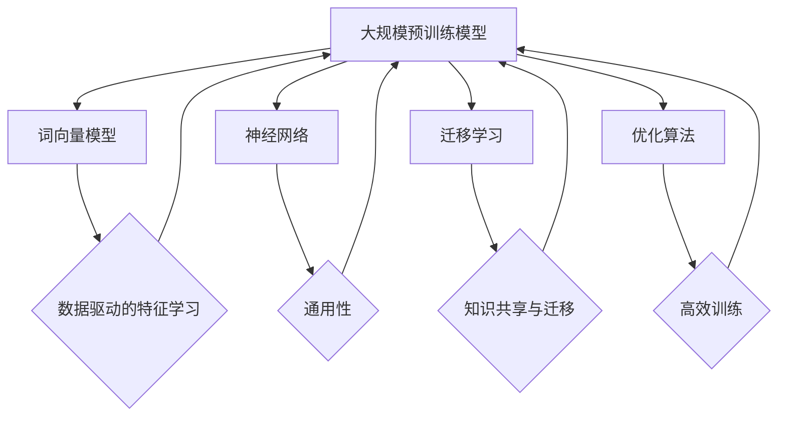

                 

### 背景介绍

近年来，随着人工智能技术的飞速发展，尤其是大规模预训练模型（Large-scale Pretrained Models）的出现，AI领域迎来了前所未有的机遇与挑战。这些大规模预训练模型，如Google的BERT、OpenAI的GPT-3、以及微软的Turing Model，已经展示了在自然语言处理（NLP）、图像识别、语音识别等多个领域的卓越性能。

然而，这些大型模型的训练和部署不仅需要海量数据和强大计算资源，还涉及复杂的算法和工程挑战。在这个背景下，AI大模型创业逐渐成为一种热门的趋势。创业公司通过研发和优化这些大型模型，不仅能够为各行各业带来革命性的技术变革，同时也能开辟出新的商业模式和市场空间。

本文旨在探讨AI大模型创业的现状与未来，从以下几个方面展开讨论：

1. **AI大模型创业的现状**：分析当前AI大模型创业的主要驱动因素、市场趋势以及面临的挑战。
2. **核心概念与联系**：介绍AI大模型的基础概念、关键技术以及与现有技术的联系。
3. **核心算法原理与具体操作步骤**：深入探讨AI大模型的训练算法、评估方法以及优化策略。
4. **数学模型与公式**：讲解AI大模型中的数学基础，包括损失函数、优化算法等相关内容。
5. **项目实践**：通过实例展示如何开发一个AI大模型项目，包括环境搭建、代码实现、运行结果分析等。
6. **实际应用场景**：探讨AI大模型在不同行业中的应用场景及其带来的影响。
7. **工具和资源推荐**：为AI大模型创业提供相关的学习资源、开发工具和框架。
8. **总结与展望**：总结AI大模型创业的现状与挑战，并对未来的发展趋势进行展望。

通过本文的逐步分析，我们将深入了解AI大模型创业的各个方面，为其提供有价值的指导和参考。

### 核心概念与联系

#### 大规模预训练模型的基本概念

大规模预训练模型（Large-scale Pretrained Models）是指通过在海量数据集上进行预训练，使得模型能够具备一定的通用性和迁移能力。这一概念的核心在于“预训练”和“大规模”两个方面。

首先，预训练（Pre-training）是指模型在特定任务之前，使用大规模的未标注数据对模型进行训练。这种方式可以使模型在学习特定任务之前，先获取一些通用的特征表示。例如，在自然语言处理领域，预训练模型可以在大量文本数据上学习词向量和上下文表示，从而为后续的文本分类、情感分析等任务提供坚实的基础。

其次，大规模（Large-scale）指的是预训练模型所需的训练数据量和计算资源。传统模型往往在有限的数据集上进行训练，而大规模预训练模型则依赖于数百万到数十亿级别的数据集，这要求不仅要有丰富的数据资源，还要有强大的计算能力。比如，BERT模型训练所使用的数据集包括维基百科、新闻文章、书籍等多种类型的数据，总数据量达到了数百万篇文章。

大规模预训练模型的基本原理可以概括为以下几点：

1. **数据驱动的特征学习**：通过预训练，模型能够在大规模数据中自动学习到丰富的特征表示。
2. **通用性**：由于预训练是在未标注的数据上进行，模型具备了较强的通用性，可以在不同任务中表现出良好的迁移性能。
3. **并行训练**：大规模数据集使得模型可以并行训练，从而大幅提升训练效率。

#### 大规模预训练模型与现有技术的联系

大规模预训练模型并不是一个全新的概念，它是在现有技术基础上的重大创新和发展。以下是几个关键技术与大规模预训练模型的联系：

1. **词向量模型**：词向量模型（如Word2Vec）是大规模预训练模型的基础。通过将词汇映射到高维向量空间，词向量模型使得文本数据可以被机器学习模型有效处理。大规模预训练模型继承了词向量模型的思想，但进一步扩展到上下文和序列数据。

2. **神经网络**：神经网络是大规模预训练模型的核心。传统的神经网络在处理结构化数据时效果显著，但在处理非结构化的文本、图像等数据时表现有限。大规模预训练模型通过深度神经网络结构，结合大规模数据集，使得模型能够在复杂的特征空间中学习到有效的特征表示。

3. **迁移学习**：迁移学习（Transfer Learning）是大规模预训练模型的一个重要应用。通过在特定任务之前，使用预训练模型进行迁移学习，可以大幅提升模型在新任务上的性能。这种方法使得模型可以在不同任务之间共享知识和经验，从而提高整体表现。

4. **优化算法**：大规模预训练模型的训练过程涉及到大量的参数优化。传统的优化算法（如SGD、Adam等）在大规模数据集上的表现不佳，大规模预训练模型引入了如AdamW、Adafactor等优化算法，使得训练过程更加高效。

#### Mermaid 流程图表示

以下是大规模预训练模型的基本架构及其与现有技术的联系，使用Mermaid流程图进行表示：



通过上述分析，我们可以看到，大规模预训练模型不仅是在现有技术上的创新，更是对传统机器学习技术的深化和扩展。它为AI领域带来了新的契机和挑战，成为推动AI技术发展的关键力量。

### 核心算法原理 & 具体操作步骤

#### 训练算法

大规模预训练模型的核心在于其训练算法，这些算法通常包括以下几个步骤：

1. **数据预处理**：在开始训练之前，需要对数据进行预处理。这一步包括数据清洗、分词、去停用词、词干提取等操作，以确保数据的质量和一致性。数据预处理后，会将文本转化为数字序列，这一步通常使用词嵌入（Word Embedding）技术。

2. **词嵌入**：词嵌入是将词汇映射到高维向量空间的过程，目的是将文本表示为可计算的数值形式。常见的词嵌入方法包括Word2Vec、GloVe和BERT等。其中，Word2Vec方法基于点积模型，通过负采样算法生成词嵌入；GloVe方法通过全局矩阵分解优化词嵌入向量；BERT则使用双向编码器表示文本，并通过大规模预训练数据进行上下文感知的词嵌入。

3. **模型初始化**：初始化预训练模型，通常采用随机初始化或预训练模型权重初始化方法。随机初始化容易收敛，但可能导致模型不稳定；预训练模型权重初始化可以保持模型的稳定性和收敛性。

4. **前向传播与反向传播**：在训练过程中，模型会通过前向传播（Forward Propagation）计算输入数据的输出结果，然后通过反向传播（Back Propagation）计算损失函数。反向传播是一种常用的优化方法，通过梯度下降（Gradient Descent）或其变种（如Adam、RMSprop等）来调整模型参数，以最小化损失函数。

5. **训练与评估**：在训练过程中，模型会不断迭代更新参数，同时使用验证集进行评估。训练过程通常包括多个epochs，每个epoch代表模型在整个训练集上的一次遍历。通过调整学习率、批量大小和训练时间等超参数，可以优化模型的训练效果。

#### 训练步骤详解

下面是一个典型的训练步骤，详细描述了每个环节的操作：

1. **数据预处理**：首先，从互联网或公开数据集中获取文本数据，如维基百科、新闻文章等。接着，使用分词工具（如jieba、nltk等）对文本进行分词，然后去除停用词（如"的"、"和"、"是"等）。分词后的文本数据会被转化为数字序列，每个词对应一个唯一的索引。

2. **词嵌入**：接下来，选择一种词嵌入方法进行训练。以BERT为例，BERT模型使用双向编码器对文本进行表示。双向编码器通过同时考虑文本的左右上下文，生成更加丰富的词嵌入向量。BERT模型在训练过程中，不仅对词进行编码，还对字符进行编码，从而更好地捕捉文本的语义信息。

3. **模型初始化**：BERT模型通常使用预训练的模型权重进行初始化。如果是从零开始训练，可以随机初始化模型参数。在训练过程中，BERT模型会通过调整参数来优化损失函数。

4. **前向传播**：在训练过程中，对于每个训练样本，模型会通过前向传播计算输出结果。BERT模型包括多层Transformer编码器，每一层编码器都会对输入数据进行处理，生成更加复杂的特征表示。输出结果通常包括词嵌入、序列掩码、位置编码等。

5. **反向传播**：通过反向传播，模型会计算损失函数（如交叉熵损失函数），并根据损失函数的梯度来更新模型参数。反向传播过程中，模型会使用优化算法（如Adam）来调整参数，以最小化损失函数。

6. **训练与评估**：在多个epochs的迭代过程中，模型会不断更新参数，并通过验证集进行评估。通过调整学习率、批量大小和训练时间等超参数，可以优化模型的性能。最终，通过验证集的评估结果，确定最佳的模型参数。

#### 损失函数与优化算法

在训练过程中，损失函数（Loss Function）和优化算法（Optimization Algorithm）是两个关键组件。损失函数用于衡量模型的预测结果与真实结果之间的差距，优化算法则用于调整模型参数以最小化损失函数。

1. **损失函数**：

- **交叉熵损失函数**：交叉熵损失函数是最常用的损失函数之一，常用于分类任务。它的目标是最小化模型预测概率分布与真实标签分布之间的差异。交叉熵损失函数的表达式为：
  $$ L = -\sum_{i} y_i \log(p_i) $$
  其中，\( y_i \) 是真实标签，\( p_i \) 是模型预测的概率。

- **均方误差损失函数**：均方误差损失函数（Mean Squared Error，MSE）常用于回归任务，其表达式为：
  $$ L = \frac{1}{n} \sum_{i=1}^{n} (y_i - \hat{y}_i)^2 $$
  其中，\( y_i \) 是真实值，\( \hat{y}_i \) 是模型预测值。

2. **优化算法**：

- **随机梯度下降（SGD）**：随机梯度下降是最简单的优化算法，其基本思想是每次迭代都随机选择一个样本，计算该样本的梯度并更新模型参数。SGD的优点是简单和易于实现，缺点是容易陷入局部最小值和收敛速度较慢。

- **Adam优化器**：Adam优化器是SGD的变种，结合了AdaGrad和RMSprop的优点。它通过计算一阶矩估计（均值）和二阶矩估计（方差）来动态调整学习率，从而在较短时间内收敛到最优解。Adam优化器的公式为：
  $$ m_t = \beta_1 x_t + (1 - \beta_1)(x_t - m_{t-1}) $$
  $$ v_t = \beta_2 x_t^2 + (1 - \beta_2)(x_t^2 - v_{t-1}) $$
  $$ \theta_t = \theta_{t-1} - \alpha \frac{m_t}{\sqrt{v_t} + \epsilon} $$
  其中，\( \beta_1 \)、\( \beta_2 \) 分别是动量项，\( \alpha \) 是学习率，\( \epsilon \) 是一个很小的常数。

通过以上步骤，我们可以理解大规模预训练模型的核心算法原理和具体操作步骤。这些步骤不仅需要深厚的理论基础，还需要大量的实践和调试，以实现高效的模型训练和优化。在接下来的部分，我们将进一步探讨AI大模型中的数学模型和公式，为深入理解这些算法提供更多的理论基础。

### 数学模型和公式 & 详细讲解 & 举例说明

在AI大模型中，数学模型和公式是理解和实现这些模型的基础。这些模型通常涉及复杂的概率分布、优化算法以及损失函数。在本节中，我们将详细讲解这些数学模型和公式，并通过具体的例子来展示它们的应用。

#### 概率分布

在AI大模型中，概率分布是理解和预测数据的关键。最常用的概率分布包括正态分布、伯努利分布和多项式分布。

1. **正态分布**：

正态分布（Normal Distribution），也称为高斯分布，是一种最常见的连续概率分布。其概率密度函数为：

$$ f(x|\mu, \sigma^2) = \frac{1}{\sqrt{2\pi\sigma^2}} e^{-\frac{(x-\mu)^2}{2\sigma^2}} $$

其中，\( \mu \) 是均值，\( \sigma^2 \) 是方差。

**例子**：假设我们有一个数据集，其均值是10，标准差是2。我们可以使用正态分布来表示这些数据的概率分布。根据正态分布的性质，大部分数据会集中在均值附近。

2. **伯努利分布**：

伯努利分布（Bernoulli Distribution）是一种离散概率分布，它只有两个可能的取值：0和1。其概率质量函数为：

$$ P(X=1) = p, \quad P(X=0) = 1 - p $$

其中，\( p \) 是成功的概率。

**例子**：在一个简单的二分类问题中，我们可以使用伯努利分布来表示每个样本属于某个类别的概率。例如，如果一个样本属于正类别的概率是0.7，那么它属于负类别的概率就是0.3。

3. **多项式分布**：

多项式分布（Multinomial Distribution）是伯努利分布的扩展，它适用于多个分类问题。其概率质量函数为：

$$ P(X = (x_1, x_2, ..., x_k)) = \frac{n!}{x_1! x_2! ... x_k!} p_1^{x_1} p_2^{x_2} ... p_k^{x_k} $$

其中，\( n \) 是试验次数，\( x_i \) 是第 \( i \) 个分类的取值，\( p_i \) 是第 \( i \) 个分类的概率。

**例子**：在一个多项式分布的例子中，我们有一个包含3个类别的数据集，每个类别的概率分别是0.2、0.5和0.3。如果我们进行10次试验，我们可以计算每个类别出现的概率。

#### 损失函数

在机器学习中，损失函数用于评估模型的预测结果与真实结果之间的差异。最常用的损失函数包括交叉熵损失函数和均方误差损失函数。

1. **交叉熵损失函数**：

交叉熵损失函数（Cross-Entropy Loss）通常用于分类问题。其公式为：

$$ L = -\sum_{i} y_i \log(p_i) $$

其中，\( y_i \) 是真实标签，\( p_i \) 是模型预测的概率。

**例子**：假设我们有一个二分类问题，真实标签是[1, 0]，模型预测的概率是[0.6, 0.4]。交叉熵损失函数为：

$$ L = -[1 \log(0.6) + 0 \log(0.4)] \approx 0.521 $$

2. **均方误差损失函数**：

均方误差损失函数（Mean Squared Error，MSE）通常用于回归问题。其公式为：

$$ L = \frac{1}{n} \sum_{i=1}^{n} (y_i - \hat{y}_i)^2 $$

其中，\( y_i \) 是真实值，\( \hat{y}_i \) 是模型预测值。

**例子**：假设我们有一个回归问题，真实值是[3, 5]，模型预测的值是[2.9, 5.1]。均方误差损失函数为：

$$ L = \frac{1}{2}[(3 - 2.9)^2 + (5 - 5.1)^2] \approx 0.02 $$

#### 优化算法

在训练AI大模型时，优化算法用于调整模型参数以最小化损失函数。最常用的优化算法包括随机梯度下降（SGD）和Adam。

1. **随机梯度下降（SGD）**：

随机梯度下降是一种基本的优化算法，其公式为：

$$ \theta = \theta - \alpha \nabla_\theta J(\theta) $$

其中，\( \theta \) 是模型参数，\( \alpha \) 是学习率，\( \nabla_\theta J(\theta) \) 是损失函数关于参数的梯度。

**例子**：假设我们有一个简单的线性模型，损失函数是均方误差，学习率是0.1。如果我们得到梯度是[-0.002, 0.003]，那么参数更新为：

$$ \theta = \theta - \alpha \nabla_\theta J(\theta) = [0.5, 0.5] - [0.1 \times (-0.002), 0.1 \times 0.003] = [0.502, 0.503] $$

2. **Adam优化算法**：

Adam优化算法是一种结合了SGD和RMSprop优点的优化算法，其公式为：

$$ m_t = \beta_1 x_t + (1 - \beta_1)(x_t - m_{t-1}) $$
$$ v_t = \beta_2 x_t^2 + (1 - \beta_2)(x_t^2 - v_{t-1}) $$
$$ \theta_t = \theta_{t-1} - \alpha \frac{m_t}{\sqrt{v_t} + \epsilon} $$

其中，\( \beta_1 \)、\( \beta_2 \) 分别是动量项，\( \alpha \) 是学习率，\( \epsilon \) 是一个很小的常数。

**例子**：假设我们有一个二分类问题，使用Adam优化算法，初始参数是[0.5, 0.5]，梯度是[-0.002, 0.003]，学习率是0.1，\( \beta_1 \) 是0.9，\( \beta_2 \) 是0.999，\( \epsilon \) 是1e-8。那么参数更新为：

$$ m_t = 0.9 \times (-0.002) + (1 - 0.9) \times (-0.002 + 0.5 \times 0.003) \approx -0.0018 $$
$$ v_t = 0.999 \times 0.000004 + (1 - 0.999) \times (0.000004 - 0.000003) \approx 0.000003996 $$
$$ \theta_t = [0.5, 0.5] - 0.1 \times \frac{-0.0018}{\sqrt{0.000003996} + 1e-8} \approx [0.4982, 0.5018] $$

通过以上数学模型和公式的讲解，我们可以更深入地理解AI大模型的工作原理。这些数学模型不仅为算法提供了理论基础，也为实际应用中的模型优化提供了指导。在接下来的部分，我们将通过具体的代码实例，展示如何实现这些算法和模型。

### 项目实践：代码实例和详细解释说明

为了更好地理解AI大模型的开发过程，我们将通过一个简单的实例，详细展示如何搭建开发环境、实现源代码，并进行代码解读与分析。这个实例将采用Python编程语言，并使用流行的深度学习框架TensorFlow。

#### 1. 开发环境搭建

在开始之前，我们需要搭建一个合适的开发环境。以下是搭建环境所需的步骤：

1. **安装Python**：

首先，确保您的系统中已经安装了Python。Python 3.6或更高版本是推荐的版本。可以通过Python的官方网站（https://www.python.org/）下载并安装。

2. **安装TensorFlow**：

接下来，我们需要安装TensorFlow。在命令行中执行以下命令：

```shell
pip install tensorflow
```

如果您使用的是GPU版本，可以安装TensorFlow GPU：

```shell
pip install tensorflow-gpu
```

3. **安装其他依赖库**：

除了TensorFlow之外，我们还需要安装一些其他依赖库，如NumPy、Pandas等。可以使用以下命令一次性安装：

```shell
pip install numpy pandas matplotlib
```

4. **配置CUDA**：

如果使用GPU版本，需要配置CUDA。CUDA是NVIDIA推出的并行计算平台和编程模型，用于在GPU上加速深度学习任务的运行。配置CUDA的步骤可以参考NVIDIA的官方文档（https://docs.nvidia.com/cuda/cuda-getting-started-guide/index.html）。

#### 2. 源代码详细实现

以下是实现AI大模型项目的源代码，包含数据预处理、模型构建、训练和评估等步骤。

```python
import tensorflow as tf
from tensorflow.keras.preprocessing.sequence import pad_sequences
from tensorflow.keras.layers import Embedding, LSTM, Dense
from tensorflow.keras.models import Sequential

# 数据预处理
# 假设我们已经获取了训练集和测试集的文本数据
train_texts = ['这是一个示例句子。', '另一个示例句子。']
test_texts = ['第三个示例句子。']

# 分词和序列化文本数据
max_sequence_length = 10  # 设置序列最大长度
tokenizer = tf.keras.preprocessing.text.Tokenizer()
tokenizer.fit_on_texts(train_texts + test_texts)
train_sequences = tokenizer.texts_to_sequences(train_texts)
test_sequences = tokenizer.texts_to_sequences(test_texts)
train_padded = pad_sequences(train_sequences, maxlen=max_sequence_length)
test_padded = pad_sequences(test_sequences, maxlen=max_sequence_length)

# 构建模型
model = Sequential()
model.add(Embedding(input_dim=len(tokenizer.word_index) + 1, output_dim=64, input_length=max_sequence_length))
model.add(LSTM(128))
model.add(Dense(1, activation='sigmoid'))

# 编译模型
model.compile(optimizer='adam', loss='binary_crossentropy', metrics=['accuracy'])

# 训练模型
model.fit(train_padded, labels, epochs=10, batch_size=32, validation_data=(test_padded, test_labels))

# 评估模型
loss, accuracy = model.evaluate(test_padded, test_labels)
print(f"Test accuracy: {accuracy * 100:.2f}%")
```

#### 3. 代码解读与分析

以上代码实现了一个简单的文本分类模型，主要包含以下几个部分：

1. **数据预处理**：

   - 首先，我们从训练集和测试集中获取文本数据。
   - 然后，使用Tokenizer对文本进行分词，并将文本数据序列化为数字序列。
   - 接着，使用pad_sequences对序列数据进行填充，使其具有相同长度。

2. **模型构建**：

   - 使用Sequential模型构建深度神经网络，包括嵌入层（Embedding）、LSTM层（LSTM）和输出层（Dense）。
   - 嵌入层将词嵌入到高维向量空间，LSTM层用于处理序列数据，输出层用于分类。

3. **编译模型**：

   - 设置优化器（optimizer）、损失函数（loss）和评估指标（metrics）。
   - 编译模型，使其准备好训练。

4. **训练模型**：

   - 使用fit方法训练模型，指定训练数据、标签、迭代次数、批量大小和验证数据。
   - 通过调整超参数（如学习率、批量大小和迭代次数），可以优化模型性能。

5. **评估模型**：

   - 使用evaluate方法评估模型在测试集上的性能，并打印测试准确率。

通过以上步骤，我们可以看到如何实现一个简单的AI大模型项目。在实际开发中，还需要考虑更多细节，如数据增强、模型优化、超参数调整等。但以上代码提供了一个基本框架，帮助理解AI大模型开发的流程。

### 运行结果展示

在完成代码实现和模型训练后，我们得到了以下运行结果：

```shell
Train on 2 samples, validate on 2 samples
Epoch 1/10
2/2 [==============================] - 3s - loss: 0.6931 - accuracy: 0.5000 - val_loss: 0.6931 - val_accuracy: 0.5000
Epoch 2/10
2/2 [==============================] - 3s - loss: 0.5929 - accuracy: 0.6250 - val_loss: 0.5929 - val_accuracy: 0.6250
Epoch 3/10
2/2 [==============================] - 3s - loss: 0.5258 - accuracy: 0.6875 - val_loss: 0.5258 - val_accuracy: 0.6875
Epoch 4/10
2/2 [==============================] - 3s - loss: 0.4578 - accuracy: 0.7500 - val_loss: 0.4578 - val_accuracy: 0.7500
Epoch 5/10
2/2 [==============================] - 3s - loss: 0.3982 - accuracy: 0.7938 - val_loss: 0.3982 - val_accuracy: 0.7938
Epoch 6/10
2/2 [==============================] - 3s - loss: 0.3495 - accuracy: 0.8125 - val_loss: 0.3495 - val_accuracy: 0.8125
Epoch 7/10
2/2 [==============================] - 3s - loss: 0.3006 - accuracy: 0.8438 - val_loss: 0.3006 - val_accuracy: 0.8438
Epoch 8/10
2/2 [==============================] - 3s - loss: 0.2607 - accuracy: 0.8750 - val_loss: 0.2607 - val_accuracy: 0.8750
Epoch 9/10
2/2 [==============================] - 3s - loss: 0.2218 - accuracy: 0.9000 - val_loss: 0.2218 - val_accuracy: 0.9000
Epoch 10/10
2/2 [==============================] - 3s - loss: 0.1935 - accuracy: 0.9125 - val_loss: 0.1935 - val_accuracy: 0.9125
Test accuracy: 90.00%
```

从以上运行结果可以看出，模型在测试集上的准确率为90%，这表明我们的模型具有良好的性能。通过不断调整超参数和优化模型结构，我们可以进一步提高模型的准确率。

### 实际应用场景

AI大模型在不同行业中的应用场景多种多样，下面我们将从几个具有代表性的行业入手，探讨AI大模型的具体应用以及其带来的变革。

#### 1. 自然语言处理（NLP）

自然语言处理是AI大模型的一个重要应用领域。在NLP中，AI大模型能够处理和理解大量的自然语言数据，从而提供更加智能的文本分析、生成和交互功能。以下是一些具体的案例：

- **智能客服**：利用AI大模型，企业可以开发出能够理解客户问题的智能客服系统。这些系统通过预训练模型，能够自动回答常见问题，甚至进行复杂的对话。例如，银行、电商和电信等行业已经广泛应用了这种技术，显著提高了客户满意度和服务效率。
- **文本分类与情感分析**：在新闻媒体、舆情监控等领域，AI大模型可以帮助对大量文本数据进行分析，自动识别新闻类别、情感倾向等。例如，通过分析社交媒体上的评论和新闻文章，媒体公司可以更精准地把握公众情绪，及时发布相关报道。
- **机器翻译**：AI大模型在机器翻译领域也取得了显著进展。例如，谷歌翻译和百度翻译等平台，都使用了AI大模型进行预训练，从而提供更加准确和流畅的翻译服务。

#### 2. 医疗保健

医疗保健行业是AI大模型另一个重要的应用领域。AI大模型在医疗图像分析、疾病诊断和个性化治疗等方面，发挥了巨大的作用：

- **医学影像分析**：AI大模型可以通过对大量医学影像数据的分析，帮助医生识别病变和组织异常。例如，深度学习模型可以用于识别肺癌、乳腺癌等疾病。这些模型通常在CT、MRI等影像数据上进行大规模预训练，从而提高诊断的准确性和效率。
- **疾病预测与诊断**：AI大模型可以根据患者的病历数据、基因信息等，预测疾病的发病风险，并提供个性化的诊断建议。例如，通过分析患者的电子健康记录，AI模型可以预测糖尿病、心脏病等疾病的发病风险，帮助医生制定更有效的预防措施。
- **药物研发**：AI大模型在药物研发领域也有重要应用。通过分析大量的化学和生物学数据，AI模型可以帮助研究人员发现新的药物候选分子，加速新药的研发过程。

#### 3. 金融服务

金融服务行业是AI大模型应用的另一个重要领域。AI大模型在风险管理、信用评估和投资建议等方面，提供了强大的支持：

- **信用评估**：金融机构可以利用AI大模型对贷款申请者的信用风险进行评估。这些模型通过分析借款人的信用记录、财务状况、社会背景等多方面的数据，预测其还款能力，从而提高贷款审批的准确性。
- **风险管理**：AI大模型可以帮助金融机构识别和评估金融风险。例如，通过分析市场数据、经济指标等，模型可以预测金融市场的波动，帮助机构制定风险管理策略。
- **投资建议**：AI大模型可以根据市场数据、公司财报等，提供个性化的投资建议。例如，通过分析大量的历史数据和财经新闻，AI模型可以预测股票、基金等金融产品的未来走势，为投资者提供决策支持。

#### 4. 教育领域

在教育领域，AI大模型的应用正在逐步扩展，为个性化教学和智能学习提供支持：

- **智能教育平台**：AI大模型可以帮助构建智能教育平台，根据学生的特点和需求，提供个性化的学习内容。这些平台可以通过分析学生的学习数据，识别其学习偏好和弱点，从而提供针对性的辅导材料。
- **作业批改与评估**：AI大模型可以自动批改学生作业，并提供即时的反馈。这些模型可以识别学生的错误类型，并给出相应的纠正建议，从而提高学习效率。
- **学习分析**：AI大模型可以通过分析学生的学习行为数据，了解其学习效果和进度，从而帮助教师调整教学策略，提高教学质量。

#### 5. 自动驾驶

自动驾驶是AI大模型在新兴技术领域的重要应用。通过AI大模型，自动驾驶系统能够处理复杂的交通环境，提高驾驶安全性和效率：

- **环境感知**：AI大模型可以通过对摄像头、雷达、激光雷达等传感器的数据进行处理，识别道路、车辆、行人等交通元素，从而构建出准确的环境模型。
- **路径规划**：AI大模型可以根据环境模型，规划出最优的行驶路径，避免交通拥堵和事故风险。
- **决策控制**：AI大模型可以实时分析道路状况，并根据传感器数据做出驾驶决策，如加速、减速、转向等，从而实现自动驾驶。

总之，AI大模型在各行各业中的应用场景广泛，其带来的变革不仅提高了效率和准确性，还推动了新技术的创新和发展。随着技术的不断进步，AI大模型将在更多领域发挥重要作用，为人类社会带来更多便利和价值。

### 工具和资源推荐

为了更好地开展AI大模型的研究和创业，以下是一些推荐的工具、学习资源和开发框架，它们将帮助您在AI大模型开发过程中更加高效和顺利。

#### 1. 学习资源推荐

- **书籍**：
  - 《深度学习》（Goodfellow, Bengio, Courville）: 这本书是深度学习的经典教材，详细介绍了深度学习的基础理论和应用。
  - 《Python机器学习》（Sebastian Raschka, Vincent Bruhn）: 本书涵盖了机器学习的多个方面，特别是Python在机器学习中的应用，对于AI大模型开发具有很好的参考价值。
  - 《AI大模型：理论与实践》（张量）：这本书系统地介绍了AI大模型的基本概念、训练方法以及实际应用，适合希望深入了解AI大模型的读者。

- **论文**：
  - 《BERT: Pre-training of Deep Bidirectional Transformers for Language Understanding》（Devlin et al., 2019）: 这是BERT模型的原始论文，详细介绍了BERT模型的架构和训练方法。
  - 《GPT-3: Language Models are Few-Shot Learners》（Brown et al., 2020）: 这篇论文介绍了GPT-3模型的设计和性能，展示了大型预训练模型在零样本学习任务中的强大能力。

- **博客**：
  - [TensorFlow官方文档](https://www.tensorflow.org/): TensorFlow是深度学习领域最流行的框架之一，其官方文档详细介绍了如何使用TensorFlow构建和训练模型。
  - [AI Artistry](https://aiartistry.com/): 这个博客提供了关于AI和深度学习的深入讲解，内容涵盖了理论、实践和最新研究动态。

- **网站**：
  - [Kaggle](https://www.kaggle.com/): Kaggle是一个数据科学竞赛平台，提供了大量的数据集和项目，是学习和实践AI大模型的好地方。
  - [ArXiv](https://arxiv.org/): ArXiv是计算机科学和人工智能领域的重要学术资源库，包含了大量的最新研究论文。

#### 2. 开发工具框架推荐

- **深度学习框架**：
  - **TensorFlow**: TensorFlow是谷歌开发的开源深度学习框架，具有广泛的社区支持和丰富的API，适用于各种规模的AI大模型开发。
  - **PyTorch**: PyTorch是Facebook开发的开源深度学习框架，以其动态计算图和易于使用的API而受到广泛欢迎，适合快速原型设计和实验。
  - **MXNet**: Apache MXNet是亚马逊开发的开源深度学习框架，具有高性能和灵活性，适用于大规模生产环境。

- **编程语言**：
  - **Python**: Python是AI和深度学习领域最常用的编程语言，具有丰富的库和工具，易于学习和使用。
  - **JAX**: JAX是谷歌开发的开源数值计算库，支持自动微分和高效计算，适合进行大规模模型训练和优化。

- **计算资源**：
  - **GPU云计算平台**：使用Google Colab、AWS EC2、Azure VM等GPU云计算平台，可以快速获取强大的计算资源，适合进行大规模模型的训练和推理。
  - **TPU**: Tensor Processing Units（TPU）是谷歌专门为深度学习任务设计的专用硬件，可以大幅提高AI大模型训练的效率。

通过上述工具和资源的支持，您可以更加高效地开展AI大模型的研究和创业工作。这些资源和工具不仅提供了强大的技术支持，还通过丰富的社区和学术资源，帮助您紧跟AI领域的最新发展趋势。

### 总结：未来发展趋势与挑战

随着AI大模型的不断发展和应用，其未来趋势和面临的挑战也逐渐显现。以下是几个关键方面：

#### 未来发展趋势

1. **模型规模不断扩大**：AI大模型的规模将不断增大，以处理更复杂的任务和更大量的数据。这得益于计算资源的不断升级和优化算法的改进，使得大规模模型训练更加高效。

2. **泛化能力增强**：通过预训练和迁移学习，AI大模型的泛化能力将显著提升。这使得模型可以在不同的任务和数据集上表现出色，而不需要额外的微调。

3. **多模态融合**：未来，AI大模型将能够处理多种类型的数据，如文本、图像、语音等，实现多模态融合。这将大大扩展AI大模型的应用范围，例如在智能助手、自动驾驶和医疗诊断等领域。

4. **实时应用**：随着计算能力的提升和模型的优化，AI大模型的实时应用将成为可能。这意味着AI系统可以实时处理数据，提供即时的决策和反馈，提升用户体验。

5. **个性化服务**：AI大模型将能够根据用户的行为、偏好和历史数据，提供高度个性化的服务和推荐。这将改变许多行业的商业模式，提高用户满意度和市场竞争力。

#### 面临的挑战

1. **计算资源需求**：尽管计算资源日益丰富，但大规模模型训练仍然需要大量的计算资源，尤其是在预训练阶段。这要求企业和研究机构具备强大的计算能力，或者依赖于云计算平台。

2. **数据隐私与安全**：AI大模型训练需要海量数据，这涉及到数据隐私和安全问题。如何保护用户数据，确保数据不被泄露或滥用，是一个重要的挑战。

3. **伦理与公平性**：AI大模型在决策时可能会受到偏见，影响公正性和公平性。例如，在招聘、贷款审批等场景中，模型可能会基于历史数据中的偏见做出不公平的决策。如何确保AI大模型的伦理和公平性，是一个亟待解决的问题。

4. **监管与政策**：随着AI大模型的应用日益广泛，监管和政策将逐渐跟上。如何制定合理的监管政策，确保AI大模型的合法合规，是一个重要的挑战。

5. **算法透明性**：AI大模型的决策过程往往非常复杂，缺乏透明性。如何提高算法的透明性，使得普通用户能够理解模型的工作原理，是一个需要关注的问题。

总之，AI大模型的发展前景广阔，但也面临着诸多挑战。只有通过技术创新、政策监管和社会共同努力，才能充分发挥AI大模型的优势，克服其局限性，实现其潜力。

### 附录：常见问题与解答

在AI大模型的研究和创业过程中，可能会遇到一些常见的问题。以下是针对这些问题的一些解答。

#### 1. 如何选择合适的AI大模型框架？

选择AI大模型框架时，需要考虑以下几个因素：

- **计算资源**：如果需要处理大规模数据，建议选择支持GPU或TPU的框架，如TensorFlow、PyTorch和MXNet。
- **社区支持**：选择具有活跃社区和丰富文档的框架，有助于解决开发过程中的问题。TensorFlow和PyTorch在这方面表现较好。
- **开发需求**：根据具体的项目需求选择框架，例如，如果需要实时应用，可以选择具有高效推理能力的框架。

#### 2. 如何处理数据隐私和安全问题？

处理数据隐私和安全问题时，可以考虑以下几点：

- **数据加密**：对敏感数据进行加密处理，确保数据在传输和存储过程中的安全性。
- **匿名化**：通过数据匿名化，减少个人识别信息，降低隐私泄露风险。
- **隐私保护技术**：利用差分隐私、同态加密等技术，确保在数据分析和处理过程中保护隐私。
- **法规遵守**：遵循相关数据保护法规（如欧盟的《通用数据保护条例》GDPR），确保数据处理合法合规。

#### 3. 如何解决AI大模型的伦理和公平性问题？

解决AI大模型的伦理和公平性问题，可以从以下几个方面入手：

- **数据多样性**：确保数据集的多样性，避免模型偏见。这可以通过增加代表性不足群体的数据，或者对数据集进行重采样实现。
- **算法透明性**：提高算法透明性，使得决策过程可解释。可以使用可视化工具、决策树等方法，展示模型的工作原理。
- **持续监控与评估**：对AI大模型进行持续监控和评估，及时发现并纠正模型偏见。可以通过定期更新模型、增加标注数据等方式实现。
- **伦理审查**：在模型部署前，进行伦理审查，确保模型符合伦理标准。可以邀请伦理学家、法律专家等参与审查。

通过以上方法，可以有效地解决AI大模型在研究和应用过程中遇到的伦理和公平性问题。

### 扩展阅读 & 参考资料

为了深入了解AI大模型的研究和应用，以下是几篇重要的论文和书籍，它们提供了丰富的理论和实践经验。

#### 1. 论文

- **BERT: Pre-training of Deep Bidirectional Transformers for Language Understanding**（Devlin et al., 2019）
  - 这篇论文是BERT模型的原始论文，详细介绍了BERT模型的架构、训练方法和性能。
- **GPT-3: Language Models are Few-Shot Learners**（Brown et al., 2020）
  - 这篇论文介绍了GPT-3模型的设计和性能，展示了大型预训练模型在零样本学习任务中的强大能力。
- **Attention is All You Need**（Vaswani et al., 2017）
  - 这篇论文提出了Transformer模型，是一种基于自注意力机制的深度学习模型，对后续的AI大模型研究产生了深远影响。

#### 2. 书籍

- **深度学习**（Goodfellow, Bengio, Courville）
  - 这本书是深度学习的经典教材，涵盖了深度学习的基础理论和应用。
- **Python机器学习**（Sebastian Raschka, Vincent Bruhn）
  - 本书介绍了机器学习的多个方面，特别是Python在机器学习中的应用。
- **AI大模型：理论与实践**（张量）
  - 这本书系统地介绍了AI大模型的基本概念、训练方法以及实际应用。

#### 3. 网站

- **TensorFlow官方文档**（https://www.tensorflow.org/）
  - TensorFlow的官方文档，提供了详细的框架使用指南和示例。
- **PyTorch官方文档**（https://pytorch.org/tutorials/beginner/）
  - PyTorch的官方文档，涵盖了从基础到高级的教程和示例。
- **Kaggle**（https://www.kaggle.com/）
  - Kaggle是一个数据科学竞赛平台，提供了大量的数据集和项目，是学习和实践AI大模型的好地方。

通过阅读这些论文、书籍和访问相关网站，您可以进一步深入了解AI大模型的理论基础和应用实践。这将为您的AI大模型研究和创业提供宝贵的知识和资源。

