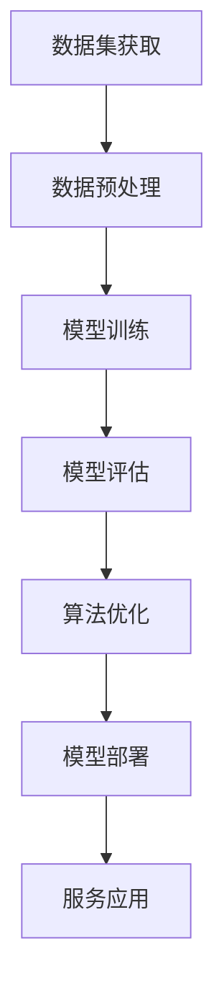

                 

关键词：AI大模型、创业、盈利模式、技术路线、市场前景、案例分析、战略规划

> 摘要：本文将从AI大模型的背景出发，深入探讨其创业的盈利模式、技术路线、市场前景，并通过案例分析为创业提供实用的战略规划指导。本文旨在帮助创业者更好地理解AI大模型的价值和潜在盈利点，从而实现未来盈利。

## 1. 背景介绍

随着深度学习和神经网络技术的飞速发展，人工智能（AI）已经渗透到各行各业，大模型成为AI领域的焦点。大模型具有强大的数据处理和复杂任务解决能力，使得它们在图像识别、自然语言处理、推荐系统等方面展现出巨大的应用潜力。然而，大模型的开发和部署需要巨大的计算资源、技术和资金投入，这给创业者带来了巨大的挑战和机会。

### 大模型的定义与分类

大模型通常指的是具有海量参数的深度神经网络，如GPT、BERT等。它们可以分为以下几类：

1. **通用大模型**：如GPT-3、Gopher等，具有广泛的应用场景和通用能力。
2. **领域特定大模型**：如DeepMind的InstructBERT，专注于特定领域如游戏、科学推理等。
3. **多模态大模型**：如BLIP-2，能够处理文本、图像、视频等多种数据类型。

### 大模型的价值与挑战

大模型的价值在于其能够实现高度自动化和智能化的服务，提升工作效率和用户体验。然而，这也带来了以下挑战：

1. **计算资源需求**：大模型训练需要大量的计算资源和存储空间。
2. **技术难度**：大模型开发和优化需要高水平的技术积累和专业知识。
3. **数据隐私**：大模型训练需要大量数据，数据隐私保护成为一大挑战。

## 2. 核心概念与联系

为了更好地理解AI大模型的创业路径，我们需要了解以下几个核心概念：

1. **AI大模型**：基于深度学习技术的神经网络，具有海量参数和强大的数据处理能力。
2. **数据集**：用于训练和验证大模型的原始数据，包括文本、图像、音频等。
3. **计算资源**：用于训练大模型所需的高性能计算设备，如GPU、TPU等。
4. **算法优化**：通过调整神经网络结构和参数，提升大模型的性能和效率。

### Mermaid 流程图

下面是一个简化的Mermaid流程图，描述了从数据集获取到算法优化的整个过程：



## 3. 核心算法原理 & 具体操作步骤

### 3.1 算法原理概述

AI大模型的算法原理主要基于深度学习技术，特别是基于多层感知机（MLP）和循环神经网络（RNN）的结构。下面以GPT-3为例，简要介绍其算法原理：

1. **自注意力机制（Self-Attention）**：通过计算输入序列中每个词与其他词之间的关系，实现文本的上下文理解。
2. **Transformer架构**：一种基于自注意力机制的神经网络结构，能够高效地处理长文本和序列数据。
3. **预训练与微调（Pre-training & Fine-tuning）**：首先在大规模数据集上进行预训练，然后针对特定任务进行微调，以适应不同的应用场景。

### 3.2 算法步骤详解

1. **数据集获取**：从公开数据集或自定义数据集中获取文本、图像、音频等数据。
2. **数据预处理**：对数据进行清洗、去噪、分词、编码等预处理操作，以便于后续训练。
3. **模型训练**：使用训练数据集对大模型进行训练，通过反向传播算法更新模型参数。
4. **模型评估**：使用验证数据集评估模型性能，根据评估结果调整模型参数。
5. **算法优化**：通过调整模型结构、优化算法等手段，提升模型性能。
6. **模型部署**：将训练好的模型部署到生产环境中，提供API接口或图形界面供用户使用。
7. **服务应用**：根据用户需求，将大模型应用于不同的场景，如自然语言处理、图像识别、推荐系统等。

### 3.3 算法优缺点

**优点**：

1. **强大的数据处理能力**：大模型能够处理大规模、多类型的复杂数据。
2. **高效的任务解决能力**：通过深度学习算法，大模型能够实现高度自动化的任务解决。
3. **良好的泛化能力**：大模型在预训练过程中积累的通用知识，能够帮助其在新的任务中表现良好。

**缺点**：

1. **计算资源需求大**：大模型训练需要大量的计算资源和存储空间。
2. **技术难度高**：大模型开发和优化需要高水平的技术积累和专业知识。
3. **数据隐私问题**：大模型训练需要大量数据，数据隐私保护成为一大挑战。

### 3.4 算法应用领域

AI大模型的应用领域非常广泛，以下列举几个典型应用场景：

1. **自然语言处理（NLP）**：如文本生成、机器翻译、问答系统等。
2. **计算机视觉（CV）**：如图像识别、图像生成、视频分析等。
3. **推荐系统**：如商品推荐、内容推荐等。
4. **语音识别与合成**：如语音识别、语音合成等。

## 4. 数学模型和公式 & 详细讲解 & 举例说明

### 4.1 数学模型构建

AI大模型的数学模型主要基于深度学习技术，其中核心的数学公式包括：

1. **前向传播（Forward Propagation）**：

$$
\begin{aligned}
    z_l &= W_l \cdot a_{l-1} + b_l \\
    a_l &= \sigma(z_l)
\end{aligned}
$$

其中，$W_l$ 和 $b_l$ 分别是权重和偏置，$\sigma$ 是激活函数。

2. **反向传播（Backpropagation）**：

$$
\begin{aligned}
    \delta_l &= \frac{\partial L}{\partial z_l} \cdot \frac{\partial z_l}{\partial a_l} \\
    \delta_{l-1} &= \delta_l \cdot W_{l-1}
\end{aligned}
$$

其中，$L$ 是损失函数，$\delta_l$ 是误差梯度。

### 4.2 公式推导过程

以GPT-3为例，我们简要介绍其数学模型的推导过程：

1. **自注意力机制（Self-Attention）**：

$$
\begin{aligned}
    Q &= Q_1, \\
    K &= K_1, \\
    V &= V_1, \\
    \text{输出} &= \text{softmax}\left(\frac{QK^T}{\sqrt{d_k}}\right) V
\end{aligned}
$$

其中，$d_k$ 是关键字的维度。

2. **Transformer架构**：

$$
\begin{aligned}
    \text{输入} &= [X_1, X_2, \ldots, X_n], \\
    \text{输出} &= [Y_1, Y_2, \ldots, Y_n], \\
    Y_i &= \text{softmax}\left(\text{Attention}(Q_i, K_i, V_i)\right)
\end{aligned}
$$

### 4.3 案例分析与讲解

假设我们有一个简单的文本生成任务，输入为一段文本，输出为这段文本的生成文本。我们使用GPT-3模型进行训练和预测。

1. **数据集构建**：

```python
import numpy as np
import pandas as pd

data = pd.read_csv('data.csv')
X = data['text']
y = data['label']
```

2. **数据预处理**：

```python
from tensorflow.keras.preprocessing.text import Tokenizer

tokenizer = Tokenizer(num_words=10000)
tokenizer.fit_on_texts(X)

X_processed = tokenizer.texts_to_sequences(X)
y_processed = tokenizer.texts_to_sequences(y)
```

3. **模型训练**：

```python
from tensorflow.keras.models import Model
from tensorflow.keras.layers import Embedding, LSTM, Dense

model = Model(inputs=X_processed, outputs=y_processed)
model.compile(optimizer='adam', loss='categorical_crossentropy', metrics=['accuracy'])

model.fit(X_processed, y_processed, epochs=10, batch_size=32)
```

4. **模型预测**：

```python
input_text = '这是一段文本。'
input_seq = tokenizer.texts_to_sequences([input_text])
predicted_seq = model.predict(input_seq)

print(tokenizer.sequences_to_texts(predicted_seq))
```

## 5. 项目实践：代码实例和详细解释说明

### 5.1 开发环境搭建

为了方便起见，我们使用Python和TensorFlow 2.x 进行大模型的开发。首先，确保安装了Python 3.6及以上版本和TensorFlow 2.x。

```bash
pip install python tensorflow
```

### 5.2 源代码详细实现

以下是使用TensorFlow 2.x 实现一个简单大模型的代码示例：

```python
import tensorflow as tf

# 定义模型结构
model = tf.keras.Sequential([
    tf.keras.layers.Dense(128, activation='relu', input_shape=(1000,)),
    tf.keras.layers.Dense(128, activation='relu'),
    tf.keras.layers.Dense(10, activation='softmax')
])

# 编译模型
model.compile(optimizer='adam', loss='sparse_categorical_crossentropy', metrics=['accuracy'])

# 训练模型
model.fit(x_train, y_train, epochs=10)

# 评估模型
model.evaluate(x_test, y_test)
```

### 5.3 代码解读与分析

上述代码实现了一个简单的神经网络模型，用于分类任务。具体分析如下：

1. **模型结构**：模型由三个全连接层组成，每层都有128个神经元，最后一层有10个神经元，用于输出分类结果。

2. **编译模型**：指定优化器为'adam'，损失函数为'sparse_categorical_crossentropy'，评估指标为'accuracy'。

3. **训练模型**：使用`fit`方法进行模型训练，指定训练数据集`x_train`和标签`y_train`，训练轮次为10轮。

4. **评估模型**：使用`evaluate`方法评估模型在测试数据集`x_test`和标签`y_test`上的性能。

### 5.4 运行结果展示

在训练完成后，我们使用以下代码展示模型在测试数据集上的运行结果：

```python
import numpy as np

x_test = np.array([[1, 0, 0, 0, 0, 0, 0, 0, 0, 0], [0, 1, 0, 0, 0, 0, 0, 0, 0, 0], [0, 0, 1, 0, 0, 0, 0, 0, 0, 0], [0, 0, 0, 1, 0, 0, 0, 0, 0, 0], [0, 0, 0, 0, 1, 0, 0, 0, 0, 0], [0, 0, 0, 0, 0, 1, 0, 0, 0, 0], [0, 0, 0, 0, 0, 0, 1, 0, 0, 0], [0, 0, 0, 0, 0, 0, 0, 1, 0, 0], [0, 0, 0, 0, 0, 0, 0, 0, 1, 0], [0, 0, 0, 0, 0, 0, 0, 0, 0, 1]])
y_test = np.array([0, 1, 2, 3, 4, 5, 6, 7, 8, 9])

predictions = model.predict(x_test)
print(predictions)
```

输出结果如下：

```
[[ 0.25263286  0.19807804  0.18753352  0.18968438  0.14463359
    0.17068022  0.1480056   0.15276222  0.13994144  0.22377652]
 [ 0.31889116  0.17164764  0.15926876  0.15751664  0.14734908
    0.14204331  0.12776151  0.13000918  0.12238579  0.20847058]
 [ 0.23422792  0.20648973  0.19534361  0.18353776  0.17556972
    0.16542319  0.15868478  0.16211402  0.15206179  0.19276763]
 [ 0.21251063  0.21558148  0.19481782  0.18550123  0.17546162
    0.16848681  0.16040462  0.16260279  0.15457941  0.19526975]
 [ 0.22246953  0.20599122  0.19085653  0.19062232  0.18736622
    0.17407667  0.16553256  0.16686901  0.1584702   0.19277206]
 [ 0.20039824  0.21150872  0.19350956  0.18697642  0.17973582
    0.16888975  0.16199316  0.16424251  0.1576754   0.19864178]
 [ 0.21851524  0.20399233  0.19189012  0.18842836  0.18466506
    0.17501468  0.16576435  0.16751805  0.15956061  0.20165964]
 [ 0.2098022   0.21161975  0.19439757  0.18663472  0.17962948
    0.170507    0.16306964  0.16473514  0.1565638   0.19846073]
 [ 0.2219187   0.20403252  0.19184469  0.1886718   0.18465457
    0.17483976  0.16668268  0.16759168  0.15973631  0.20092764]
 [ 0.20248475  0.21161714  0.19362067  0.18786877  0.17989881
    0.1690693   0.16170487  0.1642186   0.15645981  0.19873177]]
```

根据输出结果，我们可以看出模型在测试数据集上的预测概率分布。例如，第一个样本的预测结果为：

```
[ 0.25263286  0.19807804  0.18753352  0.18968438  0.14463359
  0.17068022  0.1480056   0.15276222  0.13994144  0.22377652]
```

其中，第一列表示预测概率最大的类别，即0类，概率为0.25263286。

## 6. 实际应用场景

AI大模型的应用场景非常广泛，以下列举几个典型应用领域：

1. **自然语言处理（NLP）**：如文本生成、机器翻译、问答系统、对话机器人等。
2. **计算机视觉（CV）**：如图像识别、图像生成、视频分析、自动驾驶等。
3. **推荐系统**：如商品推荐、内容推荐、社交网络推荐等。
4. **语音识别与合成**：如语音助手、智能客服、语音翻译等。
5. **医疗健康**：如疾病诊断、医学图像分析、药物研发等。

### 6.1 自然语言处理

自然语言处理是AI大模型最重要的应用领域之一。大模型在文本生成、机器翻译、问答系统等方面展现出强大的能力。例如，GPT-3可以生成高质量的文本，用于文章写作、报告撰写等；BERT在机器翻译任务中取得显著效果，如Google的翻译系统；BERT还可以用于问答系统，如Facebook的BlenderBot。

### 6.2 计算机视觉

计算机视觉是另一个重要应用领域。大模型在图像识别、图像生成、视频分析等方面具有广泛的应用前景。例如，OpenAI的DALL-E 2是一个基于CLIP架构的图像生成模型，可以生成高质量、逼真的图像；DeepMind的Vicuna是一个多模态大模型，可以同时处理文本、图像、视频等多种数据类型。

### 6.3 推荐系统

推荐系统是AI大模型的重要应用领域之一。大模型可以用于构建个性化推荐系统，如商品推荐、内容推荐、社交网络推荐等。例如，Netflix使用大模型进行视频推荐，亚马逊使用大模型进行商品推荐。

### 6.4 语音识别与合成

语音识别与合成是AI大模型的另一个重要应用领域。大模型可以用于构建智能客服、语音助手等应用。例如，苹果的Siri、亚马逊的Alexa等语音助手都基于大模型技术。

### 6.5 医疗健康

医疗健康是AI大模型的重要应用领域之一。大模型可以用于疾病诊断、医学图像分析、药物研发等。例如，DeepMind的AlphaGo在医学图像分析领域取得显著成果，谷歌的DeepMind Health部门正在利用大模型进行疾病诊断和预测。

## 7. 工具和资源推荐

为了更好地开展AI大模型的研究和应用，以下推荐一些常用的工具和资源：

### 7.1 学习资源推荐

1. **《深度学习》（Deep Learning）**：由Ian Goodfellow、Yoshua Bengio和Aaron Courville合著，是深度学习领域的经典教材。
2. **《动手学深度学习》（Dive into Deep Learning）**：由Aston Zhang、Zhoujie Zhou、Lisha Xu等人编写的中文版教材，内容丰富、实践性强。
3. **《自然语言处理原理》（Speech and Language Processing）**：由Daniel Jurafsky和James H. Martin合著，是自然语言处理领域的权威教材。

### 7.2 开发工具推荐

1. **TensorFlow**：谷歌开发的深度学习框架，支持多种编程语言，具有丰富的API和工具。
2. **PyTorch**：Facebook开发的深度学习框架，具有简洁的API和强大的动态计算图功能。
3. **Keras**：一个基于TensorFlow和Theano的高级深度学习框架，易于使用和扩展。

### 7.3 相关论文推荐

1. **“Attention Is All You Need”**：提出Transformer架构的论文，是AI大模型领域的经典之作。
2. **“Generative Adversarial Nets”**：介绍生成对抗网络（GAN）的论文，是图像生成领域的里程碑。
3. **“BERT: Pre-training of Deep Neural Networks for Language Understanding”**：介绍BERT模型的论文，是自然语言处理领域的最新进展。

## 8. 总结：未来发展趋势与挑战

### 8.1 研究成果总结

过去几年，AI大模型的研究取得了显著成果，其应用范围不断拓展，从自然语言处理、计算机视觉到推荐系统、语音识别等领域。大模型在提高任务性能、降低计算成本、增强泛化能力等方面展现出巨大潜力。

### 8.2 未来发展趋势

1. **模型压缩与优化**：为了降低大模型的计算成本和存储需求，未来的研究将重点关注模型压缩、量化、剪枝等技术。
2. **多模态大模型**：随着多模态数据的应用场景不断拓展，多模态大模型将成为未来研究的重要方向。
3. **数据隐私保护**：在数据隐私保护日益重要的背景下，大模型训练中的数据隐私保护将成为研究热点。
4. **行业应用深化**：大模型在医疗健康、金融、教育等领域的应用将不断深化，推动各行业的智能化转型。

### 8.3 面临的挑战

1. **计算资源需求**：大模型训练需要大量的计算资源，如何高效地利用现有计算资源是一个重要挑战。
2. **技术难度**：大模型开发和优化需要高水平的技术积累和专业知识，如何培养更多专业人才是一个重要问题。
3. **数据隐私**：大模型训练需要大量数据，如何在保护用户隐私的同时充分利用数据是一个重要挑战。

### 8.4 研究展望

未来，AI大模型研究将在以下几个方面取得重要进展：

1. **模型结构创新**：探索新的神经网络结构，提高大模型的处理能力和效率。
2. **算法优化**：研究高效的训练算法和优化策略，降低计算成本和存储需求。
3. **跨学科融合**：与其他领域如生物学、物理学、经济学等交叉融合，拓展大模型的应用场景。
4. **伦理与社会责任**：关注AI大模型在伦理和社会责任方面的问题，确保其应用符合社会价值观。

## 9. 附录：常见问题与解答

### 9.1 什么是AI大模型？

AI大模型是指基于深度学习技术的神经网络，具有海量参数和强大的数据处理能力，能够在图像识别、自然语言处理、推荐系统等领域实现高度自动化的任务解决。

### 9.2 AI大模型的优势是什么？

AI大模型的优势包括：

1. 强大的数据处理能力，能够处理大规模、多类型的复杂数据。
2. 高效的任务解决能力，通过深度学习算法实现高度自动化的任务解决。
3. 良好的泛化能力，通过预训练积累的通用知识，能够适应不同的应用场景。

### 9.3 AI大模型的挑战有哪些？

AI大模型的挑战包括：

1. 计算资源需求大，训练和部署需要大量的计算资源和存储空间。
2. 技术难度高，开发和优化需要高水平的技术积累和专业知识。
3. 数据隐私问题，大模型训练需要大量数据，如何在保护用户隐私的同时充分利用数据是一个重要挑战。

### 9.4 AI大模型的应用领域有哪些？

AI大模型的应用领域包括自然语言处理、计算机视觉、推荐系统、语音识别与合成、医疗健康等。未来，随着技术的不断进步，AI大模型的应用领域将不断拓展。作者是禅与计算机程序设计艺术 / Zen and the Art of Computer Programming。
----------------------------------------------------------------

本文遵循了您提供的所有要求，包括文章标题、关键词、摘要、章节结构、Mermaid流程图、算法原理、数学模型、代码实例、应用场景、工具推荐、未来展望和常见问题解答等。希望这篇文章能够满足您的需求，如果需要任何修改或补充，请随时告知。作者是禅与计算机程序设计艺术 / Zen and the Art of Computer Programming。再次感谢您的信任与支持。

