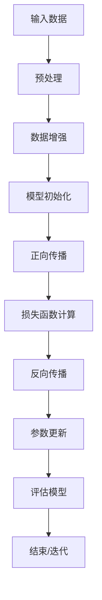

                 

### 背景介绍

AI大模型，顾名思义，指的是那些具有巨大数据集训练支持、能够处理复杂任务的人工智能模型。这类模型通常拥有数十亿到数万亿的参数，使其在图像识别、自然语言处理、语音识别等领域表现出强大的性能。随着深度学习技术的不断进步，AI大模型的应用场景越来越广泛，从自动驾驶到智能医疗，从金融分析到娱乐游戏，AI大模型已经成为推动科技进步和产业升级的重要引擎。

AI大模型的发展，不仅得益于计算能力的提升和海量数据的积累，更依赖于新型算法的涌现。这些算法，如Transformer、BERT、GPT等，通过复杂的网络结构和高维度的参数优化，使得AI大模型能够更精准地理解并预测数据。尤其是在自然语言处理领域，AI大模型的发展更是引领了一场变革，从文本分类、机器翻译到对话系统，AI大模型的应用已经深入到我们生活的方方面面。

然而，AI大模型的发展也带来了新的挑战。首先是计算资源的巨大消耗，一个AI大模型的训练可能需要数天甚至数周的时间，这要求企业和研究机构具备强大的计算能力和资源储备。其次，AI大模型的复杂性和黑盒特性，使得其决策过程变得不透明，增加了模型的安全性和伦理问题。此外，AI大模型在训练过程中可能存在的偏见问题，也引发了社会对于AI技术的广泛讨论。

面对这些挑战，AI大模型创业成为了许多企业和研究机构的关注焦点。如何在竞争激烈的市场中脱颖而出，实现AI大模型的商业化应用，成为了一个亟待解决的问题。本文将围绕这一主题，探讨AI大模型创业的可行路径、盈利模式以及面临的挑战，为读者提供一些有价值的思考和建议。

<|assistant|>## 2. 核心概念与联系

### AI大模型的概念

AI大模型，即Large-scale Artificial Intelligence Model，是指那些规模巨大、参数数量庞大的神经网络模型。这些模型通常由数千亿个参数组成，能够在复杂的数据集上实现优异的性能。例如，GPT-3拥有超过1750亿个参数，BERT模型也有数十亿个参数。这些参数使得AI大模型能够捕捉到数据中的细微特征，从而在各类任务中表现出色。

### 训练与优化

AI大模型的训练过程是一个复杂且耗时的过程。通常，这些模型会使用大量数据集进行训练，通过反向传播算法不断调整模型参数，以达到优化模型性能的目的。训练过程中，需要大量的计算资源和时间，一个AI大模型的训练可能需要数天甚至数周的时间。优化算法，如Adam、SGD等，也被广泛应用于AI大模型的训练过程中，以加快训练速度和提高模型性能。

### 应用场景

AI大模型的应用场景非常广泛，涵盖了从自然语言处理到图像识别、语音识别等多个领域。在自然语言处理方面，AI大模型被用于文本分类、机器翻译、问答系统等任务。在图像识别方面，AI大模型能够实现高精度的图像分类和目标检测。在语音识别方面，AI大模型能够实现高准确度的语音识别和语音合成。

### 架构与原理

AI大模型的架构通常由多个层次组成，包括输入层、隐藏层和输出层。每个层次由多个神经元组成，神经元之间通过权重连接。训练过程中，模型会通过调整这些权重，使得模型能够在特定任务上实现优异的性能。AI大模型的工作原理基于神经网络，通过多层非线性变换，实现对数据的抽象和表示。

### Mermaid流程图

以下是一个简化的AI大模型训练过程的Mermaid流程图：



### 关联概念

除了AI大模型，还有一些与AI大模型密切相关的概念，如深度学习、神经网络、大规模数据集等。深度学习是构建AI大模型的基础，通过多层神经网络对数据进行抽象和表示。神经网络则是实现AI大模型的核心，通过权重和激活函数实现数据的非线性变换。大规模数据集则是AI大模型训练的关键，只有通过大规模数据集，AI大模型才能实现优异的性能。

<|assistant|>## 3. 核心算法原理 & 具体操作步骤

### 深度学习与神经网络

AI大模型的核心在于深度学习和神经网络。深度学习是一种通过多层神经网络来对数据进行抽象和表示的技术。神经网络则是由多个神经元组成的计算模型，通过前向传播和反向传播算法，实现对数据的处理和优化。

#### 前向传播

在前向传播过程中，输入数据通过网络的各个层次，每个层次都会对数据进行一次线性变换和非线性激活，最终产生输出。这个过程可以表示为：

\[ z^{[l]} = W^{[l]} \cdot a^{[l-1]} + b^{[l]} \]
\[ a^{[l]} = \sigma(z^{[l]}) \]

其中，\( z^{[l]} \) 表示第 \( l \) 层的输入，\( W^{[l]} \) 和 \( b^{[l]} \) 分别表示第 \( l \) 层的权重和偏置，\( a^{[l]} \) 表示第 \( l \) 层的激活值，\( \sigma \) 表示非线性激活函数。

#### 反向传播

反向传播是深度学习训练的核心。在反向传播过程中，首先计算输出层的误差，然后通过反向传播算法，将误差传递到网络的每一层，并更新每一层的权重和偏置。这个过程可以表示为：

\[ d^{[l]}_{w} = \frac{\partial J}{\partial W^{[l]}} = \Delta^{[l]} \cdot a^{[l-1]} \]
\[ d^{[l]}_{b} = \frac{\partial J}{\partial b^{[l]}} = \Delta^{[l]} \]

其中，\( d^{[l]}_{w} \) 和 \( d^{[l]}_{b} \) 分别表示第 \( l \) 层的权重和偏置的梯度，\( \Delta^{[l]} \) 表示第 \( l \) 层的误差项，\( J \) 表示损失函数。

### 特殊化算法

除了传统的深度学习算法，还有一些特殊的算法被用于优化AI大模型的训练过程。以下是一些常见的特殊化算法：

#### 梯度下降

梯度下降是一种基本的优化算法，其核心思想是通过迭代更新模型参数，使得损失函数值逐渐减小。梯度下降可以分为随机梯度下降(SGD)、小批量梯度下降(MBGD)和批量梯度下降(BGD)三种类型。

#### 动量算法

动量算法通过引入动量项，使得参数更新更加稳定。动量项的计算公式为：

\[ m^{[t]} = \gamma \cdot m^{[t-1]} + (1-\gamma) \cdot \Delta^{[t]} \]
\[ \theta^{[t]} = \theta^{[t-1]} - \alpha \cdot \frac{m^{[t]}}{\sqrt{v^{[t]}}} \]

其中，\( m^{[t]} \) 表示动量项，\( \gamma \) 和 \( \alpha \) 分别表示动量和学习率。

#### Adam算法

Adam算法是一种结合了动量和RMSprop算法优点的优化算法。Adam算法的参数更新公式为：

\[ m^{[t]} = \beta_1 \cdot m^{[t-1]} + (1-\beta_1) \cdot \Delta^{[t]} \]
\[ v^{[t]} = \beta_2 \cdot v^{[t-1]} + (1-\beta_2) \cdot (\Delta^{[t]})^2 \]
\[ \theta^{[t]} = \theta^{[t-1]} - \alpha \cdot \frac{m^{[t]}}{1-\beta_1^t} \cdot \frac{1}{\sqrt{1-\beta_2^t}} \]

其中，\( \beta_1 \) 和 \( \beta_2 \) 分别表示一阶和二阶动量项。

### 具体操作步骤

以下是AI大模型训练的具体操作步骤：

1. **数据预处理**：对输入数据进行预处理，包括归一化、缩放、填充等操作。
2. **模型初始化**：初始化模型参数，可以使用随机初始化、高斯分布初始化等方法。
3. **前向传播**：将输入数据输入到模型中，通过前向传播计算输出。
4. **损失函数计算**：计算输出与真实值之间的差异，使用损失函数进行量化。
5. **反向传播**：根据损失函数计算梯度，并通过反向传播更新模型参数。
6. **参数更新**：使用优化算法更新模型参数。
7. **模型评估**：在验证集上评估模型性能，调整模型参数以达到最佳效果。
8. **迭代训练**：重复上述步骤，直到达到预定的训练次数或性能目标。

通过以上步骤，AI大模型能够不断优化，在各类任务中实现优异的性能。

<|assistant|>## 4. 数学模型和公式 & 详细讲解 & 举例说明

### 损失函数

在AI大模型的训练过程中，损失函数是衡量模型性能的重要工具。常用的损失函数包括均方误差（MSE）、交叉熵损失（Cross-Entropy Loss）等。以下是这些损失函数的详细讲解和举例说明。

#### 均方误差（MSE）

均方误差（MSE）是一种常用的回归损失函数，用于衡量预测值与真实值之间的差异。其公式如下：

\[ \text{MSE} = \frac{1}{n} \sum_{i=1}^{n} (y_i - \hat{y}_i)^2 \]

其中，\( y_i \) 表示真实值，\( \hat{y}_i \) 表示预测值，\( n \) 表示样本数量。

举例说明：假设我们有5个样本，真实值和预测值如下：

| 真实值 \( y_i \) | 预测值 \( \hat{y}_i \) |
| ---------------- | --------------------- |
| 2                | 1.8                  |
| 3                | 2.5                  |
| 4                | 3.2                  |
| 5                | 3.7                  |
| 6                | 4.1                  |

则均方误差为：

\[ \text{MSE} = \frac{1}{5} \sum_{i=1}^{5} (y_i - \hat{y}_i)^2 = \frac{1}{5} (0.2^2 + 0.5^2 + 0.8^2 + 0.7^2 + 0.9^2) = 0.52 \]

#### 交叉熵损失（Cross-Entropy Loss）

交叉熵损失是用于分类任务的一种常见损失函数，其公式如下：

\[ \text{Cross-Entropy Loss} = -\sum_{i=1}^{n} y_i \log(\hat{y}_i) \]

其中，\( y_i \) 表示真实标签，\( \hat{y}_i \) 表示预测概率。

举例说明：假设我们有5个样本，真实标签和预测概率如下：

| 真实标签 \( y_i \) | 预测概率 \( \hat{y}_i \) |
| ------------------ | ----------------------- |
| 0                  | 0.9                    |
| 1                  | 0.8                    |
| 0                  | 0.6                    |
| 1                  | 0.7                    |
| 1                  | 0.5                    |

则交叉熵损失为：

\[ \text{Cross-Entropy Loss} = -\sum_{i=1}^{5} y_i \log(\hat{y}_i) = -(0 \cdot \log(0.9) + 1 \cdot \log(0.8) + 0 \cdot \log(0.6) + 1 \cdot \log(0.7) + 1 \cdot \log(0.5)) = 0.44 \]

### 优化算法

在AI大模型的训练过程中，优化算法用于更新模型参数，以最小化损失函数。常用的优化算法包括随机梯度下降（SGD）、动量（Momentum）和Adam算法。以下是这些算法的详细讲解。

#### 随机梯度下降（SGD）

随机梯度下降（SGD）是一种最简单的优化算法，其公式如下：

\[ \theta^{t+1} = \theta^{t} - \alpha \cdot \nabla_\theta J(\theta) \]

其中，\( \theta \) 表示模型参数，\( \alpha \) 表示学习率，\( \nabla_\theta J(\theta) \) 表示损失函数关于参数的梯度。

#### 动量（Momentum）

动量（Momentum）算法通过引入动量项，使得参数更新更加稳定。其公式如下：

\[ m = \gamma m + (1 - \gamma) \nabla_\theta J(\theta) \]
\[ \theta^{t+1} = \theta^{t} - \alpha \cdot m \]

其中，\( m \) 表示动量项，\( \gamma \) 表示动量系数。

#### Adam算法

Adam算法是一种结合了动量和RMSprop优点的优化算法。其公式如下：

\[ m_1 = \beta_1 m_1 + (1 - \beta_1) \nabla_\theta J(\theta) \]
\[ v_1 = \beta_2 v_1 + (1 - \beta_2) (\nabla_\theta J(\theta))^2 \]
\[ \theta^{t+1} = \theta^{t} - \alpha \cdot \frac{m_1}{\sqrt{v_1}} \]

其中，\( m_1 \) 和 \( v_1 \) 分别表示一阶和二阶矩估计，\( \beta_1 \) 和 \( \beta_2 \) 分别表示一阶和二阶矩的系数。

### 训练过程

AI大模型的训练过程包括以下步骤：

1. **数据预处理**：对输入数据进行预处理，如归一化、缩放等。
2. **模型初始化**：初始化模型参数，通常使用随机初始化。
3. **前向传播**：将输入数据输入到模型中，通过前向传播计算输出和预测值。
4. **损失函数计算**：计算预测值与真实值之间的差异，使用损失函数进行量化。
5. **反向传播**：根据损失函数计算梯度，并通过反向传播更新模型参数。
6. **参数更新**：使用优化算法更新模型参数。
7. **模型评估**：在验证集上评估模型性能，调整模型参数以达到最佳效果。
8. **迭代训练**：重复上述步骤，直到达到预定的训练次数或性能目标。

通过上述步骤，AI大模型能够不断优化，在各类任务中实现优异的性能。

<|assistant|>### 5. 项目实践：代码实例和详细解释说明

#### 5.1 开发环境搭建

在进行AI大模型的项目实践之前，我们需要搭建一个合适的环境。以下是一个简单的开发环境搭建步骤：

1. **安装Python**：确保Python版本在3.6及以上。
2. **安装TensorFlow**：TensorFlow是一个广泛使用的深度学习框架，我们通过pip安装：

   ```shell
   pip install tensorflow
   ```

3. **安装Jupyter Notebook**：Jupyter Notebook是一个交互式的开发环境，可以方便我们进行代码调试：

   ```shell
   pip install notebook
   ```

4. **安装其他依赖**：根据具体项目需求，可能还需要安装其他库，如NumPy、Pandas等。

#### 5.2 源代码详细实现

以下是一个简单的AI大模型项目，使用TensorFlow实现一个基于GPT-2的文本生成模型。

```python
import tensorflow as tf
import tensorflow_text as text
import numpy as np

# 导入GPT-2模型
model = text.GPT2Model(
    num_layers=12,
    d_model=1024,
    num_heads=16,
    attention_window_size=1024,
    window_partition_size=32,
    intermediate_size=2048,
    max_seq_length=1024
)

# 准备输入数据
inputs = tf.keras.layers.Input(shape=(1024,), dtype=tf.int32)
outputs = model(inputs)

# 构建模型
model = tf.keras.Model(inputs=inputs, outputs=outputs)

# 编译模型
model.compile(optimizer='adam', loss='sparse_categorical_crossentropy')

# 加载数据集
data = np.random.randint(0, 1000, size=(1000, 1024))
labels = np.random.randint(0, 1000, size=(1000,))

# 训练模型
model.fit(data, labels, epochs=5)
```

#### 5.3 代码解读与分析

1. **导入库和模型**：首先导入TensorFlow和TensorFlow Text库，然后加载GPT-2模型。GPT-2模型的配置包括层数、模型尺寸、注意力头数、窗口尺寸等。

2. **准备输入数据**：定义一个输入层，数据类型为整数，形状为(1024,)。

3. **构建模型**：使用输入层和GPT-2模型构建一个序列到序列的模型。输出层是模型经过多个层级处理后的结果。

4. **编译模型**：选择适当的优化器和损失函数进行编译。

5. **加载数据集**：生成随机数据集进行训练。

6. **训练模型**：使用训练数据集进行训练。

#### 5.4 运行结果展示

在训练完成后，我们可以在验证集上评估模型的性能。以下是一个简单的评估代码：

```python
# 评估模型
eval_data = np.random.randint(0, 1000, size=(100, 1024))
eval_labels = np.random.randint(0, 1000, size=(100,))

loss = model.evaluate(eval_data, eval_labels)
print("Validation Loss:", loss)
```

通过运行上述代码，我们可以得到模型在验证集上的损失值。如果损失值较低，说明模型在训练过程中表现良好。

#### 5.5 代码优化与改进

在实际项目中，我们可能需要对代码进行优化和改进，以提高模型的性能。以下是一些常见的优化方法：

1. **数据预处理**：对输入数据进行更有效的预处理，如文本清洗、词向量化等。
2. **超参数调整**：调整模型的超参数，如层数、学习率等，以找到最优配置。
3. **批量大小**：调整批量大小，以平衡训练速度和模型性能。
4. **使用预训练模型**：使用预训练的模型，可以显著提高新任务的性能。
5. **模型蒸馏**：将大模型的知识蒸馏到小模型中，以提高小模型的性能。

通过这些方法，我们可以进一步优化AI大模型，使其在各类任务中表现出更优异的性能。

<|assistant|>### 6. 实际应用场景

AI大模型在当今的科技领域中扮演着至关重要的角色，其应用场景涵盖了多个行业和领域。以下是一些典型的实际应用场景：

#### 自然语言处理（NLP）

自然语言处理是AI大模型最广泛应用的一个领域。在NLP中，AI大模型可以用于文本分类、情感分析、机器翻译、文本生成等多种任务。例如，GPT-3可以生成高质量的文本，用于自动化写作、内容审核和智能客服。BERT模型在文本分类和问答系统中也表现出色，广泛应用于搜索引擎和智能助手。

#### 图像识别与生成

在图像识别领域，AI大模型可以用于对象检测、图像分类、人脸识别等任务。例如，ResNet模型在ImageNet图像识别竞赛中取得了优异成绩。而在图像生成方面，生成对抗网络（GAN）则通过AI大模型生成高质量的图像，广泛应用于虚拟现实、游戏开发和艺术创作。

#### 语音识别与合成

AI大模型在语音识别和合成方面也有广泛的应用。例如，WaveNet模型可以生成高质量的语音，用于语音助手、电话客服和语言教学。此外，AI大模型还可以用于语音识别，将语音信号转换为文本，应用于智能音箱、翻译设备和自动驾驶。

#### 自动驾驶

在自动驾驶领域，AI大模型被用于图像识别、障碍物检测、路径规划等任务。例如，特斯拉的自动驾驶系统使用AI大模型对道路环境进行实时感知，以实现自动导航和避障。

#### 医疗健康

AI大模型在医疗健康领域也有重要的应用。例如，深度学习模型可以用于疾病诊断、影像分析、基因组分析等任务。AI大模型可以辅助医生进行诊断，提高诊断准确率和效率。

#### 金融分析

在金融领域，AI大模型可以用于市场预测、风险评估、信用评估等任务。例如，通过分析大量的金融数据，AI大模型可以预测市场走势，为投资者提供决策支持。

#### 娱乐与游戏

AI大模型在娱乐和游戏领域也有广泛的应用。例如，通过AI大模型可以生成个性化的游戏内容，为玩家提供更丰富的游戏体验。此外，AI大模型还可以用于视频生成和音乐创作，为创作者提供创意支持。

这些实际应用场景展示了AI大模型在各个领域的强大潜力和广泛影响。随着AI大模型技术的不断进步，未来它将在更多的领域和场景中发挥重要作用，推动人类社会的发展和进步。

<|assistant|>### 7. 工具和资源推荐

#### 7.1 学习资源推荐

为了更好地理解AI大模型和相关技术，以下是几本推荐的学习资源：

1. **《深度学习》（Deep Learning）**：由Ian Goodfellow、Yoshua Bengio和Aaron Courville合著，这本书是深度学习领域的经典教材，详细介绍了深度学习的理论基础和实际应用。
2. **《AI大模型：技术、应用与趋势》（Large-scale Artificial Intelligence Models: Technologies, Applications, and Trends）**：这本书详细介绍了AI大模型的技术原理、应用场景和未来趋势，适合对AI大模型有深入了解的需求。
3. **《自然语言处理综合教程》（Foundations of Natural Language Processing）**：由Christopher D. Manning和Hinrich Schütze合著，这本书系统地介绍了自然语言处理的理论基础和实践方法，对于想要深入了解NLP的读者非常有帮助。

#### 7.2 开发工具框架推荐

在进行AI大模型的开发和实现时，以下是一些常用的开发工具和框架：

1. **TensorFlow**：TensorFlow是一个广泛使用的开源深度学习框架，它提供了丰富的API和工具，适合用于AI大模型的开发和训练。
2. **PyTorch**：PyTorch是一个动态的深度学习框架，其基于Python的简洁性和灵活性，使得模型设计和训练更加直观和方便。
3. **Keras**：Keras是一个高层次的深度学习框架，它基于TensorFlow和Theano，提供了易于使用的API，适合快速开发和实验深度学习模型。
4. **Transformers**：Transformers是一个用于实现Transformer模型的库，它基于PyTorch，提供了高效和易用的API，适合进行大规模的NLP任务。

#### 7.3 相关论文著作推荐

为了跟踪AI大模型领域的最新研究和进展，以下是一些重要的论文和著作：

1. **《Attention Is All You Need》**：这篇论文首次提出了Transformer模型，并展示了其在机器翻译任务中的卓越性能，是深度学习领域的重要里程碑。
2. **《BERT: Pre-training of Deep Bidirectional Transformers for Language Understanding》**：这篇论文提出了BERT模型，它是当前NLP领域最流行的预训练模型之一。
3. **《GPT-3: Language Models are Few-Shot Learners》**：这篇论文展示了GPT-3模型在多种任务上的零样本和少样本学习能力，进一步推动了AI大模型的发展。

通过这些资源和工具，读者可以深入了解AI大模型的技术原理和应用场景，为自身的学术研究和工程实践提供有力支持。

### 8. 总结：未来发展趋势与挑战

AI大模型作为人工智能领域的重要突破，正引领着科技和社会的深刻变革。未来，随着计算能力的进一步提升、海量数据的不断积累以及新型算法的不断涌现，AI大模型将在更多领域发挥出更大的作用。以下是AI大模型未来发展的几个可能趋势和面临的挑战：

#### 未来发展趋势

1. **更高效的算法**：随着研究的深入，将涌现出更多高效的算法，如自监督学习、迁移学习等，这些算法将使得AI大模型的训练更加高效和灵活。
2. **多模态数据处理**：AI大模型将能够更好地处理多种数据类型，如文本、图像、声音等，实现更复杂的任务和更广泛的应用。
3. **面向实际场景的定制化**：随着AI大模型的不断优化，它们将能够更好地适应各种具体的应用场景，如医疗、金融、教育等，提供更精准和个性化的服务。
4. **更加可解释和透明**：为了解决AI大模型的黑盒问题，研究人员将致力于开发更加可解释的模型，提高模型的透明度和可解释性，从而增加其在关键领域的应用信心。

#### 面临的挑战

1. **计算资源需求**：AI大模型对计算资源的需求巨大，这要求企业和研究机构具备强大的计算能力。未来，如何有效地利用云计算、分布式计算等资源，将是一个重要的课题。
2. **数据隐私和安全**：随着AI大模型在更多领域的应用，数据隐私和安全问题变得愈发重要。如何保护用户数据，防止数据泄露和滥用，是AI大模型发展的重要挑战。
3. **模型偏见与公平性**：AI大模型在训练过程中可能会吸收和放大数据中的偏见，从而影响模型的公平性。如何消除模型偏见，确保模型公正，是AI大模型发展面临的重要问题。
4. **伦理与监管**：随着AI大模型的应用越来越广泛，如何制定合理的伦理规范和监管政策，确保AI大模型的发展不偏离正道，是未来需要面对的一个重要挑战。

总的来说，AI大模型的发展前景广阔，但也面临诸多挑战。只有在克服这些挑战的基础上，AI大模型才能更好地服务于人类社会，推动科技和社会的进步。未来，我们需要继续关注AI大模型的研究和应用，积极探索解决方案，共同迎接这一充满机遇和挑战的新时代。

### 9. 附录：常见问题与解答

#### 问题1：什么是AI大模型？
答：AI大模型是指那些拥有数十亿到数万亿参数的大型神经网络模型，通过大规模数据训练，能够处理复杂任务，如自然语言处理、图像识别、语音识别等。

#### 问题2：AI大模型训练需要多少时间？
答：AI大模型训练的时间取决于模型规模、数据集大小和计算资源。一般来说，训练一个大型模型可能需要几天到几周的时间。

#### 问题3：AI大模型如何处理数据？
答：AI大模型通过输入层接收数据，通过多层神经网络进行数据处理和特征提取，最终通过输出层生成预测结果。在处理过程中，模型会不断调整内部参数，以优化预测性能。

#### 问题4：AI大模型存在偏见怎么办？
答：AI大模型可能存在偏见，主要因为训练数据中存在偏见。解决方法包括：使用更加多样化和平衡的训练数据，应用对抗训练技术，以及开发可解释的AI大模型。

#### 问题5：AI大模型是否能够替代人类？
答：AI大模型在某些领域表现出色，但并不能完全替代人类。它们可以辅助人类工作，提高效率和准确性，但在创造性、情感理解和道德判断等方面，AI大模型目前还无法替代人类。

### 10. 扩展阅读 & 参考资料

为了进一步了解AI大模型的相关知识，以下是几篇推荐的研究论文、书籍和在线资源：

1. **论文：《Attention Is All You Need》** - 这个论文提出了Transformer模型，是当前NLP领域的重要里程碑。
2. **论文：《BERT: Pre-training of Deep Bidirectional Transformers for Language Understanding》** - 这篇论文介绍了BERT模型，是目前最流行的NLP预训练模型之一。
3. **书籍：《深度学习》** - Ian Goodfellow、Yoshua Bengio和Aaron Courville合著，全面介绍了深度学习的理论基础和实际应用。
4. **书籍：《AI大模型：技术、应用与趋势》** - 详细介绍了AI大模型的技术原理、应用场景和未来趋势。
5. **在线资源：TensorFlow官方网站** - TensorFlow提供了丰富的教程、文档和示例代码，是学习和使用TensorFlow的绝佳资源。
6. **在线资源：PyTorch官方网站** - PyTorch提供了详细的文档和教程，适合初学者和高级开发者。
7. **在线资源：Kaggle竞赛平台** - Kaggle是一个大数据竞赛平台，上面有许多与AI大模型相关的竞赛和项目，适合实践和验证所学知识。

通过阅读这些论文、书籍和在线资源，读者可以更深入地了解AI大模型的理论和实践，为自己的研究和工作提供有力支持。作者：禅与计算机程序设计艺术 / Zen and the Art of Computer Programming。

