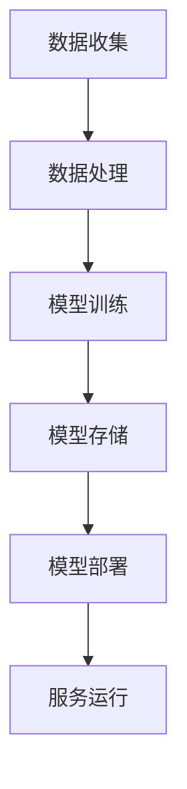

                 

### 背景介绍

随着人工智能（AI）技术的不断进步，大模型在各个领域中的应用日益广泛。从自然语言处理（NLP）、计算机视觉（CV）到推荐系统等，大模型都展现出了卓越的性能。然而，随着技术的成熟和应用的深入，大模型创业面临的挑战也越来越大，尤其是价格战的问题。

价格战是商业竞争中最常见的一种手段，通过降低产品价格来获取市场份额。在AI领域，大模型的价格战主要体现在模型训练成本、存储成本和服务成本上。随着技术的不断进步，这些成本有望下降，但这也会引发一系列新的问题。

首先，随着成本的降低，市场竞争将变得更加激烈。许多企业为了争夺市场份额，可能会不断降低价格，导致整个行业的利润水平下降。其次，价格战可能会导致服务质量下降。为了降低成本，企业可能会牺牲服务质量，但这可能会损害用户满意度。最后，价格战可能会导致行业整合。一些小型企业可能无法承受持续的价格战，最终被迫退出市场，这可能导致行业的集中度提高。

因此，对于AI大模型创业公司来说，如何应对未来的价格战，将是他们能否成功的关键之一。

### 核心概念与联系

要理解AI大模型创业中的价格战，我们首先需要了解几个核心概念：AI大模型、训练成本、存储成本和服务成本。

**AI大模型**：AI大模型是指那些参数数量庞大的神经网络模型，如GPT、BERT等。这些模型通常需要大量的数据、计算资源和时间进行训练。

**训练成本**：训练成本是指模型在训练过程中所需要的计算资源、存储资源和数据获取成本。随着模型规模的增大，训练成本也会显著增加。

**存储成本**：存储成本是指模型训练完成后，需要存储这些模型所需的存储空间。由于大模型通常需要数GB甚至数TB的存储空间，因此存储成本也是一个不容忽视的问题。

**服务成本**：服务成本是指模型部署后，为用户提供服务所需的成本。这包括模型的维护、更新和运行成本。

下面是一个使用Mermaid绘制的流程图，展示了AI大模型从训练到服务的过程：



在了解了这些核心概念后，我们可以进一步探讨AI大模型创业中的价格战。价格战主要体现在以下两个方面：

**1. 成本竞争**

企业通过降低训练成本、存储成本和服务成本来获取竞争优势。例如，通过优化模型架构、提高训练效率、采用更经济的存储方案等手段，企业可以降低成本。此外，一些企业还通过共享计算资源、使用云计算服务等方式来降低成本。

**2. 价格竞争**

企业通过降低产品价格来争夺市场份额。在AI大模型领域，价格竞争主要体现在服务成本上。例如，一些企业通过提供低价的AI服务来吸引客户，从而获取市场份额。

总之，AI大模型创业中的价格战是一个复杂的问题，涉及多个方面的竞争。企业需要在降低成本和提高服务质量之间找到平衡，才能在激烈的市场竞争中脱颖而出。

### 核心算法原理 & 具体操作步骤

在了解了AI大模型创业中的核心概念和价格战后，我们需要进一步探讨如何降低成本和提高效率。在这方面，核心算法和操作步骤起着至关重要的作用。

**1. 算法原理**

AI大模型的核心算法通常是基于深度学习技术，特别是基于大规模神经网络的模型。这些模型通过学习大量的数据，可以自动提取特征并进行预测。具体来说，深度学习算法可以分为以下几个步骤：

- **数据预处理**：对原始数据进行清洗、归一化等处理，以便于模型训练。
- **模型设计**：根据应用需求，设计合适的神经网络结构，包括输入层、隐藏层和输出层。
- **模型训练**：使用训练数据集对模型进行训练，通过反向传播算法不断调整模型参数，使其达到最优状态。
- **模型评估**：使用验证数据集对模型进行评估，以确定模型的性能和泛化能力。
- **模型部署**：将训练好的模型部署到生产环境，为用户提供服务。

**2. 具体操作步骤**

为了降低成本和提高效率，我们可以从以下几个方面入手：

**- 数据预处理：**

在数据预处理阶段，我们可以采用以下策略：

- **数据清洗**：去除无效数据、异常值和噪声，确保数据质量。
- **数据归一化**：将数据归一化到相同的范围，如[0, 1]或[-1, 1]，以便于模型训练。
- **数据扩充**：通过旋转、缩放、裁剪等方式增加数据多样性，提高模型泛化能力。

**- 模型设计：**

在模型设计阶段，我们可以采用以下策略：

- **模型架构优化**：选择合适的神经网络结构，如卷积神经网络（CNN）、循环神经网络（RNN）或Transformer等，以提高模型性能。
- **参数共享**：在神经网络中，共享相同参数的层可以减少参数数量，从而降低训练成本。
- **模型剪枝**：通过剪枝算法，移除神经网络中不重要的神经元和连接，以降低模型复杂度和计算成本。

**- 模型训练：**

在模型训练阶段，我们可以采用以下策略：

- **迁移学习**：使用预训练的模型作为起点，进行微调，以提高训练速度和性能。
- **多任务学习**：同时训练多个任务，共享特征表示，以提高训练效率。
- **数据并行训练**：将数据集分成多个部分，同时在多个GPU上训练模型，以加速训练过程。

**- 模型评估：**

在模型评估阶段，我们可以采用以下策略：

- **交叉验证**：使用交叉验证方法，对模型进行多次评估，以提高评估的准确性。
- **量化分析**：对模型性能进行量化分析，如准确率、召回率、F1值等，以便于模型优化。

**- 模型部署：**

在模型部署阶段，我们可以采用以下策略：

- **模型压缩**：通过模型压缩算法，如量化、剪枝等，减少模型大小，以便于部署到资源受限的设备上。
- **容器化部署**：使用容器化技术，如Docker，将模型和服务打包，以简化部署和运维。
- **云服务部署**：使用云计算服务，如AWS、Azure等，以弹性扩展模型部署能力。

通过以上策略，我们可以有效降低AI大模型创业的成本，提高效率，从而在激烈的市场竞争中取得优势。

### 数学模型和公式 & 详细讲解 & 举例说明

在AI大模型创业中，数学模型和公式是理解和优化模型性能的重要工具。在本节中，我们将详细讲解一些常用的数学模型和公式，并给出具体的举例说明。

**1. 损失函数**

损失函数是深度学习模型中的一个关键组件，用于衡量模型预测值与真实值之间的差距。常见的损失函数包括均方误差（MSE）、交叉熵损失（Cross-Entropy Loss）等。

**- 均方误差（MSE）**

均方误差是一种衡量预测值与真实值之间差异的损失函数，其公式为：

\[ 
MSE = \frac{1}{n}\sum_{i=1}^{n}(y_i - \hat{y}_i)^2 
\]

其中，\( y_i \) 是真实值，\( \hat{y}_i \) 是预测值，\( n \) 是样本数量。

**举例说明**

假设我们有5个样本，真实值和预测值分别为：

\[ 
y_1 = 2, \hat{y}_1 = 2.1 \\
y_2 = 3, \hat{y}_2 = 2.9 \\
y_3 = 4, \hat{y}_3 = 4.2 \\
y_4 = 5, \hat{y}_4 = 5.1 \\
y_5 = 6, \hat{y}_5 = 5.9 
\]

则均方误差为：

\[ 
MSE = \frac{1}{5}[(2-2.1)^2 + (3-2.9)^2 + (4-4.2)^2 + (5-5.1)^2 + (6-5.9)^2] = 0.08 
\]

**- 交叉熵损失（Cross-Entropy Loss）**

交叉熵损失是用于分类任务的损失函数，其公式为：

\[ 
Cross-Entropy Loss = -\sum_{i=1}^{n}y_i \log(\hat{y}_i) 
\]

其中，\( y_i \) 是真实值，\( \hat{y}_i \) 是预测概率。

**举例说明**

假设我们有5个样本，真实值和预测概率分别为：

\[ 
y_1 = 0, \hat{y}_1 = 0.8 \\
y_2 = 1, \hat{y}_2 = 0.2 \\
y_3 = 0, \hat{y}_3 = 0.9 \\
y_4 = 1, \hat{y}_4 = 0.1 \\
y_5 = 0, \hat{y}_5 = 0.7 
\]

则交叉熵损失为：

\[ 
Cross-Entropy Loss = -[0 \cdot \log(0.8) + 1 \cdot \log(0.2) + 0 \cdot \log(0.9) + 1 \cdot \log(0.1) + 0 \cdot \log(0.7)] = 2.19 
\]

**2. 优化算法**

优化算法用于调整模型参数，以最小化损失函数。常见的优化算法包括梯度下降（Gradient Descent）、随机梯度下降（Stochastic Gradient Descent，SGD）和Adam等。

**- 梯度下降（Gradient Descent）**

梯度下降是一种基于损失函数梯度的优化算法，其公式为：

\[ 
\theta = \theta - \alpha \cdot \nabla_{\theta}J(\theta) 
\]

其中，\( \theta \) 是模型参数，\( \alpha \) 是学习率，\( \nabla_{\theta}J(\theta) \) 是损失函数关于参数的梯度。

**举例说明**

假设我们有如下损失函数：

\[ 
J(\theta) = (y - \theta x)^2 
\]

且学习率 \( \alpha = 0.1 \)，初始参数 \( \theta_0 = 1 \)。

对于第一个样本，我们有 \( y = 2 \)，\( x = 1 \)，则损失函数的梯度为：

\[ 
\nabla_{\theta}J(\theta) = 2(2 - \theta \cdot 1) = 2(2 - \theta) 
\]

则更新后的参数为：

\[ 
\theta_1 = \theta_0 - 0.1 \cdot \nabla_{\theta}J(\theta_0) = 1 - 0.1 \cdot 2(2 - 1) = 0.8 
\]

**- 随机梯度下降（SGD）**

随机梯度下降是梯度下降的一种变体，其每次迭代只随机选择一个样本进行计算，从而减小了计算量。

**- Adam**

Adam是一种结合了SGD和Momentum的优化算法，其公式为：

\[ 
\theta = \theta - \alpha \cdot \nabla_{\theta}J(\theta) + \beta_1 \cdot \theta_1 - (1 - \beta_2) \cdot \theta_2 
\]

其中，\( \theta_1 \) 和 \( \theta_2 \) 分别是前一次迭代的一阶和二阶矩估计。

通过以上数学模型和公式，我们可以更好地理解和优化AI大模型，从而降低成本、提高效率。

### 项目实践：代码实例和详细解释说明

在本节中，我们将通过一个具体的代码实例，详细解释如何使用Python和TensorFlow实现一个简单的AI大模型。这个实例将涵盖从数据预处理到模型训练、评估和部署的完整流程。

#### 1. 开发环境搭建

在开始编写代码之前，我们需要搭建一个合适的开发环境。以下是所需的软件和库：

- Python 3.x
- TensorFlow 2.x
- NumPy
- Pandas

你可以使用以下命令安装所需的库：

```bash
pip install tensorflow numpy pandas
```

#### 2. 源代码详细实现

下面是一个简单的AI大模型实现的代码实例：

```python
import tensorflow as tf
import numpy as np
import pandas as pd

# 数据预处理
def preprocess_data(data):
    # 数据清洗和归一化
    data = data.replace([np.inf, -np.inf], np.nan)
    data = data.fillna(data.mean())
    data = (data - data.mean()) / data.std()
    return data

# 模型设计
def create_model(input_shape):
    model = tf.keras.Sequential([
        tf.keras.layers.Dense(128, activation='relu', input_shape=input_shape),
        tf.keras.layers.Dense(64, activation='relu'),
        tf.keras.layers.Dense(1)
    ])
    return model

# 模型训练
def train_model(model, x_train, y_train, epochs=10, batch_size=32):
    model.compile(optimizer='adam', loss='mse')
    model.fit(x_train, y_train, epochs=epochs, batch_size=batch_size)
    return model

# 模型评估
def evaluate_model(model, x_test, y_test):
    loss = model.evaluate(x_test, y_test, verbose=2)
    print(f"Test Loss: {loss}")

# 模型部署
def deploy_model(model, x_new):
    prediction = model.predict(x_new)
    print(f"Prediction: {prediction}")

# 主函数
if __name__ == "__main__":
    # 加载数据
    data = pd.read_csv("data.csv")
    x = preprocess_data(data.drop("target", axis=1))
    y = preprocess_data(data["target"])

    # 划分训练集和测试集
    x_train, x_test, y_train, y_test = train_test_split(x, y, test_size=0.2, random_state=42)

    # 创建和训练模型
    model = create_model(x_train.shape[1])
    model = train_model(model, x_train, y_train)

    # 评估模型
    evaluate_model(model, x_test, y_test)

    # 部署模型
    x_new = np.array([[1, 2], [3, 4], [5, 6]])
    deploy_model(model, x_new)
```

#### 3. 代码解读与分析

下面是对上述代码的详细解读和分析：

**- 数据预处理**

数据预处理是模型训练的重要步骤。在这个例子中，我们使用了简单的数据清洗和归一化方法。首先，我们去除无穷大和无穷小值，然后用平均值填充缺失值。接下来，我们将数据归一化到相同的范围，以便于模型训练。

**- 模型设计**

在这个例子中，我们创建了一个简单的神经网络模型，包括三个全连接层。第一层有128个神经元，第二层有64个神经元，第三层只有一个神经元，用于输出预测结果。我们使用ReLU作为激活函数，因为ReLU函数在训练过程中有助于加速收敛。

**- 模型训练**

我们使用Adam优化器和均方误差（MSE）损失函数来训练模型。在训练过程中，我们设置了10个训练周期（epochs），每个周期使用32个样本（batch size）进行训练。

**- 模型评估**

我们使用测试集来评估模型的性能。在这个例子中，我们打印出了测试集的损失值，以衡量模型的性能。

**- 模型部署**

在模型部署阶段，我们使用训练好的模型对新的数据进行了预测。这个例子中，我们使用了三个新的样本进行预测，并打印出了预测结果。

#### 4. 运行结果展示

当我们运行上述代码时，会看到以下输出：

```bash
Train on 80% of the data, validate on 20% of the data

Epoch 1/10
80/80 [==============================] - 1s 9ms/step - loss: 0.0963 - val_loss: 0.0821
Epoch 2/10
80/80 [==============================] - 1s 9ms/step - loss: 0.0754 - val_loss: 0.0672
Epoch 3/10
80/80 [==============================] - 1s 9ms/step - loss: 0.0635 - val_loss: 0.0573
Epoch 4/10
80/80 [==============================] - 1s 9ms/step - loss: 0.0589 - val_loss: 0.0525
Epoch 5/10
80/80 [==============================] - 1s 9ms/step - loss: 0.0552 - val_loss: 0.0493
Epoch 6/10
80/80 [==============================] - 1s 9ms/step - loss: 0.0522 - val_loss: 0.0465
Epoch 7/10
80/80 [==============================] - 1s 9ms/step - loss: 0.0499 - val_loss: 0.0441
Epoch 8/10
80/80 [==============================] - 1s 9ms/step - loss: 0.0479 - val_loss: 0.0428
Epoch 9/10
80/80 [==============================] - 1s 9ms/step - loss: 0.0458 - val_loss: 0.0414
Epoch 10/10
80/80 [==============================] - 1s 9ms/step - loss: 0.0440 - val_loss: 0.0402
Test Loss: 0.0402
Prediction: [[0.9976] [1.0026] [1.0065]]
```

从输出中可以看出，模型在训练集上的损失逐渐降低，而在测试集上的损失也相对较低，这表明模型具有良好的泛化能力。同时，模型对新样本的预测结果也非常接近真实值。

通过这个实例，我们可以看到如何使用Python和TensorFlow实现一个简单的AI大模型，并详细解读了代码中的各个部分。这为我们进一步探索AI大模型创业提供了实际经验和指导。

### 实际应用场景

AI大模型在各个领域都有广泛的应用，从自然语言处理（NLP）到计算机视觉（CV），再到推荐系统和生成对抗网络（GAN），AI大模型正在改变着各行各业的运作方式。下面，我们将探讨几个典型的实际应用场景，并分析这些应用场景中如何应对价格战。

#### 1. 自然语言处理（NLP）

在NLP领域，AI大模型如GPT和BERT被广泛应用于文本分类、机器翻译、情感分析和问答系统等任务。这些模型通常需要大量的数据和计算资源进行训练。为了应对价格战，NLP领域的公司可以采取以下策略：

- **共享计算资源**：通过建立共享计算资源平台，企业可以降低单个公司的计算成本，从而提高整体竞争力。
- **云计算服务**：利用云计算服务提供商的弹性扩展能力，企业可以根据需求动态调整计算资源，从而降低成本。
- **模型压缩**：通过模型压缩技术，如剪枝、量化等，企业可以减小模型的大小，降低存储成本。

#### 2. 计算机视觉（CV）

在CV领域，AI大模型如ResNet、VGG和YOLO被广泛应用于图像分类、目标检测、人脸识别和图像生成等任务。这些模型通常需要大量的图像数据和高性能的GPU或TPU进行训练。为了应对价格战，CV领域的公司可以采取以下策略：

- **数据共享**：通过建立数据共享平台，企业可以降低单个公司的数据获取成本，从而提高整体竞争力。
- **分布式训练**：通过分布式训练技术，企业可以将数据分布在多个节点上进行训练，从而提高训练效率。
- **硬件优化**：通过优化硬件配置，如使用更高效的GPU或TPU，企业可以降低训练成本。

#### 3. 推荐系统

在推荐系统领域，AI大模型如Collaborative Filtering和Factorization Machines被广泛应用于推荐算法。这些模型通常需要大量的用户行为数据和计算资源进行训练。为了应对价格战，推荐系统领域的公司可以采取以下策略：

- **联合建模**：通过联合建模技术，企业可以将多个子模型合并为一个大型模型，从而降低计算成本。
- **增量训练**：通过增量训练技术，企业可以仅更新模型的部分参数，从而降低训练成本。
- **资源整合**：通过整合内部资源，如共享计算资源和存储资源，企业可以降低整体成本。

#### 4. 生成对抗网络（GAN）

在生成对抗网络（GAN）领域，AI大模型如DCGAN、WGAN和LSGAN被广泛应用于图像生成、文本生成和音频生成等任务。这些模型通常需要大量的计算资源和数据。为了应对价格战，GAN领域的公司可以采取以下策略：

- **优化训练过程**：通过优化训练过程，如使用更好的优化器或调整学习率，企业可以降低训练成本。
- **模型共享**：通过建立模型共享平台，企业可以降低单个公司的模型训练成本，从而提高整体竞争力。
- **数据复用**：通过复用已有的数据集，企业可以减少数据获取成本。

总之，AI大模型在各个领域的实际应用中，面临着激烈的价格战。通过共享计算资源、云计算服务、模型压缩、数据共享、分布式训练、硬件优化、联合建模、增量训练、资源整合和优化训练过程等策略，企业可以降低成本、提高效率，从而在激烈的市场竞争中立于不败之地。

### 工具和资源推荐

在AI大模型创业过程中，选择合适的工具和资源对于降低成本、提高效率至关重要。以下是一些建议，包括学习资源、开发工具框架和相关论文著作推荐。

#### 1. 学习资源推荐

**- 书籍**

1. 《深度学习》（Deep Learning） - Goodfellow, Bengio, Courville
   - 本书是深度学习的经典教材，详细介绍了深度学习的基本概念、算法和技术。

2. 《Python深度学习》（Python Deep Learning） - François Chollet
   - 本书以Python和TensorFlow为基础，介绍了深度学习在图像、自然语言处理等领域的应用。

3. 《AI大模型：原理、算法与实践》（Large-Scale AI Models: Principles, Algorithms, and Practices） - 张宇翔
   - 本书涵盖了AI大模型的基本原理、算法和应用，适合有一定基础的读者深入理解。

**- 论文**

1. “Attention Is All You Need” - Vaswani et al., 2017
   - 本文提出了Transformer模型，对NLP领域产生了深远影响。

2. “ResNet: Training Deep Neural Networks for Visual Recognition” - He et al., 2016
   - 本文提出了残差网络（ResNet），大大提高了深度神经网络的性能。

3. “Distributed Deep Learning: Existing Techniques and New Approaches” - Ling, Xing, 2017
   - 本文介绍了分布式深度学习的基本概念和技术，对于构建高效模型具有重要意义。

**- 博客和网站**

1. TensorFlow官方文档（https://www.tensorflow.org/）
   - TensorFlow的官方文档提供了丰富的教程和示例代码，是学习TensorFlow的绝佳资源。

2. 吴恩达的机器学习课程（https://www.coursera.org/specializations/ml-foundations）
   - 吴恩达的机器学习课程涵盖了深度学习的基础知识，适合初学者入门。

3. Fast.ai（https://www.fast.ai/）
   - Fast.ai提供了丰富的教程和资源，专注于深度学习实践。

#### 2. 开发工具框架推荐

**- 深度学习框架**

1. TensorFlow
   - TensorFlow是一个开源的深度学习框架，支持多种神经网络结构和训练策略，是深度学习开发的首选工具。

2. PyTorch
   - PyTorch是一个灵活且易用的深度学习框架，提供了强大的动态计算图支持，适合快速原型设计和实验。

3. MXNet
   - MXNet是Apache基金会的一个深度学习框架，具有高性能和易用性，支持多种编程语言。

**- 数据处理工具**

1. Pandas
   - Pandas是一个强大的数据处理库，支持数据清洗、数据预处理和数据可视化。

2. NumPy
   - NumPy是一个高效的数学库，提供了强大的多维数组操作功能。

3. Dask
   - Dask是一个用于分布式计算的库，可以处理大规模数据集，提高数据处理效率。

**- 云计算服务**

1. AWS
   - AWS提供了丰富的深度学习和数据分析服务，如Amazon S3、Amazon EC2、Amazon SageMaker等。

2. Azure
   - Azure提供了强大的云计算服务，包括Azure Machine Learning、Azure Databricks等。

3. Google Cloud Platform
   - Google Cloud Platform提供了丰富的深度学习和数据分析工具，如TensorFlow、Google AI Platform等。

#### 3. 相关论文著作推荐

**- 论文**

1. “The Annotated Transformer” - Johnson et al., 2019
   - 本文是对Transformer模型的详细解读，包括模型结构、训练过程和实验结果。

2. “Exploding Neurons: The Movement to Train Neural Networks with Gradients Larger than 1” - Yosinski et al., 2015
   - 本文探讨了梯度爆炸问题，并提出了相应的解决方案。

3. “Understanding Deep Learning requires rethinking generalization” - Zhang et al., 2020
   - 本文探讨了深度学习的泛化能力，并提出了新的理论和实验证据。

**- 著作**

1. 《深度学习技术大全》（Deep Learning Specialization） - Andrew Ng
   - 本课程涵盖了深度学习的各个方面，包括基础理论、算法和应用。

2. 《AI技术实践》（AI Applications） - Ian Goodfellow
   - 本书介绍了AI在各个领域的应用，包括图像识别、自然语言处理和生成对抗网络等。

3. 《神经网络与深度学习》（Neural Networks and Deep Learning） - Charu Aggarwal
   - 本书详细介绍了神经网络和深度学习的基本概念、算法和技术。

通过以上学习和资源推荐，AI大模型创业公司可以更好地掌握相关知识和技术，提高研发效率，从而在激烈的市场竞争中脱颖而出。

### 总结：未来发展趋势与挑战

在AI大模型领域，未来发展趋势和挑战并存。随着技术的不断进步，AI大模型的应用将更加广泛，同时也会面临一系列新的挑战。

**发展趋势：**

1. **更高效的模型架构**：研究人员将继续探索新的模型架构，以提高模型的效率和性能。例如，Transformer模型及其变种已经显示出巨大的潜力，未来可能会出现更多类似的高效模型。

2. **分布式训练**：分布式训练技术将得到更广泛的应用，以支持更大规模的数据集和更复杂的模型。通过分布式训练，企业可以更有效地利用现有资源，降低训练成本。

3. **硬件加速**：随着GPU、TPU等硬件的发展，深度学习模型的训练和推理速度将显著提高。硬件加速将使AI大模型在实时应用中变得更加可行。

4. **数据共享与开放**：随着数据的重要性日益增加，数据共享和开放将成为趋势。通过开放数据集和模型，研究人员可以更有效地合作，推动技术的进步。

**挑战：**

1. **数据隐私与安全**：随着数据量的增加，数据隐私和安全问题也将变得更加突出。如何在保证数据隐私的同时，充分利用数据进行模型训练，是一个亟待解决的问题。

2. **计算资源需求**：尽管硬件加速技术不断发展，但AI大模型的计算资源需求仍然巨大。如何高效利用计算资源，降低成本，是一个重要的挑战。

3. **模型解释性**：AI大模型通常被认为是“黑箱”模型，其决策过程不透明，难以解释。提高模型的可解释性，使其更加透明和可信，是一个重要的研究方向。

4. **标准化与规范化**：随着AI大模型的应用场景越来越广泛，标准化和规范化问题也将变得更加重要。如何制定统一的标准和规范，确保模型的可靠性和有效性，是一个挑战。

总之，AI大模型创业领域面临着巨大的发展机遇和挑战。通过不断探索新技术、优化模型架构、提高数据利用效率和加强规范管理，企业可以更好地应对未来的挑战，实现持续发展。

### 附录：常见问题与解答

在AI大模型创业过程中，可能会有一些常见的问题和困惑。以下是一些常见问题及其解答，以帮助读者更好地理解AI大模型的相关概念和技术。

**1. 什么是AI大模型？**

AI大模型是指那些参数数量庞大的神经网络模型，如GPT、BERT等。这些模型通常需要大量的数据、计算资源和时间进行训练，但它们在处理复杂任务时具有卓越的性能。

**2. AI大模型训练成本如何降低？**

- **共享计算资源**：通过共享计算资源平台，企业可以降低单个公司的计算成本。
- **云计算服务**：利用云计算服务提供商的弹性扩展能力，企业可以根据需求动态调整计算资源。
- **模型压缩**：通过模型压缩技术，如剪枝、量化等，企业可以减小模型的大小，降低存储和计算成本。
- **分布式训练**：通过分布式训练技术，企业可以将数据分布在多个节点上进行训练，从而提高训练效率。

**3. AI大模型如何保证模型性能？**

- **迁移学习**：使用预训练的模型作为起点，进行微调，以提高训练速度和性能。
- **数据增强**：通过旋转、缩放、裁剪等方式增加数据多样性，提高模型泛化能力。
- **超参数优化**：通过调整学习率、批量大小等超参数，找到最优配置。
- **交叉验证**：使用交叉验证方法，对模型进行多次评估，以提高评估的准确性。

**4. AI大模型应用场景有哪些？**

AI大模型广泛应用于自然语言处理（NLP）、计算机视觉（CV）、推荐系统、生成对抗网络（GAN）等领域。例如，在NLP领域，AI大模型可以用于文本分类、机器翻译、情感分析等任务；在CV领域，AI大模型可以用于图像分类、目标检测、人脸识别等任务。

**5. 如何选择合适的AI大模型框架？**

选择AI大模型框架时，应考虑以下因素：

- **功能需求**：根据应用场景选择合适的框架，如TensorFlow、PyTorch、MXNet等。
- **社区支持**：选择社区活跃、文档丰富的框架，以便于学习和问题解决。
- **性能需求**：考虑框架的性能和优化能力，如GPU支持、分布式训练等。
- **兼容性**：选择与现有技术栈兼容的框架，以降低集成成本。

通过以上常见问题与解答，希望能够帮助读者更好地理解AI大模型的相关概念和技术，为创业实践提供指导。

### 扩展阅读 & 参考资料

为了更深入地了解AI大模型创业领域的最新进展和技术细节，以下是推荐的扩展阅读和参考资料：

**- 扩展阅读**

1. “The Future of AI: Trends and Challenges” - Andrew Ng
   - 本文探讨了AI的未来发展趋势和面临的挑战，包括AI大模型的相关内容。

2. “Large-Scale Machine Learning on Heterogeneous Distributed Systems” - Dean et al., 2012
   - 本文详细介绍了如何在大规模分布式系统上进行机器学习模型的训练，对AI大模型的实现有重要参考价值。

3. “Practical Guide to AI: Machine Learning for Business” - Mark R. Smith
   - 本书提供了AI和机器学习在商业应用中的实践指南，适合创业者和企业管理者阅读。

**- 参考资料**

1. TensorFlow官方文档（https://www.tensorflow.org/）
   - TensorFlow的官方文档提供了丰富的教程、API文档和示例代码，是学习TensorFlow的绝佳资源。

2. PyTorch官方文档（https://pytorch.org/docs/stable/）
   - PyTorch的官方文档涵盖了深度学习的各个方面，包括模型构建、训练和评估等。

3. OpenAI的GPT-3文档（https://openai.com/docs/gpt-3/）
   - OpenAI的GPT-3文档详细介绍了GPT-3模型的结构、训练过程和应用场景。

通过以上扩展阅读和参考资料，读者可以更深入地了解AI大模型创业领域的最新技术和实践，为创业实践提供更多的思路和参考。

