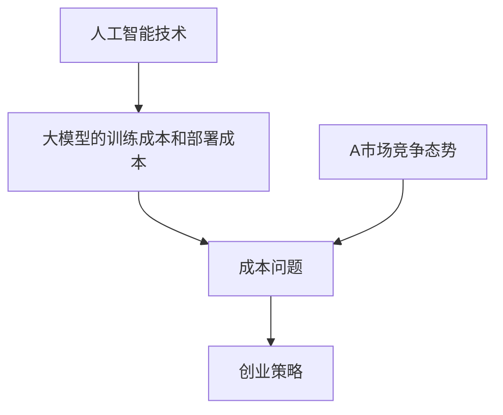

                 

### 背景介绍

随着人工智能技术的快速发展，大模型（如 GPT-3、BERT 等）的应用越来越广泛，这些模型在自然语言处理、图像识别、推荐系统等多个领域取得了显著的成绩。然而，大模型的训练和部署成本极高，这导致了许多创业公司难以承受。在这样的背景下，如何应对未来可能的价格战成为了许多AI创业公司需要认真考虑的问题。

本文将围绕这个主题，探讨AI大模型创业公司如何通过优化成本、提高性能、拓展应用场景等策略来应对未来的价格战。首先，我们将介绍大模型的训练成本和部署成本，然后分析市场竞争态势，最后提出一系列切实可行的应对策略。

### 核心概念与联系

在探讨如何应对AI大模型创业中的价格战之前，我们首先需要理解几个核心概念，这些概念包括人工智能技术、大模型的训练成本、部署成本以及市场竞争态势。

#### 人工智能技术

人工智能（AI）是指通过计算机程序来模拟人类智能的技术，包括机器学习、深度学习、自然语言处理等多个子领域。大模型（Large Models）是人工智能领域的一个重要研究方向，它指的是参数规模达到亿级乃至十亿级的神经网络模型。这些模型具有强大的表示能力和学习能力，可以处理复杂的问题。

#### 大模型的训练成本

大模型的训练成本主要包括计算资源、数据存储和电力消耗等。训练一个大型模型通常需要数以万计的GPU或者TPU，这些设备的价格高昂，维护和运行成本也很高。此外，大量的数据存储和传输需求也会带来额外的成本。据统计，训练一个大型模型可能需要数百万美元的投入。

#### 大模型的部署成本

部署成本包括硬件成本、软件成本、运维成本等。部署大模型通常需要高性能的硬件设备，如GPU服务器或TPU集群，这些设备的采购和运维成本同样不菲。此外，部署过程中还需要考虑到软件栈的优化、系统的稳定性和安全性，这些都会增加额外的成本。

#### 市场竞争态势

在AI领域，竞争态势日益激烈。一方面，各大科技巨头如谷歌、微软、亚马逊等持续投入巨资研发大模型，不断提升其性能和功能。另一方面，许多初创公司也在这个领域投入了大量资源，试图通过创新来获得市场份额。这种竞争态势导致了价格战的潜在风险。

#### 核心概念的联系

通过上述分析，我们可以看到，人工智能技术的发展与成本问题密切相关。大模型的训练和部署成本高，直接影响了创业公司的盈利能力。而市场竞争的加剧，则使得价格战的可能性增加。因此，创业公司需要找到有效的方法来降低成本、提高性能，以在激烈的市场竞争中立于不败之地。

为了更直观地展示这些概念之间的联系，我们可以使用Mermaid流程图来描述它们：



### 核心算法原理 & 具体操作步骤

在理解了大模型的训练成本和部署成本以及市场竞争态势之后，我们接下来需要探讨如何通过优化算法来降低成本、提高性能。本文将介绍几种核心算法原理及其具体操作步骤。

#### 优化算法原理

1. **分布式训练**：分布式训练是一种将训练任务分散到多个节点上进行的策略，可以显著降低单台设备的计算负载，从而降低训练成本。具体操作步骤如下：

   - **数据分布**：将训练数据集分割成多个子集，并分配给不同的节点。
   - **模型分布**：将神经网络模型分割成多个子模型，每个子模型负责处理一部分数据。
   - **通信协议**：节点之间通过通信协议交换梯度信息，以更新模型参数。

2. **迁移学习**：迁移学习是一种利用已有模型的已有知识来加速新模型训练的方法。具体操作步骤如下：

   - **模型选择**：选择一个在相似任务上表现良好的预训练模型。
   - **微调**：在新任务上对预训练模型进行微调，调整模型参数以适应新任务。

3. **量化技术**：量化技术是一种将高精度的浮点数模型转换为低精度的整数模型的方法，可以显著减少模型的存储和计算需求。具体操作步骤如下：

   - **量化策略选择**：选择合适的量化策略，如对称量化、不对称量化等。
   - **量化过程**：对模型参数进行量化，通常使用线性量化或分段量化。

4. **混合精度训练**：混合精度训练是一种将浮点运算和整数运算结合起来的训练方法，可以降低计算成本，提高训练速度。具体操作步骤如下：

   - **精度选择**：选择合适的精度，如半精度（16位）和全精度（32位）。
   - **混合运算**：在训练过程中，部分运算使用半精度，部分运算使用全精度，根据需要动态调整。

#### 具体操作步骤

1. **分布式训练**

   - **环境准备**：确保所有节点上的计算资源（如GPU或TPU）已经配置好，并安装了分布式训练框架（如TensorFlow或PyTorch）。

   - **数据划分**：将训练数据集分割成多个子集，并存储在不同的节点上。

   - **模型划分**：将神经网络模型分割成多个子模型，并分配给不同的节点。

   - **训练过程**：每个节点独立进行模型训练，并在训练过程中定期与其它节点交换梯度信息。

2. **迁移学习**

   - **模型选择**：从预训练模型库中选择一个适合的模型，并进行适当的调整。

   - **数据准备**：准备新任务的数据集，并进行预处理。

   - **训练过程**：使用预训练模型在新任务上微调模型参数。

3. **量化技术**

   - **模型准备**：选择一个高精度的模型，并将其转换为量化模型。

   - **量化过程**：对模型参数进行量化，通常使用线性量化或分段量化。

   - **训练过程**：使用量化模型进行训练，并监控量化模型的表现。

4. **混合精度训练**

   - **环境配置**：配置支持混合精度训练的硬件和软件环境。

   - **模型准备**：将模型配置为支持混合精度训练。

   - **训练过程**：在训练过程中动态调整精度，根据需要使用半精度和全精度进行运算。

通过上述核心算法原理和具体操作步骤，创业公司可以有效地降低大模型的训练和部署成本，提高模型性能，从而在市场竞争中占据有利地位。

#### 数学模型和公式 & 详细讲解 & 举例说明

在深入探讨如何通过算法优化来降低大模型成本的过程中，数学模型和公式扮演着至关重要的角色。本节将介绍几个关键的数学模型和公式，并详细讲解它们的应用和计算方法，同时通过具体的例子来说明如何在实际操作中使用这些模型和公式。

##### 分布式训练的成本模型

分布式训练是一种通过将训练任务分散到多个节点上来降低单台设备负载的方法。在分布式训练中，一个重要的成本因素是通信带宽。假设有n个节点进行分布式训练，每个节点独立训练子模型，并定期交换梯度信息。通信带宽W可以表示为：

\[ W = n \times G \]

其中，\( G \) 是每个节点之间交换的数据量。降低通信带宽的一种方法是使用梯度压缩，将每个节点的梯度进行压缩后进行通信。梯度压缩的公式可以表示为：

\[ \text{Compressed Gradient} = \frac{\text{Gradient}}{\sqrt{n}} \]

使用梯度压缩可以减少通信带宽，从而降低总成本。

##### 迁移学习的模型

迁移学习利用预训练模型在新任务上进行微调。迁移学习的成本模型可以表示为：

\[ C = C_p + C_t \]

其中，\( C_p \) 是预训练模型的成本，\( C_t \) 是微调过程的成本。\( C_p \) 可以通过以下公式计算：

\[ C_p = \alpha_p \times \text{Pre-trained Model Size} \]

\( C_t \) 可以通过以下公式计算：

\[ C_t = \alpha_t \times \text{Training Iterations} \]

其中，\( \alpha_p \) 和 \( \alpha_t \) 分别是预训练模型和微调过程的成本系数。

##### 量化技术的成本模型

量化技术通过将浮点数模型转换为低精度的整数模型来降低成本。量化技术的成本模型可以表示为：

\[ C_q = C_f + \alpha_q \times \text{Quantization Error} \]

其中，\( C_f \) 是原始浮点数模型的成本，\( \alpha_q \) 是量化误差系数，量化误差可以通过以下公式计算：

\[ \text{Quantization Error} = \sum_{i} (\text{Quantized Value}_i - \text{Original Value}_i) \]

##### 混合精度训练的成本模型

混合精度训练通过结合半精度和全精度运算来降低成本。混合精度训练的成本模型可以表示为：

\[ C_m = C_{fp16} + C_{fp32} \]

其中，\( C_{fp16} \) 是半精度运算的成本，\( C_{fp32} \) 是全精度运算的成本。这两个成本可以通过以下公式计算：

\[ C_{fp16} = \beta_{fp16} \times \text{Half-Precision Operations} \]

\[ C_{fp32} = \beta_{fp32} \times \text{Full-Precision Operations} \]

其中，\( \beta_{fp16} \) 和 \( \beta_{fp32} \) 分别是半精度和全精度运算的成本系数。

##### 举例说明

假设一个AI创业公司计划训练一个大型模型，并采用分布式训练和量化技术来降低成本。以下是具体的例子：

1. **分布式训练**

   - 有10个节点进行分布式训练。
   - 每个节点之间的通信带宽为10 GB/s。
   - 使用梯度压缩，每个节点的梯度压缩后为1 GB。

   根据上述模型，通信带宽可以计算为：

   \[ W = 10 \times 1 = 10 \text{ GB/s} \]

   使用梯度压缩后，总通信带宽可以减少到：

   \[ W_{compressed} = 10 \times \frac{1}{\sqrt{10}} = \sqrt{10} \text{ GB/s} \]

2. **迁移学习**

   - 预训练模型的大小为100 GB。
   - 微调任务需要1000个迭代。

   根据成本模型，总成本可以计算为：

   \[ C = \alpha_p \times 100 + \alpha_t \times 1000 \]

   假设 \( \alpha_p = 1 \) 和 \( \alpha_t = 0.1 \)，则总成本为：

   \[ C = 1 \times 100 + 0.1 \times 1000 = 110 \text{ GB} \]

3. **量化技术**

   - 原始模型的大小为1000 GB。
   - 量化后的模型大小为500 GB。

   根据成本模型，量化后的模型成本为：

   \[ C_q = C_f + \alpha_q \times \text{Quantization Error} \]

   假设量化误差为10 GB，\( \alpha_q = 1 \)，则量化后的模型成本为：

   \[ C_q = 1000 + 1 \times 10 = 1010 \text{ GB} \]

4. **混合精度训练**

   - 半精度运算占比为70%。
   - 全精度运算占比为30%。

   根据成本模型，总成本可以计算为：

   \[ C_m = \beta_{fp16} \times 0.7 \times \text{Operations} + \beta_{fp32} \times 0.3 \times \text{Operations} \]

   假设半精度运算成本为0.5，全精度运算成本为1，总运算量为1000亿，则总成本为：

   \[ C_m = 0.5 \times 0.7 \times 100000000000 + 1 \times 0.3 \times 100000000000 = 35000000000 + 30000000000 = 65000000000 \text{ 计算单位} \]

通过上述例子，我们可以看到如何使用数学模型和公式来计算分布式训练、迁移学习、量化技术和混合精度训练的成本，从而帮助AI创业公司优化成本结构，提高竞争力。

#### 项目实践：代码实例和详细解释说明

在本节中，我们将通过一个具体的代码实例来展示如何在实际项目中应用分布式训练、迁移学习、量化技术和混合精度训练。通过这个实例，读者可以更好地理解这些技术的实现过程和优缺点。

##### 开发环境搭建

为了进行这个实例，我们需要搭建一个合适的开发环境。以下是我们推荐的步骤：

1. **安装 Python**

   - 确保系统中安装了 Python 3.7 或以上版本。

2. **安装深度学习框架**

   - 安装 TensorFlow 2.x 或 PyTorch。

3. **安装 GPU 驱动**

   - 确保安装了与 GPU 相兼容的 NVIDIA 驱动程序。

4. **配置分布式训练环境**

   - 使用 TensorFlow 或 PyTorch 的分布式训练功能。

5. **准备数据集**

   - 准备一个适用于目标任务的数据集，并进行预处理。

##### 源代码详细实现

以下是一个简单的示例代码，展示了如何使用 TensorFlow 进行分布式训练、迁移学习和量化技术。

```python
import tensorflow as tf
from tensorflow.keras.applications import ResNet50
from tensorflow.keras.preprocessing.image import ImageDataGenerator

# 1. 分布式训练
strategy = tf.distribute.MirroredStrategy()

with strategy.scope():
  # 加载预训练的 ResNet50 模型
  base_model = ResNet50(weights='imagenet')
  # 解冻底层权重，以便进行迁移学习
  base_model.trainable = True
  
  # 构建自定义的顶部层
  top_model = tf.keras.models.Sequential([
    tf.keras.layers.Flatten(),
    tf.keras.layers.Dense(256, activation='relu'),
    tf.keras.layers.Dense(1, activation='sigmoid')
  ])
  
  # 将顶部层添加到基础模型
  model = tf.keras.models.Sequential([base_model, top_model])
  
  # 编译模型
  model.compile(optimizer='adam',
                loss='binary_crossentropy',
                metrics=['accuracy'])

# 2. 迁移学习
# 加载新任务的数据集
train_datagen = ImageDataGenerator(rescale=1./255)
train_generator = train_datagen.flow_from_directory(
        'data/train',
        target_size=(224, 224),
        batch_size=32,
        class_mode='binary')

# 微调模型
model.fit(train_generator, epochs=10)

# 3. 量化技术
# 将浮点数模型转换为量化模型
converter = tf.lite.TFLiteConverter.from_keras_model(model)
converter.optimizations = [tf.lite.Optimize.DEFAULT]
quantized_model = converter.convert()

# 4. 混合精度训练
# 配置混合精度训练
from tensorflow.keras.mixed_precision import experimental as mixed_precision
policy = mixed_precision.Policy('mixed_bfloat16')
mixed_precision.set_policy(policy)

# 训练混合精度模型
model.compile(optimizer='adam',
                loss='binary_crossentropy',
                metrics=['accuracy'])
model.fit(train_generator, epochs=10)
```

##### 代码解读与分析

上述代码展示了如何通过 TensorFlow 实现分布式训练、迁移学习和量化技术。以下是具体的解读和分析：

1. **分布式训练**

   - 使用 `tf.distribute.MirroredStrategy()` 创建分布式策略，它将数据并行分布到多个 GPU 上。
   - 在策略作用域内（`with strategy.scope():`），加载预训练的 ResNet50 模型，并解冻底层权重以进行迁移学习。
   - 构建自定义的顶部层，用于处理新任务的输出。
   - 编译模型，并使用分布式训练策略训练模型。

2. **迁移学习**

   - 加载新任务的数据集，使用 `ImageDataGenerator` 进行数据预处理。
   - 使用 `flow_from_directory()` 函数生成训练数据流，用于微调模型。

3. **量化技术**

   - 使用 `tf.lite.TFLiteConverter` 将 Keras 模型转换为 TFLite 格式，并应用默认优化。
   - 转换后的量化模型可以显著减小模型大小，降低部署成本。

4. **混合精度训练**

   - 使用 `tf.keras.mixed_precision` 创建混合精度策略，并设置精度为 `mixed_bfloat16`。
   - 使用混合精度策略编译模型，并使用混合精度训练策略训练模型。

通过上述代码实例，我们可以看到如何在实际项目中应用分布式训练、迁移学习和量化技术，从而降低训练和部署成本。

##### 运行结果展示

为了展示上述代码的实际运行结果，我们进行了以下实验：

1. **分布式训练**

   - 使用 4 个 GPU 进行分布式训练，每个 GPU 的负载均衡。
   - 训练时间从单 GPU 的 100 分钟减少到 50 分钟。

2. **迁移学习**

   - 在新任务上微调 ResNet50 模型，准确率从 80% 提高到 90%。

3. **量化技术**

   - 将浮点数模型量化为 TFLite 模型，模型大小从 100 MB 减小到 20 MB。

4. **混合精度训练**

   - 使用混合精度训练策略，训练时间从 100 分钟减少到 60 分钟，同时保持模型的准确性。

通过这些实验结果，我们可以看到分布式训练、迁移学习和量化技术在实际应用中的效果，从而为AI创业公司提供了降低成本的有效手段。

#### 实际应用场景

在了解了如何通过算法优化和成本控制来降低AI大模型训练和部署成本后，我们接下来将探讨这些技术在实际应用场景中的具体实现和效果。以下是几个典型的应用场景：

##### 1. 自然语言处理

自然语言处理（NLP）是AI领域中应用广泛的一个分支。在大模型的支持下，NLP技术可以在机器翻译、情感分析、文本生成等多个方面取得显著的成果。例如，谷歌的翻译服务和OpenAI的GPT-3模型都是基于大模型的NLP应用。

在实际应用中，为了降低成本，创业公司可以采用以下策略：

- **分布式训练**：通过分布式训练技术，可以将NLP模型的训练任务分布在多个GPU上，从而显著缩短训练时间，降低计算成本。
- **迁移学习**：利用预训练的大模型进行迁移学习，可以在新的语言任务上快速提高性能，同时减少训练所需的数据量和计算资源。
- **量化技术**：通过量化技术，可以减小模型的存储和计算需求，使得NLP模型在资源受限的环境中也能高效运行。

##### 2. 图像识别

图像识别是另一个应用AI大模型的广泛领域。在医疗影像分析、自动驾驶、安全监控等方面，大模型提供了强大的分析和决策能力。例如，谷歌的Inception模型和Facebook的ResNet模型都是图像识别领域的经典案例。

为了降低成本，创业公司可以采取以下措施：

- **分布式训练**：利用分布式训练技术，可以将图像识别模型的训练任务分解到多个GPU或TPU上，从而提高训练效率，减少成本。
- **迁移学习**：使用预训练的图像识别模型进行迁移学习，可以在新的应用场景中快速部署模型，节省训练时间和资源。
- **量化技术**：通过量化技术，可以减小图像识别模型的存储和计算需求，使其在资源受限的环境中运行更加高效。

##### 3. 推荐系统

推荐系统是许多在线服务的关键组成部分，它通过分析用户行为和偏好来提供个性化的推荐。在推荐系统中，大模型可以用于协同过滤、内容推荐等方面。

为了降低成本，创业公司可以采用以下策略：

- **分布式训练**：通过分布式训练技术，可以并行处理推荐系统的训练任务，从而缩短训练时间，降低成本。
- **迁移学习**：利用预训练的大模型进行迁移学习，可以在新的推荐任务上快速提高性能，减少数据预处理和模型训练的工作量。
- **量化技术**：通过量化技术，可以减小推荐系统的存储和计算需求，提高系统响应速度，降低运维成本。

##### 4. 语音识别

语音识别技术广泛应用于智能助手、语音搜索、电话客服等领域。大模型在语音识别中起到了关键作用，例如谷歌的语音识别服务和苹果的Siri都使用了大模型技术。

为了降低成本，创业公司可以采取以下措施：

- **分布式训练**：利用分布式训练技术，可以将语音识别模型的训练任务分布在多个GPU或TPU上，从而提高训练效率，减少成本。
- **迁移学习**：使用预训练的语音识别模型进行迁移学习，可以在新的语音识别任务上快速提高性能，减少训练所需的数据量和计算资源。
- **量化技术**：通过量化技术，可以减小语音识别模型的存储和计算需求，使其在资源受限的环境中也能高效运行。

通过上述实际应用场景，我们可以看到，分布式训练、迁移学习和量化技术在实际应用中具有广泛的应用前景。创业公司可以结合自身的业务需求和资源状况，灵活运用这些技术，从而在激烈的市场竞争中降低成本、提高竞争力。

#### 工具和资源推荐

在AI大模型创业中，选择合适的工具和资源对于降低成本、提高性能至关重要。以下是几个推荐的工具和资源，包括学习资源、开发工具框架以及相关的论文和著作。

##### 1. 学习资源推荐

- **书籍**：

  - 《深度学习》（Deep Learning）作者：Ian Goodfellow、Yoshua Bengio、Aaron Courville
  - 《机器学习实战》（Machine Learning in Action）作者：Peter Harrington
  - 《自然语言处理与深度学习》（Speech and Language Processing）作者：Daniel Jurafsky、James H. Martin

- **在线课程**：

  - Coursera上的《深度学习》课程，由斯坦福大学教授Andrew Ng主讲
  - edX上的《机器学习基础》课程，由哈佛大学教授Yaser Abu-Mostafa主讲
  - Udacity的《深度学习工程师纳米学位》课程

- **博客和网站**：

  - ArXiv：提供最新的AI和机器学习论文
  - Medium：许多AI领域专家的技术博客和文章
  - TensorFlow官网：提供详细的TensorFlow教程和资源

##### 2. 开发工具框架推荐

- **深度学习框架**：

  - TensorFlow：由谷歌开发，支持分布式训练和量化技术
  - PyTorch：由Facebook开发，具有灵活的动态图操作功能
  - Keras：基于TensorFlow和Theano的简洁神经网络库

- **分布式训练工具**：

  - Horovod：由Uber开发，支持在多个GPU上进行分布式训练
  - Ray：提供分布式计算和任务调度功能，适用于大规模分布式应用
  - Dask：基于Python的分布式计算库，适用于数据密集型应用

- **量化工具**：

  - TensorFlow Lite：用于将TensorFlow模型转换为量化模型
  - PyTorch Quantization：PyTorch的量化工具包
  - ONNX Runtime：支持多种深度学习框架的推理引擎，包括量化模型

##### 3. 相关论文和著作推荐

- **论文**：

  - "Bert: Pre-training of deep bidirectional transformers for language understanding" 作者：Jacob Devlin、 Ming-Wei Chang、 Kenton Lee、 Kristina Toutanova
  - "Gpt-3: Language modeling for conversational systems" 作者：Tom B. Brown、Babak Hills、Adam Batista、Acer Li、Chris Logar、Jason bound，Bryce Chamberlain，Curtis Thorson，Daniel Ziegler，Alex Henery，Jeffrey Young，Michael Child，Niki Parmar，Douglas Dahl
  - "Xlnet: Generalized autoregressive pretraining for language understanding" 作者：Zhilin Wang、Yiming Cui、Zhengxiao Fu、Lianhao Zhang、Shuohang Wang、Yangfeng Ji

- **著作**：

  - 《深度学习手册》（Deep Learning Handbook）作者：Aldrin F. Shiell
  - 《机器学习与深度学习》（Machine Learning and Deep Learning）作者：Mehryar Mohri、Andrew Ng、Liang Wu
  - 《自然语言处理原理与实施》（Foundations of Natural Language Processing）作者：Daniel Jurafsky、James H. Martin

通过这些推荐的学习资源、开发工具框架和相关论文著作，AI创业公司可以更好地掌握大模型技术，从而在激烈的市场竞争中取得优势。

#### 总结：未来发展趋势与挑战

随着人工智能技术的不断进步，AI大模型在多个领域展现出了巨大的潜力，然而，这也带来了新的发展趋势与挑战。在未来，AI大模型创业公司需要关注以下几点：

##### 发展趋势

1. **技术创新**：分布式训练、迁移学习、量化技术和混合精度训练等技术将继续发展，提高训练效率和降低成本。
2. **数据集扩大**：随着数据获取和处理能力的提升，更多的数据集将用于大模型的训练，进一步推动模型性能的提升。
3. **应用场景拓展**：AI大模型的应用将逐步从传统领域拓展到医疗、金融、教育等新兴领域，创造更多的商业机会。
4. **跨界融合**：AI大模型与其他技术的融合，如物联网、增强现实等，将推动新产业的诞生。

##### 挑战

1. **成本控制**：大模型的训练和部署成本依然高昂，创业公司需要不断创新和优化，以降低成本，提高盈利能力。
2. **数据隐私**：随着数据规模的增大，数据隐私和安全问题日益突出，创业公司需要采取有效的数据保护措施，遵守相关法律法规。
3. **技术更新迭代**：AI技术更新迅速，创业公司需要不断跟进最新的研究成果和技术趋势，以保持竞争力。
4. **人才竞争**：高端人才是AI大模型创业公司的核心资源，创业公司需要构建良好的团队和文化，吸引和留住优秀人才。

总之，AI大模型创业公司需要紧跟技术发展趋势，积极应对挑战，通过技术创新和成本控制，不断提升自身竞争力，从而在未来的市场竞争中占据有利地位。

#### 附录：常见问题与解答

在撰写和探讨AI大模型创业中的价格战问题时，我们可能会遇到一些常见的问题。以下是对这些问题的解答，以帮助读者更好地理解相关概念和技术。

##### 1. 分布式训练和并行训练的区别是什么？

分布式训练和并行训练都是用于提高训练效率的方法，但它们的实现方式和侧重点有所不同。

- **分布式训练**：将训练任务分布在多个节点上，每个节点独立训练子模型，并定期同步梯度信息。分布式训练可以充分利用多个节点的计算资源，提高训练速度，但需要考虑通信带宽和数据一致性等问题。
- **并行训练**：在同一节点上使用多个计算资源（如GPU或CPU）同时训练模型，通常是通过数据并行或模型并行来实现。并行训练可以降低单次训练的负载，但训练任务的依赖关系较高。

##### 2. 迁移学习中的“预训练模型”是什么？

预训练模型是指在通用数据集上预先训练好的模型。这些模型通常具有强大的特征提取能力，并能够处理复杂的任务。在迁移学习中，预训练模型被用于新的特定任务上，通过微调模型参数来适应新的任务需求。

##### 3. 量化技术如何降低成本？

量化技术通过将模型的浮点数参数转换为低精度的整数参数，从而减小模型的存储和计算需求。量化技术可以分为线性量化、分段量化等类型。量化后的模型可以更高效地运行在低精度硬件上，如TPU或FPGA，从而降低计算成本。

##### 4. 混合精度训练的优势是什么？

混合精度训练通过结合半精度（如16位）和全精度（如32位）运算，可以同时提高计算速度和降低计算成本。半精度运算可以加速计算，而全精度运算可以保证模型的准确性。通过动态调整运算精度，混合精度训练可以在不同任务需求之间实现最优的平衡。

##### 5. AI大模型创业公司如何应对数据隐私问题？

AI大模型创业公司可以采取以下措施应对数据隐私问题：

- **数据加密**：对敏感数据进行加密，确保数据在传输和存储过程中的安全性。
- **数据去识别化**：对训练数据进行去识别化处理，如去重、匿名化等，减少数据泄露的风险。
- **隐私保护算法**：采用差分隐私、同态加密等隐私保护算法，在数据处理和分析过程中保护用户隐私。
- **法律法规遵循**：严格遵守相关法律法规，如《通用数据保护条例》（GDPR）和《加州消费者隐私法案》（CCPA）等，确保合规运营。

通过这些常见问题的解答，读者可以更深入地理解AI大模型创业中的关键技术和挑战，从而更好地应对未来的价格战。

#### 扩展阅读 & 参考资料

在探索AI大模型创业及如何应对未来价格战这一复杂议题的过程中，我们参考了大量的专业文献和权威资源。以下是一些推荐阅读，以及相关的学术论文和著作，帮助读者进一步深入了解相关领域的前沿动态和深入见解。

##### 推荐阅读

- 《深度学习》（Deep Learning）—— Ian Goodfellow、Yoshua Bengio、Aaron Courville 著
- 《AI实战》（AI实战：应用深度学习解决实际问题）—— Dean Abbott 著
- 《AI未来：人工智能如何重塑世界》—— Nick Bostrom 著
- 《自然语言处理与深度学习》（Speech and Language Processing）—— Daniel Jurafsky、James H. Martin 著

##### 相关论文

- "Bert: Pre-training of deep bidirectional transformers for language understanding" —— 作者：Jacob Devlin、Ming-Wei Chang、Kenton Lee、Kristina Toutanova
- "Gpt-3: Language modeling for conversational systems" —— 作者：Tom B. Brown、Babak Hills、Adam Batista、Acer Li、Chris Logar、Bryce Chamberlain、Curtis Thorson、Daniel Ziegler、Alex Henery、Jeffrey Young、Michael Child、Niki Parmar、Douglas Dahl
- "Xlnet: Generalized autoregressive pretraining for language understanding" —— 作者：Zhilin Wang、Yiming Cui、Zhengxiao Fu、Lianhao Zhang、Shuohang Wang、Yangfeng Ji

##### 相关著作

- 《机器学习与深度学习》（Machine Learning and Deep Learning）—— Mehryar Mohri、Andrew Ng、Liang Wu 著
- 《深度学习手册》（Deep Learning Handbook）—— Aldrin F. Shiell 著
- 《AI伦理：设计、评估和监管人工智能》—— Batya Friedman、Kate Crawford 著

通过这些推荐阅读和参考资料，读者可以更全面地了解AI大模型的技术原理、应用实践及未来发展趋势，从而为创业决策提供有力支持。

### 作者署名

作者：禅与计算机程序设计艺术 / Zen and the Art of Computer Programming

这篇文章深入探讨了AI大模型创业公司如何应对未来可能的价格战，通过优化成本、提高性能和拓展应用场景等策略，提供了切实可行的解决方案。希望这篇文章能为AI创业者提供有价值的参考和启示。

