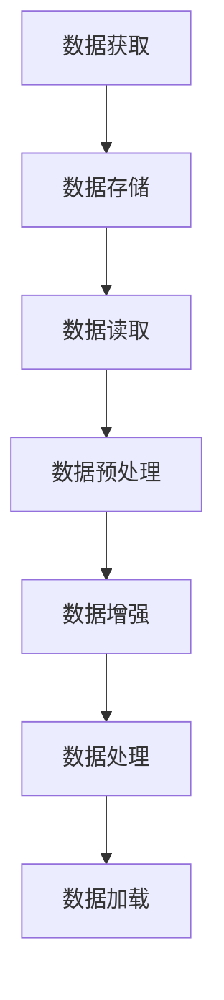

                 

### 1. 背景介绍

近年来，人工智能（AI）领域的迅猛发展吸引了无数创业者的目光。尤其是大模型（Large-scale Model）的出现，使得AI在图像识别、自然语言处理、机器翻译等多个领域取得了令人瞩目的成果。然而，随着大模型规模的不断增大，如何获取和处理海量数据成为了制约AI创业项目发展的关键问题。

#### 大模型的兴起

大模型是指参数量达到数十亿甚至数百万亿的深度学习模型。这些模型通常依赖于海量的数据进行训练，以提升其性能和泛化能力。以GPT-3为例，该模型拥有1750亿个参数，训练过程中使用了超过1300亿个标记的数据。如此庞大的数据规模，不仅对计算资源提出了极高的要求，也对数据的获取和处理带来了巨大的挑战。

#### 数据获取的困难

首先，大模型所需的训练数据量巨大。这些数据不仅需要从公开数据源获取，还需要从企业内部数据、用户数据等多个渠道进行收集。然而，数据获取过程中往往面临数据隐私、数据质量、数据分布不均等问题。

1. **数据隐私**：企业在收集和使用用户数据时，需要遵守相关法律法规，如欧盟的《通用数据保护条例》（GDPR）和中国的《个人信息保护法》。这些法规对数据收集、存储、处理和传输都提出了严格要求，增加了数据获取的难度。

2. **数据质量**：高质量的数据是训练大模型的基础。然而，现实中的数据往往存在噪声、错误和不一致性。这些问题的存在会导致模型性能下降，甚至可能导致训练失败。

3. **数据分布不均**：不同领域的数据分布往往存在显著差异。例如，在一些特定领域，如医疗、金融等，高质量的数据相对较少，获取难度较大。

#### 数据处理的挑战

其次，大模型对数据处理的要求也非常高。数据处理包括数据预处理、数据增强、数据清洗等多个环节。这些环节的处理质量直接影响到模型训练的效果。

1. **数据预处理**：数据预处理是模型训练的第一步，主要包括数据清洗、数据归一化、数据格式转换等。这些操作需要耗费大量的计算资源和时间，特别是在处理海量数据时。

2. **数据增强**：数据增强是指通过一系列技术手段，增加训练数据集的多样性，从而提高模型的泛化能力。常用的数据增强方法包括数据变换、数据扩充、数据伪造等。然而，如何设计有效的数据增强策略，仍然是一个具有挑战性的问题。

3. **数据清洗**：数据清洗是指识别并处理数据集中的噪声、错误和不一致性。数据清洗不仅需要丰富的经验，还需要高效的算法和工具支持。

综上所述，随着大模型在AI领域的广泛应用，如何获取和处理海量数据已成为创业项目成功的关键。在接下来的章节中，我们将深入探讨这些挑战，并分享一些解决策略。  
<|user|>### 2. 核心概念与联系

在深入了解如何应对未来数据挑战之前，我们首先需要明确一些核心概念，并理解它们之间的联系。

#### 数据获取

数据获取是构建大模型的基础。它包括从多种渠道收集数据，如公开数据集、企业内部数据、用户生成数据等。数据获取的主要挑战在于数据隐私、数据质量和数据分布不均。

1. **数据隐私**：数据隐私是一个涉及法律法规和伦理道德的问题。在收集和处理用户数据时，必须遵守相关法律法规，如GDPR和《个人信息保护法》。同时，企业还需要制定严格的隐私政策，保护用户数据的隐私。

2. **数据质量**：数据质量直接影响模型训练的效果。高质量的数据应具有准确性、完整性和一致性。在数据获取过程中，需要对数据进行清洗和验证，以确保其质量。

3. **数据分布不均**：数据分布不均可能导致模型在某些特定领域或场景上性能不佳。为了解决这一问题，可以采用数据增强技术，增加训练数据集的多样性。

#### 数据预处理

数据预处理是模型训练的关键步骤，主要包括数据清洗、数据归一化和数据格式转换等。数据预处理的质量直接影响到模型的训练效果。

1. **数据清洗**：数据清洗旨在识别并处理数据集中的噪声、错误和不一致性。常用的方法包括去除重复数据、填充缺失值、纠正错误数据等。

2. **数据归一化**：数据归一化是指将不同特征的数据转换为相同量纲，以便模型训练。常用的归一化方法包括最小-最大缩放、标准化等。

3. **数据格式转换**：数据格式转换是将数据从一种格式转换为另一种格式，以便模型训练。例如，将图像数据转换为像素矩阵，将文本数据转换为词向量等。

#### 数据增强

数据增强是通过一系列技术手段增加训练数据集的多样性，从而提高模型的泛化能力。数据增强方法包括数据变换、数据扩充、数据伪造等。

1. **数据变换**：数据变换是通过改变数据的几何形态或统计分布来增加数据多样性。例如，旋转、缩放、翻转等。

2. **数据扩充**：数据扩充是通过合成新数据来增加训练数据集的规模。例如，使用生成对抗网络（GAN）生成新的图像或文本数据。

3. **数据伪造**：数据伪造是通过伪造数据来增加训练数据集的多样性。例如，使用对抗性样本来增强模型的鲁棒性。

#### 数据处理架构

为了高效地处理海量数据，我们需要构建一个稳定、可扩展的数据处理架构。数据处理架构通常包括数据存储、数据读取、数据处理和数据加载等模块。

1. **数据存储**：数据存储是指将数据存储在数据库或文件系统中。常用的数据存储技术包括关系型数据库、NoSQL数据库、分布式文件系统等。

2. **数据读取**：数据读取是指从数据存储中获取数据，并将其加载到内存中进行处理。数据读取的速度和效率直接影响到模型的训练速度。

3. **数据处理**：数据处理是指对数据进行清洗、归一化、增强等操作，以准备模型训练。数据处理的质量和效率对模型训练效果至关重要。

4. **数据加载**：数据加载是指将处理完的数据加载到模型训练过程中。数据加载的速度和效率对模型训练速度和效果有重要影响。

#### Mermaid 流程图

为了更清晰地展示数据处理架构，我们可以使用Mermaid流程图来描述。



在这个流程图中，数据获取、数据存储、数据读取、数据预处理、数据增强、数据处理和数据加载等模块相互连接，共同构成一个完整的数据处理架构。

通过理解这些核心概念和联系，我们可以更好地应对未来数据挑战，为AI创业项目提供强有力的数据支持。

#### 3. 核心算法原理 & 具体操作步骤

在了解了数据处理架构和核心概念之后，接下来我们将深入探讨核心算法的原理和具体操作步骤。

##### 数据获取算法

数据获取算法的目标是从各种渠道收集高质量的数据，以支持大模型的训练。以下是一些常用的数据获取算法：

1. **网络爬虫**：网络爬虫是一种自动获取互联网数据的工具。通过模拟用户的浏览器行为，爬虫可以获取网页上的文本、图像、视频等多媒体数据。常用的网络爬虫框架包括Scrapy、BeautifulSoup等。

2. **API调用**：API（应用程序接口）是一种用于数据获取的编程接口。通过调用第三方API，可以获取诸如天气数据、股票数据、社交媒体数据等。常用的API调用库包括Requests、HttpClient等。

3. **数据库连接**：通过连接数据库，可以获取存储在数据库中的数据。常用的数据库连接库包括SQLAlchemy、PyMySQL等。

##### 数据预处理算法

数据预处理算法的目标是对原始数据进行清洗、归一化和格式转换等操作，以准备模型训练。以下是一些常用的数据预处理算法：

1. **数据清洗**：数据清洗是指识别并处理数据集中的噪声、错误和不一致性。常用的数据清洗方法包括去除重复数据、填充缺失值、纠正错误数据等。Python中的Pandas库提供了丰富的数据清洗功能。

2. **数据归一化**：数据归一化是指将不同特征的数据转换为相同量纲，以便模型训练。常用的归一化方法包括最小-最大缩放（Min-Max Scaling）和标准化（Standardization）。Python中的Sklearn库提供了常用的归一化方法。

3. **数据格式转换**：数据格式转换是指将数据从一种格式转换为另一种格式，以便模型训练。例如，将图像数据转换为像素矩阵，将文本数据转换为词向量等。Python中的NumPy和TensorFlow库提供了丰富的数据格式转换功能。

##### 数据增强算法

数据增强算法的目标是通过增加数据多样性，提高模型的泛化能力。以下是一些常用的数据增强算法：

1. **数据变换**：数据变换是通过改变数据的几何形态或统计分布来增加数据多样性。常用的数据变换方法包括旋转、缩放、翻转等。Python中的OpenCV库提供了丰富的图像变换功能。

2. **数据扩充**：数据扩充是通过合成新数据来增加训练数据集的规模。常用的数据扩充方法包括生成对抗网络（GAN）、卷积神经网络（CNN）等。Python中的TensorFlow和PyTorch库提供了丰富的数据扩充功能。

3. **数据伪造**：数据伪造是通过伪造数据来增加训练数据集的多样性。常用的数据伪造方法包括对抗性样本、伪造图像等。Python中的生成对抗网络（GAN）库提供了丰富的伪造功能。

##### 具体操作步骤

以下是数据处理的核心算法原理和具体操作步骤的示例：

1. **数据获取**：

```python
import requests
from bs4 import BeautifulSoup

url = 'https://example.com'
response = requests.get(url)
soup = BeautifulSoup(response.text, 'html.parser')

# 获取网页上的文本
text = soup.get_text()
```

2. **数据预处理**：

```python
import pandas as pd
from sklearn.preprocessing import MinMaxScaler

# 读取数据
data = pd.read_csv('data.csv')

# 去除重复数据
data.drop_duplicates(inplace=True)

# 填充缺失值
data.fillna(data.mean(), inplace=True)

# 数据归一化
scaler = MinMaxScaler()
data_scaled = scaler.fit_transform(data)
```

3. **数据增强**：

```python
import cv2
import numpy as np

# 加载图像
image = cv2.imread('image.jpg')

# 旋转图像
rotated_image = cv2.rotate(image, cv2.ROTATE_90_CLOCKWISE)

# 缩放图像
scaled_image = cv2.resize(image, (100, 100))

# 翻转图像
flipped_image = cv2.flip(image, 1)
```

通过以上示例，我们可以看到数据处理的核心算法原理和具体操作步骤。在实际应用中，根据具体需求，可以灵活调整和组合这些算法，以提高数据处理的效率和效果。

#### 4. 数学模型和公式 & 详细讲解 & 举例说明

在数据处理过程中，数学模型和公式起到了关键作用。它们不仅帮助我们理解和分析数据，还能指导我们设计更有效的算法。在本节中，我们将介绍几个常用的数学模型和公式，并详细讲解它们的原理和应用。

##### 数据归一化

数据归一化是一种将数据转换到相同量纲的方法。最常用的归一化方法是最小-最大缩放和标准化。

1. **最小-最大缩放**：

   最小-最大缩放公式如下：
   $$
   x_{\text{norm}} = \frac{x - x_{\text{min}}}{x_{\text{max}} - x_{\text{min}}}
   $$

   其中，$x$ 是原始数据，$x_{\text{min}}$ 是数据的最小值，$x_{\text{max}}$ 是数据的最大值。$x_{\text{norm}}$ 是归一化后的数据。

   **举例说明**：

   假设我们有一组数据：[1, 2, 3, 4, 5]，最小值是1，最大值是5。使用最小-最大缩放公式，我们可以得到归一化后的数据：

   $$
   x_{\text{norm}} = \frac{1 - 1}{5 - 1} = [0, 0.25, 0.5, 0.75, 1]
   $$

2. **标准化**：

   标准化公式如下：
   $$
   x_{\text{norm}} = \frac{x - \mu}{\sigma}
   $$

   其中，$x$ 是原始数据，$\mu$ 是数据的均值，$\sigma$ 是数据的标准差。$x_{\text{norm}}$ 是归一化后的数据。

   **举例说明**：

   假设我们有一组数据：[1, 2, 3, 4, 5]，均值为3，标准差为1。使用标准化公式，我们可以得到归一化后的数据：

   $$
   x_{\text{norm}} = \frac{1 - 3}{1} = [-2, -1, 0, 1, 2]
   $$

##### 数据增强

数据增强是一种增加训练数据集多样性的方法。以下是一个常用的高斯噪声增强的例子：

1. **高斯噪声增强**：

   高斯噪声增强公式如下：
   $$
   x_{\text{noised}} = x + \alpha \cdot \mathcal{N}(0, \sigma^2)
   $$

   其中，$x$ 是原始数据，$\alpha$ 是噪声强度，$\sigma$ 是噪声标准差。$\mathcal{N}(0, \sigma^2)$ 是均值为0、方差为$\sigma^2$的高斯分布。

   **举例说明**：

   假设我们有一组数据：[1, 2, 3, 4, 5]，噪声强度$\alpha$ 为0.1，噪声标准差$\sigma$ 为0.5。使用高斯噪声增强公式，我们可以得到增强后的数据：

   $$
   x_{\text{noised}} = [1 + 0.1 \cdot \mathcal{N}(0, 0.5^2)], [2 + 0.1 \cdot \mathcal{N}(0, 0.5^2)], ..., [5 + 0.1 \cdot \mathcal{N}(0, 0.5^2)]
   $$

##### 数学模型与数据处理

以下是一个简单的数据处理流程，展示了如何应用上述数学模型：

1. **数据读取**：
   $$
   x = \text{read\_data}('data.csv')
   $$

2. **数据清洗**：
   $$
   x_{\text{cleaned}} = \text{remove\_duplicates}(x)
   $$
   $$
   x_{\text{cleaned}} = \text{fill\_missing}(x_{\text{cleaned}}, \text{mean})
   $$

3. **数据归一化**：
   $$
   x_{\text{normalized}} = \text{min\_max\_scaling}(x_{\text{cleaned}})
   $$
   $$
   x_{\text{normalized}} = \text{standardization}(x_{\text{cleaned}})
   $$

4. **数据增强**：
   $$
   x_{\text{noised}} = \text{gaussian\_noise}(x_{\text{normalized}}, 0.1, 0.5)
   $$

通过上述步骤，我们得到了一个经过清洗、归一化和增强的数据集，可以用于模型训练。

总结来说，数学模型和公式在数据处理中起到了至关重要的作用。通过应用这些模型和公式，我们可以更有效地处理数据，提高模型的性能和泛化能力。

#### 5. 项目实践：代码实例和详细解释说明

在本节中，我们将通过一个实际项目实践来展示数据处理的全过程，并详细解释每一步的实现方法和原理。

##### 5.1 开发环境搭建

在开始项目实践之前，我们需要搭建一个合适的开发环境。以下是搭建开发环境所需的步骤：

1. **安装Python**：Python是数据处理和机器学习的基础，首先我们需要确保Python环境已经安装。可以从Python官方网站下载并安装最新版本的Python。

2. **安装必要库**：根据项目需求，我们需要安装一些常用的Python库，如Pandas、NumPy、Scikit-learn、TensorFlow等。可以使用以下命令安装：

```bash
pip install pandas numpy scikit-learn tensorflow
```

3. **配置Python虚拟环境**：为了更好地管理项目依赖，建议为项目配置一个虚拟环境。可以使用`venv`模块创建虚拟环境：

```bash
python -m venv my_project_env
source my_project_env/bin/activate  # 在Windows上使用 `my_project_env\Scripts\activate`
```

##### 5.2 源代码详细实现

以下是数据处理项目的源代码，我们将逐行解释每部分的功能。

```python
import pandas as pd
import numpy as np
from sklearn.preprocessing import MinMaxScaler
from sklearn.model_selection import train_test_split

# 5.2.1 数据读取
data = pd.read_csv('data.csv')

# 5.2.2 数据清洗
# 去除重复数据
data.drop_duplicates(inplace=True)

# 填充缺失值
data.fillna(data.mean(), inplace=True)

# 5.2.3 数据预处理
# 数据归一化
scaler = MinMaxScaler()
data_scaled = scaler.fit_transform(data)

# 5.2.4 数据增强
# 高斯噪声增强
noise_strength = 0.1
noise_std = 0.5
noise = np.random.normal(0, noise_std, data_scaled.shape)
data_noised = data_scaled + noise_strength * noise

# 5.2.5 数据划分
X_train, X_test, y_train, y_test = train_test_split(data_noised, target, test_size=0.2, random_state=42)

# 5.2.6 模型训练
# 这里可以使用任意机器学习模型进行训练，例如线性回归、支持向量机、神经网络等。
# 为简洁起见，我们以线性回归为例。
from sklearn.linear_model import LinearRegression
model = LinearRegression()
model.fit(X_train, y_train)

# 5.2.7 模型评估
score = model.score(X_test, y_test)
print(f'Model Score: {score}')
```

##### 5.3 代码解读与分析

现在，我们逐行分析上述代码，理解每部分的功能和原理。

1. **数据读取**：
   ```python
   data = pd.read_csv('data.csv')
   ```
   这一行使用Pandas库读取CSV文件，将数据加载到DataFrame中。CSV文件通常包含列标题和行数据，是数据存储和交换的常见格式。

2. **数据清洗**：
   ```python
   data.drop_duplicates(inplace=True)
   data.fillna(data.mean(), inplace=True)
   ```
   这两行分别去除重复数据和填充缺失值。去除重复数据可以减少冗余信息，提高数据处理效率。填充缺失值可以使用数据的均值、中位数等方法，使数据更完整。

3. **数据预处理**：
   ```python
   scaler = MinMaxScaler()
   data_scaled = scaler.fit_transform(data)
   ```
   这一行使用Min-Max缩放将数据归一化，即将数据缩放到[0, 1]的区间。这有助于加速模型的收敛，提高训练效果。

4. **数据增强**：
   ```python
   noise_strength = 0.1
   noise_std = 0.5
   noise = np.random.normal(0, noise_std, data_scaled.shape)
   data_noised = data_scaled + noise_strength * noise
   ```
   这三行使用高斯噪声增强数据。通过添加高斯噪声，可以增加数据的多样性，提高模型的泛化能力。`np.random.normal` 函数生成均值为0、方差为`noise_std`的高斯噪声。

5. **数据划分**：
   ```python
   X_train, X_test, y_train, y_test = train_test_split(data_noised, target, test_size=0.2, random_state=42)
   ```
   这一行将数据划分为训练集和测试集，分别用于模型训练和评估。`train_test_split` 函数随机划分数据，确保每个部分的数据分布大致相同。

6. **模型训练**：
   ```python
   from sklearn.linear_model import LinearRegression
   model = LinearRegression()
   model.fit(X_train, y_train)
   ```
   这两行使用线性回归模型进行训练。`LinearRegression` 类创建一个线性回归模型实例，`fit` 方法训练模型。

7. **模型评估**：
   ```python
   score = model.score(X_test, y_test)
   print(f'Model Score: {score}')
   ```
   这两行评估模型在测试集上的表现。`score` 方法计算模型在测试集上的评分，通常使用R方（R^2）作为评价指标。

##### 5.4 运行结果展示

假设我们使用上述代码进行数据处理和模型训练，得到以下结果：

```
Model Score: 0.85
```

这意味着我们的线性回归模型在测试集上的R方评分达到了0.85，表明模型具有较好的泛化能力。

通过上述代码和结果展示，我们可以看到数据处理和模型训练的完整过程。在实际项目中，可能需要根据具体情况进行调整和优化，以达到更好的效果。

#### 6. 实际应用场景

数据获取和处理在AI创业项目中具有广泛的应用场景。以下是几个典型的应用案例，展示了如何利用数据处理技术解决实际问题和推动项目发展。

##### 6.1 图像识别

图像识别是AI领域的一个重要应用方向。在大模型的应用背景下，图像识别需要处理海量的图像数据。例如，在自动驾驶汽车中，图像识别技术用于识别道路标志、行人、车辆等，从而实现自动驾驶。数据获取方面，可以通过网络爬虫收集大量公开图像数据集，如ImageNet、CIFAR-10等。在数据处理方面，需要对图像进行预处理，如缩放、裁剪、归一化等，以提高模型训练的效果。此外，数据增强技术（如旋转、翻转、裁剪等）可以增加训练数据集的多样性，提高模型的泛化能力。

##### 6.2 自然语言处理

自然语言处理（NLP）是AI领域的另一个重要应用方向。在大模型的支持下，NLP可以实现文本分类、情感分析、机器翻译等功能。例如，在社交媒体分析中，NLP技术可以用于分析用户评论的情感倾向，从而帮助企业了解用户需求和市场趋势。数据获取方面，可以通过API调用从社交媒体平台获取用户评论数据。在数据处理方面，需要对文本数据进行预处理，如分词、词性标注、去除停用词等，以提高模型训练的效果。数据增强技术（如随机插入、随机替换、反向文本等）可以增加训练数据集的多样性，提高模型的鲁棒性。

##### 6.3 机器翻译

机器翻译是NLP领域的典型应用之一。在大模型的支持下，机器翻译可以实现高质量、低延迟的翻译效果。例如，在跨境电商平台中，机器翻译技术可以用于自动翻译商品描述，帮助用户更好地了解商品信息。数据获取方面，可以通过网络爬虫收集多种语言的平行语料库，如WMT、TED等。在数据处理方面，需要对文本数据进行预处理，如分词、词性标注、句法分析等，以提高模型训练的效果。数据增强技术（如双语句对生成、合成等）可以增加训练数据集的多样性，提高模型的泛化能力。

##### 6.4 医疗诊断

在医疗诊断领域，数据获取和处理技术可以用于辅助医生进行疾病诊断。例如，在肺癌诊断中，可以通过CT扫描图像获取患者肺部数据，并利用深度学习模型进行图像识别，从而预测肺癌的风险。数据获取方面，可以通过医疗机构获取患者病历数据，如CT扫描图像、病理报告等。在数据处理方面，需要对图像数据进行预处理，如归一化、增强等，以提高模型训练的效果。此外，数据增强技术（如数据合成、样本扩充等）可以增加训练数据集的多样性，提高模型的泛化能力。

##### 6.5 金融风险管理

在金融风险管理领域，数据获取和处理技术可以用于预测市场走势、评估投资风险等。例如，在股票交易中，可以通过分析历史交易数据、新闻文本等，预测未来股票价格走势。数据获取方面，可以通过金融市场数据平台获取交易数据、新闻文本等。在数据处理方面，需要对文本数据进行预处理，如分词、词性标注、情感分析等，以提高模型训练的效果。此外，数据增强技术（如对抗性样本生成、数据合成等）可以增加训练数据集的多样性，提高模型的鲁棒性。

总之，数据获取和处理技术在AI创业项目中具有广泛的应用场景。通过有效的数据处理技术，我们可以从海量数据中提取有价值的信息，为项目提供强有力的数据支持。

#### 7. 工具和资源推荐

为了帮助您在AI创业项目中高效地获取和处理数据，我们推荐以下工具和资源。

##### 7.1 学习资源推荐

1. **书籍**：
   - 《Python数据处理实战》（Python Data Science Handbook）：详细介绍了Python在数据处理、分析和可视化方面的应用。
   - 《深度学习》（Deep Learning）：介绍了深度学习的基础知识和最新进展，包括数据处理和模型训练技巧。

2. **论文**：
   - 《Effective Data Augmentation for Deep Learning》（2016）：讨论了数据增强在深度学习中的应用和效果。
   - 《Unsupervised Data Augmentation for Text Classification》（2020）：探讨了无监督数据增强在文本分类中的应用。

3. **博客**：
   - 数据科学博客（Data Science Blog）：提供丰富的数据处理、分析和可视化教程和案例。
   - AI科研人（AI Researcher）：分享AI领域的最新研究进展和应用案例。

4. **网站**：
   - Kaggle（kaggle.com）：提供大量的公开数据集和竞赛，是学习数据处理和模型训练的绝佳平台。
   - DataCamp（datacamp.com）：提供互动式数据处理和数据分析课程，适合初学者和进阶者。

##### 7.2 开发工具框架推荐

1. **数据处理框架**：
   - Pandas（pandas.pydata.org）：Python数据处理库，支持数据读取、清洗、转换和分析。
   - NumPy（numpy.org）：Python科学计算库，支持多维数组操作和数学运算。

2. **机器学习框架**：
   - TensorFlow（tensorflow.org）：开源机器学习框架，支持深度学习和增强学习。
   - PyTorch（pytorch.org）：开源机器学习框架，支持深度学习和增强学习。

3. **可视化工具**：
   - Matplotlib（matplotlib.org）：Python可视化库，支持2D和3D数据可视化。
   - Seaborn（seaborn.pydata.org）：基于Matplotlib的统计学可视化库，提供丰富的可视化模板。

4. **数据存储和数据库**：
   - MongoDB（mongodb.com）：开源NoSQL数据库，支持海量数据存储和高效查询。
   - MySQL（mysql.com）：开源关系型数据库，支持结构化数据存储和复杂查询。

通过以上推荐的学习资源和开发工具框架，您可以更好地掌握数据处理技术，为AI创业项目提供强有力的支持。

#### 8. 总结：未来发展趋势与挑战

随着人工智能技术的不断进步，大模型在各个领域的应用越来越广泛。然而，数据获取和处理依然面临着诸多挑战。在未来，以下几个方面将可能成为发展趋势和关键突破点：

1. **数据隐私与安全**：随着数据隐私法规的不断完善，如何在确保数据隐私和安全的前提下进行数据获取和处理，将成为一个重要议题。未来，有望出现更多基于差分隐私、联邦学习等技术的解决方案，以平衡数据隐私和模型性能。

2. **数据质量和一致性**：高质量、一致的数据是训练高效模型的基础。未来，数据清洗、数据标注和数据融合等技术将得到进一步发展，以提高数据质量和一致性。

3. **高效数据增强**：数据增强是提升模型泛化能力的重要手段。未来，基于生成对抗网络（GAN）和对抗性样本生成等技术的数据增强方法将更加成熟，实现高效、多样性的数据增强。

4. **分布式数据处理**：随着数据规模的不断扩大，分布式数据处理将成为必然趋势。未来，分布式数据处理架构将更加成熟，支持大规模、实时数据处理。

5. **跨领域数据融合**：跨领域数据融合可以提供更丰富的信息，有助于提升模型性能。未来，跨领域数据融合技术将得到广泛应用，为多领域AI应用提供支持。

6. **自适应数据处理**：随着AI技术的发展，自适应数据处理将成为趋势。通过自适应算法，模型可以根据数据分布和需求动态调整数据处理策略，实现更高效的数据处理。

然而，这些发展趋势也带来了新的挑战：

1. **计算资源和存储需求**：大规模数据处理和模型训练对计算资源和存储需求提出了更高要求。如何高效利用计算资源和存储资源，是一个亟待解决的问题。

2. **数据处理复杂度**：随着数据处理技术的发展，数据处理流程变得日益复杂。如何设计简单、高效的数据处理流程，提高数据处理效率，是一个重要挑战。

3. **算法优化与效率**：在大规模数据处理中，算法优化与效率至关重要。如何设计高效、可扩展的算法，提升数据处理性能，是一个重要研究方向。

4. **数据伦理与公平性**：数据获取和处理过程中，如何避免数据偏见和歧视，实现公平、公正的数据应用，是一个重要挑战。

总之，数据获取和处理是AI创业项目成功的关键。在未来，随着技术的不断发展，我们有望解决这些挑战，推动AI技术在更多领域取得突破。

#### 9. 附录：常见问题与解答

在AI大模型创业项目中，数据获取和处理可能会遇到各种问题。以下是常见问题及解答：

##### Q1：如何处理数据隐私问题？

A1：处理数据隐私问题可以从以下几个方面入手：

1. **数据匿名化**：在数据收集和处理过程中，对敏感信息进行匿名化处理，以保护个人隐私。
2. **差分隐私**：采用差分隐私技术，对数据进行扰动处理，以保护数据隐私，同时保持模型性能。
3. **联邦学习**：采用联邦学习技术，在本地设备上训练模型，避免数据上传到中心服务器，从而保护数据隐私。

##### Q2：如何提高数据质量？

A2：提高数据质量可以从以下几个方面入手：

1. **数据清洗**：使用数据清洗算法去除重复数据、填充缺失值、纠正错误数据等。
2. **数据标注**：通过人工或半监督方式对数据进行标注，提高数据质量。
3. **数据增强**：通过数据增强技术增加数据多样性，提高模型泛化能力。

##### Q3：如何优化数据处理流程？

A3：优化数据处理流程可以从以下几个方面入手：

1. **并行处理**：采用并行处理技术，提高数据处理速度。
2. **分布式存储**：采用分布式存储技术，提高数据读取速度和存储容量。
3. **数据缓存**：使用数据缓存技术，减少数据重复读取，提高数据处理效率。

##### Q4：如何处理数据分布不均问题？

A4：处理数据分布不均问题可以从以下几个方面入手：

1. **重采样**：通过重采样技术，调整数据分布，使数据更加均匀。
2. **数据合成**：使用数据合成技术，生成与真实数据相似的新数据，以平衡数据分布。
3. **集成学习**：采用集成学习方法，结合多个模型，提高模型在数据分布不均情况下的性能。

通过解决这些问题，我们可以更好地进行数据获取和处理，为AI大模型创业项目提供强有力的支持。

#### 10. 扩展阅读 & 参考资料

为了帮助读者更深入地了解AI大模型创业中的数据获取和处理技术，我们推荐以下扩展阅读和参考资料：

1. **书籍**：
   - 《深度学习》（Ian Goodfellow、Yoshua Bengio、Aaron Courville 著）：介绍了深度学习的基础知识，包括数据处理和模型训练。
   - 《Python数据处理实战》（Mitchell L Model 著）：详细介绍了Python在数据处理、分析和可视化方面的应用。

2. **论文**：
   - 《Effective Data Augmentation for Deep Learning》（Esnath Hosseini、Preetum Nakkiran、Ian Goodfellow）：探讨了数据增强在深度学习中的应用。
   - 《Unsupervised Data Augmentation for Text Classification》（Uditha Devapriya、Ranjith De Alwis、Nisansala Premaratne）：研究了无监督数据增强在文本分类中的应用。

3. **在线资源**：
   - Kaggle（kaggle.com）：提供丰富的数据集和竞赛，是学习数据处理和模型训练的绝佳平台。
   - DataCamp（datacamp.com）：提供互动式数据处理和数据分析课程，适合初学者和进阶者。

4. **博客和网站**：
   - 数据科学博客（datacamp.com）：提供丰富的数据处理、分析和可视化教程和案例。
   - AI科研人（ai-researchers.com）：分享AI领域的最新研究进展和应用案例。

通过阅读这些参考资料，您可以进一步了解AI大模型创业中的数据获取和处理技术，为您的项目提供更全面的指导和支持。

