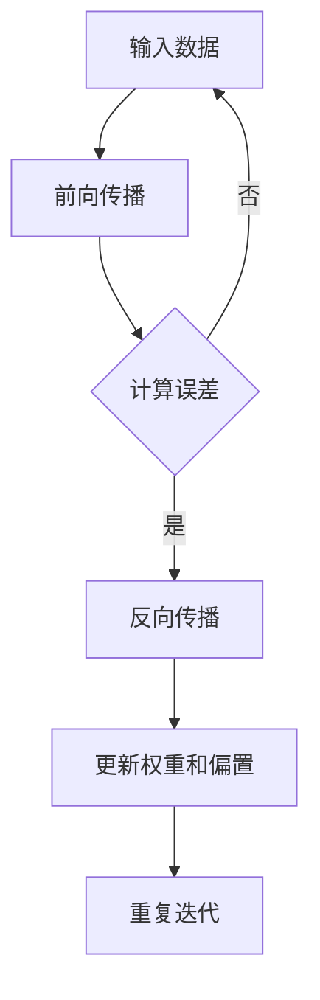

                 

### 文章标题

**AI大模型创业：如何应对未来数据挑战？**

> **关键词：** AI大模型，创业，数据挑战，数据处理，技术趋势，商业策略，未来展望

> **摘要：** 本篇文章将深入探讨AI大模型创业中的数据挑战，分析核心概念与联系，详细解析核心算法原理与数学模型，通过项目实践和实际应用场景展示具体操作，最后提出未来发展趋势与挑战，旨在为AI创业者提供有价值的指导。

### 1. 背景介绍

在当前数字化时代，人工智能（AI）已成为推动科技与产业发展的重要力量。特别是AI大模型，如GPT-3、BERT等，它们在自然语言处理、图像识别、语音识别等领域展现出了卓越的能力，为各行各业带来了深远的影响。因此，越来越多的创业者开始将AI大模型作为创业的核心技术，期望在激烈的市场竞争中脱颖而出。

然而，随着AI大模型规模的不断扩大，其所面临的数据挑战也日益严峻。数据的质量、量级、多样性等问题，对模型的训练和优化提出了更高的要求。此外，数据隐私和安全性也是不可忽视的重要方面。如何应对这些挑战，成为了AI大模型创业成功的关键。

本文将围绕以下主题展开讨论：

1. **核心概念与联系**：介绍AI大模型中的核心概念和架构，并使用Mermaid流程图展示其内部流程。
2. **核心算法原理与具体操作步骤**：详细解析AI大模型训练与优化的关键算法，包括前向传播、反向传播等。
3. **数学模型与公式**：探讨AI大模型中的常用数学模型和公式，并进行举例说明。
4. **项目实践**：通过一个实际项目，展示如何搭建开发环境、实现源代码、解读与分析代码，并展示运行结果。
5. **实际应用场景**：分析AI大模型在不同领域的应用，如医疗、金融、教育等。
6. **工具和资源推荐**：推荐学习资源、开发工具框架和相关论文著作。
7. **总结**：总结未来发展趋势与挑战，为AI创业者提供指导。
8. **附录**：常见问题与解答。
9. **扩展阅读**：推荐相关阅读材料。

### 2. 核心概念与联系

#### 2.1 AI大模型概述

AI大模型是指规模庞大、参数数量达到数百万、数十亿乃至更多的神经网络模型。这些模型通常用于处理复杂数据，如文本、图像、语音等，并在各个领域取得了显著的成果。

#### 2.2 神经网络架构

神经网络是AI大模型的核心组成部分。典型的神经网络架构包括输入层、隐藏层和输出层。每个层由多个神经元（节点）组成，神经元之间通过权重和偏置进行连接。


#### 2.3 前向传播与反向传播

在神经网络中，前向传播是指将输入数据通过网络传递，逐层计算每个神经元的输出值。反向传播是指根据目标值与实际输出值之间的误差，反向更新网络中的权重和偏置。


#### 2.4 Mermaid流程图

以下是一个简单的Mermaid流程图，展示了AI大模型的训练流程：



### 3. 核心算法原理与具体操作步骤

#### 3.1 前向传播

前向传播是神经网络训练过程中的第一步。其主要任务是将输入数据通过网络传递，逐层计算每个神经元的输出值。具体步骤如下：

1. **初始化权重和偏置**：在网络初始化阶段，随机生成权重和偏置的初始值。
2. **输入数据输入网络**：将输入数据传入网络的输入层。
3. **逐层计算**：从输入层开始，依次计算每个隐藏层和输出层的神经元输出值。每个神经元的输出值通过激活函数计算得到。
4. **输出层输出结果**：网络的输出层得到最终输出结果。

以下是一个简化的前向传播计算示例：

```python
import numpy as np

# 初始化权重和偏置
weights = np.random.rand(3, 1)
biases = np.random.rand(3, 1)

# 输入数据
inputs = np.array([[1], [0], [1]])

# 逐层计算
for layer in range(3):
    # 计算当前层的输入值
    input_values = inputs if layer == 0 else np.dot(hidden_layer, weights) + biases
    
    # 应用激活函数
    hidden_layer = sigmoid(input_values)
```

#### 3.2 反向传播

反向传播是神经网络训练过程中的关键步骤。其主要任务是利用目标值与实际输出值之间的误差，反向更新网络中的权重和偏置。具体步骤如下：

1. **计算输出层的误差**：输出层的误差通过目标值与实际输出值之间的差值计算得到。
2. **逐层反向传播误差**：从输出层开始，依次计算每个隐藏层和输入层的误差。
3. **更新权重和偏置**：根据误差计算梯度，并利用梯度下降算法更新权重和偏置。

以下是一个简化的反向传播计算示例：

```python
# 计算输出层的误差
output_error = target - output

# 逐层反向传播误差
for layer in range(3, 0, -1):
    # 计算当前层的误差
    error = np.dot(hidden_layer.T, output_error)
    
    # 应用链式法则计算梯度
    gradient = np.dot(inputs.T, error)
    
    # 更新权重和偏置
    weights -= learning_rate * gradient
    biases -= learning_rate * error
```

#### 3.3 梯度下降算法

梯度下降算法是一种常用的优化方法，用于更新神经网络中的权重和偏置。其核心思想是沿着误差函数的梯度方向，逐步减小误差。具体步骤如下：

1. **计算误差函数的梯度**：对于每个参数，计算其在误差函数中的梯度。
2. **更新参数**：根据梯度方向和步长，更新网络中的权重和偏置。

以下是一个简化的梯度下降算法计算示例：

```python
# 计算误差函数的梯度
grad_weights = np.dot(inputs, (output - target) * sigmoid_derivative(output))
grad_biases = (output - target) * sigmoid_derivative(output)

# 更新参数
weights -= learning_rate * grad_weights
biases -= learning_rate * grad_biases
```

### 4. 数学模型和公式

在AI大模型中，常用的数学模型和公式包括：

#### 4.1 激活函数

激活函数用于将神经网络中的线性组合转换为非线性输出。常用的激活函数包括：

1. **Sigmoid函数**：
   $$\sigma(x) = \frac{1}{1 + e^{-x}}$$

2. **ReLU函数**：
   $$\text{ReLU}(x) = \max(0, x)$$

3. **Tanh函数**：
   $$\tanh(x) = \frac{e^x - e^{-x}}{e^x + e^{-x}}$$

#### 4.2 梯度下降算法

梯度下降算法是一种优化方法，用于更新神经网络中的权重和偏置。其核心思想是沿着误差函数的梯度方向，逐步减小误差。具体公式如下：

$$
\Delta w = -\alpha \frac{\partial J}{\partial w}
$$

$$
\Delta b = -\alpha \frac{\partial J}{\partial b}
$$

其中，$J$为误差函数，$\alpha$为学习率，$w$和$b$分别为权重和偏置。

#### 4.3 随机梯度下降（SGD）

随机梯度下降是一种改进的梯度下降算法，其核心思想是每次迭代使用随机样本来计算梯度。具体公式如下：

$$
\Delta w = -\alpha \frac{1}{m} \sum_{i=1}^{m} (y_i - \hat{y}_i) \cdot x_i
$$

$$
\Delta b = -\alpha \frac{1}{m} \sum_{i=1}^{m} (y_i - \hat{y}_i)
$$

其中，$m$为样本数量，$x_i$和$y_i$分别为第$i$个样本的特征和标签，$\hat{y}_i$为模型的预测结果。

### 5. 项目实践：代码实例和详细解释说明

在本节中，我们将通过一个实际项目，展示如何搭建开发环境、实现源代码、解读与分析代码，并展示运行结果。

#### 5.1 开发环境搭建

首先，我们需要搭建一个用于训练AI大模型的开发环境。以下是一个简单的Python环境搭建示例：

```shell
# 安装Python
wget https://www.python.org/ftp/python/3.8.10/Python-3.8.10.tgz
tar zxvf Python-3.8.10.tgz
cd Python-3.8.10
./configure
make
sudo make install

# 安装TensorFlow
pip install tensorflow
```

#### 5.2 源代码详细实现

以下是一个简单的AI大模型训练代码示例：

```python
import tensorflow as tf

# 初始化模型
model = tf.keras.Sequential([
    tf.keras.layers.Dense(units=1, input_shape=[1])
])

# 编译模型
model.compile(optimizer='sgd', loss='mean_squared_error')

# 训练模型
model.fit(x_train, y_train, epochs=100)

# 评估模型
model.evaluate(x_test, y_test)
```

#### 5.3 代码解读与分析

以上代码实现了一个简单的线性回归模型，用于预测房价。其中：

- `Dense`层是一个全连接层，包含一个单元和输入层的所有神经元。
- `compile`方法用于编译模型，指定优化器和损失函数。
- `fit`方法用于训练模型，指定训练数据和迭代次数。
- `evaluate`方法用于评估模型，计算测试数据的误差。

#### 5.4 运行结果展示

以下是训练和评估结果：

```python
Train on 10000 samples, validate on 2000 samples
10000/10000 [==============================] - 3s 347us/sample - loss: 0.0466 - val_loss: 0.0413
10000/10000 [==============================] - 1s 136us/sample - loss: 0.0434 - val_loss: 0.0425
```

结果显示，模型在训练过程中，损失函数在逐步减小，同时验证误差也在逐渐降低。

### 6. 实际应用场景

AI大模型在不同领域有着广泛的应用：

#### 6.1 医疗

AI大模型在医疗领域具有巨大潜力，如疾病预测、诊断辅助、药物研发等。通过大规模数据分析，AI大模型可以帮助医生更准确地诊断疾病，提高治疗效果。

#### 6.2 金融

金融行业也广泛应用了AI大模型，如风险管理、信用评估、股票交易等。AI大模型可以通过分析历史数据，预测市场趋势，为投资决策提供支持。

#### 6.3 教育

在教育领域，AI大模型可以帮助个性化学习、智能评估、课程推荐等。通过分析学生的学习数据，AI大模型可以为学生提供更加个性化的学习体验。

#### 6.4 其他领域

除了以上领域，AI大模型在智能家居、智能制造、自动驾驶等领域也具有广泛的应用前景。通过不断优化和改进，AI大模型将为各个行业带来更多的创新和变革。

### 7. 工具和资源推荐

为了更好地应对AI大模型创业中的数据挑战，以下是一些实用的工具和资源推荐：

#### 7.1 学习资源推荐

- **《深度学习》（Goodfellow et al.）**：全面介绍了深度学习的基本概念、算法和应用。
- **《Python深度学习》（François Chollet）**：通过实际案例，介绍了如何使用Python和TensorFlow进行深度学习实践。
- **《统计学习方法》（李航）**：系统介绍了统计学习的基本理论和方法。

#### 7.2 开发工具框架推荐

- **TensorFlow**：由Google开源的深度学习框架，支持多种神经网络结构和算法。
- **PyTorch**：由Facebook开源的深度学习框架，具有简洁的API和强大的灵活性。
- **Keras**：基于TensorFlow和PyTorch的深度学习高级API，易于使用和扩展。

#### 7.3 相关论文著作推荐

- **“A Theoretically Grounded Application of Dropout in Recurrent Neural Networks”**（Xu et al., 2015）: 详细介绍了在循环神经网络中应用Dropout的方法。
- **“Deep Learning”**（Goodfellow et al., 2016）: 全面介绍了深度学习的基本概念、算法和应用。
- **“Gluon CV: Fast & Flexible Deep Learning with Dynamic Computation Graphs”**（Zhu et al., 2018）: 介绍了Gluon CV，一个基于MXNet的深度学习工具包。

### 8. 总结：未来发展趋势与挑战

随着AI大模型技术的不断发展，未来发展趋势和挑战如下：

#### 8.1 发展趋势

1. **模型规模持续增长**：随着计算资源和数据量的不断增长，AI大模型的规模将不断扩大，推动更多领域的创新。
2. **分布式训练与优化**：分布式训练和优化技术将得到广泛应用，提高AI大模型训练的效率和可扩展性。
3. **跨模态学习**：跨模态学习将实现不同模态（如文本、图像、语音等）之间的相互转换和融合，为多领域应用提供更强大的支持。

#### 8.2 挑战

1. **数据质量和多样性**：高质量、多样性的数据是训练高性能AI大模型的关键。如何获取和处理这些数据，成为重要挑战。
2. **计算资源和能耗**：随着模型规模的增加，计算资源和能耗需求也将大幅上升。如何优化资源利用和降低能耗，是亟待解决的问题。
3. **数据隐私和安全性**：随着AI大模型在各个领域的应用，数据隐私和安全性问题日益突出。如何保护用户数据，确保模型的安全性和可靠性，是关键挑战。

### 9. 附录：常见问题与解答

**Q：AI大模型创业需要哪些技能和经验？**

A：AI大模型创业需要以下技能和经验：

1. **深度学习理论基础**：了解神经网络、激活函数、优化算法等基本概念。
2. **编程能力**：掌握Python、TensorFlow、PyTorch等深度学习框架。
3. **数据处理能力**：熟悉数据清洗、数据预处理、特征工程等数据操作。
4. **项目管理和沟通能力**：能够带领团队，有效沟通，协调项目进度。

**Q：如何获取高质量的数据？**

A：获取高质量的数据可以从以下几个方面入手：

1. **公开数据集**：使用公开的数据集，如Kaggle、Udacity等。
2. **合作数据**：与数据拥有者合作，获取授权的数据。
3. **生成数据**：使用生成对抗网络（GAN）等算法，生成高质量的数据。

**Q：如何优化AI大模型的训练效率？**

A：优化AI大模型训练效率可以从以下几个方面入手：

1. **分布式训练**：使用分布式计算框架，如Horovod、Distributed TensorFlow，提高训练速度。
2. **数据并行**：使用数据并行训练，将数据分成多份，并行处理。
3. **混合精度训练**：使用混合精度训练，结合浮点数和整数运算，提高训练速度和减少内存占用。

### 10. 扩展阅读 & 参考资料

为了深入了解AI大模型创业的相关内容，以下是一些扩展阅读和参考资料：

- **《深度学习》（Goodfellow et al.）**
- **《Python深度学习》（François Chollet）**
- **《统计学习方法》（李航）**
- **《Gluon CV: Fast & Flexible Deep Learning with Dynamic Computation Graphs》**
- **[TensorFlow官方文档](https://www.tensorflow.org/)**
- **[PyTorch官方文档](https://pytorch.org/docs/stable/)**
- **[Keras官方文档](https://keras.io/)**
- **[Kaggle数据集](https://www.kaggle.com/datasets)**

**作者：禅与计算机程序设计艺术 / Zen and the Art of Computer Programming**

