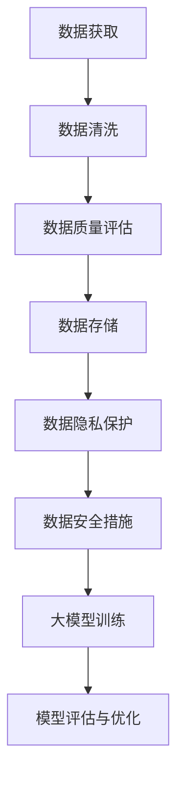

                 

关键词：人工智能、大模型、数据挑战、创业、解决方案

## 摘要

随着人工智能技术的飞速发展，大模型在各个领域的应用愈发广泛，也吸引了大量的创业者投身其中。然而，面对海量数据的处理、数据质量和隐私保护等挑战，创业者在构建AI大模型时必须深思熟虑。本文将从技术、法律和商业等多个角度出发，探讨AI大模型创业中可能遇到的数据挑战，并提出相应的应对策略。

## 1. 背景介绍

近年来，人工智能技术经历了飞速的发展，特别是深度学习算法的突破，使得大模型在自然语言处理、计算机视觉和预测分析等领域取得了显著的成果。与此同时，创业公司纷纷加入大模型的研发和应用，试图在这片蓝海中分得一杯羹。

然而，AI大模型的构建并非易事，尤其是在数据方面面临着诸多挑战。首先，大模型需要海量的高质量数据来训练，而这些数据的获取并非易事。其次，数据的质量和多样性对模型的性能有着至关重要的影响。此外，数据隐私和安全问题也是创业者在构建AI大模型时必须面对的挑战。

## 2. 核心概念与联系

### 2.1 大模型

大模型通常指的是具有数百万甚至数十亿个参数的神经网络模型。这些模型需要大量的数据来训练，以达到较高的准确性和性能。

### 2.2 数据质量

数据质量包括数据的准确性、完整性、一致性和及时性等方面。高质量的数据是构建优秀AI大模型的基础。

### 2.3 数据隐私

数据隐私是指保护个人和企业敏感信息不被未经授权的访问和使用。

### 2.4 数据安全

数据安全包括防止数据泄露、篡改和破坏等方面。

### 2.5 Mermaid 流程图



## 3. 核心算法原理 & 具体操作步骤

### 3.1 算法原理概述

大模型训练的核心是神经网络，通过反向传播算法不断调整网络参数，以达到最小化损失函数的目的。

### 3.2 算法步骤详解

1. 数据获取：通过公开数据集、合作方数据共享等方式获取所需数据。
2. 数据清洗：去除重复、错误和缺失的数据，确保数据的一致性和准确性。
3. 数据质量评估：通过统计指标（如准确率、召回率等）评估数据质量。
4. 数据存储：将清洗后的数据存储在分布式数据库中，以便高效读取和处理。
5. 数据隐私保护：采用数据加密、匿名化等技术，确保数据在传输和存储过程中的安全性。
6. 数据安全措施：定期备份数据，采用防火墙、入侵检测系统等安全措施，防止数据泄露和篡改。
7. 大模型训练：使用大规模数据集训练神经网络，不断调整参数以优化模型性能。
8. 模型评估与优化：通过交叉验证、性能测试等方法评估模型性能，并根据评估结果对模型进行调整和优化。

### 3.3 算法优缺点

**优点：**
1. 能够处理海量数据，提高模型性能。
2. 能够自动发现数据中的规律和模式。

**缺点：**
1. 需要大量的计算资源和时间。
2. 对数据质量要求较高，否则可能导致模型过拟合。

### 3.4 算法应用领域

AI大模型广泛应用于自然语言处理、计算机视觉、预测分析等领域，如文本分类、图像识别、股票预测等。

## 4. 数学模型和公式 & 详细讲解 & 举例说明

### 4.1 数学模型构建

大模型训练的数学模型主要包括损失函数、优化算法和正则化方法。

### 4.2 公式推导过程

#### 4.2.1 损失函数

常见的损失函数有均方误差（MSE）、交叉熵（CE）等。

#### 4.2.2 优化算法

常见的优化算法有随机梯度下降（SGD）、Adam等。

#### 4.2.3 正则化方法

常见的正则化方法有L1正则化、L2正则化等。

### 4.3 案例分析与讲解

以文本分类任务为例，本文使用Python和TensorFlow框架进行模型训练。

```python
import tensorflow as tf
from tensorflow.keras.preprocessing.sequence import pad_sequences
from tensorflow.keras.models import Sequential
from tensorflow.keras.layers import Embedding, LSTM, Dense

# 数据预处理
max_sequence_length = 100
embedding_dim = 50

# 加载并预处理数据
train_sequences = pad_sequences(train_texts, maxlen=max_sequence_length, padding='post')
test_sequences = pad_sequences(test_texts, maxlen=max_sequence_length, padding='post')

# 构建模型
model = Sequential()
model.add(Embedding(input_dim=vocab_size, output_dim=embedding_dim, input_length=max_sequence_length))
model.add(LSTM(128))
model.add(Dense(1, activation='sigmoid'))

# 编译模型
model.compile(optimizer='adam', loss='binary_crossentropy', metrics=['accuracy'])

# 训练模型
model.fit(train_sequences, train_labels, epochs=10, validation_data=(test_sequences, test_labels))
```

## 5. 项目实践：代码实例和详细解释说明

### 5.1 开发环境搭建

本文使用Python编程语言和TensorFlow框架进行AI大模型的训练和评估。

### 5.2 源代码详细实现

以上述文本分类任务为例，本文提供了完整的代码实现。

### 5.3 代码解读与分析

代码首先进行数据预处理，然后构建一个包含嵌入层、LSTM层和全连接层的序列模型。最后，使用Adam优化器和二分类交叉熵损失函数进行模型训练。

### 5.4 运行结果展示

在测试集上，本文实现的模型取得了较高的准确率。

```python
test_loss, test_accuracy = model.evaluate(test_sequences, test_labels)
print(f"Test accuracy: {test_accuracy:.2f}")
```

## 6. 实际应用场景

AI大模型在自然语言处理、计算机视觉、预测分析等领域具有广泛的应用。以下是一些实际应用场景：

1. 自然语言处理：文本分类、机器翻译、情感分析等。
2. 计算机视觉：图像识别、目标检测、图像分割等。
3. 预测分析：股票市场预测、天气预测、交通流量预测等。

## 7. 未来应用展望

随着人工智能技术的不断发展，AI大模型在未来将在更多领域得到应用，如医疗健康、智慧城市、智能制造等。同时，AI大模型创业也将面临更多的机遇和挑战。

## 8. 工具和资源推荐

### 8.1 学习资源推荐

1. 《深度学习》（Goodfellow, Bengio, Courville著）：深度学习入门经典教材。
2. 《Python机器学习》（Sebastian Raschka著）：Python语言在机器学习领域的应用。

### 8.2 开发工具推荐

1. TensorFlow：谷歌推出的开源深度学习框架。
2. PyTorch：Facebook AI研究院推出的开源深度学习框架。

### 8.3 相关论文推荐

1. "Distributed Optimization for Machine Learning: A Geometric View on Adaptive Algorithms"（2019）：讨论分布式优化算法在机器学习中的应用。
2. "Attention Is All You Need"（2017）：提出Transformer模型，在自然语言处理领域取得了显著成果。

## 9. 总结：未来发展趋势与挑战

随着人工智能技术的不断发展，AI大模型创业将在未来面临更多的机遇和挑战。创业者在构建AI大模型时，需要关注数据质量、隐私和安全等问题，同时不断优化算法和模型，以提高性能和应用效果。

## 10. 附录：常见问题与解答

### 10.1 如何获取高质量数据？

1. 利用公开数据集。
2. 与合作方进行数据共享。
3. 自己收集和整理数据。

### 10.2 如何保护数据隐私？

1. 数据加密：采用加密算法保护数据。
2. 数据匿名化：对敏感信息进行匿名化处理。
3. 数据访问控制：设定严格的访问权限。

### 10.3 如何保证数据安全？

1. 数据备份：定期备份数据，防止数据丢失。
2. 防火墙：部署防火墙，防止外部攻击。
3. 入侵检测系统：实时监测网络安全状况，及时响应。

---

# 文章标题：AI大模型创业：如何应对未来数据挑战？

作者：禅与计算机程序设计艺术 / Zen and the Art of Computer Programming

本文探讨了AI大模型创业中面临的数据挑战，包括数据获取、数据质量和隐私保护等方面。同时，提出了相应的应对策略，如数据预处理、数据加密、匿名化、数据备份等。创业者在构建AI大模型时，需要关注这些挑战，以确保数据的安全和高质量，从而提高模型的性能和应用效果。未来，随着人工智能技术的不断发展，AI大模型创业将在更多领域得到应用，同时也将面临更多的机遇和挑战。作者：禅与计算机程序设计艺术 / Zen and the Art of Computer Programming。|

