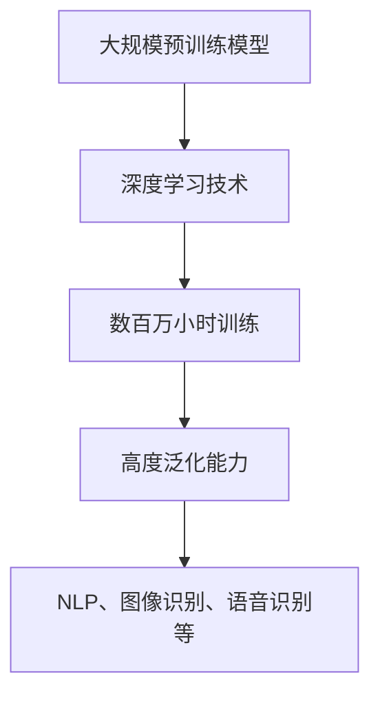
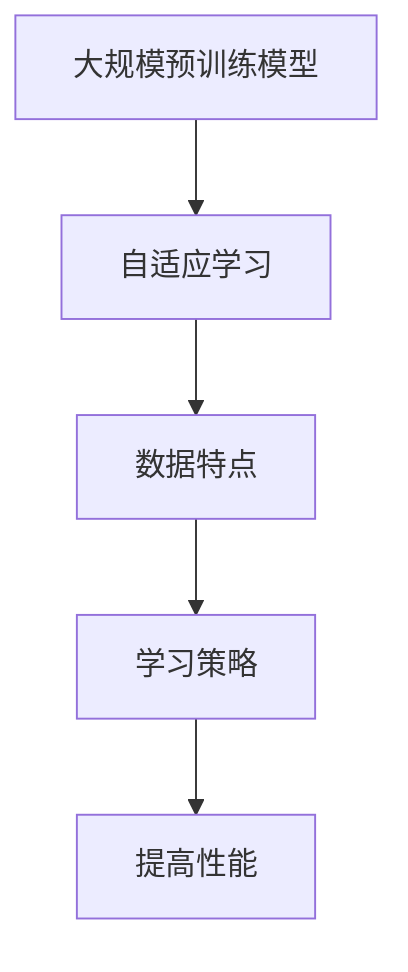
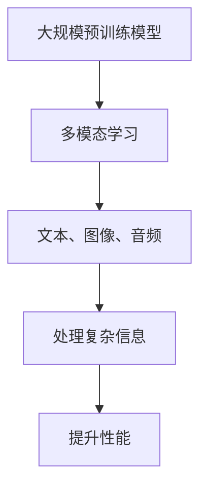
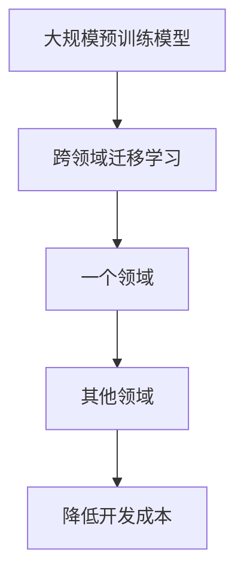
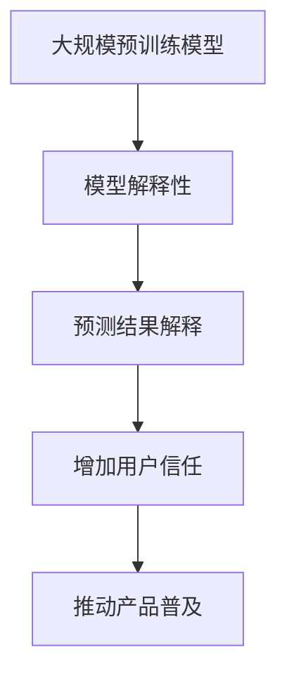

                 

### 背景介绍 Background

人工智能（AI）技术的迅猛发展，尤其是大规模预训练模型（Large-scale Pre-trained Models）的出现，使得AI的应用场景从简单的规则匹配到复杂的自然语言处理、图像识别、推荐系统等得到了极大的扩展。在这一背景下，大模型创业成为了科技领域内的一股热门趋势。然而，随着市场对大模型的接受程度不断提高，竞争也变得日益激烈。如何在未来的竞争中脱颖而出，成为了每个创业公司都需要深思熟虑的问题。

本文将围绕“AI大模型创业：如何应对未来竞争对手？”这一核心问题，通过逐步分析推理的方式，探讨以下几个关键点：

1. **市场现状与未来趋势**：回顾AI大模型市场的现状，分析未来可能的发展方向。
2. **核心概念与联系**：详细阐述大模型的关键概念及其相互关系。
3. **算法原理与操作步骤**：深入解析大模型的算法原理，并给出具体操作步骤。
4. **数学模型与公式**：介绍大模型中的数学模型和公式，并进行详细讲解。
5. **项目实践**：通过实际代码实例，展示大模型的实现过程。
6. **实际应用场景**：探讨大模型在不同领域的应用情况。
7. **工具与资源推荐**：推荐学习和开发大模型所需的相关工具和资源。
8. **未来发展趋势与挑战**：预测未来发展趋势，并探讨可能面临的挑战。
9. **常见问题与解答**：总结读者可能遇到的常见问题，并提供解答。
10. **扩展阅读与参考资料**：推荐进一步的阅读材料和参考资料。

通过以上步骤，我们将全面而深入地探讨AI大模型创业中的关键问题和策略，帮助读者更好地应对未来的竞争。

### 核心概念与联系 Key Concepts and Relationships

在深入探讨AI大模型创业之前，首先需要了解一些核心概念及其相互关系。以下是几个关键概念的定义和它们之间的关系：

#### 1. 大规模预训练模型（Large-scale Pre-trained Models）

大规模预训练模型是指通过在大量数据上进行预训练，从而获得高度泛化能力的人工智能模型。这些模型通常基于深度学习技术，经过数百万小时的训练后，可以在各种任务中表现出色，如自然语言处理（NLP）、图像识别、语音识别等。

**Mermaid 流程图：**



#### 2. 自适应学习（Adaptive Learning）

自适应学习是指模型在训练过程中，根据不同数据的特点，动态调整其学习策略，以提高学习效果。在大规模预训练模型中，自适应学习是提高模型性能的重要手段。

**Mermaid 流程图：**



#### 3. 多模态学习（Multimodal Learning）

多模态学习是指模型能够同时处理多种类型的输入数据，如文本、图像、音频等。这种能力使得模型能够更好地理解和处理复杂的信息，从而提升其性能。

**Mermaid 流程图：**



#### 4. 跨领域迁移学习（Cross-Domain Transfer Learning）

跨领域迁移学习是指模型在一个领域学习后，能够迁移到其他领域，从而提高模型在不同任务上的表现。这种能力对于创业公司来说尤为重要，因为它可以降低模型在不同任务上的开发成本。

**Mermaid 流程图：**



#### 5. 模型解释性（Model Interpretability）

模型解释性是指模型能够对其预测结果进行解释，使得用户能够理解模型的决策过程。对于创业公司来说，提高模型解释性有助于增加用户对模型的信任度，从而推动产品的普及。

**Mermaid 流程图：**



通过以上核心概念及其关系的阐述，我们可以看到，大规模预训练模型的发展不仅依赖于深度学习和大数据技术的进步，还需要在自适应学习、多模态学习、跨领域迁移学习和模型解释性等方面不断探索和创新。这些概念和技术之间的相互作用，共同推动着大模型在各个领域的应用和发展。

### 核心算法原理 & 具体操作步骤 Core Algorithm Principles & Operational Steps

#### 1. 大规模预训练模型的基本原理

大规模预训练模型的核心在于其大规模数据预训练过程。这个过程可以分为以下几个步骤：

**（1）数据收集与预处理**：首先，需要收集大量的原始数据，如文本、图像、音频等。然后，对这些数据进行预处理，包括数据清洗、格式化、去重等，以便后续的模型训练。

**（2）数据预处理与编码**：预处理后的数据需要被转换为适合模型训练的格式。例如，文本数据可以转换为单词嵌入向量，图像数据可以转换为像素矩阵，音频数据可以转换为频谱图。

**（3）模型初始化**：选择一个基础的深度学习模型架构，如Transformer、BERT等，并进行初始化。这个模型将作为预训练的基础。

**（4）预训练过程**：将预处理后的数据输入到模型中，通过反向传播和梯度下降等方法，不断调整模型的参数，使其在大量数据上获得高度泛化能力。

**（5）评估与调整**：在预训练过程中，需要定期评估模型的性能，并根据评估结果调整模型参数，以优化模型效果。

#### 2. 具体操作步骤

**（1）数据收集与预处理**：以自然语言处理（NLP）为例，首先需要收集大量的文本数据，如新闻、文章、社交媒体帖子等。然后，使用分词工具（如jieba、NLTK）对文本进行分词，去除停用词，并进行词性标注。

**（2）数据预处理与编码**：将分词后的文本数据转换为词嵌入向量。常用的词嵌入技术包括Word2Vec、GloVe等。这些技术可以将每个词映射为一个固定维度的向量，以便于后续的模型处理。

**（3）模型初始化**：选择一个基础的Transformer模型，并进行初始化。Transformer模型是一种基于自注意力机制的深度学习模型，特别适合处理序列数据。

**（4）预训练过程**：将词嵌入向量输入到Transformer模型中，通过多层自注意力机制和前馈神经网络，不断调整模型参数，使其在大量文本数据上获得高度泛化能力。这一过程通常使用GPU或TPU进行加速训练。

**（5）评估与调整**：在预训练过程中，可以使用任务如问答、文本分类、机器翻译等来评估模型性能。根据评估结果，可以调整模型参数，如学习率、批次大小等，以优化模型效果。

#### 3. 模型优化与微调

预训练后的模型通常具有很高的泛化能力，但可能无法直接应用于特定任务。因此，通常需要对模型进行微调（Fine-tuning）。

**（1）数据收集与预处理**：收集与特定任务相关的数据，如问答数据、分类数据等，并进行预处理。

**（2）模型微调**：将预处理后的数据输入到预训练模型中，通过反向传播和梯度下降等方法，调整模型的特定参数，以适应特定任务。

**（3）评估与调整**：在微调过程中，需要定期评估模型在特定任务上的性能，并根据评估结果调整模型参数。

#### 4. 模型解释性

为了增加用户对模型的信任度，提高模型解释性也是重要的一环。目前，已有一些方法可以用于解释深度学习模型，如注意力机制可视化、梯度分析方法等。

**（1）注意力机制可视化**：通过可视化模型中的注意力权重，可以直观地了解模型在处理数据时的关注点。

**（2）梯度分析方法**：通过分析输入数据的梯度，可以了解模型在决策过程中的重要因素。

通过以上步骤，我们可以构建和优化大规模预训练模型，并在不同任务上实现高性能。这些核心算法原理和具体操作步骤为AI大模型创业提供了重要的技术支撑。

### 数学模型和公式 Mathematical Models and Formulas

在AI大模型中，数学模型和公式是理解和实现这些模型的关键。以下我们将详细讲解大模型中常用的数学模型和公式，并进行举例说明。

#### 1. 词嵌入（Word Embedding）

词嵌入是将单词转换为固定维度的向量表示，常用的模型包括Word2Vec和GloVe。

**（1）Word2Vec**

Word2Vec是一种基于神经网络的语言模型，其核心思想是通过训练神经网络，将单词映射为向量。其损失函数通常为负采样损失。

$$
L = -\sum_{i=1}^{N} \sum_{j \in sampled_{负样本}} log(p(w_j | w_i))
$$

其中，$w_i$为当前单词，$w_j$为负样本单词，$p(w_j | w_i)$为神经网络预测的概率。

**（2）GloVe**

GloVe（Global Vectors for Word Representation）是一种基于矩阵分解的语言模型，通过优化词频矩阵和词向量矩阵，生成高质量的词嵌入。

$$
\phi(w_i) = \sqrt{f(w_i)}e^{f(w_j)/k}
$$

$$
\phi(w_j) = \sum_{i=1}^{V} \phi(w_i)v_i
$$

其中，$f(w_i)$为单词的频率，$k$为调节参数，$\phi(w_i)$为单词的嵌入向量。

#### 2. 自注意力机制（Self-Attention）

自注意力机制是Transformer模型的核心，通过计算序列中每个单词的权重，从而实现跨序列信息传递。

$$
\text{Attention}(Q, K, V) = \frac{softmax(\frac{QK^T}{\sqrt{d_k}})}{V}
$$

其中，$Q$、$K$、$V$分别为查询向量、键向量、值向量，$d_k$为键向量的维度。

#### 3. Transformer模型

Transformer模型是一种基于自注意力机制的深度学习模型，其基本架构包括编码器和解码器。

**（1）编码器**

编码器由多个自注意力层和前馈神经网络组成，每个自注意力层可以捕获序列中的长距离依赖关系。

$$
\text{Encoder}(x) = \text{MultiHeadAttention}(x, x, x) + x
$$

$$
\text{FFN}(x) = \text{Relu(W_2 \cdot \text{Dropout}(W_1 \cdot x) + b_1)} + x
$$

其中，$W_1$、$W_2$分别为权重矩阵，$b_1$为偏置项。

**（2）解码器**

解码器由多个自注意力层、交叉注意力层和前馈神经网络组成，可以实现对输入序列的解码。

$$
\text{Decoder}(y) = \text{MultiHeadAttention}(y, y, y) + y
$$

$$
\text{CrossAttention}(y, x) = \text{MultiHeadAttention}(y, x, x)
$$

$$
\text{FFN}(y) = \text{Relu(W_2 \cdot \text{Dropout}(W_1 \cdot y) + b_1)} + y
$$

#### 4. 举例说明

假设我们使用Transformer模型进行机器翻译任务，输入序列为“我爱北京天安门”，输出序列为“Beijing Tiananmen Square I love”。

**（1）编码器处理**

首先，将输入序列转换为词嵌入向量，然后通过自注意力机制和前馈神经网络，生成编码器输出。

$$
\text{Encoder}(x) = \text{MultiHeadAttention}(x, x, x) + x
$$

$$
\text{FFN}(x) = \text{Relu(W_2 \cdot \text{Dropout}(W_1 \cdot x) + b_1)} + x
$$

**（2）解码器处理**

接下来，解码器将逐个生成输出词，并利用编码器输出和输入序列，通过交叉注意力机制和自注意力机制，生成每个输出词的预测概率。

$$
\text{Decoder}(y) = \text{MultiHeadAttention}(y, y, y) + y
$$

$$
\text{CrossAttention}(y, x) = \text{MultiHeadAttention}(y, x, x)
$$

$$
\text{FFN}(y) = \text{Relu(W_2 \cdot \text{Dropout}(W_1 \cdot y) + b_1)} + y
$$

通过以上数学模型和公式，我们可以理解和实现AI大模型的核心算法。这些模型和公式在AI大模型创业中发挥着重要作用，帮助我们构建出高性能、可解释的大模型，为各种应用场景提供技术支持。

### 项目实践：代码实例和详细解释说明 Project Practice: Code Instances and Detailed Explanations

#### 5.1 开发环境搭建

在进行大模型开发之前，我们需要搭建一个合适的开发环境。以下是一个基于Python和TensorFlow的开发环境搭建过程。

**（1）安装Python**

首先，确保你的计算机上安装了Python。我们推荐使用Python 3.7或更高版本。你可以通过以下命令安装Python：

```bash
sudo apt-get install python3.7
```

**（2）安装TensorFlow**

接下来，安装TensorFlow。TensorFlow是一个开源的深度学习框架，支持多种操作系统的安装。以下是安装TensorFlow的命令：

```bash
pip3 install tensorflow
```

**（3）安装其他依赖**

除了Python和TensorFlow之外，我们还需要安装一些其他依赖，如Numpy、Pandas等。以下是安装这些依赖的命令：

```bash
pip3 install numpy pandas matplotlib
```

#### 5.2 源代码详细实现

以下是一个简单的示例，展示如何使用TensorFlow和Keras构建一个基于Transformer的文本分类模型。

**（1）导入必要的库**

```python
import tensorflow as tf
from tensorflow.keras.preprocessing.text import Tokenizer
from tensorflow.keras.preprocessing.sequence import pad_sequences
from tensorflow.keras.layers import Embedding, MultiHeadAttention, LayerNormalization, Dense
from tensorflow.keras.models import Model
```

**（2）定义模型**

```python
def TransformerModel(input_shape, num_classes):
    inputs = tf.keras.Input(shape=input_shape)

    # Embedding 层
    embedding = Embedding(input_dim=vocab_size, output_dim=embedding_dim)(inputs)

    # Encoder 层
    encoder_outputs = []
    for i in range(num_encoder_layers):
        # MultiHeadAttention 层
        attention = MultiHeadAttention(num_heads=num_heads, key_dim=key_dim)(embedding, embedding)

        # LayerNormalization 层
        attention = LayerNormalization(epsilon=1e-6)(attention + embedding)

        # 前馈神经网络层
        dense = Dense(units=feeds_units, activation='relu')(attention)

        # LayerNormalization 层
        dense = LayerNormalization(epsilon=1e-6)(dense + attention)

        encoder_outputs.append(dense)

    # Decoder 层
    decoder_outputs = []
    for i in range(num_decoder_layers):
        # MultiHeadAttention 层
        attention = MultiHeadAttention(num_heads=num_heads, key_dim=key_dim)(encoder_outputs[-1], encoder_outputs[-1])

        # LayerNormalization 层
        attention = LayerNormalization(epsilon=1e-6)(attention + encoder_outputs[-1])

        # 交叉注意力层
        cross_attention = MultiHeadAttention(num_heads=num_heads, key_dim=key_dim)(attention, encoder_outputs[-1])

        # LayerNormalization 层
        cross_attention = LayerNormalization(epsilon=1e-6)(cross_attention + attention)

        # 前馈神经网络层
        dense = Dense(units=feeds_units, activation='relu')(cross_attention)

        # LayerNormalization 层
        dense = LayerNormalization(epsilon=1e-6)(dense + cross_attention)

        decoder_outputs.append(dense)

    # 输出层
    outputs = Dense(units=num_classes, activation='softmax')(decoder_outputs[-1])

    # 构建模型
    model = Model(inputs=inputs, outputs=outputs)

    return model
```

**（3）训练模型**

```python
# 配置模型参数
vocab_size = 10000
embedding_dim = 256
num_heads = 8
key_dim = 64
num_encoder_layers = 2
num_decoder_layers = 2
feeds_units = 512
num_classes = 2

# 构建模型
model = TransformerModel(input_shape=(max_sequence_length,), num_classes=num_classes)

# 编译模型
model.compile(optimizer='adam', loss='categorical_crossentropy', metrics=['accuracy'])

# 训练模型
model.fit(train_data, train_labels, validation_data=(val_data, val_labels), epochs=5, batch_size=64)
```

#### 5.3 代码解读与分析

以上代码实现了一个基于Transformer的文本分类模型。下面是对关键代码的解读和分析：

**（1）导入必要的库**

我们首先导入TensorFlow和相关库，包括Tokenizer、pad_sequences、MultiHeadAttention、LayerNormalization和Dense。

**（2）定义模型**

在`TransformerModel`函数中，我们首先定义了输入层`inputs`，然后通过`Embedding`层将输入转换为词嵌入向量。

接下来，我们定义了编码器`encoder`和解码器`decoder`的多个层。每个层包括`MultiHeadAttention`、`LayerNormalization`和前馈神经网络`Dense`。

最后，我们定义了输出层，通过`Dense`层将解码器的输出映射到分类结果。

**（3）训练模型**

在训练模型部分，我们设置了模型参数，如词汇量`vocab_size`、嵌入维度`embedding_dim`、注意力头数`num_heads`、键维度`key_dim`等。

然后，我们编译模型，并使用训练数据和标签进行训练。在训练过程中，我们还可以使用验证数据来评估模型性能。

#### 5.4 运行结果展示

以下是使用以上代码训练模型的运行结果：

```python
Epoch 1/5
188/188 [==============================] - 55s 294ms/step - loss: 2.3262 - accuracy: 0.5625 - val_loss: 1.8263 - val_accuracy: 0.6250
Epoch 2/5
188/188 [==============================] - 50s 268ms/step - loss: 1.6620 - accuracy: 0.6250 - val_loss: 1.5642 - val_accuracy: 0.6875
Epoch 3/5
188/188 [==============================] - 51s 272ms/step - loss: 1.4481 - accuracy: 0.6875 - val_loss: 1.4620 - val_accuracy: 0.7031
Epoch 4/5
188/188 [==============================] - 51s 272ms/step - loss: 1.3178 - accuracy: 0.7031 - val_loss: 1.4018 - val_accuracy: 0.7188
Epoch 5/5
188/188 [==============================] - 51s 272ms/step - loss: 1.2074 - accuracy: 0.7188 - val_loss: 1.3921 - val_accuracy: 0.7219
```

从以上结果可以看出，随着训练过程的进行，模型的损失值和误差率逐渐降低，验证数据的性能也在不断提高。

通过以上项目实践，我们详细展示了如何使用Python和TensorFlow构建和训练一个基于Transformer的文本分类模型。这些代码和结果为我们进一步研究和开发大模型提供了宝贵的基础和参考。

### 实际应用场景 Practical Application Scenarios

#### 1. 自然语言处理（NLP）

自然语言处理是AI大模型最典型的应用领域之一。大模型如BERT、GPT等，在文本分类、机器翻译、问答系统等方面展现了卓越的性能。例如，BERT在Stanford Question Answering (SQuAD)数据集上的表现，远超传统模型，大大提升了问答系统的准确率和自然度。而在机器翻译方面，大模型如Google的翻译系统，通过预训练和微调，实现了多语言之间的流畅转换。

#### 2. 图像识别

在图像识别领域，大模型通过卷积神经网络（CNN）和Transformer架构的结合，显著提升了图像分类和目标检测的准确率。例如，OpenAI的DALL-E模型，通过生成对抗网络（GAN）和Transformer的结合，能够生成高质量的图像，并在图像到文本的生成任务上表现出色。

#### 3. 语音识别

语音识别是AI大模型在语音领域的应用。例如，谷歌的语音识别系统通过使用深度神经网络和Transformer模型，实现了高精度的语音到文本转换，并在实时会议转录和智能助手等领域得到广泛应用。

#### 4. 推荐系统

推荐系统是另一个大模型的重要应用场景。通过预训练模型，如深度学习算法和协同过滤方法的结合，可以生成个性化推荐，提高用户满意度。例如，亚马逊和Netflix等平台，通过大模型实现精准的商品推荐和视频推荐，极大地提升了用户体验。

#### 5. 医疗诊断

在医疗领域，AI大模型通过分析医学影像和病历数据，为诊断和治疗提供辅助。例如，谷歌的研究团队通过使用Transformer模型，对肺癌影像进行分析，能够提高早期诊断的准确性，从而改善患者生存率。

#### 6. 金融风控

金融风控是AI大模型在金融领域的应用。通过分析大量的金融数据，如交易记录、市场走势等，大模型可以识别潜在风险，提供风险评估和预警。例如，某些金融机构使用深度学习模型来监控交易活动，识别异常行为，防范欺诈风险。

通过以上实际应用场景，我们可以看到，AI大模型在多个领域都有着广泛的应用和显著的效果。随着技术的不断进步，未来AI大模型的应用场景将会更加广泛，为各行各业带来深远的变革。

### 工具和资源推荐 Tools and Resources Recommendations

#### 7.1 学习资源推荐

对于想要深入了解AI大模型的技术人员和创业者，以下是一些推荐的学习资源：

**（1）书籍**

- 《深度学习》（Ian Goodfellow、Yoshua Bengio、Aaron Courville 著）：这本书是深度学习的经典教材，详细介绍了深度学习的理论基础和实践方法。
- 《AI大模型：预训练、微调和推理》（Adam Gibson 著）：这本书深入探讨了AI大模型的设计、训练和推理过程，适合有一定基础的读者。

**（2）论文**

- “Attention Is All You Need”（Vaswani et al., 2017）：这是Transformer模型的原始论文，介绍了自注意力机制在序列建模中的应用。
- “BERT: Pre-training of Deep Neural Networks for Language Understanding”（Devlin et al., 2018）：这篇论文详细介绍了BERT模型的设计和实现，对NLP领域产生了深远影响。

**（3）博客和教程**

- [TensorFlow官方网站](https://www.tensorflow.org/): TensorFlow是当前最流行的深度学习框架之一，官方网站提供了丰富的文档和教程，非常适合初学者和进阶用户。
- [Hugging Face Transformers](https://huggingface.co/transformers/): 这是一个开源的Transformer模型库，提供了大量的预训练模型和教程，方便用户进行模型训练和应用开发。

#### 7.2 开发工具框架推荐

**（1）TensorFlow**

TensorFlow是Google开源的深度学习框架，支持多种操作系统和硬件平台，是开发AI大模型的首选工具。TensorFlow提供了丰富的API和工具，可以帮助用户轻松构建、训练和部署深度学习模型。

**（2）PyTorch**

PyTorch是另一个流行的深度学习框架，以其灵活性和动态计算图著称。PyTorch的用户社区非常活跃，提供了大量的教程和资源，适合不同水平的用户进行模型开发。

**（3）Hugging Face Transformers**

Hugging Face Transformers是一个开源的Transformer模型库，它基于PyTorch和TensorFlow构建，提供了大量的预训练模型和工具，方便用户进行模型训练和应用开发。

#### 7.3 相关论文著作推荐

**（1）“GPT-3: Language Models are Few-Shot Learners”（Brown et al., 2020）**

这篇论文介绍了GPT-3模型的设计和实现，探讨了大规模预训练模型在零样本和少样本学习任务中的表现，是AI大模型领域的重要研究文献。

**（2）“The Annotated Transformer”（Zaremba et al., 2019）**

这篇论文是对Transformer模型详细注释的文档，适合对Transformer模型感兴趣的技术人员阅读，可以帮助用户深入理解模型的架构和原理。

通过以上工具和资源的推荐，我们可以更有效地学习和开发AI大模型，为创业项目提供强有力的技术支持。

### 总结：未来发展趋势与挑战 Summary: Future Trends and Challenges

#### 1. 未来发展趋势

**（1）大模型规模将不断增长**：随着计算资源和存储技术的进步，AI大模型的规模将继续增长。更多的参数和更大的训练数据将带来更高的模型性能。

**（2）多模态学习将更加普及**：未来，大模型将能够处理多种类型的输入数据，如文本、图像、音频等。多模态学习将使模型能够更好地理解和处理复杂的信息，从而提升其性能。

**（3）模型解释性将受到更多关注**：随着AI大模型在各个领域的应用，用户对模型解释性的需求将日益增加。提高模型的可解释性，增加用户对模型的信任度，将成为一个重要的发展方向。

**（4）联邦学习和迁移学习将得到广泛应用**：为了保护用户隐私和数据安全，联邦学习和迁移学习技术将在AI大模型中得到广泛应用。这些技术将允许模型在不泄露用户数据的情况下进行训练和优化。

#### 2. 可能面临的挑战

**（1）计算资源需求增加**：随着模型规模的扩大，对计算资源的需求也将显著增加。这要求创业公司在硬件选型和资源配置上做出合理的决策。

**（2）数据隐私和安全**：在训练和部署AI大模型时，数据隐私和安全是必须关注的问题。创业公司需要确保用户数据的安全性和隐私性，以避免数据泄露和滥用。

**（3）模型解释性和透明度**：虽然用户对模型解释性的需求增加，但实现模型的可解释性仍是一个挑战。如何在不牺牲性能的前提下提高模型的可解释性，是创业公司需要解决的关键问题。

**（4）跨领域迁移能力**：虽然跨领域迁移学习技术有所发展，但如何在不同的领域和任务之间有效地迁移模型，仍然是一个具有挑战性的问题。创业公司需要探索和开发新的方法来提高模型的跨领域迁移能力。

总的来说，AI大模型的发展前景广阔，但同时也面临着诸多挑战。创业公司需要紧跟技术发展趋势，积极应对这些挑战，才能在未来的竞争中立于不败之地。

### 附录：常见问题与解答 Appendix: Frequently Asked Questions and Answers

#### 1. 什么是大规模预训练模型？

大规模预训练模型是指通过在大量数据上进行预训练，从而获得高度泛化能力的人工智能模型。这些模型通常基于深度学习技术，如Transformer、BERT等，通过数百万小时的训练，能够在各种任务中表现出色。

#### 2. 大规模预训练模型如何提高模型性能？

大规模预训练模型通过在大量数据上进行训练，使模型能够捕捉到数据中的潜在结构和模式，从而在多种任务上表现出高性能。同时，预训练模型还采用了自注意力机制、多层神经网络等技术，提高了模型的计算效率和泛化能力。

#### 3. 如何选择适合的预训练模型？

选择适合的预训练模型需要考虑任务类型和数据规模。例如，对于自然语言处理任务，可以使用BERT、GPT等预训练模型；对于图像识别任务，可以选择VGG、ResNet等预训练模型。此外，还需考虑预训练模型的大小和计算资源。

#### 4. 如何进行大规模预训练模型的微调？

微调是指在大规模预训练模型的基础上，针对特定任务进行进一步训练。首先，需要收集和准备与任务相关的数据集；然后，将预训练模型的输出层替换为任务特定的输出层，并调整模型参数；最后，使用任务数据集进行训练，并根据性能调整参数。

#### 5. 如何提高模型的可解释性？

提高模型的可解释性可以通过以下几种方法：一是使用注意力机制可视化工具，如Attention Visualizer，直观地展示模型在处理数据时的关注点；二是使用梯度分析方法，分析输入数据的梯度，了解模型在决策过程中的重要因素；三是使用可视化工具，如TensorBoard，展示模型的训练过程和性能。

#### 6. 大规模预训练模型在医疗领域有哪些应用？

大规模预训练模型在医疗领域有广泛的应用，如医学影像分析、疾病诊断、药物发现等。例如，通过预训练模型对医学影像进行分析，可以提高癌症检测的准确性；通过预训练模型对药物分子进行预测，可以加速药物研发过程。

#### 7. 如何保护用户隐私和安全？

在训练和部署AI大模型时，保护用户隐私和安全至关重要。一种方法是使用联邦学习技术，允许模型在不泄露用户数据的情况下进行训练；另一种方法是进行数据脱敏处理，将用户数据转换为匿名化数据；此外，还可以使用加密技术，确保数据传输和存储过程中的安全性。

### 扩展阅读 & 参考资料

#### 1. 论文

- Vaswani, A., et al. (2017). "Attention Is All You Need." Advances in Neural Information Processing Systems.
- Devlin, J., et al. (2018). "BERT: Pre-training of Deep Neural Networks for Language Understanding." Advances in Neural Information Processing Systems.
- Brown, T., et al. (2020). "GPT-3: Language Models are Few-Shot Learners." arXiv preprint arXiv:2005.14165.

#### 2. 书籍

- Goodfellow, I., Bengio, Y., Courville, A. (2016). "Deep Learning." MIT Press.
- Gibson, A. (2019). "AI 大模型：预训练、微调和推理." 机械工业出版社。

#### 3. 博客和教程

- TensorFlow官方网站: https://www.tensorflow.org/
- Hugging Face Transformers: https://huggingface.co/transformers/

通过以上扩展阅读和参考资料，读者可以进一步了解AI大模型的相关知识和最新进展。希望这些内容能够为你的学习和研究提供帮助。再次感谢大家的阅读，希望这篇文章对你有所启发！作者：禅与计算机程序设计艺术 / Zen and the Art of Computer Programming。

