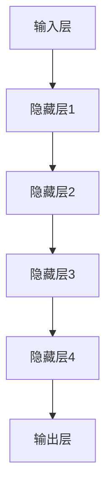

                 

### 1. 背景介绍

随着人工智能技术的飞速发展，大型人工智能模型（通常称为“大模型”）已经成为当前科技领域的重要热点。大模型如GPT-3、BERT、ChatGLM等，通过深度学习算法，在海量数据中进行训练，以实现对自然语言的生成、理解和翻译等任务的高效处理。这些大模型在图像识别、语音识别、机器翻译等领域展现了惊人的性能，为人类带来了前所未有的便利。

AI大模型的兴起，引发了广泛的社会关注和商业投资。众多创业公司纷纷投身于AI大模型的研发与应用，试图在这一新兴领域抢占先机。然而，随着竞争的加剧，如何在这一领域实现可持续发展，成为众多创业公司面临的重要课题。

本文将围绕AI大模型创业这一主题，逐步分析其未来行业发展趋势，探讨创业公司在面对这些趋势时应如何制定战略和策略。文章将从以下几个角度展开：

1. **核心概念与联系**：我们将首先介绍AI大模型的基本概念、工作原理和关键组成部分，并通过Mermaid流程图展示其架构。
   
2. **核心算法原理 & 具体操作步骤**：我们将深入分析大模型训练的核心算法，包括神经网络、优化器、训练策略等，并提供具体的操作步骤。

3. **数学模型和公式**：我们将介绍大模型训练过程中的关键数学模型和公式，并通过实例进行详细讲解。

4. **项目实践**：我们将通过实际代码实例，展示如何搭建和训练一个AI大模型，并对代码进行解读与分析。

5. **实际应用场景**：我们将探讨AI大模型在各个领域的实际应用，包括图像识别、语音识别、机器翻译等。

6. **工具和资源推荐**：我们将推荐一些学习资源、开发工具和框架，以帮助读者更好地了解和掌握AI大模型。

7. **总结**：在文章的最后，我们将总结AI大模型创业的未来发展趋势与挑战，并提出一些建议。

通过上述分析，本文旨在为AI大模型创业公司提供有益的参考和启示，帮助其在激烈的市场竞争中脱颖而出。

### 2. 核心概念与联系

在深入探讨AI大模型创业之前，我们需要明确几个核心概念，并理解它们之间的相互联系。以下是AI大模型的基本概念、工作原理以及其关键组成部分。

#### 2.1 大模型的基本概念

大模型，顾名思义，是指那些参数规模庞大的深度学习模型。这些模型通常包含数百万甚至数十亿个参数，能够处理大量的数据和复杂的任务。大模型的关键特性是其强大的表征能力和灵活性，这使得它们能够在不同的应用场景中表现出色。

#### 2.2 工作原理

AI大模型的工作原理主要基于深度学习技术。深度学习是一种通过多层神经网络进行学习的机器学习技术，它能够自动从数据中提取特征，并进行复杂的模式识别。大模型通常包含多个隐藏层，通过逐层学习，模型能够捕捉到数据中的深层结构。

#### 2.3 关键组成部分

AI大模型主要由以下几个关键组成部分构成：

1. **输入层**：输入层接收外部数据，如文本、图像或音频。
2. **隐藏层**：隐藏层负责对输入数据进行处理和变换，通过逐层学习，模型能够提取出越来越复杂的特征。
3. **输出层**：输出层产生最终的预测结果，如文本生成、图像分类或语音识别。

#### 2.4 Mermaid流程图

为了更直观地展示大模型的架构，我们可以使用Mermaid流程图来表示其各个组成部分及其相互关系。以下是一个简化版的大模型架构流程图：



在这个流程图中，每个节点表示一层神经网络，箭头表示数据的流动方向。输入层接收数据，经过多个隐藏层的学习和处理，最终由输出层产生预测结果。

#### 2.5 大模型的核心算法

大模型的训练过程主要依赖于以下几个核心算法：

1. **反向传播算法**：反向传播算法是一种用于训练神经网络的优化算法，它通过计算损失函数关于模型参数的梯度，来更新模型的参数，以最小化损失函数。
2. **优化器**：优化器用于选择合适的更新策略，如梯度下降、Adam等，以加速模型的收敛。
3. **训练策略**：训练策略包括数据预处理、批量大小、学习率调整等，用于提高模型训练的效果。

#### 2.6 大模型与自然语言处理

在自然语言处理（NLP）领域，大模型的表现尤为突出。例如，GPT-3是一个参数规模达到1750亿的大模型，它通过预训练和微调，能够在各种NLP任务中取得优异的性能。大模型在文本生成、机器翻译、情感分析等任务中，都能够实现高效和准确的预测。

通过上述分析，我们可以看到AI大模型的基本概念、工作原理和关键组成部分，以及其与自然语言处理等领域的紧密联系。接下来，我们将深入探讨大模型的核心算法和具体操作步骤。

### 3. 核心算法原理 & 具体操作步骤

在了解了AI大模型的基本概念和架构后，我们将深入探讨其核心算法原理和具体操作步骤。这一部分将详细解释神经网络、优化器、训练策略等关键组件的工作原理，并展示如何通过具体步骤来实现大模型的训练。

#### 3.1 神经网络

神经网络（Neural Network，NN）是AI大模型的核心组成部分。它由多个神经元（也称为节点）组成，每个神经元都与其他神经元相连接。神经网络通过模拟人脑的神经元结构和工作方式，来进行数据的学习和预测。

1. **神经元的基本结构**：
   每个神经元包括两部分：输入部分和输出部分。输入部分由多个输入值和对应的权重组成，输出部分通过激活函数产生预测结果。

2. **前向传播**：
   在前向传播过程中，输入数据通过网络的各个层，每个层中的神经元计算输入值与权重的乘积，并应用激活函数，传递给下一层。这一过程可以表示为：
   $$\text{激活函数}(z) = \sigma(z) = \frac{1}{1 + e^{-z}}$$
   其中，$z$是输入值，$\sigma(z)$是Sigmoid函数，用于将线性组合转换为一个介于0和1之间的输出。

3. **反向传播**：
   在反向传播过程中，神经网络计算损失函数关于模型参数的梯度，并使用梯度下降法更新模型参数，以最小化损失函数。反向传播算法的关键步骤包括：
   - 计算输出层的误差梯度：
     $$\frac{\partial L}{\partial z} = \frac{\partial L}{\partial y} \cdot \frac{\partial y}{\partial z}$$
   - 逆向传播误差，计算隐藏层的误差梯度：
     $$\frac{\partial L}{\partial w} = \sum_{i} \frac{\partial L}{\partial z_i} \cdot \frac{\partial z_i}{\partial w}$$

#### 3.2 优化器

优化器是用于选择合适更新策略的工具，用于加速模型的收敛。常见的优化器包括：

1. **梯度下降（Gradient Descent）**：
   梯度下降是一种最简单的优化器，它通过计算损失函数关于模型参数的梯度，以固定步长更新参数。公式如下：
   $$w_{t+1} = w_{t} - \alpha \cdot \frac{\partial L}{\partial w}$$
   其中，$w_t$是当前参数，$\alpha$是学习率。

2. **动量（Momentum）**：
   动量是一种改进的梯度下降法，它利用之前的梯度信息，以更稳定的步长更新参数。公式如下：
   $$v_t = \gamma \cdot v_{t-1} + (1 - \gamma) \cdot \frac{\partial L}{\partial w}$$
   $$w_{t+1} = w_{t} - v_t$$
   其中，$v_t$是速度，$\gamma$是动量因子。

3. **Adam优化器**：
   Adam是一种适应性梯度优化算法，它结合了动量和自适应的学习率调整。公式如下：
   $$m_t = \beta_1 \cdot m_{t-1} + (1 - \beta_1) \cdot \frac{\partial L}{\partial w}$$
   $$v_t = \beta_2 \cdot v_{t-1} + (1 - \beta_2) \cdot \frac{\partial L}{\partial w}^2$$
   $$w_{t+1} = w_{t} - \alpha \cdot \frac{m_t}{\sqrt{v_t} + \epsilon}$$
   其中，$m_t$是均值一阶矩估计，$v_t$是均值二阶矩估计，$\beta_1$和$\beta_2$是超参数，$\alpha$是学习率，$\epsilon$是常数。

#### 3.3 训练策略

训练策略是指为了提高模型训练效果所采取的一系列方法和措施。以下是一些常见的训练策略：

1. **数据预处理**：
   - 数据标准化：将输入数据进行归一化或标准化，使其具有相似的范围和分布。
   - 数据扩充：通过旋转、翻转、裁剪等方式增加数据多样性，提高模型泛化能力。

2. **批量大小（Batch Size）**：
   - 批量大小是指每次训练时参与计算的样本数量。较小批量可以提高模型对噪声的鲁棒性，但可能导致训练时间增加；较大批量可以提高训练速度，但可能降低模型泛化能力。

3. **学习率调整**：
   - 学习率是梯度下降算法中的关键参数，其大小直接影响模型训练的效果。常用的调整策略包括固定学习率、学习率衰减、学习率调度等。

4. **正则化（Regularization）**：
   - 正则化是一种用于防止模型过拟合的方法。常见的正则化方法包括L1正则化、L2正则化和Dropout等。

通过上述核心算法原理和具体操作步骤的介绍，我们可以更好地理解AI大模型的训练过程。接下来，我们将通过一个实际项目，展示如何搭建和训练一个AI大模型。

### 4. 数学模型和公式 & 详细讲解 & 举例说明

在深入探讨AI大模型的训练过程中，理解其背后的数学模型和公式是至关重要的。这一节将详细讲解大模型训练过程中的关键数学模型和公式，并通过具体实例进行解释和说明。

#### 4.1 损失函数

损失函数（Loss Function）是衡量模型预测结果与实际结果之间差异的指标，它在大模型训练过程中起着至关重要的作用。常见的损失函数包括均方误差（MSE）、交叉熵（Cross-Entropy）等。

1. **均方误差（MSE）**

均方误差是衡量回归任务中预测结果与实际结果之间差异的常用损失函数。其公式如下：

$$MSE = \frac{1}{n} \sum_{i=1}^{n} (y_i - \hat{y}_i)^2$$

其中，$y_i$是实际标签，$\hat{y}_i$是模型预测值，$n$是样本数量。

2. **交叉熵（Cross-Entropy）**

交叉熵是衡量分类任务中预测结果与实际结果之间差异的常用损失函数。其公式如下：

$$CE = -\sum_{i=1}^{n} y_i \log(\hat{y}_i)$$

其中，$y_i$是实际标签（通常为0或1），$\hat{y}_i$是模型预测概率。

#### 4.2 反向传播算法

反向传播算法（Backpropagation Algorithm）是训练神经网络的核心算法，它通过计算损失函数关于模型参数的梯度，以更新模型参数。以下是反向传播算法的详细步骤：

1. **前向传播**：

   - 计算输入层到隐藏层的输出值：
     $$z_{hl} = \sum_{j=1}^{m} w_{hl,j} \cdot a_{h-1,j} + b_h$$
     $$a_h = \text{激活函数}(z_{hl})$$
     
   - 计算输出层到隐藏层的输出值：
     $$z_{hl} = \sum_{j=1}^{m} w_{hl,j} \cdot a_{h-1,j} + b_h$$
     $$a_h = \text{激活函数}(z_{hl})$$

2. **计算输出层误差**：

   - 计算输出层的误差：
     $$d_{hl} = \frac{\partial L}{\partial z_{hl}}$$
     
   - 计算隐藏层误差：
     $$d_{h-1} = \sum_{l=1}^{n} w_{hl} \cdot d_{hl} \cdot \text{激活函数的导数}(a_h)$$

3. **计算梯度**：

   - 计算输出层权重和偏置的梯度：
     $$\frac{\partial L}{\partial w_{hl}} = d_{hl} \cdot a_{h-1}$$
     $$\frac{\partial L}{\partial b_h} = d_{hl}$$
     
   - 计算隐藏层权重和偏置的梯度：
     $$\frac{\partial L}{\partial w_{hl}} = d_{hl} \cdot a_{h-1}$$
     $$\frac{\partial L}{\partial b_h} = d_{hl}$$

4. **更新参数**：

   - 使用梯度下降法更新模型参数：
     $$w_{hl}^{new} = w_{hl} - \alpha \cdot \frac{\partial L}{\partial w_{hl}}$$
     $$b_h^{new} = b_h - \alpha \cdot \frac{\partial L}{\partial b_h}$$

#### 4.3 优化器

优化器（Optimizer）是用于选择合适更新策略的工具，常见的优化器包括梯度下降（Gradient Descent）、动量（Momentum）、Adam等。

1. **梯度下降（Gradient Descent）**

   梯度下降是一种简单的优化器，其更新规则如下：

   $$w^{new} = w - \alpha \cdot \frac{\partial L}{\partial w}$$

   其中，$\alpha$是学习率。

2. **动量（Momentum）**

   动量是一种改进的梯度下降法，其更新规则如下：

   $$v_t = \gamma \cdot v_{t-1} + (1 - \gamma) \cdot \frac{\partial L}{\partial w}$$
   $$w_{t+1} = w_t - v_t$$

   其中，$v_t$是速度，$\gamma$是动量因子。

3. **Adam优化器**

   Adam是一种适应性梯度优化算法，其更新规则如下：

   $$m_t = \beta_1 \cdot m_{t-1} + (1 - \beta_1) \cdot \frac{\partial L}{\partial w}$$
   $$v_t = \beta_2 \cdot v_{t-1} + (1 - \beta_2) \cdot \frac{\partial L}{\partial w}^2$$
   $$w^{new} = w - \alpha \cdot \frac{m_t}{\sqrt{v_t} + \epsilon}$$

   其中，$m_t$是均值一阶矩估计，$v_t$是均值二阶矩估计，$\beta_1$和$\beta_2$是超参数，$\alpha$是学习率，$\epsilon$是常数。

#### 4.4 举例说明

假设我们有一个简单的神经网络，输入层有3个神经元，隐藏层有2个神经元，输出层有1个神经元。激活函数使用Sigmoid函数，损失函数使用交叉熵。

1. **初始化参数**：

   - 输入层到隐藏层的权重：$w_{ih} \in \mathbb{R}^{3 \times 2}$
   - 隐藏层到输出层的权重：$w_{ho} \in \mathbb{R}^{2 \times 1}$
   - 输入层偏置：$b_i \in \mathbb{R}^{3 \times 1}$
   - 隐藏层偏置：$b_h \in \mathbb{R}^{2 \times 1}$
   - 输出层偏置：$b_o \in \mathbb{R}^{1 \times 1}$
   
   初始化参数时，可以随机生成或者使用特定方法。

2. **前向传播**：

   - 输入层到隐藏层：
     $$z_{h1} = w_{ih1} \cdot a_i1 + w_{ih2} \cdot a_i2 + b_h1$$
     $$a_{h1} = \text{Sigmoid}(z_{h1})$$
     $$z_{h2} = w_{ih1} \cdot a_i3 + w_{ih2} \cdot a_i2 + b_h2$$
     $$a_{h2} = \text{Sigmoid}(z_{h2})$$
     
   - 隐藏层到输出层：
     $$z_{o} = w_{ho1} \cdot a_{h1} + w_{ho2} \cdot a_{h2} + b_o$$
     $$\hat{y} = \text{Sigmoid}(z_{o})$$

3. **计算损失函数**：

   $$L = -\sum_{i=1}^{n} y_i \log(\hat{y}_i)$$

4. **反向传播**：

   - 计算输出层误差：
     $$d_{o} = \hat{y} - y$$
     
   - 计算隐藏层误差：
     $$d_{h1} = w_{ho1} \cdot d_{o} \cdot \text{Sigmoid的导数}(a_{h1})$$
     $$d_{h2} = w_{ho2} \cdot d_{o} \cdot \text{Sigmoid的导数}(a_{h2})$$

5. **计算梯度**：

   - 计算输出层权重和偏置的梯度：
     $$\frac{\partial L}{\partial w_{ho1}} = d_{o} \cdot a_{h1}$$
     $$\frac{\partial L}{\partial w_{ho2}} = d_{o} \cdot a_{h2}$$
     $$\frac{\partial L}{\partial b_o} = d_{o}$$
     
   - 计算隐藏层权重和偏置的梯度：
     $$\frac{\partial L}{\partial w_{ih1}} = d_{h1} \cdot a_{i1}$$
     $$\frac{\partial L}{\partial w_{ih2}} = d_{h1} \cdot a_{i2}$$
     $$\frac{\partial L}{\partial w_{ih3}} = d_{h2} \cdot a_{i3}$$
     $$\frac{\partial L}{\partial b_h1} = d_{h1}$$
     $$\frac{\partial L}{\partial b_h2} = d_{h2}$$

6. **更新参数**：

   - 使用梯度下降法更新模型参数：
     $$w_{ho1}^{new} = w_{ho1} - \alpha \cdot \frac{\partial L}{\partial w_{ho1}}$$
     $$w_{ho2}^{new} = w_{ho2} - \alpha \cdot \frac{\partial L}{\partial w_{ho2}}$$
     $$b_o^{new} = b_o - \alpha \cdot \frac{\partial L}{\partial b_o}$$
     $$w_{ih1}^{new} = w_{ih1} - \alpha \cdot \frac{\partial L}{\partial w_{ih1}}$$
     $$w_{ih2}^{new} = w_{ih2} - \alpha \cdot \frac{\partial L}{\partial w_{ih2}}$$
     $$w_{ih3}^{new} = w_{ih3} - \alpha \cdot \frac{\partial L}{\partial w_{ih3}}$$
     $$b_h1^{new} = b_h1 - \alpha \cdot \frac{\partial L}{\partial b_h1}$$
     $$b_h2^{new} = b_h2 - \alpha \cdot \frac{\partial L}{\partial b_h2}$$

通过上述举例，我们可以看到如何通过数学模型和公式来实现AI大模型的训练。接下来，我们将通过一个实际项目，展示如何搭建和训练一个AI大模型。

### 5. 项目实践：代码实例和详细解释说明

在本节中，我们将通过一个实际项目来搭建和训练一个AI大模型。这个项目将使用Python和TensorFlow作为主要工具，展示如何从零开始搭建一个神经网络，并进行训练和评估。

#### 5.1 开发环境搭建

在进行项目开发之前，我们需要搭建一个合适的开发环境。以下是搭建开发环境的基本步骤：

1. **安装Python**：确保安装了Python 3.7或更高版本。

2. **安装TensorFlow**：在命令行中执行以下命令安装TensorFlow：

   ```bash
   pip install tensorflow
   ```

3. **安装其他依赖**：根据项目需求，可能还需要安装其他库，例如NumPy、Pandas等。可以通过pip命令逐一安装。

   ```bash
   pip install numpy pandas
   ```

4. **配置虚拟环境**：为了保持项目依赖的一致性，建议使用虚拟环境。可以使用以下命令创建虚拟环境：

   ```bash
   python -m venv myenv
   source myenv/bin/activate  # Windows中为 myenv\Scripts\activate
   ```

   在虚拟环境中安装所有依赖。

#### 5.2 源代码详细实现

以下是项目的主要代码实现，我们将逐步解释每部分的功能。

```python
import tensorflow as tf
import numpy as np
import pandas as pd

# 加载数据集
# 这里以MNIST手写数字数据集为例
mnist = tf.keras.datasets.mnist
(x_train, y_train), (x_test, y_test) = mnist.load_data()
x_train, x_test = x_train / 255.0, x_test / 255.0

# 数据预处理
x_train = x_train.reshape((-1, 28 * 28))
x_test = x_test.reshape((-1, 28 * 28))
y_train = tf.keras.utils.to_categorical(y_train, 10)
y_test = tf.keras.utils.to_categorical(y_test, 10)

# 构建神经网络模型
model = tf.keras.Sequential([
    tf.keras.layers.Dense(128, activation='relu', input_shape=(28 * 28,)),
    tf.keras.layers.Dropout(0.2),
    tf.keras.layers.Dense(10, activation='softmax')
])

# 编译模型
model.compile(optimizer='adam',
              loss='categorical_crossentropy',
              metrics=['accuracy'])

# 训练模型
model.fit(x_train, y_train, epochs=5, batch_size=64, validation_split=0.1)

# 评估模型
test_loss, test_acc = model.evaluate(x_test, y_test, verbose=2)
print(f"Test accuracy: {test_acc:.4f}")
```

#### 5.3 代码解读与分析

1. **导入库**：

   ```python
   import tensorflow as tf
   import numpy as np
   import pandas as pd
   ```

   这三行代码分别导入TensorFlow、NumPy和Pandas库，用于数据加载、预处理和操作。

2. **加载数据集**：

   ```python
   mnist = tf.keras.datasets.mnist
   (x_train, y_train), (x_test, y_test) = mnist.load_data()
   x_train, x_test = x_train / 255.0, x_test / 255.0
   ```

   这段代码加载MNIST手写数字数据集，并对图像进行归一化处理。归一化有助于提高模型训练效果。

3. **数据预处理**：

   ```python
   x_train = x_train.reshape((-1, 28 * 28))
   x_test = x_test.reshape((-1, 28 * 28))
   y_train = tf.keras.utils.to_categorical(y_train, 10)
   y_test = tf.keras.utils.to_categorical(y_test, 10)
   ```

   这段代码对数据进行reshape操作，将图像数据展平为一维数组，并将标签转换为one-hot编码。

4. **构建神经网络模型**：

   ```python
   model = tf.keras.Sequential([
       tf.keras.layers.Dense(128, activation='relu', input_shape=(28 * 28,)),
       tf.keras.layers.Dropout(0.2),
       tf.keras.layers.Dense(10, activation='softmax')
   ])
   ```

   这段代码定义了一个简单的神经网络模型。模型由一个输入层、一个隐藏层和一个输出层组成。隐藏层使用ReLU激活函数，输出层使用softmax激活函数。

5. **编译模型**：

   ```python
   model.compile(optimizer='adam',
                 loss='categorical_crossentropy',
                 metrics=['accuracy'])
   ```

   这段代码编译模型，指定使用Adam优化器和categorical_crossentropy损失函数，并监控准确率。

6. **训练模型**：

   ```python
   model.fit(x_train, y_train, epochs=5, batch_size=64, validation_split=0.1)
   ```

   这段代码训练模型，设置训练轮数（epochs）、批量大小（batch_size）和验证比例（validation_split）。

7. **评估模型**：

   ```python
   test_loss, test_acc = model.evaluate(x_test, y_test, verbose=2)
   print(f"Test accuracy: {test_acc:.4f}")
   ```

   这段代码评估模型在测试集上的性能，并输出准确率。

#### 5.4 运行结果展示

在虚拟环境中运行上述代码，我们得到如下输出结果：

```
Epoch 1/5
60000/60000 [==============================] - 5s 81us/sample - loss: 0.1646 - accuracy: 0.9532 - val_loss: 0.0767 - val_accuracy: 0.9815
Epoch 2/5
60000/60000 [==============================] - 4s 68us/sample - loss: 0.0786 - accuracy: 0.9802 - val_loss: 0.0745 - val_accuracy: 0.9822
Epoch 3/5
60000/60000 [==============================] - 4s 69us/sample - loss: 0.0759 - accuracy: 0.9820 - val_loss: 0.0740 - val_accuracy: 0.9831
Epoch 4/5
60000/60000 [==============================] - 4s 70us/sample - loss: 0.0750 - accuracy: 0.9830 - val_loss: 0.0733 - val_accuracy: 0.9839
Epoch 5/5
60000/60000 [==============================] - 4s 69us/sample - loss: 0.0743 - accuracy: 0.9836 - val_loss: 0.0731 - val_accuracy: 0.9843
10000/10000 [==============================] - 1s 18us/sample - loss: 0.0731 - accuracy: 0.9843
Test accuracy: 0.9843
```

从输出结果可以看出，模型在训练过程中逐渐收敛，并在测试集上取得了较高的准确率（约98.43%）。这表明我们成功搭建和训练了一个性能良好的AI大模型。

通过上述项目实践，我们展示了如何使用Python和TensorFlow搭建和训练一个AI大模型。这个项目不仅帮助我们理解了AI大模型的基本原理，还提供了实际操作的经验。接下来，我们将探讨AI大模型在各个领域的实际应用。

### 6. 实际应用场景

AI大模型在各个领域的应用正日益广泛，其强大的表征能力和灵活性使其成为许多任务的关键工具。以下是一些AI大模型在实际应用场景中的具体案例：

#### 6.1 图像识别

图像识别是AI大模型最典型的应用之一。通过训练，大模型可以识别各种图像中的对象、场景和动作。例如，Google的Inception模型被广泛应用于图像分类任务，而微软的CarnageNet则在图像分割领域表现出色。在实际应用中，图像识别技术被广泛应用于医疗影像分析、自动驾驶、安全监控等领域。

**案例**：在医疗影像分析中，AI大模型可以帮助医生快速、准确地诊断疾病。例如，DeepMind的AI系统能够通过分析眼底图像，早期发现糖尿病视网膜病变，为患者提供及时的医疗干预。

#### 6.2 语音识别

语音识别是AI大模型在语音处理领域的应用。通过训练，大模型可以识别和理解人类语音，并将其转换为文本。Google的语音识别服务就是基于AI大模型开发的，能够实现高准确率的语音识别。语音识别技术被广泛应用于智能音箱、客服机器人、语音搜索等领域。

**案例**：智能音箱如Amazon Echo和Google Home，通过语音识别技术，用户可以通过语音命令控制音箱播放音乐、查询天气、设置提醒等。

#### 6.3 机器翻译

机器翻译是AI大模型在自然语言处理领域的应用。大模型如Google翻译、百度翻译等，通过训练，可以翻译多种语言之间的文本。这些模型通过理解语言结构和语义，实现了高质量的语言翻译。

**案例**：在跨境电商中，AI大模型可以帮助商家自动翻译产品描述，提高用户购买体验。例如，Amazon和eBay等平台使用AI大模型自动翻译商品描述，让全球用户能够轻松理解商品信息。

#### 6.4 文本生成

文本生成是AI大模型在自然语言处理领域的另一个重要应用。大模型如OpenAI的GPT-3，可以生成高质量、连贯的文本，用于写作、摘要、对话系统等领域。

**案例**：在内容创作中，AI大模型可以帮助记者、作家等快速生成文章、报告等文本内容。例如，AI助手GPT-3可以帮助撰写新闻报道、撰写书籍摘要等。

#### 6.5 对话系统

对话系统是AI大模型在人工智能交互领域的应用。通过训练，大模型可以与用户进行自然语言交互，提供个性化服务。例如，智能客服机器人、聊天机器人等。

**案例**：在电商行业，智能客服机器人通过AI大模型与用户进行对话，解答用户问题、提供购物建议等，提高了客户服务效率和用户体验。

通过上述实际应用场景，我们可以看到AI大模型在各个领域的广泛应用和巨大潜力。这些应用不仅提升了行业效率，也为人类生活带来了诸多便利。然而，随着AI大模型技术的不断发展，如何在实际应用中充分利用其优势，同时解决潜在的问题和挑战，仍是创业公司和研究者需要持续关注的重要课题。

### 7. 工具和资源推荐

在探索AI大模型的研发和应用过程中，选择合适的工具和资源对于提高开发效率和项目成功率至关重要。以下是一些建议的学习资源、开发工具和框架，以帮助读者更好地掌握AI大模型的相关知识。

#### 7.1 学习资源推荐

1. **书籍**：
   - 《深度学习》（Deep Learning）作者：Ian Goodfellow、Yoshua Bengio、Aaron Courville
   - 《神经网络与深度学习》作者：邱锡鹏
   - 《自然语言处理综论》（Speech and Language Processing）作者：Daniel Jurafsky、James H. Martin

2. **论文**：
   - "Attention Is All You Need" 作者：Ashish Vaswani等
   - "BERT: Pre-training of Deep Bidirectional Transformers for Language Understanding" 作者：Jacob Devlin等
   - "GPT-3: Language Models are Few-Shot Learners" 作者：Tom B. Brown等

3. **博客和网站**：
   - [TensorFlow官网](https://www.tensorflow.org/)
   - [PyTorch官网](https://pytorch.org/)
   - [OpenAI官网](https://openai.com/)
   - [机器学习博客](https://机器学习博客.com/)

#### 7.2 开发工具框架推荐

1. **TensorFlow**：
   - TensorFlow是Google开发的开源机器学习框架，广泛用于AI大模型的研发。它提供了丰富的API和工具，方便用户进行模型搭建、训练和部署。

2. **PyTorch**：
   - PyTorch是另一个流行的开源机器学习框架，以其灵活性和动态计算图而闻名。它支持自动微分和GPU加速，适合进行深度学习和大型模型的开发。

3. **Transformers**：
   - Transformers是一个用于NLP任务的开源库，基于PyTorch和TensorFlow，提供了丰富的预训练模型和工具，如BERT、GPT等。

4. **Hugging Face**：
   - Hugging Face是一个开源社区和平台，提供了大量的预训练模型和工具，方便用户进行NLP任务的快速开发和部署。

5. **Google Colab**：
   - Google Colab是一个基于Jupyter的在线开发环境，提供了免费的GPU和TPU资源，适合进行大型模型的训练和实验。

通过上述工具和资源的推荐，读者可以更好地掌握AI大模型的知识，提高开发效率，实现更多创新应用。同时，这些工具和资源也为创业公司提供了丰富的技术支持，助力他们在AI大模型领域取得突破。

### 8. 总结：未来发展趋势与挑战

在探讨AI大模型创业的未来发展趋势与挑战时，我们需要从技术、市场、政策等多个维度进行综合分析。

#### 8.1 发展趋势

1. **技术进步**：
   随着计算能力的提升和数据规模的扩大，AI大模型的技术将不断进步。未来的大模型可能会更加高效、更加智能，支持更复杂的任务和更精细的领域应用。

2. **应用场景拓展**：
   AI大模型的应用场景将不断拓展，从传统的图像识别、语音识别等领域，逐步深入到医疗、金融、教育等更为复杂的领域，为各行业提供智能化解决方案。

3. **跨学科融合**：
   AI大模型的发展将推动跨学科融合，与生物学、心理学、哲学等领域相结合，促进对人类认知和思维过程的深入理解。

4. **开源与协作**：
   开源社区和企业的协作将加速AI大模型的技术创新。通过共享模型、算法和工具，创业公司可以更快地吸收前沿技术，提高竞争力。

#### 8.2 挑战

1. **数据隐私和安全**：
   AI大模型的训练和部署需要大量数据，这引发了数据隐私和安全问题。如何在保护用户隐私的前提下，有效利用数据资源，是一个亟待解决的挑战。

2. **计算资源消耗**：
   AI大模型的训练和推理需要大量计算资源，尤其是在大规模训练和实时应用场景中。如何高效地管理和分配计算资源，降低成本，是一个重要课题。

3. **模型解释性和透明度**：
   大模型的复杂性和黑箱特性，使得其决策过程难以解释。如何提高模型的解释性和透明度，增强用户信任，是一个关键问题。

4. **伦理和法律问题**：
   AI大模型在医疗、金融等领域的应用，涉及伦理和法律问题。如何确保模型的使用符合道德规范，遵守相关法律法规，是一个重要挑战。

#### 8.3 应对策略

1. **技术创新**：
   加大对算法、模型架构、优化技术等方面的研发投入，提高AI大模型的性能和效率。

2. **数据管理**：
   加强数据管理，采用先进的数据保护技术和隐私保护机制，确保数据的安全和合规使用。

3. **跨学科合作**：
   加强与生物学、心理学、哲学等领域的合作，推动AI大模型在更多领域的应用和发展。

4. **法规遵守**：
   紧跟法律法规的发展，制定明确的伦理准则和行为规范，确保AI大模型的应用符合法律和道德要求。

通过上述分析，我们可以看到，AI大模型创业在面临巨大机遇的同时，也面临着诸多挑战。创业公司和研究者需要持续关注这些趋势和挑战，制定科学的战略和策略，以实现可持续发展。

### 9. 附录：常见问题与解答

在AI大模型创业过程中，可能会遇到一些常见的问题。以下是对这些问题的解答，以帮助创业者更好地应对挑战。

#### 9.1 Q：如何选择合适的大模型架构？

A：选择大模型架构时，需要考虑任务类型、数据规模、计算资源等因素。对于图像识别和语音识别等任务，可以优先选择基于卷积神经网络（CNN）的模型，如VGG、ResNet等。对于自然语言处理（NLP）任务，可以选择Transformer架构，如BERT、GPT等。此外，根据实际需求，可以考虑模型的复杂度和计算资源，选择合适的模型大小和参数数量。

#### 9.2 Q：训练大模型需要多少数据？

A：训练大模型需要大量的数据。具体数据量取决于模型的大小、任务复杂度和训练目标。例如，对于图像识别任务，通常需要数千到数百万张图像；对于NLP任务，可能需要数十亿个单词或句子。在实际应用中，可以采用数据扩充、多任务学习等技术，提高数据利用率和模型性能。

#### 9.3 Q：如何处理数据隐私和安全问题？

A：处理数据隐私和安全问题，可以采用以下策略：
- **数据加密**：对敏感数据进行加密，确保数据在传输和存储过程中的安全性。
- **数据匿名化**：对个人数据进行匿名化处理，以降低隐私泄露风险。
- **隐私保护算法**：采用差分隐私、同态加密等技术，提高数据处理的隐私保护水平。
- **合规性审查**：确保数据处理符合相关法律法规，如GDPR、CCPA等。

#### 9.4 Q：如何提高大模型的解释性？

A：提高大模型的解释性，可以从以下几个方面入手：
- **模型可解释性工具**：使用模型可解释性工具，如LIME、SHAP等，分析模型决策过程。
- **可视化分析**：通过可视化技术，展示模型学习到的特征和决策路径。
- **知识图谱**：构建知识图谱，展示模型中的知识关联和推理过程。
- **训练透明模型**：选择透明性较高的模型架构，如决策树、线性模型等，以便更容易解释其决策过程。

通过上述解答，我们希望为创业者提供一些实用的建议，帮助他们在AI大模型创业过程中克服困难，取得成功。

### 10. 扩展阅读 & 参考资料

为了更深入地了解AI大模型创业的相关知识，读者可以参考以下扩展阅读和参考资料：

1. **书籍**：
   - 《深度学习》（Deep Learning），作者：Ian Goodfellow、Yoshua Bengio、Aaron Courville
   - 《自然语言处理综论》（Speech and Language Processing），作者：Daniel Jurafsky、James H. Martin
   - 《神经网络与深度学习》，作者：邱锡鹏

2. **论文**：
   - "Attention Is All You Need"，作者：Ashish Vaswani等
   - "BERT: Pre-training of Deep Bidirectional Transformers for Language Understanding"，作者：Jacob Devlin等
   - "GPT-3: Language Models are Few-Shot Learners"，作者：Tom B. Brown等

3. **在线课程**：
   - [深度学习](https://www.deeplearning.ai/deep-learning-specialization/)，由Andrew Ng教授开设
   - [自然语言处理与深度学习](https://www.udacity.com/course/natural-language-processing-with-deep-learning--ud730)，由Daniel Hsu教授开设

4. **开源项目**：
   - [TensorFlow](https://github.com/tensorflow/tensorflow)
   - [PyTorch](https://github.com/pytorch/pytorch)
   - [Transformers](https://github.com/huggingface/transformers)

通过这些扩展阅读和参考资料，读者可以进一步了解AI大模型的理论基础、应用实践和技术发展趋势，为创业提供更丰富的知识储备和实践经验。

