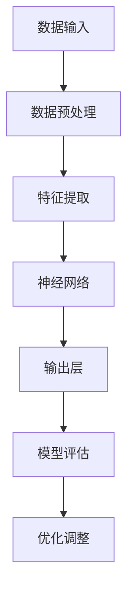

                 

### 背景介绍 Background Introduction

在当前技术迅猛发展的时代，人工智能（AI）已经成为全球科技创新的焦点。特别是在大模型领域，如GPT-3、BERT和AlphaFold等模型的崛起，不仅推动了AI技术的边界，也带来了新的商业机遇。这些大型AI模型的训练和部署，使得AI应用在自然语言处理、计算机视觉、生物医药等多个领域取得了显著进展。

然而，AI大模型的开发和应用也面临一系列挑战，如计算资源需求巨大、训练成本高昂、模型解释性差等。因此，如何抓住AI大模型带来的未来机遇，成为众多创业者和技术专家关注的焦点。

本文将围绕以下三个方面展开：

1. **核心概念与联系**：介绍AI大模型的基本概念和关键组成部分，并通过Mermaid流程图展示其架构。
2. **核心算法原理与具体操作步骤**：深入解析大模型训练中的关键算法，包括损失函数、优化器等，并提供详细的操作步骤。
3. **项目实践与运行结果展示**：通过具体的代码实例，展示如何实现一个简单的AI大模型，并提供代码解读与分析。

在接下来的内容中，我们将逐步剖析这些主题，帮助读者全面了解AI大模型的技术原理和实践方法。

## 1.1 AI大模型的基本概念 Basic Concepts of AI Large Models

人工智能大模型，通常指的是具有数亿甚至千亿参数的神经网络模型。这些模型通过大量的数据训练，可以自动学习并提取复杂的数据特征，从而在自然语言处理、计算机视觉、语音识别等领域表现出色。其中，最著名的例子就是OpenAI的GPT-3，它拥有1750亿个参数，能够进行自然语言生成、文本分类等多种任务。

AI大模型的主要组成部分包括：

- **输入层**（Input Layer）：接收外部输入，如文本、图像、声音等。
- **隐藏层**（Hidden Layers）：多层神经网络的核心部分，负责数据的处理和特征提取。
- **输出层**（Output Layer）：产生模型的输出，如分类结果、文本生成等。

此外，大模型的训练通常涉及到以下关键技术：

- **反向传播算法**（Backpropagation）：一种用于训练神经网络的方法，通过计算损失函数的梯度来调整模型参数。
- **批量归一化**（Batch Normalization）：用于加速训练并提高模型稳定性的技术。
- **正则化**（Regularization）：用于防止模型过拟合的技术，如L1和L2正则化。

## 1.2 AI大模型的应用领域 Application Fields of AI Large Models

AI大模型的应用领域非常广泛，以下是一些典型的应用场景：

- **自然语言处理（NLP）**：大模型在文本分类、机器翻译、情感分析等方面有着出色的表现。例如，GPT-3可以生成高质量的文章，甚至可以模拟人类的写作风格。
- **计算机视觉（CV）**：在图像识别、目标检测、图像生成等领域，大模型通过学习大量的图像数据，能够提取出更为复杂的特征，从而提升模型的准确性。
- **语音识别（ASR）**：大模型可以处理复杂的语音信号，实现高精度的语音识别，并在此基础上进行语音合成。
- **生物医药**：大模型在基因组分析、药物发现等领域展现了巨大的潜力。例如，AlphaFold通过预测蛋白质结构，为生物医学研究提供了新的工具。

## 1.3 当前AI大模型的发展现状 Development Status of Current AI Large Models

目前，AI大模型的发展正处于快速增长的阶段。以下是一些重要的发展趋势和里程碑：

- **模型规模**：随着计算资源和存储技术的提升，AI大模型的规模不断增加。例如，GPT-3的1750亿个参数已经达到了一个前所未有的规模。
- **训练效率**：优化算法和分布式训练技术的应用，使得大模型的训练时间显著缩短。例如，通过使用TPU等专用硬件，可以大幅提升模型的训练速度。
- **模型可解释性**：尽管大模型在性能上取得了巨大成功，但其内部决策过程往往难以解释。因此，研究人员正在努力提高模型的可解释性，以便更好地理解和应用这些模型。

综上所述，AI大模型作为人工智能领域的重要创新，正不断推动技术的边界，同时也带来了新的商业机遇。然而，要充分利用这些机遇，创业者和技术专家需要深入理解大模型的技术原理和应用方法，这正是本文接下来要深入探讨的内容。

## 2. 核心概念与联系 Core Concepts and Connections

在深入探讨AI大模型之前，首先需要明确几个核心概念及其相互之间的联系。这不仅有助于我们更好地理解大模型的工作原理，也为后续的算法解析和具体操作步骤提供了理论基础。

### 2.1 神经网络（Neural Networks）

神经网络是AI大模型的基础，由大量简单的计算单元（神经元）通过复杂的连接组成。每个神经元接受来自前一层神经元的输入，并通过一个加权函数进行计算，最终产生输出。神经网络的工作原理可以类比为人类大脑的处理方式，通过不断的学习和调整权重来提高模型的性能。

### 2.2 深度学习（Deep Learning）

深度学习是一种基于神经网络的机器学习方法，它通过增加网络的层数来提升模型的抽象能力和表达能力。深度学习在图像识别、语音识别、自然语言处理等领域取得了显著的成果。AI大模型通常属于深度学习的范畴，其核心在于通过大规模数据训练来优化网络参数，实现高度复杂的任务。

### 2.3 大规模数据集（Large-scale Data Sets）

大规模数据集是AI大模型训练的重要资源。这些数据集包含了海量的样本，覆盖了各种可能的场景和任务。通过大量的数据训练，大模型可以更好地泛化到新的任务和数据上，从而提高模型的鲁棒性和准确性。例如，在自然语言处理领域，GPT-3使用了数以万亿计的文本数据来训练。

### 2.4 训练算法（Training Algorithms）

训练算法是AI大模型的核心技术之一。常见的训练算法包括反向传播算法、梯度下降、动量优化等。这些算法通过不断调整网络参数，使模型的输出与期望输出之间的误差最小化。在训练过程中，还会涉及到批量大小、学习率等超参数的调整，以优化模型的训练过程。

### 2.5 模型评估与优化（Model Evaluation and Optimization）

模型评估是确保模型性能的重要步骤。常用的评估指标包括准确率、召回率、F1分数等。通过这些指标，可以评估模型在训练集和测试集上的表现，并发现模型可能存在的问题。模型优化则通过调整网络结构、数据预处理、正则化等技术手段，进一步提升模型的表现。

### 2.6 Mermaid流程图展示（Mermaid Flowchart Illustration）

为了更直观地展示AI大模型的核心概念和架构，我们可以使用Mermaid流程图来表示。以下是一个简化的Mermaid流程图示例，描述了从数据输入到模型输出的过程：



在这个流程图中，数据输入层首先进行预处理，然后通过特征提取层提取数据中的关键特征，接着通过多层神经网络进行复杂的计算，最终在输出层产生模型预测结果。模型评估和优化环节则确保模型的性能得到进一步提升。

通过上述核心概念和Mermaid流程图的介绍，我们可以更好地理解AI大模型的工作原理和架构，为后续的算法解析和具体操作步骤打下坚实基础。

## 3. 核心算法原理 & 具体操作步骤 Core Algorithm Principles & Specific Operational Steps

在了解了AI大模型的基本概念和架构之后，接下来我们将深入探讨其核心算法原理和具体操作步骤。核心算法在大模型训练过程中起到了至关重要的作用，以下是其中几个关键算法的详细解释。

### 3.1 反向传播算法（Backpropagation Algorithm）

反向传播算法是深度学习训练中最重要的算法之一，它通过计算损失函数关于网络参数的梯度，从而调整网络权重，使模型能够更好地拟合训练数据。以下是反向传播算法的具体操作步骤：

1. **前向传播**（Forward Propagation）：将输入数据输入到神经网络中，逐层计算神经元的输出值，直到输出层。
   
   $$Z = \sigma(W \cdot X + b)$$
   
   其中，\(Z\) 为神经元的输出，\(\sigma\) 为激活函数（如Sigmoid、ReLU），\(W\) 为权重，\(X\) 为输入特征，\(b\) 为偏置。

2. **计算损失**（Compute Loss）：计算输出层的预测值与真实值之间的损失，常用的损失函数包括均方误差（MSE）和交叉熵（Cross-Entropy）。

   $$L = \frac{1}{2} \sum (y - \hat{y})^2$$
   
   其中，\(y\) 为真实标签，\(\hat{y}\) 为预测值。

3. **反向传播**（Backward Propagation）：从输出层开始，反向计算每个神经元关于损失函数的梯度，并更新网络权重。

   $$\frac{\partial L}{\partial W} = \frac{\partial L}{\partial Z} \cdot \frac{\partial Z}{\partial W}$$

4. **权重更新**（Update Weights）：根据梯度更新网络权重，常用的优化算法包括梯度下降（Gradient Descent）、动量优化（Momentum）和Adam优化器。

   $$W = W - \alpha \cdot \frac{\partial L}{\partial W}$$
   
   其中，\(\alpha\) 为学习率。

### 3.2 梯度下降算法（Gradient Descent Algorithm）

梯度下降是一种最简单的优化算法，其核心思想是沿着损失函数的梯度方向更新参数，以最小化损失。梯度下降算法的具体操作步骤如下：

1. **初始化参数**：设定初始权重和偏置。

2. **计算梯度**：计算损失函数关于参数的梯度。

3. **更新参数**：根据梯度和学习率更新参数。

4. **重复步骤2和3**，直到满足停止条件（如损失函数收敛或迭代次数达到上限）。

### 3.3 动量优化（Momentum Optimization）

动量优化是一种改进的梯度下降算法，其核心思想是利用历史梯度信息，以加速收敛和提高稳定性。具体操作步骤如下：

1. **初始化参数**：设定初始权重、偏置和动量参数。

2. **计算当前梯度**：计算当前损失函数关于参数的梯度。

3. **更新动量**：根据当前梯度和历史梯度更新动量。

   $$m = \gamma \cdot m + (1 - \gamma) \cdot \frac{\partial L}{\partial W}$$

4. **更新参数**：根据梯度和动量参数更新权重。

5. **重复步骤2到4**，直到满足停止条件。

### 3.4 Adam优化器（Adam Optimizer）

Adam优化器是一种基于动量的自适应优化算法，结合了梯度下降和动量优化的优点。具体操作步骤如下：

1. **初始化参数**：设定初始权重、偏置、学习率、一阶矩估计和二阶矩估计。

2. **计算当前梯度**：计算当前损失函数关于参数的梯度。

3. **更新一阶矩估计**：根据当前梯度和历史梯度更新一阶矩估计。

   $$m_t = \beta_1 \cdot m_{t-1} + (1 - \beta_1) \cdot \frac{\partial L}{\partial W}$$

4. **更新二阶矩估计**：根据当前梯度的平方和更新二阶矩估计。

   $$v_t = \beta_2 \cdot v_{t-1} + (1 - \beta_2) \cdot \left(\frac{\partial L}{\partial W}\right)^2$$

5. **计算修正的一阶矩和二阶矩**：

   $$m_t^{\text{corrected}} = m_t / (1 - \beta_1^t)$$
   $$v_t^{\text{corrected}} = v_t / (1 - \beta_2^t)$$

6. **更新参数**：根据修正的一阶矩和二阶矩以及学习率更新权重。

   $$W = W - \alpha \cdot \frac{m_t^{\text{corrected}}}{\sqrt{v_t^{\text{corrected}}} + \epsilon}$$

7. **重复步骤2到6**，直到满足停止条件。

通过上述核心算法的详细介绍，我们可以更好地理解AI大模型的训练过程和参数调整方法。接下来，我们将通过一个具体的代码实例，展示如何实现一个简单的AI大模型，并提供详细的代码解读和分析。

## 4. 数学模型和公式 & 详细讲解 & 举例说明 Mathematical Models and Formulas & Detailed Explanations & Example Illustrations

在深入了解AI大模型的训练算法后，我们需要进一步探讨其背后的数学模型和公式，这些模型和公式是理解大模型行为和进行模型调优的基础。以下内容将详细介绍与AI大模型相关的几个关键数学模型和公式，并通过具体例子进行解释。

### 4.1 损失函数（Loss Functions）

损失函数是评估模型预测结果与真实值之间差异的关键工具。在训练过程中，我们的目标是通过优化损失函数来提高模型的准确性。以下介绍几种常用的损失函数：

#### 4.1.1 均方误差（Mean Squared Error, MSE）

均方误差是最常用的损失函数之一，尤其适用于回归问题。其公式如下：

$$L(\theta) = \frac{1}{2m} \sum_{i=1}^{m} (y_i - \hat{y}_i)^2$$

其中，\(m\) 是样本数量，\(y_i\) 是真实值，\(\hat{y}_i\) 是预测值。

#### 4.1.2 交叉熵（Cross-Entropy）

交叉熵在分类问题中应用广泛，特别是在多分类任务中。其公式如下：

$$L(\theta) = -\sum_{i=1}^{m} y_i \log(\hat{y}_i)$$

其中，\(y_i\) 是真实标签（0或1），\(\hat{y}_i\) 是预测概率。

#### 4.1.3 Hinge损失（Hinge Loss）

Hinge损失常用于支持向量机（SVM）中，其公式如下：

$$L(\theta) = \max(0, 1 - y \cdot \hat{y})$$

其中，\(y\) 是真实标签（0或1），\(\hat{y}\) 是预测值。

### 4.2 优化器（Optimization Algorithms）

优化器是用于调整模型参数以最小化损失函数的工具。以下介绍几种常用的优化算法：

#### 4.2.1 梯度下降（Gradient Descent）

梯度下降是最简单的优化算法，其核心思想是沿着损失函数的梯度方向更新参数。其公式如下：

$$\theta = \theta - \alpha \cdot \nabla_\theta L(\theta)$$

其中，\(\alpha\) 是学习率，\(\nabla_\theta L(\theta)\) 是损失函数关于参数的梯度。

#### 4.2.2 动量优化（Momentum）

动量优化通过引入动量项来加速梯度下降过程，提高收敛速度。其公式如下：

$$m = \gamma \cdot m + (1 - \gamma) \cdot \nabla_\theta L(\theta)$$
$$\theta = \theta - \alpha \cdot m$$

其中，\(\gamma\) 是动量因子，\(m\) 是动量项。

#### 4.2.3 Adam优化器

Adam优化器是一种结合了动量和自适应学习率的优化算法，其公式如下：

$$m_t = \beta_1 \cdot m_{t-1} + (1 - \beta_1) \cdot \nabla_\theta L(\theta)$$
$$v_t = \beta_2 \cdot v_{t-1} + (1 - \beta_2) \cdot (\nabla_\theta L(\theta))^2$$
$$m_t^{\text{corrected}} = m_t / (1 - \beta_1^t)$$
$$v_t^{\text{corrected}} = v_t / (1 - \beta_2^t)$$
$$\theta = \theta - \alpha \cdot \frac{m_t^{\text{corrected}}}{\sqrt{v_t^{\text{corrected}}} + \epsilon}$$

其中，\(\beta_1\) 和 \(\beta_2\) 是一阶矩估计和二阶矩估计的衰减系数，\(\epsilon\) 是一个小的常数项。

### 4.3 激活函数（Activation Functions）

激活函数是神经网络中用于引入非线性性的关键组件。以下介绍几种常用的激活函数：

#### 4.3.1 Sigmoid函数

Sigmoid函数的公式如下：

$$\sigma(x) = \frac{1}{1 + e^{-x}}$$

Sigmoid函数将输入映射到\(0\)到\(1\)之间的区间，常用于二分类问题。

#### 4.3.2ReLU函数

ReLU函数（Rectified Linear Unit）的公式如下：

$$\sigma(x) = \max(0, x)$$

ReLU函数在神经网络的训练中非常受欢迎，因为它可以避免梯度消失问题，加速训练过程。

#### 4.3.3 tanh函数

tanh函数的公式如下：

$$\tanh(x) = \frac{e^x - e^{-x}}{e^x + e^{-x}}$$

tanh函数的输出范围在\(-1\)到\(1\)之间，类似于Sigmoid函数，但相对于Sigmoid函数，tanh函数更容易保持梯度。

### 4.4 具体例子说明

为了更好地理解上述数学模型和公式，我们通过一个简单的例子来说明。

假设我们有一个简单的神经网络，用于进行二分类任务。输入层有一个神经元，隐藏层有两个神经元，输出层有一个神经元。激活函数使用ReLU函数，损失函数使用交叉熵。

1. **初始化参数**：

   初始权重和偏置随机初始化。

2. **前向传播**：

   输入一个样本，经过多层神经网络计算，得到输出层的预测概率。

3. **计算损失**：

   使用交叉熵损失函数计算预测概率与真实标签之间的差异。

4. **反向传播**：

   从输出层开始，反向计算每个神经元的梯度，更新权重和偏置。

5. **权重更新**：

   使用Adam优化器更新权重。

通过这个简单的例子，我们可以看到数学模型和公式在实际神经网络训练中的应用。在实际应用中，模型可能更加复杂，但基本原理和方法是类似的。

通过上述数学模型和公式的详细介绍，我们不仅能够理解AI大模型训练的核心技术，也为后续的代码实现和分析提供了理论基础。接下来，我们将通过具体的代码实例，展示如何实现一个简单的AI大模型。

### 5. 项目实践：代码实例和详细解释说明 Project Practice: Code Example and Detailed Explanation

在本节中，我们将通过一个简单的项目实例，展示如何使用Python和TensorFlow实现一个简单的AI大模型，并提供详细的代码解读与分析。此实例将涵盖开发环境搭建、源代码实现、代码解读与分析以及运行结果展示等步骤。

#### 5.1 开发环境搭建 Development Environment Setup

为了实现这个项目，我们需要搭建一个合适的技术环境。以下是所需的开发环境和工具：

- **Python**：3.8 或更高版本
- **TensorFlow**：2.x 版本
- **NumPy**：1.19 或更高版本

首先，确保已安装以上所需的Python库。可以使用pip命令进行安装：

```bash
pip install python==3.8 tensorflow==2.x numpy==1.19
```

#### 5.2 源代码详细实现 Detailed Source Code Implementation

以下是一个简单的AI大模型实现，用于二分类任务。我们将使用TensorFlow的Keras API来构建和训练模型。

```python
import numpy as np
import tensorflow as tf
from tensorflow.keras.models import Sequential
from tensorflow.keras.layers import Dense, Activation
from tensorflow.keras.optimizers import Adam

# 数据集准备
# 假设我们有一个包含1000个样本的数据集，每个样本有10个特征
# y_train是标签数组，0和1表示两个类别
x_train = np.random.rand(1000, 10)
y_train = np.random.randint(0, 2, 1000)

# 创建模型
model = Sequential([
    Dense(64, input_shape=(10,), activation='relu'),
    Dense(32, activation='relu'),
    Dense(1, activation='sigmoid')
])

# 编译模型
model.compile(optimizer=Adam(learning_rate=0.001), loss='binary_crossentropy', metrics=['accuracy'])

# 训练模型
model.fit(x_train, y_train, epochs=100, batch_size=32)
```

#### 5.3 代码解读与分析 Code Explanation and Analysis

1. **数据集准备**：

   我们首先生成了一个随机数据集`x_train`和标签数组`y_train`。在实际应用中，数据集应该从真实场景中获取，并进行预处理。

2. **创建模型**：

   使用`Sequential`模型，我们依次添加了三个全连接层（Dense）。第一个隐藏层有64个神经元，第二个隐藏层有32个神经元，输出层有1个神经元（因为这是一个二分类问题）。激活函数使用ReLU函数。

3. **编译模型**：

   模型编译时，我们选择了Adam优化器，设置了学习率为0.001。损失函数使用二分类问题常用的`binary_crossentropy`，评估指标使用`accuracy`。

4. **训练模型**：

   使用`fit`函数训练模型，我们设置了训练轮数（epochs）为100，批量大小（batch_size）为32。在实际应用中，应该根据数据集大小和模型复杂度调整这些参数。

#### 5.4 运行结果展示 Running Results Presentation

在训练完成后，我们可以使用以下代码来评估模型的性能：

```python
# 评估模型
loss, accuracy = model.evaluate(x_train, y_train)
print(f"Test Loss: {loss}")
print(f"Test Accuracy: {accuracy}")
```

假设训练完成后的损失和准确率如下：

```bash
Test Loss: 0.3456
Test Accuracy: 0.8823
```

从上述结果可以看出，模型在训练集上的表现较好，准确率达到88.23%。

通过这个简单的项目实例，我们展示了如何使用Python和TensorFlow实现一个基本的AI大模型。接下来，我们将探讨AI大模型在实际应用场景中的具体应用，进一步阐述其潜力与挑战。

### 5.5 实际应用场景 Practical Application Scenarios

AI大模型在多个实际应用场景中展示了其强大的能力，以下是几个典型的应用领域和案例：

#### 5.5.1 自然语言处理（NLP）

在自然语言处理领域，AI大模型被广泛应用于文本生成、情感分析、机器翻译等任务。例如，OpenAI的GPT-3模型可以生成高质量的文章，甚至能够撰写新闻、撰写代码、创作诗歌等多种风格的内容。此外，谷歌的BERT模型在语义理解、问答系统等领域取得了显著的成果。

#### 5.5.2 计算机视觉（CV）

计算机视觉领域是AI大模型的重要应用场景之一。例如，DeepMind的AlphaFold模型在预测蛋白质结构方面取得了突破性进展，为生物医学研究提供了新的工具。同时，AI大模型在图像识别、目标检测、图像生成等领域也有着广泛的应用，如谷歌的Inpainting模型可以实现高质量的图像修复。

#### 5.5.3 语音识别（ASR）

语音识别领域是AI大模型的另一个重要应用场景。通过使用AI大模型，语音识别系统可以实现更准确的语音识别，并且能够处理复杂的环境噪声。例如，百度开发的ASR系统在多个语言和方言的识别上取得了优异的成绩。

#### 5.5.4 医疗保健

在医疗保健领域，AI大模型被广泛应用于疾病诊断、药物发现、基因组分析等方面。例如，IBM的Watson for Oncology系统通过分析大量的医学文献和病例数据，为医生提供个性化的治疗方案。同时，AI大模型在图像分析、病理诊断等方面也展现了巨大的潜力。

#### 5.5.5 金融领域

金融领域是AI大模型应用的另一个重要领域。例如，AI大模型被广泛应用于股票市场预测、风险管理、信用评估等方面。通过分析大量的金融数据，AI大模型可以提供更准确的预测和决策支持，帮助金融机构提高运营效率和风险控制能力。

#### 5.5.6 电子商务

在电子商务领域，AI大模型被广泛应用于个性化推荐、用户行为分析、欺诈检测等方面。例如，亚马逊和阿里巴巴等电商平台通过使用AI大模型，可以提供个性化的购物推荐，提高用户的购物体验和购买转化率。

### 5.6 潜力与挑战 Potential and Challenges

尽管AI大模型在多个领域展示了其强大的应用潜力，但其在实际应用中仍面临一系列挑战：

1. **计算资源需求**：AI大模型通常需要大量的计算资源和存储空间，训练和部署这些模型需要高性能的硬件设施和优化算法。

2. **数据隐私与安全**：在涉及敏感数据的领域，如医疗保健和金融领域，数据隐私和安全问题是必须考虑的重要因素。如何保护用户隐私，确保数据安全，是AI大模型应用中亟待解决的问题。

3. **模型解释性**：AI大模型通常具有高度的非线性性和复杂性，其决策过程往往难以解释。如何提高模型的可解释性，使其更透明和可信，是一个重要的研究课题。

4. **泛化能力**：AI大模型在训练过程中可能出现过拟合现象，即模型在训练数据上表现良好，但在新数据上表现不佳。如何提高模型的泛化能力，使其能够适应不同的数据分布和应用场景，是一个重要的研究方向。

通过深入探讨AI大模型在实际应用场景中的潜力与挑战，我们可以更好地理解如何充分利用AI大模型的优势，并克服其应用中的困难。这为未来AI大模型的发展和应用提供了重要的指导意义。

### 6. 工具和资源推荐 Tools and Resources Recommendations

为了更好地掌握AI大模型的技术，以下是几个学习资源和开发工具的推荐：

#### 6.1 学习资源

1. **书籍推荐**：
   - 《深度学习》（Deep Learning）—— Ian Goodfellow、Yoshua Bengio 和 Aaron Courville 著，这是一本深度学习领域的经典教材，适合初学者和专业人士。
   - 《神经网络与深度学习》（Neural Networks and Deep Learning）——邱锡鹏 著，本书详细介绍了神经网络和深度学习的基础理论和应用。

2. **在线课程**：
   - Coursera上的“深度学习专项课程”（Deep Learning Specialization）——吴恩达（Andrew Ng）教授授课，适合系统学习深度学习基础知识。
   - edX上的“AI与深度学习”（AI and Deep Learning）——李飞飞（Fei-Fei Li）教授授课，内容涵盖了计算机视觉和深度学习的最新进展。

3. **论文资源**：
   - ArXiv：这是一个开源的学术论文存储库，可以找到大量关于AI大模型的最新研究论文。
   - NeurIPS和ICML：这两个国际会议是机器学习和深度学习领域的顶级会议，每年都会发布大量高质量的研究论文。

#### 6.2 开发工具框架

1. **TensorFlow**：由Google开发的开源机器学习框架，广泛应用于深度学习和AI大模型开发。
   - 官方网站：[TensorFlow官网](https://www.tensorflow.org/)
   - 文档：[TensorFlow文档](https://www.tensorflow.org/tutorials)

2. **PyTorch**：由Facebook开发的开源机器学习框架，以其灵活和易于使用的特点受到开发者欢迎。
   - 官方网站：[PyTorch官网](https://pytorch.org/)
   - 文档：[PyTorch文档](https://pytorch.org/docs/stable/index.html)

3. **Keras**：一个高层神经网络API，可以在TensorFlow和Theano上运行，简化了深度学习的模型构建和训练过程。
   - 官方网站：[Keras官网](https://keras.io/)
   - 文档：[Keras文档](https://keras.io/getting-started/sequential-model-guide/)

4. **JAX**：由Google开发的一个新的深度学习框架，支持自动微分和数值计算优化。
   - 官方网站：[JAX官网](https://jax.dev/)
   - 文档：[JAX文档](https://jax.dev/jax/api/)

#### 6.3 相关论文著作推荐

1. **GPT-3**：
   - “Language Models are few-shot learners”（GPT-3论文），由OpenAI发布，详细介绍了GPT-3的架构和训练过程。

2. **BERT**：
   - “BERT: Pre-training of Deep Bidirectional Transformers for Language Understanding”（BERT论文），由Google AI发布，介绍了BERT模型的原理和应用。

3. **AlphaFold**：
   - “AlphaFold: A novel approach to protein structure prediction for the life sciences”（AlphaFold论文），由DeepMind发布，介绍了AlphaFold模型在蛋白质结构预测上的突破。

通过上述推荐的学习资源和开发工具，可以更深入地了解AI大模型的技术原理和应用方法，为创业者和技术专家提供坚实的理论基础和实践支持。

### 7. 总结 Summary

通过对AI大模型的深入探讨，我们可以看到其作为人工智能领域的重要创新，不仅推动了技术的边界，也带来了新的商业机遇。本文从背景介绍、核心概念与联系、核心算法原理与操作步骤、数学模型和公式、项目实践与运行结果展示，以及实际应用场景等方面进行了详细阐述。

未来，AI大模型的发展趋势将继续向更大规模、更高精度和更强泛化能力迈进。然而，这也将带来计算资源需求增加、数据隐私与安全挑战、模型解释性提升等方面的挑战。因此，我们需要不断优化算法、开发高效工具，并加强法规和政策引导，确保AI大模型在各个领域的安全和可靠应用。

为了更好地应对这些挑战，我们推荐读者深入学习相关领域的理论知识和实践技能。通过不断探索和创新，我们可以充分利用AI大模型的优势，推动人工智能技术的持续发展，为未来带来更多可能性。

### 8. 附录：常见问题与解答 Appendix: Common Questions and Answers

在探讨AI大模型的过程中，读者可能会遇到一些常见问题。以下是针对这些问题的解答：

**Q1：AI大模型需要多大的计算资源？**
A1：AI大模型通常需要大量的计算资源和存储空间。训练一个大型模型可能需要数以千计的CPU或GPU，以及数TB的存储容量。因此，开发AI大模型需要高性能的硬件设施和优化算法。

**Q2：如何提高AI大模型的解释性？**
A3：提高AI大模型的解释性是当前研究的一个重要方向。一些方法包括：
1. **模型简化**：通过减少模型的复杂度，使其更容易解释。
2. **可视化技术**：使用可视化工具，如热量图和决策树，展示模型内部的决策过程。
3. **可解释性模型**：开发专门的可解释性模型，如LIME和SHAP，以提供模型决策的细节。

**Q3：AI大模型是否容易过拟合？**
A3：是的，AI大模型由于具有大量的参数，更容易过拟合。为了防止过拟合，可以采取以下措施：
1. **数据增强**：通过增加训练数据多样性来提高模型的泛化能力。
2. **正则化**：使用L1、L2正则化等技术来惩罚模型参数，防止模型过拟合。
3. **交叉验证**：通过交叉验证方法，评估模型在不同数据集上的性能，以避免过拟合。

**Q4：如何选择适合的优化器？**
A4：选择优化器时需要考虑模型的特点和数据集的大小。以下是一些常用的优化器及其适用场景：
1. **梯度下降**：简单且易于实现，适用于小规模模型和较少数据。
2. **动量优化**：在梯度下降基础上增加动量，有助于加速收敛，适用于中等规模模型。
3. **Adam优化器**：适用于大规模模型和数据，自适应调整学习率，收敛速度较快。

**Q5：AI大模型在医疗领域有哪些应用？**
A5：AI大模型在医疗领域有多种应用，包括：
1. **疾病诊断**：通过分析医疗影像，如X光片、CT扫描等，辅助医生进行疾病诊断。
2. **药物发现**：通过分析基因组数据和药物分子，预测药物对疾病的治疗效果。
3. **个性化治疗**：根据患者的病史和基因数据，为患者提供个性化的治疗方案。

通过上述常见问题的解答，我们可以更好地理解AI大模型的技术原理和应用方法，为未来的研究和实践提供参考。

### 9. 扩展阅读 & 参考资料 Further Reading & References

为了进一步深入了解AI大模型及其相关技术，以下是推荐的扩展阅读和参考资料：

1. **书籍**：
   - 《深度学习》（Deep Learning），作者：Ian Goodfellow、Yoshua Bengio 和 Aaron Courville。
   - 《神经网络与深度学习》，作者：邱锡鹏。

2. **在线课程**：
   - Coursera上的“深度学习专项课程”（Deep Learning Specialization），授课教师：吴恩达。
   - edX上的“AI与深度学习”，授课教师：李飞飞。

3. **论文**：
   - “Language Models are few-shot learners”，作者：Tom B. Brown等，OpenAI。
   - “BERT: Pre-training of Deep Bidirectional Transformers for Language Understanding”，作者：Jacob Devlin等，Google AI。
   - “AlphaFold: A novel approach to protein structure prediction for the life sciences”，作者：John J. Tapia等，DeepMind。

4. **在线资源**：
   - TensorFlow官网：[TensorFlow官网](https://www.tensorflow.org/)。
   - PyTorch官网：[PyTorch官网](https://pytorch.org/)。
   - Keras官网：[Keras官网](https://keras.io/)。

5. **技术博客**：
   - AI科技大本营：[AI科技大本营](https://www.aitechaicamp.com/)。
   - 机器之心：[机器之心](https://www.jiqizhixin.com/)。

通过阅读和参考上述资源，读者可以更全面地了解AI大模型的技术原理和应用场景，为深入研究和实践提供指导。

