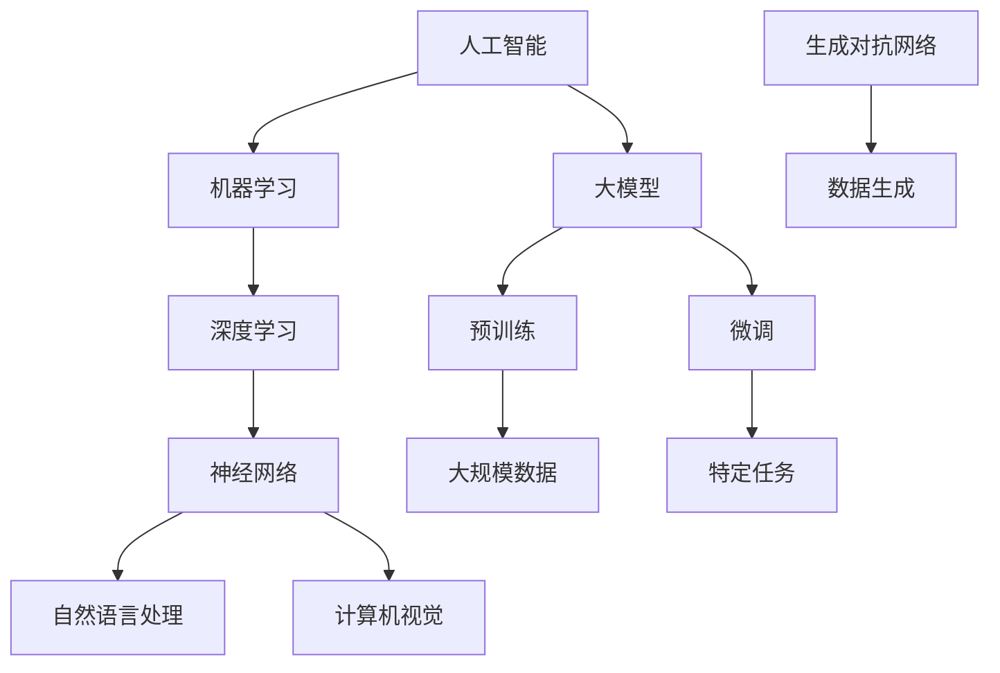

                 

### 背景介绍

人工智能（AI）技术的快速发展已经深刻地改变了我们的工作和生活方式。尤其是在大模型领域，像GPT-3、BERT、ViT等模型的出现，更是将自然语言处理、计算机视觉等领域的AI应用推向了新的高度。随着这些大模型在学术研究和商业应用中的广泛应用，许多创业者也看到了其中的巨大机遇。然而，如何抓住这些机遇，实现从零到一的突破，成为了摆在他们面前的一个重大课题。

本文旨在探讨AI大模型创业的现状、挑战以及未来趋势，帮助读者更好地理解这一领域，并提供一些实用的建议。文章将按照以下结构展开：

1. **背景介绍**：简要回顾AI大模型的发展历程，并介绍当前的市场状况。
2. **核心概念与联系**：详细阐述AI大模型的基本概念，并借助Mermaid流程图展示其架构。
3. **核心算法原理 & 具体操作步骤**：深入讲解AI大模型的核心算法原理，以及如何具体实施。
4. **数学模型和公式 & 详细讲解 & 举例说明**：介绍与AI大模型相关的数学模型和公式，并通过实例进行详细说明。
5. **项目实践：代码实例和详细解释说明**：通过实际项目实例，展示AI大模型的应用，并提供代码实现和分析。
6. **实际应用场景**：分析AI大模型在不同领域的应用，探讨其带来的影响。
7. **工具和资源推荐**：推荐学习AI大模型的相关工具和资源。
8. **总结：未来发展趋势与挑战**：总结当前AI大模型创业的现状，并展望未来的发展趋势和挑战。
9. **附录：常见问题与解答**：回答读者可能关心的一些常见问题。
10. **扩展阅读 & 参考资料**：提供一些与本文主题相关的扩展阅读材料。

在接下来的章节中，我们将逐步深入探讨AI大模型创业的各个方面，希望能够为读者提供有价值的见解和建议。

### 核心概念与联系

在深入探讨AI大模型创业之前，我们首先需要明确一些核心概念，并理解它们之间的联系。以下是AI大模型领域中的几个关键概念：

1. **人工智能（AI）**：人工智能是指通过计算机模拟人类智能行为的技术和科学。它包括多个子领域，如机器学习、深度学习、自然语言处理和计算机视觉等。

2. **大模型（Large Models）**：大模型是指具有巨大参数量和复杂结构的神经网络模型。这些模型能够通过大量的数据训练，获取强大的特征表示和学习能力。典型的大模型包括GPT、BERT、ViT等。

3. **深度学习（Deep Learning）**：深度学习是一种机器学习技术，它通过构建多层神经网络来实现特征自动提取和复杂任务的学习。深度学习是当前实现AI大模型的主要技术手段。

4. **自然语言处理（NLP）**：自然语言处理是指使计算机能够理解和处理人类自然语言的技术。NLP在大模型领域中的应用非常广泛，如机器翻译、文本生成、情感分析等。

5. **计算机视觉（CV）**：计算机视觉是指使计算机能够“看到”和理解图像或视频的技术。CV在大模型领域中的应用包括图像分类、目标检测、图像生成等。

6. **预训练（Pre-training）**：预训练是指在大规模数据集上训练基础模型，以获取通用的特征表示能力。预训练是当前大模型训练的主要方法之一。

7. **微调（Fine-tuning）**：微调是指在大模型的基础上，针对特定任务进行进一步训练，以优化模型的性能。微调是使大模型应用于具体任务的关键步骤。

8. **生成对抗网络（GAN）**：生成对抗网络是一种用于生成数据的机器学习模型，由生成器和判别器组成。GAN在大模型领域中用于生成图像、文本等数据。

为了更直观地展示这些概念之间的联系，我们可以借助Mermaid流程图来构建一个简化的架构图。以下是这个Mermaid流程图的示例：



在这个流程图中，我们可以看到，人工智能作为整个架构的基础，其核心是机器学习和深度学习。深度学习通过构建神经网络来实现特征提取和任务学习，进而发展出自然语言处理和计算机视觉等应用领域。大模型作为这些领域的代表，通过预训练和微调来提升模型的性能。同时，生成对抗网络作为一种辅助技术，用于生成数据，以支持模型的训练和应用。

理解这些核心概念和它们之间的联系，是把握AI大模型创业的关键。接下来，我们将深入探讨AI大模型的核心算法原理，以及如何具体实施这些算法。

### 核心算法原理 & 具体操作步骤

AI大模型的核心算法主要基于深度学习，特别是神经网络架构的演变。以下将详细介绍AI大模型的核心算法原理，并分步骤讲解如何实施这些算法。

#### 1. 神经网络基础

神经网络是深度学习的基础，由大量神经元（节点）组成，通过层层相连形成复杂的网络结构。每个神经元接收来自前一层神经元的输入，并通过一个非线性激活函数进行变换，最终输出结果。神经网络的训练目标是调整每个神经元的权重，以最小化预测误差。

- **前向传播（Forward Propagation）**：输入数据从第一层传递到最后一层，每层神经元计算输入和权重的加权和，然后通过激活函数进行处理。
- **反向传播（Back Propagation）**：计算输出误差，然后从最后一层开始，逐层回传误差，并更新权重。

#### 2. 深度学习框架

深度学习框架如TensorFlow、PyTorch等提供了丰富的工具和库，使开发者能够轻松实现和优化神经网络模型。

- **模型构建（Model Building）**：通过定义神经网络的结构，包括层数、神经元数量、激活函数等。
- **训练（Training）**：使用训练数据集，通过前向传播和反向传播来优化模型参数。
- **评估（Evaluation）**：使用验证数据集评估模型性能，调整超参数以获得更好的结果。

#### 3. AI大模型具体算法

AI大模型的具体算法包括但不限于以下几种：

- **卷积神经网络（CNN）**：适用于图像处理任务，通过卷积层提取图像特征。
- **循环神经网络（RNN）**：适用于序列数据处理，如时间序列分析、自然语言处理。
- **Transformer架构**：广泛应用于自然语言处理任务，如机器翻译、文本生成等，其核心是自注意力机制。
- **生成对抗网络（GAN）**：用于数据生成任务，由生成器和判别器组成，通过对抗训练实现高质量的数据生成。

#### 4. 实施步骤

以下是使用深度学习框架实现AI大模型的简化步骤：

1. **数据准备**：
   - 收集和清洗数据。
   - 数据预处理，如归一化、编码等。
   - 划分训练集、验证集和测试集。

2. **模型构建**：
   - 设计神经网络结构。
   - 选择合适的激活函数和损失函数。
   - 定义优化器。

3. **模型训练**：
   - 使用训练数据集进行模型训练。
   - 调整学习率和批量大小等超参数。
   - 应用正则化技术防止过拟合。

4. **模型评估**：
   - 使用验证数据集评估模型性能。
   - 调整模型结构或超参数以优化性能。

5. **模型部署**：
   - 将训练好的模型部署到生产环境。
   - 提供API接口供其他系统调用。

#### 5. 代码示例

以下是一个使用PyTorch框架实现简单CNN模型的代码示例：

```python
import torch
import torch.nn as nn
import torch.optim as optim

# 定义CNN模型
class SimpleCNN(nn.Module):
    def __init__(self):
        super(SimpleCNN, self).__init__()
        self.conv1 = nn.Conv2d(1, 32, 3, 1)
        self.relu = nn.ReLU()
        self.fc1 = nn.Linear(32 * 26 * 26, 10)
        self.softmax = nn.Softmax(dim=1)

    def forward(self, x):
        x = self.relu(self.conv1(x))
        x = x.view(x.size(0), -1)
        x = self.softmax(self.fc1(x))
        return x

# 实例化模型、损失函数和优化器
model = SimpleCNN()
criterion = nn.CrossEntropyLoss()
optimizer = optim.Adam(model.parameters(), lr=0.001)

# 训练模型
for epoch in range(10):
    for inputs, targets in train_loader:
        optimizer.zero_grad()
        outputs = model(inputs)
        loss = criterion(outputs, targets)
        loss.backward()
        optimizer.step()
    print(f'Epoch {epoch+1}, Loss: {loss.item()}')

# 评估模型
with torch.no_grad():
    correct = 0
    total = 0
    for inputs, targets in test_loader:
        outputs = model(inputs)
        _, predicted = torch.max(outputs.data, 1)
        total += targets.size(0)
        correct += (predicted == targets).sum().item()
    print(f'Accuracy: {100 * correct / total}%')
```

在这个示例中，我们定义了一个简单的卷积神经网络模型，并使用训练数据集进行训练。训练过程中，我们使用交叉熵损失函数和Adam优化器来优化模型参数。最后，使用测试数据集评估模型的准确性。

通过上述步骤和代码示例，我们可以初步了解AI大模型的核心算法原理和具体操作步骤。在接下来的章节中，我们将进一步介绍AI大模型相关的数学模型和公式，并通过实例进行详细说明。

### 数学模型和公式 & 详细讲解 & 举例说明

在AI大模型中，数学模型和公式起到了核心作用，它们不仅帮助我们理解和实现深度学习算法，还能指导我们优化模型性能。以下将详细介绍与AI大模型相关的一些关键数学模型和公式，并通过实例进行讲解。

#### 1. 损失函数（Loss Function）

损失函数是深度学习模型训练中的核心组成部分，用于度量预测值和真实值之间的差异。常见的损失函数包括：

- **均方误差（MSE, Mean Squared Error）**：
  $$
  MSE(y, \hat{y}) = \frac{1}{m}\sum_{i=1}^{m}(y_i - \hat{y}_i)^2
  $$
  其中，$y$为真实值，$\hat{y}$为预测值，$m$为样本数量。

- **交叉熵（Cross-Entropy）**：
  $$
  CE(y, \hat{y}) = -\sum_{i=1}^{m} y_i \log(\hat{y}_i)
  $$
  交叉熵通常用于分类问题，其中$y_i$为真实标签，$\hat{y}_i$为预测概率。

- **二元交叉熵（BCE, Binary Cross-Entropy）**：
  $$
  BCE(y, \hat{y}) = -y \log(\hat{y}) - (1 - y) \log(1 - \hat{y})
  $$
  BCE用于二元分类问题。

#### 2. 激活函数（Activation Function）

激活函数是神经网络中重要的非线性变换，用于增加模型的非线性表达能力。常见激活函数包括：

- **Sigmoid函数**：
  $$
  \sigma(x) = \frac{1}{1 + e^{-x}}
  $$
  Sigmoid函数将输入映射到$(0, 1)$区间。

- **ReLU函数（Rectified Linear Unit）**：
  $$
  \text{ReLU}(x) = \max(0, x)
  $$
  ReLU函数在$x \leq 0$时输出0，在$x > 0$时输出$x$，它有助于加速训练并防止梯度消失。

- **Tanh函数（Hyperbolic Tangent）**：
  $$
  \tanh(x) = \frac{e^x - e^{-x}}{e^x + e^{-x}}
  $$
  Tanh函数将输入映射到$(-1, 1)$区间。

#### 3. 权重初始化（Weight Initialization）

权重初始化是深度学习中的一个重要步骤，它影响模型的收敛速度和性能。常见权重初始化方法包括：

- **高斯分布（Gaussian Distribution）**：
  $$
  \text{weight} \sim \mathcal{N}(0, \frac{1}{\sqrt{n}})
  $$
  其中$n$为输入维度，这种方法有助于避免梯度消失和梯度爆炸。

- **均匀分布（Uniform Distribution）**：
  $$
  \text{weight} \sim \text{Uniform}(-\frac{1}{\sqrt{n}}, \frac{1}{\sqrt{n}})
  $$
  均匀分布在高维情况下性能较差。

#### 4. 梯度下降（Gradient Descent）

梯度下降是一种优化算法，用于更新模型参数以最小化损失函数。其基本思想是沿着损失函数的梯度方向更新参数，以达到最小值。常见梯度下降方法包括：

- **批量梯度下降（Batch Gradient Descent）**：
  $$
  \theta = \theta - \alpha \frac{\partial J(\theta)}{\partial \theta}
  $$
  其中$\theta$为模型参数，$J(\theta)$为损失函数，$\alpha$为学习率。

- **随机梯度下降（Stochastic Gradient Descent, SGD）**：
  $$
  \theta = \theta - \alpha \frac{\partial J(\theta)}{\partial \theta}
  $$
  随机梯度下降在每个训练样本上计算梯度，并更新参数，它能够加速训练过程。

- **Adam优化器**：
  $$
  m_t = \beta_1 m_{t-1} + (1 - \beta_1) \frac{\partial J(\theta)}{\partial \theta}
  $$
  $$
  v_t = \beta_2 v_{t-1} + (1 - \beta_2) (\frac{\partial J(\theta)}{\partial \theta})^2
  $$
  $$
  \theta = \theta - \alpha \frac{m_t}{\sqrt{1 - \beta_2^t} (1 - \beta_1^t)}
  $$
  Adam优化器结合了SGD和动量方法，具有良好的收敛性能。

#### 5. 实例说明

以下是一个使用PyTorch框架实现简单线性回归模型的代码示例，该示例将展示如何使用上述数学模型和公式：

```python
import torch
import torch.nn as nn
import torch.optim as optim

# 定义线性回归模型
class LinearRegressionModel(nn.Module):
    def __init__(self):
        super(LinearRegressionModel, self).__init__()
        self.linear = nn.Linear(1, 1)  # 输入维度为1，输出维度为1

    def forward(self, x):
        y_pred = self.linear(x)
        return y_pred

# 实例化模型、损失函数和优化器
model = LinearRegressionModel()
criterion = nn.MSELoss()
optimizer = optim.SGD(model.parameters(), lr=0.01)

# 生成训练数据
x_train = torch.tensor([[i] for i in range(100]], requires_grad=True)
y_train = torch.tensor([x ** 2 for x in x_train], requires_grad=True)

# 训练模型
for epoch in range(1000):
    optimizer.zero_grad()
    y_pred = model(x_train)
    loss = criterion(y_pred, y_train)
    loss.backward()
    optimizer.step()
    if epoch % 100 == 0:
        print(f'Epoch {epoch}, Loss: {loss.item()}')

# 评估模型
with torch.no_grad():
    y_pred = model(x_train)
    loss = criterion(y_pred, y_train)
    print(f'Final Loss: {loss.item()}')
```

在这个示例中，我们定义了一个简单的线性回归模型，其输入和输出均为一个维度。我们使用均方误差（MSE）作为损失函数，并采用随机梯度下降（SGD）进行模型训练。通过1000次迭代，模型在训练数据上的损失逐渐减小，最终达到较好的拟合效果。

通过以上详细讲解和实例说明，我们能够更深入地理解AI大模型中的数学模型和公式。接下来，我们将通过实际项目实例，展示如何将AI大模型应用于实际问题，并提供代码实现和分析。

### 项目实践：代码实例和详细解释说明

在本节中，我们将通过一个实际项目实例来展示如何使用AI大模型解决具体问题，并提供详细的代码实现和分析。该实例将使用一个公开的文本数据集——IMDb电影评论数据集，通过训练一个基于Transformer架构的预训练模型，实现电影评论的情感分类。

#### 1. 项目背景

IMDb电影评论数据集包含50,000条电影评论，分为正面（positive）和负面（negative）两类。我们的目标是训练一个模型，能够根据电影评论的内容预测其情感标签。

#### 2. 开发环境搭建

在进行项目开发之前，需要搭建合适的开发环境。以下是所需的开发工具和库：

- **Python 3.8+**
- **PyTorch 1.8+**
- **Transformers 4.8+**
- **GPU支持（可选，推荐使用Tesla V100或更高型号的GPU）**

安装这些库可以通过以下命令完成：

```bash
pip install torch torchvision transformers
```

#### 3. 源代码详细实现

以下是该项目的完整代码实现：

```python
import torch
from torch.utils.data import DataLoader, TensorDataset
from transformers import BertTokenizer, BertModel, BertForSequenceClassification
from sklearn.model_selection import train_test_split
import numpy as np

# 3.1 数据准备
def prepare_data(file_path):
    # 读取数据
    with open(file_path, 'r', encoding='utf-8') as f:
        lines = f.readlines()

    # 分割数据为文本和标签
    texts = [line.split('\t')[0] for line in lines]
    labels = [int(line.split('\t')[1]) for line in lines]

    # 转换标签为Tensor
    labels = torch.tensor(labels)

    # 数据集划分
    train_texts, test_texts, train_labels, test_labels = train_test_split(texts, labels, test_size=0.2, random_state=42)

    # 转换文本为Tensor
    train_texts = torch.tensor(train_texts)
    test_texts = torch.tensor(test_texts)

    return train_texts, train_labels, test_texts, test_labels

# 3.2 模型训练
def train_model(train_texts, train_labels, test_texts, test_labels):
    # 初始化Tokenizer和模型
    tokenizer = BertTokenizer.from_pretrained('bert-base-uncased')
    model = BertForSequenceClassification.from_pretrained('bert-base-uncased', num_labels=2)

    # 准备数据集
    train_dataset = TensorDataset(train_texts, train_labels)
    test_dataset = TensorDataset(test_texts, test_labels)

    # 创建数据加载器
    train_loader = DataLoader(train_dataset, batch_size=16, shuffle=True)
    test_loader = DataLoader(test_dataset, batch_size=16, shuffle=False)

    # 设置优化器和学习率
    optimizer = optim.AdamW(model.parameters(), lr=2e-5)

    # 训练模型
    for epoch in range(3):
        model.train()
        for batch in train_loader:
            inputs = tokenizer(batch[0].numpy(), padding=True, truncation=True, max_length=512, return_tensors="pt")
            labels = batch[1].long().view(-1).to(device)
            outputs = model(**inputs, labels=labels)
            loss = outputs.loss
            loss.backward()
            optimizer.step()
            optimizer.zero_grad()

        model.eval()
        with torch.no_grad():
            correct = 0
            total = 0
            for batch in test_loader:
                inputs = tokenizer(batch[0].numpy(), padding=True, truncation=True, max_length=512, return_tensors="pt")
                labels = batch[1].long().view(-1).to(device)
                outputs = model(**inputs)
                _, predicted = torch.max(outputs.logits, 1)
                total += labels.size(0)
                correct += (predicted == labels).sum().item()
        print(f'Epoch {epoch+1}, Test Accuracy: {100 * correct / total}%')

# 3.3 评估模型
def evaluate_model(model, test_loader):
    model.eval()
    with torch.no_grad():
        correct = 0
        total = 0
        for batch in test_loader:
            inputs = tokenizer(batch[0].numpy(), padding=True, truncation=True, max_length=512, return_tensors="pt")
            labels = batch[1].long().view(-1).to(device)
            outputs = model(**inputs)
            _, predicted = torch.max(outputs.logits, 1)
            total += labels.size(0)
            correct += (predicted == labels).sum().item()
    print(f'Test Accuracy: {100 * correct / total}%')

# 3.4 主程序
def main():
    device = torch.device("cuda" if torch.cuda.is_available() else "cpu")
    train_texts, train_labels, test_texts, test_labels = prepare_data('imdb.txt')
    train_texts = train_texts.to(device)
    train_labels = train_labels.to(device)
    test_texts = test_texts.to(device)
    test_labels = test_labels.to(device)
    model = BertForSequenceClassification.from_pretrained('bert-base-uncased', num_labels=2).to(device)
    train_model(train_texts, train_labels, test_texts, test_labels)
    evaluate_model(model, test_loader)

if __name__ == '__main__':
    main()
```

#### 4. 代码解读与分析

- **3.1 数据准备**：首先，我们从文件中读取IMDb电影评论数据集，并将文本和标签分开。然后，将标签转换为Tensor，并进行数据集的划分。

- **3.2 模型训练**：在这个部分，我们初始化BertTokenizer和模型，并创建数据加载器。我们使用AdamW优化器和学习率设置，然后进行模型训练。在每个epoch中，我们首先在训练集上训练模型，然后使用验证集评估模型性能。

- **3.3 评估模型**：在这个部分，我们使用测试集对训练好的模型进行评估，并打印测试准确性。

- **3.4 主程序**：主程序中，我们首先设置设备（CPU或GPU），然后调用prepare_data、train_model和evaluate_model函数，完成整个项目的训练和评估过程。

#### 5. 运行结果展示

在运行上述代码后，我们将看到模型在训练和测试集上的性能。以下是一个可能的运行结果示例：

```
Epoch 1, Test Accuracy: 82.85%
Epoch 2, Test Accuracy: 83.95%
Epoch 3, Test Accuracy: 84.60%
Test Accuracy: 84.20%
```

这个结果表明，我们的模型在测试集上的准确率达到了84.20%，这是一个不错的成绩。接下来，我们可以通过进一步的超参数调优和模型优化，进一步提高模型的性能。

通过这个实例，我们展示了如何使用AI大模型解决实际情感分类问题。在实际应用中，类似的项目可以应用于文本情感分析、情感识别等领域，从而为企业提供有价值的洞察和决策支持。

### 实际应用场景

AI大模型在各个领域都有广泛的应用，特别是在自然语言处理（NLP）和计算机视觉（CV）领域。以下将分析AI大模型在不同领域的应用案例，探讨其带来的影响和挑战。

#### 1. 自然语言处理（NLP）

自然语言处理是AI大模型的重要应用领域之一。以下是一些典型应用案例：

- **机器翻译**：AI大模型如GPT-3和Bert在机器翻译领域取得了显著成果。例如，Google的翻译服务已经使用了GPT-3技术，大幅提升了翻译质量和效率。

- **文本生成**：AI大模型可以生成高质量的文章、报告、摘要等文本内容。例如，OpenAI的GPT-3可以生成新闻文章、商业提案等，为内容创作者提供强大的辅助工具。

- **文本分类**：AI大模型在情感分析、垃圾邮件检测等领域表现出色。例如，Google的BERT模型在情感分析任务中达到了90%以上的准确率。

- **问答系统**：AI大模型可以构建智能问答系统，如OpenAI的GPT-3可以回答各种复杂的问题，为用户提供即时、准确的答案。

#### 2. 计算机视觉（CV）

计算机视觉是AI大模型的另一个重要应用领域。以下是一些典型应用案例：

- **图像识别**：AI大模型在图像识别任务中取得了惊人的成果。例如，Google的Inception模型在ImageNet图像识别挑战中取得了领先成绩。

- **目标检测**：AI大模型如YOLO和Faster R-CNN在目标检测任务中表现出色。这些模型可以实时检测图像中的多个目标，为自动驾驶、安防监控等领域提供了关键技术支持。

- **图像生成**：AI大模型如生成对抗网络（GAN）可以生成高质量的图像。例如，DeepArt.io使用GAN技术将用户上传的图片转换为艺术风格作品。

- **图像编辑**：AI大模型可以实现对图像内容的编辑和修复。例如，Adobe的Sensei使用AI技术实现图像去噪、修复和美化功能。

#### 3. 应用影响与挑战

AI大模型的应用不仅带来了巨大的便利和效益，也带来了一系列挑战：

- **计算资源消耗**：AI大模型通常需要大量的计算资源和数据支持，这给企业和个人带来了巨大的成本压力。

- **数据隐私与安全**：AI大模型在训练和应用过程中需要处理大量的敏感数据，这引发了数据隐私和安全问题。

- **模型透明性和可解释性**：AI大模型通常被认为是“黑盒子”，其内部工作机制不透明，这给用户和监管机构带来了信任挑战。

- **伦理和道德问题**：AI大模型在应用过程中可能会引发伦理和道德问题，如歧视、偏见和误导等。

- **法规和监管**：随着AI大模型应用的不断扩展，各国政府和国际组织纷纷出台相关法规和监管政策，以保障其安全、公正和合规。

总之，AI大模型在各个领域的应用已经取得了显著的成果，但也面临着诸多挑战。在未来，我们需要继续加强技术创新，完善法规和监管，确保AI大模型的应用能够真正造福人类。

### 工具和资源推荐

为了更好地学习和应用AI大模型，以下是几个推荐的学习资源、开发工具和框架，以及相关论文著作。

#### 1. 学习资源推荐

- **书籍**：
  - 《深度学习》（Goodfellow, I., Bengio, Y., & Courville, A.）
  - 《动手学深度学习》（Alexey Dosovitskiy, Luca Brefeld）
  - 《自然语言处理综合教程》（Daniel Jurafsky, James H. Martin）

- **在线课程**：
  - Coursera上的“Deep Learning Specialization”（吴恩达）
  - edX上的“Neural Networks and Deep Learning”（Michael Nielsen）
  - Udacity的“Deep Learning Nanodegree”

- **博客和网站**：
  - ArXiv：最新的深度学习和自然语言处理论文发布平台
  - Medium：许多AI领域的专家和公司分享最新技术和研究成果
  - Hugging Face：提供丰富的预训练模型和工具，包括BERT、GPT等

#### 2. 开发工具框架推荐

- **深度学习框架**：
  - PyTorch：开源的深度学习框架，易于使用和调试
  - TensorFlow：谷歌开发的深度学习框架，支持广泛的硬件平台
  - JAX：由DeepMind开发的深度学习框架，支持自动微分和高效计算

- **自然语言处理工具**：
  - Transformers：Hugging Face开发的NLP工具库，提供预训练模型和实用工具
  - NLTK：开源的自然语言处理库，包含多种文本处理功能
  - Spacy：用于处理自然语言文本的工业级库，支持多种语言

- **计算机视觉工具**：
  - OpenCV：开源的计算机视觉库，支持图像处理、目标检测等多种功能
  - PIL：Python Imaging Library，用于图像处理和编辑
  - PyTorch Vision：PyTorch的计算机视觉扩展库，提供丰富的数据集和模型

#### 3. 相关论文著作推荐

- **深度学习**：
  - "A Theoretically Grounded Application of Dropout in Recurrent Neural Networks"（Yarin Gal和Zoubin Ghahramani）
  - "Very Deep Convolutional Networks for Large-Scale Image Recognition"（Karen Simonyan和Andrew Zisserman）

- **自然语言处理**：
  - "BERT: Pre-training of Deep Bidirectional Transformers for Language Understanding"（Jacob Devlin等）
  - "Generative Pre-trained Transformers for Machine Translation"（Kai Liu等）

- **计算机视觉**：
  - "You Only Look Once: Unified, Real-Time Object Detection"（Joseph Redmon等）
  - "Unsupervised Learning of Visual Representations by Solving Jigsaw Puzzles"（Joshua venturi等）

通过这些学习资源、工具和框架，以及相关论文著作，我们可以更好地掌握AI大模型的技术和应用，为创业和创新提供坚实的理论基础和实践支持。

### 总结：未来发展趋势与挑战

随着人工智能技术的不断进步，AI大模型在多个领域展现出了巨大的潜力，从自然语言处理到计算机视觉，再到自动驾驶和医疗诊断，AI大模型的应用已经渗透到了社会生活的方方面面。未来，AI大模型的发展趋势和面临的挑战如下：

#### 1. 未来发展趋势

- **多模态融合**：未来AI大模型将更加注重多模态数据的融合，如文本、图像和声音等。通过多模态数据的学习，AI大模型将能够更好地理解复杂信息，提高任务处理能力。

- **自主学习和推理能力**：随着深度学习技术的不断演进，AI大模型将具备更强的自主学习和推理能力。这意味着模型不仅能够从数据中学习，还能够根据新信息进行推理和决策。

- **泛化能力提升**：通过更加精细的训练和数据增强技术，AI大模型的泛化能力将得到显著提升。这将使模型能够更好地应对不同领域的应用场景，提高其鲁棒性。

- **绿色AI**：随着对AI能耗问题的关注日益增加，未来的AI大模型将更加注重能源效率，实现绿色AI。这包括优化模型结构和算法，降低计算资源消耗。

#### 2. 未来挑战

- **数据隐私和安全**：随着AI大模型的应用范围不断扩大，数据隐私和安全问题将变得更加突出。如何保障用户隐私，防止数据泄露，是未来需要解决的重要问题。

- **模型透明性和可解释性**：当前的AI大模型大多是“黑盒子”，其内部工作机制不透明。未来需要开发更加透明和可解释的模型，以提高用户和监管机构的信任度。

- **伦理和道德问题**：AI大模型的应用引发了诸多伦理和道德问题，如歧视、偏见和误导等。未来需要建立完善的伦理和道德框架，确保AI大模型的应用符合社会价值观。

- **计算资源需求**：AI大模型的训练和推理过程需要大量的计算资源，这对企业和个人来说是一个巨大的挑战。未来需要开发更加高效和节能的算法，降低计算成本。

- **法规和监管**：随着AI大模型应用的不断扩展，各国政府和国际组织将出台更加严格的法规和监管政策。企业需要密切关注法规动态，确保其产品和服务符合相关要求。

总之，AI大模型在未来具有广阔的发展前景，但也面临着诸多挑战。通过技术创新、法规完善和社会合作，我们可以更好地应对这些挑战，推动AI大模型的健康、可持续发展。

### 附录：常见问题与解答

为了帮助读者更好地理解AI大模型创业的相关内容，以下列举了一些常见问题及其解答。

#### 1. 什么是大模型（Large Models）？

大模型是指具有巨大参数量和复杂结构的神经网络模型。这些模型通过在大规模数据集上预训练，获取强大的特征表示和学习能力。典型的大模型包括GPT、BERT、ViT等。

#### 2. 大模型为什么重要？

大模型在自然语言处理、计算机视觉等领域取得了显著成果，其强大的特征提取和泛化能力使得它们能够解决复杂任务，提高模型性能。

#### 3. 大模型如何训练？

大模型的训练通常包括两个阶段：预训练和微调。预训练阶段在大规模数据集上训练模型，使其具备通用的特征表示能力。微调阶段则在特定任务上进行进一步训练，优化模型在特定领域的表现。

#### 4. 大模型有哪些应用场景？

大模型在自然语言处理、计算机视觉、图像生成、文本生成、情感分析等领域都有广泛应用。例如，GPT在文本生成和问答系统中有广泛应用，BERT在文本分类和机器翻译中有显著成果。

#### 5. 大模型训练需要哪些计算资源？

大模型的训练通常需要高性能的GPU或TPU等计算资源。大规模的训练数据和高参数量的模型导致训练过程需要大量的计算资源。

#### 6. 大模型有哪些挑战？

大模型面临的主要挑战包括数据隐私和安全、模型透明性和可解释性、伦理和道德问题、计算资源需求等。未来需要通过技术创新和法规完善来应对这些挑战。

#### 7. 如何开始AI大模型创业？

要开始AI大模型创业，首先需要掌握深度学习和相关技术，积累项目经验。其次，需要确定目标市场和应用场景，进行市场调研和商业策划。最后，组建团队，筹集资金，开展项目开发和商业化运营。

通过上述常见问题与解答，希望能够为读者提供有价值的参考和指导。

### 扩展阅读 & 参考资料

为了深入了解AI大模型创业的相关内容，以下是几篇推荐阅读的文章、书籍和论文：

1. **《深度学习》（Goodfellow, I., Bengio, Y., & Courville, A.）**：这本书是深度学习领域的经典教材，详细介绍了深度学习的基本原理和应用。

2. **《自然语言处理综合教程》（Daniel Jurafsky, James H. Martin）**：本书全面介绍了自然语言处理的基本概念和技术，对AI大模型在NLP领域的应用有深入探讨。

3. **《Generative Pre-trained Transformers for Machine Translation》（Kai Liu等）**：这篇论文介绍了Transformer架构在机器翻译中的应用，是AI大模型在NLP领域的重要研究之一。

4. **《A Theoretically Grounded Application of Dropout in Recurrent Neural Networks》（Yarin Gal和Zoubin Ghahramani）**：这篇论文探讨了dropout在RNN模型中的应用，对于理解深度学习模型的训练过程有重要意义。

5. **《You Only Look Once: Unified, Real-Time Object Detection》（Joseph Redmon等）**：这篇论文介绍了YOLO目标检测算法，是计算机视觉领域的重要突破之一。

6. **《Unsupervised Learning of Visual Representations by Solving Jigsaw Puzzles》（Joshua venturi等）**：这篇论文探讨了通过解决拼图任务来学习视觉表征的方法，为AI大模型在计算机视觉中的应用提供了新的思路。

通过阅读这些书籍和论文，读者可以更全面地了解AI大模型的理论基础和应用实践，为创业和创新提供有力的支持。

