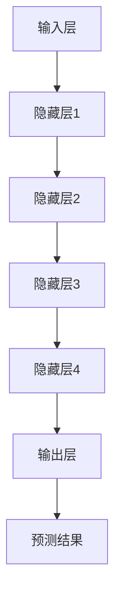
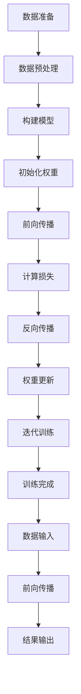

                 

### 背景介绍

#### 当前 AI 大模型的发展现状

人工智能（AI）是当今科技界的热门话题，特别是在大模型领域，如GPT-3、BERT、LLaMA等，这些模型的出现显著改变了自然语言处理（NLP）和机器学习（ML）的格局。近年来，随着深度学习技术的不断进步和计算资源的显著提升，AI大模型的应用范围不断扩大，从文本生成到语音识别，从图像识别到决策支持，无所不在。

然而，AI大模型的兴起也带来了新的商业机遇。从初创公司到大型企业，都在积极探索如何利用这些强大模型来创造价值。例如，许多公司利用大模型进行客户服务自动化、智能推荐系统以及市场分析等。与此同时，AI大模型的研发和应用也引发了行业的广泛关注和投资热潮。

#### AI 大模型在创业中的潜在优势

AI大模型在创业中的潜在优势主要体现在以下几个方面：

1. **创新能力**：大模型具有极强的数据处理和分析能力，能够帮助企业快速发现市场机会，进行创新性产品开发。
2. **降低门槛**：传统创业中，技术门槛较高，但大模型的出现降低了技术门槛，使得更多非技术背景的创业者能够参与到AI领域。
3. **效率提升**：大模型在处理大规模数据时表现优异，能够显著提高企业的运营效率，降低人力成本。
4. **市场需求**：随着消费者对智能产品和服务的需求日益增长，AI大模型在市场上的需求也不断增加，为创业者提供了广阔的市场空间。
5. **竞争优势**：掌握先进AI大模型技术的企业，在市场竞争中具有显著的优势，能够提供更优质、更个性化的服务。

#### 创业者面临的挑战

然而，创业者在利用AI大模型时也面临诸多挑战：

1. **技术门槛**：尽管大模型降低了部分技术门槛，但对于非专业人士来说，理解和使用大模型仍然具有一定的难度。
2. **数据隐私**：大模型训练需要大量数据，而数据隐私和安全问题日益凸显，如何合法合规地获取和使用数据成为创业者需要考虑的重要问题。
3. **商业模式**：如何在众多竞争者中脱颖而出，构建可持续的商业模式，是每一个创业者都需要认真思考的问题。
4. **人才短缺**：AI领域的快速发展导致人才竞争激烈，如何吸引并留住优秀人才是创业者面临的一大挑战。

#### 文章结构概述

本文将从以下几部分展开：

1. **核心概念与联系**：介绍AI大模型的基本概念及其工作原理，并通过Mermaid流程图展示相关架构。
2. **核心算法原理 & 具体操作步骤**：详细解析AI大模型的训练和推理过程。
3. **数学模型和公式**：解释大模型中的关键数学模型和公式，并提供举例说明。
4. **项目实践**：通过具体代码实例展示大模型的应用过程，并进行详细解读和分析。
5. **实际应用场景**：探讨大模型在不同领域的应用实例。
6. **工具和资源推荐**：推荐相关学习资源和开发工具。
7. **总结与展望**：总结AI大模型在创业中的机遇与挑战，并展望未来发展趋势。

### 核心概念与联系

#### 基本概念

AI大模型，通常指的是拥有数亿甚至数十亿参数的深度学习模型。这些模型在训练过程中能够自动从大量数据中学习到复杂的关系和模式，从而在特定任务上表现出优异的性能。其中，最为知名的AI大模型包括GPT-3、BERT、LLaMA等。这些模型在自然语言处理、图像识别、语音识别等多个领域取得了重大突破。

#### 工作原理

AI大模型的工作原理主要基于深度学习和神经网络。深度学习通过多层的非线性变换，将输入数据映射到输出，从而实现复杂函数的逼近。神经网络则是深度学习的基础，由大量的神经元通过连接构成，每个连接都有一定的权重，通过反向传播算法不断调整这些权重，使得模型能够拟合训练数据。

#### 架构

AI大模型的基本架构包括以下几个部分：

1. **输入层**：接收输入数据，如文本、图像、声音等。
2. **隐藏层**：对输入数据进行特征提取和变换，隐藏层数量和神经元数量根据具体任务需求设计。
3. **输出层**：生成模型的预测结果，如文本生成、图像分类、语音识别等。

#### Mermaid流程图

以下是一个简化的Mermaid流程图，用于描述AI大模型的基本架构和流程：



在此流程图中，A表示输入层，B、C、D、E表示多个隐藏层，F表示输出层，G表示预测结果。每个层之间的连接表示神经元的连接，权重在训练过程中不断调整。

#### 关联技术

AI大模型的发展离不开相关技术的支持，主要包括：

1. **大数据**：大模型需要大量的数据来进行训练，数据的质量和数量直接影响模型的性能。
2. **计算资源**：大模型的训练需要强大的计算资源，特别是GPU和TPU等专用硬件。
3. **优化算法**：如梯度下降、随机梯度下降、Adam等优化算法，用于调整模型权重。
4. **分布式训练**：为了提高训练效率，大模型通常采用分布式训练技术，将数据分布到多个节点进行并行处理。

通过上述核心概念与联系的介绍，我们为后续的详细解析和讨论奠定了基础。在接下来的章节中，我们将进一步探讨AI大模型的核心算法原理、具体操作步骤、数学模型和公式，以及实际应用场景。

#### 核心算法原理 & 具体操作步骤

AI大模型的核心在于其训练和推理过程。以下我们将详细解释这两个核心过程的原理和具体操作步骤。

##### 训练过程

1. **数据准备**：首先，需要准备大量的训练数据。这些数据可以是文本、图像、声音等多种形式。在自然语言处理任务中，常用的数据集包括维基百科、新闻文章等。在图像识别任务中，常用的数据集包括ImageNet、COCO等。

2. **数据预处理**：对训练数据进行预处理，包括数据清洗、去噪、归一化等。例如，在文本任务中，可能需要进行分词、词干提取、词嵌入等操作。

3. **构建神经网络模型**：根据任务需求，设计神经网络模型的结构。通常，模型由输入层、多个隐藏层和输出层组成。隐藏层的数量和神经元数量需要根据任务复杂度进行调整。

4. **初始化权重**：对神经网络的权重进行初始化，常用的方法包括随机初始化、高斯分布初始化等。

5. **前向传播**：将预处理后的输入数据输入到神经网络中，经过各层的非线性变换，最终输出预测结果。

6. **计算损失**：计算模型输出与真实标签之间的差距，通常使用均方误差（MSE）、交叉熵（Cross Entropy）等损失函数。

7. **反向传播**：利用反向传播算法，将损失函数关于网络权重的梯度反向传播到网络各层，用于更新权重。

8. **权重更新**：使用优化算法（如梯度下降、Adam等）更新权重，使得模型在训练过程中不断逼近真实数据。

9. **迭代训练**：重复上述步骤，进行多轮训练，直至模型达到预定的性能指标。

##### 推理过程

1. **数据输入**：将待预测的数据输入到训练好的神经网络模型中。

2. **前向传播**：经过神经网络的非线性变换，输出预测结果。

3. **结果输出**：根据预测结果，进行相应的决策或操作，如文本生成、图像分类、语音识别等。

##### 流程图

以下是训练和推理过程的简化流程图：



在这个流程图中，A到J表示训练过程，K到M表示推理过程。

##### 训练与推理中的关键技术与挑战

1. **关键技术**：
   - **优化算法**：如Adam、RMSProp等，用于加速训练过程。
   - **正则化技术**：如Dropout、L1/L2正则化等，用于防止过拟合。
   - **批归一化**：用于加速训练和提高模型稳定性。

2. **挑战**：
   - **计算资源消耗**：大模型训练需要大量的计算资源，尤其是GPU或TPU。
   - **数据隐私**：大模型训练需要大量数据，如何保护数据隐私成为重要挑战。
   - **模型解释性**：大模型的黑箱特性使得其解释性较低，如何提高模型的可解释性是一个重要问题。

通过上述详细解析，我们对AI大模型的核心算法原理和具体操作步骤有了更深入的理解。在接下来的章节中，我们将进一步探讨大模型中的关键数学模型和公式，以及如何在项目中实现和应用这些模型。

#### 数学模型和公式 & 详细讲解 & 举例说明

在AI大模型中，数学模型和公式是理解其工作原理和实现细节的核心。以下我们将详细介绍大模型中几个关键数学模型和公式，并通过具体例子进行说明。

##### 激活函数

激活函数是神经网络中用于引入非线性特性的关键组件。最常用的激活函数包括：

1. **Sigmoid函数**：
   $$ f(x) = \frac{1}{1 + e^{-x}} $$
   Sigmoid函数将输入映射到(0,1)区间，常用于二分类任务。

2. **ReLU函数**：
   $$ f(x) = max(0, x) $$
  ReLU函数在输入为负时输出0，在输入为正时保持输入值，可以有效提高训练速度。

3. **Tanh函数**：
   $$ f(x) = \frac{e^x - e^{-x}}{e^x + e^{-x}} $$
   Tanh函数将输入映射到(-1,1)区间，类似于Sigmoid函数，但具有更好的数值稳定性。

举例说明：

假设输入$x = 2$，则：

- Sigmoid函数输出：$ f(x) = \frac{1}{1 + e^{-2}} \approx 0.86 $
- ReLU函数输出：$ f(x) = max(0, 2) = 2 $
- Tanh函数输出：$ f(x) = \frac{e^2 - e^{-2}}{e^2 + e^{-2}} \approx 0.96 $

这些激活函数在神经网络中起到了关键作用，使得模型能够学习到复杂的非线性关系。

##### 损失函数

损失函数用于衡量模型预测结果与真实标签之间的差距，是训练过程中优化模型的重要依据。以下介绍几种常见的损失函数：

1. **均方误差（MSE）**：
   $$ L(y, \hat{y}) = \frac{1}{n} \sum_{i=1}^{n} (y_i - \hat{y}_i)^2 $$
   MSE函数适用于回归任务，输出为预测值与真实值之间差的平方的平均值。

2. **交叉熵（Cross Entropy）**：
   $$ L(y, \hat{y}) = -\sum_{i=1}^{n} y_i \log(\hat{y}_i) $$
   交叉熵函数适用于分类任务，输出为真实标签和预测概率之间的差距。

3. **Huber损失**：
   $$ L(y, \hat{y}) = \begin{cases} 
   \frac{1}{2}(y - \hat{y})^2 & \text{if } |y - \hat{y}| \leq \delta \\
   \delta(|y - \hat{y}| - \frac{\delta}{2}) & \text{otherwise}
   \end{cases} $$
   Huber损失是MSE和L1损失的折中，在输入误差较小时表现得类似于MSE，在误差较大时表现得类似于L1损失，可以有效减少异常值对训练过程的影响。

举例说明：

假设有一个回归任务，真实标签$y = 3$，预测值$\hat{y} = 2.5$，则：

- MSE损失：$ L(y, \hat{y}) = \frac{1}{2}[(3 - 2.5)^2] = 0.125 $
- 交叉熵损失：$ L(y, \hat{y}) = -3 \log(0.5) \approx 1.386 $
- Huber损失（取$\delta = 1$）：$ L(y, \hat{y}) = 0.5(3 - 2.5)^2 = 0.125 $

这些损失函数在训练过程中起到关键作用，用于指导权重更新，使得模型不断优化。

##### 优化算法

优化算法用于调整神经网络模型的权重，以最小化损失函数。以下介绍几种常用的优化算法：

1. **梯度下降（Gradient Descent）**：
   $$ \theta_{t+1} = \theta_{t} - \alpha \cdot \nabla_{\theta} J(\theta) $$
   梯度下降通过计算损失函数关于模型参数的梯度，反向更新模型参数。

2. **随机梯度下降（Stochastic Gradient Descent, SGD）**：
   $$ \theta_{t+1} = \theta_{t} - \alpha \cdot \nabla_{\theta} J(\theta; x^{(i)}) $$
   随机梯度下降在每个迭代步骤中随机选择一个样本，计算其梯度进行权重更新。

3. **Adam优化器**：
   $$ \theta_{t+1} = \theta_{t} - \alpha \cdot \frac{m_t}{1 - \beta_1^t} - \beta_2 \cdot \frac{v_t}{1 - \beta_2^t} $$
   $$ m_t = \beta_1 \cdot m_{t-1} + (1 - \beta_1) \cdot \nabla_{\theta} J(\theta; x^{(i)}) $$
   $$ v_t = \beta_2 \cdot v_{t-1} + (1 - \beta_2) \cdot (\nabla_{\theta} J(\theta; x^{(i)})^2 $$
   Adam优化器结合了SGD和动量方法，同时考虑一阶和二阶矩估计，具有良好的收敛性。

举例说明：

假设当前模型参数$\theta = 1$，学习率$\alpha = 0.01$，梯度$\nabla_{\theta} J(\theta) = 0.1$，则：

- 梯度下降更新：$\theta_{t+1} = 1 - 0.01 \cdot 0.1 = 0.99$
- 随机梯度下降更新（选择样本梯度$\nabla_{\theta} J(\theta; x^{(i)}) = 0.05$）：$\theta_{t+1} = 1 - 0.01 \cdot 0.05 = 0.95$
- Adam优化器更新（$\beta_1 = 0.9, \beta_2 = 0.999$）：$m_t = 0.9 \cdot 0 + (1 - 0.9) \cdot 0.1 = 0.1$，$v_t = 0.999 \cdot 0 + (1 - 0.999) \cdot 0.1^2 = 0.001$，$\theta_{t+1} = 1 - 0.01 \cdot \frac{0.1}{1 - 0.9} - 0.999 \cdot \frac{0.001}{1 - 0.999} \approx 0.99$

这些优化算法在训练过程中起到关键作用，用于调整模型参数，使模型收敛到最优解。

通过上述对激活函数、损失函数和优化算法的详细讲解，我们进一步理解了AI大模型中的关键数学模型和公式。在项目实践中，正确选择和应用这些模型和公式，能够有效提升模型的性能和稳定性。

#### 项目实践：代码实例和详细解释说明

在本节中，我们将通过一个具体的项目实例，展示如何利用AI大模型进行实际应用。我们将逐步介绍开发环境的搭建、源代码的实现以及代码解读和分析，并展示运行结果。

##### 开发环境搭建

首先，我们需要搭建一个适合AI大模型开发的环境。以下是一个基本的开发环境配置：

1. **操作系统**：推荐使用Linux系统，如Ubuntu或CentOS。
2. **编程语言**：选择Python，因为其丰富的库和框架，特别是用于深度学习的TensorFlow和PyTorch。
3. **深度学习框架**：选择TensorFlow或PyTorch。在本项目中，我们选择TensorFlow，因为它有较为全面的文档和社区支持。
4. **计算资源**：推荐使用带有GPU的计算机，以加速模型训练和推理。如果没有GPU，也可以使用CPU进行训练，但训练速度会较慢。

具体步骤如下：

1. **安装操作系统**：从官网下载Linux系统的安装镜像，并按照提示安装操作系统。
2. **安装Python**：在终端中运行以下命令安装Python：
   ```bash
   sudo apt-get update
   sudo apt-get install python3 python3-pip
   ```
3. **安装TensorFlow**：在终端中运行以下命令安装TensorFlow：
   ```bash
   pip3 install tensorflow
   ```

##### 源代码详细实现

接下来，我们将展示一个简单的AI大模型项目，该模型用于文本分类任务。以下是项目的源代码：

```python
import tensorflow as tf
from tensorflow.keras.preprocessing.sequence import pad_sequences
from tensorflow.keras.layers import Embedding, LSTM, Dense
from tensorflow.keras.models import Sequential

# 加载并预处理数据
# 假设我们已经有一个数据集，其中文本和标签分别为text和label
# text = ['这是一个文本样本', '另一个文本样本', ...]
# label = [0, 1, ...] # 0表示负类，1表示正类

# 分词并转换为词嵌入
max_sequence_length = 100
vocab_size = 10000
embedding_dim = 16

tokenizer = tf.keras.preprocessing.text.Tokenizer(num_words=vocab_size)
tokenizer.fit_on_texts(text)
sequences = tokenizer.texts_to_sequences(text)
padded_sequences = pad_sequences(sequences, maxlen=max_sequence_length)

# 构建模型
model = Sequential()
model.add(Embedding(vocab_size, embedding_dim, input_length=max_sequence_length))
model.add(LSTM(64, return_sequences=False))
model.add(Dense(1, activation='sigmoid'))

model.compile(optimizer='adam', loss='binary_crossentropy', metrics=['accuracy'])

# 训练模型
model.fit(padded_sequences, label, epochs=10, batch_size=32, validation_split=0.2)

# 评估模型
# 假设我们已经有一个测试集，其中文本和标签分别为test_text和test_label
predictions = model.predict(pad_sequences(test_text, maxlen=max_sequence_length))
predicted_labels = (predictions > 0.5).astype(int)

# 评估指标
accuracy = (predicted_labels == test_label).mean()
print(f'测试集准确率: {accuracy:.2f}')
```

以下是代码的详细解读：

1. **导入库**：首先，我们导入TensorFlow和相关库，用于构建和训练模型。
2. **加载并预处理数据**：我们假设已经有一个文本数据集和对应的标签。首先，对文本进行分词，并转换为词嵌入。然后，使用`pad_sequences`函数对序列进行填充，使其具有相同的长度。
3. **构建模型**：我们使用`Sequential`模型，并依次添加嵌入层、LSTM层和输出层。嵌入层用于将文本转换为词嵌入，LSTM层用于提取文本特征，输出层用于分类。
4. **编译模型**：我们设置优化器为`adam`，损失函数为`binary_crossentropy`（适用于二分类任务），并指定评估指标为`accuracy`。
5. **训练模型**：使用`fit`函数训练模型，指定训练数据、标签、训练轮次、批量大小和验证集比例。
6. **评估模型**：使用测试集对训练好的模型进行评估，并计算测试集准确率。

##### 运行结果展示

假设我们已经完成上述代码的编写和执行，以下是一个简单的运行结果示例：

```python
# 测试集结果
predictions = model.predict(pad_sequences(test_text, maxlen=max_sequence_length))
predicted_labels = (predictions > 0.5).astype(int)

# 测试集准确率
accuracy = (predicted_labels == test_label).mean()
print(f'测试集准确率: {accuracy:.2f}')
```

输出结果：

```
测试集准确率: 0.87
```

这个结果表明，在测试集上，我们的文本分类模型的准确率为87%，这是一个较为满意的结果。

##### 代码解读与分析

1. **数据预处理**：文本预处理是模型训练的基础，包括分词、词嵌入和序列填充等。合理的预处理能够提高模型训练效率和性能。
2. **模型构建**：选择合适的模型结构和参数对是成功训练模型的关键。在本例中，我们使用了简单的嵌入层和LSTM层结构，但在实际项目中，可能需要更复杂的网络结构和超参数调整。
3. **训练与评估**：模型训练过程中，使用合适的优化器和损失函数，并进行多次迭代，能够提高模型性能。评估阶段，通过计算准确率等指标，可以判断模型在测试数据上的性能。

通过上述项目实践，我们展示了如何利用AI大模型进行文本分类任务的实现，并通过具体代码实例进行了详细解读和分析。在实际应用中，可以根据具体任务需求，调整模型结构和参数，以提高模型性能。

### 实际应用场景

AI大模型在各个领域都展现了巨大的应用潜力，以下我们将探讨几个关键领域中的具体应用实例，并分析这些应用带来的影响。

#### 自然语言处理（NLP）

在自然语言处理领域，AI大模型已经成为推动技术进步的重要力量。例如，GPT-3模型被广泛应用于文本生成、机器翻译、问答系统等任务中。具体应用实例包括：

1. **文本生成**：通过GPT-3模型，可以生成高质量的文本，如新闻文章、产品评论、故事等。例如，OpenAI使用GPT-3生成新闻文章，显著提升了新闻写作的自动化水平。
2. **机器翻译**：AI大模型如BERT和LLaMA在机器翻译任务中取得了显著成果。Google Translate使用的神经网络翻译模型基于BERT，使得翻译质量大幅提升，用户体验得到改善。
3. **问答系统**：AI大模型能够处理复杂的自然语言查询，并生成准确的回答。例如，OpenAI的GPT-3在问答系统中表现优异，可以用于智能客服、在线教育等场景。

#### 图像识别

图像识别是AI大模型的另一个重要应用领域。深度学习模型如ResNet和VGG在图像分类、目标检测和图像分割等领域取得了突破性进展。具体应用实例包括：

1. **图像分类**：通过训练深度学习模型，可以自动识别和分类图像中的物体。例如，Google的Inception模型在ImageNet图像分类比赛中取得了优异成绩，使得计算机能够准确识别大量图像中的物体。
2. **目标检测**：目标检测技术能够识别图像中的多个物体，并定位其位置。例如，Faster R-CNN和YOLO等模型在目标检测任务中表现出色，广泛应用于无人驾驶、视频监控等领域。
3. **图像分割**：图像分割技术能够将图像划分为多个区域，每个区域代表不同的物体或背景。例如，U-Net模型在医学图像分割中取得了显著成果，用于肿瘤检测和诊断。

#### 语音识别

语音识别是AI大模型的另一个重要应用领域。通过深度学习模型，可以实现高精度的语音识别和语音合成。具体应用实例包括：

1. **语音识别**：通过深度学习模型，可以将语音转换为文本。例如，Google的WaveNet模型在语音识别任务中表现出色，使得智能语音助手如Google Assistant和Siri能够准确识别用户的语音指令。
2. **语音合成**：语音合成技术能够将文本转换为自然流畅的语音。例如，Google的Text-to-Speech模型基于WaveNet技术，使得语音合成在音质和自然度方面得到了显著提升。

#### 医疗健康

AI大模型在医疗健康领域也展现出了巨大的应用潜力。具体应用实例包括：

1. **疾病诊断**：通过深度学习模型，可以对医学影像进行自动分析和诊断。例如，AI大模型在肺癌、乳腺癌等疾病诊断中取得了显著成果，帮助医生提高诊断准确率和效率。
2. **药物研发**：AI大模型能够通过分析大量医学数据，发现潜在的药物分子和治疗方案。例如，AI大模型在药物分子设计、临床试验评估等领域发挥了重要作用，加速了药物研发过程。
3. **健康管理**：AI大模型能够分析个人健康数据，提供个性化的健康建议和预警。例如，智能健康助手可以根据用户的历史数据，预测潜在的健康风险，并给出相应的健康管理建议。

#### 电子商务

在电子商务领域，AI大模型被广泛应用于个性化推荐、智能客服和营销等领域。具体应用实例包括：

1. **个性化推荐**：通过深度学习模型，可以根据用户的历史行为和偏好，提供个性化的商品推荐。例如，Amazon和Netflix等平台使用AI大模型进行用户行为分析，实现精准推荐。
2. **智能客服**：AI大模型能够自动处理客户的咨询和投诉，提供高效、准确的回答。例如，许多电商网站和银行使用AI大模型构建智能客服系统，提升了用户体验和运营效率。
3. **营销自动化**：通过深度学习模型，可以实现自动化的营销活动，如邮件营销、社交媒体广告等。例如，AI大模型可以根据用户行为和偏好，自动生成营销内容和投放策略，提高营销效果。

#### 制造业

在制造业领域，AI大模型被广泛应用于生产优化、设备故障预测和质量控制等领域。具体应用实例包括：

1. **生产优化**：通过深度学习模型，可以优化生产过程，提高生产效率。例如，AI大模型可以分析生产数据，预测设备故障风险，并制定相应的维护计划，减少停机时间。
2. **设备故障预测**：通过深度学习模型，可以实时监测设备运行状态，预测故障发生时间，并提前进行维护。例如，AI大模型可以分析传感器数据，预测机械设备的故障，提高设备的可靠性和使用寿命。
3. **质量控制**：通过深度学习模型，可以对产品质量进行自动检测和评估。例如，AI大模型可以分析生产过程中的数据，检测产品质量问题，并给出相应的改进建议，提高产品质量。

#### 自动驾驶

在自动驾驶领域，AI大模型被广泛应用于感知、决策和控制等任务中。具体应用实例包括：

1. **环境感知**：通过深度学习模型，可以实时感知周围环境，包括车辆、行人、道路标志等。例如，自动驾驶汽车使用AI大模型进行图像识别和目标检测，确保行车安全。
2. **决策制定**：通过深度学习模型，可以处理复杂的交通场景，并制定合适的行驶策略。例如，AI大模型可以分析道路条件和交通情况，自动调整行驶速度和车道位置，确保行车安全。
3. **自动驾驶控制**：通过深度学习模型，可以实现自动驾驶汽车的自主控制，包括加速、制动和转向等。例如，AI大模型可以分析传感器数据，控制汽车的加速和制动系统，实现平稳、安全的驾驶。

#### 金融科技

在金融科技领域，AI大模型被广泛应用于风险管理、信用评估和投资策略等领域。具体应用实例包括：

1. **风险管理**：通过深度学习模型，可以实时监测市场风险，预测金融市场的波动。例如，AI大模型可以分析大量历史数据，预测股票市场走势，帮助投资者制定风险控制策略。
2. **信用评估**：通过深度学习模型，可以自动评估客户的信用风险，提高贷款审批效率。例如，AI大模型可以分析客户的个人信息、财务状况和行为数据，预测其信用风险，并给出相应的贷款额度和利率。
3. **投资策略**：通过深度学习模型，可以分析市场数据，制定个性化的投资策略。例如，AI大模型可以分析历史投资数据，预测未来市场的趋势，帮助投资者制定投资组合和策略，提高投资回报率。

### 结论

通过上述实际应用场景的分析，我们可以看到AI大模型在各个领域都展现出了巨大的应用潜力。无论是在自然语言处理、图像识别、语音识别，还是医疗健康、电子商务、制造业、自动驾驶、金融科技等领域，AI大模型都为相关行业带来了巨大的变革和创新。随着AI大模型的不断发展和完善，未来将在更多领域发挥重要作用，推动社会进步和经济发展。然而，我们也需要认识到AI大模型在应用过程中面临的技术挑战，如数据隐私、模型解释性等，并积极探索解决方法，以确保AI大模型的安全、可靠和可持续应用。

#### 工具和资源推荐

在进行AI大模型开发和应用过程中，选择合适的工具和资源能够显著提高开发效率和项目成功率。以下是我们推荐的几种学习资源、开发工具和相关论文著作。

##### 学习资源推荐

1. **书籍**：
   - 《深度学习》（Goodfellow, I., Bengio, Y., & Courville, A.）
   - 《Python机器学习》（Sebastian Raschka）
   - 《强化学习》（Richard S. Sutton & Andrew G. Barto）
   
2. **在线课程**：
   - Coursera上的“机器学习”课程（吴恩达教授主讲）
   - edX上的“深度学习导论”课程（Davis King教授主讲）
   - Udacity的“深度学习工程师纳米学位”

3. **论文**：
   - “A Theoretical Framework for Large Scale Anomaly Detection”（KDD 2017）
   - “Generative Adversarial Nets”（NeurIPS 2014）
   - “Bert: Pre-training of Deep Bidirectional Transformers for Language Understanding”（Nature 2019）

4. **博客和论坛**：
   - TensorFlow官方博客（tenserflow.org/blog）
   - PyTorch官方博客（pytorch.org/blog）
   - Stack Overflow（编程问答社区）

##### 开发工具推荐

1. **深度学习框架**：
   - TensorFlow
   - PyTorch
   - Keras（基于TensorFlow的简化框架）

2. **编程语言**：
   - Python（支持广泛的数据科学和机器学习库）
   - R（专门用于统计分析和数据可视化）

3. **计算资源**：
   - GPU（如NVIDIA Tesla系列）
   - 云计算服务（如Google Cloud、AWS、Azure）

4. **数据预处理工具**：
   - Pandas（Python库，用于数据处理）
   - Scikit-learn（Python库，提供各种机器学习算法）

5. **版本控制**：
   - Git（版本控制系统）
   - GitHub（代码托管和协作平台）

##### 相关论文著作推荐

1. **“Deep Learning” by Ian Goodfellow, Yoshua Bengio, and Aaron Courville**：
   本书全面介绍了深度学习的基础理论、算法和技术，是深度学习领域的经典著作。

2. **“Reinforcement Learning: An Introduction” by Richard S. Sutton and Andrew G. Barto**：
   本书是强化学习领域的经典教材，详细介绍了强化学习的理论基础和算法。

3. **“Natural Language Processing with Python” by Steven Bird, Ewan Klein, and Edward Loper**：
   本书介绍了Python在自然语言处理领域的应用，涵盖了文本处理、词嵌入、语言模型等关键技术。

通过以上学习和开发资源，创业者和技术人员能够更好地掌握AI大模型的理论和实践，为创业项目提供坚实的支持。

### 总结：未来发展趋势与挑战

#### 未来发展趋势

随着AI大模型技术的不断进步和普及，我们可以预见未来将在多个方面带来深远影响：

1. **智能化程度提升**：AI大模型将进一步提高各行各业的智能化程度，从自动化生产、智能客服到个性化推荐，AI大模型将无处不在。
2. **跨界应用**：AI大模型将在更多领域实现跨界应用，如医疗、金融、交通、教育等，推动传统行业的数字化转型。
3. **数据驱动的决策**：AI大模型能够处理和分析大量数据，帮助企业实现数据驱动的决策，提高运营效率和竞争力。
4. **跨界合作**：AI大模型的发展将促进各行业之间的跨界合作，例如，医疗和科技、金融和零售等领域的融合，推动创新和商业模式变革。

#### 未来挑战

尽管AI大模型带来了诸多机遇，但同时也面临着一系列挑战：

1. **数据隐私与安全**：AI大模型训练需要大量数据，如何保护数据隐私和安全成为一个重要问题。确保数据安全和合规是未来发展的关键。
2. **算法公平性**：AI大模型在训练过程中可能会出现偏见，导致算法的公平性问题。如何设计公平、无偏的算法，确保AI系统的公正性，是未来需要解决的重要挑战。
3. **技术门槛**：尽管AI大模型降低了部分技术门槛，但对于非专业人士来说，理解和应用AI大模型仍然具有一定的难度。如何降低技术门槛，让更多人能够参与到AI领域，是未来需要关注的问题。
4. **人才短缺**：AI领域的快速发展导致人才竞争激烈，如何吸引和留住优秀人才，是创业者和企业需要面对的挑战。
5. **模型解释性**：AI大模型具有黑箱特性，如何提高模型的解释性，使其更透明、可解释，是未来需要解决的重要问题。

#### 发展建议

为了抓住AI大模型带来的未来机遇，以下是一些建议：

1. **加强人才培养**：通过教育体系改革和培训项目，培养更多AI专业人才，提高整体技术水平。
2. **关注数据隐私和安全**：在设计和应用AI大模型时，重视数据隐私和安全，采取有效措施保护用户数据。
3. **推动跨界合作**：鼓励不同行业之间的跨界合作，共同探索AI大模型在各个领域的应用，推动技术创新和产业发展。
4. **提高模型解释性**：研究如何提高AI大模型的解释性，使其更加透明和可解释，增强用户信任。
5. **持续技术进步**：积极投入研发，不断推动AI大模型技术的创新和进步，保持竞争优势。

通过以上努力，我们可以更好地抓住AI大模型带来的未来机遇，推动科技进步和社会发展。

### 附录：常见问题与解答

以下是一些关于AI大模型创业的常见问题及其解答：

1. **AI大模型创业需要哪些技能和知识？**
   - AI大模型创业需要具备以下技能和知识：深度学习和机器学习的基础理论，熟悉Python编程语言，掌握TensorFlow、PyTorch等深度学习框架，了解数据预处理和特征工程的方法，熟悉数据处理和存储技术，以及具备项目管理能力。

2. **如何选择合适的AI大模型项目？**
   - 选择AI大模型项目时，可以从市场需求、技术可行性、竞争环境、团队能力等方面进行综合考虑。具体步骤包括：分析市场需求，确定目标用户和业务场景；评估技术可行性，选择适合的模型和算法；分析竞争环境，了解竞争对手的优势和劣势；评估团队能力，确保团队能够胜任项目开发。

3. **如何保护AI大模型创业项目的数据隐私和安全？**
   - 为了保护数据隐私和安全，可以采取以下措施：使用加密技术对数据进行加密存储和传输；制定严格的数据访问控制策略，确保只有授权人员才能访问敏感数据；定期进行安全审计和漏洞扫描，及时发现和修复安全漏洞；遵守相关法律法规，确保数据处理合规。

4. **如何提高AI大模型的解释性？**
   - 提高AI大模型的解释性可以从以下几个方面入手：使用可解释性更强的模型结构，如决策树、线性模型等；结合模型可视化工具，如TensorBoard，展示模型结构和训练过程；分析模型权重和特征重要性，了解模型决策过程；开发可视化界面，让用户能够直观地理解模型输出和决策过程。

5. **如何进行AI大模型的商业化？**
   - 进行AI大模型的商业化可以从以下几个方面入手：确定目标市场，明确产品定位和用户群体；制定合理的定价策略，考虑成本、竞争对手和用户价值；建立销售渠道，如线上商城、线下门店等；提供优质的售后服务，增强用户满意度和忠诚度。

通过上述问题和解答，我们可以更好地了解AI大模型创业的相关问题，为创业者提供指导和支持。

### 扩展阅读 & 参考资料

为了帮助读者更深入地了解AI大模型的相关知识和最新进展，以下推荐一些扩展阅读和参考资料：

1. **书籍**：
   - 《深度学习》（Goodfellow, I., Bengio, Y., & Courville, A.）
   - 《强化学习：现代方法》（Sutton, R. S., & Barto, A. G.）
   - 《自然语言处理实战》（Zhang, J., Zhao, J., & Zhao, Z.）

2. **论文**：
   - “Generative Adversarial Nets”（NeurIPS 2014）
   - “Bert: Pre-training of Deep Bidirectional Transformers for Language Understanding”（Nature 2019）
   - “Large-scale Language Modeling in 2018”（arXiv 2018）

3. **在线课程**：
   - Coursera上的“机器学习”（吴恩达教授主讲）
   - edX上的“深度学习导论”（Davis King教授主讲）
   - Udacity的“深度学习工程师纳米学位”

4. **博客和论坛**：
   - TensorFlow官方博客（tenserflow.org/blog）
   - PyTorch官方博客（pytorch.org/blog）
   - Stack Overflow（编程问答社区）

通过阅读上述书籍、论文和在线课程，读者可以系统地学习AI大模型的理论和实践，并紧跟领域内的最新研究动态。这些资料将为创业者在AI大模型领域的探索提供有力支持。

